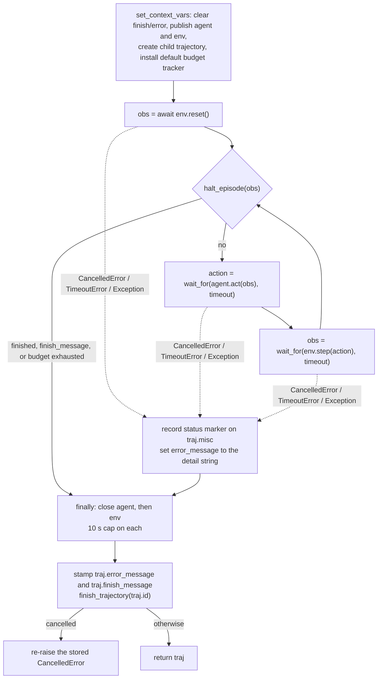
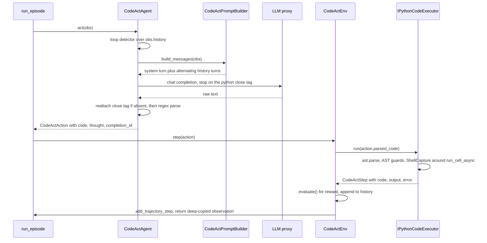

# Agents, environments, episodes

This page explains the design of Platoon's agent core: four Protocols, one five-line loop, and
nine context variables. It is the reference for anyone writing an environment or an agent, and the
explanation of why the core has no base class to inherit and no framework object to construct. For
the delegation machinery built on top of it, see [the fork and sub-agent model](subagents.md).

## Protocols, not base classes

`Env`, `ForkableEnv`, `Agent` and `ForkableAgent` are `typing.Protocol` classes decorated with
`@runtime_checkable`. Nothing in Platoon requires you to subclass them.

```python title="platoon/agents/base.py"
@runtime_checkable
class Agent(Protocol):
    async def act(self, obs: Observation) -> Action: ...

    async def reset(self) -> None: ...

    async def close(self) -> None: ...


@runtime_checkable
class ForkableAgent(Agent, Protocol):
    async def fork(self, task: Task) -> ForkableAgent:
        """Return an independently closeable child agent.

        Implementations that allocate resources before returning must clean up
        partial allocations if the fork raises, including on cancellation.
        """

        ...
```

Three things this buys you.

**Your types do not import the framework.** A plugin's agent or environment can be an ordinary
class wrapping an SDK object. `OpenHandsAgent` in the openhands plugin is a plain class that
drives the OpenHands SDK; it satisfies `Agent` because it has `act`, `reset` and `close`, not
because it inherits anything. That matters because real environments usually already have a base
class they must inherit from — a simulator client, a game engine session — and structural typing
means Platoon never competes for that inheritance slot.

**Test doubles are cheap.** The reference doubles that pin the budget semantics (`MockAgent` /
`MockEnv` in <span class="pl-src">tests/test_step_budget_tracker.py</span>) are about twenty lines
each and import nothing but the dataclasses. `run_episode` cannot tell them from a real pair.

**`isinstance` still works where it is needed.** `@runtime_checkable` makes
`isinstance(x, ForkableEnv)` legal, and the code uses it at exactly the points where a capability
has to be discovered rather than declared: `CodeActEnv.fork` checks
`isinstance(self._code_executor, ForkableCodeExecutor)` before forking, and
`TrajectoryCollection.register_event_handlers` checks `isinstance(h, TrajectoryEventHandler)`
before accepting a sink.

!!! warning "What `runtime_checkable` does not check"
    A runtime protocol check verifies that the named attributes *exist*. It does not check
    signatures, argument names, or whether a method is a coroutine function. An object with a
    synchronous `step(self, action)` passes `isinstance(obj, Env)` and then fails inside the loop
    when `await env.step(...)` gets a non-awaitable. Treat the protocol as documentation plus a
    smoke test, not a type check — run your environment once before wiring it into training.

There is one wrinkle worth knowing about. `CodeActEnv`
(<span class="pl-src">platoon/envs/codeact/env.py</span>) is *declared* as
`@runtime_checkable class CodeActEnv(Protocol)` but is used everywhere as a concrete base class,
with a real `__init__` and real method bodies. Subclassing it works and is the documented path;
nothing in the repository instantiates `CodeActEnv` directly, and on the pinned Python
(`requires-python = "~=3.12.0"`) direct instantiation of a protocol class raises `TypeError`. The
same pattern appears at `class IPythonCodeExecutor(CodeExecutor)`, which never defines `close()`
and therefore inherits the protocol's `async def close(self) -> None: ...` — awaiting it is a
legal no-op.

## The environment contract

```python title="platoon/envs/base.py"
@runtime_checkable
class Env(Protocol):
    async def reset(self) -> Observation: ...

    async def step(self, action: Action) -> Observation: ...

    async def close(self) -> None: ...

    async def observe(self) -> Observation: ...

    @property
    def task(self) -> Task: ...


@runtime_checkable
class ForkableEnv(Env, Protocol):
    async def fork(self, task: Task) -> ForkableEnv:
        """Return an independently closeable child environment.

        Implementations that allocate resources before returning must clean up
        partial allocations if the fork raises, including on cancellation.
        """

        ...
```

The signatures are the smaller half of the contract. The obligations are the part that will cost
you an afternoon if you miss them, because the loop records nothing on your behalf.

| Member | Called by the loop | Obligation |
|---|---|---|
| `reset()` | once, at the top | must call `set_trajectory_task(current_trajectory.get().id, task)` |
| `step(action)` | once per iteration | must call `add_trajectory_step(current_trajectory.get().id, step)` |
| `close()` | in `finally`, 10 s cap | must tolerate being called under cancellation |
| `observe()` | never | exists for forks and external tooling |
| `task` | read by `launch_subagent` | a property, not a plain attribute, in the protocol |
| `fork(task)` | only via `launch_subagent` | must clean up partial allocations if it raises |

**`reset()` must register the task.** Both budget trackers compute the allocation as
`traj.task.max_steps or float("inf")`
(<span class="pl-src">platoon/episode/trajectory.py</span>). If your `reset` does not bind
the task onto the trajectory, `traj.task` stays `None` and the first `halt_episode` call raises
`AttributeError` from inside the budget tracker. `CodeActEnv.reset` does this at
<span class="pl-src">platoon/envs/codeact/env.py</span>.

**`step()` must record the step.** Budget accounting is `len(traj.steps)`. An environment that
forgets `add_trajectory_step` never consumes budget, never emits step events to sinks, and
produces a trajectory with no training data — from the outside it looks like a hang.

**`fork()` owns its own partial state.** The docstring at
<span class="pl-src">platoon/envs/base.py</span> is binding, and the reason is visible in
`launch_subagent`'s cleanup path: it closes only handles that a fork method *successfully
returned*. If your `fork` allocates one container, then raises or is cancelled while allocating
the second, nothing else will ever close the first. Wrap the body in `try/except BaseException`
and clean up before re-raising — `except Exception` is not enough, because cancellation arrives as
`asyncio.CancelledError`, which is a `BaseException`.

**`observe()` is not part of the loop.** `run_episode` never calls it. In `CodeActEnv` it is used
by `fork` to snapshot `parent_state` for the child, and it is where the `return_obs_copy` decision
lives: with the default `True`, every observation handed out is a `deepcopy(self._state)`. That is
why the `CodeActStep` objects inside an observation's `history` are not the same objects as the
ones in `Trajectory.steps`, and why an environment holding uncopyable SDK objects must pass
`return_obs_copy=False`.

### Task, SubTask, Observation

```python title="platoon/envs/base.py"
@dataclass
class Task:
    goal: str | None = None
    id: str | None = None
    max_steps: int | None = None
    misc: dict[str, Any] = field(default_factory=dict)
    fork_strategy: Literal["task", "subtask"] = "subtask"


@dataclass
class Observation:
    task: Task | None = None
    finished: bool = False
    reward: float = 0.0
    misc: dict = field(default_factory=dict)


Action: TypeAlias = Any
ResetAction: Action = "RESET"
```

`Action` is `Any` on purpose: an action is whatever the agent and environment agree on. CodeAct
uses a `CodeActAction` dataclass; a scripted agent can return a bare string. `ResetAction` is
declared here and referenced nowhere else in the repository — treat it as vestigial.

`Task.__str__` is load-bearing, because the prompt builder interpolates `str(obs.task)` into the
first user turn. With `max_steps` set it renders the goal *and* the step budget, so the model is
told how many steps it has. `SubTask` extends `Task` with a `parent_tasks` list and renders the
ancestry into the same string. The `fork` / `fork_strategy` machinery belongs to delegation and is
explained on [the fork and sub-agent model](subagents.md).

## The agent contract

`Agent` is three coroutines. There is one asymmetry that is easy to miss and worth stating
plainly.

!!! warning "`Env.reset()` is called. `Agent.reset()` is not."
    `run_episode` calls `env.reset()`, `agent.act()`, `env.step()` and both `close()` methods. It
    never calls `agent.reset()` — grep the repository and you will find no call site at all. The
    method is part of the protocol and implementations define it (`CodeActAgent.reset` is a
    no-op), but per-episode state initialization placed there will not run. Put it in `__init__`,
    or handle it on the first `act`.

`ForkableAgent` adds `fork(task)` with the same cleanup obligation as `ForkableEnv.fork`.
`CodeActAgent.fork` returns `type(self)(...)` with a forked LLM client and the *shared* prompt
builder — the builder is stateless, so sharing it across a whole subagent tree is safe.

## The episode loop

The whole loop is five lines.

```python title="platoon/episode/loop.py"
obs = await env.reset()
while not halt_episode(obs):
    action = await asyncio.wait_for(agent.act(obs), timeout=timeout)
    obs = await asyncio.wait_for(env.step(action), timeout=timeout)
    step_count += 1
```

```python title="platoon/episode/loop.py"
async def run_episode(agent: Agent, env: Env, verbose: bool = False, timeout: int | None = 300) -> Trajectory:
```

### Halt conditions

```python title="platoon/episode/loop.py"
def halt_episode(obs: Observation) -> bool:
    exhausted_budget = budget_tracker.get().remaining_budget() <= 0
    if exhausted_budget:
        error_message.set("WARNING: Exhausted budget when running episode. Halting episode; task may be incomplete.")
    if finish_message.get(None) is not None:
        obs.finished = True
    return obs.finished or exhausted_budget
```

Three conditions, evaluated in this order on every iteration including the one before the first
step:

1. **Budget exhausted** — `remaining_budget() <= 0`. Note the side effect: this branch *sets*
   `error_message`, so a budget-exhausted episode always carries that WARNING string on its
   trajectory even though nothing failed mechanically.
2. **`finish_message` is set** — any code anywhere in the episode, including model-authored Python
   running in the environment's shell, can call `finish("...")`, which does
   `finish_message.set(message)`. `halt_episode` then forces `obs.finished = True`.
3. **`obs.finished`** — the environment said so.

`CodeActEnv.step` also sets `self._state.finished` when either `finish_message` *or*
`error_message` is set (<span class="pl-src">platoon/envs/codeact/env.py</span>), so the two
mechanisms agree in the common case. `halt_episode` is the backstop for environments that do not
check.

!!! warning "`error_message` terminates a CodeAct episode"
    In `CodeActEnv.step`, a set `error_message` is treated exactly like a set `finish_message`. It
    is not a warning channel. To surface a recoverable problem to the model, write it into the
    step's `error` field — which is what the executor already does for tracebacks — not into the
    `error_message` contextvar.

One subtlety: `halt_episode` mutates the observation it was handed (`obs.finished = True`). With
`return_obs_copy=True` that observation is a deep copy, so the environment's own `_state.finished`
can stay `False` while the loop exits.



### Where the step timeout applies

`timeout` is a **per-step** deadline, and it is applied twice per iteration: once around
`agent.act(obs)` and once around `env.step(action)`. It is not a whole-episode budget. An episode
of 25 steps with `timeout=300` can legitimately run for over two hours.

The whole-rollout deadline is a separate, outer `asyncio.wait_for` inside the plugin's rollout
function. The two knobs are distinct fields of `RolloutConfig`:

| Key | Type | Default | What it does |
|---|---|---|---|
| `step_timeout` | `int` | `300` | passed as `run_episode(timeout=...)`; wraps each `agent.act` and each `env.step` |
| `timeout` | `int \| None` | `None` | the entire rollout, applied by the plugin's own `asyncio.wait_for` |

```python title="plugins/textcraft/platoon/textcraft/rollout.py"
        rollout_task = asyncio.create_task(run_episode(agent, env, timeout=config.step_timeout))
```

`CodeActAgent` additionally passes a hard-coded `"timeout": 1800` to the LLM request
(<span class="pl-src">platoon/agents/codeact/agent.py</span>, flagged with a TODO). If your
`step_timeout` is smaller than 1800 the step deadline wins and the in-flight request is cancelled;
if it is larger the client's own timeout wins. Neither is wrong, but know which one you have.

### The exception taxonomy

`run_episode` catches three things, in this order, and they mean different things downstream.

| Caught | `traj.misc` marker | `error_message` begins | Re-raised |
|---|---|---|---|
| `asyncio.CancelledError` | `trajectory_cancelled` | `Episode cancelled at step N` | yes, after cleanup |
| `asyncio.TimeoutError` | `trajectory_timed_out` | `Episode timed out at step N` | no |
| `Exception` | none | `Error in episode loop at step N` | no |

The marker names are constants in
[`platoon/utils/trajectory_status.py`](https://github.com/ApGa/platoon/blob/main/platoon/utils/trajectory_status.py):
`TRAJECTORY_CANCELLED_MISC_KEY` and `TRAJECTORY_TIMED_OUT_MISC_KEY`. A third,
`TRAJECTORY_INVALID_MISC_KEY`, is not set by the loop — environments set it themselves when they
decide a completed result is not trustworthy. `trajectory_was_interrupted()` is the disjunction of
all three, and the data converters use it to decide that a trajectory's policy tokens must not be
trained on. Each predicate also has a string fallback that scans `error_message`, so trajectories
replayed from older event logs are still classified correctly.

All three handlers record the same three-part detail string: a summary line naming the step index
and the innermost traceback frame (`filename:lineno in func`), then the exception class and
message, then the full formatted traceback. That is why the fallbacks can match on
`"Episode cancelled"` and `"\nTimeoutError:"`.

The distinction between the first two rows is the one that matters operationally.
`CancelledError` means *something outside this episode killed it* — the rollout deadline fired, or
a subprocess watchdog cancelled the task. `TimeoutError` means *this episode's own per-step
deadline fired*, from one of the two `asyncio.wait_for` calls in the loop. A cancellation
delivered by an outer `wait_for` reaches the loop as `CancelledError` and takes the first branch,
not the second; <span class="pl-src">tests/test_episode_cancellation.py</span> pins both cases.

The third row catches only `Exception`, which is why the first row exists at all:
`CancelledError` derives from `BaseException` in modern Python and would otherwise escape without
finalizing the trajectory.

### Why cancellation is re-raised

```python title="platoon/episode/loop.py"
# Returning from the old ``finally`` block swallowed task cancellation, so
# the outer rollout timeout waited until the subprocess SIGALRM (93 minutes
# in the recursive configuration).  Preserve the finalized partial
# trajectory for event sinks, then propagate cancellation to the caller.
if cancelled_error is not None:
    raise cancelled_error
```

This is the shape you want for any cancellable coroutine that owns resources, and the comment
records what went wrong when it was not. The old code caught the `CancelledError`, ran its
`finally` block, and then `return`ed normally — which swallows the cancellation. The outer
`asyncio.wait_for` had no idea its child had been cancelled and kept waiting until a process-level
SIGALRM fired, 93 minutes later in the recursive configuration.

The fix separates the two jobs. Finalization still happens: `traj.error_message` and
`traj.finish_message` are stamped and `finish_trajectory` fires, so event sinks see the partial
trajectory and the visualization tooling can replay a killed episode. Only then is the stored
`CancelledError` re-raised. Callers get their cancellation; the sinks get their data.

### The bounded close

```python title="platoon/episode/loop.py"
EPISODE_CLOSE_TIMEOUT_SECONDS = 10.0


async def _close_episode_resource(resource: Any, resource_name: str) -> None:
    """Close one episode resource without allowing cleanup to hang forever."""

    try:
        await asyncio.wait_for(
            resource.close(),
            timeout=EPISODE_CLOSE_TIMEOUT_SECONDS,
        )
    except asyncio.TimeoutError:
        # The rollout subprocess has a process-tree hard deadline as a final
        # backstop.  Do not let one broken SDK close method suppress the
        # cancellation that should trigger that backstop.
        print(
            f"[EpisodeLoop] Timed out closing {resource_name} after "
            f"{EPISODE_CLOSE_TIMEOUT_SECONDS:.1f}s"
        )
    except BaseException:
        pass
```

The agent is closed first, then the environment. Each gets ten seconds; a slow close is reported
on stdout and then abandoned, and every other exception — including one raised *inside* `close` —
is swallowed. This is deliberate. Cleanup runs on the unhappy path by definition, and a
third-party SDK whose `close()` raises must not be able to replace a `CancelledError` with its own
exception and thereby defeat the outer deadline.

Two consequences for you as an implementer: a `close()` that takes longer than ten seconds leaks
whatever it was releasing, and a `close()` that raises fails silently. If your environment holds
something expensive — a container, a remote session — make teardown fast and idempotent, and do
your own logging inside `close`.

## The contextvar design

Almost nothing is passed as an argument. Episode state lives in nine `ContextVar`s.

```python title="platoon/episode/context.py"
current_agent: ContextVar["Agent"] = ContextVar("current_agent")
current_env: ContextVar["Env"] = ContextVar("current_env")
current_trajectory: ContextVar["Trajectory"] = ContextVar("current_trajectory")
current_trajectory_collection: ContextVar["TrajectoryCollection"] = ContextVar("current_trajectory_collection")
error_message: ContextVar[str | None] = ContextVar("error_message", default=None)
budget_tracker: ContextVar["BudgetTracker"] = ContextVar("budget_tracker")
finish_message: ContextVar[str | None] = ContextVar("finish_message", default=None)
episode_step_timeout: ContextVar[int] = ContextVar("episode_step_timeout", default=300)
subagent_reward_judge_config: ContextVar[object | None] = ContextVar(
    "subagent_reward_judge_config",
    default=None,
)
```

| Variable | Default | Written by | Read by |
|---|---|---|---|
| `current_agent` | none | `set_context_vars` | `launch_subagent`, to fork the agent |
| `current_env` | none | `set_context_vars` | `launch_subagent`, to fork the env and read `env.task` |
| `current_trajectory` | none | `set_context_vars` | environments, budget trackers, subagents |
| `current_trajectory_collection` | none | the rollout function; `set_context_vars` if unset | environments, budget trackers |
| `error_message` | `None` | `run_episode`, `halt_episode` | `CodeActEnv.step`, finalization |
| `budget_tracker` | none | the rollout function; `set_context_vars` if unset | `halt_episode`, `launch_subagent` |
| `finish_message` | `None` | the `finish()` action and env actions | `halt_episode`, `Trajectory.add_step`, finalization |
| `episode_step_timeout` | `300` | `set_context_vars` | `launch_subagent`, so children inherit the deadline |
| `subagent_reward_judge_config` | `None` | the rollout function | `launch_subagent` |

The four without defaults raise `LookupError` when read before an episode has been established.
That is intentional: reading `current_trajectory` outside an episode is a bug, not a default.

The `finish()` action is the whole design in three lines:

```python title="platoon/agents/actions/common.py"
def finish(message: str = "") -> str:
    """End the agent trajectory and provide a message to the user.
    ...
    """
    finish_message.set(message)
    return message
```

It is an ordinary function with no reference to the loop, the environment, or the trajectory. It
is injected into the model's Python namespace like any other tool, and calling it ends the
episode.

### How a child trajectory is established

```python title="platoon/episode/loop.py"
def set_context_vars(agent: Agent, env: Env, timeout: int | None):
    finish_message.set(None)
    error_message.set(None)
    episode_step_timeout.set(timeout)
    current_agent.set(agent)
    current_env.set(env)

    if current_trajectory_collection.get(None) is None:
        current_trajectory_collection.set(TrajectoryCollection())

    parent_traj = current_trajectory.get(None)
    current_trajectory.set(current_trajectory_collection.get().create_trajectory(parent_traj=parent_traj))

    if budget_tracker.get(None) is None:
        budget_tracker.set(StepBudgetTracker())
```

The important line is the parent read. `set_context_vars` reads whatever `current_trajectory`
*already* holds, passes it to `create_trajectory` as the parent, and then overwrites the variable
with the new child. `create_trajectory` records `ParentInfo(id=parent.id,
fork_step=len(parent.steps))`.

So the tree builds itself. A root episode finds no `current_trajectory` and becomes a root; a
nested `run_episode` launched from inside a running episode finds the parent's trajectory and
becomes its child, stamped with the step index at which delegation happened. No caller passes a
parent id anywhere, and no environment has to know it is running as a subagent.

Note the two lazy installs. A `TrajectoryCollection` and a `StepBudgetTracker` are created only if
the variables are unset, which is the seam for swapping the budget policy: set `budget_tracker` to
a `DepthAwareStepBudgetTracker` *before* calling `run_episode` and `set_context_vars` leaves it
alone. TextCraft's recursive rollout does exactly that, with a comment saying why.

### The rule this implies

```python title="platoon/episode/loop.py"
# NOTE: Call using asyncio.create_task() to make sure edits to contextvars do not leak to parent context
```

!!! danger "Always launch `run_episode` with `asyncio.create_task`"
    `run_episode` overwrites `current_trajectory`, `finish_message`, `error_message`,
    `current_agent` and `current_env` in whatever context it runs in. A bare
    `await run_episode(...)` runs in the caller's context, so those writes are permanent: the
    caller's `current_trajectory` now points at the child, and a `finish()` inside the child ends
    the *parent's* episode. `asyncio.create_task` copies the context, so the writes stay inside
    the task.

Every rollout function in the repository follows this, and so does `launch_subagent` when it runs
a child episode.

The trade-off is real and worth naming. Context variables buy recursion almost for free: model-
authored Python running several frames deep inside an IPython shell inside an environment can call
`await launch_subagent(goal)`, and that call knows which agent to fork, which trajectory to attach
to and how much budget is left, without a single one of those things being threaded through the
environment's API. Adding a new episode-scoped concern costs one module-level variable rather than
a parameter on four protocols.

The cost is that the dependency is invisible. Nothing in the signature of `run_episode` says it
mutates caller state; `create_task` is an unenforced convention that lives in a comment; and a
test that calls `run_episode` twice in the same context will silently see the second episode
adopt the first as its parent. Static analysis cannot help you here. If you are writing a new
rollout function, copy the `create_task` line before you copy anything else.

The propagation direction is what makes `finish()` work at all. A `ContextVar.set()` performed
inside `await shell.run_cell_async(code)` **is** visible to the caller afterwards — the IPython
shell runs the cell in the caller's context — whereas a set performed inside
`asyncio.create_task(...)` is not. Both halves are pinned by
<span class="pl-src">tests/test_context_var_in_ipshell.py</span>. Model code setting
`finish_message` reaches the loop; a nested episode's writes do not.

## CodeAct in depth

CodeAct is the reference agent/environment pair: the agent emits a thought and a Python block, the
environment executes the block in an embedded IPython shell whose namespace has been pre-populated
with the environment's action functions, and the captured stdout/stderr becomes the next
observation. Nearly every plugin is a variation on this.



### The agent loop

`CodeActAgent.act` does five things, in order.

1. **Loop detection, before any model call.** `_stuck_in_loop` reads the codes in `obs.history`
   and searches for a repeating pattern of period 1 to `stuck_in_loop_window` (default 3) that
   repeats at least `stuck_in_loop_threshold` (default 4) times at the tail. If it finds one,
   `act` returns a synthetic action without contacting the model:
   `CodeActAction(parsed_code="finish('Stuck in a loop, terminating early.')", ...)` with
   `misc["usage"] = {}` and `misc["model"] = None`. That step has **no `completion_id`**, so the
   training converters skip it — which is correct, since no model call produced it.
2. **Build the prompt** via `self.prompt_builder.build_messages(obs)`.
3. **Call the model** with `stop=["</python>"]`, `max_completion_tokens` from `InferenceParams`,
   the hard-coded `timeout` of 1800, and `temperature` / `top_p` forwarded only when they are not
   `None`.
4. **Repair the stop sequence:**

   ```python title="platoon/agents/codeact/agent.py"
   # NOTE: We only do this conditionally, because with Areal, stop words are not supported.
   # And so we might already have the stop word in the response.
   if "</python>" not in response_text:
       response_text += "</python>"
   ```

5. **Parse and stamp.** `parse_raw_action` runs `extract_code_and_thought`, then:

   ```python title="platoon/agents/codeact/agent.py"
   action.misc["usage"] = response.usage.to_dict()
   action.misc["model"] = response.model
   action.misc["completion_id"] = response.id
   ```

   `completion_id` is the join key between this trajectory step and the inference proxy's token
   export. Without it the step contributes no training data — see
   [the data pipeline](data-pipeline.md).

### Action parsing

```python title="platoon/agents/codeact/agent.py"
def extract_code_and_thought(raw_action: str) -> tuple[str, str]:
    # Try to extract both code and thought in the expected format
    match = re.search(r"<thought>(.*?)</thought>\n<python>(.*?)</python>", raw_action, re.DOTALL)
    if match:
        thought = match.group(1)
        code = match.group(2)
        return code, thought
    ...
```

The strict pattern requires exactly one newline between the closing thought tag and the opening
python tag. When it does not match, the function falls back to two independent searches, so a
response with only a python block — the `include_reasoning=False` case — still parses. A response
with neither yields `("", "")`, which reaches the executor as empty code and comes back as a step
whose error is `"No code available to execute."`.

### Prompt modes

`PromptMode` is `Literal["sequence_extension", "no_sequence_extension"]`, defaulting to
`"sequence_extension"`.

=== "sequence_extension"

    The conversation grows by appending two turns per step:

    ```text
    - [System] Initial instructions
    - [User] Task description + action space + instruction to start
    - [Assistant] Action 0
    - [User] Output 0
    - [Assistant] Action 1
    - [User] Output 1
    ```

    Step *N+1*'s prompt is literally step *N*'s prompt plus two messages. The exported token
    sequences are therefore prefixes of each other, and the data converters merge an entire
    multi-step trajectory into a single training sequence.

=== "no_sequence_extension"

    The legacy format. Every step rebuilds one system message and one large user message that
    embeds the whole action history, rendered by `build_action_history_description` as `Cell i:`
    followed by `str(step)` for each step.

The choice is not cosmetic. Under `no_sequence_extension` consecutive prompts are not prefixes,
prefix merging fails, and both training converters emit one sequence per step instead of one per
trajectory — the same tokens are re-encoded and re-trained once per turn.
<span class="pl-src">tests/test_sequence_extension_prompts.py</span> asserts the character-level
prefix property for the default mode and the absence of it for the legacy one. Use the legacy mode
only if your environment genuinely cannot express its history as an append-only conversation.

`include_reasoning` (default `True`) is threaded through three places: `system.jinja` and
`user-next-action-str.jinja` switch between instructing the model to emit a thought block plus a
python block or a python block alone, and `_format_action_for_history` drops the thought when
replaying past assistant turns. Setting it to `False` keeps the two consistent — the model is
never shown examples of a format it was told not to use. The number-search rollout does exactly
that.

### The prompt builder seam

`CodeActPromptBuilder` renders Jinja templates through `PromptRetriever`. Four methods are meant
to be overridden:

| Method | Renders | Typical override |
|---|---|---|
| `build_system_prompt(obs, **context)` | `system.jinja` | inject `env_specific_system_context` |
| `build_next_action_str(obs, **context)` | `user-next-action-str.jinja` | change the per-turn instruction |
| `build_user_prompt(obs, **context)` | `user.jinja` | only reached in `no_sequence_extension` |
| `build_action_history_description(obs)` | built programmatically | truncate long histories |

The lightest-touch customization is the `env_specific_system_context` slot in `system.jinja`:
override `build_system_prompt`, `context.setdefault("env_specific_system_context", ...)`, and call
`super()`. Fully replacing the system prompt with a literal string also works and is what
number-search does. Every plugin builds its builder in the agent's `__init__` unless one was
passed in:

```python title="plugins/number-search/platoon/number_search/agent.py"
    def __init__(
        self,
        prompt_mode: PromptMode = "sequence_extension",
        include_reasoning: bool = True,
        **kwargs,
    ):
        if "prompt_builder" not in kwargs:
            kwargs["prompt_builder"] = NumberSearchPromptBuilder(
                prompt_mode=prompt_mode,
                include_reasoning=include_reasoning,
            )
        super().__init__(prompt_mode=prompt_mode, include_reasoning=include_reasoning, **kwargs)
```

!!! warning "A template typo degrades the prompt instead of failing"
    `PromptRetriever` configures Jinja with `StrictUndefined`, so a missing variable raises. But
    `_build_initial_user_message` and `_format_observation_for_history` each wrap the render in a
    bare `except Exception` and fall back to building the string programmatically. The episode
    keeps running with a subtly different prompt and nothing is logged. If you edit those
    templates, render them once directly through `PromptRetriever` to confirm they work.

`build_messages_from_traj_dump` raises `NotImplementedError` in the base class; only the appworld
plugin implements it.

### The IPython executor

```python title="platoon/envs/codeact/env.py"
class IPythonCodeExecutor(CodeExecutor):
    def __init__(
        self,
        task: Task,
        actions: tuple[Callable[..., object], ...] | Sequence[Callable[..., object]] = (finish, safe_asyncio),
        detect_unawaited_async_calls: bool = True,
        detect_while_loops: bool = False,
        detect_interactive_input: bool = False,
    ):
```

**Your action space is a tuple of Python callables.** `_create_shell` injects each one into the
shell namespace under its own `__name__`:

```python title="platoon/envs/codeact/env.py"
        for action in self.actions:
            shell.user_ns[action.__name__] = action
```

Closures work — number-search passes `guess_factory(task.misc["target"])`, so the target is
captured in the closure and stays invisible to the model. Bound methods work, because they have
`__name__`. Even `safe_asyncio` works, because `SafeAsyncio` sets a class-level
`__name__ = "asyncio"` for exactly this reason.

`_create_shell` does three more things worth knowing:

- **IPython history is disabled** (`config.HistoryManager.enabled = False`). The comment explains
  why: history "keeps files open preventing making > ~50 envs". Do not re-enable it in a
  high-fanout rollout.
- **`sys.excepthook` is saved and restored** around shell construction, so embedding a shell does
  not change traceback formatting for the whole process.
- **`__import__` is replaced on a *copy* of `__builtins__`**, so `import asyncio` inside the shell
  returns `safe_asyncio` rather than the real module. The copy is essential — patching the global
  builtins would make the sandboxed import call itself.

`SafeAsyncio` re-exports `gather`, `create_task`, `sleep`, `wait`, `wait_for`, `as_completed`,
`shield`, the synchronization primitives and read-only introspection. Everything else reaches
`__getattr__` and raises `RuntimeError`. `get_event_loop`, `new_event_loop`, `run` and
`set_event_loop_policy` are the ones that matter: any of them would deadlock or hijack the single
event loop that is running every concurrent rollout in the process.

`run(code)` is a pipeline of cheap rejections before anything executes:

1. `code.strip()`, then `ast.parse`. A `SyntaxError` returns a step whose `error` starts with
   `"Execution failed. Traceback:\nSyntax error in line:"` and quotes the offending line.
2. Empty code returns `"No code available to execute."`. The parse happens first and
   `ast.parse("")` succeeds, so empty input does reach this branch.
3. Three AST guards, each returning an error step without executing:
    - `UnawaitedAsyncCallDetector` — **on by default**. Flags bare calls to a hard-coded name set
      (`launch_subagent`, `search_web`, `view_webpage_content`, `search_emails`, `read_email`)
      that are neither inside an `await` nor inside a `gather` / `wait` / `wait_for` /
      `create_task` / `as_completed` call. The error text tells the model the exact fix. Your own
      async tool is **not** covered unless you subclass the detector and extend `ASYNC_FUNCTIONS`.
    - `WhileLoopDetector` — off by default. Rejects any `while`, quoting the condition source.
      Turn it on if your model has a habit of spinning the shared event loop.
    - `InteractiveInputDetector` — off by default. Rejects `input()`.
4. `with ShellCapture() as capture: await self.shell.run_cell_async(code)`, then ANSI stripping on
   both streams.

`ShellCapture` swaps two context variables for the duration and reference-counts installation of
the `sys.stdout` / `sys.stderr` proxies, so the real streams come back as soon as the last capture
scope closes. Its docstring warns that one instance must not be shared across concurrent tasks;
`run` constructs a fresh one per call.

!!! warning "The `Out[...]` heuristic can eat real output"
    If captured stdout starts with `Out[`, the executor keeps only the text after the first colon.
    A cell whose first printed line legitimately begins with `Out[` loses that prefix. The source
    flags this with a TODO.

### How observations get back to the model

`CodeActEnv.step` is where a step is assembled, scored and recorded:

```python title="platoon/envs/codeact/env.py"
            step = await self._code_executor.run(action.parsed_code)

            if finish_message.get(None) is not None or error_message.get(None) is not None:
                self._state.finished = True
                self._state.misc["finish_message"] = finish_message.get()

            step.thought = action.parsed_thought
            step.reward, reward_info = await self.evaluate()
            step.misc["action_misc"] = action.misc
            step.misc["reward_misc"] = reward_info
            self._state.reward += step.reward
            self._state.history.append(step)

            traj_collection = current_trajectory_collection.get()
            traj_collection.add_trajectory_step(traj.id, self._state.history[-1])
            if self._state.finished:
                traj.reward = self._state.reward
```

`evaluate()` is the reward hook; the base returns `(0.0, {})` and you override it. The convention
is that any key in the returned dict starting with `reward/` is picked up by reward processors,
with `reward/success` as the canonical scalar. See [rewards](../customization/rewards.md).

The observation returned is `deepcopy(self._state)` — a `CodeActObservation` carrying `task`,
`action_space`, `finished`, `reward` and the full `history` of `CodeActStep`s. The prompt builder
turns each history entry back into two chat turns: the assistant turn is reconstructed from
`step.thought` and `step.code`, and the user turn is `user-observation.jinja`:

```jinja title="platoon/agents/codeact/prompts/user-observation.jinja"
[Cell {{ step_index }} Output]
{{ output }}(No output)

Error: {{ error }}

Provide your next action.
```

The round trip is therefore lossy by design: the model sees its own code and thought replayed as
text, plus stdout and stderr, and nothing else. `step.reward` and `step.misc` stay on the
trajectory and never reach the prompt.

The action space reaches the model through `describe_action_space()`, called once in `reset` and
stored on the observation. `IPythonCodeExecutor.describe_action_space` returns `""` in the base
class, and `user-initial.jinja` guards the section with `` — so
if you forget to override it, the model gets no tool documentation and the prompt silently omits
the heading entirely. Overriding it is the highest-value single change for a new CodeAct
environment.

## Trajectory, collection, events

```python title="platoon/episode/trajectory.py"
@dataclass
class Trajectory:
    id: str
    task: Task | None = None
    parent_info: ParentInfo | None = None
    steps: list[TrajectoryStep] = field(default_factory=list)
    reward: float = 0.0
    finish_message: str | None = None
    error_message: str | None = None
    misc: dict[str, Any] = field(default_factory=dict)

    def add_step(self, step: TrajectoryStep) -> None:
        self.steps.append(step)
        if finish_message.get(None) is not None:
            self.finish_message = finish_message.get()
        reward = getattr(step, "reward", None)
        if reward is not None:
            self.reward += reward
```

A `TrajectoryCollection` is a **flat** `dict[str, Trajectory]`. The tree is encoded entirely by
`Trajectory.parent_info`, which holds the parent's id and the parent's step count at fork time.
Flat storage is what makes `to_dict()` one JSON object and what lets the data converters iterate
every trajectory in a tree without recursion.

Two details about `add_step` are worth internalizing. It reads `step.reward` through `getattr`, so
a step recorded as a plain dict — nothing enforces `TrajectoryStep`, and the tests push raw dicts
— contributes exactly zero reward. And `Trajectory.reward` is written two different ways:
`add_step` *accumulates* it, while `CodeActEnv.step` *assigns* `traj.reward = self._state.reward`
on the finishing step. For CodeAct both are the same sum, so they agree; a custom environment that
assigns `traj.reward` to anything other than the running sum of step rewards will see the next
`add_step` accumulate on top of it. Downstream code that needs a trustworthy scalar reads
`steps[-1].misc["reward_misc"]["reward/success"]` instead.

`to_dict()` serializes by walking dataclass `fields()` rather than calling `dataclasses.asdict()`,
and the comment explains why:

```python title="platoon/episode/trajectory.py"
    # Walk dataclass fields WITHOUT dataclasses.asdict(): asdict() deep-copies
    # every leaf value, and trajectory steps embed live SDK objects (e.g.
    # OpenHands events holding a threading.Lock / asyncio.Future) that cannot be
    # copied/pickled. Recursing via _to_jsonable instead routes those through
    # model_dump()/str() below rather than copy.deepcopy.
```

### Event handlers

```python title="platoon/episode/trajectory.py"
@runtime_checkable
class TrajectoryEventHandler(Protocol):
    def on_trajectory_created(self, trajectory: Trajectory) -> None:
        pass

    def on_trajectory_step_added(self, trajectory: Trajectory, step: TrajectoryStep) -> None:
        pass

    def on_trajectory_task_set(self, trajectory: Trajectory, task: Task | None) -> None:
        pass

    def on_trajectory_finished(self, trajectory: Trajectory) -> None:
        """Called when a trajectory is finalized. ..."""
        pass
```

Four synchronous callbacks, fired from `create_trajectory`, `add_trajectory_step`,
`set_trajectory_task` and `finish_trajectory` respectively. `register_event_handlers` accepts one
handler or an iterable and raises `ValueError` for anything that fails the runtime protocol check
— which means your handler must have all four methods. The convenient route is to subclass
`TrajectoryEventHandler` and inherit the no-op bodies, overriding only what you care about; that
is what `JsonlFileSink`, `QueueSink` and `MarkdownFileSink` do.

**Handler exceptions are swallowed on purpose.** All four call sites wrap the dispatch in
`try/except Exception`. `create_trajectory` swallows silently with the comment "Best-effort: do not
let handlers break rollout"; the other three print a one-line diagnostic and continue. The
reasoning is that sinks are observability, and observability must never be able to fail a training
rollout — a full disk under a JSONL sink should cost you a log file, not a batch of GPU-hours.

The flip side is that a subtly broken sink is nearly silent. If your sink is not producing what
you expect, look on stdout for `Error in on_trajectory_step_added for trajectory ...`, and be
aware that a handler raising inside `on_trajectory_created` produces no message at all.

These events are also what the visualization tooling consumes: `JsonlFileSink` writes one JSON
line per event with `type` in `trajectory_created`, `trajectory_task_set`,
`trajectory_step_added`, `trajectory_finished`, each carrying `collection_id`, `process_id` and a
wall-clock `ts`. See [the visualization tutorial](../tutorials/visualization.md).

## See also

- [Core concepts](../get-started/concepts.md) — the same vocabulary at a lower altitude.
- [The fork and sub-agent model](subagents.md) — forking, budget trackers, `launch_subagent`.
- [Custom environment](../customization/environment.md) and
  [custom agent](../customization/agent.md) — the how-to versions of the contracts above.
- [Plugin anatomy](../walkthroughs/plugin-anatomy.md) — where these pieces live in a real plugin.
- [Data pipeline](data-pipeline.md) — how `completion_id`, `reward_misc` and the status markers
  become training tensors.
