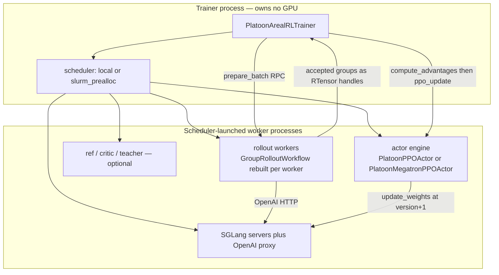
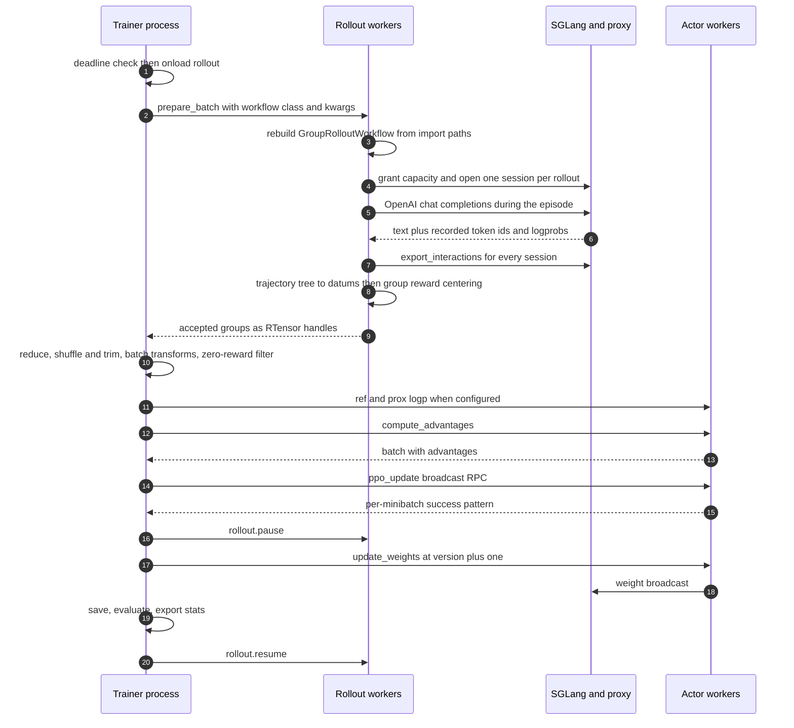

# AReaL backend internals

Platoon's AReaL backend is a thin, opinionated layer on top of upstream
[AReaL](https://github.com/inclusionAI/AReaL)'s single-controller PPO trainer. AReaL owns the
distributed machinery — schedulers, RPC workers, FSDP/Megatron train engines, SGLang inference
engines, weight broadcast, checkpointing. Platoon owns how a rollout becomes a training batch, and
patches upstream wherever the agentic workload breaks an assumption the upstream code makes. This
page is for someone who has to modify or debug that layer.

If you only want to run a job, read [A training run, end to end](../walkthroughs/training-run.md)
and the [configuration reference](../reference/configuration.md) instead.

## This layer is pinned to one AReaL revision

Platoon does not depend on a released AReaL version. It depends on a git revision:

```toml title="pyproject.toml"
[tool.uv.sources]
areal = { git = "https://github.com/inclusionAI/AReaL.git", rev = "d99124ec15102ca2fcd4960cc8beaef3950c2672" }
```

Treat that pin as part of the source. Everything under `platoon/train/areal/` subclasses,
monkey-patches, or reads private attributes of that specific revision:
`PPOTrainer._create_train_engine`, `RemoteInfEngine._resolve_workflow`,
`SlurmScheduler.fork_workers`, Megatron-Core internals, SGLang scheduler internals. Bumping the pin
is a code change, not a dependency bump, and the patch layer is where breakage surfaces first —
most patches guard themselves and raise rather than silently no-op, which is deliberate.

!!! warning "The pinned revision is not vendored"
    AReaL is fetched by `uv` at install time. If you need to read upstream code, find it in your
    resolved environment (`python -c "import areal, os; print(os.path.dirname(areal.__file__))"`)
    rather than assuming that some checkout you already have matches the pin. Details of upstream
    internals differ between revisions in ways that matter here.

## The single-controller model

Everything runs in AReaL single-controller mode, and this is enforced rather than assumed:

```python title="platoon/train/areal/rl.py"
def _start_platoon_proxies(self) -> None:
    if not is_single_controller():
        raise NotImplementedError("Platoon's updated AReaL integration requires single-controller mode")
    if not isinstance(self.rollout, RolloutController):
        raise TypeError("Expected rollout to be a RolloutController in single-controller mode")
```

<span class="pl-src">platoon/train/areal/rl.py</span>

The consequence is the single most important thing to internalize about this backend: **the process
you launched is not the process doing GPU work.** `PlatoonArealRLTrainer` runs in a controller
process that owns no GPU. The actor, reference, critic, teacher and rollout engines live in worker
processes that the scheduler launches, and the trainer drives them over RPC. What reads as
`self.actor.ppo_update(batch)` is a broadcast RPC to a set of remote workers; the object the
trainer holds is a `PlatoonPPOActorController`, not an engine.



Three practical consequences follow.

**Environment variables must be injected into worker launch specs, not exported in your shell.**
Setting `PYTORCH_CUDA_ALLOC_CONF` before `python train_areal.py` configures the allocator of a
process that never allocates. Platoon therefore writes it into every engine's scheduling spec
during config validation:

```python title="platoon/train/areal/config_defs.py"
def _ensure_expandable_segments_env(specs) -> None:
    """Inject the CUDA allocator setting into worker launch envs.

    In single-controller AReaL, the trainer object is not the process doing the
    heavy GPU work. The actual actor/ref/critic/teacher and rollout engines run
    in scheduler-launched worker processes, so the allocator setting must be in
    their inherited environment before CUDA is initialized there.
    """

    if specs is None:
        return
    for spec in specs:
        current = spec.env_vars.get("PYTORCH_CUDA_ALLOC_CONF", "")
        if "expandable_segments:" in current:
            continue
        if current:
            spec.env_vars["PYTORCH_CUDA_ALLOC_CONF"] = f"{current},expandable_segments:True"
        else:
            spec.env_vars["PYTORCH_CUDA_ALLOC_CONF"] = "expandable_segments:True"
```

<span class="pl-src">platoon/train/areal/config_defs.py</span>. It runs at the end of
`PlatoonArealRLTrainerConfig.__post_init__` against `rollout.scheduling_spec`,
`actor.scheduling_spec`, and the specs of `ref`, `critic` and `teacher` when those are not `None`.
If you need another variable inside worker processes, put it in `<engine>.scheduling_spec[].env_vars`
in your YAML, or in the scheduler's own launch environment (see
[preallocated Slurm](#preallocated-slurm)).

**Memory hygiene is an RPC.** The pre-migration SPMD trainer called `torch.cuda.empty_cache()` on
every rank between phases. The controller has no cache to empty, so `PlatoonPPOActor` and
`PlatoonMegatronPPOActor` each expose `clear_device_cache()`, which calls
`current_platform.clear_memory()` on the worker. The trainer invokes it through
`_maybe_clear_device_cache` (<span class="pl-src">platoon/train/areal/rl.py</span>) before
NCCL-heavy phases — weight-update broadcast and DCP checkpoint save — because NCCL allocates its
buffers outside PyTorch's caching allocator, and a full cache at that moment is what turns a
working config into an OOM. Engines without the method, such as a stock AReaL critic, are skipped.

**Anything the workers need must be importable in the workers.** Rollout functions, task loaders,
reward processors and custom losses are resolved by import path inside worker processes. That is
why workflow serialization exists, and why registering a custom loss only in your training script
is not enough.

## Patches are applied at import time

```python title="platoon/train/areal/__init__.py"
# Apply areal patches before importing areal-dependent modules
from platoon.train.areal.patches import apply_all_patches

apply_all_patches()

from platoon.train.areal.actor import (  # noqa: E402
```

The `noqa: E402` markers on every subsequent import are load-bearing. Several patches must land
before the modules they patch are imported by Platoon's own code. Adding an import above
`apply_all_patches()` can silently disable a patch.

The same file lazily exposes `PlatoonMegatronPPOActor` through a module-level `__getattr__`, because
`MegatronPPOActor` transitively triggers an unconditional `import transformer_engine`, which
FSDP-only installs do not have. `platoon/train/areal/actor.py` does the same one level down: the
Megatron actor *class* is built inside `_get_platoon_megatron_actor_cls()` on first use.

## Engine placement: decoding the backend strings

Both backend strings are required. There are no defaults:

```python title="platoon/train/areal/config_defs.py"
if not self.rollout.backend:
    raise ValueError("rollout.backend must be set explicitly")
if not self.actor.backend:
    raise ValueError("actor.backend must be set explicitly")
if self.ref is not None and not self.ref.backend:
    self.ref.backend = self.actor.backend
```

Each string is one `ModelAllocation` spec, parsed by AReaL's lark grammar in
`areal/api/alloc_mode.py`. The shape is `<backend>:<dims>`, where each dim is one letter followed by
a positive integer, concatenated with no separator:

| Letter | Dimension | Where it is accepted |
|---|---|---|
| `d` | data parallel | inference and training |
| `t` | tensor parallel | inference and training |
| `p` | pipeline parallel | inference and training |
| `c` | context parallel | training only |
| `e` | expert parallel | training only |

Inference backends are `sglang` and `vllm`; training backends are `fsdp`, `megatron` and `archon`.
An allocation's world size is `d * t * p * c`. FSDP rejects `p > 1` and `e > 1`.

The grammar lives upstream, so it is the one place on this page where the pin matters most: check
`areal/api/alloc_mode.py` in your resolved environment if a spec you expect to work is rejected.

Real pairs from committed configs:

```yaml
rollout:
  backend: sglang:d4p1t1     # 4 independent SGLang replicas, 1 GPU each
actor:
  backend: fsdp:d4p1t1c1     # 4-way FSDP data parallel
```

```yaml
rollout:
  backend: sglang:d12p1t8    # 12 replicas, tensor-parallel across 8 GPUs each
actor:
  backend: "megatron:(attn:d10p2t4c2|ffn:d10p2t1e8)"
```

The parenthesized form is the hybrid MoE syntax, and it is the one people misread. `attn:` accepts
`d`/`t`/`p`/`c`; `ffn:` accepts `d`/`e`/`t`/`p`. The two halves must agree on pipeline size — FFN
pipeline size is inherited from attention when omitted and rejected when it conflicts — and FFN
data parallelism is derived from the world size when omitted. So
`megatron:(attn:d10p2t4c2|ffn:d10p2t1e8)` runs attention with DP 10, PP 2, TP 4, CP 2, and the
expert blocks with DP 10, PP 2, expert TP 1, EP 8.

!!! warning "Quote the hybrid form in YAML"
    Committed configs are inconsistent about this; quote it. It is a plain scalar containing
    parentheses and a pipe, and it will eventually meet a YAML feature that cares.

Two rules that catch people:

- Multi-component strings containing `+` are rejected. There is no `allocation_mode` key any more —
  each engine carries its own `backend`, and a legacy `allocation_mode` in a YAML is a hard schema
  error.
- A bare parallelism spec with no backend prefix, like `d4t2`, is rejected with an explicit
  message. Auto-backend selection was removed upstream.

`_create_train_engine` is where the parsed string picks a class:

```python title="platoon/train/areal/rl.py"
def _create_train_engine(self, actor_config, alloc):
    actor_cls: type[PlatoonPPOActor | PlatoonMegatronPPOActor] | None = None
    if isinstance(actor_config, PlatoonPPOActorConfig):
        if alloc.backend == "fsdp":
            actor_cls = PlatoonPPOActor
        elif alloc.backend == "megatron":
            # Deferred import: pulls in Megatron / Transformer Engine only
            # when the Megatron backend is actually selected.
            from platoon.train.areal.actor import PlatoonMegatronPPOActor

            actor_cls = PlatoonMegatronPPOActor
    if actor_cls is not None:
        if is_single_controller():
            actor = actor_cls.as_controller(actor_config, self.scheduler)
        else:
            actor = actor_cls(actor_config)
        actor.create_process_group(parallel_strategy=alloc.parallel)
        return actor
    return super()._create_train_engine(actor_config, alloc)
```

Note the fall-through: an engine whose config is not a `PlatoonPPOActorConfig` — a critic, for
instance — gets upstream's engine, without Platoon's loss selection or numerical guards.

The scheduler is chosen by one string:

```python title="platoon/train/areal/rl.py"
def _init_scheduler(self):
    if self.config.scheduler.type == "slurm_prealloc":
        return PreallocatedSlurmScheduler(exp_config=self.config)
    return super()._init_scheduler()
```

`scheduler.type` defaults to `"local"` when unset; Platoon fills it in during `__post_init__`
because the single-controller path needs a concrete scheduler. There is no scheduler registry —
adding one means overriding `_init_scheduler` in a trainer subclass.

## The rollout path

A rollout here is not an AReaL agent. It is a Platoon episode — an agent and an environment looping
inside a rollout worker — that talks to the policy over an OpenAI-compatible HTTP endpoint. That
endpoint is AReaL's proxy, which sits in front of the SGLang servers and records every
request/response pair so it can be replayed as training tokens.

### Session granting

`ArealProxySession` (<span class="pl-src">platoon/train/areal/proxy.py</span>) wraps AReaL's
`OpenAIProxyClient`. Entering it does two things, in order:

```python title="platoon/train/areal/proxy.py"
async def __aenter__(self) -> "ArealProxySession":
    await self._grant_capacity()
    await self._client.__aenter__()
    return self
```

`_grant_capacity()` POSTs to `GRANT_CAPACITY_PATHNAME` with `Authorization: Bearer <admin key>` and
raises on any non-2xx response. Only then is a session opened, yielding a per-session API key that
becomes `rollout_config.model_api_key` for exactly one rollout — which is how the proxy attributes
each completion to the right trajectory.

The admin key is a single shared secret that Platoon rotates per run.
`_normalize_proxy_admin_api_key` (<span class="pl-src">platoon/train/areal/rl.py</span>) runs
*before* `super().__init__()` builds the controllers and resolves, in order: any already-set
non-default value on `rollout.admin_api_key` or `rollout.agent.admin_api_key`; then
`$PLATOON_AREAL_ADMIN_API_KEY`; then `f"platoon-{secrets.token_hex(16)}"`. It writes the result to
both fields, because AReaL validates the server side against `rollout.agent.admin_api_key` while
Platoon's client authenticates with `rollout.admin_api_key`, and a mismatch is a 401 storm at
step 0.

Exiting a session sets a placeholder reward of `0.0` through the public API, purely to suppress
AReaL's missing-reward export warnings. Platoon computes real rewards after export, from the
trajectory tree, never from the proxy.

### Which URL a rollout talks to

`_start_platoon_proxies()` starts the proxy on the rollout controller, then:

```python title="platoon/train/areal/rl.py"
def _resolve_proxy_base_url(self, controller: RolloutController) -> str | None:
    mode = self._proxy_mode()
    if mode == "online":
        controller.start_proxy_gateway()
        return controller.proxy_gateway_addr
    return None
```

With `rollout.agent.mode: online` there is one gateway address the trainer knows and can hand to
the workflow at construction time. In every other mode `proxy_base_url` stays `None` on the
trainer, and each rollout worker binds its own worker-local proxy instead. Upstream injects that
address only when it wraps agent-like workflows, so Platoon patches
`RemoteInfEngine._resolve_workflow` to call `set_proxy_base_url(proxy_addr)` on any resolved
`RolloutWorkflow` (<span class="pl-src">platoon/train/areal/patches.py</span>). Without that
patch a `GroupRolloutWorkflow` raises `"GroupRolloutWorkflow.proxy_base_url is not set"`.

### Per-rollout config rewriting

`_build_rollout_config` deep-copies the workflow config and rewrites four fields per rollout
(<span class="pl-src">platoon/train/areal/workflows/group_rollout_workflow.py</span>):

- `output_dir` gains `output_subdir` and then `str(engine.get_version())`, so results bucket by
  policy version;
- `model_endpoint` becomes the resolved proxy URL;
- `model_name` is prefixed with `openai/` unless it already is;
- `model_api_key` becomes the session key.

The constructor additionally forces `rollout_config.return_dict = True` and
`rollout_config.train = True`. Setting any of these six in YAML is decorative on the training path.

### How token ids and logprobs come back

The agent never sees token ids; it sees OpenAI chat completions. Tokens come back through the
proxy's interaction export:

```python title="platoon/train/areal/proxy.py"
async def export_interactions(self):
    return await self._client.export_interactions(discount=1.0, style="individual")
```

`style="individual"` means one record per model call rather than a merged conversation;
`discount=1.0` means no proxy-side reward shaping, because Platoon does its own. Each record has a
`to_tensor_dict()` producing `input_ids`, `loss_mask`, `logprobs` and `versions` — plus
`routed_experts` and `routed_experts_valid` when routed-expert capture is on. Platoon splits each
record at the first `True` in `loss_mask`: everything before it is the observation, everything
masked is the action, and the action's logprobs and versions travel with it
(<span class="pl-src">platoon/utils/areal_data_processing.py</span>).

Those `logprobs` are the *sampling* policy's, recorded by the inference server at generation time.
That is what makes the importance ratio in the loss meaningful under
`rollout.max_head_offpolicyness > 0`, and it is why `versions` travels alongside them.

The export happens unconditionally, including for a rollout that returned `None`:

```python title="platoon/train/areal/workflows/group_rollout_workflow.py"
# Export every requested session, including a rollout whose raw result
# is None. The proxy can still contain completed model interactions
# from work performed before a timeout/cancellation.
completions = await session.export_interactions()
```

That is the difference between "this timed-out rollout cost nothing" and correct workload
accounting. The GPU time was spent whether or not the episode finished.

Everything downstream of the export — prefix merging, depth annotation, masks, group reward
centering — is described in [Data pipeline](data-pipeline.md) and
[The group rollout workflow](../walkthroughs/group-rollout-workflow.md).

## Workflow serialization

`trainer.train()` does not ship your workflow object to the workers. It ships a class and a kwargs
dict:

```python title="platoon/train/areal/rl.py"
workflow, workflow_kwargs = normalize_remote_workflow(
    workflow,
    workflow_kwargs,
)
```

`normalize_remote_workflow` (<span class="pl-src">platoon/train/areal/workflow_serialization.py</span>)
checks the workflow against the `RemoteWorkflowSerializable` protocol. `GroupRolloutWorkflow`
implements it, so the instance is replaced by `(cls, cls_kwargs)` and each rollout worker builds
its own copy. The kwargs are deliberately boring: `asdict()` of the workflow config, plus
**import-path strings** for the callables.

```python title="platoon/train/areal/workflows/group_rollout_workflow.py"
kwargs = {
    "rollout_fn": callable_import_path(self.rollout_fn),
    "get_task_fn": callable_import_path(self.get_task_fn),
    "config": asdict(self.config),
    "proxy_base_url": None,
    "proxy_admin_api_key": self.proxy_admin_api_key,
    "output_subdir": self.output_subdir,
    "filter_errors": self.filter_errors,
    "merge_prefixes": self.merge_prefixes,
}
reward_processor_path = callable_import_path(self.reward_processor)
if kwargs["rollout_fn"] is None or kwargs["get_task_fn"] is None:
    raise ValueError("GroupRolloutWorkflow requires importable rollout_fn/get_task_fn")
```

`proxy_base_url` is sent as `None` on purpose; each worker binds its own.

This is why your rollout and task functions must be importable by name from the worker's
interpreter. A closure, a lambda, a `functools.partial`, or a function defined inside another
function has no import path and fails right here — at the start of `train()`, before any GPU work,
which is the good failure mode.

Training scripts usually run as `__main__`, and workers cannot import `__main__.run_rollout`.
`callable_import_path` handles that by walking `sys.path` and recovering a package-qualified path
from the function's `__file__`, preferring `platoon.`-prefixed candidates and then the shortest
match. It deliberately does not import the candidate to validate it — training modules have
expensive AReaL imports — so a wrong-looking path surfaces on the worker rather than in the trainer.

!!! tip "If you write your own workflow"
    Implementing `to_workflow_kwargs()` and `to_remote_workflow()` is opt-in. A workflow that does
    not implement `RemoteWorkflowSerializable` is passed through as an instance and must therefore
    be picklable and self-sufficient. Subclassing `GroupRolloutWorkflow` and extending
    `to_workflow_kwargs()` is far less painful. See [Custom workflow](../customization/workflow.md).

## The custom actor

`PlatoonPPOActorConfig` extends AReaL's `PPOActorConfig` with exactly six fields
(<span class="pl-src">platoon/train/areal/config_defs.py</span>):

| Key | Type | Default | What it does |
|---|---|---|---|
| `loss_fn` | `str` | `"grpo"` | Runtime-only; overwritten from `loss_fn_config.loss_fn`. |
| `loss_fn_kwargs` | `dict` | `{}` | Runtime-only; merged with `loss_fn_config.loss_fn_kwargs`. |
| `enable_router_replay` | `bool` | `False` | The single public R3 gate. |
| `router_replay_num_layers` | `int \| None` | `None` | Required positive when R3 is on. |
| `router_replay_topk` | `int \| None` | `None` | Required positive when R3 is on. |
| `router_replay_num_experts` | `int \| None` | `None` | Optional; must be positive if set. |

### The loss registry hook

Loss selection has one public home, `loss_fn_config`, and is copied onto the actor object that
`PlatoonActorImpl` actually reads:

```python title="platoon/train/areal/config_defs.py"
# Keep loss selection in one public config location (`loss_fn_config`)
# while attaching it to the actor object consumed by PlatoonActorImpl.
self.actor.loss_fn = self.loss_fn_config.loss_fn
merged_loss_fn_kwargs = dict(getattr(self.actor, "loss_fn_kwargs", {}))
merged_loss_fn_kwargs.update(self.loss_fn_config.loss_fn_kwargs)
self.actor.loss_fn_kwargs = merged_loss_fn_kwargs
```

Setting `actor.loss_fn` in YAML is pointless — it is overwritten on every load.

On the worker, `PlatoonActorImpl._make_loss_fn(current_version)` builds one bound callable per
`ppo_update` by calling `build_loss_fn(name, loss_fn_kwargs=..., common_kwargs=...)`.
`build_loss_fn` merges the registered `spec.defaults`, then your `loss_fn_kwargs`, then any extra
`**kwargs`, and filters both that merge and the actor's `common_kwargs` against the target's
signature — a `**kwargs` sink means nothing is filtered out. The `common_kwargs` the actor always
offers are `importance_sampling_level`, `eps_clip`, `eps_clip_higher`, `c_clip`,
`rejection_sampling`, `m2_threshold`, `current_version`, `prox_logp_method`, `use_sapo_loss`,
`sapo_tau_pos`, `sapo_tau_neg`, `use_decoupled_loss`.

Three losses are registered in-tree: `"cispo"`, with defaults `clip_low_threshold=0.0` and
`clip_high_threshold=5.0`; and `"grpo"` / `"ppo"`, both thin wrappers over
`areal.trainer.ppo.actor.grpo_loss_fn`, registered with `signature_fn=upstream_grpo_loss_fn` so
that kwarg filtering inspects the real upstream signature instead of the wrapper's `**kwargs`.

The registry is process-local and populated as an import side effect, and `_make_loss_fn` runs on
the *actor worker*. So the module holding your `@register_loss_fn` must be imported in that
process, not only in your training script. If it is not, `get_loss_fn` raises
`ValueError: Unknown loss: '<name>'. Available: [...]` on the worker, listing what did get
registered — which is a useful diagnostic in itself.

!!! warning "Worker-side registration is not automatic"
    `AutoEnvironment.load(config)` imports `environments[0].package` for its registration side
    effects, but it is called from `run_areal_training` in the *trainer* process
    (<span class="pl-src">platoon/train/auto.py</span>), and that is the only place in Platoon's
    own code that imports it. Whether the actor workers end up importing the same module graph
    depends on how the pinned AReaL launches and configures them, which this page does not claim to
    settle. If a custom loss fails to resolve on a worker, confirm the import happens there —
    importing your registration module from the plugin package that the worker already loads is the
    reliable fix.

See [Custom loss function](../customization/loss.md).

### Minibatching and the update-success contract

`PlatoonActorImpl._ppo_update` registers PPO denominators and stats, pops `rewards`,
`tot_rewards` and `kl_rewards`, detaches the router-replay fields, splits the batch into
`ppo_n_minibatches` microbatches, and runs each through
`engine.train_batch(mb, loss_fn=..., loss_weight_fn=lambda x: x["loss_mask"].count_nonzero())`. For
each minibatch it records whether the optimizer step actually applied:

```python title="platoon/train/areal/numerical_stability.py"
def optimizer_update_succeeded(
    train_stat: dict[str, Any],
    *,
    require_finite_grad_norm: bool = True,
) -> bool:
    """Fail closed when an engine claims success with a non-finite norm."""

    successful = bool(train_stat.get("update_successful", True))
    if not require_finite_grad_norm:
        return successful
    finite, _ = _as_finite_scalar(train_stat.get("grad_norm"))
    return successful and finite
```

`require_finite_grad_norm` is `True` whenever `optimizer.gradient_clipping > 0`. This matters
because Megatron's BF16 optimizer has no gradient scaler: its standard path clips an infinite norm,
reports `update_successful=True`, and runs Adam — and multiplying an infinite gradient by a zero
clip coefficient produces NaN that poisons weights and optimizer state permanently.
`install_nonfinite_gradient_guard`, installed in `PlatoonMegatronPPOActor.initialize`, wraps the
optimizer so `step_with_ready_grads` returns `False` for a non-finite step, matching Megatron's
existing overflow-skip contract and leaving parameters untouched.

The per-minibatch success pattern travels back to the controller, which refuses to reduce
disagreement away:

```python title="platoon/train/areal/numerical_stability.py"
reported_patterns = [pattern for pattern in patterns if pattern is not None]
reference = reported_patterns[0]
if any(pattern != reference for pattern in reported_patterns[1:]):
    raise RuntimeError(
        "Actor workers disagreed on per-minibatch optimizer update "
        f"success: {reported_patterns}"
    )
return any(reference)
```

Silently collapsing disagreement to `False` would be unsafe, because a worker that reported success
may already have mutated its local weights. Failing hard means recovery restarts from the last
consistent checkpoint. A stock AReaL actor whose `ppo_update` RPC returns `None` is treated as
success for backward compatibility.

When the update did not apply, the trainer skips the LR scheduler step *and* the weight broadcast,
logs an error, and still calls `_advance_logical_versions(global_step + 1)`
(<span class="pl-src">platoon/train/areal/rl.py</span>). Every path that produces no optimizer
step does the same. That invariant is what keeps checkpoints, staleness tracking, and the next
rollout from disagreeing about the policy version.

### FP32 LM head

`actor.megatron.enable_fp32_lm_head` is a key the pinned AReaL exposes but does not apply when
models are constructed through megatron-bridge, and Megatron-Core 0.17.0 has no native flag by that
name. Platoon implements the documented behavior at the narrowest stable boundary: a forward hook
on the language-model head that casts its logits to FP32. The cast is autograd-preserving and the
projection itself still runs in the model compute dtype
(<span class="pl-src">platoon/train/areal/fp32_lm_head.py</span>).

Two details are worth knowing. Pipeline ranks without the post-process stage legitimately have no
`output_layer` and install zero hooks — but a chunk with `post_process` set and no `output_layer`
raises, rather than quietly training in BF16. And the flag is ignored for critics on purpose: it is
a language-model-head option, and the Megatron value head already controls its own output dtype.

### Router replay (R3)

Routed-expert replay makes the training forward pass reuse the exact MoE expert assignments the
inference server used, instead of re-routing under slightly different weights. Megatron-Core 0.17
implements `RouterReplay`; `platoon/train/areal/router_replay.py` supplies the AReaL plumbing
around it — microbatch reordering, packed and padded layout alignment, CP/TP partitioning, PP/VP
layer selection, and the forward-to-recompute action lifecycle.

`actor.enable_router_replay` is the only public gate, and turning it on triggers six cross-field
validations in `PlatoonArealRLTrainerConfig.__post_init__`, each raising its own `ValueError`: a
Megatron actor, an SGLang rollout returning routed experts, MTP off, no proximal-logp recomputation
(forward-only replay is not implemented), and — with gradient checkpointing on — full, uniform
recomputation. The [configuration reference](../reference/configuration.md) lists the six key by
key.

The dimensions are then mirrored onto the workflow config, so remote rollout workers can reshape
SGLang's flattened routing data:

```python title="platoon/train/areal/config_defs.py"
# Keep one public R3 gate on the actor while giving remote workflows
# the dimensions required to reshape SGLang's flattened routing data.
self.workflow_config.enable_router_replay = self.actor.enable_router_replay
self.workflow_config.router_replay_num_layers = self.actor.router_replay_num_layers
self.workflow_config.router_replay_topk = self.actor.router_replay_topk
```

Setting `workflow_config.enable_router_replay` in YAML is silently overwritten.

Two further preconditions are checked at engine-configure time rather than config time, because
they depend on the constructed transformer config: `moe_router_fusion` and sinkhorn routing both
bypass `RouterReplay` and raise `RouterReplayError`
(<span class="pl-src">platoon/train/areal/router_replay.py</span>).

The whole feature is fail-closed by design. Route coverage must be exact: SGLang returns `S-1` rows
for an `S`-token completion, because the terminal token has no next-token routing decision, and
anything else raises instead of truncating. Expert zero is a real expert, so validity is never
inferred from ID values — it is carried in an explicit boolean mask. Route tensors are detached
from the batch before ref/critic/teacher computation and reattached afterwards with an order marker
that is verified element-wise, so a reordering bug raises rather than mis-pairing routes with
tokens.

## Operational machinery

### Deadline draining

Long agentic steps and fixed-length Slurm allocations do not compose: starting a step you cannot
finish wastes the whole step and leaves the checkpoint stale. `StepDeadlineGuard`
(<span class="pl-src">platoon/train/areal/deadline.py</span>) is built from the environment at the
top of `train()` and is `None` unless `PLATOON_TRAINING_DEADLINE_EPOCH` is set.

| Variable | Default | What it does |
|---|---|---|
| `PLATOON_TRAINING_DEADLINE_EPOCH` | unset — guard disabled | Unix epoch of the allocation deadline. |
| `PLATOON_TRAINING_DRAIN_FILE` | required when the above is set | Where to write the JSON drain marker. |
| `PLATOON_DEADLINE_INITIAL_STEP_SECONDS` | `1800` | Permanent floor on the step estimate. |
| `PLATOON_DEADLINE_SAFETY_SECONDS` | `300` | Shutdown headroom. |
| `PLATOON_DEADLINE_HISTORY_SIZE` | `8` | Recent-duration window. |
| `PLATOON_DEADLINE_HISTORY_MULTIPLIER` | `1.15` | Headroom factor applied to the window maximum. |

The estimate is `max(initial_step_seconds, max(recent_durations) * multiplier)`. The configured
value is a floor, never an average, and the window uses the maximum rather than the mean because
underestimating costs a whole unusable step. The first completed step of each allocation is
excluded from the history: it starts from an empty async rollout buffer and is not representative.

At the top of each step, if `remaining < estimate + safety`, the trainer pauses rollout, forces a
recovery checkpoint for the *last completed* step, writes the drain marker, and breaks. The forced
checkpoint exists because `RecoverHandler.dump` is frequency-gated — with `recover.freq_steps > 1`
there can be several completed updates newer than the canonical checkpoint, and a drain must make
the last one durable before it advertises a clean exit to the continuation launcher. Draining with
recovery checkpointing disabled raises rather than exiting quietly. The marker is written to a temp
file, `fsync`ed, then `os.replace`d, so the launcher never reads a partial JSON.

### Subprocess rollouts and stragglers

With `workflow_config.use_subprocesses: true`, each group member runs in its own spawned process
from a `ProcessPoolExecutor` sized to `group_size`, through `run_rollout_subprocess`
(<span class="pl-src">platoon/train/areal/subprocess_worker.py</span>). The worker re-imports the
rollout and task functions by module and name, rebuilds `RolloutConfig` from a dict, and runs the
coroutine in its own event loop. Two details are there for hard-won reasons:

- `os.setpgrp()` puts the worker in its own process group, so a timeout can kill the worker *and*
  everything it spawned. Environments like AppWorld start REST servers and databases; an orphan
  holding a port makes every subsequent rollout on that node hang at init.
- A `SIGALRM` hard timeout at `(rollout_config.timeout or 900) + 120 + 60` seconds guarantees exit
  even when synchronous blocking code prevents the asyncio timeouts from firing. The handler
  `killpg`s its own group.

On the parent side, the pool is only signalled with `killpg` when `os.getpgid(pid) == pid` —
otherwise, during a startup race, the parent could signal the controller's own process group.

Straggler cutoff is separate from acceptance. Once `straggler_quorum` members have *settled*
(default `group_size - 1`), a `straggler_timeout_seconds` clock starts on the remainder; when it
expires the pool is force-shut-down. "Settled" means terminal, not useful: an interrupted partial
or a failed-closed member counts, because excluding it would leave the last live member waiting for
its much longer absolute timeout. Training eligibility stays governed independently by
`min_successful_group_size`. A `straggler_quorum` without `straggler_timeout_seconds` is a config
error.

!!! warning "Straggler cutoff only applies to the subprocess path"
    `straggler_timeout_seconds` is read exclusively inside `_arun_episode_with_subprocesses`. The
    asyncio path is a plain `asyncio.gather` with no tail cutoff, so one slow member holds the
    whole group until `rollout_config.timeout`.

### Preallocated Slurm

`scheduler.type: slurm_prealloc` selects `PreallocatedSlurmScheduler`. Upstream's `SlurmScheduler`
writes a child sbatch script per worker role; this variant keeps the same RPC and name-resolve
worker model but starts each role with `srun` directly, as a job step inside an allocation you
already own, so your outer sbatch script keeps control of account, partition, time limit and size.
It supports whole nodes only — `total_gpus % n_gpus_per_node != 0` raises.

Three behaviors are worth understanding before you debug a hang.

**At-most-once collective RPCs.** Any engine call *without* an explicit
`rpc_meta={"broadcast": False}` is treated as collective and given exactly one delivery attempt.
AReaL's HTTP timeout is client-side; it cannot cancel work already queued on a worker. Retrying one
rank after an ambiguous timeout can enqueue a second invocation while its peers are still inside
the first collective, permanently desynchronizing the process group. Failing the trainer instead
lets the outer job wrapper recover from a checkpoint. Timeouts come from
`PLATOON_AREAL_COLLECTIVE_RPC_TIMEOUT_SECONDS` (default 7200) and, for `compute_advantages`
specifically, `PLATOON_AREAL_COMPUTE_ADVANTAGES_RPC_TIMEOUT_SECONDS` (default 1800).

**Concurrent worker configuration.** AReaL configures workers one at a time, and each Megatron
`/configure` performs full model setup — tens of minutes on a multi-node job. This scheduler
configures different hosts concurrently (`PLATOON_AREAL_PREALLOC_CONFIGURE_CONCURRENCY`, default
16) while keeping a single stream per host, so eight workers on one node do not fight over CPU,
disk and host memory.

**Node spreading.** AReaL leaves `nodelist` unset, and every single-node `--overlap` srun step
lands on the first node of the allocation, stacking the actor and SGLang on the same GPUs while the
rest of the allocation idles. This scheduler round-robins separated roles across allocation nodes;
`PLATOON_AREAL_PREALLOC_SPREAD_NODES=0` disables it.

Container and srun behavior is environment-driven rather than config-driven:
`PLATOON_AREAL_PREALLOC_SRUN_BIN`, `..._SRUN_ARGS`, `..._USE_PYXIS`, `..._CONTAINER_IMAGE`,
`..._CONTAINER_MOUNTS`, `..._CONTAINER_WORKDIR`, `..._WORKER_PREAMBLE`, `..._WORKER_EXCLUSIVE`,
`..._GPU_FLAG`.

## The patches layer

`platoon/train/areal/patches.py` is 2976 lines: 28 monkey patches plus a stall watchdog. Do not
read it top to bottom. Read `apply_all_patches()` at the bottom of the file as the index — it is a
flat, ordered list of calls, and every patch function's docstring states the upstream behavior it
changes and the failure it was written to fix. `apply_proxy_patches()` is the much smaller set that
also runs inside forked proxy processes: tokenizer download race, custom stop sequences, OpenAI
message-content flattening, and reasoning chat-template translation.

The patches group into six themes.

**Process telemetry and durability.** A stall watchdog turns a wedged worker into a stack dump
instead of a silent death: a `SIGUSR1` handler, a dead-man `faulthandler.dump_traceback_later`,
GC/GIL freeze warnings, long-running-RPC dumps and FD-exhaustion warnings. Engine-RPC call tracking
makes those dumps name the offending method. Recover-checkpoint rotation exists because upstream
overwrote a single directory in place, so a mid-write Slurm kill left an unreadable archive; the
patch writes to `_new`, rotates to `_old`, promotes, and falls back to `_old` on load.

**HuggingFace and the OpenAI proxy.** Tokenizer download races: concurrent proxy workers corrupted
the shared HF cache, so the patched path reads cache-first under an `fcntl` lock and force-downloads
only to repair a `JSONDecodeError`. Custom stop sequences: Platoon agents stop on text like
`</python>`, and SGLang reports `stop_reason="stop"` without appending EOS/PAD, which this AReaL
release rejected. Then two smaller ones — OpenAI message-content flattening for clients that send
`content` as a list of text blocks, and translating `reasoning_effort` into
`extra_body.chat_template_kwargs`.

**Routed-expert transport.** SGLang's `int32` expert IDs are compacted to `uint8` — Qwen3.5/3.6
have 256 experts, so that is a 4× cut in HTTP payload and rollout storage. The exported interaction
tensor dict gains `routed_experts` plus an explicit validity mask, and trajectory split and unpad
become sequence-aware for `[B,S,L,K]` tensors instead of trimming the last dimension.
Route-capturing runs are pointed at Platoon's spawn-safe SGLang launcher, and full-prefix route
matrices are stitched across a pause/resume, where AReaL concatenated them as if they were a
delta.

**Rollout controller and dispatcher.** Idle submission: upstream reserved `batch_size` queue slots
before submitting, so with no apparent capacity the dispatcher could wait forever with nothing in
flight. Least-loaded worker selection: upstream round-robins without tracking when a worker frees
up, so a long recursive group could land on a busy SGLang replica while another idles. And the
`pause` RPC policy — AReaL's timeout is client-side only, so a timed-out `pause` stays enqueued and
a retry can execute a duplicate pause *after* a later resume. Only `pause` gets the
single-long-attempt treatment; every other collective RPC keeps its caller-supplied policy.

**Megatron, megatron-bridge and Megatron-Core.** The largest and most model-specific group:
exposing `attention_backend`; correcting a Qwen3.5 TP validation rule that megatron-bridge 0.4.0
got wrong; working around a Qwen3-VL constructor assertion about per-token loss mode; fixing
distributed-optimizer bucket shapes that PyTorch DCP rejects; per-process Triton cache isolation
(80 concurrent actors racing FLA's autotune produced `KeyError: "Unknown key: 'cubin'"`);
already-CP-local THD RoPE; opt-in `GatedDeltaNet` context parallelism; and two memory patches. One
of the two deserves singling out: `_rewrite_areal_vocab_reductions` performs an **AST rewrite** of
upstream code, replacing exactly two diagnostic expressions that materialize an FP32 tensor the
size of the full local logits with bounded-scratch reductions, and refusing to launch if those
expressions do not match what it expects. That is a deliberate trade — an AST rewrite that fails
loudly on upstream drift, in exchange for leaving the surrounding loss byte-for-byte identical.

**Process-lifecycle plumbing.** The fork-readiness timeout: AReaL hardcodes 60 seconds, but
Platoon's proxy workers import the whole workflow stack and need longer — default 900 via
`PLATOON_AREAL_FORK_READY_TIMEOUT`. Forked proxy workers are routed through
`platoon/areal_proxy_rollout.py`, which loads `patches.py` *by file path* so it can call
`apply_proxy_patches()` without importing the training stack. The remaining two are an
`asyncio`/`uvloop` teardown race and binding worker-local proxy URLs onto `RolloutWorkflow`
instances.

A related set lives outside `patches.py`. `platoon/sglang_scheduler_compat.py` is applied inside
each *spawned SGLang scheduler process*, installed by `platoon/sglang_server.py` before
`Engine._launch_subprocesses` pickles the target. It fixes the routed-expert device cache capacity
— SGLang 0.5.10 sizes it as `max(chunked_prefill_size * dp_size, max_running_requests)`, which with
AReaL's deliberate `chunked_prefill_size=-1` degenerates to a *request*-count capacity for a
*token*-indexed cache — and flushes the radix cache after AWEX in-place weight updates, which
otherwise let a prefix computed by an old policy be reused by a new one.

!!! note "Reading a patch you suspect"
    Each patch is a standalone function with a docstring, and most have a dedicated test:
    `tests/test_areal_stats_patch.py`, `tests/test_areal_routed_experts_transport_patch.py`,
    `tests/test_areal_megatron_memory_patch.py`, `tests/test_areal_qwen_gdn_cp_patch.py`,
    `tests/test_areal_least_loaded_worker_patch.py`, `tests/test_areal_rollout_pause_rpc_patch.py`.
    The test is usually the fastest way to see what a patch actually guarantees.

## One global step, end to end



The ordering people get wrong: `rollout.pause()` happens *after* `ppo_update` and *before*
`update_weights`, and only when the update applied. Broadcasting weights into a live SGLang server
would otherwise race in-flight generations. Save and evaluate run after the version advance, so a
checkpoint always corresponds to a coherent weights-and-version pair.

## See also

- [Data pipeline](data-pipeline.md) — trajectory trees to token tensors, masks, filtering
- [The group rollout workflow](../walkthroughs/group-rollout-workflow.md) — the rollout side in detail
- [Configuration system](config.md) — the two loaders and the two override syntaxes
- [Configuration reference](../reference/configuration.md) — every key
- [Custom loss function](../customization/loss.md) and [custom batch transform](../customization/batch-transform.md)
- [LoRA, FSDP and Megatron](../recipes/parallelism.md) and [long-running and preallocated jobs](../recipes/scale.md)
- [Tinker backend internals](tinker.md) — the other backend, for contrast
- [Troubleshooting](../reference/troubleshooting.md)
