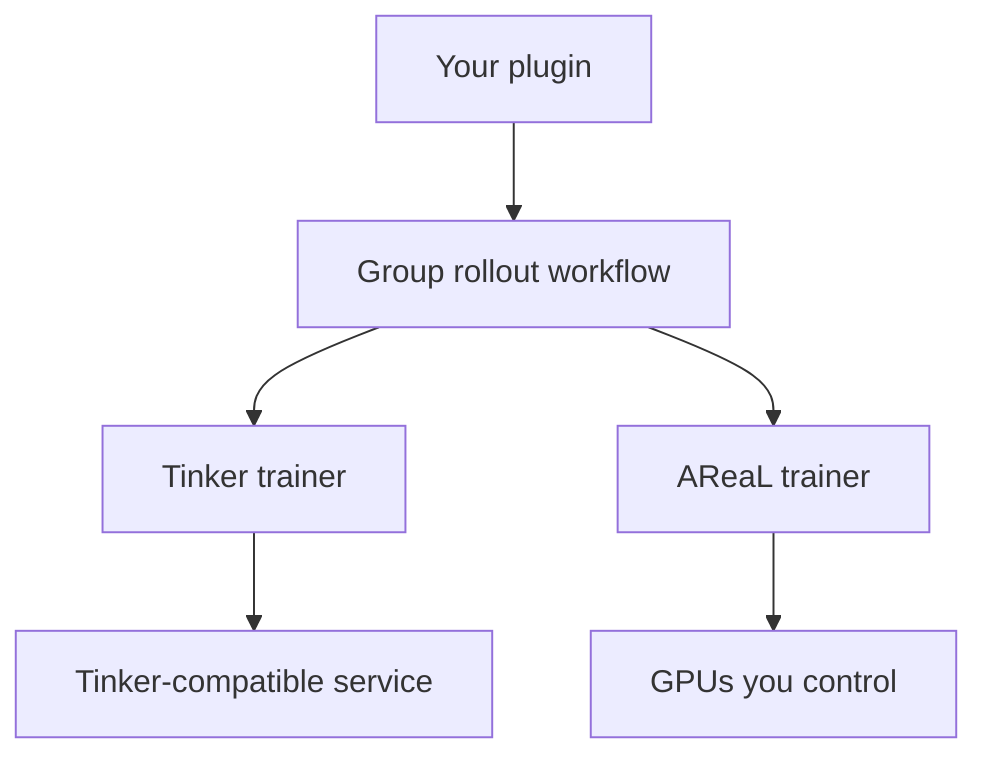

# Training backends

Reinforcement learning needs a training engine: something that samples from the current policy and
applies gradient updates to it. Platoon gives you two ways to get one.

- **The Tinker path** targets the Tinker API, so it works with any Tinker-compatible backend — a
  hosted service, or another implementation of the same API. The engine is a service you consume:
  your machine runs one `asyncio` process that produces rollouts and posts training batches, while
  sampling, forward/backward, the optimizer and checkpoint storage all live on the far side of the
  API.
- **The AReaL path** runs the engine on GPUs you control, on top of
  [AReaL](https://github.com/inclusionAI/AReaL). SGLang serves rollouts, FSDP or Megatron trains,
  and a scheduler places both across your allocation.

## What the choice does not change

The task, the environment, the agent and the rollout function are shared. So are the reward
processor, `RolloutConfig`, sub-agent datum sampling and error filtering. Neither trainer imports
your domain code; both call `rollout_fn(task, RolloutConfig)` and hand the resulting trajectory tree
to the same kind of workflow.

What differs is the trainer config class, the YAML that fills it, and the entrypoint you launch.



A plugin can ship both halves side by side — `configs/tinker/` and `configs/areal/`, two thin train
scripts or one registry module — and most of the plugins in this repository do.

## Comparison

| | Tinker | AReaL |
| --- | --- | --- |
| **Where compute runs** | A remote Tinker-compatible backend. One local client process, no GPU. | Your GPUs. Inference and train engines run in scheduler-launched worker processes. |
| **Parallelism** | Not exposed; the service decides. Sizing knobs are `train.batch_size`, `num_minibatches`, `num_microbatches`. | Allocation strings on `rollout.backend` and `actor.backend` — data, tensor, pipeline, context and expert dimensions. |
| **LoRA** | Always. `train.lora_rank` (default `32`). | Optional. Full-parameter by default; `actor.use_lora: true` plus `lora_rank`, `lora_alpha`, `target_modules`. |
| **Loss** | `train.loss_fn` and `train.loss_fn_config` are forwarded to the service. | Local and pluggable — `grpo`, `ppo`, `cispo` ship in-tree, and you can register your own. |
| **Checkpointing** | `tinker://` state and sampler URIs, recorded as JSON lines in `checkpoints.jsonl` under the run's log directory. | AReaL `saver:` and `recover:` blocks writing under `cluster.fileroot`, which every node must see. |
| **Multi-node** | Not applicable. | Yes — `cluster.n_nodes`, and `scheduler.type: slurm_prealloc` for an allocation you already hold. |
| **Config loader** | `platoon.utils.config.load_config` — YAML plus argparse. Unknown keys are dropped. | `areal.api.cli_args.load_expr_config` — OmegaConf, so `defaults:` composition and `${...}` interpolation work. |
| **Override syntax** | `--train.batch_size 64` | `train_dataset.batch_size=64` |
| **Before you start** | A credential for a Tinker-compatible backend, and `uv sync --extra tinker`. | Linux x86_64 with NVIDIA GPUs, a filesystem shared across nodes, and `uv sync --extra areal`. |

!!! warning "The two override syntaxes are not interchangeable"

    AReaL takes bare `key=value`; Tinker requires a leading `--`. Passing the AReaL form to a
    Tinker run leaves the value untouched, because the parser skips arguments that do not start
    with `--`.

The two extras are a `uv` conflict group and cannot share a virtual environment, so switching
backends means re-syncing — see [installation](../get-started/installation.md).

### Pick Tinker if

- You have no cluster, or do not want to wait for one.
- You are iterating on the environment, the agent or the reward rather than on the optimizer. One
  process is far easier to read, debug and restart.
- LoRA is enough for the experiment.
- You want evaluation and automatic restart-and-resume wired in by default.

### Pick AReaL if

- You need full-parameter training, or a model no service offers you.
- You are training a large model or a long context and need tensor, pipeline or context
  parallelism.
- Your rollouts need process isolation — heavyweight environments that start their own servers
  benefit from `workflow_config.use_subprocesses`.
- You want to write your own loss function.
- You are running multi-node on Slurm. See [Run at scale](../guides/scale.md).

## The Tinker path

Install the extra, set the credential your backend expects, and point the config at a model the
service hosts.

```bash
uv sync --extra tinker
uv run python -m platoon.train.tinker.train --config <config.yaml> [--dotted.key value ...]
```

That entrypoint resolves every component from the config's `environments:` block. A plugin that
needs extra top-level config keys ships its own script instead, with the same shape:

```bash
uv run python -m platoon.deepdive.train_scripts.tinker.train_tinker \
  --config platoon/deepdive/configs/tinker/deepdive_tinker.yaml
```

### Config shape

`PlatoonTinkerRLTrainerConfig` (<span class="pl-src">platoon/train/tinker/config_defs.py</span>) has
four blocks that matter and three required fields — `train`, `eval` and `log_path`.

```yaml title="configs/tinker/deepdive_tinker.yaml"
train:
  model_name: Qwen/Qwen3-4B-Instruct-2507
  renderer_name: qwen3_instruct
  batch_size: 16
  num_epochs: 10
  num_minibatches: 1
  num_microbatches: 1
  max_staleness: 3
  lora_rank: 32
  loss_fn: cispo
  loss_fn_config:
    clip_low_threshold: 0.0
    clip_high_threshold: 5.0
  optimizer:
    learning_rate: 3e-5
  num_concurrent_rollout_workflow_workers: 8
  workflow_config:
    group_size: 4
    leave_one_out_baseline: true
    rollout_config:
      max_steps: 50
      timeout: 7200
      inference_params:
        max_completion_tokens: 2048

eval:
  strategy: step
  every: 20
  workflow_config:
    group_size: 1
    rollout_config: { max_steps: 50 }

checkpoint:
  strategy: step
  every: 10

log_path: ./runs/logs
```

Three things are worth knowing before your first run.

`renderer_name` selects the tinker-cookbook renderer that builds prompts. It must match the model,
because the service trains against the same rendering.

`max_staleness` is what makes the loop off-policy: it is both the prefetch depth and the threshold
above which a rollout produced by an older policy version is dropped. Leave it unset and rollouts
serialize against training.

A watchdog thread exits the process if nothing heartbeats within `watchdog.timeout_seconds`
(default `600`), because a hung service call cannot be unwound. Heartbeats fire when a rollout
*completes*, so long-horizon configs raise it. `python -m platoon.train.tinker.restart_wrapper`
wraps a training command, restarts on that exit code, and the trainer resumes from the last
checkpoint with its W&B run id intact.

## The AReaL path

```bash
uv sync --extra areal
uv run python -m platoon.train.areal.train --config <config.yaml> [key=value ...]
```

As on the Tinker side, plugins with extra config fields ship their own script taking the same
arguments. Multi-node runs launch the same module from a Slurm script inside an allocation.

### Config shape

`PlatoonArealRLTrainerConfig` extends AReaL's `GRPOConfig`, so an AReaL config is an AReaL config
plus Platoon's blocks. The parts you write first:

```yaml title="configs/areal/deepdive_areal.yaml"
experiment_name: deepdive
trial_name: run-1
total_train_epochs: 10
tokenizer_path: ${actor.path}

cluster:
  n_nodes: 1
  n_gpus_per_node: 8
  fileroot: /shared/platoon/experiments
  name_resolve:
    type: nfs
    nfs_record_root: /shared/platoon/name_resolve

rollout:
  backend: sglang:d4p1t1
  max_concurrent_rollouts: 8
  max_head_offpolicyness: 3

actor:
  backend: fsdp:d4p1t1
  path: Qwen/Qwen3-4B-Instruct-2507
  gradient_checkpointing: true
  mb_spec:
    max_tokens_per_mb: 40000
  optimizer:
    lr: 3e-6
    gradient_clipping: 1.0

loss_fn_config:
  loss_fn: cispo
  loss_fn_kwargs: { clip_low_threshold: 0.0, clip_high_threshold: 5.0 }

workflow_config:
  group_size: 8
  rollout_config:
    max_steps: 25
    inference_params: { max_completion_tokens: 2048 }

train_dataset: { batch_size: 16 }
saver: { freq_steps: 25 }
recover: { mode: auto, freq_steps: 5 }
```

### Allocation strings

`rollout.backend` and `actor.backend` are the one piece of AReaL syntax you cannot guess. Both are
required, with no defaults. The shape is `<engine>:<dims>`, where each dim is a letter and a
positive integer: `d` data, `t` tensor, `p` pipeline, `c` context (training only), `e` expert
(training only). An allocation's world size is `d × t × p × c`.

```yaml
rollout:
  backend: sglang:d4p1t1     # 4 SGLang replicas, 1 GPU each
actor:
  backend: fsdp:d4p1t1c1     # 4-way FSDP data parallel
```

Inference runs on `sglang`; training runs on `fsdp` or `megatron`. FSDP does not take pipeline or
expert parallelism, so a model that needs either implies Megatron. [Run at
scale](../guides/scale.md) works through sizing these against a real allocation.

## See also

- [Installation](../get-started/installation.md) — the extras and the conflict rule
- [Configuration reference](../reference/configuration.md) — both config trees, key by key
- [CLI reference](../reference/cli.md) — every entrypoint and its arguments
- [Execution model](execution.md) — what one training step actually does
- [Run at scale](../guides/scale.md) — multi-node AReaL, and surviving a wall-time limit
