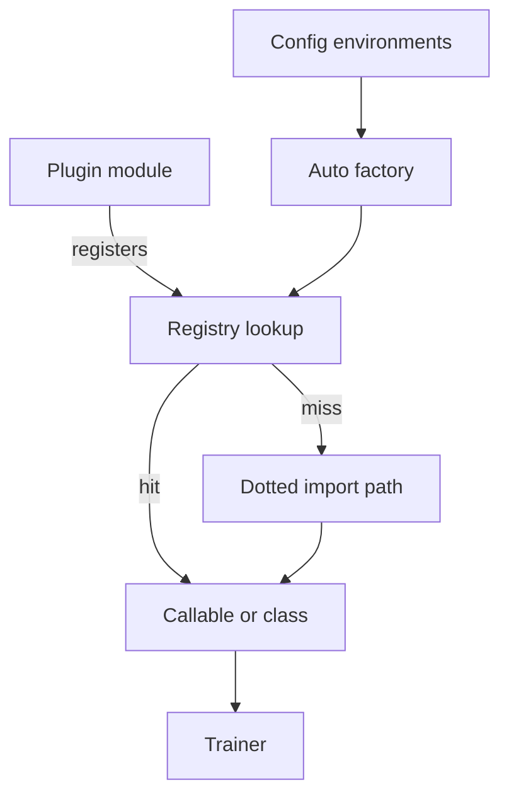

# Components and the registry

A training run needs a handful of environment-specific pieces: something to list the tasks,
something to turn a task id into a task, the rollout program that runs it, and a way to score the
result. Everything else — batching, optimization, logging, checkpointing — is the same whatever you
are training on.

So Platoon does not ask you to write a trainer. You name those pieces in config, and a shared
entrypoint resolves each name to a Python callable:

```bash
python -m platoon.train.tinker.train --config my_config.yaml
```

The payoff is that <span class="pl-src">platoon/train/tinker/train.py</span> and
<span class="pl-src">platoon/train/areal/train.py</span> stay environment-agnostic. A new task suite
is a YAML block and a registration module, not a new trainer — and improvements to the shared
entrypoint reach every task suite at once.

## The `environments` block

The names live in one entry of the top-level `environments` list:

```yaml
environments:
  - package: platoon.textcraft.registry
    dataset_loader: textcraft/synth
    task_loader: textcraft/synth
    rollout: textcraft/synth/depth_aware
    reward_processor: textcraft/synth/delegation_capped
    dataset_kwargs: { num_samples_train: 10000 }
```

`package` (or `discover_entry_points`) makes the registrations happen; the rest are component names.
Each key has an `eval_`-prefixed twin where evaluation can differ — `eval_dataset_loader`,
`eval_rollout`, `eval_dataset_kwargs`, `eval_workflow_kwargs`. Every field is in the
[configuration reference](../reference/configuration.md).

One run takes exactly one entry. To train on a mixture, express it inside a single loader that
returns task ids from several sources and a single rollout that dispatches on the task.

!!! warning "Not OpenReward's `environments`"

    The [OpenReward plugin](../plugins/openreward.md) has its own `environments:` list nested under
    `openreward:`. That one is a task-mixture config and has nothing to do with the registry. Check
    the indentation level before reading a YAML file.

## The kinds

<span class="pl-src">platoon/registry.py</span> is a process-local dict of dicts, keyed by *kind*
and then by name. Each kind has a registration helper and a contract:

| Kind | Helper | Required | Contract |
| --- | --- | --- | --- |
| `dataset_loader` | `register_dataset_loader` | yes | `(config, split, **kwargs) -> list[str] \| Dataset` |
| `task_loader` | `register_task_loader` | yes | `(task_id: str) -> Task` |
| `rollout` | `register_rollout` | yes | `async (task: Task, config: RolloutConfig) -> dict` |
| `reward_processor` | `register_reward_processor` | no | `(traj: dict) -> tuple[float, dict]` |
| `workflow` | `register_workflow` | no | a class matching the backend's workflow constructor |
| `loss` <span class="pl-tag pl-tag--areal">AReaL</span> | `register_loss_fn` | no | `(logprobs, entropy, input_data, **kwargs) -> Tensor` |

**`dataset_loader`** is called twice per run, with `split` set to the literal string `"train"` or
`"eval"` — never `"val"`, so translate inside the loader if your data disagrees. `**kwargs` comes
from `dataset_kwargs` (or `eval_dataset_kwargs`, which does not inherit from it). Return a list of
task-id strings and Platoon wraps it; return a dataset object and it passes through, in which case
every row needs a `task_id` key. `eval_dataset_loader` falls back to `dataset_loader`.

**`task_loader`** turns an id into a `Task` (or a `SubTask`, which subclasses it). It is called
synchronously, once per dataset row per epoch, so it must not be `async` and should memoize anything
expensive.

**`rollout`** is your program: the agent, the environment, and the episode that drives them. It is
awaited with exactly two positional arguments. The `RolloutConfig` it receives already points at the
live sampling endpoint (`model_name`, `model_endpoint`, `model_api_key`) and at a per-run output
directory. Return the serialized trajectory collection, and close the agent and environment in a
`finally` block — nothing else will.

```python
async def run_mytask_rollout(task: Task, config: RolloutConfig) -> dict:
    agent = MyAgent(llm_client=LiteLLMClient(
        model=config.model_name, base_url=config.model_endpoint, api_key=config.model_api_key,
    ))
    env = MyEnv(task)
    current_trajectory_collection.set(TrajectoryCollection())
    try:
        await run_episode(agent, env, timeout=config.step_timeout)
        return current_trajectory_collection.get().to_dict()
    finally:
        await agent.close()
        await env.close()
```

There is no `rollout_kwargs`. To vary a parameter from config, register a second name bound to a
differently parameterized module-level function.

**`reward_processor`** turns one serialized trajectory into `(scalar_reward, metrics)`. It runs once
per trainable trajectory, so a workflow where an agent delegates to other agents calls it for the
root and again for each retained child. Leave it unset and the accumulated per-step reward is used
as-is.

**`workflow`** names the class that assembles a training batch from rollouts. The default value
`group_rollout` is a sentinel, not a registry entry: it selects whichever `GroupRolloutWorkflow`
belongs to the backend you are running. Extra constructor arguments come from `workflow_kwargs`.
Subclassing the backend's `GroupRolloutWorkflow` is the practical way to write one — see
[extending Platoon](../guides/extend.md).

**`loss`** is selected from the AReaL-only `loss_fn_config.loss_fn` block rather than from
`environments`. `cispo`, `grpo` and `ppo` ship registered. Unlike the others, re-registering a loss
name overrides it, which is how you replace a built-in.

## Registering

Every helper takes an optional value. Pass it and registration happens immediately; omit it and you
get a decorator:

```python title="plugins/textcraft/platoon/textcraft/registry.py"
@register_task_loader("textcraft/synth")
def load_synth_task(task_id: str):
    return get_synth_task(task_id)


register_rollout("textcraft/synth/linear", run_synth_rollout)
register_rollout("textcraft/synth/depth_aware", run_synth_depth_aware_rollout)
```

Names are arbitrary strings, and a duplicate name under the same kind raises at import time rather
than silently shadowing. Namespace yours: `"<plugin>/<dataset>"` for loaders,
`"<plugin>/<dataset>/<variant>"` for rollouts and reward processors.

Register plain module-level functions and classes. A lambda, a `functools.partial`, a closure or a
bound method has no import path, and the AReaL backend ships components to worker processes *as*
import paths — so anything unimportable fails there. Treat "module-level object" as the contract
whichever [backend](backends.md) you target.

## How your package gets found

Registration only happens when the module holding the decorators is imported. Two ways to cause
that:

| | `package: my_pkg.registry` | `discover_entry_points: true` |
| --- | --- | --- |
| Declared in | your YAML config | the package's `pyproject.toml` |
| Requires install metadata | no | yes |
| Scope | exactly one module | every installed plugin advertising the group |
| Order | second | first |

The entry-point declaration is one table:

```toml title="pyproject.toml"
[project.entry-points."platoon.plugins"]
mytask = "my_pkg.registry"
```

Prefer `package` for a single run: it needs no install metadata and names the exact module in the
config, so one YAML file tells you where every component came from. Turn on entry-point discovery
when several packages must register at once.

Either way, a plugin is an ordinary Python package. It does not have to live in the Platoon
repository — keep your task plugin, or a capability plugin such as an agent harness, in your own
repo, install it alongside Platoon, and point a config at it. No fork, no upstreaming.
[Write your first plugin](../guides/first-plugin.md) walks the whole loop.

## Resolution



The `Auto*` factories in <span class="pl-src">platoon/train/auto.py</span> do the resolution:
`AutoEnvironment` runs the imports, then `AutoDataset`, `AutoTaskLoader`, `AutoRollout`,
`AutoRewardProcessor` and `AutoWorkflow` hand the results to the trainer. See
[the execution path](execution.md) for what happens next.

### The escape hatch

Any string that is not a registered name is treated as a dotted import path. So you can drive a run
with no registrations, no registration module and no `package` at all:

```yaml
environments:
  - dataset_loader: my_pkg.components.load_dataset
    task_loader: my_pkg.components.load_task
    rollout: my_pkg.components.run_rollout
    reward_processor: my_pkg.components.score
```

Both `package.module.attr` and `package.module:attr` work, and the object must be a module-level
attribute. This is the fastest way to try something; registering is what you do once the names
should outlive your module layout, since a registered name survives a refactor and a typo comes back
with the list of valid names.
