# Configuration system

Platoon turns a YAML file into a typed Python dataclass twice, with two entirely different loaders.
Which one runs is decided by your training backend, and they disagree about override syntax,
interpolation, type coercion, and what happens when you misspell a key. This page explains both
mechanisms, the validation layer that sits on top of them, and how to find out what a run actually
loaded.

For the key-by-key catalogue of what you can put in a config, see the
[configuration reference](../reference/configuration.md). This page is about the machinery.

## Two loaders, one repository

| | AReaL training | Tinker training and inference |
|---|---|---|
| Loader | `areal.api.cli_args.load_expr_config` | `platoon.utils.config.load_config` |
| Engine | Hydra `compose` + OmegaConf structured configs | `yaml.safe_load` + a hand-rolled dataclass hydrator |
| `--config` | required | optional when the script bakes in a default path |
| Override syntax | `key=value`, no leading dashes | `--dotted.key value` or `--dotted.key=value` |
| `defaults:` composition | yes | no |
| `${...}` interpolation | yes | no — the string is taken literally |
| Unknown keys | hard error | silently dropped |
| Value types | coerced and checked against the annotation | passed through unchanged |
| Returns | `(config, config_file_path)` | `(config, merged_raw_dict)` |

The split is clean across the repository. Every AReaL entrypoint calls `load_expr_config`; every
Tinker entrypoint and every inference runner calls `load_config`. Nothing calls both.

=== "AReaL"

    <span class="pl-tag pl-tag--areal">AReaL</span>

    - `platoon/train/areal/train.py` — the registry-driven entrypoint,
      `python -m platoon.train.areal.train`
    - the per-plugin AReaL scripts, for example
      `plugins/openreward/platoon/openreward/train_scripts/areal/train_areal.py`,
      `plugins/textcraft/platoon/textcraft/train_scripts/areal/train_areal.py`,
      `plugins/number-search/platoon/number_search/train.py` and
      `plugins/codegrep/platoon/codegrep/train.py`

=== "Tinker"

    <span class="pl-tag pl-tag--tinker">Tinker</span>

    - `platoon/train/tinker/train.py` — the registry-driven entrypoint,
      `python -m platoon.train.tinker.train`
    - the per-plugin Tinker scripts, for example
      `plugins/textcraft/platoon/textcraft/train_scripts/tinker/train_tinker.py`
    - every `inference_scripts/run_inference.py` (and TextCraft's `run_synth_inference.py`), which
      are clients of this loader even though they never touch Tinker

```mermaid
flowchart TB
  subgraph AREAL["AReaL — areal.api.cli_args.load_expr_config"]
    A1["argv"] --> A2["parse_cli_args<br/>--config REQUIRED<br/>drops a leading *.py argument"]
    A2 --> A3["hydra compose<br/>resolve 'defaults:' then apply key=value overrides"]
    A3 --> A4["OmegaConf.merge with the structured schema<br/>unknown key is an error; values type-checked"]
    A4 --> A5["OmegaConf.to_object<br/>resolves interpolations and runs every __post_init__"]
    A5 --> A6["typed config + config.yaml saved on RANK 0"]
  end
  subgraph TINKER["Tinker and inference — platoon.utils.config.load_config"]
    B1["argv"] --> B2["argparse: --config / -c<br/>parse_known_args"]
    B2 -->|"config path"| B3["yaml.safe_load"]
    B2 -->|"everything else"| B4["_parse_overrides<br/>--k v, --k=v, bare --flag"]
    B4 --> B5["_parse_value<br/>bool, none, int, float, comma-list, str"]
    B3 --> B6["merged plain dict"]
    B5 --> B7["_set_nested by dotted path"] --> B6
    B6 --> B8["_dataclass_from_dict<br/>unknown keys dropped; no type coercion"]
    B8 --> B9["__post_init__ repairs and validates"]
    B9 --> B10["typed config + the merged raw dict"]
  end
```



!!! warning "The two override syntaxes are not interchangeable"
    A Hydra-style bare `train.batch_size=64` handed to a Tinker script is **silently ignored** —
    `_parse_overrides` skips any token that does not start with `--`
    (<span class="pl-src">platoon/utils/config.py</span>). A dashed `--train_dataset.batch_size 8`
    handed to an AReaL script makes Hydra fail to parse the override. The first failure mode is the
    dangerous one: the run starts, and the setting you thought you changed is still at its YAML
    value.

## The AReaL path

`load_expr_config(argv, config_cls)` lives in AReaL, not in Platoon. It does four things in order.

1. **`parse_cli_args`** declares exactly one argparse argument, `--config`, and marks it
   `required=True`. If `argv[0]` ends with `.py` it is dropped first, so passing the script path
   through works. The config path is resolved to an absolute path and asserted to exist. Everything
   argparse did not consume becomes a Hydra override list.
2. **Hydra composition.** Hydra is initialized with the config file's *directory* and composed by
   the file's stem, so a `defaults:` list composes sibling YAML files from the same directory. The
   overrides are applied during composition.
3. **`to_structured_cfg`** does `OmegaConf.merge(OmegaConf.structured(config_cls), cfg)`. This is the
   step that rejects unknown keys and checks values against the dataclass annotations.
4. **`OmegaConf.to_object`** materializes real dataclasses, resolving every `${...}` interpolation
   and running every `__post_init__`. On `RANK == 0` the fully resolved config is then written to
   `config.yaml` under the stats-logger log directory.

Platoon's contribution here is only the schema:
`PlatoonArealRLTrainerConfig` (<span class="pl-src">platoon/train/areal/config_defs.py</span>),
which subclasses AReaL's `GRPOConfig`.

### Override syntax

`--config` is dashed because argparse handles it. Everything after it is a Hydra override with no
dashes:

```bash
cd plugins/number-search
uv run python3 platoon/number_search/train.py \
  --config platoon/number_search/nv_number_search_cispo_areal.yaml \
  trial_name=debug-run \
  train_dataset.batch_size=16
```

This is exactly the shape the Slurm launcher generates. It appends `cluster.n_nodes=…` and
`openreward.session_url=…` unconditionally, plus `trial_name=…`, `tokenizer_path=…`, `actor.path=…`,
`openreward.subagent_delegation_reward_coefficient=…` and `stats_logger.wandb.mode=…` when the
corresponding environment variables are set
(<span class="pl-src">slurm-scripts/openreward-toolathlon-prealloc-base.sh</span>).

!!! warning "`key=value` only works for keys the YAML already contains"
    Hydra refuses to override a key that composition did not produce, even when the dataclass
    declares it: `Could not override 'seed'. To append to your config use +seed=7`. To set a field
    the YAML omits, prefix the override with `+`:

    ```bash
    ... --config configs/areal/mytask.yaml +seed=7 +train_dataset.shuffle=false
    ```

    `+` still goes through the structured merge, so it cannot invent a key the dataclass does not
    declare.

### Interpolation

`${...}` is resolved by OmegaConf at `to_object` time, after overrides are applied. Every Platoon
AReaL config leans on this to keep one source of truth per value:

```yaml title="plugins/number-search/platoon/number_search/number_search_areal.yaml"
tokenizer_path: ${actor.path}

rollout:
  backend: sglang:d4p1t1
  experiment_name: ${experiment_name}
  trial_name: ${trial_name}
  fileroot: ${cluster.fileroot}
  tokenizer_path: ${tokenizer_path}
  scheduling_spec: ${actor.scheduling_spec}
  consumer_batch_size: ${train_dataset.batch_size}
```

Because resolution happens last, an `actor.path=/new/model` override on the command line also
changes `tokenizer_path` and `rollout.tokenizer_path`. That is deliberate: overriding one model path
moves the whole run.

### Unknown keys and value types

The structured merge is the schema check. A misspelled key raises immediately:

```text
omegaconf.errors.ConfigKeyError: Key 'batchsize' not in 'PlatoonTrainDatasetConfig'
    full_key: train_dataset.batchsize
```

`tests/test_areal_config_cleanup.py` pins this behavior for the AReaL keys Platoon deliberately
removed — `allocation_mode`, `launcher.*`, `gconfig.n_samples`, `actor.group_size`,
`actor.dynamic_sampling`, `actor.clip_low_threshold`, `loss_fn_config.clip_low_threshold`,
`train_dataset.path`, `train_dataset.type` and `valid_dataset.path`. Deleting a key from the schema
is how Platoon narrows the AReaL surface, and that test is what keeps it narrow.

Values are coerced to the annotated type and rejected when they cannot be: `batch_size: "8"` loads
as the integer `8`, while `batch_size: "abc"` raises
`ValidationError: Value 'abc' of type 'str' could not be converted to Integer`.

## The Tinker and inference path

```python title="platoon/utils/config.py"
def load_config(
    args: list[str] | None = None,
    config_class: Type[T] | None = None,
    default_config_path: str | None = None,
) -> tuple[T | dict, dict]:
```

The whole loader is 265 lines with no dependencies beyond `yaml` and `argparse`. Its steps:

1. `args` defaults to `sys.argv[1:]`.
2. An `ArgumentParser` declaring only `--config` / `-c` (defaulting to `default_config_path`) runs
   `parse_known_args`. Everything else survives into `remaining`.
3. `load_yaml_config` reads the file with `yaml.safe_load`, raising `FileNotFoundError` if it is
   missing and returning `{}` if it is empty. There is **no** include, defaults or inheritance
   mechanism — one file, full stop.
4. `_parse_overrides(remaining)` turns the leftover argv into a flat `{dotted.key: value}` dict.
5. `_set_nested` writes each override into the dict along its dotted path.
6. `_dataclass_from_dict(config_class, merged)` hydrates the dataclass.
7. The function returns `(config, config_dict)` — the typed object **and** the merged raw dict.
   Several plugin entrypoints keep the second element to pass plugin-specific sections around.

### Override syntax

```bash
cd plugins/textcraft
uv run python -m platoon.textcraft.train_scripts.tinker.train_tinker \
  --config platoon/textcraft/configs/tinker/textcraft_tinker.yaml \
  --train.batch_size=16 \
  --train.workflow_config.group_size 4 \
  --stats.wandb.mode disabled \
  --stats.wandb.tags textcraft,tinker,debug
```

`_parse_overrides` (<span class="pl-src">platoon/utils/config.py</span>) recognizes exactly three
forms and one non-form:

- `--key=value` splits on the first `=`.
- `--key value` consumes the next token, but only if that token does not itself start with `--`.
- `--key` with nothing usable after it becomes the string `"true"`.
- Anything not starting with `--` is skipped with no message.

### `_parse_value`: the entire type system

This loader has no access to your annotations, so every CLI string goes through one fixed ladder
(<span class="pl-src">platoon/utils/config.py</span>):

| Test, in order | Result |
|---|---|
| lowercase in `true`, `yes`, `1` | `True` |
| lowercase in `false`, `no`, `0` | `False` |
| lowercase in `none`, `null` | `None` |
| `int(value)` succeeds | `int` |
| `float(value)` succeeds | `float` |
| contains `,` | list, each element stripped and parsed recursively |
| otherwise | `str` |

Three footguns follow directly from that ordering.

!!! danger "`--train.batch_size 1` sets `batch_size` to `True`"
    Booleans are tested before integers, and `"1"` and `"0"` are in the boolean sets. So
    `--train.batch_size 1` yields `True` and `--train.num_epochs 0` yields `False`. Nothing later
    repairs them: `_dataclass_from_dict` passes values through unchanged and the dataclass does not
    check types. `True` behaves like `1` in arithmetic, so this can survive a long time before it
    bites. Edit the YAML instead of overriding these values, or use a value the ladder cannot
    misread (`--train.batch_size 01` parses as the integer `1`).

!!! warning "Commas create lists"
    `--stats.wandb.tags a,b` is a feature. `--stats.wandb.notes "ablation, v2"` is not: it becomes
    `["ablation", "v2"]`.

!!! warning "A flag followed by another flag swallows its value"
    `--train.verbose --train.batch_size 16` sets `verbose` to `True` and `batch_size` to `16`, which
    is probably what you meant. But `--checkpoint.load_checkpoint_path --train.batch_size 16` sets
    the path to `True`, because the next token starts with `--`.

One more, from `_set_nested` (<span class="pl-src">platoon/utils/config.py</span>): an override
path that passes *through* a scalar replaces that scalar with a fresh dict. `--train.batch_size.x 1`
silently discards `train.batch_size`.

### `_dataclass_from_dict`: nested dataclasses yes, lists of dataclasses no

```python title="platoon/utils/config.py"
    field_values = {}
    for f in fields(cls):
        field_type = type_hints.get(f.name, f.type)
        if f.name in data:
            value = data[f.name]
            # Handle nested dataclasses
            if is_dataclass(field_type) and isinstance(value, dict):
                field_values[f.name] = _dataclass_from_dict(field_type, value)
            else:
                field_values[f.name] = value
        elif f.default is not MISSING:
            field_values[f.name] = f.default
        elif f.default_factory is not MISSING:
            field_values[f.name] = f.default_factory()

    return cls(**field_values)
```

Read that loop carefully, because its exact shape decides several things you will run into.

- **It iterates `fields(cls)`, never the YAML dict.** Keys that are not dataclass fields are dropped
  with no error and no warning.
- **It recurses only when `is_dataclass(field_type)` is literally true.** `train.workflow_config` is
  a `WorkflowConfig`, so it recurses; `train.workflow_config.rollout_config` is a `RolloutConfig`, so
  it recurses again. But `environments: list[EnvironmentConfig]` is a `list`, not a dataclass, so the
  raw `list[dict]` is assigned as-is. The same applies to `Foo | None`: a union is not a dataclass,
  so an optional nested config arrives as a plain dict.
- **`get_type_hints(cls)` resolves postponed annotations first**, so modules that use
  `from __future__ import annotations` — such as `platoon/train/components.py` — still get their
  nested dataclasses recognized. If that resolution throws, the code falls back to `{}` and recursion
  stops working for the class.
- **Missing required fields fail late.** A field with no YAML value and no default is omitted from
  `field_values`, so `cls(**field_values)` raises `TypeError`. The loader logs
  `Failed to parse config into <Class>: …` and re-raises.

That second bullet is exactly why `normalize_environment_configs` exists.

## Lists of dataclasses, and `normalize_environment_configs`

The top-level `environments:` key is a `list[EnvironmentConfig]` — the registry wiring described on
[the registry page](registry.md). On the AReaL path OmegaConf knows the element type and produces
real `EnvironmentConfig` objects (and rejects unknown keys inside each element). On the Tinker path
`_dataclass_from_dict` hands the trainer config a list of plain dicts, and the conversion has to
happen somewhere else:

```python title="platoon/train/components.py"
def normalize_environment_configs(environments: Any) -> list[EnvironmentConfig]:
    """Normalize the public `environments` config list."""

    if environments is None:
        return []
    if isinstance(environments, EnvironmentConfig):
        raise ValueError(
            "`environments` must be a list; use `environments: [{...}]` for a single environment"
        )
    if isinstance(environments, dict):
        raise ValueError(
            "`environments` must be a list; use `environments: - ...` for a single environment"
        )
    ...
```

`PlatoonTinkerRLTrainerConfig.__post_init__` and `PlatoonArealRLTrainerConfig.__post_init__` both
call it, then both raise `NotImplementedError` for more than one entry. The dict and single-object
branches exist to turn a common YAML mistake into a targeted message instead of a confusing
`AttributeError` several frames later.

**The consequence for you:** if you add a list-valued section to a plugin config that is loaded by
`load_config`, you must convert it yourself in `__post_init__`. The OpenReward plugin does exactly
that for its environment mixture:

```python title="plugins/openreward/platoon/openreward/config_defs.py"
        if self.environments is not None:
            self.environments = [OpenRewardEnvironmentConfig.from_mapping(value) for value in self.environments]
```

That nested `openreward.environments` list is the plugin's env-mixture config — a different thing
from the top-level `environments:` registry list, despite the shared name.

The same trap applies to optional nested dataclasses. `RolloutConfig` handles it for
`inference_params`, which arrives as a dict from subprocess and pickle round-trips as well as from
YAML:

```python title="platoon/config_defs.py"
        # Support loading from plain dicts from config loaders and subprocess paths.
        if isinstance(self.inference_params, dict):
            self.inference_params = InferenceParams(**self.inference_params)
```

## `__post_init__` is the validation layer

Neither loader validates semantics. Both of them run `__post_init__` — OmegaConf during
`to_object`, `_dataclass_from_dict` at `cls(**field_values)` — so that is where Platoon puts every
cross-field rule, every coercion the loader could not do, and every derived value.

### Validation

`WorkflowConfig.__post_init__` (<span class="pl-src">platoon/train/areal/config_defs.py</span>)
is representative. It first repairs types the Tinker loader might have left as dicts, then checks the
relationships that no single-field annotation can express:

```python title="platoon/train/areal/config_defs.py"
        if self.group_size < 1:
            raise ValueError("workflow group_size must be positive")
        if self.straggler_timeout_seconds is not None and self.straggler_timeout_seconds <= 0:
            raise ValueError("straggler_timeout_seconds must be positive or null")
        if self.straggler_quorum is not None and not 1 <= self.straggler_quorum <= self.group_size:
            raise ValueError("straggler_quorum must be in [1, group_size] or null")
        if self.straggler_timeout_seconds is None and self.straggler_quorum is not None:
            raise ValueError("straggler_quorum requires straggler_timeout_seconds")
```

Others worth knowing about:

- `RolloutConfig.__post_init__` raises `Conflicting rollout propagation settings` when the canonical
  `propagate_root_success` and the deprecated misspelling `propogate_root_success` are both set to
  different values, then resolves the canonical field to a concrete `bool`.
- `TokenEfficiencyRewardConfig.__post_init__` requires every numeric to be finite, `reference_tokens`
  to be positive, both weights to be non-negative with at least one positive when enabled, and
  `attribution` to be exactly `"policy_subtree"`.
- Both `WorkflowConfig` classes reject a `subagent_datum_sampling_seed` that is a `bool`, because
  `isinstance(True, int)` is true in Python and a stray `true` in YAML would otherwise silently
  become seed `1`.
- `PlatoonArealRLTrainerConfig.__post_init__` requires `rollout.backend` and `actor.backend` to be
  set explicitly. Neither has a default, because guessing engine placement is worse than failing.
- The whole router-replay precondition matrix lives there too: Megatron actor, SGLang rollout,
  `rollout.return_routed_experts=true`, `actor.megatron.enable_mtp=false`, proximal-logprob
  recomputation disabled, and `recompute_granularity=full` with `recompute_method=uniform` when
  gradient checkpointing is on.

### Derived values

`__post_init__` also copies values between sections so that a setting has exactly one public home.
This is why some keys in the reference are marked "do not set in YAML": whatever you write there is
overwritten.

```python title="platoon/train/areal/config_defs.py"
        # Keep loss selection in one public config location (`loss_fn_config`)
        # while attaching it to the actor object consumed by PlatoonActorImpl.
        self.actor.loss_fn = self.loss_fn_config.loss_fn
        merged_loss_fn_kwargs = dict(getattr(self.actor, "loss_fn_kwargs", {}))
        merged_loss_fn_kwargs.update(self.loss_fn_config.loss_fn_kwargs)
        self.actor.loss_fn_kwargs = merged_loss_fn_kwargs

        # Keep one public R3 gate on the actor while giving remote workflows
        # the dimensions required to reshape SGLang's flattened routing data.
        self.workflow_config.enable_router_replay = self.actor.enable_router_replay
        self.workflow_config.router_replay_num_layers = self.actor.router_replay_num_layers
        self.workflow_config.router_replay_topk = self.actor.router_replay_topk
```

The loss lives in `loss_fn_config` because that is the user-facing choice; the actor object is what
the trainer hands to the loss builder. The router-replay dimensions live on the actor because they
are model properties, but remote rollout workers need them to reshape SGLang's flattened routing
data and only ever receive `workflow_config`. In both cases the copy is one-way, from the public key
to the internal consumer, so setting `actor.loss_fn` or `workflow_config.enable_router_replay`
directly has no effect.

The same method also:

- defaults `scheduler.type` to `"local"` when it is unset, because Platoon's AReaL path relies on the
  single-controller scheduler;
- fills `eval_gconfig` from `gconfig.new()` when it is `None`;
- copies `actor.backend` onto `ref.backend` when a `ref` block omits it;
- injects `PYTORCH_CUDA_ALLOC_CONF=expandable_segments:True` into every rollout, actor, ref, critic
  and teacher `scheduling_spec.env_vars`, because in single-controller AReaL the trainer object is
  not the process doing GPU work.

On the Tinker side the derivations are smaller: `TrainConfig.__post_init__` sets
`num_concurrent_rollout_workflow_workers` to `batch_size` when it is `None`.

!!! warning "A subclass that defines `__post_init__` must call `super().__post_init__()`"
    Plugin trainer configs subclass `PlatoonArealRLTrainerConfig` or `PlatoonTinkerRLTrainerConfig`
    to add a top-level section, and several override `__post_init__` to coerce that section.
    `OpenRewardArealTrainerConfig` ends with `super().__post_init__()`;
    `OpenRewardTinkerTrainerConfig`
    (<span class="pl-src">plugins/openreward/platoon/openreward/tinker_config.py</span>) does not,
    so for that config class the parent's `normalize_environment_configs` call and its
    single-environment check never run. No OpenReward Tinker YAML sets a top-level `environments:`
    block today, so nothing is currently broken — but copy the AReaL version's shape, not the Tinker
    one, when you write your own.

## Unknown keys, precisely

On the AReaL path an unknown key is a `ConfigKeyError` at merge time, before anything is constructed.
This holds inside list elements too: `environments: [{nope: 1}]` fails with
`Key 'nope' not in 'EnvironmentConfig'`. Adding a plugin-specific top-level section therefore
*requires* subclassing the trainer config; there is no other way to get the key past the schema.

On the Tinker and inference path an unknown key is dropped in silence at every level — top-level
sections, nested blocks and CLI overrides alike. `batchsize:` for `batch_size:` produces a working
run at the default batch size. There is no strict mode and no warning. The mitigations are to print
the resolved object (below) and to keep plugin sections small.

One asymmetry is worth flagging: a mapping that reaches a dataclass through an explicit
`Cls(**mapping)` call inside some `__post_init__` — rather than through `_dataclass_from_dict` —
*does* raise `TypeError: unexpected keyword argument` on an unknown key. So a typo under
`openreward:` on the Tinker path behaves differently from a typo under `train:`.

## Composition in practice

**AReaL configs compose.** Hydra's `defaults:` list resolves sibling stems relative to the YAML's own
directory. Nineteen OpenReward configs use it, and the deepest chain is six files:

```text
toolathlon_openhands_areal_prealloc_16node-cp.yaml                    (base, no defaults:)
 ← ...16node-cp-ptc-recursive.yaml                                    PTC + recursion
 ← ...16node-cp-ptc-recursive-judged-r3-fp32-lm-head.yaml             judging + R3 + fp32 LM head
 ← ...32node-cp-ptc-recursive-judged-r3-fp32-lm-head.yaml             32 nodes, sglang:d12p1t8
 ← ...32node-...-bs8.yaml                                             batch size 8, straggler policy
 ← ...32node-...-bs8-efficiency.yaml                                  token-efficiency reward (leaf)
```

Each derived file begins with the parent stem and `_self_`, so its own keys win:

```yaml title="plugins/openreward/platoon/openreward/configs/areal/toolathlon_openhands_areal_prealloc_32node-cp-ptc-recursive-judged-r3-fp32-lm-head-bs8-efficiency.yaml"
defaults:
  - toolathlon_openhands_areal_prealloc_32node-cp-ptc-recursive-judged-r3-fp32-lm-head-bs8
  - _self_
```

Two things follow. Moving one file in the chain breaks every descendant, because the stems are
resolved by directory. And a leaf must repeat keys the *Slurm launcher* greps for, because the
launcher reads the raw file before Hydra composes anything: it refuses to run a config with no
top-level `openreward:` line, and it decides whether to build Transformer Engine and APEX by
grepping for `backend: megatron`. The configs say so in a comment:

```yaml title="plugins/openreward/platoon/openreward/configs/areal/toolathlon_openhands_areal_prealloc_32node-cp-ptc-recursive-judged-r3-fp32-lm-head-bs8.yaml"
# The Slurm launcher validates the selected file before Hydra composes its
# defaults, so retain this literal marker as well as the backend below.
openreward: {}
```

Those "redundant" lines are load-bearing for the launcher, not for Hydra.

Within a single AReaL file, `${...}` does the rest of the sharing: `experiment_name`, `trial_name`,
`cluster.fileroot`, `actor.path`, `actor.scheduling_spec` and `train_dataset.batch_size` are each
written once and referenced from every block that needs them.

**Tinker and inference configs do not compose.** There is no `defaults:` list and no interpolation,
so shared values are literally duplicated across files and a variant run is a copied file. A `${...}`
written in a Tinker YAML stays the eight-character string `${seed}`, and because there is neither
unknown-key checking nor type checking it will be assigned to your `int` field without complaint. No
Tinker YAML in the repository does this today, but nothing prevents it.

## How to debug a config

**Start from the resolved config, not the file you edited.** That is the single most useful habit,
because both loaders change values after parsing and one of them can drop them entirely.

=== "AReaL"

    `load_expr_config` writes the fully resolved config — post composition, post overrides, post
    interpolation, post `__post_init__` — to `config.yaml` in the stats-logger log directory on
    `RANK == 0`. AReaL builds that directory as
    `<stats_logger.fileroot>/logs/<user>/<experiment_name>/<trial_name>`, and Platoon configs
    conventionally set `stats_logger.fileroot: ${cluster.fileroot}`. Read that file, diff it against
    a previous run's copy, and you have an exact answer to "what did this run actually use".

    Error messages are precise, so read them literally:

    - `ConfigKeyError: Key 'x' not in 'Y'` with a `full_key:` line — a typo, or a key you must add by
      subclassing the trainer config.
    - `ConfigCompositionException: Could not override 'x'` — the key is in the dataclass but not in
      your YAML. Use `+x=value`.
    - `ValidationError: Value '…' could not be converted to …` — a type mismatch, caught at merge.
    - A `ValueError` or `NotImplementedError` naming two keys — a `__post_init__` cross-field rule.
      Search `platoon/train/areal/config_defs.py` for the message; the rule sits a few lines above
      the raise, usually with a comment explaining why it exists.

=== "Tinker"

    Nothing writes a resolved config. `StatsLogger.log_config` exists in
    `platoon/utils/stats_logger.py` but is never called, and the trainer does not dump the config
    either. Print it yourself, from inside the plugin's virtualenv and with the same config class the
    entrypoint uses:

    ```bash
    uv run python -c "
    from dataclasses import asdict
    import yaml
    from platoon.train.tinker.config_defs import PlatoonTinkerRLTrainerConfig
    from platoon.utils.config import load_config

    config, raw = load_config(
        args=['--config', 'platoon/textcraft/configs/tinker/textcraft_tinker.yaml',
              '--train.batch_size=8'],
        config_class=PlatoonTinkerRLTrainerConfig,
    )
    print(yaml.safe_dump(asdict(config), sort_keys=False))
    "
    ```

    Compare that output against your YAML. Anything present in the file and absent from the output
    was dropped as an unknown key. Anything whose type looks wrong — `True` where you wrote `1` —
    came through `_parse_value`.

    The loader also logs `Loaded config from: <path>` and `Applied N config overrides` at INFO.
    Scripts that raise the `platoon` logger to DEBUG — most Tinker entrypoints do — will show both,
    and the override count is a cheap check that your `--flags` were seen at all.

A few more things to check when a run behaves unlike its config.

- **Some keys are overwritten at runtime, by design.** The AReaL group-rollout workflow forces
  `rollout_config.return_dict = True` and `rollout_config.train = True` in its constructor and
  rewrites the model endpoint fields per rollout; the inference workflow forces `return_dict = True`
  and `train = False` and overwrites `model_name`, `model_endpoint`, `model_api_key` and
  `output_dir` from the `inference:` block. Setting those in YAML is decorative.
- **The AReaL eval workflow config is derived, not declared.** There is no `eval_workflow_config`
  key; `platoon/train/areal/train.py` deep-copies `workflow_config` and forces `group_size = 1`,
  `subagent_datum_keep_probability = 1.0` and `filter_zero_advantage_datums = False`. The Tinker
  path is the opposite — `eval.workflow_config` is a real, separately defaulted key.
- **Two classes named `WorkflowConfig` exist**, one per backend, with different fields and different
  defaults (`group_size` is `1` on AReaL and `8` on Tinker). Two classes named `WandBConfig` exist
  too: the one under `stats_logger:` is AReaL's, the one under the Tinker `stats:` block is
  Platoon's (<span class="pl-src">platoon/utils/stats_logger.py</span>), whose `mode` defaults to
  `online`. Do not assume the two share a default: AReaL's belongs to the pinned upstream revision
  and is not verifiable from this tree. Most AReaL YAMLs here set `stats_logger.wandb.mode`
  explicitly; set it explicitly in yours too.
- **`environments:` is only honored by the two registry entrypoints**,
  `python -m platoon.train.areal.train` and `python -m platoon.train.tinker.train`. A per-plugin
  train script wires its components in Python and ignores the block entirely.

## See also

- [Configuration reference](../reference/configuration.md) — every key, type, default and meaning.
- [The registry](registry.md) — what the `environments:` list resolves against.
- [AReaL backend](areal.md) and [Tinker backend](tinker.md) — what each trainer does with the loaded
  config.
- [CLI reference](../reference/cli.md) — the entrypoints and their arguments.
- [Packaging a plugin](../customization/packaging.md) — where a plugin's config class and YAML live.
- [Troubleshooting](../reference/troubleshooting.md) — symptom-first index of common failures.
