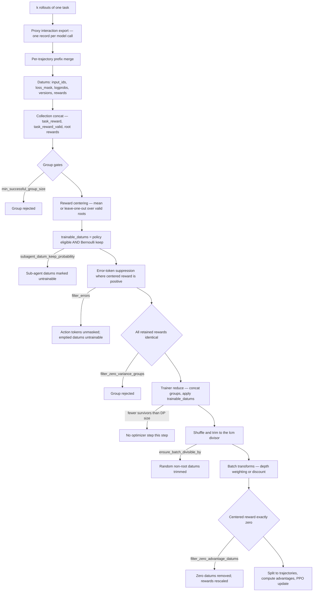

# Data pipeline

A rollout produces a *tree* of trajectories and a pile of proxy interaction records. The
optimizer wants a padded tensor batch. Everything in between lives in two converter modules and
two workflow classes, and it is where most silent data loss in a Platoon run happens. Read this
page when your `workload/*` counters do not add up, when a step trains on far fewer tokens than
you rolled out, or before you enable any of the filters.

## The stages, in order

The pipeline runs in three places: inside the rollout worker (conversion), inside the workflow
(group math and marking), and inside the trainer (physical filtering and batch assembly).

| # | Stage | Where | Entry point |
|---|---|---|---|
| 1 | Run `group_size` rollouts of one task | workflow | `arun_episode` |
| 2 | Export proxy interactions per rollout | workflow | `_process_trajectory_result` |
| 3 | Tree → per-trajectory datums | converter | `get_train_data_for_trajectory_collection` |
| 4 | Token/mask construction, prefix merging | converter | `get_train_data_for_trajectory` |
| 5 | Reward processing | converter | your `reward_processor` |
| 6 | Group gates, centering, baseline | workflow | `arun_episode` |
| 7 | Eligibility and sampling marks | workflow | `_activate_subagent_datum_sampling` |
| 8 | Error-token suppression | workflow | `_filter_positive_centered_error_tokens` |
| 9 | Reduce, apply marks, trim to a divisible batch | trainer | `_reduce_rollout_batch` |
| 10 | Batch transforms | trainer | `run_batch_transforms` |
| 11 | Zero-advantage filtering | trainer | `_filter_zero_centered_reward_batch` |
| 12 | Split back to per-trajectory items, advantages | trainer | `split_batch_to_trajectories` |

=== "AReaL"

    Stages 3-5 are <span class="pl-src">platoon/utils/areal_data_processing.py</span>, stages 1-2
    and 6-8 are
    <span class="pl-src">platoon/train/areal/workflows/group_rollout_workflow.py</span>, and
    stages 9-12 are `PlatoonArealRLTrainer._postprocess_rollout_batch`
    (<span class="pl-src">platoon/train/areal/rl.py</span>) plus
    <span class="pl-src">platoon/train/areal/batch_transforms.py</span>.

    The unit that crosses from workflow to trainer is one dict of padded tensors per *accepted
    task group*. The trainer concatenates those groups into one full batch, filters it, then
    splits it back into `list[dict]` so AReaL's controller can rebalance across data-parallel
    ranks.

=== "Tinker"

    Stages 3-5 are <span class="pl-src">platoon/utils/tinker_data_processing.py</span>, stages
    1-2 and 6-8 are
    <span class="pl-src">platoon/train/tinker/workflows/group_rollout_workflow.py</span>, and
    stages 9-12 are the microbatch assembly loop in
    <span class="pl-src">platoon/train/tinker/rl.py</span> plus
    <span class="pl-src">platoon/train/tinker/batch_transforms.py</span>.

    The unit that crosses from workflow to trainer is a `list[tinker.Datum]` per task, delivered
    through an `asyncio.Queue`. There is no full-batch view: transforms and the zero-advantage
    filter run per *microbatch*, so `num_minibatches` and `num_microbatches` change what each
    transform normalizes over.

## What a datum is

A datum is not a step. It is one contiguous token sequence that the model will forward once,
built by merging every consecutive step whose observation is a token-prefix extension of the
sequence so far. A ten-step CodeAct trajectory whose prompt grows by appending turns collapses
into **one** datum; a trajectory whose prompt is rebuilt from scratch each step produces ten.

=== "AReaL"

    `SequenceAccumulator.to_train_data`
    (<span class="pl-src">platoon/utils/areal_data_processing.py</span>) emits, per datum:

    | Key | Shape | Contents |
    |---|---|---|
    | `input_ids` | `[1, S]` | observation tokens then action tokens, merged across steps |
    | `loss_mask` | `[1, S]` | `0` on observation tokens, `1` on action tokens |
    | `logprobs` | `[1, S]` | `0.0` on observations, sampler logprobs on actions |
    | `versions` | `[1, S]` | `-1` on observations, the weight version that sampled each action |
    | `attention_mask` | `[1, S]` | all ones; padding is added by concatenation |
    | `rewards` | `[1]` | the trajectory's own scalar reward, repeated for every datum |
    | `token_rewards` | `[1, S]` | that same scalar broadcast over every token |
    | `num_input_tokens` / `num_output_tokens` | `[1]` | pre-merge per-step totals, for metrics |

    Optional keys: `_platoon_error_action_mask` when `filter_errors` is on, and
    `routed_experts` / `routed_experts_valid` under router replay.

    Each trajectory's datums are then concatenated and stamped with `num_steps` and the
    `reward/*` components your reward processor returned. The whole collection is concatenated
    once more and stamped with `task_reward`, `task_reward_valid` and `root_reward/*` taken from
    the **root** trajectory.

=== "Tinker"

    `make_datum_from_accumulator`
    (<span class="pl-src">platoon/utils/tinker_data_processing.py</span>) emits a
    `tinker.Datum` whose `model_input` is the sequence with the last token removed, and whose
    `loss_fn_inputs` are the left-shifted targets:

    | Key | Contents |
    |---|---|
    | `target_tokens` | the sequence shifted left by one |
    | `logprobs` | sampler logprobs, `0.0` on prompt positions |
    | `advantages` | initially the trajectory's raw reward on action tokens, `0.0` elsewhere |
    | `mask` | `1.0` on action tokens, `0.0` on prompt tokens |
    | `checkpoint_version` | the sampling policy version, used for staleness filtering |

    Optional keys: `_platoon_error_action_mask`, and `traj_depth` / `traj_start` when depth
    weighting is on. The trainer adds `_loss_normalization_tokens` when zero-advantage filtering
    is on, and strips `mask`, `checkpoint_version`, `traj_depth`, `traj_start` and
    `_loss_normalization_tokens` before `forward_backward_async`.

    Note the asymmetry with AReaL: Platoon writes **per-token advantages** directly here. There
    is no separate advantage estimator downstream.

!!! warning "`token_rewards` is never centered"
    On the AReaL path, `token_rewards` is written once from the trajectory's raw reward
    (<span class="pl-src">platoon/utils/areal_data_processing.py</span>) and is never
    updated by group centering, depth weighting or the zero-advantage rescale — only `rewards`
    is. It still reaches the actor batch. A [custom loss](../customization/loss.md) that reads
    `token_rewards` instead of `advantages` will train on uncentered values.

### Where steps disappear before you ever see a datum

Four drops happen inside the converter, with no config key controlling them:

- A step with no `misc.action_misc.completion_id` is skipped. That id is the only join key
  between the trajectory and the proxy's token export.
- A step whose `completion_id` is not in the exported completions logs
  `Completion ID ... not found` and is skipped.
- A step whose exported completion has no loss-masked token at all logs `has no trainable
  tokens` and is skipped — `_extract_completion_tokens` returns `None` when `loss_mask` is all
  zero.
- A repeated `completion_id` is counted once. OpenHands can spread one parallel tool-call
  response across several environment steps; training each occurrence would duplicate every
  action token in that response.

Verifier subtrees never produce datums at all: `_exclude_from_training` drops any trajectory
carrying `exclude_from_training`, or whose *task* carries `subagent_reward_verifier_task`. The
task-level check exists because a hard process kill can land before the trajectory-level marker
is written. See [the fork and sub-agent model](subagents.md).

## Group centering and the baseline

Centering happens once per task group, after every member has been converted, and it uses
**root rewards only** — but subtracts the resulting baseline from *every* datum in the tree.
That is exactly how a sub-agent's tokens inherit credit from the root's outcome.

```python title="platoon/train/areal/workflows/group_rollout_workflow.py"
if self.config.leave_one_out_baseline and len(results) > 1:
    total_reward = task_rewards.sum()
    loo_baselines = (total_reward - task_rewards) / (len(task_rewards) - 1)
    datum_counts = torch.tensor([r["rewards"].shape[0] for r in results])
    per_datum_baselines = torch.repeat_interleave(loo_baselines, datum_counts)
    train_data["rewards"] = train_data["rewards"] - per_datum_baselines
else:
    train_data["rewards"] = train_data["rewards"] - torch.mean(task_rewards)
```

`leave_one_out_baseline` (default `False`) removes a member's own reward from its baseline,
eliminating the `1/k` self-correlation between a sample and the control variate it is compared
against. With one member it silently takes the mean branch, which subtracts the member's own
reward and produces exactly zero.

**Partial roots.** A trajectory that was cancelled, timed out or was marked invalid is
"interrupted" (`trajectory_was_interrupted`,
<span class="pl-src">platoon/utils/trajectory_status.py</span>). Its `task_reward` is still
recorded for metrics, but `task_reward_valid` is false and it is excluded from the baseline:

- No root is valid → the group is rejected outright.
- Some roots valid, mean baseline → the mean is taken over valid roots only.
- Some roots valid, leave-one-out → valid roots get the leave-one-out value among valid roots;
  invalid roots get the valid mean; a lone valid root subtracts its own reward.

**`min_successful_group_size`** (AReaL only, default `1`, must be in `[1, group_size]`) gates
the group twice, and the two gates are different:

1. Fewer than `min_successful_group_size` members returned *any* train data → reject.
2. Fewer than `min_successful_group_size` members have a *valid root* → reject.

The second gate is the one that matters for recursive runs with long rollouts: a member can
return plenty of descendant datums and still fail the quorum because its root timed out. The
config comment recommends `4` for an intended group size of `8`. Raising it buys a stronger
baseline and costs you whole groups.

## Every filter that can drop data

Ordered by where it fires. Each one is a place tokens can vanish between the rollout you watched
and the batch you trained.

### `filter_errors`

Marks, at conversion time, every action token belonging to a completion whose step reported an
error — CodeAct's `error` field, a traceback in `output`, or a typed OpenHands error event
(<span class="pl-src">platoon/utils/trajectory_error_filtering.py</span>). Nothing is dropped
yet: the mask rides along in `_platoon_error_action_mask` through prefix merging.

After centering, `_filter_positive_centered_error_tokens` zeroes `loss_mask` **only** on
erroneous action tokens whose centered reward is positive. Errors in a below-baseline rollout
keep their tokens, because "this failed and it scored badly" is useful negative signal. A merged
datum can therefore retain clean actions while suppressing one bad completion. If suppression
empties a datum of all trainable tokens, that datum is marked untrainable (AReaL) or dropped
outright (Tinker).

!!! warning "The `filter_errors` YAML key is usually inert"
    `workflow_config.filter_errors` defaults to `True`, but `GroupRolloutWorkflow.__init__` takes
    `filter_errors` as its own constructor argument, defaulting to `False`, and that argument is
    what the workflow reads. The shared entrypoints pass `filter_errors=True` for train and
    `False` for eval; most per-plugin `train_*.py` scripts hardcode a literal. Only the
    OpenReward scripts forward `config.workflow_config.filter_errors`. Setting the YAML key
    without checking your entrypoint changes nothing.

### `subagent_datum_keep_probability`

Default `1.0`, which disables the sampler entirely. Below `1.0`, every non-root datum gets an
independent Bernoulli draw from a SHA-256 hash of
`(seed, task_id, trajectory_id, depth, datum_index)`
(<span class="pl-src">platoon/utils/subagent_sampling.py</span>). Depth-0 datums are always
kept. The draw is deterministic and independent of worker scheduling and global RNG state, so a
rerun with the same `subagent_datum_sampling_seed` retains the same datums.

The sampler runs *after* rewards and stats are computed for the whole tree, so baselines and
metrics see the complete rollout regardless of what survives. A trajectory can contribute zero
retained datums; when that happens the `traj_start` marker is moved to the first retained datum
so depth weighting still counts trajectories correctly.

Policy-ineligible children — interrupted trajectories, and non-root trajectories marked
`exclude_from_policy_training` by a failed reward verifier — sit outside the Bernoulli
population entirely and do not consume a draw. They are excluded from policy training either
way, while their rewards and stats are retained.

This is the knob for recursive runs where sub-agent tokens dominate the batch. Lowering it trades
sub-agent gradient coverage for throughput; it changes no reward. Datum sampling is a training
throughput policy, so `python -m platoon.train.areal.train` deep-copies the workflow config for
evaluation and forces the keep probability back to `1.0`. On Tinker, evaluation reads a separate
`eval.workflow_config` block, which has its own default of `1.0` — but if you set the key there,
it applies.

### `filter_zero_variance_groups`

AReaL only, default `True`. After centering, sampling and error suppression, the workflow
compares the retained rewards. If they are all identical — which after centering usually means
all zero — it logs `All retained rewards identical for task ...` and returns `None`, discarding
every rollout in the group.

Two details matter. The check only fires when more than one member returned data, so a
single-member group is never rejected this way. And "retained" means after `trainable_datums`, so
a group whose only reward variation came from sampled-out sub-agent datums is rejected.

Turning it off keeps the group; its datums then almost always die at the zero-advantage filter
instead, having consumed a slot in the trainer batch on the way.

### `filter_zero_advantage_datums`

Default `True` on both backends. It removes datums whose centered scalar reward is exactly zero,
on the argument that they cannot contribute a policy gradient. That argument holds only under
specific conditions, which the source states at length:

```python title="platoon/train/areal/config_defs.py"
    # Reward-only throughput fast path: identify exact-zero centered scalar
    # rewards after group centering and policy/Bernoulli masks, retain them
    # through global DP selection and multiplicative depth normalization, then
    # omit all but the minimum dispatch padding before model-side computation.
    # IMPORTANT: disable this when KL != 0, reward_bias != 0, reward/advantage
    # normalization is active, overlong_reward_penalty is enabled, a critic or
    # teacher/distillation objective or independent MoE/router auxiliary loss
    # is present, or a custom transform adds to rewards. In those modes zero
    # scalar reward need not imply zero final policy advantage (or zero total
    # objective). A trainer startup warning
    # repeats these constraints because the remote workflow cannot validate the
    # complete actor/objective configuration by itself.
    filter_zero_advantage_datums: bool = True
```

The AReaL trainer emits that warning as a `RuntimeWarning` on every construction where the flag
is on (<span class="pl-src">platoon/train/areal/rl.py</span>):

> workflow_config.filter_zero_advantage_datums uses centered scalar reward as an early proxy for
> final policy advantage. Disable it when KL is nonzero, reward/advantage normalization or reward
> bias/overlong penalty is active, a critic or teacher objective is present, the model has an
> independent MoE/router objective, or a custom transform adds to rewards.

followed by either `Detected incompatible settings: ...` or `Current actor settings satisfy the
known reward-only constraints.` The detector checks `actor.kl_ctl != 0`,
`actor.reward_bias != 0`, active `actor.reward_norm`, active `actor.adv_norm`,
`actor.overlong_reward_penalty`, a `critic` block, a `teacher` block, a Qwen3.5/3.6 MoE model on
`megatron-bridge` (which carries an independent global router auxiliary loss), and the presence
of **any** custom batch transform.

!!! danger "A custom batch transform makes this flag unsafe"
    The detector treats any custom transform as an incompatibility, because the filter runs
    *after* transforms and a transform that *adds* to rewards can turn a zero into a nonzero
    contribution that the filter already discarded. Multiplicative transforms such as the
    built-in depth weighting are fine; additive ones are not. If you pass
    `batch_transforms=[...]`, set `filter_zero_advantage_datums: false` unless you have checked
    that your transform is purely multiplicative.

**The denominator is preserved.** Dropping zero terms from a mean would amplify every remaining
gradient. Both backends compensate:

```python title="platoon/train/areal/rl.py"
denominator_tokens = retained_loss_tokens + filtered_zero_loss_tokens
denominator_scale = (
    float(retained_loss_tokens) / float(denominator_tokens)
    if denominator_tokens > 0
    else 1.0
)
```

AReaL scales the retained scalar rewards by that factor before advantage computation. Tinker
instead records the pre-filter action-token count on the first surviving datum
(`set_loss_normalization_token_counts`) and divides the microbatch's advantages by the
represented total.

**AReaL keeps minimum padding, and can trim nonzero datums.** Zero-reward datums are retained as
padding when the nonzero count is not divisible by the dispatch divisor. When there are not
enough zeros to pad, the filter trims *nonzero* datums instead — and if fewer nonzero datums
remain than the actor's data-parallel size, it trims all of them and the step produces no batch.
`zero_advantage_filter/divisibility_trimmed_datums` counts this.

### Divisibility trimming

Before transforms, `_maybe_shuffle_and_trim_batch` trims the full batch down to a multiple of
`lcm(rollout.ensure_batch_divisible_by, actor_dp_size)`. This is a data drop with no filter flag:

- If the batch is smaller than the actor's DP size, the whole step is discarded.
- Trimming only happens when the batch is at least one full multiple, so a small batch is left
  alone rather than over-trimmed by successive remainders.
- The trimmed subset is always drawn randomly, so later or deeper trajectories are not
  systematically discarded, and non-root datums are preferred over roots.
- `rollout.shuffle_cross_task` controls only the order of what is retained, not what is trimmed.

Separately, `_reduce_rollout_batch` returns `None` — no optimizer step at all — when fewer datums
survive `trainable_datums` than the actor DP size. Raising `ensure_batch_divisible_by` on a run
with small effective batches is a reliable way to lose steps.

### Straggler timeouts and hard kills

Only on the AReaL subprocess path (`use_subprocesses: true`). Once `straggler_quorum` members
have settled — `group_size - 1` by default, and a settled member includes an interrupted or
failed one, not just a successful one — a clock of `straggler_timeout_seconds` starts. When it
expires, every still-running member is cancelled, the process pool is reaped, and those rollouts
contribute telemetry and nothing else. `group_tail_cancelled` counts them. A member that finishes
between the deadline and the cleanup block is deliberately kept rather than counted as cancelled.

The subprocess worker also arms a `SIGALRM` at `(rollout timeout or 900) + 120 + 60` seconds and
kills its whole process group on expiry
(<span class="pl-src">platoon/train/areal/subprocess_worker.py</span>). A rollout killed this
way returns `None`; its proxy interactions are still exported, so the partial work shows up in
`workload/*` while producing no datums.

Set `straggler_timeout_seconds` when your group's wall time is dominated by one slow member.
Setting it too low silently converts long-but-productive rollouts into rejected groups by way of
`min_successful_group_size`.

### Staleness, Tinker only

`train.max_staleness` compares a datum's `checkpoint_version` against the current train step and
discards that whole task's datums when the gap is too large, incrementing `stale_rollouts`. There
is no requeue. The producer side also throttles: rollouts for batch *N+1* will not start more
than `max_staleness` batches ahead of training.

## The knob table

| Key | Backend | What it removes | When to touch it |
|---|---|---|---|
| `min_successful_group_size` | <span class="pl-tag pl-tag--areal">AReaL</span> | The whole group when too few members return data, or too few roots completed | Raise for a trustworthy baseline on recursive runs; expect fewer accepted groups |
| `straggler_timeout_seconds` | <span class="pl-tag pl-tag--areal">AReaL</span> | Tail members still running after quorum | Set when one slow member dominates group wall time |
| `filter_errors` | <span class="pl-tag pl-tag--both">Both</span> | Action tokens of erroneous completions with positive centered credit | Leave on when errors are frequent and rewarded; check that your entrypoint forwards it |
| `subagent_datum_keep_probability` | <span class="pl-tag pl-tag--both">Both</span> | A random subset of non-root datums | Lower when sub-agent tokens crowd out root tokens; never for eval |
| `filter_zero_variance_groups` | <span class="pl-tag pl-tag--areal">AReaL</span> | Whole groups whose retained rewards are identical | Turn off only to keep those datums in batch normalization |
| `filter_zero_advantage_datums` | <span class="pl-tag pl-tag--both">Both</span> | Datums whose centered reward is exactly zero | Turn **off** with KL, reward/advantage norm, a critic, a teacher, or a custom transform |
| `ensure_batch_divisible_by` | <span class="pl-tag pl-tag--areal">AReaL</span> | A random remainder of the full batch, or the whole step | Raise only to satisfy a real dispatch constraint |
| `max_staleness` | <span class="pl-tag pl-tag--tinker">Tinker</span> | Whole tasks sampled too many steps ago | Lower for on-policy fidelity, raise for pipeline throughput |
| `depth_level_weighting` | <span class="pl-tag pl-tag--both">Both</span> | Nothing — reweights | Use when deep trajectories produce many more datums than shallow ones |
| `depth_level_discount_gamma` | <span class="pl-tag pl-tag--areal">AReaL</span> | Nothing — reweights | Use to systematically down-weight depth rather than equalize it |

## Depth weighting and discounting

Both are batch transforms, so they run on exactly the batch that will train — after reduction,
after `trainable_datums`, after trimming, and *before* the zero-advantage filter. This ordering is
deliberate: normalizing over datums that never reach the actor would produce the wrong weights.

`depth_level_weighting` computes, per depth level, the number of *trajectories* represented (from
`traj_start`) and the number of *datums*, weights each depth by `1 / trajectory_count`, and
renormalizes so the total datum weight is unchanged. The effect is that each trajectory
contributes equally regardless of how many datums it merged into, and each depth level
contributes in proportion to how many trajectories it has rather than how many tokens.

`depth_level_discount_gamma` (AReaL only) is the alternative: weight each datum by
`gamma ** traj_depth`, then renormalize so the mean weight is `1.0`. A gamma below one
de-emphasizes sub-agents; above one emphasizes them. Both paths multiply `rewards`, then delete
`traj_depth` and `traj_start`.

Setting either key installs `DepthLevelWeightingTransform` automatically through
`build_default_batch_transforms`, and also turns on `include_traj_depth` / `include_traj_start`
back in the converter — the depth metadata does not exist unless something asks for it. Depth
comes from `parent_info` links, with the root taken as the first key of the `trajectories` dict.

On Tinker the same transform runs per microbatch and multiplies `advantages` instead, so its
normalization scope is `batch_size / (num_minibatches * num_microbatches)` tasks. It raises when a
microbatch has zero total weight, where the AReaL version returns the batch unweighted.

## Token efficiency

`token_efficiency_reward` (AReaL only) charges each policy trajectory for the tokens its whole
policy subtree consumed. `annotate_policy_subtree_token_efficiency` runs in the workflow before
conversion: it classifies every trajectory as policy or verifier (verifier descendants inherit
the marker), attributes each exported completion to its single owning trajectory, aggregates
tokens up the policy tree, and writes a penalty into each policy trajectory's `misc`:

```text
penalty          = min(max_penalty, coefficient * log2(1 + effective_tokens / reference_tokens))
effective_tokens = input_token_weight * subtree_input + output_token_weight * subtree_output
```

Defaults: `coefficient: 0.05`, `reference_tokens: 20000.0`, `max_penalty: 0.20`,
`input_token_weight: 0.01`, `output_token_weight: 1.0`, `attribution: policy_subtree` (the only
accepted value). The input weight is small because AReaL's exported prompts resend the full
logical context on every call even when the inference server reuses a cached prefix. Verifier
branches are excluded entirely because they do not exist at inference time. Overlap between a
parent and its children is intentional: a child owns its own behavior, and each ancestor owns the
decision to launch that subtree. A completion referenced by more than one trajectory is counted as
ambiguous and charged to neither.

!!! warning "The penalty is inert unless your reward processor subtracts it"
    `annotate_policy_subtree_token_efficiency` only writes metadata. Nothing in the pipeline
    subtracts it. The one implementation that does is OpenReward's reward processor
    (<span class="pl-src">plugins/openreward/platoon/openreward/rewards.py</span>), which reads
    the metadata with `trajectory_token_efficiency_metrics` and returns
    `base_reward + delegation_bonus - efficiency_penalty`. If you enable
    `token_efficiency_reward` with a reward processor that ignores the annotation, you get
    `efficiency/*` metrics and no behavior change.

The `TokenEfficiencyRewardConfig` docstring calls this a "post-baseline cost", meaning it is
subtracted after the base task reward is assembled — but still inside the reward processor, and
therefore **before** group centering. Every member of the group pays its own penalty, so the
group baseline absorbs the average cost and what survives centering is the *relative* efficiency
of each rollout. See [custom rewards](../customization/rewards.md).

## The pipeline, with the drop points marked



The Tinker chain is identical through centering and error suppression. It then diverges: there is
no zero-variance gate, no `trainable_datums` mask — sampling and policy exclusion physically drop
datums inside the converter — no divisibility trimming, and stages 10-11 run per microbatch rather
than over one full batch.

## Reading the funnel

Every stage that can drop data emits a counter, and the counters are designed to be read as one
funnel. The `RolloutWorkload` dataclass carries four datum counts through the whole pipeline, with
an invariant enforced in `__post_init__`:

```text
task_retained <= post_sampling_datums <= policy_eligible_datums <= postmerge_datums
```

- `postmerge_datums` — datums produced by conversion, after prefix merging.
- `policy_eligible_datums` — minus interrupted trajectories and policy-excluded verifier children.
- `post_sampling_datums` — minus the Bernoulli draw.
- `task_retained_datums` — minus error-emptied datums and anything else the workflow marked.

Both backends record these per rollout (`workload/rollout/*`), per task (`workload/task/*`) and per
accepted outer batch (`workload/batch/*`), and both emit `zero_advantage_filter/*` for the
zero-reward stage, `error_filter/*` for suppression and `subagent_sampling/depth_<d>/*` for
per-depth retention. What is not shared: the group-rejection scalars `group_size_rejected`,
`group_completed_root_quorum_rejected`, `no_valid_root_reward_group`, `zero_variance_reward_group`
and `group_tail_cancelled` are AReaL-only, and `stale_rollouts` is Tinker-only. A few names inside
the `workload/*` family also differ — see
[the group rollout workflow](../walkthroughs/group-rollout-workflow.md).

If tokens are missing, compare `workload/batch/total_postmerge_datums` against
`workload/batch/total_task_retained_datums` first: that gap is everything the workflow removed.
Anything beyond it was removed by the trainer, and `zero_advantage_filter/*` plus AReaL's
`divisibility_trimmed_datums` account for the rest. See
[troubleshooting](../reference/troubleshooting.md) for the failure modes these numbers point at.

!!! note "Telemetry never kills a batch"
    Workload extraction in the AReaL trainer is wrapped in a `try/except` that logs and continues.
    A malformed sidecar loses you the counters for that step, not the gradient.

## Three things to know before writing a reward processor

**The root is the first key of the `trajectories` dict.**
`get_train_data_for_trajectory_collection` identifies the root as `next(iter(trajectories))`, not
by walking parent links. The depth computation makes the same assumption. This is safe because the
collection creates the root trajectory first, but a hand-built collection with a reordered dict
will train against the wrong root reward.

**Your reward processor is called twice for the root.** Once in the per-trajectory loop, and once
more at the end to produce `task_reward` and `root_reward/*`. Keep it pure.

**Optional metrics are zero-filled with a presence mask.** AReaL's concatenator rejects dicts with
different key sets, so a metric that only some trajectories emit — a judged child's
`reward/subagent_judgment`, say — would break concatenation. `harmonize_optional_reward_metrics`
zero-fills the missing entries and records `_platoon_reward_metric_present/<key>` as `False`, so
reporting can distinguish "not applicable" from a genuine score of zero. Only the `reward/` and
`root_reward/` namespaces are harmonized; any other key mismatch is left for the concatenator to
reject. All of these workflow-level keys, along with `task_reward`, `num_steps` and the
`_platoon_workload_*` sidecars, are stripped before the trainer batch is assembled, because they
do not share the per-datum batch dimension.

## See also

- [Trajectory to batch](../walkthroughs/trajectory-to-batch.md) — the same path as a line-by-line
  code walkthrough.
- [The group rollout workflow](../walkthroughs/group-rollout-workflow.md) — the workflow class in
  detail.
- [Custom rewards](../customization/rewards.md) and
  [batch transforms](../customization/batch-transform.md) — the two places you plug into this
  pipeline.
- [AReaL backend internals](areal.md) and [Tinker backend internals](tinker.md) — what happens to
  the batch after it leaves here.
- [Recursive agent recipes](../recipes/recursive.md) — how these knobs are set for real recursive
  runs.
- [Configuration reference](../reference/configuration.md) — every key, with types and defaults.
