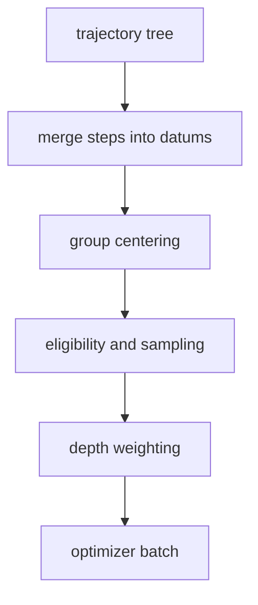

# Execution model

A rollout is one task in and a *tree* of trajectories out. This page follows that path: the
contracts an environment and an agent sign, the loop that drives them, how an agent delegates to
another agent, and how the resulting tree becomes tensors for the optimizer.

## Protocols, not base classes

`Env`, `ForkableEnv`, `Agent` and `ForkableAgent` are `typing.Protocol` classes marked
`@runtime_checkable`. Nothing asks you to subclass them.

```python title="platoon/envs/base.py"
@runtime_checkable
class Env(Protocol):
    async def reset(self) -> Observation: ...
    async def step(self, action: Action) -> Observation: ...
    async def close(self) -> None: ...
    async def observe(self) -> Observation: ...
    @property
    def task(self) -> Task: ...
```

Structural typing buys three things. Your environment and agent classes never import a Platoon base
class, so a plugin can be an ordinary package living in your own repository, wrapping an SDK object
that already has a base class of its own. Test doubles cost twenty lines and the loop cannot tell
them from the real thing. And `isinstance` still works where a capability has to be discovered
rather than declared — the delegation path checks `isinstance(env, ForkableEnv)` before forking.

!!! warning "A runtime protocol check verifies names, not signatures"
    `isinstance(obj, Env)` only confirms the attributes exist. A synchronous `step` passes the check
    and then fails inside the loop when `await env.step(...)` gets a non-awaitable. Run your
    environment through one episode before wiring it into training.

### What the loop expects of you

The signatures are the easy half. The loop records nothing on your behalf, so the obligations below
are yours.

| Member | Called | Obligation |
| --- | --- | --- |
| `reset()` | once, at the top | register the task: `set_trajectory_task(current_trajectory.get().id, task)` |
| `step(action)` | once per iteration | append the step: `add_trajectory_step(current_trajectory.get().id, step)` |
| `close()` | in `finally`, capped at 10 s | tolerate being called under cancellation; be fast and idempotent |
| `observe()` | never by the loop | used by `fork` and external tooling |
| `fork(task)` | only on delegation | clean up partial allocations if it raises, cancellation included |

The first two are not optional. Budget accounting reads `traj.task.max_steps` and counts
`len(traj.steps)`, so an environment that skips `set_trajectory_task` never halts on budget, and one
that skips `add_trajectory_step` never consumes budget, emits no events, and produces a trajectory
with no training data — from the outside that looks like a hang.

`Agent` is three coroutines: `act`, `reset` and `close`. Note the asymmetry — the loop calls
`env.reset()` but never `agent.reset()`. Per-episode agent state belongs in `__init__` or on the
first `act`.

## The episode loop

`run_episode` is the whole of Platoon's control flow, and the interesting part is five lines.

```python title="platoon/episode/loop.py"
obs = await env.reset()
while not halt_episode(obs):
    action = await asyncio.wait_for(agent.act(obs), timeout=timeout)
    obs = await asyncio.wait_for(env.step(action), timeout=timeout)
    step_count += 1
```

An episode halts on any of three conditions, checked before every step including the first:

1. **The step budget is exhausted** — `remaining_budget() <= 0`.
2. **Something called `finish()`** — anywhere in the episode, including model-authored Python
   running inside the environment's shell.
3. **The environment said so** — `obs.finished` is true.

`timeout` is a *per-step* deadline applied twice per iteration, around `agent.act` and around
`env.step`. It is not a whole-episode budget: 25 steps at `step_timeout: 300` can legitimately run
for hours. The deadline for the entire rollout is a separate `timeout` that the rollout function
applies itself. Both are fields of `RolloutConfig`.

Whatever ends the episode — a clean finish, a per-step timeout, an exception, or an outside
cancellation — the loop closes the agent and then the environment, each with a ten-second cap, then
stamps the trajectory and fires `finish_trajectory`. Sinks always see a record, so a killed episode
is still inspectable. Failures leave a status marker on `trajectory.misc`; the data converters read
those markers and refuse to train on an interrupted trajectory's tokens.

## State travels in context variables

Almost nothing is passed as an argument. Episode state lives in `ContextVar`s declared in
<span class="pl-src">platoon/episode/context.py</span>: `current_agent`, `current_env`,
`current_trajectory`, `current_trajectory_collection`, `budget_tracker`, `episode_step_timeout`,
`finish_message`, `error_message` and `subagent_reward_judge_config`.

That choice is what makes the model's own code able to reach the harness. `finish` is an ordinary
function with no reference to the loop, the environment or the trajectory:

```python title="platoon/agents/actions/common.py"
def finish(message: str = "") -> str:
    finish_message.set(message)
    return message
```

It is injected into the model's Python namespace like any other tool, and calling it ends the
episode. `launch_subagent` works the same way — it discovers the current agent, environment,
trajectory and remaining budget from context, so nothing has to be threaded through your
environment's API.

The cost is that the dependency is invisible, and it implies one rule.

!!! danger "Always start an episode with `asyncio.create_task`"
    `run_episode` overwrites `current_trajectory`, `current_agent`, `current_env`, `finish_message`
    and `error_message` in whatever context it runs in. Under a bare `await run_episode(...)` those
    writes are permanent: the caller's trajectory now points at the child, and a `finish()` inside
    the child ends the *parent's* episode. `asyncio.create_task` copies the context, so the writes
    stay inside the task. Every rollout function in the repository does this.

Two of these variables are installed lazily — a `TrajectoryCollection` and a `StepBudgetTracker` are
created only if unset. That is the seam for changing policy: set `budget_tracker` before calling
`run_episode` and the loop leaves your choice alone.

## The trajectory tree

Before its first step, every episode reads whatever `current_trajectory` already holds, creates a
new trajectory with that one as parent, and overwrites the variable with the child:

```python title="platoon/episode/loop.py"
parent_traj = current_trajectory.get(None)
current_trajectory.set(current_trajectory_collection.get().create_trajectory(parent_traj=parent_traj))
```

That is the entire mechanism. A root episode finds nothing and becomes a root. An episode started
from inside a running episode finds the parent and becomes its child, stamped with
`ParentInfo(id, fork_step)` — the parent's id and the parent's step index at the moment of
delegation. No caller passes a parent id, and no environment needs to know it is running as a
delegate.

The collection itself is a flat `dict[id, Trajectory]`; the tree exists only as those back-pointers.
Depth is derived by walking them, and the root is the first key of the dict — anything that rebuilds
a collection must keep root-first insertion order.

### What a delegation call does

The entry point is a plain async function that an environment adds to the agent's action space:

```python title="platoon/agents/actions/subagent.py"
async def launch_subagent(goal: str, max_steps: int = 15, task_misc: dict | None = None, verbose: bool = True) -> Any:
```

In order: `task.fork(goal, max_steps)` derives the child task; the budget tracker is asked to
reserve `max_steps + 1` steps *before* anything is allocated; the current agent and then the current
environment are forked; the child episode runs under `asyncio.create_task`, owning both forks and
inheriting the parent's per-step deadline. The `+1` exists because the parent needs at least one step
of its own to read the answer.

`launch_subagent` always returns **a string** and never raises into the calling agent's code. A
refusal, a failed child and a successful child all come back as model-readable text, so the policy
never learns to reason about the harness. Wrapper code that wants to know whether a delegate
succeeded must inspect the child trajectory, not the return value.

What a fork *shares* is entirely yours to decide, and both extremes are in the repository: TextCraft
shares its inventory by reference so a child's crafting shows up in the parent's world, while the
OpenReward integration shares a live session but narrows the child's tool schema so a delegate
cannot submit the root task.

Siblings run concurrently — `asyncio.gather` over several `launch_subagent` calls is the supported
way to fan out, and two siblings launched in the same parent step share a `fork_step`, which is how
the tree records parallelism. Recursion is the case where the forked agent is the same agent; a
supervisor forking different specialists uses the identical path.

### Budget across the tree

The budget tracker is a context variable, so a whole subtree shares one policy.

- **`StepBudgetTracker`** (the default) counts a trajectory's own steps *plus every descendant's*.
  Delegation spends the root's budget: a tree whose root has `max_steps: 9` executes at most nine
  steps in total, however they are divided.
- **`DepthAwareStepBudgetTracker`** counts only each trajectory's own steps, so every node is bounded
  by its own `max_steps`, and adds a `max_depth` cap on how deep the policy may delegate. Root is
  depth 0; `None` means no cap.

A refusal carries guidance text written for the model, suggesting a smaller budget or doing the work
itself. See [multi-agent workflows](../guides/multi-agent.md) for configurations that work.

## From tree to training data



**A datum is not a step.** It is one contiguous token sequence the model forwards once, built by
merging consecutive steps whose prompt is a token-level prefix of the next. The default CodeAct
prompt mode grows the conversation by appending two turns per step, so a ten-step trajectory
collapses into **one** datum. A prompt rebuilt from scratch each step produces ten, and re-trains the
same tokens once per turn.

**`completion_id` is the join key.** Each step records the id of the model call that produced it, and
conversion matches that against the inference proxy's token export. A step with no `completion_id` —
or a repeated one — contributes nothing. That is by design: repeats are deduplicated, and a synthetic
action no model produced should not become training data.

**The baseline is a within-task one.** A workflow runs `group_size` independent rollouts of the same
task and centers rewards against the group instead of learning a value function. Two details decide
what that means for a tree:

1. Each datum carries **its own trajectory's** processed reward, repeated across that trajectory's
   datums.
2. The baseline is computed from **root rewards only**, one scalar per rollout, and then subtracted
   from **every datum in the tree**.

So a delegate's centered reward is its own reward minus a baseline built from root outcomes. Whether
that is meaningful depends on which reward scheme you chose. With `propagate_root_success`, every
trajectory in the tree takes the root's outcome, the whole tree shares one scale, and every datum
gets exactly the root's centered advantage. That is plain GRPO-style credit spread across the tree,
and it is the configuration to start from.

### The settings that decide what reaches the optimizer

| Key | Effect |
| --- | --- |
| `group_size` | Rollouts per task. A group of 1 centers every advantage to zero |
| `leave_one_out_baseline` | Center each member against the *other* members' roots |
| `propagate_root_success` | Give every trajectory in the tree the root's outcome |
| `subagent_datum_keep_probability` | Deterministically drop a fraction of non-root datums; roots are always kept |
| `depth_level_weighting` | Equalize each depth level's contribution, so wide trees do not swamp the batch |
| `filter_zero_advantage_datums` | Drop datums whose centered reward is exactly zero |
| `min_successful_group_size` | Reject a group when too few members completed |

Defaults, types and the backend each key applies to are in the
[configuration reference](../reference/configuration.md). Both backends run the same funnel and agree
on the rules; where they differ is mechanical — AReaL masks datums where Tinker drops them. See
[backends](backends.md).

## See also

- [Concepts](../get-started/concepts.md) — the vocabulary this page assumes.
- [Components](components.md) — the pieces a rollout assembles, and the registry that names them.
- [Multi-agent workflows](../guides/multi-agent.md) — delegation as a how-to.
- [Extending Platoon](../guides/extend.md) — writing your own environment, agent or reward.
- [Inspect rollouts](../guides/inspect-rollouts.md) — reading the trajectory tree a run produced.
