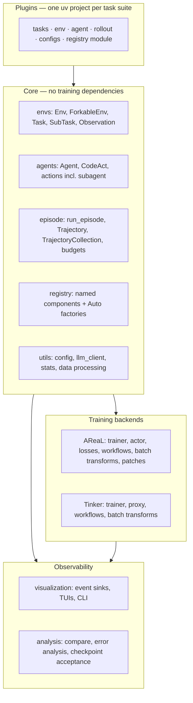

# Architecture

This section explains *why* Platoon is shaped the way it is. It is the counterpart to the [code
walkthroughs](../walkthroughs/index.md): those follow control flow, these explain design.

## Layers

## Pages

### [Registry and Auto factories](registry.md)
How a string in a YAML file becomes a Python callable, and why the indirection is worth it.

### [Agents, environments, episodes](agents-envs.md)
The Protocol-based core, the context-variable design, and the episode loop's termination rules.

### [The fork and sub-agent model](subagents.md)
Trees of trajectories: forking, parent links, budget accounting, and reward propagation.

### [AReaL backend internals](areal.md)
Single-controller training, SGLang rollouts, the proxy, and what Platoon patches upstream.

### [Tinker backend internals](tinker.md)
The managed-service path, the sampling proxy, and where it diverges from AReaL.

### [Data pipeline](data-pipeline.md)
Trajectory tree to token tensors: grouping, advantages, masks, filtering, sampling.

### [Configuration system](config.md)
Two config loaders, two override syntaxes, and how the typed dataclasses are assembled.

