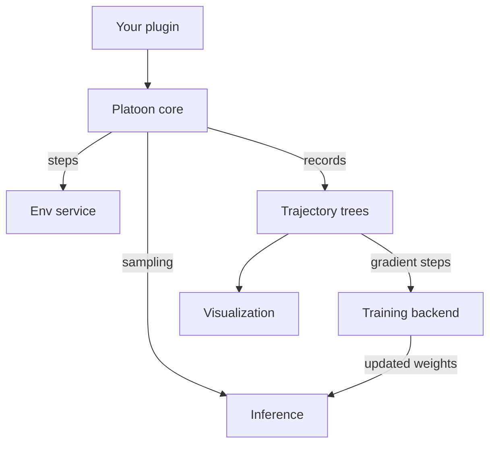

# Architecture

Platoon trains agents on tasks you define. The shape of the system follows from one constraint: the
code that describes a task should not know how training works, and the code that computes gradients
should not know what a task is. Everything below is a consequence of keeping those two apart.

## The layers

**Your plugin** supplies the task, the environment that scores it, the agent, the rollout program
that ties them together, and the YAML naming all of it — as an ordinary Python package that can live
in your own repository. **The core** runs episodes and holds the registry; it carries no training
dependencies, so an episode against a hosted model never loads a training framework. **A backend**
turns the resulting trajectories into gradient steps. **Observability** sits alongside rather than
downstream: rollout events stream to sinks as episodes run, so the TUIs read the same files a trainer
would.

## Composition by service

The expensive parts run as services addressed over the network, not as libraries linked into one
process, so each scales and is swapped independently.

- **Training engines behind the Tinker API.** That path targets an API, not a vendor, so any
  Tinker-compatible implementation works — a hosted service or your own.
- **Environments behind a server.** The [OpenReward](../plugins/openreward.md) integration talks to a
  server that owns the containers and the task catalog. Rollout workers stay thin.
- **Inference behind an endpoint.** Agents reach models through an OpenAI-compatible endpoint. In
  training it is managed for you; in [evaluation](../guides/evaluate.md) you point at any endpoint,
  which is why evaluation needs no GPU.

So the same plugin runs against a small hosted endpoint while you debug it and against a cluster when
you train, with no code change.

## Where the code lives

| Area | Package |
| --- | --- |
| Environments, tasks, observations | platoon/envs |
| Agents and actions | platoon/agents |
| Episode loop, trajectories, budgets | platoon/episode |
| Registry and `Auto` factories | platoon/registry.py |
| Training backends | platoon/train |
| Evaluation | platoon/inference |
| TUIs, event sinks, analysis | platoon/visualization, platoon/analysis |

## Pages

### [Components](components.md)
The pieces you assemble — tasks, environments, agents, rollouts — and the registry that lets a
config name them.

### [Execution](execution.md)
What happens during a run: the episode loop, delegation to other agents, and the trajectory tree
that comes out.

### [Backends](backends.md)
AReaL and Tinker side by side — what each one runs, where the compute lives, and how to choose.

For the vocabulary these pages assume, read [Concepts](../get-started/concepts.md) first.
