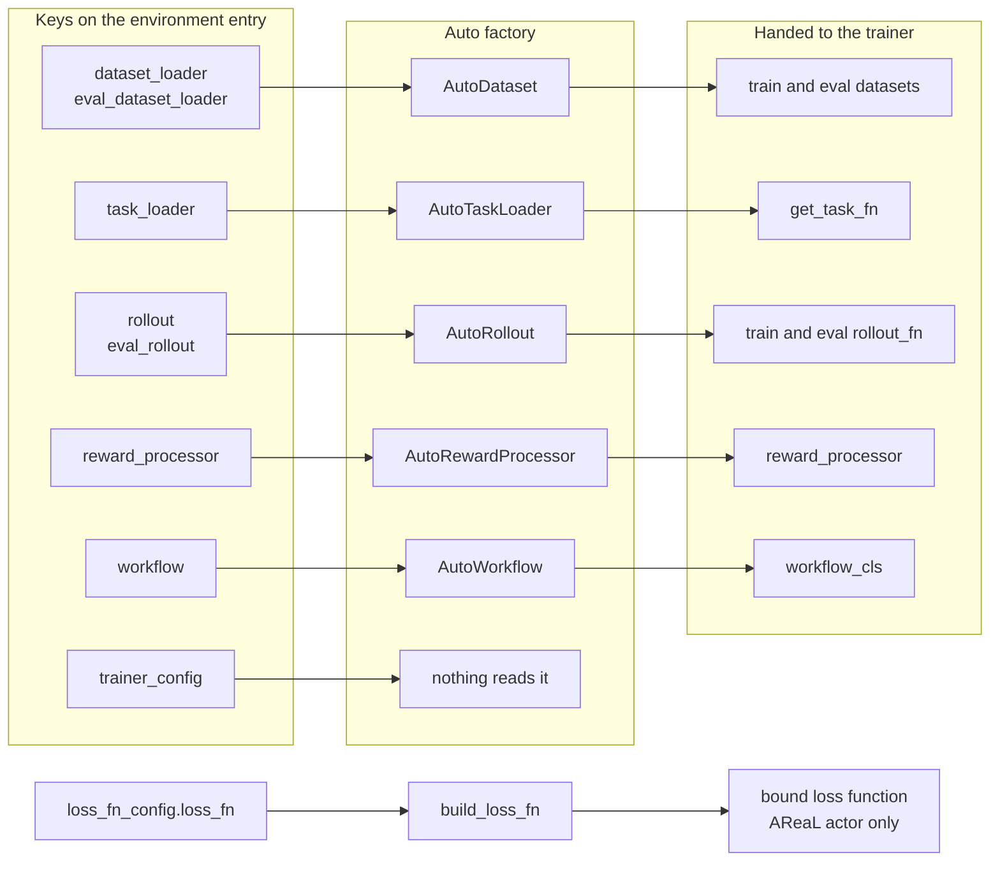
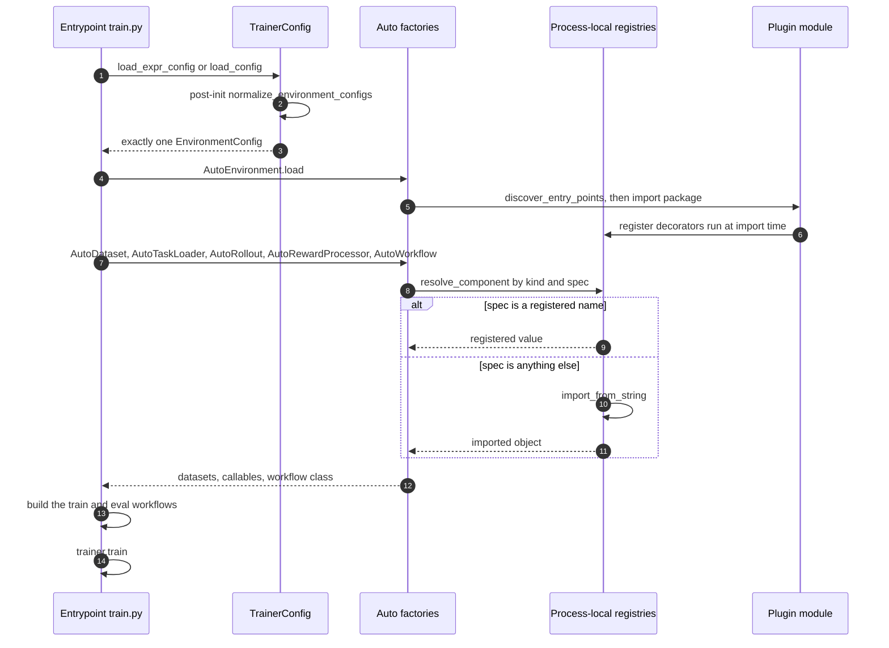

# Registry and Auto factories

This page explains how a string in a YAML file becomes a Python callable inside a training run, and
why that indirection exists. Read it before you write a plugin that plugs into the shared trainer
entrypoints, and read it again the first time an AReaL worker fails to import your rollout function.

## Why the indirection exists

A training run needs five environment-specific things: a **dataset loader**, a **task loader**, a
**rollout function**, a **reward processor**, and a **workflow class**. Everything else — the
trainer, the optimizer, batch assembly, logging — is shared.

There are two ways to supply those five. The first is a per-task training script: import the five
callables directly, build the datasets, construct the workflow, hand it to the trainer. That is what
most of this repository still does. `plugins/textcraft/platoon/textcraft/train_scripts/tinker/train_tinker_synth_depth_aware.py`
is 155 lines, most of which is dataset construction, a reward processor, and workflow wiring. Every
plugin that wants a depth-aware variant copies that file and changes a few imports.

The second way is to name the five callables in config and let a shared entrypoint resolve them.
That is what the registry exists for. Those 155 lines collapse to an 18-line `environments:` block
plus:

```bash
python -m platoon.train.tinker.train --config <your-config>.yaml
```

The payoff is not that strings are nicer than imports. It is that
<span class="pl-src">platoon/train/tinker/train.py</span> and
<span class="pl-src">platoon/train/areal/train.py</span> become *environment-agnostic*: a new task
suite becomes a YAML block and a registration module, not a new trainer. Fixes to the shared
entrypoint — the eval workflow's `filter_errors=False` default, AReaL's forced `group_size = 1` on
eval — then reach every environment at once, instead of only the scripts someone remembered to
update.

!!! note "This layer is new"

    The registry, the `Auto*` factories, and both `python -m platoon.train.*.train` entrypoints are
    recent additions on this branch. One plugin (`plugins/textcraft`) registers components and one
    YAML file uses `environments:`. Eight of the nine plugins still ship at least one bespoke
    `train_*.py`; the ninth (`plugins/openhands`) is a library plugin with no trainer at all. Both
    paths work today. This page documents the registry path; the script path is covered in
    [plugin anatomy](../walkthroughs/plugin-anatomy.md).

## The registry itself

<span class="pl-src">platoon/registry.py</span> is 169 lines with no framework machinery. It is a
process-local dict of dicts.

```python title="platoon/registry.py"
@dataclass(frozen=True)
class RegistryItem(Generic[T]):
    """A registered component plus metadata useful for serialization/docs."""

    name: str
    value: T
    import_path: str | None = None
    metadata: dict[str, Any] = field(default_factory=dict)
```

A `Registry[T]` holds `RegistryItem`s keyed by a free-form string, and carries the `kind` it was
created for so error messages can name it. `get_registry(kind)` creates registries lazily and caches
them in one module-level dict:

```python title="platoon/registry.py"
_REGISTRIES: dict[str, Registry[Any]] = {}


def get_registry(kind: str) -> Registry[Any]:
    """Return a process-local registry by kind, creating it on first use."""

    if kind not in _REGISTRIES:
        _REGISTRIES[kind] = Registry(kind)
    return _REGISTRIES[kind]
```

Two consequences follow from `_REGISTRIES` being a plain module dict. It is **process-local**: every
worker process must re-run the same imports to see the same names, which is why the AReaL path ships
import paths rather than registry names to its workers. And it has **no locking**: register at import
time, from the module body, not lazily from inside a coroutine.

### Registration: decorator or direct call

`Registry.register` is the whole mechanism. It returns a decorator when `value` is omitted, and
applies that decorator immediately when `value` is supplied:

```python title="platoon/registry.py"
def decorator(component: T) -> T:
    if name in self._items and not exist_ok:
        raise ValueError(f"{self.kind!r} registry already has an entry named {name!r}")
    self._items[name] = RegistryItem(
        name=name,
        value=component,
        import_path=import_path or infer_import_path(component),
        metadata=dict(metadata),
    )
    return component

if value is None:
    return decorator
return decorator(value)
```

So both of these are correct, and both appear in the one real registration module in the repository:

```python title="plugins/textcraft/platoon/textcraft/registry.py"
@register_task_loader("textcraft/synth")
def load_synth_task(task_id: str):
    return get_synth_task(task_id)


register_rollout("textcraft/synth/linear", run_synth_rollout)
register_rollout("textcraft/synth/recursive", run_synth_recursive_rollout)
register_rollout("textcraft/synth/depth_aware", run_synth_depth_aware_rollout)
```

Use the direct-call form when the callable already lives in another module and you only want to bind
a name to it. Use the decorator form when you are defining the callable in the registration module.

Three keyword arguments matter:

| Keyword | Type | Default | What it does |
| --- | --- | --- | --- |
| `exist_ok` | `bool` | `False` | When false, re-registering a name raises `ValueError`. |
| `import_path` | `str \| None` | `None` | Overrides the path inferred for the `RegistryItem`. |
| `**metadata` | `Any` | `{}` | Arbitrary extra keys stored on the `RegistryItem`. |

`exist_ok=False` is deliberate: two installed plugins that both register `"default"` under the same
kind crash the run at *import time* rather than silently shadowing each other. Namespace your names.
The convention textcraft established is `"<plugin>/<dataset>"` for loaders and
`"<plugin>/<dataset>/<variant>"` for rollouts and reward processors. Nothing enforces it — the name
is an arbitrary string key.

!!! note "`metadata` and `import_path` are write-only today"

    `RegistryItem.import_path` is filled in by `infer_import_path` on every registration, and
    `**metadata` is stored verbatim, but no production code in this repository reads either one, nor
    `Registry.get_item` or `Registry.items()`. The only consumer of `Registry.names()` is
    `list_loss_fns` in <span class="pl-src">platoon/train/areal/loss_functions.py</span>. These
    are groundwork for introspection tooling, not yet a stable API to build on.

### Resolution: a name, or an import path

`Registry.resolve` is what makes registration optional:

```python title="platoon/registry.py"
def resolve(self, spec: str | T) -> T:
    """Resolve a registry name, import path, or already-materialized value."""

    if isinstance(spec, str):
        if spec in self._items:
            return self.get(spec)
        return import_from_string(spec)
    return spec
```

Any string that is *not* a registered name is treated as a dotted import path. So this is a valid
`environments` block with zero registrations, no registration module, and no `package`:

```yaml
environments:
  - dataset_loader: my_pkg.components.load_dataset
    task_loader: my_pkg.components.load_task
    rollout: my_pkg.components.run_rollout
    reward_processor: my_pkg.components.score
    workflow: group_rollout
```

`import_from_string` accepts both `module.attr` and `module:attr`:

```python title="platoon/registry.py"
def import_from_string(path: str) -> Any:
    """Import ``module.attr`` or ``module:attr`` references."""

    module_path, separator, attr = path.replace(":", ".").rpartition(".")
    if not separator or not module_path or not attr:
        raise ValueError(f"Expected an import path like 'package.module.object', got {path!r}")
    module = importlib.import_module(module_path)
    value: Any = module
    for part in attr.split("."):
        value = getattr(value, part)
    return value
```

The colon is normalized to a dot before anything else happens, so the two forms are exactly
equivalent — the colon buys readability, not different behavior. Note also that the split is
`rpartition`, at the *last* dot, so `attr` can never contain a dot and the `for part in
attr.split(".")` loop always runs exactly once. **The object must be a module-level attribute.** A
spec like `my_pkg.mod:MyClass.method` normalizes to `my_pkg.mod.MyClass.method`, which asks Python to
import `my_pkg.mod.MyClass` as a module, and fails.

Registering rather than using an import path buys you three things: a short stable name decoupled
from your module layout, config that reads as configuration rather than as Python internals, and a
useful error when the name is wrong:

```python title="platoon/registry.py"
def get(self, name: str) -> T:
    if name not in self._items:
        available = sorted(self._items)
        raise ValueError(f"Unknown {self.kind}: {name!r}. Available: {available}")
    return self._items[name].value
```

That "Available: [...]" message only fires for kinds resolved through `get` rather than `resolve` —
in practice, losses. Everywhere else a typo falls through to `import_from_string` and surfaces as a
`ModuleNotFoundError` or `AttributeError` naming your misspelled string. Legible, but less helpful.

## The kinds

There are **seven** registry kinds in the repository. Six come from the `register_*` helpers at the
bottom of <span class="pl-src">platoon/registry.py</span>; the seventh is created directly with
`get_registry("loss")` at <span class="pl-src">platoon/train/areal/loss_functions.py</span>.
Nothing else calls `get_registry` or `register_component` with a new kind string.

| Kind | Helper | Config key that selects it | Resolved by | Registered value |
| --- | --- | --- | --- | --- |
| `dataset_loader` | `register_dataset_loader` | `dataset_loader`, `eval_dataset_loader` | `AutoDataset` | `(config, split, **kwargs)` |
| `task_loader` | `register_task_loader` | `task_loader` | `AutoTaskLoader` | `(task_id) -> Task` |
| `rollout` | `register_rollout` | `rollout`, `eval_rollout` | `AutoRollout` | `async (task, RolloutConfig)` |
| `reward_processor` | `register_reward_processor` | `reward_processor` | `AutoRewardProcessor` | `(traj) -> (float, dict)` |
| `workflow` | `register_workflow` | `workflow` | `AutoWorkflow` | a workflow **class** |
| `trainer_config` | `register_trainer_config` | `trainer_config` | nothing — see below | a config dataclass type |
| `loss` | `register_loss_fn` | `loss_fn_config.loss_fn` (AReaL only) | `build_loss_fn` | `(logprobs, entropy, input_data, ...)` |

The first six config keys live inside the single `environments` entry; the `loss` kind is selected
from an unrelated top-level block. Everything registered in the repository today:

- `task_loader`: `textcraft/synth`
- `dataset_loader`: `textcraft/synth`
- `rollout`: `textcraft/synth/linear`, `textcraft/synth/recursive`, `textcraft/synth/depth_aware`
- `reward_processor`: `textcraft/synth/delegation_capped`
- `trainer_config`: `textcraft/synth/areal`, `textcraft/synth/tinker`
- `loss`: `cispo`, `grpo`, `ppo`
- `workflow`: nothing

### Two kinds are not wired to config

Both of these are worth stating plainly, because the config keys exist and look functional.

**`trainer_config` is inert.** `register_trainer_config` exists, `EnvironmentConfig.trainer_config`
exists, textcraft registers two entries, and the one live YAML sets
`trainer_config: textcraft/synth/tinker`. But a repository-wide search finds no
`resolve_component("trainer_config", ...)` and no `AutoTrainerConfig`. The trainer config class is
chosen by which entrypoint module you invoke, not by config. Setting the key today does nothing;
omitting it changes nothing.

**The `workflow` registry is empty.** No `register_workflow` call exists anywhere. The default value
`"group_rollout"` is a sentinel handled *before* the registry is consulted, so on every path
exercised in this repository the workflow registry is never read at all. If you set `workflow:` to
something else, resolution goes through an empty registry and falls straight through to
`import_from_string` — so the value must be a dotted import path unless you register the class first.

**The `loss` kind is AReaL-only.** It is selected from `loss_fn_config.loss_fn` and bound by
`build_loss_fn`, called from the Platoon actor
(<span class="pl-src">platoon/train/areal/actor.py</span>). Tinker's `train.loss_fn` is a
different thing that happens to share a name: a plain string branched on inside
<span class="pl-src">platoon/train/tinker/rl.py</span>, which never touches the registry.
`register_loss_fn` also differs from the six generic helpers in passing `exist_ok=True`, so a loss
can be overridden by a later import; and `get_loss_fn` uses `Registry.get`, not `resolve`, so a loss
name has **no** import-path fallback. See [custom loss functions](../customization/loss.md).



## The Auto factories

<span class="pl-src">platoon/train/auto.py</span> is 109 lines of pure config-to-callable resolution
with no training logic. Each factory is a classmethod taking the whole trainer config object — in
fact anything exposing an `environments` attribute works, which is what the tests exploit.

### `AutoEnvironment`

`AutoEnvironment.from_config` extracts the single `EnvironmentConfig` and validates it. The failure
modes, in the order they are checked: a missing `environments` attribute raises `ValueError`; a value
that is not a list or tuple raises `TypeError`; an empty list raises `ValueError`; more than one
entry raises `NotImplementedError`; an entry that is not an `EnvironmentConfig` raises `TypeError`.

`AutoEnvironment.load` is the side-effecting half — it runs the imports that populate the registries:

```python title="platoon/train/auto.py"
@classmethod
def load(cls, config: Any) -> None:
    environment = cls.from_config(config)
    if environment.discover_entry_points:
        discover_entry_points()
    if environment.package is None:
        return
    import_modules([environment.package])
```

Entry-point discovery runs **first**, then `package`. Both return values are discarded; what matters
is that the module bodies execute their `@register_*` decorators. The two compose safely — if a
plugin is both discovered and named as `package`, the second `importlib.import_module` is a no-op
because the module is already in `sys.modules`, so decorators do not fire twice and `exist_ok=False`
does not bite.

### `AutoDataset`

```python title="platoon/train/auto.py"
loader_spec = (
    environment.dataset_loader
    if split == "train"
    else environment.eval_dataset_loader or environment.dataset_loader
)
loader = _resolve_required_component("dataset_loader", loader_spec)
kwargs = environment.dataset_kwargs if split == "train" else environment.eval_dataset_kwargs
dataset = loader(config, split, **kwargs)
if isinstance(dataset, list):
    return task_ids_to_dataset(dataset)
return dataset
```

Three details that catch people:

- **`split` is literally `"train"` or `"eval"`, never `"val"`.** A loader whose data calls that split
  something else must translate. TextCraft does exactly that:
  `split_name = "val" if split == "eval" else split`.
- **The loader falls back for eval; the kwargs do not.** `eval_dataset_loader` falls back to
  `dataset_loader`, but `eval_dataset_kwargs` defaults to `{}` and is used as-is, so an eval split
  silently gets your function's own Python defaults. [Custom dataset and
  tasks](../customization/dataset.md) has the consequences and how live configs work around them.
- **A returned `list` is converted; anything else passes through.** `task_ids_to_dataset` builds
  `Dataset.from_list([{"task_id": task_id} for task_id in task_ids])`, so returning a list of task-id
  strings is the shortest route. Returning a Hugging Face `Dataset` yourself also works, provided every
  row has a `task_id` key — that is the key the workflow reads.

See [custom datasets](../customization/dataset.md).

### `AutoTaskLoader`

The thinnest factory: it resolves `environment.task_loader` and nothing else. The loader is
**required**, and when it is unset the error is explicit —
`ValueError("Config must set environments[0].task_loader")`.

The registered callable takes a task-id string and returns a `Task` (or a `SubTask`, which subclasses
`Task`). Both workflows call it **synchronously**, so an `async` task loader breaks the run.

### `AutoRollout`

Structurally identical to `AutoDataset`'s loader selection: `eval_rollout` falls back to `rollout`,
and the `split` argument defaults to `"train"`. The rollout is required.

The registered callable must be **async**, and it is awaited with exactly two positional arguments:
the `Task` and a `RolloutConfig`. There is no `rollout_kwargs` field on `EnvironmentConfig`, so
additional parameters are reachable only through their Python defaults. To vary them from config you
register a second name bound to a differently-parameterized function — which is precisely why
textcraft has three rollout registrations rather than one plus arguments. See
[custom rollouts](../customization/rollout.md).

### `AutoRewardProcessor`

The only optional component:

```python title="platoon/train/auto.py"
@classmethod
def from_config(cls, config: Any) -> Any:
    environment = AutoEnvironment.from_config(config)
    if environment.reward_processor is None:
        return lambda traj: (traj["reward"], {})
    return resolve_component("reward_processor", environment.reward_processor)
```

That default lambda is byte-identical to the default parameter on both workflow classes
(<span class="pl-src">platoon/train/areal/workflows/group_rollout_workflow.py</span> and
<span class="pl-src">platoon/train/tinker/workflows/group_rollout_workflow.py</span>). The
duplication is load-bearing on AReaL: a lambda has no import path, so this one cannot be shipped to a
worker — instead it is omitted from the serialized kwargs and the worker falls back to the class
default, which is the same function. Leaving `reward_processor` unset therefore behaves identically
on both backends. See [custom rewards](../customization/rewards.md).

### `AutoWorkflow`

```python title="platoon/train/auto.py"
@classmethod
def from_config(cls, config: Any, default: type) -> type:
    environment = AutoEnvironment.from_config(config)
    if environment.workflow == "group_rollout":
        return default
    return resolve_component("workflow", environment.workflow)
```

`"group_rollout"` is a **sentinel string, not a registry entry.** It selects the `default` the
entrypoint passed in — `platoon.train.tinker.workflows.GroupRolloutWorkflow` on Tinker,
`platoon.train.areal.workflows.GroupRolloutWorkflow` on AReaL. That is how one config value can mean
"the right default for whichever backend you are running", which a single registry name could not
express.

A custom workflow class must match the entrypoint's constructor call, and the two entrypoints differ.
AReaL passes the first five arguments positionally and pops `output_subdir` and `filter_errors` out of
`workflow_kwargs`; Tinker passes everything by keyword and pops `stats_scope` and `filter_errors`.
Remaining `workflow_kwargs` keys are forwarded verbatim, so an unrecognized key becomes a `TypeError`
from your constructor. The popped defaults differ by split: `filter_errors` is `True` for train and
`False` for eval on both backends. See [custom workflows](../customization/workflow.md).

!!! warning "The workflow extension point is untested"

    Nothing in the repository registers a workflow, and no test covers a non-default class. The
    machinery reads correctly, but you would be its first user. Where it is enough, prefer
    subclassing `GroupRolloutWorkflow` and passing extra constructor arguments through
    `workflow_kwargs`.

## Discovery: `package` versus `discover_entry_points`

Registration only happens when the module containing the decorators is imported. There are two ways
to make that happen, and they trade off differently.

| | `package: my_pkg.registry` | `discover_entry_points: true` |
| --- | --- | --- |
| Declared in | your YAML config | the plugin's `pyproject.toml` |
| Mechanism | `importlib.import_module(path)` | `entry_points(group="platoon.plugins")` then `.load()` |
| Requires install | no — any importable module | yes — the distribution's metadata must be visible |
| Scope | exactly one module | **every** installed plugin advertising the group |
| Default | `None` | `False` |
| Order | runs second | runs first |

The entry-point declaration is one table in `pyproject.toml`:

```toml title="plugins/textcraft/pyproject.toml"
[project.entry-points."platoon.plugins"]
textcraft = "platoon.textcraft.registry"
```

The value is a module path with no `:attr`, so `entry_point.load()` imports the module and returns
it; the registration decorators run as a side effect of that import.

Prefer `package` for a single-environment run. It is explicit, needs no install metadata, and names
the exact module in the config, so the run is self-describing — you can read one YAML file and know
where every component came from. Turn on `discover_entry_points` only when several plugins genuinely
must register at once.

Two failure modes to know about:

- **`entry_point.load()` is unguarded.** There is no `try`/`except` around it, so one broken plugin
  anywhere in the environment aborts discovery and therefore the whole run. Textcraft defends from
  the other side by wrapping its own optional trainer-config registrations in bare
  `try: ... except Exception: pass`, so importing its registry module does not require both training
  backends to be installed. Copy that pattern for any registration that depends on an optional extra.
- **Name collisions crash at import.** With `discover_entry_points: true`, two installed plugins
  registering the same name under the same kind hit the `exist_ok=False` check and raise before the
  run starts.

For the packaging side of this — the `platoon.<name>` namespace layout, the deliberately absent
`__init__.py`, the uv extras — see [packaging a plugin](../customization/packaging.md).

## Import paths, and the constraint AReaL imposes

Two similar-looking functions compute import paths, and they are not the same function.

`infer_import_path` (<span class="pl-src">platoon/registry.py</span>) runs at registration time to
fill in `RegistryItem.import_path`. It is conservative: it reads `__qualname__` and returns `None` for
anything defined inside a function (`<locals>` in the qualname) or in `__main__`.

`callable_import_path` (<span class="pl-src">platoon/train/areal/workflow_serialization.py</span>)
runs at *training* time on the AReaL path, and it is the one that matters operationally. AReaL ships
workflows to worker processes by import path, not by pickle:

```python title="platoon/train/areal/workflows/group_rollout_workflow.py"
def to_workflow_kwargs(self) -> dict[str, Any]:
    kwargs = {
        "rollout_fn": callable_import_path(self.rollout_fn),
        "get_task_fn": callable_import_path(self.get_task_fn),
        "config": asdict(self.config),
        ...
    }
    reward_processor_path = callable_import_path(self.reward_processor)
    if kwargs["rollout_fn"] is None or kwargs["get_task_fn"] is None:
        raise ValueError("GroupRolloutWorkflow requires importable rollout_fn/get_task_fn")
    if reward_processor_path is not None:
        kwargs["reward_processor"] = reward_processor_path
    return kwargs
```

On the worker those strings are re-imported to rebuild the workflow. `callable_import_path` uses
`__name__` rather than `__qualname__`, and has a special case for functions defined in a script run as
`__main__`: it walks `sys.path` to recover a package-qualified path, preferring candidates that start
with `platoon.`. That special case is why a legacy `train_*.py` script can still register a rollout
that survives the trip to a worker.

!!! warning "Registered callables must be importable module-level objects"

    On the AReaL path, a rollout function or task loader that cannot be named by an import path will
    fail — and the two ways it fails are not equally obvious.

    **Loud failure.** A `lambda` (whose `__name__` is `<lambda>`) or a `functools.partial` (which has
    no `__name__` at all) yields `None`, and the run dies at workflow serialization with
    `ValueError: GroupRolloutWorkflow requires importable rollout_fn/get_task_fn`.

    **Quiet failure.** A closure, a nested function, or a bound method has a real `__name__` and a
    real `__module__`, so `callable_import_path` happily returns something like
    `"my_pkg.mod.inner"` — a string that does not resolve to anything. The driver process is fine;
    the worker fails later with an `AttributeError` for a name that never existed at module level.

    Register plain module-level `def`s and classes. If you need a parameterized variant, define it as
    a module-level function with the parameters as defaults and register it under a second name —
    exactly the shape `plugins/textcraft/platoon/textcraft/registry.py` uses for its three rollouts.

The Tinker path does not serialize workflows to remote workers, so it tolerates closures and partials.
That makes this a silent portability trap: a registration that works on Tinker can break the moment
someone points the same module at an AReaL config. Treat "importable module-level object" as the
contract regardless of which backend you are targeting today.

## Exactly one environment

The key is plural and the type is a list, but both trainer configs and `AutoEnvironment` reject more
than one entry:

```python
raise NotImplementedError("Multiple environments are not yet supported; provide exactly one entry")
```

It is checked twice — in `__post_init__` on both `PlatoonArealRLTrainerConfig` and
`PlatoonTinkerRLTrainerConfig`, and again in `AutoEnvironment.from_config`. The plural name is
aspirational: the intent is eventually to train across a mixture of environments, but today one run
means one dataset loader, one task loader, one rollout, one reward processor, and one workflow class.
If you want a mixture now, express it *inside* a single loader that returns task ids from several
sources and a single rollout that dispatches on the task.

`environments` must also be a list. Passing a bare mapping gets a targeted message rather than a
confusing type error:

```python title="platoon/train/components.py"
if isinstance(environments, dict):
    raise ValueError(
        "`environments` must be a list; use `environments: - ...` for a single environment"
    )
```

!!! warning "This is not `openreward.environments`"

    The OpenReward plugin has its own, entirely unrelated `environments` list nested under the
    `openreward:` config key, with fields like `label`, `env_name`, `session_url` and
    `sampling_weight`. That one is a task-source mixture and has nothing to do with the registry.
    Whenever you see `environments:` in a YAML file, check its indentation level first.

## The resolution sequence

Putting it together — one run of `python -m platoon.train.tinker.train`. The AReaL entrypoint is
line-for-line parallel apart from the config loader and the workflow constructor call.



One backend difference is worth knowing, because it explains why `normalize_environment_configs`
exists at all. AReaL loads config through OmegaConf, whose `to_object` call produces real
`EnvironmentConfig` dataclass instances. Tinker's own loader
(<span class="pl-src">platoon/utils/config.py</span>) recurses only into fields whose type
`is_dataclass`; `list[EnvironmentConfig]` is not, so the raw list of dicts is assigned to the field
and converted in `__post_init__`. The same difference is why Tinker silently drops unknown top-level
YAML keys while AReaL rejects them. See [the configuration system](config.md).

## Where this stands today

An honest summary of what is actually exercised:

- The **Tinker** registry path is the only one verified end to end in the repository, by
  `plugins/textcraft/platoon/textcraft/configs/tinker/textcraft_synth_depth_aware_tinker.yaml`.
- The equivalent **AReaL** `environments:` block exists but is commented out in
  `textcraft_synth_ctx40000_depth_aware_medium_areal.yaml`; that config still runs through the
  bespoke `train_areal_synth.py`.
- `tests/test_registry_components.py` covers registration, duplicate rejection, import-path
  resolution, the eval split and its kwargs, side-effect imports, the `group_rollout` sentinel, and
  the multi-environment rejection.
- Nothing covers `AutoWorkflow` with a registered class, and nothing consumes `trainer_config`.

If you are writing a new plugin, register your components and drive the run from `environments:` —
that is the direction the repository is moving and the path the shared entrypoints support. If you
are modifying an existing plugin that still has a `train_*.py`, either path is fine; the script path
is not deprecated and nothing removes it.

## See also

- [Build a plugin](../tutorials/build-a-plugin.md) — the end-to-end tutorial.
- [Plugin anatomy](../walkthroughs/plugin-anatomy.md) — a file-by-file read of a real plugin.
- [Packaging a plugin](../customization/packaging.md) — namespace layout, extras, entry points.
- [Configuration reference](../reference/configuration.md) — every key, including `environments`.
- [Plugin reference](../reference/plugins.md) — what ships under `plugins/`.
- [The configuration system](config.md) — two loaders, two override syntaxes.
- [AReaL backend internals](areal.md) — remote workflow reconstruction in context.
