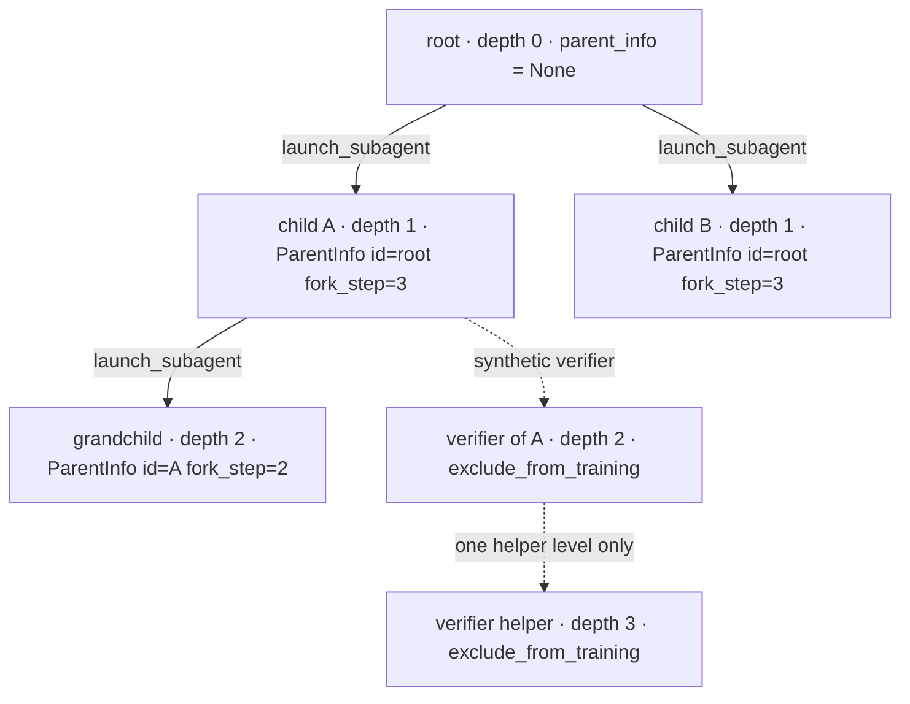
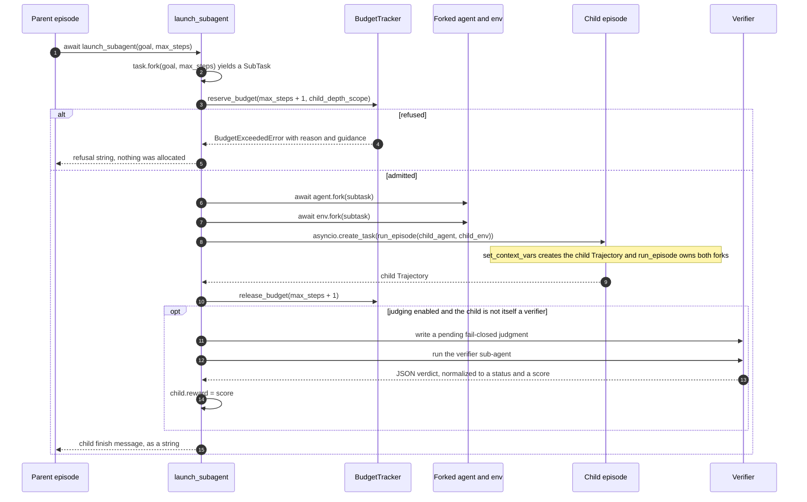
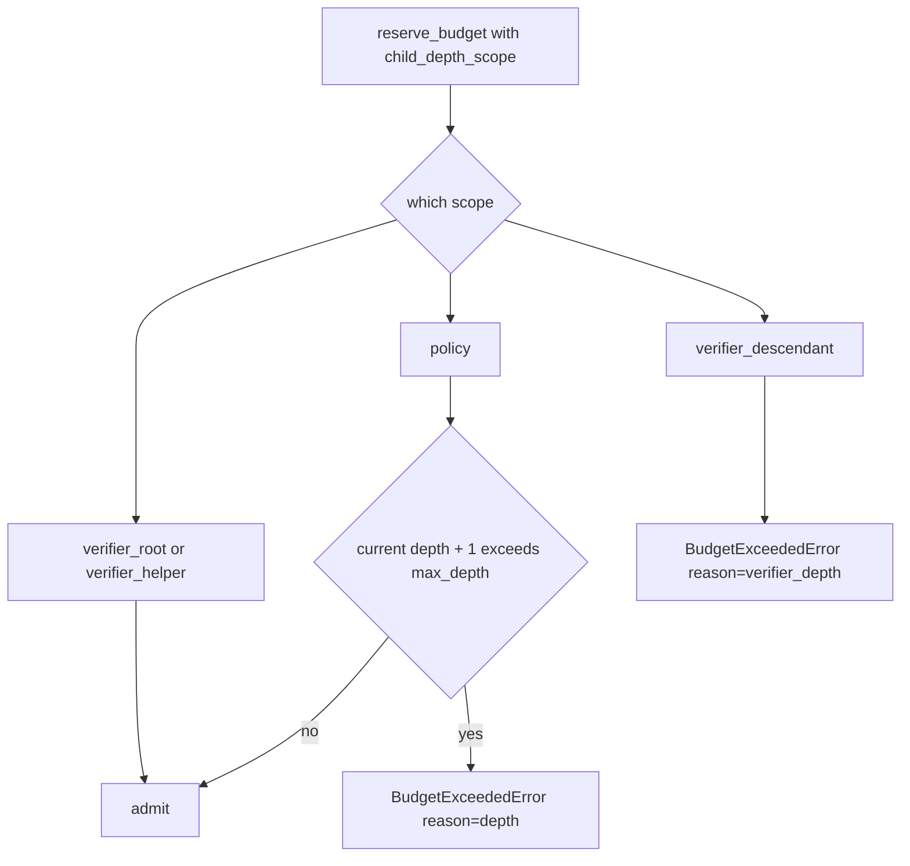
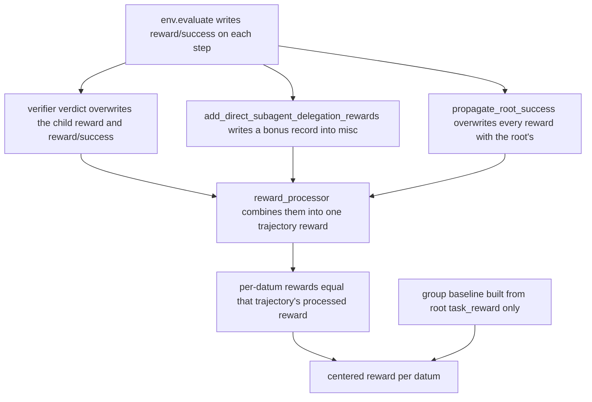
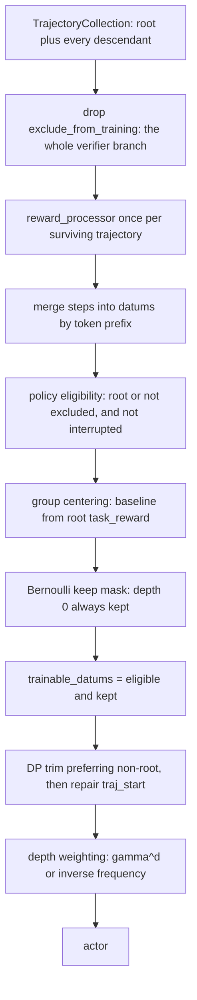

# The fork and sub-agent model

Most RL-for-agents frameworks treat a rollout as one linear trajectory. Platoon treats a rollout as
a **tree**: an agent can delegate a subtask from inside an ordinary environment step, and the child
episode becomes another trajectory in the same collection. This page explains the mechanism — what
a delegation call actually does, how step budgets are accounted across the tree, how rewards flow
back down it, and which parts of that tree end up producing gradients.

If you only want to *use* recursion, start with [Recursive agents](../tutorials/recursive-agents.md)
and [Recursive rollouts](../recipes/recursive.md). This page is the design rationale underneath
them.

## One rollout is a tree

The recording side of an episode is a `TrajectoryCollection`: a flat
`dict[trajectory_id, Trajectory]` plus a list of event handlers. The tree structure is not a nested
data structure — it is an edge stored on each child:

```python title="platoon/episode/trajectory.py"
@dataclass
class ParentInfo:
    id: str
    fork_step: int
```

`fork_step` is the parent's step index at the moment the child was created, so the collection
records not just *who* delegated but *when* in the parent's own trajectory. The root has
`parent_info = None`.

There is exactly one place in the codebase that creates this edge:

```python title="platoon/episode/trajectory.py"
def create_trajectory(self, parent_traj: Trajectory | None = None) -> Trajectory:
    parent_info = (
        ParentInfo(
            id=parent_traj.id,
            fork_step=len(parent_traj.steps),
        )
        if parent_traj is not None
        else None
    )

    trajectory = Trajectory(id=str(uuid.uuid4()), parent_info=parent_info)
    self.trajectories[trajectory.id] = trajectory
```

And exactly one caller — `set_context_vars`, which every `run_episode` runs before its first step:

```python title="platoon/episode/loop.py"
parent_traj = current_trajectory.get(None)
current_trajectory.set(current_trajectory_collection.get().create_trajectory(parent_traj=parent_traj))
```

That is the whole trick. `run_episode` reads whatever `current_trajectory` already holds and makes
the new episode its child. A nested episode nests in the tree automatically: no plumbing, no
explicit parent argument, no special "sub-agent episode" code path. The child runs the same
`run_episode` as the root.



Two structural facts follow from the flat dict, and a surprising amount of downstream code depends
on them.

**The root is the first key, not a flag.** `propagate_root_success`, `_compute_trajectory_depths`
and `get_train_data_for_trajectory_collection` all identify the root with
`next(iter(trajectories))`. Any code that rebuilds a collection must preserve root-first insertion
order.

**Depth is derived, not stored.** `_compute_trajectory_depths` walks `parent_info` links; a
trajectory whose parent id is missing from the collection resolves to depth 0.

!!! note "Concurrency"
    Siblings run concurrently. `asyncio.gather(launch_subagent(...), launch_subagent(...))` is the
    supported way to fan out, and the CodeAct AST guard explicitly allows it. Two siblings launched
    in the same parent step share the same `fork_step`, which is how the tree records parallelism.

## What a delegation call does

The entry point is a plain async function that the environment injects into the agent's action
space:

```python title="platoon/agents/actions/subagent.py"
async def launch_subagent(goal: str, max_steps: int = 15, task_misc: dict | None = None, verbose: bool = True) -> Any:
```

It returns **a string**, always: the child's finish message, a sanitized error string, or a
budget-refusal message. It never raises into the calling agent's code.



### 1. Fork the task

```python title="platoon/agents/actions/subagent.py"
task = parent_traj.task if parent_traj is not None and parent_traj.task is not None else env.task
task_misc = _propagate_verifier_task_misc(dict(task.misc), task_misc)

subtask = task.fork(goal, max_steps, task_misc=task_misc)
```

For an ordinary delegation `parent_traj` is `None`, so the base is `env.task` — the *live*
environment's task, not a snapshot. `Task.fork` branches on `fork_strategy`, and the choice silently
changes what the child model sees in its prompt:

| `fork_strategy` | Child task type | What the child's prompt shows |
| --- | --- | --- |
| `"subtask"` (default) | `SubTask` with `parent_tasks=[self]` | Its own goal *plus* the ancestor goal stack |
| `"task"` | plain `Task`, fresh `id` | Its own goal only |

`SubTask.__str__` renders the ancestry as `Level N: <goal>` lines, most recent first, and that
string reaches the model because `CodeActPromptBuilder` interpolates `str(obs.task)` into the first
user turn. `SubTask.fork` ignores `fork_strategy` entirely and always returns another `SubTask`, so
once a subtree becomes `SubTask`s the ancestry list grows by one per level for the rest of the
subtree.

TextCraft opts out — `TextCraftEnv.__init__` sets `task.fork_strategy = "task"` unconditionally, so
its children get clean, context-free crafting goals with no lineage. Whether ancestry helps or hurts
is a modeling decision: it costs prompt tokens and can invite a child to re-solve the parent's
problem, but without it a child cannot tell why it was asked for something.

If `task_misc` is `None`, `Task.fork` assigns the parent's `misc` **by reference**, so the two tasks
then share one dict — `TextCraftEnv.fork` copies it defensively before adding its own keys, and yours
should too. If you pass a `task_misc`, it *replaces* the parent's, with one exception covered under
[sub-agent judging](#sub-agent-judging).

### 2. Admit or refuse, before allocating anything

```python title="platoon/agents/actions/subagent.py"
tracker = budget_tracker.get()
reserved_budget = max_steps + 1
...
try:
    tracker.reserve_budget(
        reserved_budget,
        raise_on_failure=True,
        child_depth_scope=child_depth_scope,
    )
except (BudgetExceededError, ValueError) as e:
    guidance = getattr(e, "guidance", "")
    msg = f"Not enough budget to launch subagent for goal {goal}. {e}"
    if guidance:
        msg += " " + guidance
    return msg
```

Admission control runs *first*, before any fork. A refused delegation allocates nothing — no agent,
no environment, no child trajectory — and the model gets a string it can act on rather than an
exception it cannot catch. The `+1` is deliberate: the parent needs at least one step of its own to
read the child's answer, and the tracker's guidance text says so verbatim.

### 3. Fork the agent, then the environment

```python title="platoon/agents/actions/subagent.py"
forked_agent = await agent.fork(subtask)
forked_env = await env.fork(subtask)
```

Both come from contextvars — `current_agent` and `current_env` — so the child is a fork of whoever
is running *right now*, at whatever depth. The order is load-bearing: if the env fork raises, the
already-returned agent is closed by the launcher's `finally`.

The protocols are one method each, and their docstrings state a real obligation:

```python title="platoon/envs/base.py"
@runtime_checkable
class ForkableEnv(Env, Protocol):
    async def fork(self, task: Task) -> ForkableEnv:
        """Return an independently closeable child environment.

        Implementations that allocate resources before returning must clean up
        partial allocations if the fork raises, including on cancellation.
        """
```

"Independently closeable" is the contract that matters. `launch_subagent` closes only handles a fork
*successfully returned*; anything a half-finished `fork` allocated is the implementation's problem.
What `fork` actually shares is entirely up to you, and the two shapes in the repository are
opposites:

- **TextCraft shares world state by reference.** `TextCraftEnv.fork` passes
  `initial_inventory=self._code_executor.inventory` with `_share_inventory=True`, so items a child
  crafts appear in the parent's inventory. The delegation is a real division of labor.
- **OpenReward shares a live session but narrows the tools.** `OpenRewardOpenHandsEnv.fork` selects
  the child's tool schema from `subagent_environment_access`, and even `shared` strips the
  environment-terminal tools so a child cannot submit the root task.

### 4. Hand ownership to the child episode

```python title="platoon/agents/actions/subagent.py"
parent_token = current_trajectory.set(parent_traj) if parent_traj is not None else None
try:
    return await asyncio.create_task(
        _run_owned_subagent_episode(
            forked_agent,
            forked_env,
            timeout=episode_step_timeout.get(),
            ownership_started=episode_ownership_started,
        )
    )
finally:
    if parent_token is not None:
        current_trajectory.reset(parent_token)
```

`asyncio.create_task` copies the context, so everything the child episode writes to
`current_trajectory`, `current_agent`, `current_env`, `finish_message` and `error_message` stays
inside the child. Without that isolation a child calling `finish()` would end the parent's episode.

`_run_owned_subagent_episode` sets `ownership_started` **before its first suspension**, then awaits
`run_episode`. From that instant `run_episode`'s own `finally` is the sole owner of closing both
forks. The child also inherits the parent's per-step deadline through the `episode_step_timeout`
contextvar.

### 5. Tear down in a fixed order

```python title="platoon/agents/actions/subagent.py"
finally:
    try:
        # Release synchronously, before cleanup awaits can be cancelled or
        # mutate the trajectory context used by StepBudgetTracker.
        tracker.release_budget(reserved_budget)
    finally:
        if not episode_ownership_started.is_set():
            if forked_agent is not None:
                await _close_episode_resource(forked_agent, "forked agent")
            if forked_env is not None:
                await _close_episode_resource(forked_env, "forked environment")
```

Budget release is synchronous and first, so a cancellation landing during cleanup cannot strand a
reservation. The ownership flag is what prevents a double close.
`tests/test_subagent_fork_lifecycle.py` pins every permutation — success, agent-fork failure,
env-fork failure, cancellation during the env fork, and cancellation before the handoff — as exact
event sequences.

### 6. Return a string

```python title="platoon/agents/actions/subagent.py"
def _subagent_error_message(error: str) -> str:
    first_line = next((line.strip() for line in error.splitlines() if line.strip()), "")
    if first_line.startswith("WARNING: Exhausted budget"):
        return "Subagent did not finish before its step budget was exhausted."
    return "Subagent failed before finishing."
```

The parent never sees a traceback or a budget number. A child that finished without a message
returns `""`. This is deliberate: the return value is model-visible text, and leaking internal state
into it teaches the policy to reason about the harness instead of the task.

!!! warning "A normal return does not mean the child succeeded"
    Budget refusals, depth refusals and child failures all come back as ordinary strings. Wrapper
    code that counts successful delegations must inspect the child *trajectory*, not the return
    value. The `verbose` parameter is threaded through but discarded (`_ = verbose`) and has no
    effect.

## Budget accounting across the tree

The budget tracker is a contextvar, so the whole subtree shares one policy. `run_episode` installs a
plain `StepBudgetTracker` if nothing set one. Both trackers implement the same protocol:

```python title="platoon/episode/trajectory.py"
@runtime_checkable
class BudgetTracker(Protocol):
    def reserve_budget(
        self,
        requested_budget: float,
        raise_on_failure: bool = False,
        *,
        child_depth_scope: SubagentDepthScope = "policy",
    ) -> bool: ...

    def release_budget(self, amount_to_release: float) -> None: ...
```

### `StepBudgetTracker` — one shared budget for the whole subtree

`used_budget_for(tid)` is **recursive**: the trajectory's own steps plus every descendant's steps.
So `remaining = task.max_steps - recursive_used - reserved_for_this_trajectory`, and delegation
spends the root's budget. A tree whose root has `max_steps: 9` executes at most nine steps in total,
however they are divided among children.

The refusal carries text written for the model, not for you:

```python title="platoon/episode/trajectory.py"
raise BudgetExceededError(
    f"Requested step budget {requested_budget} exceeds remaining budget {self.remaining_budget()}.",
    reason="step_budget",
    guidance=(
        "Note: launch_subagent will automatically reserve max_steps + 1 steps "
        "since you will need one or more steps to process the result of the "
        "subagent and complete the task. "
        "You could try requesting a smaller budget or perform the task yourself."
    ),
)
```

`BudgetExceededError` carries two extra attributes beyond the message: `reason` (a short tag —
`"step_budget"`, `"depth"`, `"verifier_depth"`) for your telemetry, and `guidance` (an actionable
suggestion) which `launch_subagent` appends to the string it hands back to the model.

`StepBudgetTracker.reserve_budget` starts with `_ = child_depth_scope` — it **ignores depth
entirely**. Under this tracker there is no depth cap and no separate bound on the verifier subtree;
the shared step budget is the only limit.

!!! warning "`used_budget_for` is quadratic"
    `_iter_descendant_trajectory_ids` rescans the entire collection for children at every level of
    the walk, and it runs on every `remaining_budget()` check — that is, once per step of every
    episode. The source flags it with a TODO. On wide, deep trees this is measurable.

### `DepthAwareStepBudgetTracker` — independent budgets, capped depth

`used_budget_for(tid)` counts **only that trajectory's own steps**, `release_budget` is a no-op, and
`reserve_budget` discards `requested_budget` entirely. Each trajectory is bounded solely by its own
`task.max_steps` through `halt_episode`; the only thing `reserve_budget` decides is whether the
delegation is allowed at all.



`SubagentDepthScope` is a four-way `Literal`, classified by `_subagent_depth_scope` from the
verifier markers on the parent's and the child's task `misc`:

| Scope | When | Under `DepthAwareStepBudgetTracker` |
| --- | --- | --- |
| `policy` | ordinary delegation | refused when `current_depth + 1 > max_depth` |
| `verifier_root` | the synthetic verifier of a judged child | always admitted |
| `verifier_helper` | a sub-agent launched by a verifier | always admitted |
| `verifier_descendant` | anything below a helper | always refused |

Synthetic verifiers sit outside the policy recursion tree, so exempting them from `max_depth` keeps
`max_depth` meaning "how deep may the *policy* delegate". The exemption is narrow on purpose: the
verifier subtree is bounded at root plus one helper level, and a helper's attempt to delegate again
gets `reason="verifier_depth"` with guidance telling it to inspect the evidence itself.

`max_depth` defaults to `None`, which means no cap. The root is depth 0, so a `max_depth` of 2
allows the root plus two levels of descendants.

### Who is charged

`reserve_budget` runs *before* the trajectory contextvar is overridden on the verifier path, and
`release_budget` runs *after* it is reset. Both are therefore charged to the **calling** trajectory,
symmetrically, including for verifier launches. Under `StepBudgetTracker` that means a verifier's
steps are counted as descendants of the caller's subtree and consume the root's shared budget.

## Reward flow

The default per-trajectory reward is whatever the environment accumulated. Three mechanisms rewrite
or augment it, and they compose badly, so pick deliberately.



### `propagate_root_success`

`RolloutConfig.propagate_root_success` (default `None`, resolved to `False` in `__post_init__`)
makes the rollout call `propagate_root_success(collection)` at the end. It takes the first
trajectory as the root, reads its last step's `reward/success` (falling back to `trajectory.reward`),
and **overwrites every trajectory's** reward and last-step `reward/success` with that value. It also
rewrites `reward/subagent_succeeded = reward/subagent_launched * root_success` on every step that
recorded a launch.

This is the bluntest possible credit assignment: every trajectory in the tree gets the root's
outcome. It is also the cleanest, because it puts every datum in the rollout on the same scale as
the group baseline — see [where credit comes from](#where-credit-actually-comes-from).

The historical misspelling `propogate_root_success` is still accepted, both as a config key and as a
module-level function alias; setting both keys to conflicting values raises.

### `skip_subagent_reward_computation`

`RolloutConfig.skip_subagent_reward_computation` (default `False`) tells an environment not to run
its (often expensive) evaluator for sub-agent tasks, returning `reward/success = 0.0` immediately.
It pairs naturally with `propagate_root_success`, which is about to overwrite those zeros anyway.

There is no core implementation — each plugin decides what "is a sub-agent task" means, and the
heuristics differ:

| Plugin | Test |
| --- | --- |
| TextCraft | `"textcraft" not in (self._task.id or "")` |
| Oolong | `"oolong" not in (self._task.id or "")` |
| DeepDive | `"deepdive" not in (self._task.id or "")` |
| AppWorld | `isinstance(self._task, SubTask) and bool(self._task.parent_tasks)` |

The id-substring tests are brittle: a forked task gets a fresh `uuid4()` id, so they work only
because root task ids happen to contain the plugin name. AppWorld's type test is the version to copy
in new environments — but note that it depends on `fork_strategy` staying `"subtask"`.

### Delegation bonus

`add_direct_subagent_delegation_rewards(collection, coefficient)` writes, for every trainable
trajectory, a `misc["subagent_delegation_reward"]` record:

```python title="platoon/utils/subagent_rewards.py"
_get_trajectory_misc(trajectory)[SUBAGENT_DELEGATION_REWARD_MISC_KEY] = {
    "coefficient": coefficient,
    "launched": float(launched),
    "succeeded": float(succeeded),
    "success_rate": float(success_rate),
    "bonus": float(coefficient * success_rate),
}
```

Two design choices are worth naming. Trajectories marked `exclude_from_training` are filtered out
first, so **a verifier never counts as a successful delegation**. And each child contributes
`_get_base_success` — its last step's `reward/success`, falling back to `trajectory.reward` — which
is its score *before* its own delegation bonus, so bonuses do not compound up the tree.

The function only writes metadata. The bonus enters the actual reward in the plugin's
`reward_processor`; OpenReward's computes `pre_efficiency_reward = base_reward + delegation_bonus`.

### Sub-agent judging

Setting the `subagent_reward_judge_config` contextvar to a `SubagentRewardJudgeConfig` turns on a
synthetic **reward verifier**: after each child episode finishes, `launch_subagent` runs *another*
sub-agent whose only job is to check what the child claims to have done.

```python title="platoon/agents/actions/subagent.py"
@dataclass(frozen=True)
class SubagentRewardJudgeConfig:
    max_steps: int = 20
    behavior_judge: SubagentBehaviorJudge | None = None
```

The motivation: a child's own environment reward is frequently unavailable or meaningless. The root
task has a grader; "write the migration script and put it in `scripts/`" does not. A verifier that
can inspect the same live environment can produce a per-child target where the environment cannot.

**Fail closed first.** Before launching anything, the just-finished child gets a `pending` judgment,
`reward = 0.0` and `exclude_from_policy_training = True`:

```python title="platoon/agents/actions/subagent.py"
pending_judgment = {
    "status": "pending",
    "score": 0.0,
    "summary": "Subagent reward verification is still in progress.",
    SUBAGENT_REWARD_JUDGMENT_TRAINING_ELIGIBLE_KEY: False,
}
traj.misc[SUBAGENT_REWARD_JUDGMENT_MISC_KEY] = pending_judgment
_record_judgment_reward(traj, pending_judgment)
```

If the rollout is cancelled while verification is in flight, the child cannot survive as an
unverified positive target.

**The verifier is a sub-agent parented to the judged child.** It is launched through
`_run_subagent_trajectory` with `parent_traj=traj`, which does two distinct things. The verifier's
task is forked from the *child's* task, so it inherits the child's lineage. The *agent and
environment* it forks, however, are the caller's — `current_agent` and `current_env` still hold the
parent's, because the child's env was already closed by its own `run_episode`. Your `fork` must
therefore be able to produce a useful verifier from the parent's live state. Overriding
`current_trajectory` for the duration makes the verifier's `parent_info.id` point at the judged
child, so it hangs off the right node in the tree.

The verifier's goal is built by `_format_verifier_goal`, which embeds the judged child's trajectory
id, goal, final message and error message, tells the verifier not to trust the child's summary, and
demands a JSON object returned through `finish` with `status`, `score`, `summary`, `passed_claims`,
`failed_claims` and `evidence`. That prompt is hard-coded; there is no configuration hook to replace
it.

**Normalization is strict.** `_normalize_judgment` parses the JSON — stripping code fences, then
retrying on the substring between the first `{` and the last `}` — and then requires status and
score to agree:

| Status | Required score | Trainable |
| --- | --- | --- |
| `verified` | `> 0` | yes |
| `partial` | `0 < score < 1` | yes |
| `failed` | `== 0` | yes |
| `insufficient_evidence` | `== 0` | yes |
| anything else, or unparseable | forced to `0` | no |

An inconsistent pair zeroes the score, adds a `schema_error` field, and clears `training_eligible`.
And:

```python title="platoon/agents/actions/subagent.py"
normalized[SUBAGENT_REWARD_JUDGMENT_TRAINING_ELIGIBLE_KEY] = bool(
    verifier_traj.finish_message
    and status in _VALID_JUDGMENT_STATUSES
    and score_is_consistent
)
```

A verdict from a verifier that never called `finish` is not trainable, even if its text happens to
parse. A valid `failed` verdict *is* trainable — a legitimate zero target is worth as much as a
positive one.

**The optional behavior gate.** If `behavior_judge` is set *and* the outcome verdict is
training-eligible *and* its score is `> 0`, a one-shot LLM judge scores process quality and the two
multiply: `final_score = outcome_score * behavior_gate`, where the gate is `1.0` for `pass` and
`0.0` otherwise. The behavior verdict itself must pair `pass`/`True`, `fail`/`False` or
`insufficient_evidence`/`None` exactly and carry a non-empty string `reason`; anything else is
fail-closed as `unparseable`.

| Behavior status | Combined status | Combined score | Trainable |
| --- | --- | --- | --- |
| `pass` | unchanged | `outcome_score` | if both verdicts were |
| `fail` | `behavior_rejected` | `0.0` | yes — a trainable negative |
| anything else | `behavior_judge_invalid` | `0.0` | no |

The gate exists to close a specific exploit: a child that delegates the entire task to *its* child
and forwards the answer verifiably achieved the goal, and an outcome-only verifier will pass it. The
reference `OpenRewardBehaviorJudge` is told to fail exactly that pattern. Skipping the judge on zero
or ineligible outcomes is a cost decision — it cannot change a zero — and the synthetic "not run"
record distinguishes `not_run_zero_outcome` (gate `1.0`, still trainable) from
`not_run_ineligible_outcome` (gate `None`, not trainable). An exception raised inside `judge` is
caught and becomes an ineligible `judge_error` verdict, so a broken judge cannot break a rollout.

**Recording.** `_record_judgment_reward` sets `traj.reward = score`, toggles
`exclude_from_policy_training` on the trajectory, and writes into the last step's `reward_misc`:
`reward/success`, `reward/subagent_judgment`, plus `reward/subagent_outcome_judgment` and
`reward/subagent_behavior_gate` when a behavior judge was configured.

**Verifiers are never verified.** `_maybe_judge_subagent` returns immediately if the trajectory it
was handed is itself in a verifier tree, which is what makes the recursion terminate. The marker is
an ancestry invariant, and `_propagate_verifier_task_misc` re-stamps it on every descendant even
when the caller supplies its own `task_misc` — a helper cannot escape the verifier tree by passing
`{"subagent_reward_verifier_task": False}`. The `verifies_trajectory_id` field is deliberately *not*
propagated, so a helper cannot masquerade as the direct judge of the solver.

### Two exclusion markers

| Marker | Scope | Set on |
| --- | --- | --- |
| `exclude_from_training` | the trajectory is dropped from everything | verifier trajectories |
| `exclude_from_policy_training` | only its policy datums are suppressed | children with an ineligible verdict |

The narrower marker exists so that a failed verifier cannot silently move group baselines: the
child's rewards and delegation accounting still run, only its tokens stop producing gradients.

Verifiers are excluded **twice**, on purpose. `_exclude_from_training` checks the trajectory's own
`misc` *and* falls back to `task["misc"]["subagent_reward_verifier_task"]`, because the forked task
is tagged before launch and a hard process kill can land before the trajectory-level marker is
written.

## From tree to training data

Both backends run the same funnel; AReaL masks where Tinker drops, but the rules match.



### Which trajectories become datums

`get_train_data_for_trajectory_collection` skips `_exclude_from_training` trajectories and converts
the rest. Each trajectory's steps merge into as few datums as possible by exploiting the fact that
step *N+1*'s prompt is a token-level prefix of step *N*'s; repeated `completion_id`s are
deduplicated. Then two per-trajectory labels are attached:

```python title="platoon/utils/areal_data_processing.py"
policy_eligible = not trajectory_was_interrupted(trajectory) and (
    trajectory_id == root_trajectory_id or not _exclude_from_policy_training(trajectory)
)
```

**Roots are mandatory policy data.** The child-only exclusion marker cannot make a root ineligible;
only interruption — cancelled, timed out, or environment-declared invalid — can.

The Bernoulli keep mask comes from `DeterministicSubagentDatumSampler`, driven by
`subagent_datum_keep_probability` (default `1.0`, which disables the sampler entirely) and
`subagent_datum_sampling_seed` (default `0`, and validated to be a real `int`, not a `bool`). Each
draw is a SHA-256 hash of `seed`, `task_id`, `trajectory_id`, `depth` and the datum index, compared
against an integer cutoff — so the decision is independent of worker scheduling, global RNG state
and iteration order, and reproducible across a restart. Depth 0 is always kept, and a non-root
trajectory may end up contributing zero retained datums.

Policy-ineligible trajectories **skip the sampler entirely** and do not consume a draw, so turning
judging on or off does not perturb which sibling datums are retained.

Evaluation always forces `subagent_datum_keep_probability = 1.0` in the registry-driven entrypoint:
sampling is a training-throughput policy, not an evaluation one.

### Where credit actually comes from

This is the part people get wrong, so here it is plainly.

1. Each datum's `rewards` entry is **its own trajectory's** processed reward, repeated across every
   datum of that trajectory.
2. The group baseline is computed from `task_reward` — the **root's** reward — one scalar per
   rollout, respecting `task_reward_valid`. With `leave_one_out_baseline`, member *i*'s baseline is
   the mean of the other members' root rewards; otherwise it is the group mean.
3. That baseline is repeated per datum and subtracted from **every datum in the tree**, not just the
   root's.

So a sub-agent's centered reward is *(its own trajectory reward) minus (a baseline built from root
outcomes)*. Whether that is meaningful depends entirely on which reward mechanism you chose:

- **With `propagate_root_success: true`**, every trajectory's reward *is* the root's success, so the
  whole tree shares one scale and every datum gets exactly the root's centered advantage. This is
  plain GRPO-style credit spread across the tree, and it is the configuration to start from.
- **With judging**, children carry verifier scores in `[0, 1]` while roots carry environment success.
  The scales are comparable by construction but not identical, and a child is centered against a
  baseline drawn from a different quantity. That is intentional — it is what lets a child be
  rewarded for doing its own job well inside a failed rollout — but the group baseline is no longer
  an unbiased control variate for the child's own reward.
- **With neither**, children carry whatever their environment's `evaluate` returned for a subtask it
  was probably not designed to grade. This is the configuration most likely to train noise.

### Depth weighting

Without it, a rollout with one root and eight children contributes nine times the gradient of a
non-recursive rollout, dominated by depth 1. Both backends correct for that, differently:

=== "AReaL"

    `DepthLevelWeightingTransform` runs on the trainer's concatenated full batch and multiplies
    `rewards`. `depth_level_discount_gamma` (default `None`) wins if it is set: weights are
    `gamma ** depth`, normalized so the batch mean weight is preserved. Otherwise
    `depth_level_weighting` (default `False`) uses inverse per-depth *trajectory* frequency
    `1 / traj_count[d]`, normalized so total weight is preserved. The transform deletes `traj_depth`
    and `traj_start` afterwards.

=== "Tinker"

    `DepthLevelWeightingTransform` runs at the microbatch boundary and multiplies `advantages`,
    using inverse per-depth trajectory frequency normalized by action-token counts. There is **no**
    `depth_level_discount_gamma` on the Tinker `WorkflowConfig`.

Both count *trajectories* per depth using `traj_start` — a single marker on the first retained datum
of each trajectory. That marker has to be repaired twice: once after Bernoulli sampling, because the
datum that originally carried it may be gone, and once after DP-divisibility trimming, for the same
reason. A depth level whose `traj_count` fell to zero would have its rewards zeroed outright, which
is why the repair is not optional.

DP trimming itself is depth-aware: `_maybe_shuffle_and_trim_batch` prefers to trim a random subset
of non-root datums and falls back to roots only when there are not enough non-root candidates.

### Backend differences worth knowing

| | AReaL | Tinker |
| --- | --- | --- |
| Policy-ineligible datums | kept, masked out of `trainable_datums` | dropped, counted separately |
| Sampling applied | after stats and centering | inside the converter, after rewards |
| Depth discount `gamma` | supported | not present |
| Reward metric harmonization | required — `harmonize_optional_reward_metrics` | not needed |

Harmonization matters as soon as judging is on: a judged child has `reward/subagent_judgment` and
its root does not, and AReaL's concatenator rejects key-mismatched dicts. It zero-fills the missing
keys and adds a boolean presence mask, so reporting can distinguish "not applicable" from a genuine
zero.

Both backends process **all** rewards before sampling any datum, so a recursive reward processor
always sees the complete tree.

## Footguns

!!! warning "`propagate_root_success` and delegation rewards are mutually exclusive"
    Root propagation overwrites every child's `reward/success`, which destroys the very signal the
    delegation bonus reads — and any verifier judgment telemetry. OpenReward raises
    `ValueError("OpenReward delegation rewards require propagate_root_success=false ...")` rather
    than silently combining them. If you write your own recursive rollout, add the same check.

!!! warning "Root propagation cannot survive a rollout timeout"
    A partial root reward broadcast to the whole tree is worse than no data. OpenReward re-raises
    the `TimeoutError` when `propagate_root_success` is set, discarding the rollout, instead of
    keeping the coherent partial result it would otherwise use.

!!! warning "Judging runs inside the parent's step"
    `await launch_subagent(...)` does not return until the child episode, its verifier episode and
    (when enabled) a behavior-judge LLM call have all finished. A per-step timeout sized for a
    normal model call will kill the parent. Recursive judged configurations set `step_timeout` in
    the thousands of seconds for exactly this reason.

!!! warning "Judging under `StepBudgetTracker` can zero out healthy children"
    The verifier reserves `judge_config.max_steps + 1` against the caller, and its steps count
    against the shared subtree budget. When that reservation is refused, `_run_subagent_trajectory`
    returns a string, the outcome becomes `judge_error`, and the child gets reward `0.0` plus
    `exclude_from_policy_training`. Deep in a budget-starved tree this silently discards children
    that actually succeeded. Use `DepthAwareStepBudgetTracker` when judging is on.

!!! warning "Root order is load-bearing"
    Root identity is `next(iter(trajectories))` everywhere. Any post-processing that rebuilds a
    collection — filtering, merging, replaying from an event log — must keep the root first.

!!! warning "A missing `await` is a hard error, and the allow-list is hard-coded"
    `UnawaitedAsyncCallDetector` rejects the cell before execution, with text telling the model how
    to fix it. Its `ASYNC_FUNCTIONS` set is literal: `launch_subagent`, `search_web`,
    `view_webpage_content`, `search_emails`, `read_email`. A new async action you inject will not be
    checked until you add it there.

Two more that are less dramatic but cost debugging time. `Env.reset()` **must** register the task on
the current trajectory via `set_trajectory_task`, because the budget tracker reads
`traj.task.max_steps` — an env that forgets will never halt on budget. And `run_episode` never calls
`Agent.reset()`; only `Env.reset()`, `agent.act`, `env.step` and both `close`s.

## See also

- [Agents, environments, episodes](agents-envs.md) — the protocols and contextvars this page builds on
- [Data pipeline](data-pipeline.md) — the full trajectory-tree-to-tensor conversion
- [A sub-agent call, line by line](../walkthroughs/subagent-call.md) — the same mechanism as a code trace
- [Recursive rollouts](../recipes/recursive.md) — configurations that work, and why
- [Custom rewards](../customization/rewards.md) — writing a tree-aware reward processor
- [Configuration reference](../reference/configuration.md) — every key named above, in one table
