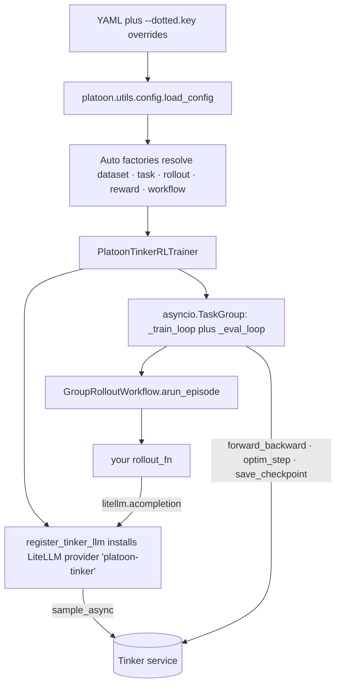
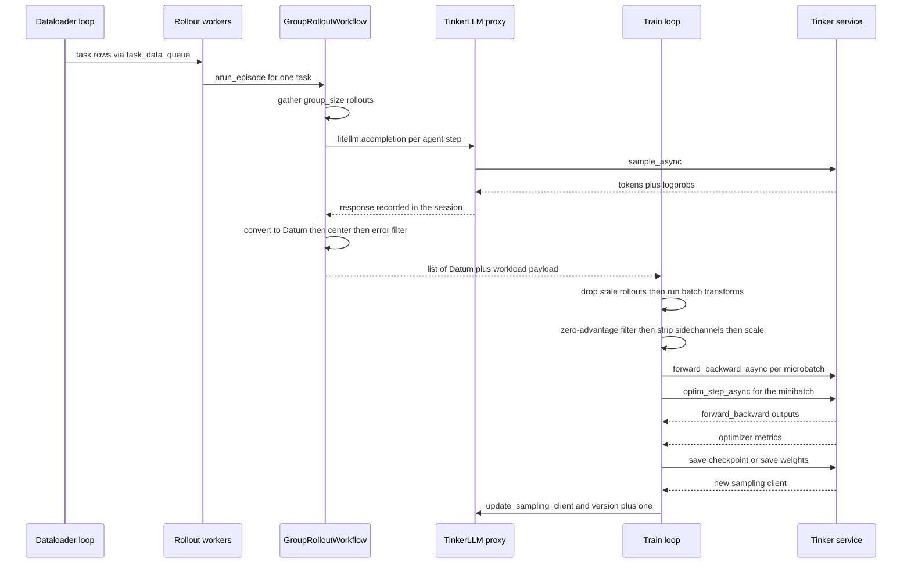

# Tinker backend internals

The Tinker backend trains a LoRA adapter on a model hosted by the Thinking Machines *Tinker*
service. Platoon never owns a GPU in this mode: it owns one `asyncio` process that runs agent
rollouts, converts trajectory trees into `tinker.Datum` objects, and posts them to the service.
This page explains how that process is put together — the proxy that makes a remote sampler look
like an OpenAI endpoint, the pipelined trainer, the datum conversion, and how resume works — and
ends with an explicit comparison to the [AReaL backend](areal.md).

If you only want to run a Tinker job, start with [Backends](../get-started/backends.md) and the
[configuration reference](../reference/configuration.md). This page is for people modifying the
trainer or debugging it.

## What runs where

| Layer | Owner |
|---|---|
| Tasks, environments, agents, rollout functions, reward processors | Your plugin — shared with AReaL |
| Sampling, weight updates, optimizer, checkpoint storage | The Tinker service — remote |
| LiteLLM-to-Tinker adaptation and token capture | <span class="pl-src">platoon/train/tinker/proxy.py</span> |
| Group centering, error filtering, trajectory-to-datum conversion | <span class="pl-src">platoon/train/tinker/workflows/group_rollout_workflow.py</span> and <span class="pl-src">platoon/utils/tinker_data_processing.py</span> |
| Batch assembly, staleness, metrics, checkpoints, watchdog | <span class="pl-src">platoon/train/tinker/rl.py</span> |

Everything above the third row is a single local Python process. There is no controller, no worker
pool, no shared filesystem, and no inference server to schedule. That is the whole appeal of this
backend and also the source of most of its constraints.



## Entrypoints

There are two ways to start a Tinker run, and both are in use in this repository today.

=== "Registry entrypoint"

    ```bash
    uv run python -m platoon.train.tinker.train --config <tinker-config.yaml>
    ```

    <span class="pl-src">platoon/train/tinker/train.py</span> loads the config, resolves every
    component through the `Auto*` factories described in
    [Registry and Auto factories](registry.md), constructs the trainer and two
    `GroupRolloutWorkflow` instances, and awaits `trainer.train(...)`. No plugin code beyond a
    registration module is required. The YAML must carry an `environments:` block.

=== "Per-plugin train script"

    ```bash
    uv run python -m platoon.number_search.train_tinker \
      --config platoon/number_search/number_search_tinker.yaml
    ```

    The script loads the config itself, builds the datasets, and wires `rollout_fn` and
    `get_task_fn` by direct import. This is still the more common path: every Tinker plugin ships
    a `train_tinker.py`, and only `textcraft_synth_depth_aware_tinker.yaml` has an
    `environments:` block at all.

Both paths use the same loader, `platoon.utils.config.load_config`. It reads `--config <path>`,
applies `--dotted.key value` or `--dotted.key=value` overrides, and instantiates the dataclass
recursively. It is *not* OmegaConf: there is no `${...}` interpolation, and unknown YAML keys are
silently dropped rather than rejected.

!!! warning "The two backends do not share an override syntax"
    Tinker: `--train.batch_size 64`. AReaL: `train_dataset.batch_size=64`, no dashes. Passing the
    AReaL form to a Tinker run leaves the value untouched, because `_parse_overrides` skips any
    argument that does not start with `--`.

A YAML written for a per-plugin script that declares extra top-level keys (email-search's
`recursive`, `train_split`, and so on) cannot be fed to `python -m platoon.train.tinker.train`.
The entrypoint hard-codes `config_class=PlatoonTinkerRLTrainerConfig`, so those keys are dropped
and the run then fails on the missing `environments` wiring. `environments[0].trainer_config` looks
like it should solve this — `register_trainer_config` exists and textcraft registers under
`textcraft/synth/tinker` — but nothing ever resolves that field. A plugin that needs extra config
fields needs its own train script.

## The config class

`PlatoonTinkerRLTrainerConfig` lives in
<span class="pl-src">platoon/train/tinker/config_defs.py</span> and is small enough to quote in
full:

```python title="platoon/train/tinker/config_defs.py"
@dataclass
class PlatoonTinkerRLTrainerConfig:
    train: TrainConfig
    eval: EvalConfig
    log_path: str
    tinker_base_url: str | None = None  # Tinker service URL
    environments: list[EnvironmentConfig] = field(default_factory=lambda: [EnvironmentConfig()])
    checkpoint: CheckpointConfig = field(default_factory=CheckpointConfig)
    stats: StatsConfig = field(default_factory=StatsConfig)
    watchdog: WatchdogConfig = field(default_factory=WatchdogConfig)
```

`train`, `eval` and `log_path` are required — they have no defaults. `__post_init__` normalizes
`environments` and raises `NotImplementedError` for more than one entry.

The fields that shape the loop most:

| Key | Type | Default | What it does |
|---|---|---|---|
| `train.model_name` | `str` | required | HuggingFace id passed to `create_lora_training_client_async` |
| `train.renderer_name` | `str` | required | tinker-cookbook renderer, e.g. `qwen3_instruct` |
| `train.batch_size` | `int` | `32` | Tasks per training step; also the task queue's maxsize |
| `train.num_minibatches` | `int` | `1` | Weight updates per batch |
| `train.num_microbatches` | `int` | `1` | Forward/backward splits per minibatch |
| `train.max_staleness` | `int \| None` | `None` | Prefetch depth *and* stale-rollout drop threshold |
| `train.lora_rank` | `int` | `32` | Only used when creating a fresh training client |
| `train.loss_fn` | `str` | `"cispo"` | Forwarded verbatim to the service |
| `train.loss_fn_config` | `dict` | `{"clip_low_threshold": 0.0, "clip_high_threshold": 5.0}` | Forwarded verbatim; also read locally for clip metrics |
| `train.num_concurrent_rollout_workflow_workers` | `int \| None` | `None`, then `batch_size` | Concurrent task workers |
| `train.workflow_config.group_size` | `int` | `8` | Rollouts per task |
| `checkpoint.strategy` / `checkpoint.every` | `str` / `int` | `"epoch"` / `1` | Checkpoint cadence |
| `watchdog.timeout_seconds` | `float` | `600` | Heartbeat deadline before a hard exit |

The full key-by-key surface is in the [configuration reference](../reference/configuration.md).

Two defaults deserve attention. `train.optimizer.grad_clip_norm` defaults to `0.0`, which disables
grad-norm reporting; nine of the eleven shipped Tinker configs set `1e12` instead, large enough never to clip
but nonzero, so the service returns `grad_norm` in `OptimStepResponse.metrics`. And
`workflow_config.rollout_config.inference_params.max_completion_tokens` defaults to `512`, which is
far too small for agentic rollouts — every serious config overrides it.

!!! warning "`workflow_config.filter_errors` in YAML does nothing"
    The field exists on `WorkflowConfig`, but the workflow never reads it. The value that matters
    is the `filter_errors` constructor argument, which the registry entrypoint defaults to `True`
    for train and `False` for eval, and which most plugin scripts hard-code. To set it from YAML
    use `environments[0].workflow_kwargs: {filter_errors: false}`. The exception is OpenReward's
    `train_tinker.py`, which forwards `config.train.workflow_config.filter_errors` explicitly.

!!! warning "`strategy: none` is not a way to disable anything"
    `_get_event_frequency` raises `ValueError` for any strategy other than `epoch` or `step`, and
    `save_every` is read on every training step. `checkpoint.strategy: none` therefore crashes at
    the end of the first step. To disable evaluation use `eval.every: 0`, which is guarded before
    the eval task is created.

If you subclass `PlatoonTinkerRLTrainerConfig` to add plugin fields, call
`super().__post_init__()` from your own `__post_init__` — otherwise `environments` normalization
and the single-environment check are silently skipped. `OpenRewardTinkerTrainerConfig` is an
example of a subclass that overrides `__post_init__` without chaining.

## The proxy

Platoon's agent stack speaks LiteLLM chat completions. Tinker speaks token-level `ModelInput` in
and `SampleResponse` out. RL additionally needs the exact prompt tokens and the exact sampled
tokens with their sampling logprobs, which an OpenAI-shaped response does not reliably return.
`TinkerLLM` in <span class="pl-src">platoon/train/tinker/proxy.py</span> closes all three gaps at
once. It is a LiteLLM `CustomLLM` registered as the provider `platoon-tinker`, and there is no HTTP
server anywhere in this path — the "endpoint" is an in-process object.

`register_tinker_llm` is called from `PlatoonTinkerRLTrainer.__init__`, before the trainer is even
entered as a context manager. It creates a `tinker.ServiceClient` and a base-model sampling client,
loads the tokenizer (replacing it with an `AutoProcessor` tokenizer when one loads, and picking up
an `image_processor` at the same time), builds the tinker-cookbook renderer, applies
`renderer_kwargs` with `setattr` — raising if an attribute does not exist — and then mutates global
LiteLLM state:

```python title="platoon/train/tinker/proxy.py"
def rewrite_litellm_custom_providers(self) -> TinkerLLM:
    litellm.custom_provider_map = [{"provider": "platoon-tinker", "custom_handler": self}]
    custom_llm_setup()
    return self
```

It returns a `ModelInfo` whose `model_name` is `platoon-tinker/<hf id>` and whose `base_url` and
`api_key` are the literal four-character strings `"None"`. The workflow copies those onto
`RolloutConfig.model_endpoint` and `model_api_key`, so rollout code must never treat them as a real
endpoint; routing happens entirely through the provider prefix.

The four jobs the proxy does:

**Protocol adaptation.** `acompletion` reads `max_tokens`, `temperature`, `top_k`, `top_p`, `seed`
and `stop` out of LiteLLM's `optional_params`, falling back to instance defaults and to
`renderer.get_stop_sequences()`, then calls `sampling_client.sample_async(...)` under a hard
600-second `asyncio.wait_for`. Responses come back through `renderer.parse_response`, including
tool calls, and are packed into a LiteLLM `ModelResponse` that carries `token_ids` on each choice
plus a synthetic `top_logprobs` entry whose only purpose is to satisfy LiteLLM's validator.

**Renderer fidelity.** The prompt is built by `renderer.build_generation_prompt`, the same renderer
the service trains with. A chat-template mismatch here would break training silently rather than
loudly, which is why `renderer_kwargs` raises on an unknown attribute instead of ignoring it.

**Interaction capture.** Every completion is recorded into a `ContextVar` dictionary keyed by the
LiteLLM response id:

```python title="platoon/train/tinker/proxy.py"
def _record_interaction(self, model_input: ModelInput, model_response: ModelResponse) -> None:
    assert len(model_response.choices) == 1

    logprobs_content = model_response.choices[0].logprobs.content
    interaction = TinkerLLMInteraction(
        obs=model_input,
        action=TokensWithLogprobs(
            tokens=model_response.choices[0].token_ids,
            maybe_logprobs=[c.logprob for c in logprobs_content] if logprobs_content else [],
        ),
    )
    proxy_interactions.get()[model_response.id] = interaction
```

`GroupRolloutWorkflow` opens a `TinkerLLMProxySession` around each rollout, so the dictionary is
scoped to one task and safe under `asyncio` concurrency. The converter later joins trajectory steps
to interactions by the completion id the agent stored in `misc.action_misc.completion_id`. This is
the Tinker analogue of AReaL's proxy export — same seam, different mechanism.

**Weight-version tracking.** `set_version`, `increment_version` and `update_sampling_client` give
each rollout a `checkpoint_version` stamp, which the trainer uses for the staleness filter.

Two guardrails and one limitation: `_check_context_window_length` raises a `ValueError` when
`prompt_len + max_tokens` exceeds `train.context_window_length` — it is an assertion, not a
truncation, so it surfaces as a failed rollout; the sampling timeout is fixed at 600 seconds
regardless of your `step_timeout`; and image content parts are replaced with the literal marker
`"[image]"` on the LiteLLM path, so multimodal rollouts do not survive this proxy intact.

!!! note "`tinker_base_url` does not reach the proxy"
    The training `ServiceClient` is built with `base_url=config.tinker_base_url`, but
    `register_tinker_llm` constructs its own `tinker.ServiceClient()` with no arguments. Every
    shipped config sets `tinker_base_url: null`, so this has not mattered in practice.

## The trainer's async design

`PlatoonTinkerRLTrainer` must be used as an async context manager; `train()` raises a
`RuntimeError` otherwise, because `__aenter__` is what reads the last checkpoint record, recovers
the WandB run id from it, and constructs the `StatsLogger`. The `StatsLogger` is also what creates
the run directory, `log_path/stats.experiment_name/stats.trial_name`, exposed as
`trainer.run_log_path`.

`train()` then runs `_train_loop` and, when an eval dataset exists and `eval.every > 0`,
`_eval_loop` inside one `asyncio.TaskGroup`. `_train_loop` in turn spawns its own producers into
that same group, connected by two queues:

- `_train_dataloader_loop` pushes individual task dicts into `task_data_queue`, whose maxsize is
  `train.batch_size`. When `max_staleness` is set, it stalls — `await asyncio.sleep(20.0)` — while
  `i_batch - train_step > max_staleness`. That single condition is what makes the backend
  off-policy at all: leave `max_staleness` unset and rollouts serialize against training.
- `num_concurrent_rollout_workflow_workers` copies of `_rollout_workflow_worker_loop` pop tasks,
  call `workflow.arun_episode(data)`, catch every exception into a `failed_rollouts` counter and a
  `None` result, record `rollout_time`, heartbeat the watchdog, and push into an unbounded
  `task_rollout_result_queue`.
- The consumer is the body of `_train_loop` itself, which pops exactly
  `batch_size / num_minibatches / num_microbatches` results per microbatch.

Each worker runs one task at a time, and each task fans out to `group_size` concurrent rollouts, so
the in-flight rollout count against the sampling service is roughly
`num_concurrent_rollout_workflow_workers × group_size`. The worker count defaults to
`train.batch_size`, which with the default `group_size: 8` means 256 concurrent rollouts. That is
the knob to turn when the service pushes back.

The divisibility constraints are asserted at the top of every step, not at config load:
`batch_size % num_minibatches == 0` and `tasks_per_minibatch % num_microbatches == 0`.

Evaluation is a separate loop, not a phase of the training loop. It waits on
`sampling_client_updated_event`, fires when `train_step % eval_every == 0 and train_step > 0`,
enqueues the *entire* eval set, drains it with `eval.num_concurrent_rollout_workflow_workers`
workers, and logs with `force=True` at the same step number the train loop just used. The eval
dataloader uses `batch_size=1` and no shuffle, so a large eval set with `every: 1` will dominate
wall-clock time.

## One training step



The ordering inside the consumer is deliberate and load-bearing:

1. **Staleness drop.** If `max_staleness` is set, the first datum's `checkpoint_version` is
   compared against `train_step`; anything older is dropped and counted as `stale_rollouts`.
2. **Batch transforms.** `run_batch_transforms` applies the ordered pipeline at the *microbatch*
   boundary. The default pipeline is `[DepthLevelWeightingTransform()]` when
   `workflow_config.depth_level_weighting` is set, and empty otherwise. A transform returning
   `None` short-circuits the pipeline and the microbatch is skipped.
3. **Zero-advantage filter.** Datums whose masked action advantages are all exactly zero are
   removed, then `set_loss_normalization_token_counts` records the *pre-filter* action-token count
   so the denominator survives. Depth weighting is part of the objective, so zero-signal datums
   must participate in the depth normalization before they are removed from model compute — which
   is exactly why this filter lives in the trainer and not in the workflow.
4. **Sidechannel stripping.** `mask`, `checkpoint_version`, `traj_depth`, `traj_start` and the
   internal `_loss_normalization_tokens` key are removed from `loss_fn_inputs` before the datums go
   to the service. Only `target_tokens`, `logprobs` and `advantages` survive.
5. **Loss normalization.**

    ```python title="platoon/train/tinker/rl.py"
    # Normalize by represented action-token mass so Tinker's
    # sum-reduced objective behaves like a mean reduction and
    # grad_norm is not sensitive to batch size.
    normalization_token_count = get_loss_normalization_token_count(task_rollout_results)
    scale_factor = 1.0 / (normalization_token_count + 1e-8)

    for datum in filtered_datums:
        datum.loss_fn_inputs["advantages"] = TensorData.from_torch(
            datum.loss_fn_inputs["advantages"].to_torch() * scale_factor
        )
    ```

6. **Submit.** `forward_backward_async` returns an `APIFuture` that is appended, not awaited. After
   the last microbatch of a minibatch, `optim_step_async` is submitted *before* any of the
   forward/backward futures are awaited, so the service can pipeline them.
7. **Await and measure.** Each future is awaited through `_await_with_heartbeat`, which logs a
   "still waiting" line every 60 seconds, heartbeats the watchdog, and enforces a hard timeout —
   900 seconds for forward/backward, 300 for the optimizer step. These are hard-coded, not
   configurable. `compute_training_metrics` then computes sample-versus-train KL (via
   tinker-cookbook's `compute_kl_sample_train`), importance-weight mean/std/min/max, and
   `clip_frac_low`, `clip_frac_high` and `clip_frac_total` for the `cispo` and `ppo` losses.
   Metrics are averaged across the microbatches of the minibatch. The optimizer's own metrics are
   logged under an `optim/` prefix, which is where `grad_norm` appears when `grad_clip_norm > 0`.
8. **Refresh weights.** `_save_checkpoint_and_get_sampling_client` produces a new sampling client,
   `update_sampling_client` swaps it into the proxy and increments the version, and every rollout
   started afterwards is stamped with the new `checkpoint_version`.

Failure modes are quiet by design. A microbatch with no rollouts, a microbatch whose transforms
returned nothing, and a microbatch whose datums were all zero-advantage each `continue`; a
minibatch with no submitted futures skips the optimizer step entirely. A high rollout failure rate
shows up as "no update" plus a rising `failed_rollouts` counter, not as an exception.

The loss itself is not Platoon code. `train.loss_fn` and `train.loss_fn_config` are forwarded
verbatim to `forward_backward_async` and interpreted server-side. There is no Tinker equivalent of
`platoon/train/areal/loss_functions.py`; only the clip-fraction *metrics* are computed locally, and
only for `cispo` and `ppo`.

## From trajectory tree to Datum

The workflow's per-rollout path is `arun_episode_single`. It deep-copies
`workflow_config.rollout_config`, overwrites `model_name`, `model_endpoint` and `model_api_key`
from `ModelInfo`, forces `return_dict=True` and `train=True`, and sets `output_dir` to
`<run_log_path>/rollouts/<stats_scope>/<checkpoint_version>` — so anything you wrote in YAML for
those five fields is discarded. If `rollout_config.max_steps` is set it also overwrites
`task.max_steps`. Then it opens a `TinkerLLMProxySession`, awaits your rollout function inside it,
and copies `session.interactions` in a `finally` before the `ContextVar` resets.

Conversion is `get_train_data_for_trajectory_collection` in
<span class="pl-src">platoon/utils/tinker_data_processing.py</span>:

```python title="platoon/utils/tinker_data_processing.py"
def get_train_data_for_trajectory_collection(
    trajectory_collection: dict,
    interactions: dict[str, TinkerLLMInteraction],
    task_id: str,
    checkpoint_version: int,
    filter_errors: bool = False,
    reward_processor: Callable[[dict], tuple[float, dict]] = lambda traj: (traj["reward"], {}),
    include_traj_depth: bool = False,
    include_traj_start: bool = False,
    subagent_datum_sampler: SubagentDatumSampler | None = None,
) -> TrajectoryCollectionResult:
```

The steps that matter for understanding the resulting batch:

- **Rewards first.** Every trainable trajectory's reward is processed *before* any datum sampling,
  so a recursive reward processor sees the whole tree regardless of which child datums survive.
- **Prefix merging.** `trajectory_to_data` walks one trajectory's steps keyed by `completion_id`,
  skipping repeated ids (OpenHands can serialize one parallel LLM response across several
  environment steps) and warning about ids missing from `interactions`. When a new observation is a
  token-prefix extension of the accumulated sequence, the step is *merged* into the same datum
  rather than starting a new one. A ten-step agent trajectory whose prompt grows by appending turns
  becomes one training sequence, not ten. This is why the sequence-extension prompt format matters
  so much for training efficiency — see [Data pipeline](data-pipeline.md).
- **Masks.** Prompt tokens get `logprob=0.0`, `advantage=0.0`, `mask=0.0`; action tokens get their
  real sampling logprobs, `advantage = trajectory_reward` (recentered later), and `mask=1.0`.
  `make_datum_from_accumulator` right-shifts inputs and left-shifts targets, and emits
  `loss_fn_inputs` of `target_tokens`, `logprobs`, `advantages`, `mask` and `checkpoint_version`,
  plus `_platoon_error_action_mask`, `traj_depth` and `traj_start` when those are enabled.
- **Policy eligibility.** Interrupted trajectories, and non-root trajectories carrying the
  exclude-from-policy-training marker, keep their stats but have all their datums dropped.
- **Subagent sampling.** Depth-0 datums are always kept. Deeper datums get an independent
  SHA-256-derived draw keyed by seed, task id, trajectory id, depth and datum index, so the
  decision is reproducible across runs and processes. After sampling, `traj_start` is re-stamped on
  the first *retained* datum, so depth weighting counts only trajectories actually in the batch.

Back in `arun_episode`, the group is centered. The baseline uses only *completed* root rewards — a
rollout whose root was interrupted keeps its reward in every logged metric but is excluded from the
control variate:

```python title="platoon/train/tinker/workflows/group_rollout_workflow.py"
for result, baseline in zip(valid_results, baselines):
    for datum in result.datums:
        old_advantages = datum.loss_fn_inputs["advantages"].to_torch()
        mask = datum.loss_fn_inputs["mask"].to_torch()
        new_advantages = torch.where(mask > 0, old_advantages - baseline, old_advantages)
        datum.loss_fn_inputs["advantages"] = TensorData.from_torch(new_advantages)
```

With `leave_one_out_baseline: true` each rollout's baseline is `(total - own) / (n - 1)`; a rollout
with an interrupted root falls back to the group mean, and a singleton uses its own reward.

Error filtering runs *after* centering, which is the point of doing it here rather than at
conversion time. Only error tokens that would receive positive credit are suppressed; negative
credit on errors is kept:

```python title="platoon/train/tinker/workflows/group_rollout_workflow.py"
action_tokens = action_mask > 0
error_actions = error_mask & action_tokens
suppressed = error_actions & (advantages > 0)
filtered_mask = torch.where(suppressed, torch.zeros_like(action_mask), action_mask)
datum.loss_fn_inputs["mask"] = TensorData.from_torch(filtered_mask)
```

A group whose retained advantages are all exactly zero is still returned. The workflow logs why and
leaves the removal to the trainer's post-transform filter, for the normalization reason above. The
whole funnel is validated per task —
`0 <= task_retained <= post_sampling <= policy_eligible <= postmerge` — and published as the
`workload/rollout/*` and `workload/task/*` metrics, which the trainer aggregates into
`workload/batch/*` and `workload/training_batch/*`.

What the workflow returns is a `list` subclass carrying that workload as an attribute. A custom
workflow that returns a plain list works fine; the trainer reads the sidechannel defensively and
only loses the exact `workload/training_batch/total_non_submitted_datums` metric.

## Dataset ordering

`PlatoonTinkerDataloader` shuffles with a fixed seed of 42 and drops the last partial batch for
training; the eval dataloader is constructed with `batch_size=1`, `shuffle_seed=None` and
`drop_last=False`. `get_batch` takes the batch index modulo the batch count, so epochs repeat the
same shuffled order rather than reshuffling per epoch.

To opt out of shuffling — for a curriculum, or a dataset whose order encodes difficulty — add a
boolean column to every row:

```python
from platoon.train.tinker.dataset_order import PRESERVE_DATASET_ORDER_COLUMN

train_dataset = Dataset.from_list(
    [{"task_id": t, PRESERVE_DATASET_ORDER_COLUMN: True} for t in ordered_task_ids]
)
```

`prepare_dataset_for_dataloader` then drops the column and skips the shuffle. The marker must be
`True` on *every* row; a partially-marked column raises `ValueError`.

## Checkpoints, resume, and the restart wrapper

Checkpoint records are JSON lines in `<run_log_path>/checkpoints.jsonl`, written by
tinker-cookbook's `save_checkpoint_async`. Platoon always saves with `kind="both"`, so each record
carries a `state_path` and a `sampler_path`, both `tinker://` URIs, plus the `loop_state` Platoon
supplies: `batch` and `wandb_run_id`.

The lifecycle:

- **Startup.** `__aenter__` and then `train()` both call `get_last_checkpoint(run_log_path)`.
  `start_batch = resume_info.batch or 0`.
- **Client creation.** A found record means
  `create_training_client_from_state_with_optimizer_async(state_path)` — optimizer state restored.
  Otherwise, if `checkpoint.load_checkpoint_path` is set,
  `create_training_client_from_state_async(path)` restores weights with a **fresh optimizer**.
  Otherwise `create_lora_training_client_async(model_name, rank=lora_rank)`.
- **Immediate checkpoint.** A record named `f"{start_batch:06d}"` is written at once, purely so a
  sampling client exists before the first rollout.
- **Off-by-one.** A checkpoint saved after finishing batch `i` is named `f"{i+1:06d}"` and stores
  `batch = i + 1`, so resume starts at the next batch rather than redoing one.
- **Cadence.** `save_every` is `checkpoint.every` steps under `strategy: step`, or
  `every × batches_per_epoch` under `strategy: epoch`. The test is
  `(i_batch - start_batch + 1) % save_every == 0`, which is relative to where *this process*
  started, so a resumed run realigns the cadence to its own start. On non-checkpoint steps the
  trainer calls `save_weights_and_get_sampling_client_async()` instead: the policy the agents
  sample from is refreshed every step, but no record is written, so a crash rewinds to the last
  real checkpoint.
- **WandB continuity.** The `wandb_run_id` stored in the record is fed back as
  `wandb.resume_run_id` with `resume="must"`.
- **Interrupt.** The first SIGINT or SIGTERM sets the shutdown event, the loops unwind, and a
  checkpoint named `f"{step:06d}_interrupted"` is written. A second signal calls `wandb.finish` and
  `os._exit(1)` immediately.
- **Clean finish.** A checkpoint named `final` is written. A run whose `start_batch` already equals
  `end_batch` logs "Training was already complete; nothing to do" and exits.

Hangs are handled separately, because a hung Tinker call cannot be unwound:

```python title="platoon/train/tinker/rl.py"
class Watchdog:
    """Background thread that monitors for hangs and forcibly exits if no activity.
     If Tinker hangs, the only recovery is to forcibly exit the process.
    """
```

The watchdog is a daemon thread that warns at 75% of `watchdog.timeout_seconds` and then calls
`os._exit(watchdog.exit_code)` — no cleanup, no checkpoint, no exception. Heartbeats come from
three places: after every completed rollout, after every training step, and every 60 seconds while
`_await_with_heartbeat` is blocked on a long service call.

!!! warning "The 600-second watchdog default is shorter than one long agentic rollout"
    Heartbeats fire when a rollout *completes*, not while it runs. Long-horizon configs raise
    `watchdog.timeout_seconds` to 3600 or 7200 for exactly this reason.

Recovery from a watchdog exit is "restart and resume from the last checkpoint", which is what
`restart_wrapper` automates:

```bash
python -m platoon.train.tinker.restart_wrapper \
  --max-restarts 5 --watchdog-exit-code 2 --restart-delay 10 \
  -- uv run python -m platoon.train.tinker.train --config my.yaml
```

It restarts *only* on the watchdog exit code. Exit 0 returns 0, any other non-zero code is passed
straight through without a restart, and Ctrl-C is forwarded to the child (SIGINT, then SIGTERM
after 10 seconds, then SIGKILL after 5 more) and returns 130. The same logic is available in
Python as `run_with_restart(command, max_restarts=5)`.

## How this differs from AReaL

| Dimension | Tinker | AReaL |
|---|---|---|
| Entrypoint | `python -m platoon.train.tinker.train` or a plugin `train_tinker.py` | `python -m platoon.train.areal.train` or a plugin `train.py` |
| Config loader | `platoon.utils.config.load_config` — YAML plus argparse | `areal.api.cli_args.load_expr_config` — Hydra plus OmegaConf |
| Override syntax | `--train.batch_size 64` | `train_dataset.batch_size=64` |
| `${...}` interpolation | Not available | Available |
| Unknown YAML keys | Silently dropped | Rejected by the structured config |
| Root config class | `PlatoonTinkerRLTrainerConfig` | `PlatoonArealRLTrainerConfig`, a `GRPOConfig` subclass |
| Install | `uv sync --extra tinker` | `uv sync --extra areal` — the two extras are declared mutually exclusive |
| Runs locally | Dataloading, rollouts, agents, envs, datum conversion, batching, metrics | The trainer process plus your own GPU workers |
| Runs remotely | Sampling, forward/backward, optimizer, checkpoint storage | Nothing — you own the whole cluster |
| Inference path | In-process LiteLLM custom provider over the sampling client | SGLang servers behind AReaL's HTTP proxy |
| Training method | LoRA only | Full-parameter or LoRA; FSDP or Megatron |
| Loss | Name plus dict shipped to the service | Local implementations in `platoon/train/areal/loss_functions.py` |
| Checkpoints | `tinker://` paths recorded in `checkpoints.jsonl` | AReaL checkpoint directories on a shared filesystem |
| Crash recovery | `Watchdog` hard exit plus `restart_wrapper` | AReaL's own recover and scheduler machinery |
| Batch transforms | Per microbatch | Trainer-side, on the full batch |
| `group_size` default | `8` | `1` |
| Multi-node / SLURM | Not applicable — one client process | `slurm-scripts/`, preallocated-SLURM scheduler |

Present on AReaL and absent on Tinker:

- **Subprocess-isolated rollouts.** `use_subprocesses`, `straggler_timeout_seconds`,
  `straggler_quorum`, `subprocess_shutdown_grace_seconds` and `min_successful_group_size` have no
  Tinker equivalents. Every group member is a coroutine in the trainer process.
- **Zero-variance group rejection.** `filter_zero_variance_groups` does not exist here; a group
  where every rollout scored the same produces all-zero advantages and is dropped later by the
  zero-advantage filter instead.
- **Depth-level reward discounting.** `depth_level_discount_gamma` is AReaL-only;
  `depth_level_weighting` exists on both.
- **Token-efficiency reward shaping.** `TokenEfficiencyRewardConfig` is AReaL-only.
- **Router replay for MoE.** AReaL-only, and Megatron plus SGLang only there.
- **Staged curriculum admission.** OpenReward's `sampling_start_step` is rejected outright by
  `OpenRewardTinkerTrainerConfig`.
- **A local loss registry.** There is nowhere to define a loss function for Tinker.

Shared between the backends, and worth not duplicating when you write a plugin: `tasks.py`,
`env.py`, agents and prompt builders, `rollout.py`, the reward processor, the `registry.py` module,
the `RolloutConfig` dataclass, subagent sampling, workload accounting, error filtering, and
trajectory status. What is *not* shared: the trainer config class, the `configs/tinker/` versus
`configs/areal/` YAMLs, the `GroupRolloutWorkflow` constructor signature, the data-processing
module, and the train script. Both backends do share the single-environment restriction: more than
one entry under `environments:` raises.

**Pick Tinker** for fast iteration on agent, environment and reward design; when you have no
cluster; for small-to-mid LoRA experiments; and when you want one process and cheap restarts.
**Pick AReaL** for full-parameter training, MoE with router replay, very large models or long
contexts, subprocess-isolated environments, curriculum or token-efficiency shaping, and multi-node
runs.

## See also

- [AReaL backend internals](areal.md) — the other side of every comparison above
- [Data pipeline](data-pipeline.md) — prefix merging, advantages, masks and sampling in depth
- [Configuration system](config.md) — why there are two loaders
- [Registry and Auto factories](registry.md) — how `environments:` becomes callables
- [Custom batch transform](../customization/batch-transform.md) — writing one for this backend
- [Custom workflow](../customization/workflow.md) — replacing `GroupRolloutWorkflow`
- [Configuration reference](../reference/configuration.md) — every key, with defaults
- [Troubleshooting](../reference/troubleshooting.md) — watchdog exits, stale rollouts, empty batches
