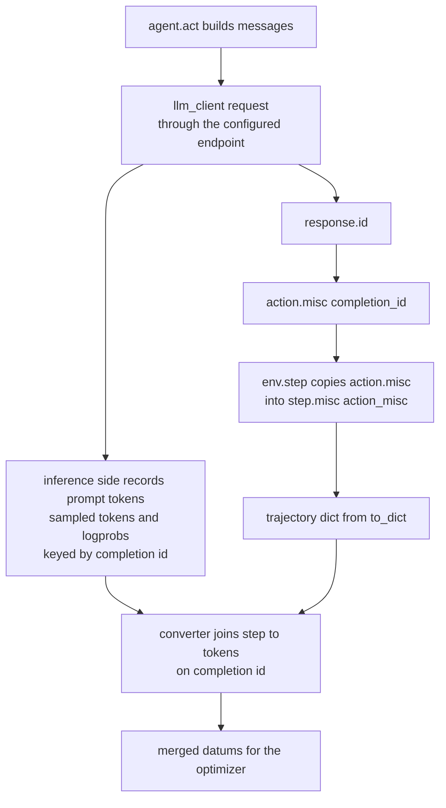

# Custom agent

The agent is the half of an episode that turns an observation into an action. Platoon's `Agent`
contract is three async methods and no base class, so you have two realistic routes: subclass
`CodeActAgent` and change only the prompt, or write an agent from scratch. This page covers both,
plus the one thing an agent must get right for the tokens it generates to reach the trainer.

## The `Agent` protocol

```python title="platoon/agents/base.py"
@runtime_checkable
class Agent(Protocol):
    async def act(self, obs: Observation) -> Action: ...

    async def reset(self) -> None: ...

    async def close(self) -> None: ...


@runtime_checkable
class ForkableAgent(Agent, Protocol):
    async def fork(self, task: Task) -> ForkableAgent:
        """Return an independently closeable child agent.

        Implementations that allocate resources before returning must clean up
        partial allocations if the fork raises, including on cancellation.
        """

        ...
```

There is no registration decorator and nothing to inherit. `Agent` is a `@runtime_checkable`
`Protocol`; duck typing is the whole contract. The episode loop that drives it is five lines
(<span class="pl-src">platoon/episode/loop.py</span>):

```python title="platoon/episode/loop.py"
obs = await env.reset()
while not halt_episode(obs):
    action = await asyncio.wait_for(agent.act(obs), timeout=timeout)
    obs = await asyncio.wait_for(env.step(action), timeout=timeout)
    step_count += 1
```

| Method | Called by | What it must do |
|---|---|---|
| `act(obs)` | every loop iteration, under `wait_for(timeout)` | return an action the paired env's `step` accepts |
| `reset()` | **nothing in core** | part of the protocol; define it, but do not rely on it running |
| `close()` | `run_episode`'s `finally`, under a 10 s timeout | release LLM clients and sockets; tolerate cancellation |
| `fork(task)` | `launch_subagent` only | return an independently closeable child agent |

!!! warning "`Agent.reset()` is never called"

    `run_episode` calls `env.reset()` but not `agent.reset()`, and nothing else in the repository
    calls it either. If your agent needs per-episode state cleared, clear it in `__init__` and build
    a fresh agent per rollout — which is what every plugin rollout does. Treat `reset` as an unused
    seam, not a lifecycle hook.

`Action` is `TypeAlias = Any` (<span class="pl-src">platoon/envs/base.py</span>), so the agent
and the environment define the action type between them. They are always a pair: an agent that
returns `CodeActAction` works with any `CodeActEnv`, and an agent written for a bespoke environment
can return whatever that environment's `step` reads. The observation is likewise whatever the env
returned — for `CodeActEnv` that is a deep copy of `CodeActObservation` carrying `task`,
`action_space`, `history`, `finished` and `reward`.

## Route 1: subclass `CodeActAgent` and change the prompt

This is what almost every plugin does. `CodeActAgent` already handles the completion call, the
`</python>` stop sequence, response parsing, loop detection, forking and cleanup. The only genuinely
task-specific part is the system prompt, and that lives in a `CodeActPromptBuilder`.

```python title="platoon/agents/codeact/agent.py"
    def __init__(
        self,
        prompt_builder: CodeActPromptBuilder | None = None,
        prompt_mode: PromptMode = "sequence_extension",
        include_reasoning: bool = True,
        llm_client: LLMClient | None = None,
        inference_params: InferenceParams | None = None,
        stuck_in_loop_threshold: int = 4,
        stuck_in_loop_window: int = 3,
    ):
```

The reference implementation is the whole of number-search's agent module — a prompt builder that
overrides one method, and an agent that wires it up:

```python title="plugins/number-search/platoon/number_search/agent.py"
class NumberSearchPromptBuilder(CodeActPromptBuilder):
    def build_system_prompt(self, obs: CodeActObservation, **context) -> str:
        include_reasoning = context.get("include_reasoning", self.include_reasoning)
        if include_reasoning:
            return """Solve step by step. Put thoughts in <thought> </thought> and code in <python> </python>.
Your answer must call guess(number: int) with the guessed number as an integer.

Example:
<thought>
thought process here
</thought>
<python>
guess(42)
</python>
"""
        else:
            return """Solve the problem step by step. Write your action in <python> </python> tags.
Your answer must call guess(number: int) with the guessed number as an integer.

Example:
<python>
guess(42)
</python>
"""


class NumberSearchAgent(CodeActAgent):
    def __init__(
        self,
        prompt_mode: PromptMode = "sequence_extension",
        include_reasoning: bool = True,
        **kwargs,
    ):
        if "prompt_builder" not in kwargs:
            kwargs["prompt_builder"] = NumberSearchPromptBuilder(
                prompt_mode=prompt_mode,
                include_reasoning=include_reasoning,
            )
        super().__init__(prompt_mode=prompt_mode, include_reasoning=include_reasoning, **kwargs)
```

The `if "prompt_builder" not in kwargs` idiom matters. `CodeActAgent.fork` reconstructs the child
with `type(self)(prompt_builder=self.prompt_builder, ...)`, so the subclass has to accept an
externally supplied builder rather than clobbering it. The identical shape appears in
`plugins/textcraft/platoon/textcraft/agent.py` and `plugins/appworld/platoon/appworld/agent.py`.

Both flags are passed twice on purpose: once into the builder and once into `super().__init__`. The
builder uses them to render prompts; the agent keeps `include_reasoning` only so `fork` can pass it
on. `CodeActAgent` never stores `prompt_mode` — once a builder exists, the builder's `prompt_mode`
is the one that takes effect.

### `prompt_mode`

```python title="platoon/agents/codeact/prompt_builder.py"
PromptMode = Literal["sequence_extension", "no_sequence_extension"]
```

`"sequence_extension"` (the default) grows a multi-turn conversation:

```text
- [System] Initial instructions
- [User] Task description + action space + instruction to start
- [Assistant] Action 0
- [User] Output 0
- [Assistant] Action 1
- [User] Output 1
```

Each step's prompt is a strict prefix of the next step's prompt. Both training converters exploit
that: they walk the trajectory's steps, look up each step's recorded token sequence, and merge
consecutive sequences whenever the accumulated sequence is a prefix of the next observation
(<span class="pl-src">platoon/utils/areal_data_processing.py</span>,
<span class="pl-src">platoon/utils/tinker_data_processing.py</span>). A ten-step episode
becomes one training datum instead of ten heavily overlapping ones.

`"no_sequence_extension"` is the legacy shape: a single user message that re-embeds the whole action
history each step, built from `user.jinja` and `build_action_history_description`. The prompt is
rebuilt from scratch every turn, so consecutive observations are not prefixes and the converters
emit one sequence per step.

!!! warning "`no_sequence_extension` multiplies your token bill"

    With prefix merging defeated, a 10-step episode produces 10 datums whose prompts overlap almost
    entirely, and the shared prefix is re-encoded and re-trained on every time. Choose it only if
    your environment genuinely cannot maintain a growing conversation.

### `include_reasoning`

`include_reasoning=True` (the default) tells the model to emit
`<thought>…</thought>\n<python>…</python>`; `False` asks for `<python>…</python>` alone. It reaches
three places:

- `build_system_prompt` passes it into `system.jinja`, which branches on it
  (<span class="pl-src">platoon/agents/codeact/prompts/system.jinja</span>).
- `build_next_action_str` passes it into `user-next-action-str.jinja`, which branches the same way.
- `_format_action_for_history` uses the **builder's** `include_reasoning` to decide whether past
  assistant turns are reconstructed with their `<thought>` blocks
  (<span class="pl-src">platoon/agents/codeact/prompt_builder.py</span>).

That last one is why the flag must agree between agent and builder. If they disagree, the history
you replay to the model stops matching the history the model actually produced, and the prefix
property that makes merging work breaks with it. Passing the flag to both, as the plugins do, keeps
them in sync.

`extract_code_and_thought` is tolerant either way: it first tries the combined pattern, then falls
back to extracting `<thought>` and `<python>` independently, returning `""` for whichever is absent
(<span class="pl-src">platoon/agents/codeact/agent.py</span>).

### The other override points

| Method | Default | Override when |
|---|---|---|
| `build_system_prompt(obs, **context)` | renders `system.jinja` | almost always — this is your task description |
| `build_next_action_str(obs, **context)` | renders `user-next-action-str.jinja` | you want a different "give me your next cell" instruction |
| `build_user_prompt(obs, **context)` | renders `user.jinja` | only in `no_sequence_extension` mode |
| `build_action_history_description(obs)` | `"Cell i:\n" + str(cell)` per step | only in `no_sequence_extension` mode |
| `build_messages(obs, agent_action=None)` | dispatches on `prompt_mode` | you need a message shape neither mode produces |
| `build_messages_from_traj_dump(dump, threshold)` | raises `NotImplementedError` | you are doing offline SFT from trajectory dumps |

Rather than replacing `system.jinja`, you can inject into it. The template exposes a slot:

```jinja title="platoon/agents/codeact/prompts/system.jinja"
You are a helpful agent that helps fulfill user tasks by reasoning and writing python code.
{{ env_specific_system_context | default('') }}
```

AppWorld fills the slot from its own prompts directory and delegates the rest to the base template:

```python title="plugins/appworld/platoon/appworld/agent.py"
    def build_system_prompt(self, obs: CodeActObservation, **context) -> str:
        if "env_specific_system_context" not in context:
            context["env_specific_system_context"] = self.appworld_prompt_retriever.get_prompt("system-env-specific-system-context")
        return super().build_system_prompt(obs, **context)
```

!!! warning "A broken template degrades the prompt instead of failing"

    `PromptRetriever` uses Jinja's `StrictUndefined`, so a missing variable raises. But
    `_build_initial_user_message` and `_format_observation_for_history` wrap the render in a bare
    `except Exception` and fall back to building the string programmatically
    (<span class="pl-src">platoon/agents/codeact/prompt_builder.py</span>,
    <span class="pl-src">platoon/agents/codeact/prompt_builder.py</span>). A typo in a custom
    template therefore produces a *different, silently worse* prompt rather than a crash. Print
    `build_messages(obs)` once before you launch a run.

## Route 2: write an agent from scratch

Implement `act`, `reset` and `close`; add `fork` if the environment supports delegation. The example
below is new code, not from the repository. It reimplements just enough of `CodeActAgent` to drive
any `CodeActEnv`, which makes it a useful starting point when you want full control over the message
stack but not over the environment.

```python
from platoon.agents.codeact.agent import extract_code_and_thought
from platoon.config_defs import InferenceParams
from platoon.envs.base import Task
from platoon.envs.codeact import CodeActAction, CodeActObservation

SYSTEM = "You write one python cell per turn, inside <python> </python> tags."


class TerseCodeActAgent:
    def __init__(self, llm_client, inference_params: InferenceParams | None = None):
        self.llm_client = llm_client
        self.inference_params = inference_params or InferenceParams()

    async def act(self, obs: CodeActObservation) -> CodeActAction:
        messages = [
            {"role": "system", "content": SYSTEM},
            {"role": "user", "content": f"# Task\n\n{obs.task}\n\n# Action Space\n\n{obs.action_space}"},
        ]
        # Accumulate history as alternating turns so each prompt is a prefix of the next.
        for i, step in enumerate(obs.history):
            messages.append({"role": "assistant", "content": f"<python>{step.code or ''}</python>"})
            body = step.output or ""
            if step.error:
                body += f"\nError: {step.error}"
            messages.append({"role": "user", "content": f"[Cell {i} Output]\n{body or '(No output)'}"})

        response = await self.llm_client.async_chat_completion(
            messages,
            temperature=self.inference_params.temperature,
            stop=["</python>"],
            max_completion_tokens=self.inference_params.max_completion_tokens,
        )
        text = response.choices[0].message.content or ""
        if "</python>" not in text:
            text += "</python>"

        code, thought = extract_code_and_thought(text)
        action = CodeActAction(action=text, parsed_code=code, parsed_thought=thought)
        # REQUIRED for training: this is the join key back to the recorded tokens.
        action.misc["completion_id"] = response.id
        action.misc["usage"] = response.usage.to_dict()
        action.misc["model"] = response.model
        return action

    async def reset(self) -> None:
        return None

    async def close(self) -> None:
        await self.llm_client.aclose()

    async def fork(self, task: Task) -> "TerseCodeActAgent":
        return TerseCodeActAgent(self.llm_client.fork(), self.inference_params)
```

Four things in that example are load-bearing rather than stylistic.

**The agent does not write to the trajectory.** Steps are recorded by the environment, not by the
agent and not by the loop. `CodeActEnv.step` builds a `CodeActStep` from the executor's result and
calls `traj_collection.add_trajectory_step`
(<span class="pl-src">platoon/envs/codeact/env.py</span>). If you write a custom environment
too, that call is mandatory: budget accounting is `len(traj.steps)`, so an environment that never
records steps runs until the whole-rollout timeout fires. See
[custom environment](environment.md).

**`action.misc` is the agent's only channel into the trajectory.** `CodeActEnv.step` copies it
verbatim onto the step: `step.misc["action_misc"] = action.misc`
(<span class="pl-src">platoon/envs/codeact/env.py</span>). A from-scratch environment must do the
same, or the completion id never lands in the trajectory dict and the step trains on nothing.

**The stop sequence is repaired unconditionally.** AReaL's inference path does not always return the
custom stop text, so `"</python>"` is appended when missing — the same conditional the built-in agent
uses (<span class="pl-src">platoon/agents/codeact/agent.py</span>).

**`llm_client.fork()` gives the child its own client.** Both `LLMClient` and `LiteLLMClient`
implement `fork()`; nothing in the code assumes a single client is safe to share across a delegation
tree.

Not every agent is CodeAct. `plugins/openhands/platoon/openhands/agent.py` is a 39-line `Agent` that
polls an OpenHands event stream and returns an `OpenHandsAction` carrying
`misc["completion_id"] = step_actions[-1].llm_response_id`. Its `fork` is `deepcopy(self)`, which is
legal only because that agent is stateless.

## What the agent must do for training to work

This is the part that silently produces a run which trains on nothing.

Platoon never re-tokenizes your prompts. Training data comes from the tokens the inference stack
actually sampled, and the only thing linking a trajectory step to those tokens is a completion id.
The agent creates that link.



Concretely, `completion_id_for_step` reads exactly `step["misc"]["action_misc"]["completion_id"]` and
returns `None` for anything else
(<span class="pl-src">platoon/utils/trajectory_error_filtering.py</span>). Both converters skip
every step for which it returns `None`, and warn-and-skip when the id is absent from the recorded
interactions.

=== "AReaL"

    The workflow opens an `ArealProxySession` per rollout and rewrites the `RolloutConfig` before
    calling your rollout function
    (<span class="pl-src">platoon/train/areal/workflows/group_rollout_workflow.py</span>):
    `model_endpoint` becomes the worker-local proxy URL, `model_api_key` becomes that session's key,
    and `model_name` is prefixed with `openai/`. Every request your agent sends through that endpoint
    is recorded by AReaL's OpenAI proxy against the session.

    After the episode the workflow calls `session.export_interactions()`, which is
    `export_interactions(discount=1.0, style="individual")` — one record per actual model request
    (<span class="pl-src">platoon/train/areal/proxy.py</span>). The result is a mapping from
    completion id to a record holding `input_ids`, `loss_mask`, `attention_mask` and logprobs, and
    the converter joins it against the trajectory's steps.

    The export runs even when the rollout returned `None`, because the proxy can still hold completed
    interactions from work done before a timeout or cancellation.

    Consequence: your agent must send its requests through `config.model_endpoint` with
    `config.model_api_key` and `config.model_name`. An agent that builds its own client against some
    other base URL will run happily, produce trajectories and rewards, and contribute zero trainable
    tokens.

=== "Tinker"

    There is no HTTP proxy. `register_tinker_llm` installs a LiteLLM custom provider named
    `platoon-tinker`, and the workflow sets `model_name` to `platoon-tinker/<model>` with `base_url`
    and `api_key` both the literal string `"None"`
    (<span class="pl-src">platoon/train/tinker/proxy.py</span>,
    <span class="pl-src">platoon/train/tinker/workflows/group_rollout_workflow.py</span>).

    Recording is in-process. `TinkerLLM._record_interaction` stores a
    `TinkerLLMInteraction(obs=ModelInput, action=TokensWithLogprobs)` into the `proxy_interactions`
    **contextvar**, keyed by the `ModelResponse.id` it just minted
    (<span class="pl-src">platoon/train/tinker/proxy.py</span>). The workflow wraps the
    rollout in `async with TinkerLLMProxySession()` and snapshots `session.interactions` afterwards.

    Consequence: your agent must route through LiteLLM using the configured `model_name` — use
    `LiteLLMClient`, which is what every plugin rollout constructs. And because the recording point is
    a contextvar rather than a network boundary, an agent that offloads its LLM calls to a separate
    process, or to a thread with a fresh context, records nothing.

Both backends therefore agree on the same three requirements: use the model name, endpoint and key
handed to you in the `RolloutConfig`; put `response.id` into `action.misc["completion_id"]`; and let
the environment copy `action.misc` onto the step.

!!! warning "Steps without a completion id are dropped, quietly"

    `CodeActAgent`'s loop detector returns a synthetic `finish(...)` action *without calling the
    model* when the last `stuck_in_loop_threshold` repetitions of a pattern up to
    `stuck_in_loop_window` long are detected, with `misc["usage"] = {}`, `misc["model"] = None` and
    **no** `completion_id` (<span class="pl-src">platoon/agents/codeact/agent.py</span>).
    That step is skipped by both converters. This is correct — there are no tokens to train on — but
    it means the number of trajectory steps and the number of training datums need not match. Do not
    use step counts to confirm that data is flowing.

## Delegation: `ForkableAgent`

Adding `async def fork(self, task) -> ForkableAgent` is what makes an agent usable with
`launch_subagent`. That function casts the current agent and env to `ForkableAgent` / `ForkableEnv`
and proceeds in a fixed order (<span class="pl-src">platoon/agents/actions/subagent.py</span>):

1. `tracker.reserve_budget(max_steps + 1, raise_on_failure=True, ...)` — admission control runs
   **before** anything is allocated. A denial returns a plain string to the calling agent code, not
   an exception.
2. `forked_agent = await agent.fork(subtask)`
3. `forked_env = await env.fork(subtask)`
4. The child episode runs inside `asyncio.create_task(...)`, so its contextvar writes — including
   `finish_message` and `current_trajectory` — cannot leak back into the parent.

The inherited implementation reconstructs the same class and gives the child a fresh LLM client:

```python title="platoon/agents/codeact/agent.py"
    async def fork(self, task: Task) -> CodeActAgent:
        return type(self)(
            prompt_builder=self.prompt_builder,
            include_reasoning=self.include_reasoning,
            llm_client=self.llm_client.fork(),
            inference_params=self.inference_params,
            stuck_in_loop_threshold=self.stuck_in_loop_threshold,
            stuck_in_loop_window=self.stuck_in_loop_window,
        )
```

`type(self)` means a subclass gets its own class back — but only if that subclass's `__init__`
accepts those six keyword arguments. The `(prompt_mode, include_reasoning, **kwargs)` signature the
plugins use does, because `**kwargs` absorbs the rest. A subclass with a required positional
argument, or one carrying extra state, must override `fork`; TextCraft does exactly that
(<span class="pl-src">plugins/textcraft/platoon/textcraft/agent.py</span>).

Note that `task` is passed to `fork` but `CodeActAgent` ignores it. The child's goal reaches the model
through the environment instead: `env.fork(subtask)` gives the child env the subtask, and
`CodeActPromptBuilder` interpolates `str(obs.task)` into the first user turn. Use the argument only
if the agent itself needs to branch on the subtask.

!!! warning "Clean up partial allocations yourself"

    The protocol docstring is binding: if `fork` allocates before returning and then raises —
    including on cancellation — it must clean up its own partial allocations. `launch_subagent`
    closes only handles that a fork successfully returned
    (<span class="pl-src">platoon/agents/actions/subagent.py</span>).

Fork strategy, budget policy and the shape of the subagent tree are covered in
[recursive agents](../recipes/recursive.md) and [subagents](../architecture/subagents.md).

## Adding tool and action functions

Tools do **not** live on the agent. In CodeAct the action space is a tuple of plain Python callables
handed to the code executor, injected into the IPython namespace by `__name__`:

```python title="platoon/envs/codeact/env.py"
        for action in self.actions:
            shell.user_ns[action.__name__] = action
```

So "adding a tool" means constructing the executor with more callables. Number-search's entire action
space is two of them:

```python title="plugins/number-search/platoon/number_search/env.py"
class NumberSearchEnv(CodeActEnv):
    def __init__(self, task: Task):
        super().__init__(task, IPythonCodeExecutor(task, actions=(finish, guess_factory(task.misc["target"]))))
```

Closures work — `guess_factory` captures the target — and bound methods work because they have a
`__name__`; TextCraft passes `self.craft`, `self.get_info`, `self.view_inventory` and
`self.launch_subagent` from inside its executor's `__init__`. The default is
`actions=(finish, safe_asyncio)`.

Two consequences the agent side has to handle:

**The model is not told what the tools are unless you tell it.**
`IPythonCodeExecutor.describe_action_space()` returns `""`
(<span class="pl-src">platoon/envs/codeact/env.py</span>), and `CodeActEnv.reset` copies that
into `obs.action_space`, which the prompt builder renders into the first user turn. Number-search
leaves it empty and documents `guess(number: int)` in its system prompt instead; TextCraft overrides
`describe_action_space` and gets a real structured listing. Pick one. If you pick neither, the model
is guessing at your API.

**Async tools need an explicit guard.** `UnawaitedAsyncCallDetector` rejects a bare call to a known
async action before executing the cell, with a message telling the model to add `await`. Its name set
is hard-coded to `launch_subagent`, `search_web`, `view_webpage_content`, `search_emails` and
`read_email` (<span class="pl-src">platoon/envs/codeact/env.py</span>). Your own async tool is
not covered, so a forgotten `await` silently leaves a coroutine object in the cell output instead of a
result. Either subclass the detector or keep your tools synchronous.

Executors, `evaluate()` and forkable world state are covered on
[custom environment](environment.md).

## Worked example: a dialect-aware SQL agent

New code, not from the repository. It shows the three things a real custom agent usually needs at
once: extra constructor state, a system prompt injected through the template slot rather than
replacing the template, and a `fork` override that carries the extra state to children.

```python
from platoon.agents.codeact import CodeActAgent, CodeActPromptBuilder, PromptMode
from platoon.envs.base import Task
from platoon.envs.codeact import CodeActObservation


class SqlPromptBuilder(CodeActPromptBuilder):
    def __init__(
        self,
        dialect: str = "postgres",
        prompt_mode: PromptMode = "sequence_extension",
        include_reasoning: bool = True,
    ):
        super().__init__(prompt_mode=prompt_mode, include_reasoning=include_reasoning)
        self.dialect = dialect

    def build_system_prompt(self, obs: CodeActObservation, **context) -> str:
        context.setdefault(
            "env_specific_system_context",
            f"You answer questions against a {self.dialect} database. "
            "Run queries with run_sql(query: str) -> str, which returns the result table as text. "
            "Inspect tables with describe_table(name: str) -> str before querying them. "
            "When you have the answer, call finish(message) with the answer alone.",
        )
        return super().build_system_prompt(obs, **context)


class SqlAgent(CodeActAgent):
    def __init__(
        self,
        dialect: str = "postgres",
        prompt_mode: PromptMode = "sequence_extension",
        include_reasoning: bool = True,
        **kwargs,
    ):
        self.dialect = dialect
        if "prompt_builder" not in kwargs:
            kwargs["prompt_builder"] = SqlPromptBuilder(
                dialect=dialect,
                prompt_mode=prompt_mode,
                include_reasoning=include_reasoning,
            )
        super().__init__(prompt_mode=prompt_mode, include_reasoning=include_reasoning, **kwargs)

    async def fork(self, task: Task) -> "SqlAgent":
        # The inherited fork would construct an SqlAgent but drop `dialect`.
        return SqlAgent(
            dialect=self.dialect,
            include_reasoning=self.include_reasoning,
            prompt_builder=self.prompt_builder,
            llm_client=self.llm_client.fork(),
            inference_params=self.inference_params,
            stuck_in_loop_threshold=self.stuck_in_loop_threshold,
            stuck_in_loop_window=self.stuck_in_loop_window,
        )
```

The inherited `fork` would in fact still run here — `type(self)` plus `**kwargs` produces an
`SqlAgent` — but `dialect` would silently revert to `"postgres"` in every child, and the builder is
passed through anyway so the prompt would not even reveal the mismatch. That class of bug does not
surface until a delegated subtree starts writing queries in the wrong dialect. Override `fork`
whenever you add constructor state.

Wiring it into a rollout looks like every plugin's (see [custom rollout](rollout.md) for the full
function):

```python
llm_client = LiteLLMClient(
    model=config.model_name,
    base_url=config.model_endpoint,
    api_key=config.model_api_key,
)
env = SqlEnv(task)
agent = SqlAgent(
    dialect=task.misc.get("dialect", "postgres"),
    llm_client=llm_client,
    inference_params=config.inference_params,
)
```

Passing `config.model_name`, `config.model_endpoint` and `config.model_api_key` straight through is
what makes the run trainable on both backends. Passing `config.inference_params` is what makes
`temperature`, `top_p` and `max_completion_tokens` from your YAML take effect — `InferenceParams`
defaults to `max_completion_tokens=512`, which truncates any agent that reasons at length.

## Sharp edges

- **The LLM request timeout is hard-coded to 1800 seconds** inside `CodeActAgent.act`, with a TODO
  (<span class="pl-src">platoon/agents/codeact/agent.py</span>). It is unrelated to
  `run_episode`'s per-step `timeout`, which defaults to `300` and is what
  `RolloutConfig.step_timeout` feeds. Whichever is shorter wins; in the default configuration that
  is the step timeout.
- **`stop=["</python>"]` is agent-level, not a rollout knob.** It is set inside `act` and cannot be
  configured from YAML. AReaL needs a patch to accept responses that stop on it
  (<span class="pl-src">platoon/train/areal/patches.py</span>).
- **`close()` runs under a 10 s deadline** and every non-timeout exception is swallowed
  (<span class="pl-src">platoon/episode/loop.py</span>). A slow `close` does not fail the
  episode; it prints `[EpisodeLoop] Timed out closing agent` and moves on.
- **`LLMClient` raises in `__init__`** if it finds neither an explicit API key and base URL nor
  `OPENAI_API_KEY` / `OPENAI_BASE_URL`. `CodeActAgent` constructs a bare `LLMClient()` when you pass
  no client, so forgetting `llm_client=` in a rollout fails at construction rather than at request
  time.
- **`build_messages_from_traj_dump` raises `NotImplementedError` in the base builder.** Only AppWorld
  implements it. It is for offline data generation from trajectory dumps, not for the online loop.

## See also

- [Custom environment](environment.md) — the other half of the pair: actions, `evaluate()`, forking.
- [Custom rollout](rollout.md) — where the agent, env, LLM client and trajectory collection meet.
- [Agents and environments](../architecture/agents-envs.md) — the protocols and the episode loop in
  depth.
- [Subagents](../architecture/subagents.md) and [recursive agents](../recipes/recursive.md) — budget
  policy, fork strategy, verifier judging.
- [Trajectory to batch](../walkthroughs/trajectory-to-batch.md) — the full path from a trajectory
  dict to optimizer datums.
- [Build a plugin](../tutorials/build-a-plugin.md) — the agent module in the context of a whole
  plugin.
