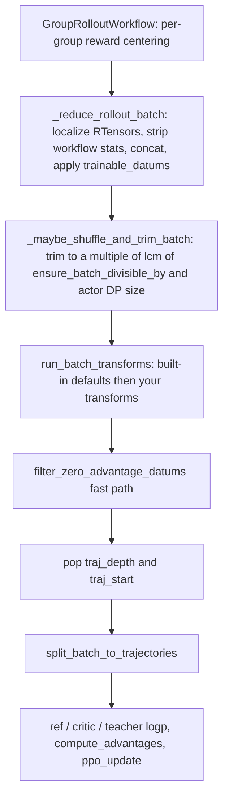

# Custom batch transform

A batch transform is the last user-owned hook before the optimizer sees your data. It runs after every
rollout in the step has been reduced into one training batch, and before advantages (AReaL) or the
forward/backward call (Tinker). Use it when the change you want is a property of the *batch* —
re-weighting, clipping, re-normalizing across trajectories — rather than a property of a single
trajectory, which belongs in a [reward function](rewards.md) or the [rollout](rollout.md).

Both backends ship the same idea under the same names, but the object you receive and the point in the
loop are different. Read the section for the backend you run.

| | <span class="pl-tag pl-tag--areal">AReaL</span> | <span class="pl-tag pl-tag--tinker">Tinker</span> |
|---|---|---|
| Module | <span class="pl-src">platoon/train/areal/batch_transforms.py</span> | <span class="pl-src">platoon/train/tinker/batch_transforms.py</span> |
| Unit of work | the whole step's batch, as one padded dict of tensors | one microbatch, as a `list[tinker.Datum]` |
| Signal you edit | `rewards`; advantages are computed *after* | `advantages`, already centered by the workflow |
| Times per training step | once | `num_minibatches × num_microbatches` |
| Runs on evaluation | no | no |

## The contract

Both backends define `BatchTransform` as a `Protocol`, so any callable with the right shape is a
transform — a function, a closure, or an instance of a class with `__call__`. There is no base class to
inherit and nothing to register.

=== "AReaL"

    ```python title="platoon/train/areal/batch_transforms.py"
    BatchDict = dict[str, Any]


    @dataclass(frozen=True)
    class BatchTransformContext:
        """Stable trainer-side context exposed to batch transforms."""

        config: "PlatoonArealRLTrainerConfig"
        actor_dp_world_size: int
        global_step: int | None = None
        epoch: int | None = None
        epoch_step: int | None = None


    class BatchTransform(Protocol):
        """Callable protocol for full-batch trainer transforms."""

        def __call__(
            self,
            batch: BatchDict,
            context: BatchTransformContext,
        ) -> BatchDict | None: ...
    ```

=== "Tinker"

    ```python title="platoon/train/tinker/batch_transforms.py"
    @dataclass(frozen=True)
    class BatchTransformContext:
        """Stable trainer-side context exposed to Tinker batch transforms."""

        config: "PlatoonTinkerRLTrainerConfig"
        train_step: int
        minibatch_num: int
        microbatch_num: int


    class BatchTransform(Protocol):
        """Callable protocol for microbatch-scoped trainer transforms."""

        def __call__(
            self,
            datums: list[tinker.Datum],
            context: BatchTransformContext,
        ) -> list[tinker.Datum] | None: ...
    ```

Rules that hold on both sides:

- **Return the batch.** In-place mutation is the normal style — the shipped depth transform mutates and
  returns the same object — but `run_batch_transforms` uses the *return value*, so a transform that
  mutates and returns `None` aborts instead of applying its mutation.
- **Returning `None` short-circuits the rest of the pipeline.** `run_batch_transforms` stops calling
  later transforms and hands `None` straight back to the trainer.
- **Transforms are ordered and chained.** Each one receives the previous one's output.

What `None` costs you differs:

=== "AReaL"

    The whole step is dropped. `_postprocess_rollout_batch` returns `None`, no critic/ref/teacher compute
    runs, no optimizer step happens, and the trainer still calls
    `_advance_logical_versions(global_step + 1)` so checkpointing, staleness accounting and the next
    rollout continue to agree about the model version
    (<span class="pl-src">platoon/train/areal/rl.py</span>). Saving, evaluation and stats export for
    the step still run.

=== "Tinker"

    Only the current microbatch is skipped. The trainer logs
    `All datums were filtered out for microbatch ...` and continues to the next one
    (<span class="pl-src">platoon/train/tinker/rl.py</span>). An empty list has the same effect as
    `None`. The other microbatches in the minibatch still contribute to the weight update.

## Where it runs — AReaL

The ordering is deliberate, and the reasoning is spelled out in the docstring of
`_build_batch_transforms` (<span class="pl-src">platoon/train/areal/rl.py</span>): transforms see
*exactly the datums that will train*, so a transform that normalizes across the batch normalizes over
the right denominator.



By the time your transform is called:

- `trainable_datums` has already been consumed and **removed** from the batch
  (<span class="pl-src">platoon/train/areal/rl.py</span>). Subagent sampling and policy eligibility
  are settled, and the datums they excluded are gone.
- Workflow-level statistics have been stripped: `task_reward`, `task_reward_valid`, `num_steps`,
  `num_input_tokens`, `num_output_tokens`, and anything prefixed `_platoon_workload_`, `root_`,
  `reward/` or `_platoon_reward_metric_present/`
  (<span class="pl-src">platoon/train/areal/rl.py</span>).
- The deferred error-action mask `_platoon_error_action_mask` has been consumed inside the workflow and
  is gone (<span class="pl-src">platoon/train/areal/workflows/group_rollout_workflow.py</span>).
- The DP-divisibility trim has happened, so the batch size is final.
- `_platoon_trajectory_segment_id` — the per-trajectory id used to repair `traj_start` after trimming —
  was popped by the trim step (<span class="pl-src">platoon/train/areal/rl.py</span>). Do not expect
  it.

Keys you can expect in the batch:

| Key | Shape | Notes |
|---|---|---|
| `input_ids` | `[B, S]` | Right-padded token ids. |
| `attention_mask` | `[B, S]` | Bool; `get_batch_size` infers `B` from this first. |
| `loss_mask` | `[B, S]` | `1` on action tokens, `0` on observations. |
| `logprobs` | `[B, S]` | Behavior-policy logprobs. |
| `versions` | `[B, S]` | Weight version each token was sampled under. |
| `rewards` | `[B]` | Group-centered, one scalar per datum. Advantages are built from this. |
| `token_rewards` | `[B, S]` | Per-token copy of the datum's reward. |
| `traj_depth` | `[B]` | Conditional — see the warning below. |
| `traj_start` | `[B]` | Conditional; `1.0` on the first retained datum of each trajectory. |
| `routed_experts`, `routed_experts_valid` | `[B, S, L, K]`, `[B, S]` | Only under MoE router replay. |

!!! warning "`traj_depth` and `traj_start` are not always there"
    The workflow emits them only for specific features
    (<span class="pl-src">platoon/train/areal/workflows/group_rollout_workflow.py</span>):
    `traj_depth` when `depth_level_weighting`, `depth_level_discount_gamma` or subagent datum sampling
    is active; `traj_start` when `depth_level_weighting` or subagent sampling is active — **not** for a
    gamma-only run. A depth-aware custom transform must either require one of those settings or tolerate
    the keys being absent.

    Worse, the built-in `DepthLevelWeightingTransform` **deletes** `traj_depth` and `traj_start` on its
    way out, and your transforms are appended *after* it. If you need depth while depth weighting is on,
    build the transform list yourself so yours runs first.

## Where it runs — Tinker

The Tinker trainer assembles a microbatch by pulling `tasks_per_microbatch` completed rollouts off a
queue, dropping ones staler than `train.max_staleness`, and flattening them into one
`list[tinker.Datum]`. Transforms run on that list
(<span class="pl-src">platoon/train/tinker/rl.py</span>), immediately before the zero-advantage
filter and the loss-normalization bookkeeping.

Each `tinker.Datum` carries `model_input` plus a `loss_fn_inputs` dict of `TensorData`:
`target_tokens`, `logprobs`, `advantages`, `mask`, `checkpoint_version`, and `traj_depth` /
`traj_start` when `depth_level_weighting` is on
(<span class="pl-src">platoon/utils/tinker_data_processing.py</span>). The error-action side channel
is popped inside the workflow, so it never reaches a transform
(<span class="pl-src">platoon/train/tinker/workflows/group_rollout_workflow.py</span>). Read a tensor
with `.to_torch()` and write one back with `TensorData.from_torch(...)`.

Three consequences of the microbatch scope:

- **Any normalization you compute is local to the microbatch**, not the batch. That is exactly why the
  shipped depth transform renormalizes by the microbatch's own action-token mass. The Tinker trainer
  offers no batch-global statistic at this hook.
- **The transform runs `num_minibatches × num_microbatches` times per training step.** Use
  `context.train_step` for schedules; `minibatch_num` and `microbatch_num` tell you where you are inside
  the step.
- **Advantages are still unnormalized here.** After transforms and the zero-advantage filter, the
  trainer copies each datum and multiplies `advantages` by
  `1 / (normalization_token_count + 1e-8)` so Tinker's sum-reduced objective behaves like a mean
  (<span class="pl-src">platoon/train/tinker/rl.py</span>). Your transform sees the pre-scaling
  values, which is what makes a relative re-weighting meaningful.

!!! warning "Do not add new `loss_fn_inputs` keys"
    After transforms, the trainer rebuilds each datum and strips exactly `mask`, `checkpoint_version`,
    `traj_depth`, `traj_start` and `_loss_normalization_tokens` before calling `forward_backward_async`
    (<span class="pl-src">platoon/train/tinker/rl.py</span>). Any other key you attach is sent to the
    Tinker service as a loss input. Keep scratch state outside the datum.

## What ships today

`DepthLevelWeightingTransform` is the only built-in transform, and it exists on both backends. It exists
so that in recursive runs a depth level with many trajectories does not dominate the gradient purely by
outnumbering the root — see [recursive agents](../recipes/recursive.md).

=== "AReaL"

    Two mutually exclusive formulas, chosen by config. Gamma wins if both are set.

    - `workflow_config.depth_level_discount_gamma` set: each datum's reward is multiplied by
      `gamma ** traj_depth`, then the weight vector is rescaled so its mean is `1`
      (`normalization = raw_weights.numel() / raw_weights.sum()`). A negative gamma raises `ValueError`,
      and so does a batch whose raw weights sum to zero.
    - Otherwise (`workflow_config.depth_level_weighting: true`): each datum's reward is multiplied by
      `1 / (number of trajectories at that datum's depth)` — trajectories counted by summing
      `traj_start` per depth — and the per-depth weights are rescaled by `total_datums / unnorm_total`,
      so the weighted datum count equals the raw datum count. If the unnormalized total is zero the
      transform strips the depth keys and returns the batch with rewards unchanged.

    Either way the transform deletes `traj_depth` and `traj_start` on the way out, and it returns the
    batch untouched when `traj_depth` is missing.

=== "Tinker"

    One formula, and no gamma variant: per-depth weight `1 / (number of trajectories at that depth)`,
    rescaled by `total_action_tokens / sum(action_tokens_at_depth * raw_weight)` so the microbatch's
    total action-token weight is preserved. The weight multiplies each datum's `advantages` tensor.

    Unlike AReaL, this transform is strict. A datum missing `traj_depth` or `traj_start` raises
    `ValueError("depth_level_weighting requires traj_depth and traj_start in tinker datums")`, and a
    microbatch whose weights sum to zero raises as well.

The AReaL module also exports helpers you will want when writing your own transform:

| Helper | What it does |
|---|---|
| `localize_rtensors(value)` | Converts AReaL `RTensor` handles to local tensors, recursing through dicts, lists and tuples. |
| `get_batch_size(batch)` | Infers `B` from `attention_mask`, then `input_ids`, then any tensor-like or list value. Raises `ValueError` if it cannot. |
| `index_batch(batch, indices)` | Localizes, then `index_select`s every value whose leading dim is `B`, list-valued columns included. |
| `split_batch_to_trajectories(batch)` | The trainer's own un-batching step; useful reading, not something a transform calls. |

The Tinker module exports `has_zero_action_advantage`, `filter_zero_advantage_datums`,
`get_datum_counts`, `set_loss_normalization_token_counts` and `get_loss_normalization_token_count` — the
machinery behind the zero-advantage fast path described below.

## How transforms are selected

Plainly: **there is no config key that selects a custom batch transform.** The only config-driven
selection is which *built-in* transform the defaults contain.

```python title="platoon/train/areal/batch_transforms.py"
def build_default_batch_transforms(
    config: "PlatoonArealRLTrainerConfig",
) -> list[BatchTransform]:
    """Build the default trainer-side transforms from the current config."""

    if config.workflow_config.depth_level_weighting or config.workflow_config.depth_level_discount_gamma is not None:
        return [DepthLevelWeightingTransform()]
    return []
```

The Tinker equivalent keys off `config.train.workflow_config.depth_level_weighting` alone.

Both trainers then take an optional constructor argument and append it after the defaults:

```python title="platoon/train/areal/rl.py"
    def _build_batch_transforms(
        self,
        extra_batch_transforms: list[BatchTransform] | None = None,
    ) -> list[BatchTransform]:
        ...
        transforms = build_default_batch_transforms(self.config)
        if extra_batch_transforms:
            transforms.extend(extra_batch_transforms)
        return transforms
```

So the real way to add one is to construct the trainer yourself and pass `batch_transforms=[...]` as the
fourth argument (<span class="pl-src">platoon/train/areal/rl.py</span>,
<span class="pl-src">platoon/train/tinker/rl.py</span>).

!!! warning "The registry entrypoints cannot pass transforms"
    `python -m platoon.train.areal.train` and `python -m platoon.train.tinker.train` construct
    `PlatoonArealRLTrainer` / `PlatoonTinkerRLTrainer` with no `batch_transforms` argument
    (<span class="pl-src">platoon/train/areal/train.py</span>,
    <span class="pl-src">platoon/train/tinker/train.py</span>). Registering a component in the
    `environments:` block does not help either — `EnvironmentConfig`
    (<span class="pl-src">platoon/train/components.py</span>) has no batch-transform field, and there
    is no batch-transform registry. If you need a custom transform, you need your own train script.

    <span class="pl-src">plugins/openreward/platoon/openreward/areal_trainer.py</span> shows how a
    trainer subclass keeps the door open: `OpenRewardArealRLTrainer.__init__` keeps `batch_transforms` in
    its own signature and forwards it to `super().__init__`. No plugin in the repository actually passes
    a custom transform today; depth weighting via config is the only transform in production use. See
    [packaging a plugin](packaging.md) for where such a script lives.

The one transform you *can* select from YAML alone is depth weighting:

=== "AReaL"

    ```yaml title="plugins/textcraft/platoon/textcraft/configs/areal/textcraft_synth_ctx8192_depth_aware_medium_areal.yaml"
    workflow_config:
      ...
      group_size: 8
      leave_one_out_baseline: True  # Use leave-one-out baseline for advantage centering
      depth_level_weighting: True  # Weight trajectories inversely by depth-level frequency
      depth_level_discount_gamma: null  # Alternate strategy: discount rewards by trajectory depth as gamma^d
    ```

=== "Tinker"

    ```yaml title="plugins/textcraft/platoon/textcraft/configs/tinker/textcraft_synth_depth_aware_tinker.yaml"
    train:
      ...
      workflow_config:
        group_size: 8
        leave_one_out_baseline: true
        depth_level_weighting: true
    ```

The two loaders differ: AReaL configs go through OmegaConf (`key=value` overrides, no leading dashes),
Tinker configs through argparse (`--dotted.key value`). See the
[configuration reference](../reference/configuration.md).

## Worked example

The transform below is not in the repository — it is a plausible one written against the real API. It
clamps group-centered rewards into a symmetric band so a single enormous outlier cannot dominate a step.

```python title="my_plugin/transforms.py"
import torch

from platoon.train.areal.batch_transforms import (
    BatchDict,
    BatchTransformContext,
    localize_rtensors,
)


class ClipRewardMagnitudeTransform:
    """Clamp centered rewards into a symmetric band before advantage computation."""

    def __init__(self, limit: float = 1.0) -> None:
        if limit <= 0:
            raise ValueError("reward clip limit must be positive")
        self.limit = float(limit)

    def __call__(
        self,
        batch: BatchDict,
        context: BatchTransformContext,
    ) -> BatchDict | None:
        rewards = localize_rtensors(batch["rewards"])
        batch["rewards"] = torch.clamp(rewards, -self.limit, self.limit)
        return batch
```

Wire it up in your own train script, alongside the dataset and workflow construction the plugin scripts
already do. This mirrors
<span class="pl-src">plugins/textcraft/platoon/textcraft/train_scripts/areal/train_areal_synth.py</span>:

```python title="my_plugin/train.py"
import sys

from areal.api.cli_args import load_expr_config
from datasets import Dataset

from platoon.train.areal import PlatoonArealRLTrainer, PlatoonArealRLTrainerConfig
from platoon.train.areal.workflows import GroupRolloutWorkflow

from my_plugin.rollout import run_rollout
from my_plugin.tasks import get_task, get_task_ids
from my_plugin.transforms import ClipRewardMagnitudeTransform


def main(args):
    config, _ = load_expr_config(args, PlatoonArealRLTrainerConfig)

    train_dataset = Dataset.from_list([{"task_id": x} for x in get_task_ids("train")])
    val_dataset = Dataset.from_list([{"task_id": x} for x in get_task_ids("val")])

    with PlatoonArealRLTrainer(
        config=config,
        train_dataset=train_dataset,
        val_dataset=val_dataset,
        batch_transforms=[ClipRewardMagnitudeTransform(limit=1.0)],
    ) as trainer:
        workflow = GroupRolloutWorkflow(
            run_rollout,
            get_task,
            config.workflow_config,
            trainer.proxy_base_url,
            trainer.proxy_admin_api_key,
            output_subdir="train_rollout",
            filter_errors=True,
        )
        trainer.train(workflow=workflow)


if __name__ == "__main__":
    main(sys.argv[1:])
```

The Tinker shape of the same idea operates on the advantage tensor instead:

```python title="my_plugin/tinker_transforms.py"
import tinker
import torch
from tinker import TensorData

from platoon.train.tinker.batch_transforms import BatchTransformContext


class ClipAdvantageMagnitudeTransform:
    """Clamp per-token advantages inside each Tinker microbatch."""

    def __init__(self, limit: float = 1.0) -> None:
        if limit <= 0:
            raise ValueError("advantage clip limit must be positive")
        self.limit = float(limit)

    def __call__(
        self,
        datums: list[tinker.Datum],
        context: BatchTransformContext,
    ) -> list[tinker.Datum] | None:
        for datum in datums:
            advantages = datum.loss_fn_inputs["advantages"].to_torch()
            datum.loss_fn_inputs["advantages"] = TensorData.from_torch(
                torch.clamp(advantages, -self.limit, self.limit)
            )
        return datums
```

```python title="my_plugin/train_tinker.py"
    trainer = PlatoonTinkerRLTrainer(
        config=config,
        train_dataset=train_dataset,
        eval_dataset=eval_dataset,
        batch_transforms=[ClipAdvantageMagnitudeTransform(limit=1.0)],
    )

    async with trainer:
        ...
        await trainer.train(train_workflow=train_workflow, eval_workflow=eval_workflow)
```

Both examples are *zero-preserving*: a datum whose centered reward or advantage is exactly zero stays
exactly zero. That property matters, for the reason in the next section.

## Interaction with `filter_zero_advantage_datums`

`workflow_config.filter_zero_advantage_datums` defaults to `True` on both backends. It is a throughput
optimization: a datum with no policy-gradient signal is removed before the model forward, using the
*centered scalar reward* (AReaL) or the *already-centered per-token advantage* (Tinker) as an early proxy
for the final advantage.

Removed action tokens stay represented in the loss denominator, so only compute shrinks:

=== "AReaL"

    `_filter_zero_centered_reward_batch` (<span class="pl-src">platoon/train/areal/rl.py</span>)
    keeps every nonzero datum, retains the minimum number of zero datums needed as structural padding
    for DP dispatch, and rescales the retained scalar rewards by
    `retained_loss_tokens / (retained_loss_tokens + filtered_zero_loss_tokens)`. It emits
    `zero_advantage_filter/*` scalars.

    Concretely, from
    <span class="pl-src">tests/test_areal_batch_transforms.py</span>: two zero datums contributing
    four action tokens are dropped alongside two retained datums contributing two action tokens, so
    rewards `[1.0, 2.0]` become `[1/3, 2/3]` — the ratio `2 / (2 + 4)`.

=== "Tinker"

    `filter_zero_advantage_datums` drops the datums, then `set_loss_normalization_token_counts` stashes
    the filtered action-token mass in `_loss_normalization_tokens` on the first surviving datum. The
    trainer later divides advantages by `get_loss_normalization_token_count(...)`, which reads that key,
    so the denominator is the pre-filter action-token count.

The filter runs **after** your transforms, on both backends. That ordering is intentional — depth
weighting is part of the objective, so zero-signal datums must participate in its normalization before
being dropped — but it also means the zero proxy is evaluated on *your* output.

!!! danger "An additive transform breaks the fast path"
    If your transform *adds* to `rewards` (AReaL) or `advantages` (Tinker), a datum that was exactly
    zero may now carry real signal, or a datum with real signal may be shifted to exactly zero and
    silently discarded. Multiplicative and clamping transforms are safe because they map zero to zero.
    Anything additive is not. Set `filter_zero_advantage_datums: false` when your transform adds a
    constant, a bias, a bonus, or anything else that is nonzero at zero.

AReaL makes this loud. `PlatoonArealRLTrainer.__init__` calls
`_warn_for_zero_reward_filter_assumptions` *before* `super().__init__`, and it emits a `RuntimeWarning`
whenever `filter_zero_advantage_datums` is on
(<span class="pl-src">platoon/train/areal/rl.py</span>):

```text
workflow_config.filter_zero_advantage_datums uses centered scalar reward as an early proxy for
final policy advantage. Disable it when KL is nonzero, reward/advantage normalization or reward
bias/overlong penalty is active, a critic or teacher objective is present, the model has an
independent MoE/router objective, or a custom transform adds to rewards. Detected incompatible
settings: ...
```

The reasons it can list (<span class="pl-src">platoon/train/areal/rl.py</span>) are
`actor.kl_ctl != 0`, `actor.reward_bias != 0`, an active `actor.reward_norm` or `actor.adv_norm`,
`actor.overlong_reward_penalty is enabled`, `critic objective is present`,
`teacher/distillation objective is present`, a Qwen3.5/3.6 MoE model under `megatron-bridge` (which
carries an independent global router auxiliary loss), and — unconditionally —
`custom batch transforms are present (additive transforms are incompatible)`. When nothing matches, the
warning still fires but ends with `Current actor settings satisfy the known reward-only constraints.`

!!! warning "The warning fires for *any* custom transform"
    Passing a non-empty `batch_transforms` list always adds that last reason, even for a zero-preserving
    transform like the clipping example above. The trainer cannot inspect your callable; it warns and
    continues. **It never disables the filter for you.** You have to decide, and if the answer is
    "disable", set `workflow_config.filter_zero_advantage_datums: false` yourself.

Tinker has no equivalent warning. The same reasoning applies; nothing will tell you.

## Other things to get right

**Divisibility.** On AReaL the DP-divisibility trim happens *before* transforms and the trainer does not
re-trim afterwards. If your transform changes the number of datums, keep the count a multiple of
`context.actor_dp_world_size` — and of `rollout.ensure_batch_divisible_by`, which the trim combined with
the DP size via `math.lcm` (<span class="pl-src">platoon/train/areal/rl.py</span>). Use `index_batch`
rather than slicing by hand: it localizes RTensors and handles list-valued columns. The zero-advantage
filter does re-pad or re-trim to restore divisibility, but it only runs when it is enabled, so do not
rely on it.

**RTensors.** In single-controller mode rollout values arrive as AReaL `RTensor` handles, not tensors.
`_reduce_rollout_batch` localizes before concatenating, so the batch you receive is normally already
local — but `localize_rtensors` is cheap and idempotent, and every shipped transform calls it before
touching a value. Do the same.

**Evaluation is untouched.** Neither backend runs transforms on evaluation rollouts: AReaL's
`_evaluate_fn` submits the validation dataloader straight to the eval rollout controller
(<span class="pl-src">platoon/train/areal/rl.py</span>), and the Tinker `run_batch_transforms` call
lives only in `_train_loop`. A transform that is part of your objective therefore does not change eval
metrics — usually what you want, but worth remembering when training and eval numbers diverge.

**Order within the list.** Defaults first, yours after, in the order you pass them. If you need to run
before `DepthLevelWeightingTransform` — for example because you need `traj_depth`, which it deletes — do
not pass your transform as an extra. Leave `depth_level_weighting` off (and
`depth_level_discount_gamma: null`) so `build_default_batch_transforms` returns an empty list, then pass
the complete ordered list, including your own `DepthLevelWeightingTransform()` instance if you still
want it, as `batch_transforms`.

**Determinism across workers.** On AReaL the transform runs in the single trainer process, not on the
GPU workers, so it needs no registration and sees no distributed state. On Tinker it runs in the single
trainer process too. Neither backend imports your module for you; your train script's imports are what
make the transform available.

## See also

- [Data pipeline](../architecture/data-pipeline.md) — the full trajectory-to-batch path this hook sits in.
- [Trajectory to batch](../walkthroughs/trajectory-to-batch.md) — a line-by-line walkthrough of the conversion.
- [Custom loss](loss.md) — the other trainer-side hook, one stage further down.
- [Custom rewards](rewards.md) — where per-trajectory reward shaping belongs.
- [Recursive agents](../recipes/recursive.md) — why depth weighting exists.
- [AReaL backend](../architecture/areal.md) and [Tinker backend](../architecture/tinker.md).
