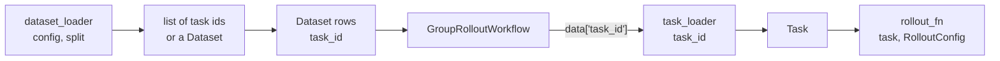

# Custom dataset and tasks

Getting your own data into a Platoon training run means writing two small functions: a **dataset
loader** that decides which tasks a split contains and in what order, and a **task loader** that
turns one task id into a `Task` object. Everything else — batching, grouping, rollout scheduling —
is already written. This page covers both contracts, the three common data sources (a jsonl file,
the Hugging Face Hub, generated tasks), and the config wiring that connects them to the shared
trainers.

## The split of responsibility

The trainer never sees your data. It iterates a Hugging Face `Dataset` whose rows carry a single
required column, `task_id`, and hands one id at a time to the workflow. The workflow calls your
task loader to materialize the actual `Task`, then hands that to your rollout function.



The separation exists because the two halves run in different places and at different rates. The
dataset loader runs **once per split, in the trainer process, at startup**. The task loader runs
**once per rollout** — `group_size` times per row, potentially in a rollout worker process that
never loaded your config. Keeping ids small and opaque is what makes that split cheap.

## The dataset loader contract

```python title="platoon/train/components.py"
@runtime_checkable
class DatasetLoader(Protocol):
    """Build a backend dataset or list of task ids for a train/eval split."""

    def __call__(self, config: Any, split: str, **kwargs: Any) -> Any: ...
```

Three arguments:

| Argument | What it is |
|---|---|
| `config` | The whole trainer config object — `PlatoonArealRLTrainerConfig` or `PlatoonTinkerRLTrainerConfig` |
| `split` | The literal string `"train"` or `"eval"`. Never `"val"`. |
| `**kwargs` | `dataset_kwargs` (train) or `eval_dataset_kwargs` (eval), splatted |

Prefer to ignore `config` and take everything you need from `**kwargs`. The config *class* differs
between the two backends, so a loader that reaches into it is a loader that only works on one of
them. TextCraft's loader names `config` and never touches it; that is the shape to copy.

### The two valid return shapes

`AutoDataset` inspects the return value and does exactly one thing with it:

```python title="platoon/train/auto.py"
dataset = loader(config, split, **kwargs)
if isinstance(dataset, list):
    return task_ids_to_dataset(dataset)
return dataset
```

**Return a `list` of task-id strings** and Platoon builds the dataset for you:

```python title="platoon/train/components.py"
def task_ids_to_dataset(task_ids: Sequence[str]) -> Any:
    """Convert task ids to a Hugging Face Dataset lazily to keep core imports light."""

    from datasets import Dataset

    return Dataset.from_list([{"task_id": task_id} for task_id in task_ids])
```

**Return a `datasets.Dataset` yourself** when rows need to carry more than an id. The only column
either backend's workflow reads is `task_id`, but extra columns survive the dataloader and arrive
in the same row dict, so a custom workflow can use them. `plugins/openreward` does this: its rows
carry `_openreward_environment` and `_openreward_sampling_weight` alongside `task_id`.

!!! warning "Only a `list` is converted"

    The check is `isinstance(dataset, list)`, not "is a sequence". A tuple, a generator or a numpy
    array falls through the `return dataset` branch untouched and reaches the trainer as something
    that is not a `Dataset` — which fails much later, with an unhelpful error. If you build ids
    inside a `tuple(...)` or a `map(...)`, wrap the result in `list(...)`.

### What the trainers require of a returned `Dataset`

| Requirement | Why |
|---|---|
| A `task_id` column, string-valued | Both workflows read `data["task_id"]` and pass it to `get_task_fn` |
| Rows convertible to plain dicts | Tinker's dataloader batches then re-splits into `list[dict]`; AReaL collates with `lambda x: x` |
| No `_platoon_preserve_dataset_order` column unless you mean it | See [determinism and shuffling](#determinism-and-shuffling) below |

Nothing validates the `task_id` column at startup. A dataset without it raises `KeyError` on the
first rollout, several minutes into a run, after the inference engines have already spun up.

## The task loader contract

```python title="platoon/train/components.py"
@runtime_checkable
class TaskLoader(Protocol):
    """Resolve a task id into a Platoon task."""

    def __call__(self, task_id: str) -> Task: ...
```

One argument, one return value, and — importantly — **synchronous**. Both workflows call it with a
bare `task = self.get_task_fn(task_id)`, with no `await`. An `async def` task loader hands your
rollout function a coroutine object where it expected a `Task`.

The `Task` it returns is an ordinary dataclass:

```python title="platoon/envs/base.py"
@dataclass
class Task:
    goal: str | None = None
    id: str | None = None
    max_steps: int | None = None
    misc: dict[str, Any] = field(default_factory=dict)
    fork_strategy: Literal["task", "subtask"] = "subtask"
```

Set `id` to the task id you were given. Nothing enforces this, but rollout code, event filenames
and reward code all read `task.id` and assume it matches.

!!! warning "The workflow mutates the Task you return"

    Immediately after calling your loader, both workflows run
    `if rollout_config.max_steps is not None: task.max_steps = rollout_config.max_steps`. The
    `max_steps` you baked into your data is overwritten whenever
    `workflow_config.rollout_config.max_steps` is set — which every shipped config sets. And if
    your loader caches `Task` objects in a module-level dict (the house style in every plugin),
    that mutation is shared by every later rollout in the process. Return a `deepcopy` from the
    cache if anything downstream mutates `task.misc`. `oolong` and `email-search` do copy;
    `deepdive` does not.

!!! warning "AReaL needs an importable, module-level function"

    AReaL ships workflows to rollout workers by *import path*, not by pickle.
    `GroupRolloutWorkflow.to_workflow_kwargs` converts `rollout_fn` and `get_task_fn` through
    `callable_import_path`
    (<span class="pl-src">platoon/train/areal/workflow_serialization.py</span>) and raises
    `ValueError("GroupRolloutWorkflow requires importable rollout_fn/get_task_fn")` if either
    resolves to `None`. A lambda, a `functools.partial`, or a closure defined inside another
    function has no import path. Register a named module-level function instead.

## Splits: `"train"` and `"eval"`

The trainers call `AutoDataset.from_config(config, "train")` and
`AutoDataset.from_config(config, "eval")` — those two literals, nothing else. Your data almost
certainly calls its second split something else. Translate inside the loader, the way TextCraft
does:

```python title="plugins/textcraft/platoon/textcraft/registry.py"
def _get_filtered_synth_task_ids(
    split: str,
    difficulties: list[str] | None,
    num_samples_train: int = 10000,
    num_samples_val: int = 1000,
) -> list[str]:
    split_name = "val" if split == "eval" else split
    if not difficulties:
        return get_synth_task_ids(split_name, num_samples_train, num_samples_val)
    ...
```

The *loader* is optional per split: `eval_dataset_loader` falls back to `dataset_loader` when it is
unset. The *kwargs* do not.

!!! danger "`eval_dataset_kwargs` does not fall back to `dataset_kwargs`"

    ```python title="platoon/train/auto.py"
    kwargs = environment.dataset_kwargs if split == "train" else environment.eval_dataset_kwargs
    ```

    `eval_dataset_kwargs` defaults to `{}` and is used as-is. If you set
    `dataset_kwargs: {num_samples_train: 2522}` and leave `eval_dataset_kwargs` empty, the eval
    call silently gets your function's *own* defaults. That is why the one live registry config in
    the repository repeats `num_samples_train` and `num_samples_val` in both blocks. Repeat every
    kwarg that both splits need.

One more sharp edge: when the eval loader cannot be resolved, the error message names the train
key. `_resolve_required_component` formats `f"Config must set environments[0].{kind}"` with
`kind="dataset_loader"` regardless of which split was being built.

## Designing task ids

A task id is an arbitrary string. In practice every plugin uses `"<plugin>.<split>.<index>"` —
`number_search.train.0`, `textcraft_synth.val.17`, `deepdive.qa_rl.412` — and there are three
concrete reasons to keep that shape.

**Ids end up in file paths.** Every rollout writes its event stream to
`{output_dir}/events/events_{task.id}_{collection.id}.jsonl`, and AReaL derives its proxy session
name from `f"{task_id}-rollout-{rollout_number}-{uuid.uuid4().hex[:8]}"`. Slashes, spaces and
unbounded length will bite you.

**Several environments distinguish root tasks from subagent tasks by inspecting the id.** A forked
subtask gets a fresh `uuid4()` for its id, so environments test for their own prefix:

```python title="plugins/textcraft/platoon/textcraft/env.py"
is_subagent_task = "textcraft" not in (self._task.id or "")
```

DeepDive uses `"deepdive" not in (self._task.id or "")`, and email-search uses
`task_id.startswith("email_search.")`. If you adopt this idiom, pick a prefix a uuid4 hex string
can never contain, and never rename it without auditing `evaluate()`. The more robust alternative
is an `isinstance(self._task, SubTask)` check, which AppWorld uses — but that only works while
`fork_strategy` stays `"subtask"`. See [subagents](../architecture/subagents.md) for the fork
mechanics.

**Ids must be stable across processes.** The trainer resolves ids in one process; the rollout
worker resolves them in another. An id derived from a random shuffle, a set iteration order or a
timestamp points at a different row on the other side.

If an index into a file feels too fragile, encode the reference into the id itself. OpenReward does
this: `OpenRewardTaskReference.encode` base64-encodes a `{environment, split, index, name}` payload
behind the prefix `openreward:v1:`, and `get_task` decodes it. Self-describing ids cost nothing at
rollout time and survive the dataset being regenerated.

## Loading from a jsonl file

This is the `number-search` pattern and the one to copy when you own the data. Generation writes
`dataclasses.asdict(task)`, one `Task` per line; loading reads the line back through
`Task.from_dict`.

```python title="plugins/number-search/platoon/number_search/tasks.py"
    train_file = parent_dir / "number_search_train.jsonl"
    with open(train_file, "w") as f:
        for task in train_data:
            json.dump(asdict(task), f)
            f.write("\n")
```

Each line looks like this:

```json
{"goal": "Guess the correct number between 6 and 988.", "id": "number_search.train.0", "max_steps": 1, "misc": {"low": 6, "high": 988, "target": 228}}
```

The read side is two functions — one that lists ids, one that resolves a single id:

```python title="plugins/number-search/platoon/number_search/tasks.py"
def get_task_ids(
    split: Literal["train", "val"],
    num_samples_train: int = 50000,
    num_samples_val: int = 1000,
) -> list[str]:
    if split == "train":
        return [f"number_search.train.{i}" for i in range(num_samples_train)]
    if split == "val":
        return [f"number_search.val.{i}" for i in range(num_samples_val)]
    raise ValueError(f"Invalid split: {split}")


def load_task_from_disk(id: str) -> Task:
    parent = pathlib.Path(__file__).parent
    if id.startswith("number_search.train."):
        global TRAIN_DATA
        if TRAIN_DATA is None:
            file = parent / "number_search_train.jsonl"
            TRAIN_DATA = file.read_text().splitlines()
        return Task.from_dict(json.loads(TRAIN_DATA[int(id.split(".")[2])]))
    ...


def get_task(id: str) -> Task:
    global TASKS
    if id in TASKS:
        return TASKS[id]
    task = load_task_from_disk(id)
    TASKS[id] = task
    return task
```

Note what `get_task_ids` does *not* do: it never opens the file. Ids are `f"...{i}"` over
`range(n)`, so listing a split is free, and the jsonl is read only when a rollout actually needs a
task. The file is slurped once into a module global, and parsed `Task`s are memoized in `TASKS`.

The module doubles as its own generation CLI:

```bash
cd plugins/number-search
uv run python -m platoon.number_search.tasks --num_samples 50000 --eval_size 1000
```

!!! warning "`Task.from_dict` is `Task(**task_dict)`"

    It does not filter unknown keys. Any extra field in your jsonl rows — a top-level `difficulty`
    column, a provenance stamp — raises
    `TypeError: Task.__init__() got an unexpected keyword argument`. Put per-task extras inside
    `misc`, which is where every plugin puts them. *Missing* keys are fine: the committed
    `number_search_train.jsonl` has no `fork_strategy` field and still loads, because the dataclass
    default applies.

## Loading from the Hugging Face Hub

`plugins/deepdive` is the reference. It never writes a file: the split is downloaded lazily on the
first id listing and cached in a module dict.

```python title="plugins/deepdive/platoon/deepdive/tasks.py"
DATASET_NAME = "zai-org/DeepDive"
DATASET_SPLITS = ("qa_rl", "qa_sft")
DEFAULT_MAX_STEPS = 50

_DATA_CACHE: dict[str, list[dict[str, Any]]] = {}
_TASK_CACHE: dict[str, Task] = {}


def _load_dataset_from_hf(split: Literal["qa_rl", "qa_sft"]) -> list[dict[str, Any]]:
    try:
        from datasets import load_dataset
    except ImportError as exc:
        raise ImportError(
            "datasets library is required. Install with: pip install datasets"
        ) from exc

    dataset = load_dataset(DATASET_NAME, split=split)
    return [dict(example) for example in dataset]


def get_task_ids(split: Literal["qa_rl", "qa_sft"] = "qa_sft") -> list[str]:
    return [f"deepdive.{split}.{idx}" for idx, _ in enumerate(_get_split_data(split))]
```

The `Task` is built from the row, with the whole source row preserved in `misc` so environment and
reward code can reach it:

```python title="plugins/deepdive/platoon/deepdive/tasks.py"
    task_misc = dict(example)
    task_misc["ground_truth"] = answer
    task_misc["dataset_name"] = DATASET_NAME
    task_misc["dataset_split"] = split
    task_misc["dataset_index"] = idx

    return Task(
        goal=question,
        id=task_id,
        max_steps=DEFAULT_MAX_STEPS,
        misc=task_misc,
    )
```

Two things to plan for on this path. Every rollout worker downloads and caches the split
independently, so the first rollout on each worker pays for it — pre-warm the HF cache on shared
storage for large datasets. And a hub dataset that changes upstream changes what
`deepdive.qa_rl.412` means, so pin a revision if the run has to be reproducible.

## Generating tasks

When tasks are cheap to synthesize, generate them offline into a file rather than inside the
loader — you want identical tasks on every worker, and a loader that regenerates is a loader that
has to agree with itself across processes. The property that matters is a *deterministic*
train/eval split. `number-search` gets it by hashing task content instead of shuffling:

```python title="plugins/number-search/platoon/number_search/tasks.py"
    def is_val_triplet(low: int, target: int, high: int) -> bool:
        h = int(hashlib.sha256(f"{seed}:{low}:{target}:{high}".encode()).hexdigest()[:8], 16)
        return (h / 0xFFFFFFFF) < p_val
```

Because assignment is a pure function of the sampled `(low, target, high)` triplet, growing the
dataset never moves an existing task across the split boundary. A `random.shuffle` followed by a
slice does not have that property.

TextCraft-Synth's generator goes further and makes the split *item-disjoint*: validation target
items are held out entirely, so a model cannot pass eval by memorizing a training recipe. See
[curriculum recipes](../recipes/curriculum.md) for how its difficulty tiers are then used.

If you must generate inside the loader, seed it from something in the config and return ids your
task loader can regenerate from — not indices into an ephemeral list.

## Registering and wiring it up

Put both loaders in one module, conventionally `registry.py` next to your other plugin code.

```python title="plugins/mytask/platoon/mytask/registry.py"
"""Registered MyTask components for shared Platoon trainers."""

from __future__ import annotations

from typing import Any

from platoon.registry import register_dataset_loader, register_task_loader

from platoon.mytask.tasks import get_task, get_task_ids


@register_task_loader("mytask/default")
def load_mytask_task(task_id: str):
    return get_task(task_id)


@register_dataset_loader("mytask/default")
def load_mytask_dataset(
    config: Any,
    split: str,
    limit: int | None = None,
    num_samples_train: int = 10000,
    num_samples_val: int = 500,
):
    split_name = "val" if split == "eval" else split
    task_ids = get_task_ids(split_name, num_samples_train, num_samples_val)
    if limit is not None:
        task_ids = task_ids[:limit]
    return task_ids
```

Names are free-form strings. The convention that emerges from TextCraft is
`"<plugin>/<dataset>"`; namespacing matters because a duplicate name in the same kind is a hard
error at import time.

Then name them from the top-level `environments:` block of your trainer config. `package` is the
module Platoon imports for its registration side effects.

```yaml title="environments block for your own plugin"
environments:
  - package: platoon.mytask.registry
    dataset_loader: mytask/default
    eval_dataset_loader: mytask/default
    task_loader: mytask/default
    rollout: mytask/default
    dataset_kwargs:
      num_samples_train: 10000
    eval_dataset_kwargs:
      num_samples_train: 10000
      limit: 100
```

The only complete, live example in the repository is TextCraft's, and it is worth reading verbatim:

```yaml title="plugins/textcraft/platoon/textcraft/configs/tinker/textcraft_synth_depth_aware_tinker.yaml"
environments:
  - package: platoon.textcraft.registry
    trainer_config: textcraft/synth/tinker
    dataset_loader: textcraft/synth
    eval_dataset_loader: textcraft/synth
    task_loader: textcraft/synth
    rollout: textcraft/synth/depth_aware
    reward_processor: textcraft/synth/delegation_capped
    workflow: group_rollout
    dataset_kwargs:
      difficulties: ["medium"]
      num_samples_train: 2522
      num_samples_val: 632
    eval_dataset_kwargs:
      difficulties: null
      limit: 100
      num_samples_train: 2522
      num_samples_val: 632
```

Run it with whichever shared entrypoint matches your backend:

=== "AReaL"

    ```bash
    uv run python -m platoon.train.areal.train --config path/to/config.yaml
    ```

    CLI overrides on this path are OmegaConf-style with **no** leading dashes, for example
    `trial_name=debug-run`.

=== "Tinker"

    ```bash
    uv run python -m platoon.train.tinker.train --config path/to/config.yaml
    ```

    CLI overrides on this path go through `platoon.utils.config.load_config` and **require**
    leading dashes, for example `--train.batch_size 64`.

!!! note "This branch is mid-migration"

    `plugins/textcraft` is the only plugin that registers components today, and its
    `environments:` block is wired up in the Tinker config; the AReaL twin exists but is commented
    out. Every other plugin still builds its datasets inline in a bespoke `train_*.py` script with
    `Dataset.from_list([{"task_id": x} for x in get_task_ids("train", 1000)])` and passes it
    straight to the trainer. Both paths work. The registry path is the one that does not require a
    new training script per environment.

!!! tip "Registration is optional"

    Any spec string that is not a registered name is treated as a dotted import path
    (`Registry.resolve` falls through to `import_from_string`, which accepts `pkg.mod.attr` and
    `pkg.mod:attr`). So this is a valid block with no `registry.py` at all:

    ```yaml
    environments:
      - dataset_loader: platoon.mytask.tasks.load_dataset
        task_loader: platoon.mytask.tasks.get_task
        rollout: platoon.mytask.rollout.run_rollout
    ```

    Registering buys you short names that survive a module rename, and an error message listing the
    available names when you typo one.

Do not confuse this top-level `environments:` list with the `environments:` key nested *inside*
`plugins/openreward`'s own config section. That one is a list of `OpenRewardEnvironmentConfig`
entries describing a task-source mixture with sampling weights, and it has nothing to do with
registry wiring. The [registry architecture page](../architecture/registry.md) covers resolution
order in detail.

## Determinism and shuffling

Your loader returns an *ordered* list. What happens to that order next depends on the backend.

=== "AReaL"

    Ordering is AReaL's `DistributedSampler`, driven by two Platoon config blocks:

    | Key | Type | Default | What it does |
    |---|---|---|---|
    | `train_dataset.batch_size` | `int` | `1` | Rows per training step |
    | `train_dataset.shuffle` | `bool` | `True` | Shuffle the training split |
    | `train_dataset.num_workers` | `int` | `0` | Dataloader worker processes |
    | `train_dataset.drop_last` | `bool` | `True` | Drop a short final batch |
    | `valid_dataset.batch_size` | `int` | `1` | Rows per eval step |
    | `valid_dataset.shuffle` | `bool` | `False` | Eval order is preserved by default |
    | `valid_dataset.num_workers` | `int` | `0` | Dataloader worker processes |
    | `valid_dataset.drop_last` | `bool` | `False` | Keep the short final eval batch |

    Defined at <span class="pl-src">platoon/train/areal/config_defs.py</span> and
    <span class="pl-src">platoon/train/areal/config_defs.py</span>. Set
    `train_dataset.shuffle: false` when your loader's order is meaningful.

=== "Tinker"

    Ordering is `PlatoonTinkerDataloader`
    (<span class="pl-src">platoon/train/tinker/rl.py</span>). The trainer constructs it as
    `PlatoonTinkerDataloader(self.train_dataset, self.config.train.batch_size)`, taking the
    defaults `shuffle_seed=42` and `drop_last=True` — **the training split is always shuffled with
    seed 42, and no config key changes that.** The eval dataloader is constructed explicitly with
    `batch_size=1, shuffle_seed=None, drop_last=False`, so eval order is your loader's order.

    To keep your training order, add a marker column:

    ```python title="platoon/train/tinker/dataset_order.py"
    PRESERVE_DATASET_ORDER_COLUMN = "_platoon_preserve_dataset_order"


    def prepare_dataset_for_dataloader(
        dataset: Dataset,
        *,
        shuffle_seed: int | None,
    ) -> Dataset:
        """Honor an explicit ordered-dataset marker, otherwise preserve legacy shuffle."""

        if PRESERVE_DATASET_ORDER_COLUMN not in dataset.column_names:
            return dataset.shuffle(seed=shuffle_seed) if shuffle_seed is not None else dataset
        ...
        return dataset.remove_columns(PRESERVE_DATASET_ORDER_COLUMN)
    ```

    Return a `Dataset` where every row has that column set to `True`, and the shuffle is skipped
    and the column stripped before batching. Any row whose value is not `True` raises
    `ValueError: _platoon_preserve_dataset_order must be true for every ordered record`.
    OpenReward's Tinker script uses this to interleave a weighted mixture of task sources in an
    order the dataloader must not destroy.

Two habits pay off on either backend:

- **Make the loader itself deterministic.** Given the same `dataset_kwargs`, it should return the
  same ids in the same order in every process. Iterating `range(n)` or a sorted list is
  deterministic; iterating a set is not.
- **If you shuffle inside the loader, seed it explicitly and derive the eval seed from the train
  seed.** DeepDive's training script does `_select_task_ids(config.train_split, ..., config.seed)`
  and `_select_task_ids(config.eval_split, ..., config.seed + 1)` for exactly this reason.

One performance note. A loader that filters on a per-task property has to load every task to read
it. TextCraft's difficulty filter calls `get_synth_task(task_id)` for all 2 522 train ids, keeps
the ones whose `misc["difficulty"]` matches, and `break`s out of the loop on `IndexError` when it
runs past the end of the file. That is acceptable for a few thousand small jsonl rows and a bad
idea for a dataset that has to be downloaded first. Precompute the filter into your ids when the
data is large.

## See also

- [Custom rollout](rollout.md) — the function that receives the `Task` your loader returned.
- [Custom environment](environment.md) — where `task.misc` is consumed and reward is computed.
- [Registry and Auto factories](../architecture/registry.md) — how a spec string becomes a callable.
- [Data pipeline](../architecture/data-pipeline.md) — what happens to a trajectory after a rollout.
- [Configuration reference](../reference/configuration.md) — every key in `environments` and in the
  dataset blocks.
- [Packaging a plugin](packaging.md) — where `registry.py` lives and how it gets imported.
