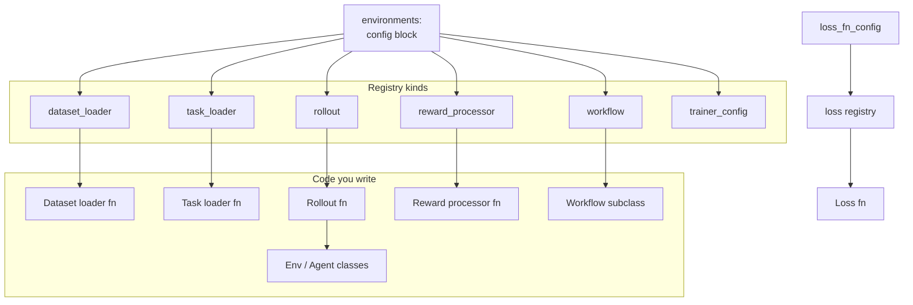

# Customization

Platoon is designed to be extended without being forked. Almost every piece you would want to
replace is either a **Protocol** you implement or a **registry entry** you name from a config —
usually both.

This section has one page per extension point. Each page follows the same shape: the contract, a
complete working example, the config wiring, and how to run it.

## The extension map

## Pages

### [Custom environment](environment.md)
Implement `Env` — or `ForkableEnv` if children should get their own copy of the world.

### [Custom agent](agent.md)
Implement `Agent`, or subclass `CodeActAgent` and change only the prompt.

### [Custom dataset and tasks](dataset.md)
Turn your data into task ids and `Task` objects the trainer can iterate.

### [Custom rollout](rollout.md)
The function that assembles an agent, an environment and an episode into one trajectory.

### [Custom rewards](rewards.md)
Environment-side `evaluate()`, trajectory-side reward processors, and judge-based rewards.

### [Custom workflow](workflow.md)
Replace the group rollout strategy itself when grouping, filtering or advantages need to differ.

### [Custom loss function](loss.md)
AReaL Register a policy loss by name and select it from
`loss_fn_config`. The Tinker path has no equivalent; the page says what to reach for instead.

### [Custom batch transform](batch-transform.md)
Reshape what reaches the optimizer: masks, weights, filtering, extra tensors.

### [Packaging a plugin](packaging.md)
Namespace layout, `pyproject.toml`, entry points, and how your package gets discovered.

!!! tip "You do not have to register anything"

    Every registry field also accepts a dotted import path, so
    `rollout: my_package.rollouts.run_rollout` works without a decorator. Registration exists so
    configs can stay readable and so components can be listed and validated — not as a gate.
