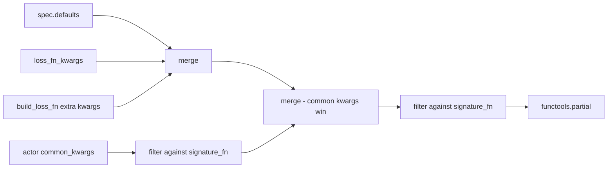
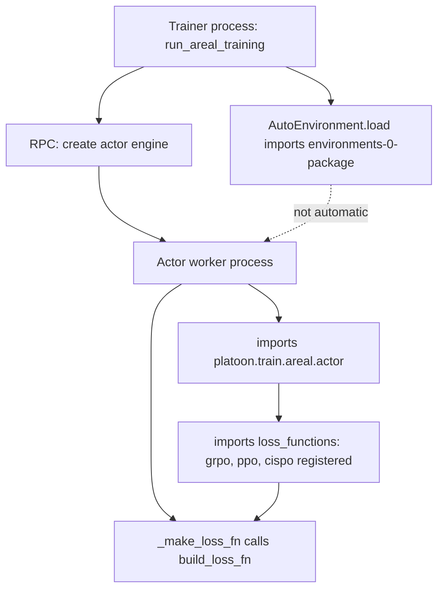

# Custom loss function

The policy loss is the one part of the AReaL training step that Platoon makes swappable by name. You
write a function, decorate it with `@register_loss_fn("my_loss")`, and select it from YAML with
`loss_fn_config.loss_fn: my_loss`. Nothing else in the trainer changes: the rollout, the batch
reduction, advantage computation and the minibatch loop are untouched.

!!! warning "This page is AReaL-only"
    The loss registry lives in <span class="pl-src">platoon/train/areal/loss_functions.py</span> and
    is consumed by <span class="pl-src">platoon/train/areal/actor.py</span>. The Tinker backend has a
    config key that happens to be called `train.loss_fn`, but it is a different mechanism entirely —
    see [What the Tinker path offers](#what-the-tinker-path-offers) at the bottom. You cannot
    register a Python loss for Tinker.

## The registry

`loss_functions.py` builds one process-local registry and exposes a decorator over it:

```python title="platoon/train/areal/loss_functions.py"
@dataclass(frozen=True)
class LossFnSpec:
    """Registered loss function plus loss-specific default kwargs."""

    fn: Callable
    defaults: dict[str, Any] = field(default_factory=dict)
    signature_fn: Callable | None = None


_LOSS_FN_REGISTRY = get_registry("loss")


def register_loss_fn(
    name: str,
    defaults: dict[str, Any] | None = None,
    signature_fn: Callable | None = None,
):
    """Decorator to register a loss function by name."""

    def decorator(fn: Callable) -> Callable:
        _LOSS_FN_REGISTRY.register(
            name,
            LossFnSpec(fn=fn, defaults=dict(defaults or {}), signature_fn=signature_fn),
            exist_ok=True,
        )
        return fn

    return decorator
```

`get_registry("loss")` returns the same generic `Registry` used for datasets, rollouts and reward
processors ([the registry](../architecture/registry.md)), but the `loss` kind is created directly
instead of through one of the `register_*` helpers in
<span class="pl-src">platoon/registry.py</span>, and it behaves differently in two ways worth
knowing:

- **`exist_ok=True`.** Registering a name that already exists overwrites it instead of raising. That
  makes it legal to shadow `cispo` with your own implementation, and it makes a double import
  harmless — but it also means a name collision fails silently rather than loudly.
- **No import-path fallback.** `get_loss_fn` calls `Registry.get`, not `Registry.resolve`. For the
  other registry kinds you can write a dotted import path in the config instead of a registered name;
  for `loss_fn_config.loss_fn` you cannot. An unregistered name raises
  `ValueError: Unknown loss: 'my_loss'. Available: [...]`, listing the names that *did* register.

Three read helpers sit alongside the decorator:

| Function | Returns |
|---|---|
| `get_loss_fn(name)` | the raw callable, with no kwargs bound |
| `get_loss_fn_defaults(name)` | a copy of that spec's `defaults` dict |
| `list_loss_fns()` | every registered name, in registration order |

## The loss signature

The engine calls the bound loss with three positional arguments and expects one scalar tensor back:

```python
def my_loss_fn(
    logprobs: torch.Tensor,
    entropy: torch.Tensor,
    input_data: dict,
    **kwargs,
) -> torch.Tensor: ...
```

- `logprobs` — the *current* policy's log-probabilities for the microbatch's tokens. This is the only
  argument carrying gradient; everything you multiply it by should be detached.
- `entropy` — per-token entropy from the same forward pass. All three shipped losses detach it
  immediately and only log it.
- `input_data` — the microbatch dict.

### What is in `input_data`

`input_data` is the microbatch the engine hands the loss. It descends from the optimizer batch by way
of the actor's split into `actor.ppo_n_minibatches` minibatches
(`split_padded_tensor_dict_into_mb_list`, <span class="pl-src">platoon/train/areal/actor.py</span>).
These are the keys the shipped losses actually read:

| Key | Read by | Notes |
|---|---|---|
| `logprobs` | `cispo`, upstream GRPO/PPO | The behavior policy's log-probs, recorded at rollout time. |
| `advantages` | `cispo`, upstream GRPO/PPO | Written by `actor.compute_advantages` just before `ppo_update`. |
| `loss_mask` | `cispo`, upstream GRPO/PPO | `1` on action tokens, `0` on observation tokens. |
| `full_loss_mask` | `cispo` only, via `.get` | Optional override; see below. |
| `cu_seqlens` | `cispo` only, via `.get` | Cumulative sequence lengths; present for packed 1D microbatches. |
| `prox_logp` | upstream GRPO/PPO, via `.get` | Present only when `actor.should_compute_prox_logp()`. |
| `attention_mask`, `input_ids` | `infer_token_denominator` | Used to size the `n_tokens` stat denominator. |

`cispo` selects its mask as `input_data.get("full_loss_mask", input_data["loss_mask"])`. Nothing in
Platoon's tree writes `full_loss_mask`, so in practice `loss_mask` is what you get; the lookup exists
so that an engine supplying an unsliced mask — alongside a context-parallel slice of `loss_mask`, for
example — takes precedence. Copy the same `.get` idiom in a new loss and you inherit whichever is
correct.

Other keys travel in the batch and are visible to you — `versions`, `token_rewards`,
`routed_experts_valid`, and anything a [batch transform](batch-transform.md) added — but several are
**gone by the time the loss runs**:

- `rewards`, `tot_rewards` and `kl_rewards` are popped in `_ppo_update` before the microbatch split.
- `traj_depth`, `traj_start` and `_platoon_trajectory_segment_id` are popped by the trainer before
  the batch is split into per-trajectory items (<span class="pl-src">platoon/train/areal/rl.py</span>).
- `routed_experts` is pulled out and staged separately for router replay.

!!! warning "`token_rewards` is not centered"
    `token_rewards` is written once from the trajectory's raw reward and is never updated by group
    centering, depth weighting or the zero-advantage rescale — only `rewards` is, and `advantages`
    derives from that. A loss that reads `token_rewards` instead of `advantages` trains on uncentered
    values. See [the data pipeline](../architecture/data-pipeline.md).

### What the return value means

Return a scalar. The actor calls `engine.train_batch` with
`loss_weight_fn=lambda x: x["loss_mask"].count_nonzero()`, so the engine rescales each microbatch's
loss by that microbatch's share of the valid-token total before accumulating gradients. The right
thing to return is therefore a **mean over this microbatch's own valid tokens**, which is what all
three shipped losses do:

```python
pg_loss = torch.where(loss_mask, pg_loss, 0.0).sum() / loss_mask_count
```

Normalizing by a global constant instead makes your effective learning rate depend on how the batch
happened to split into microbatches.

## How kwargs get bound

`PlatoonActorImpl._make_loss_fn` runs once per `ppo_update` on the actor worker and hands three
things to `build_loss_fn`: the name, your `loss_fn_kwargs`, and a fixed bundle of `common_kwargs`
derived from the actor config.

```python title="platoon/train/areal/loss_functions.py"
def build_loss_fn(
    name: str,
    loss_fn_kwargs: dict[str, Any] | None = None,
    common_kwargs: dict[str, Any] | None = None,
    **kwargs: Any,
) -> Callable:
    """Resolve a registered loss and bind defaults, user kwargs, then compatible common kwargs."""

    fn = get_loss_fn(name)
    spec = _LOSS_FN_REGISTRY.get(name)
    loss_specific_kwargs = {**spec.defaults, **(loss_fn_kwargs or {}), **kwargs}
    signature_fn = spec.signature_fn or fn
    filtered_common_kwargs = _filter_compatible_kwargs(signature_fn, common_kwargs or {})
    filtered_kwargs = _filter_compatible_kwargs(signature_fn, {**loss_specific_kwargs, **filtered_common_kwargs})
    return functools.partial(fn, **filtered_kwargs)
```



Read the precedence as last-writer-wins:

1. `spec.defaults` from the `@register_loss_fn` decorator.
2. `loss_fn_kwargs`, which arrive from `loss_fn_config.loss_fn_kwargs`.
3. Any extra `**kwargs` passed directly to `build_loss_fn`. Nothing in the trainer uses this today.
4. The actor's `common_kwargs`, after signature filtering.

!!! warning "Common kwargs override your `loss_fn_kwargs`"
    Step 4 is applied last, so any key that appears in both `loss_fn_kwargs` and the actor's common
    bundle is decided by the **actor config**, not by your YAML.
    `tests/test_areal_registry_and_workflow.py::test_build_loss_fn_filters_unknown_kwargs_for_plugin_losses`
    pins this: with `loss_fn_kwargs={"alpha": 2.0}` and `common_kwargs={"alpha": 3.0}`, the bound loss
    sees `alpha=3.0`.

    In practice the one that bites is `importance_sampling_level`. Setting it under
    `loss_fn_config.loss_fn_kwargs` has no effect; set `actor.importance_sampling_level` instead.

### The common kwargs the actor always offers

```python title="platoon/train/areal/actor.py"
common_kwargs = dict(
    importance_sampling_level=self.config.importance_sampling_level,
    eps_clip=self.config.eps_clip,
    eps_clip_higher=self.config.eps_clip_higher,
    c_clip=self.config.c_clip,
    # AReaL HEAD replaced behave_imp_weight_{cap,mode} with the
    # rejection_sampling sub-config (see PPOActorConfig).
    rejection_sampling=self.config.rejection_sampling,
    m2_threshold=self.m2_threshold,
    current_version=current_version,
    prox_logp_method=self.config.prox_logp_method,
    use_sapo_loss=self.config.use_sapo_loss,
    sapo_tau_pos=self.config.sapo_tau_pos,
    sapo_tau_neg=self.config.sapo_tau_neg,
    use_decoupled_loss=self.config.use_decoupled_loss,
)
```

Every one of these twelve except `current_version` comes straight from `actor.*` in your YAML. The
set tracks upstream AReaL's `grpo_loss_fn` signature and has changed with the AReaL pin before — the
comment in the source records one such change. That is a good reason to give your loss a `**kwargs`
sink even if you ignore all of them today.

### Why `_filter_compatible_kwargs` exists

```python title="platoon/train/areal/loss_functions.py"
def _filter_compatible_kwargs(fn: Callable, kwargs: dict[str, Any]) -> dict[str, Any]:
    signature = inspect.signature(fn)
    accepts_var_kwargs = any(
        parameter.kind == inspect.Parameter.VAR_KEYWORD for parameter in signature.parameters.values()
    )
    if accepts_var_kwargs:
        return kwargs
    return {key: value for key, value in kwargs.items() if key in signature.parameters}
```

The actor offers the same twelve common kwargs to every loss because it has no idea which loss is
configured. A plugin loss that only wants `alpha` would die with `TypeError: got an unexpected
keyword argument 'eps_clip'` if that bundle were passed through unfiltered. The filter makes one
fixed offer safe for any signature: named parameters are kept, unknown ones are dropped, and a
`**kwargs` sink short-circuits the whole thing so nothing is filtered at all.

`signature_fn` handles the inverse problem. A thin wrapper that forwards `**kwargs` to some other
function *looks* like it accepts everything, so the filter would pass the entire bundle through to a
callee that may not take it. Declaring `signature_fn=upstream_grpo_loss_fn` makes the filter inspect
the real target's signature instead of the wrapper's, which is exactly why `grpo` and `ppo` are
registered that way.

## How `loss_fn_config` reaches the actor

`LossFnConfig` has exactly two fields:

| Key | Type | Default | What it does |
|---|---|---|---|
| `loss_fn_config.loss_fn` | `str` | `"grpo"` | Registered loss name. `str`, not `Literal`, for OmegaConf compatibility. |
| `loss_fn_config.loss_fn_kwargs` | `dict[str, Any]` | `{}` | Loss-specific kwargs; override the registered defaults. |

`PlatoonArealRLTrainerConfig.__post_init__` copies both onto the actor object that
`PlatoonActorImpl` actually reads:

```python title="platoon/train/areal/config_defs.py"
# Keep loss selection in one public config location (`loss_fn_config`)
# while attaching it to the actor object consumed by PlatoonActorImpl.
self.actor.loss_fn = self.loss_fn_config.loss_fn
merged_loss_fn_kwargs = dict(getattr(self.actor, "loss_fn_kwargs", {}))
merged_loss_fn_kwargs.update(self.loss_fn_config.loss_fn_kwargs)
self.actor.loss_fn_kwargs = merged_loss_fn_kwargs
```

Two consequences:

- **Setting `actor.loss_fn` in YAML is pointless.** It is overwritten on every config load.
  `actor.loss_fn` and `actor.loss_fn_kwargs` are runtime-only carriers, and `loss_fn_config` wins on
  a key-by-key basis for the kwargs.
- **The registered defaults are not merged here.** `actor.loss_fn_kwargs` holds only what you wrote.
  `build_loss_fn` layers `spec.defaults` underneath it later, on the worker.

The config schema is strict, and `tests/test_areal_config_cleanup.py` pins two rejections that catch
the obvious mistakes: `loss_fn_config.clip_low_threshold` (thresholds belong one level down, under
`loss_fn_kwargs`) and `actor.clip_low_threshold` (they never belonged on the actor).

## The three shipped losses

| Name | Implementation | Registered defaults | `signature_fn` |
|---|---|---|---|
| `grpo` | wrapper over `areal.trainer.ppo.actor.grpo_loss_fn` | none | `upstream_grpo_loss_fn` |
| `ppo` | the same wrapper under a second name | none | `upstream_grpo_loss_fn` |
| `cispo` | Platoon's own implementation | `clip_low_threshold=0.0`, `clip_high_threshold=5.0` | none |

### `grpo` and `ppo`

Both are the same forwarder:

```python title="platoon/train/areal/loss_functions.py"
@register_loss_fn("grpo", signature_fn=upstream_grpo_loss_fn)
def grpo_loss_fn(
    logprobs: torch.Tensor,
    entropy: torch.Tensor,
    input_data: dict,
    **kwargs,
) -> torch.Tensor:
    """Registry wrapper around upstream AReaL GRPO/PPO loss."""

    return upstream_grpo_loss_fn(logprobs, entropy, input_data, **kwargs)
```

`ppo` is registered identically and calls the same upstream function; the two names are aliases, not
different objectives. Platoon adds no behavior of its own here — clipping, dual clipping, SAPO,
decoupled loss, M2PO masking and proximal log-probability handling all live upstream and are
configured through `actor.*`, which reaches them via the common kwargs. `grpo` is what you get when
`loss_fn_config` is absent from the YAML.

### `cispo`

CISPO clips the importance ratio and uses the clipped value as a **detached coefficient**, so
gradient flows only through `log π_θ`:

```
L = -detach(clip(ρ, low, high)) · A · log π_θ        ρ = exp(logprobs - old_logprobs)
```

The practical difference from PPO's `min(ρA, clip(ρ)A)` is that no token is ever zeroed out of the
gradient by clipping. A token whose ratio has drifted past `clip_high_threshold` still contributes,
with a bounded weight. That keeps signal on the long, high-variance action sequences agentic rollouts
produce, which is why the CISPO configs in this repository are the long-context agentic ones.

The registered clipping defaults are `clip_low_threshold=0.0` and `clip_high_threshold=5.0` — an
upper bound only, since a ratio is never negative. The committed configs that select CISPO restate
both values explicitly rather than relying on the defaults:

```yaml title="plugins/textcraft/platoon/textcraft/configs/areal/textcraft_synth_ctx4096_recursive_medium_areal.yaml"
loss_fn_config:
  loss_fn: cispo
  loss_fn_kwargs:
    clip_low_threshold: 0.0
    clip_high_threshold: 5.0
```

`cispo` also honors `importance_sampling_level`:

- `"token"`, the default, computes a per-token ratio.
- `"sequence"` routes through `_compute_sequence_level_ratio_and_advantages`, which is the **GSPO**
  variant: the ratio becomes the per-sequence geometric mean of the token ratios — equivalently,
  `exp` of the mask-weighted mean log-ratio — broadcast back to every token in that sequence, and the
  advantage is replaced by the per-sequence mean advantage. Both layouts are handled: the packed 1D
  form, which needs `cu_seqlens` and raises `ValueError: cu_seqlens is required for 1D tensors
  (packed format).` without it, and the padded 2D form.

Because `importance_sampling_level` is a common kwarg, you select GSPO with
`actor.importance_sampling_level: sequence`, not through `loss_fn_kwargs`. Its default on AReaL's
`PPOActorConfig` is `"token"`, matching the loss's own default.

## The stats a loss must log

Losses log through AReaL's `stats_tracker`. The rules are not obvious, and violating them raises at
runtime rather than quietly producing a missing chart, so mirror the shipped pattern:

```python title="platoon/train/areal/loss_functions.py"
stats_tracker.denominator(
    n_tokens=infer_token_denominator(input_data, loss_mask),
    n_valid_tokens=loss_mask.bool(),
    clipped_tokens=clip_mask,
    dual_clipped_tokens=torch.zeros_like(clip_mask),
)

stats_tracker.stat(
    importance_weight=ratio.detach().float(),
    clamped_importance_weight=cispo_coefficient.float(),
    approx_kl=log_ratio.detach().float(),
    new_logp=logprobs.detach().float(),
    old_logp=old_logprobs.float(),
    entropy=entropy.float(),
    actor_loss=logging_loss.float(),
    denominator="n_valid_tokens",
)
```

The conventions:

- **`denominator(...)` takes non-empty bool tensors only.** They are summed. A float tensor raises
  `ValueError: '<key>' must be a pytorch bool tensor`.
- **`stat(..., denominator=...)` takes non-empty float tensors only**, and the named denominator must
  already have been recorded in the same scope — otherwise `ValueError: Denominator '...' does not
  exist`. Always call `denominator` first.
- **Shapes must match.** Each stat tensor must have the same shape as the denominator entry recorded
  alongside it. That is why `cispo` logs everything against `n_valid_tokens`, which has the shape of
  `loss_mask`, and keeps `n_tokens` purely as a count.
- **Register `n_tokens` and `n_valid_tokens` anyway.** `infer_token_denominator` exists because
  context parallelism slices `loss_mask`, so a naive token count would be wrong under CP; it prefers
  the microbatch's `attention_mask`, then `cu_seqlens`, then `input_ids`. Keeping both denominators
  means your loss's stats line up with the ones the actor records outside the loss.
- **Detach everything you log.** `.detach().float()` on anything derived from `logprobs`. Logging a
  tensor that is still attached keeps the autograd graph alive.
- **A boolean event is a denominator, not a stat.** `cispo` counts clipped tokens by registering
  `clipped_tokens` as a denominator; there is no separate clip-fraction stat.

Keys land under whatever scope stack is in force when the loss runs. `PlatoonActorImpl.ppo_update` is
wrapped with `stats_tracker.scope_func_wrapper("ppo_actor")` and the minibatch loop runs inside
`with stats_tracker.scope("update")`, so a stat named `actor_loss` is exported as
`ppo_actor/update/actor_loss/avg`, plus `/min` and `/max` — the default reduction emits all three.
Denominators export as a single summed value under their own name.

The bound loss is called once for every microbatch the engine forms inside `train_batch`, across
every one of the `actor.ppo_n_minibatches` minibatches, and the tracker accumulates across all of
those calls before reducing. Do not try to average across them yourself.

## A worked example

The loss below is a CISPO variant with asymmetric caps: positive-advantage tokens get a tighter
importance-weight ceiling than negative-advantage ones, so one lucky off-policy token cannot dominate
an update while penalties keep their full range. It is a new example rather than code from the
repository, but it uses only the real APIs described above.

```python title="plugins/my-plugin/platoon/my_plugin/losses.py"
"""A custom policy loss for Platoon's AReaL backend."""

import torch
from areal.trainer.ppo.stats import infer_token_denominator
from areal.utils import stats_tracker

from platoon.train.areal.loss_functions import register_loss_fn


@register_loss_fn(
    "asymmetric_cispo",
    defaults={"positive_cap": 2.0, "negative_cap": 5.0},
)
def asymmetric_cispo_loss_fn(
    logprobs: torch.Tensor,
    entropy: torch.Tensor,
    input_data: dict,
    positive_cap: float = 2.0,
    negative_cap: float = 5.0,
    **kwargs,
) -> torch.Tensor:
    """CISPO with a tighter importance-weight cap on positive advantages.

    Token-level only: this loss deliberately ignores ``importance_sampling_level``.
    """
    old_logprobs = input_data["logprobs"]
    advantages = input_data["advantages"].detach()
    loss_mask = input_data.get("full_loss_mask", input_data["loss_mask"]).bool()
    loss_mask_count = loss_mask.count_nonzero() or 1

    log_ratio = logprobs - old_logprobs
    ratio = torch.where(loss_mask, torch.exp(log_ratio), 0.0)

    is_positive = (advantages > 0).to(ratio.dtype)
    cap = is_positive * positive_cap + (1.0 - is_positive) * negative_cap
    coefficient = torch.minimum(ratio, cap).detach()

    pg_loss = -coefficient * advantages * logprobs
    logging_loss = pg_loss.detach()
    loss = torch.where(loss_mask, pg_loss, 0.0).sum() / loss_mask_count

    stats_tracker.denominator(
        n_tokens=infer_token_denominator(input_data, loss_mask),
        n_valid_tokens=loss_mask.bool(),
        capped_tokens=(ratio > cap).logical_and(loss_mask),
    )
    stats_tracker.stat(
        importance_weight=ratio.detach().float(),
        clamped_importance_weight=coefficient.float(),
        approx_kl=log_ratio.detach().float(),
        entropy=entropy.detach().float(),
        actor_loss=logging_loss.float(),
        denominator="n_valid_tokens",
    )
    return loss
```

Check it against the contract above: gradient reaches the objective only through the bare `logprobs`
factor; the mask uses the `full_loss_mask` fallback; the reduction is a mean over this microbatch's
valid tokens; `**kwargs` absorbs the twelve common kwargs the actor will offer; and `capped_tokens`
is a denominator, so it exports as a per-step count of capped tokens.

### Selecting it from YAML

```yaml title="plugins/my-plugin/platoon/my_plugin/my_task_areal.yaml"
environments:
  - package: platoon.my_plugin.losses
    dataset_loader: my_plugin/default
    task_loader: my_plugin/default
    rollout: my_plugin/default

loss_fn_config:
  loss_fn: asymmetric_cispo
  loss_fn_kwargs:
    positive_cap: 1.5
    negative_cap: 6.0
```

`environments[0].package` is the config-driven import hook: `AutoEnvironment.load` imports that
module for its registration side effects. This is the top-level `environments:` list of
`EnvironmentConfig` — registry wiring — and not the plugin-local env-mixture list with
`label` / `env_name` / `session_url` entries that some openreward configs nest inside their own
section. See [custom environment](environment.md).

Then run the shared AReaL entrypoint. Overrides on this path go through
`areal.api.cli_args.load_expr_config`, so they are OmegaConf `key=value` pairs with **no** leading
dashes:

```bash
cd plugins/my-plugin
uv run python -m platoon.train.areal.train \
  --config platoon/my_plugin/my_task_areal.yaml \
  trial_name=asym-sweep-a \
  loss_fn_config.loss_fn_kwargs.positive_cap=1.25
```

Run it from the plugin directory, not the repository root. `uv run` resolves the venv of whichever
project it is invoked in, and only the plugin's venv can import `platoon.my_plugin` — which is what
`environments[0].package` asks it to do.

If you drive training from your own script instead of the shared entrypoint, import the module at the
top of that script and construct `PlatoonArealRLTrainer` as usual. The config plumbing is identical,
because all of it happens inside `PlatoonArealRLTrainerConfig.__post_init__`.

## Getting your module imported where the loss is built

This is the failure mode that costs the most time, so it is worth being precise about.



The registry is process-local — `_REGISTRIES` is a module global in
<span class="pl-src">platoon/registry.py</span> — and `_make_loss_fn` runs on the **actor worker**,
not in the trainer process. The three shipped losses are always present there because
`platoon/train/areal/actor.py` imports `build_loss_fn` at module scope, and the worker cannot
construct the actor engine without importing that module. Your module gets no such guarantee:
`AutoEnvironment.load(config)` is called from `run_areal_training` in the trainer process, and that
is the only place in Platoon's own code that imports `environments[0].package`.

When the import does not reach the worker, the failure is loud and self-describing — the worker
raises `ValueError: Unknown loss: 'asymmetric_cispo'. Available: ['cispo', 'grpo', 'ppo']`. The
worker also logs `Using Platoon loss_fn=... loss_fn_kwargs=... current_version=...` on every
`ppo_update`, which is the quickest way to confirm both the resolved name and the kwargs that
survived filtering.

!!! warning "Verify worker-side registration before a long run"
    Whether AReaL's worker launch imports your module depends on the pinned AReaL revision, and this
    page does not claim to settle it. The lever Platoon exposes is the per-role worker command: every
    committed AReaL config sets `actor.scheduling_spec[].cmd` to
    `python -m areal.infra.rpc.rpc_server`, and Platoon's preallocated Slurm scheduler uses that
    string verbatim as the worker command before appending the standard flags
    (<span class="pl-src">platoon/train/areal/preallocated_slurm.py</span>). That scheduler also
    honors `scheduling_spec[].additional_bash_cmds` and the
    `PLATOON_AREAL_PREALLOC_WORKER_PREAMBLE` environment variable, either of which runs a shell
    command inside each worker step. Prove your loss resolves on a one- or two-step run before
    committing an allocation to it.

## What the Tinker path offers

The Tinker backend has `train.loss_fn` and `train.loss_fn_config`, and a committed config looks
deceptively similar:

```yaml title="plugins/codegrep/platoon/codegrep/codegrep_tinker.yaml"
  loss_fn: cispo
  loss_fn_config:
    clip_low_threshold: 0.0
    clip_high_threshold: 5.0
```

It is a different mechanism. Both values are forwarded as-is to Tinker's
`training_client.forward_backward_async(filtered_datums, loss_fn=..., loss_fn_config=...)`
(<span class="pl-src">platoon/train/tinker/rl.py</span>). The loss runs inside the Tinker service:
Platoon never sees a `logprobs` tensor to differentiate, never calls `build_loss_fn`, and never
touches the `"loss"` registry on this path. `train.loss_fn` defaults to `"cispo"` and
`train.loss_fn_config` to `{"clip_low_threshold": 0.0, "clip_high_threshold": 5.0}`
(<span class="pl-src">platoon/train/tinker/config_defs.py</span>), and the valid names are whatever
the Tinker service accepts, not a list Platoon owns. Note also that the *shape* differs from the
AReaL path: Tinker's `loss_fn_config` **is** the kwargs dict, whereas AReaL's `loss_fn_config` is a
block containing `loss_fn` and `loss_fn_kwargs`.

Platoon reads the two values locally for exactly one purpose: `compute_training_metrics` branches on
`loss_fn in ("cispo", "ppo")` to derive `optim/clip_frac_low`, `optim/clip_frac_high` and
`optim/clip_frac_total` from the same thresholds. Set `loss_fn` to something Tinker understands but
Platoon does not recognize and you lose those three metrics, nothing more.

So `@register_loss_fn` does nothing on the Tinker path. If you need a custom objective there, the
shaping hooks available to you are the [reward function](rewards.md), the
[batch transform](batch-transform.md) — which edits `advantages` directly on each `tinker.Datum` —
and `workflow_config` options such as `leave_one_out_baseline`.

## Next

- [Custom batch transform](batch-transform.md) — reshape the batch before the loss ever sees it
- [Custom rewards](rewards.md) — the other place to change what the gradient optimizes
- [AReaL backend internals](../architecture/areal.md) — where `_make_loss_fn` sits in the step
- [The registry](../architecture/registry.md) — the other six registry kinds and how they resolve
- [Algorithm recipes](../recipes/algorithms.md) — GRPO, CISPO and GSPO settings side by side
- [Configuration reference](../reference/configuration.md) — every key on `loss_fn_config` and `actor`
