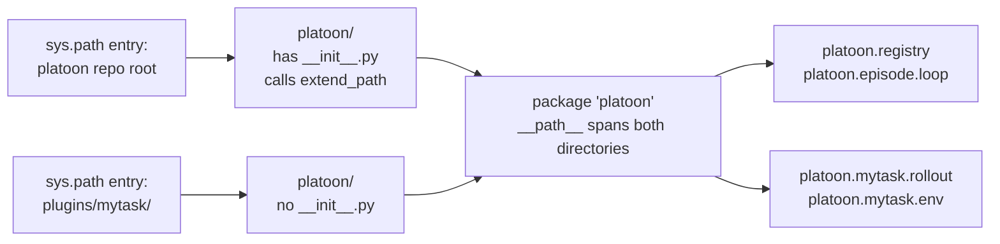

# Packaging a plugin

A Platoon plugin is an ordinary Python distribution that installs one subpackage into the
`platoon` namespace. This page covers the parts that are pure packaging: the directory layout, the
`pyproject.toml` that makes `uv` resolve it, the entry-point table that advertises your components,
and how to install and verify the result. For the code that goes inside, see
[environment](environment.md), [agent](agent.md), [rollout](rollout.md) and
[dataset](dataset.md).

## The shape of a plugin

Every plugin in the repository has the same three-level structure:

```text
plugins/number-search/            # distribution directory  (hyphens)
├── pyproject.toml
├── uv.lock                       # each plugin is its own uv project
├── README.md
└── platoon/                      # namespace shim — NO __init__.py
    └── number_search/            # importable module      (underscores)
        ├── __init__.py
        ├── tasks.py
        ├── env.py
        ├── agent.py
        ├── rollout.py
        └── number_search_tinker.yaml
```

Three different names are in play and they are allowed to differ:

| Name | Example | Where it appears |
| --- | --- | --- |
| Directory | `plugins/number-search` | the repo tree only |
| Distribution | `platoon-number-search` | `[project] name`, `uv pip list` |
| Import path | `platoon.number_search` | every `import`, every config value |

Hyphens are fine in the first two; the import path must be a legal Python identifier, so it uses
underscores.

## How the namespace merge works

Core Platoon and every plugin ship a top-level directory called `platoon/`. They merge into one
importable package because of three lines at the top of the core package —
<span class="pl-src">platoon/\_\_init\_\_.py</span>:

```python title="platoon/__init__.py"
from pkgutil import extend_path

__path__ = extend_path(__path__, __name__)
```

`extend_path` rescans `sys.path` for every directory named `platoon` and appends each one to the
package's `__path__`. The core repo puts its `platoon/` on the path, each installed plugin puts its
own `plugins/<name>/platoon/` on the path, and afterwards `import platoon.number_search` resolves
even though `platoon.registry` lives in a different checkout on disk.



Both directories reach `sys.path` the same way: `uv sync` installs the project it is run in, and
`[tool.uv.sources]` pulls core Platoon in as an editable path dependency. Editable installs expose
the project's own source directory, which is exactly what `extend_path` needs to see.

!!! warning "Never create `plugins/<name>/platoon/__init__.py`"
    The merge works because the plugin's `platoon/` directory contributes *contents*, not an
    identity. If a plugin ships its own `platoon/__init__.py`, whichever copy wins the import race
    defines the package, `extend_path` never runs for the other trees, and imports of unrelated
    plugins start failing. Verified across the tree: none of the nine plugins has a file at
    `plugins/*/platoon/__init__.py`.

    The `__init__.py` one level deeper — `plugins/<name>/platoon/<module>/__init__.py` — is
    required and normal. It may be empty (`number_search`) or a re-export surface (`textcraft`).

A related consequence: directories *inside* your module do not need `__init__.py` either. The
`configs/`, `train_scripts/` and `inference_scripts/` trees under
`plugins/textcraft/platoon/textcraft/` contain no `__init__.py`, and
`python -m platoon.textcraft.train_scripts.tinker.train_tinker` still works, because they are
PEP 420 namespace portions.

## Recommended file layout

Nothing in Platoon enforces file names — the registry resolves dotted import paths, so it does not
care where a function lives. The convention below is what `number-search` and `textcraft` follow,
and following it makes your plugin legible to anyone who has read another one.

```text
plugins/mytask/
├── pyproject.toml
├── README.md                     # install + train commands, dataset paths
└── platoon/
    └── mytask/
        ├── __init__.py
        ├── tasks.py              # dataset generation, get_task(id) -> Task, get_task_ids()
        ├── env.py                # Env subclass: action space + evaluate() -> (reward, misc)
        ├── agent.py              # prompt builder / agent subclass
        ├── rollout.py            # async run_rollout(task, RolloutConfig) -> dict
        ├── registry.py           # @register_* calls, imported for side effects
        ├── configs/
        │   ├── areal/mytask_areal.yaml
        │   └── tinker/mytask_tinker.yaml
        ├── train_scripts/        # optional; only if you need bespoke wiring
        │   ├── areal/train_areal.py
        │   └── tinker/train_tinker.py
        └── inference_scripts/    # optional; benchmark / eval drivers
            └── run_inference.py
```

`configs/{areal,tinker,inference}` plus `train_scripts/{areal,tinker}` and `inference_scripts/` is
the layout used by `appworld`, `deepdive`, `email-search`, `oolong`, `openreward` and `textcraft`.
`number-search` and `codegrep` are older and flatter: their YAML and train scripts sit directly in
the module directory. Either works; the nested one scales better once you have more than a couple
of configs.

Two more notes on this layout:

- **`registry.py` is what makes `train_scripts/` optional.** Register your components there and the
  shared entrypoints `python -m platoon.train.areal.train` and
  `python -m platoon.train.tinker.train` can drive your plugin from YAML alone. See
  [the registry](../architecture/registry.md) for the mechanism and [rollout](rollout.md) for the
  contracts. Today only `textcraft` ships a `registry.py`; the other eight plugins still ship
  bespoke train scripts.
- **Data files sit next to the code.** `number-search` ships `number_search_train.jsonl` and
  `number_search_val.jsonl` inside the module directory, and its loaders read them relative to
  `__file__`. Because `[tool.hatch.build.targets.wheel] packages = ["platoon"]` ships the whole
  subtree, they travel with the wheel.

## The `pyproject.toml`, section by section

The reference is <span class="pl-src">plugins/textcraft/pyproject.toml</span> — the only plugin
that uses every section discussed here. Each block below is copied from it.

### Project metadata

```toml title="plugins/textcraft/pyproject.toml"
[project]
name = "platoon-textcraft"
version = "0.1.0"
description = "Platoon plugin for the textcraft environment."
requires-python = "~=3.12.0"
authors = [
    {name = "Apurva Gandhi", email = "apurvag@cs.cmu.edu"}
]
dependencies = [
    "platoon >= 0.1.0",
]
```

`requires-python = "~=3.12.0"` is not optional. The root project pins the same range
(<span class="pl-src">pyproject.toml</span>), every plugin repeats it, and the lockfiles are
resolved for `3.12.*` only. A plugin that widens the range resolves against a Python nothing else
in the repo agrees with.

The dependency on `platoon` is by name, not by path. The path comes later, from
`[tool.uv.sources]`; keeping them separate means the distribution stays publishable while local
development uses the working tree. Add your own runtime dependencies to this list — `deepdive` adds
`tavily-python>=0.7.23`, `oolong` and `email-search` add `datasets >= 2.0.0`, and both `codegrep`
and `openreward` depend on another plugin, `platoon-openhands >= 0.1.0`.

### The entry-point table

```toml title="plugins/textcraft/pyproject.toml"
[project.entry-points."platoon.plugins"]
textcraft = "platoon.textcraft.registry"
```

This is the whole of plugin auto-discovery. `discover_entry_points`
(<span class="pl-src">platoon/registry.py</span>) iterates
`importlib.metadata.entry_points(group="platoon.plugins")` and calls `entry_point.load()` on each:

```python title="platoon/registry.py"
def discover_entry_points(group: str = "platoon.plugins") -> list[str]:
    """Import plugin registration modules advertised through package entry points."""

    loaded: list[str] = []
    for entry_point in entry_points(group=group):
        entry_point.load()
        loaded.append(entry_point.name)
    return loaded
```

Point it at **your registration module** — the one whose import runs the `@register_*` decorators,
conventionally `platoon.<module>.registry`. Write it as a bare module path with **no `:attr`
suffix**: `entry_point.load()` then imports the module and returns it, and the registrations happen
as a side effect of that import. The key on the left (`textcraft`) is only a label; it appears in
the list `discover_entry_points` returns and nowhere else.

!!! note "Entry points are opt-in at run time"
    Declaring the entry point does not make it fire. `AutoEnvironment.load` calls
    `discover_entry_points()` only when the config sets
    `environments[0].discover_entry_points: true` (<span class="pl-src">platoon/train/auto.py</span>);
    the default is `false`. The alternative — and the one the only live registry config uses — is
    `environments[0].package: platoon.mytask.registry`, which imports exactly that one module. Use
    `package` for a single-environment run; turn on discovery only when several installed plugins
    must register at once. Note also that `entry_point.load()` is unguarded, so one broken plugin
    on the path aborts discovery for the whole run.

`textcraft` is currently the only plugin in the repository with an entry-point table.

### Backend extras

```toml title="plugins/textcraft/pyproject.toml"
[project.optional-dependencies]
# Training backends - install one of these for training
tinker = [
    "platoon[tinker]",
]
# NOTE: areal backend requires uv for installation (not available on PyPI)
areal = [
    "platoon[areal]",
    "nvidia-cuda-runtime-cu12==12.9.79; sys_platform == 'linux' and platform_machine == 'x86_64'",
    "nvidia-cublas-cu12==12.9.1.4; sys_platform == 'linux' and platform_machine == 'x86_64'",
    "nvidia-cuda-nvrtc-cu12==12.9.86; sys_platform == 'linux' and platform_machine == 'x86_64'",
    "nvidia-cusparse-cu12==12.5.10.65; sys_platform == 'linux' and platform_machine == 'x86_64'",
    "nvidia-nvjitlink-cu12==12.9.86; sys_platform == 'linux' and platform_machine == 'x86_64'",
]
```

The extras exist so that `uv sync --extra areal` inside your plugin directory means the same thing
it means at the repo root. They are thin re-exports of the root extras: `platoon[tinker]` pulls
`tinker==0.16.1` plus the pinned `tinker-cookbook`, and `platoon[areal]` pulls `areal[cuda]` and
`flash-attn==2.8.3` on Linux x86_64 (<span class="pl-src">pyproject.toml</span>).

Add lines of your own here only if your plugin needs something the root extra does not provide. The
five `nvidia-*-cu12` pins above are textcraft-specific; `number-search`, `codegrep`, `appworld`,
`deepdive`, `oolong` and `email-search` all declare the two-line minimal version.

### `[tool.uv] conflicts`

```toml title="plugins/textcraft/pyproject.toml"
[tool.uv]
# tinker and areal backends are mutually exclusive
conflicts = [
    [
        { extra = "tinker" },
        { extra = "areal" },
    ],
]
```

The two backends resolve incompatible torch builds from different indexes, so they cannot be
installed together. Declaring the conflict is what lets a single `uv.lock` carry both resolutions
as separate forks instead of having to satisfy both at once. This block is copied verbatim into
every plugin except `openhands`, which declares no extras at all.

### `[tool.uv] override-dependencies` — and why you must repeat it

```toml title="plugins/textcraft/pyproject.toml"
override-dependencies = [
    # Mirror AReaL HEAD's own override-dependencies; uv only honours overrides from the
    # root project, so each lockable project must re-declare them. Plain pins (fastapi,
    # datasets, wandb, ...) live in platoon's [project.dependencies] and arrive transitively.
    "openai>=2.8.0",
    "soundfile>=0.12.1,<0.13.0",
    ...
    "nvidia-resiliency-ext; sys_platform == 'never'",
]
no-build-isolation-package = ["flash-attn", "causal-conv1d", "mamba-ssm"]
```

This is the single most-copied block in the repository, and the comment explains why: **uv only
honours `override-dependencies` declared by the root project of a resolution.** Each plugin is its
own uv project with its own `uv.lock` — there is no `[tool.uv.workspace]` anywhere in the repo — so
when you run `uv sync` inside `plugins/mytask`, *your* `pyproject.toml` is the root. Platoon's
overrides and AReaL's overrides are both invisible from there.

Omit the block and resolution fails on the exact pins it exists to break: litellm needs
`openai>=2.8.0` while SGLang 0.5.10.post1 pins `2.6.1`, AReaL needs `torchao>=0.15.0` while SGLang
pins `0.9.0`, AReaL pins `networkx==3.3.0` while `ai-rubric` wants `>=3.5.0`, and the CUDA-only
Megatron dependencies (`transformer-engine`, `nv-grouped-gemm`, `mamba-ssm`, `causal-conv1d`,
`nvidia-resiliency-ext`) have no buildable wheels on the target machines and are excluded with the
`sys_platform == 'never'` marker.

Copy all fifteen entries verbatim from the `override-dependencies` block in
[`plugins/number-search/pyproject.toml`](https://github.com/ApGa/platoon/blob/main/plugins/number-search/pyproject.toml),
then append plugin-specific overrides at the end. Real examples of that tail:

| Plugin | Extra override | Reason |
| --- | --- | --- |
| `appworld` | `numpy<2.3` | numba requires NumPy 2.2 or older |
| `codegrep` | `rich==14.3.1` | openhands-tools' browser-use needs rich 14 or newer |
| `openreward` | four `openhands-*==1.29.0` pins plus `rich==14.3.1` | force the ApGa SDK fork |

`no-build-isolation-package` belongs to the same `[tool.uv]` table. It makes `flash-attn`,
`causal-conv1d` and `mamba-ssm` build against the venv's torch instead of pulling a mismatched one
into an isolated build environment.

!!! warning "A misplaced uv key fails silently"
    <span class="pl-src">plugins/openhands/pyproject.toml</span> has a
    `no-build-isolation-package` key sitting in the `[project]` table, where uv does not look for
    it; the effective declaration is the duplicate under `[tool.uv]`. A misplaced key like this
    produces no error — only a build that behaves differently than you expect. Keep every uv key
    under `[tool.uv]`.

### `[tool.uv.sources]` — the editable path

```toml title="plugins/textcraft/pyproject.toml"
[tool.uv.sources]
platoon = { path = "../..", editable = true }
```

This turns the `"platoon >= 0.1.0"` requirement into "the checkout two directories up, installed
editable". Editable matters twice over: your edits to core Platoon take effect without a reinstall,
and the editable install is what exposes the core `platoon/` directory where `extend_path` can
find it.

`../..` is correct for a plugin at `plugins/<name>/`. A plugin that depends on another plugin adds
a second line — <span class="pl-src">plugins/codegrep/pyproject.toml</span>:

```toml title="plugins/codegrep/pyproject.toml"
[tool.uv.sources]
platoon = { path = "../..", editable = true }
platoon-openhands = { path = "../openhands", editable = true }
```

Git sources go here too, not in `[project] dependencies`. `appworld` names its upstream in
`dependencies` as a bare `"appworld"` and pins the revision here
(<span class="pl-src">plugins/appworld/pyproject.toml</span>):

```toml title="plugins/appworld/pyproject.toml"
appworld = { git = "https://github.com/StonyBrookNLP/appworld.git", rev = "58d1c7807a3dd2870f45da716f572909a0d33511", lfs = true }
```

Keeping URLs out of `[project]` is why no plugin needs
`[tool.hatch.metadata] allow-direct-references = true`. Only the root project declares that
(<span class="pl-src">pyproject.toml</span>), because its `tinker` extra carries a
`git+https://` URL directly in `[project.optional-dependencies]`.

### Build backend

```toml title="plugins/textcraft/pyproject.toml"
[build-system]
requires = ["hatchling"]
build-backend = "hatchling.build"


[tool.hatch.build.targets.wheel]
packages = ["platoon"]
```

`packages = ["platoon"]` is the line that makes the namespace layout build. Hatchling otherwise
infers the package to ship from the distribution name — it would look for `platoon_textcraft` and
find nothing. With it, the wheel contains `platoon/<module>/...` and nothing else: exactly the
subtree that should merge into the namespace. Every project in the repository, root included,
declares this same one-line target.

`[tool.ruff] line-length` and `[tool.ruff.lint] select = ["E", "F", "I"]` round out the file. Most
plugins use 120; `deepdive`, `oolong` and `email-search` use 100.

## A complete `pyproject.toml` for a new plugin

Copy this into `plugins/mytask/pyproject.toml` and change the `mytask` strings. It is
`plugins/number-search/pyproject.toml` with the entry-point table from
`plugins/textcraft/pyproject.toml` added; the override block is verbatim from both.

```toml title="plugins/mytask/pyproject.toml"
[project]
name = "platoon-mytask"
version = "0.1.0"
description = "Platoon plugin for the mytask environment."
requires-python = "~=3.12.0"
authors = [
    {name = "Your Name", email = "you@example.com"}
]
dependencies = [
    "platoon >= 0.1.0",
]

[project.entry-points."platoon.plugins"]
mytask = "platoon.mytask.registry"

[project.optional-dependencies]
# Training backends - install one of these for training
tinker = [
    "platoon[tinker]",
]
# NOTE: areal backend requires uv for installation (not available on PyPI)
areal = [
    "platoon[areal]",
]
# uv-specific configuration
[tool.uv]
# tinker and areal backends are mutually exclusive
conflicts = [
    [
        { extra = "tinker" },
        { extra = "areal" },
    ],
]
override-dependencies = [
    # Mirror AReaL HEAD's own override-dependencies; uv only honours overrides from the
    # root project, so each lockable project must re-declare them. Plain pins (fastapi,
    # datasets, wandb, ...) live in platoon's [project.dependencies] and arrive transitively.
    "openai>=2.8.0",
    "soundfile>=0.12.1,<0.13.0",
    "torchao==0.15.0",
    "flash-attn-4>=4.0.0b4",
    "transformers>=5.0.0,<=5.3.0",
    "nvidia-cudnn-cu12==9.16.0.29; sys_platform == 'linux' and platform_machine == 'x86_64'",
    "networkx==3.3.0",  # areal pins 3.3 but ai-rubric needs >=3.5.0; force areal's pin.
    "megatron-core==0.17.0; sys_platform == 'linux' and platform_machine == 'x86_64'",
    "hydra-core==1.4.0.dev1",
    "timm==1.0.16",
    # Optional CUDA-only megatron deps excluded from resolution by AReaL; mirror
    # that. The Megatron backend needs Transformer Engine at runtime, but TE's
    # torch bindings are sdist-only and don't build on the compute nodes (no CUDA
    # toolkit / ninja), which would break `uv sync` for FSDP too; provide TE via
    # the container for Megatron. FSDP runs don't need TE (lazy import).
    "transformer-engine; sys_platform == 'never'",
    "nv-grouped-gemm; sys_platform == 'never'",
    "mamba-ssm; sys_platform == 'never'",
    "causal-conv1d; sys_platform == 'never'",
    "nvidia-resiliency-ext; sys_platform == 'never'",
]
no-build-isolation-package = ["flash-attn", "causal-conv1d", "mamba-ssm"]

[tool.uv.sources]
platoon = { path = "../..", editable = true }

[tool.ruff]
line-length = 120

[tool.ruff.lint]
select = ["E", "F", "I"]

[build-system]
requires = ["hatchling"]
build-backend = "hatchling.build"


[tool.hatch.build.targets.wheel]
packages = ["platoon"]
```

Drop the `[project.entry-points."platoon.plugins"]` block if your plugin has no `registry.py` yet;
you can add it later without touching anything else.

## Install and verify

Each plugin gets its own virtual environment in its own directory. Pick exactly one backend extra —
`tinker` and `areal` are declared as conflicting and cannot both be installed.

=== "Tinker"

    ```bash
    cd plugins/mytask
    uv sync --extra tinker      # creates plugins/mytask/.venv
    ```

=== "AReaL"

    ```bash
    cd plugins/mytask
    uv sync --extra areal       # creates plugins/mytask/.venv
    ```

`uv sync` writes `plugins/mytask/uv.lock` on first run. Commit it — every other plugin does, and it
is what makes a resolution reproducible once the override block has done its work. Because the
plugin project itself is installed into that venv, run everything below with `uv run` from inside
the plugin directory.

Then check the four things that can each be independently broken.

**1. The namespace merge.** Both of these must resolve, and they must print paths in two different
directories:

```bash
uv run python -c "import platoon.registry as m; print(m.__file__)"
uv run python -c "import platoon.mytask as m; print(m.__file__)"
```

If the second raises `ModuleNotFoundError`, the usual causes are a stray
`plugins/mytask/platoon/__init__.py`, a missing
`[tool.hatch.build.targets.wheel] packages = ["platoon"]`, or a module directory whose name is not
a valid Python identifier.

**2. Your own modules import cleanly.** A registration module imports your rollout, env and tasks at
module scope, so this catches most wiring mistakes before a trainer starts:

```bash
uv run python -c "import platoon.mytask.registry"
```

**3. The entry point is visible.** This reads installed distribution metadata, so it fails if the
plugin itself was not installed into the venv:

```bash
uv run python -c "from importlib.metadata import entry_points; \
print([(e.name, e.value) for e in entry_points(group='platoon.plugins')])"
```

Expect `[('mytask', 'platoon.mytask.registry')]`.

**4. The registrations landed.** `Registry.names()` lists what a kind holds:

```bash
uv run python -c "from platoon.registry import discover_entry_points, get_registry; \
print(discover_entry_points()); \
print({k: get_registry(k).names() for k in ('task_loader', 'dataset_loader', 'rollout')})"
```

Nothing you have not imported will appear — the registries are process-local module state
(<span class="pl-src">platoon/registry.py</span>), populated purely by import side effects.

Once those pass, point a config at your components and run the shared trainer. The minimal
`environments:` block names the module to import and one registered name per component, in the
shape of the only live example in the repo
(<span class="pl-src">plugins/textcraft/platoon/textcraft/configs/tinker/textcraft_synth_depth_aware_tinker.yaml</span>):

```yaml title="plugins/mytask/platoon/mytask/configs/tinker/mytask_tinker.yaml"
environments:
  - package: platoon.mytask.registry
    dataset_loader: mytask/default
    eval_dataset_loader: mytask/default
    task_loader: mytask/default
    rollout: mytask/default
    reward_processor: mytask/success
    workflow: group_rollout
```

=== "Tinker"

    ```bash
    uv run python -m platoon.train.tinker.train \
      --config platoon/mytask/configs/tinker/mytask_tinker.yaml
    ```

=== "AReaL"

    ```bash
    uv run python -m platoon.train.areal.train \
      --config platoon/mytask/configs/areal/mytask_areal.yaml
    ```

The rest of those configs — the `train:`, `eval:` and backend blocks — is documented in the
[configuration reference](../reference/configuration.md); the `environments:` keys are documented
on [the registry](../architecture/registry.md). Be aware that the two backends parse CLI overrides
differently: the Tinker path takes `--dotted.key value`, the AReaL path takes bare `key=value` with
no leading dashes.

## Packaging gotchas

- **Name collisions between plugins are real.** Two installed plugins that register the same name
  under the same kind raise at import time, because `Registry.register` rejects duplicates unless
  `exist_ok=True` (<span class="pl-src">platoon/registry.py</span>). With
  `discover_entry_points: true` that crash happens before training starts. Namespace your registry
  names as `"<plugin>/<variant>"`, the way textcraft does.
- **Make optional registrations defensive.** `textcraft`'s registry module wraps its trainer-config
  registrations in `try: ... except Exception: pass`
  (<span class="pl-src">plugins/textcraft/platoon/textcraft/registry.py</span>) so that
  importing it does not require both training backends to be installed. Do the same for anything
  that reaches into a backend you did not make mandatory.
- **A plugin's lock is not the root's lock.** Editing the root `pyproject.toml` does not re-resolve
  any plugin. After changing shared dependencies, re-run `uv sync` in each plugin directory you
  care about.
- **One `.venv` per plugin directory.** Tooling that expects a single repo-level environment looks
  in the wrong place. `uv run` from inside the plugin directory is the reliable invocation.
- **Callables you register must be importable module-level names.** The AReaL backend ships
  workflows to remote workers as dotted import paths rather than pickles, and `infer_import_path`
  returns `None` for anything defined under `<locals>` or in `__main__`
  (<span class="pl-src">platoon/registry.py</span>). A `functools.partial`, a closure or a
  lambda registered as a rollout or task loader will fail there. That constrains where in your
  package a registered function may live, so it is worth knowing before you lay out the files.
- **The `areal` extra needs uv, not pip.** `areal` comes from a git revision pin in the root
  `[tool.uv.sources]` (<span class="pl-src">pyproject.toml</span>), which pip does not read.
  The comment above the extra says so; `uv sync` is the only supported install path.

## See also

- [Plugin anatomy](../walkthroughs/plugin-anatomy.md) — a file-by-file read of a real plugin.
- [Build a plugin](../tutorials/build-a-plugin.md) — the same material as a guided build.
- [The registry](../architecture/registry.md) — how `package`, entry points and dotted import paths
  resolve into components.
- [Installation](../get-started/installation.md) — backend extras, Transformer Engine, and the
  Python version constraint.
- [Plugin reference](../reference/plugins.md) — what each shipped plugin provides.
