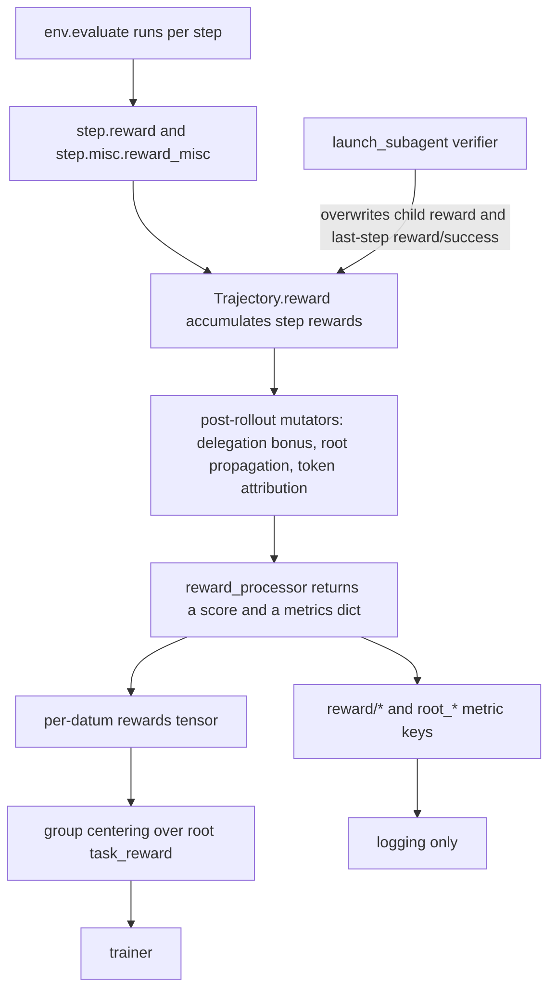

# Custom rewards

A reward in Platoon is not one number produced in one place. It is assembled from several layers
that each run at a different time and see a different slice of the rollout. This page maps every
place a reward can enter, gives the exact contract for the two you will write most often — the
environment's `evaluate()` and a registered `reward_processor` — and then covers judge-based
rewards, metrics, and the ways reward design goes wrong here.

If you have not yet seen how a rollout produces a *tree* of trajectories, read
[agents and environments](../architecture/agents-envs.md) and
[sub-agents](../architecture/subagents.md) first.

## The six entry points

| # | Entry point | Where it runs | What it can see | What it expresses |
| --- | --- | --- | --- | --- |
| 1 | `evaluate()` on your env | Inside `env.step`, on **every** step | Live environment state, `finish_message`, observation history | The task score plus arbitrary diagnostics |
| 2 | `step.reward` | Same call as (1) | Same as (1) | A dense per-step scalar accumulated into `Trajectory.reward` |
| 3 | `reward_misc` keys on a step | Same call as (1), plus post-rollout mutators | Same as (1) | Named reward components carried to the trainer |
| 4 | A registered `reward_processor` | In the trainer, once per trajectory, after the rollout | One whole serialized trajectory dict | The final scalar plus every metric key |
| 5 | Sub-agent verifier and behavior gate | Inside `launch_subagent`, before it returns to the parent | The finished child trajectory, and live env state via a forked verifier | A judged score that **overwrites** the child's reward |
| 6 | Post-rollout mutators and penalties | Between the rollout and the reward processor | The whole trajectory collection at once | Delegation bonuses, root propagation, token-cost penalties |

Roughly: reach for (1) to answer "did the agent do the task"; (3) for anything you want to see in
W&B; (4) for anything that needs the whole trajectory or the tree; (5) when a delegated subtask has
no programmatic grader; (6) for cross-trajectory credit assignment.



## 1-3. The environment: `evaluate()`, `step.reward`, `reward_misc`

`evaluate()` is **not** part of the `Env` protocol. `Env`
(<span class="pl-src">platoon/envs/base.py</span>) requires only `reset`, `step`, `close`,
`observe` and a `task` property. `evaluate()` is a convention of the two base environments in the
repo — `CodeActEnv` (<span class="pl-src">platoon/envs/codeact/env.py</span>) and the OpenHands
env (<span class="pl-src">plugins/openhands/platoon/openhands/env.py</span>) — both of which
default to returning `0.0, {}`:

```python title="platoon/envs/codeact/env.py"
    async def evaluate(self) -> tuple[float, dict]:
        return 0.0, {}
```

Both call it from inside `step`, on every step, and wire the result into the trajectory:

```python title="platoon/envs/codeact/env.py"
            step.thought = action.parsed_thought
            step.reward, reward_info = await self.evaluate()
            step.misc["action_misc"] = action.misc
            step.misc["reward_misc"] = reward_info
            self._state.reward += step.reward
            self._state.history.append(step)

            traj_collection = current_trajectory_collection.get()
            traj_collection.add_trajectory_step(traj.id, self._state.history[-1])
            if self._state.finished:
                traj.reward = self._state.reward
```

Three consequences follow, and each one catches people.

**`evaluate()` runs on every step, not at episode end.** If scoring is expensive — an LLM judge, a
container round-trip, a rubric evaluation — you must gate it yourself. Every environment in the repo
checks `self._state.finished` first and only scores on the terminal step:

```python title="plugins/textcraft/platoon/textcraft/env.py"
        # Only give reward if agent explicitly called finish()
        if self._state.finished:
            finish_msg = finish_message.get()
```

**The scalar goes to `step.reward`, the components go to `step.misc["reward_misc"]`.** The float is
accumulated into `Trajectory.reward` by `Trajectory.add_step`
(<span class="pl-src">platoon/episode/trajectory.py</span>), which reads
`getattr(step, "reward", None)`. The base `TrajectoryStep` dataclass has only a `misc` field — the
`reward` field lives on the concrete subclasses `CodeActStep`
(<span class="pl-src">platoon/envs/codeact/types.py</span>) and `OpenHandsTrajectoryStep`. If you
write a step type from scratch and want a per-step reward channel, give it `reward: float = 0.0`.

**The `reward/` prefix is the load-bearing convention.** Keys that start with `reward/` are the ones
downstream code looks for; everything else is free-form diagnostics that stays in the event log and
the rollout dump. TextCraft's evaluator shows the split — human diagnostics under plain names, the
trainable component under `reward/success`:

```python title="plugins/textcraft/platoon/textcraft/env.py"
                if all_met:
                    score = 1.0
                    reward_misc["success"] = True
                    reward_misc["target_items"] = target_items
                    reward_misc["initial_inventory"] = dict(self._initial_inventory)
                    reward_misc["final_inventory"] = dict(inventory)
...
        reward_misc["reward/success"] = score
        return score, reward_misc
```

Keep that split. A reward processor that forwards `reward/*` keys to the AReaL trainer converts each
value with `torch.tensor(value)`
(<span class="pl-src">platoon/utils/areal_data_processing.py</span>), so a dict, list or string
under a `reward/` key crashes the conversion. Non-`reward/` names are never touched.

### The three names other code actually reads

Only three key names are read by code outside your plugin. Everything else is yours to name.

| Key | Written by | Read by |
| --- | --- | --- |
| `reward/success` | your `evaluate()`; overwritten by the verifier and by `propagate_root_success` | `_get_base_success` (<span class="pl-src">platoon/utils/subagent_rewards.py</span>), every plugin's child-success snapshot, most reward processors |
| `reward/subagent_launched` | recursive envs, per step | `propagate_root_success` (<span class="pl-src">platoon/utils/subagent_rewards.py</span>), TextCraft's reward processor |
| `reward/subagent_succeeded` | recursive envs, per step | the same two |

Recursive environments produce the last two by counting the direct children created during the step
and reading each child's final `reward/success`:

```python title="plugins/textcraft/platoon/textcraft/env.py"
    async def evaluate(self) -> Tuple[float, dict]:
        score, reward_misc = await super().evaluate()

        launched, success_total = self._get_subagent_stats_and_reset()
        reward_misc["reward/subagent_launched"] = launched
        reward_misc["reward/subagent_succeeded"] = success_total

        return score, reward_misc
```

The same idiom appears in Oolong, DeepDive, AppWorld and email-search. It is strictly per step: the
executor's `launch_subagent` wrapper records new child trajectory ids whose `parent_info.id` is the
current trajectory, and `evaluate()` drains and resets that counter. The executor side is covered in
[custom environment](environment.md).

!!! warning "`skip_subagent_reward_computation` detects children by heuristic"
    `RolloutConfig.skip_subagent_reward_computation` (default `False`) tells an env to return 0 for
    sub-agent tasks instead of running an expensive grader. There is no core implementation — each
    plugin decides what counts as a sub-agent task, and they disagree. TextCraft and Oolong use a
    substring test on the task id (`"textcraft" not in (self._task.id or "")`,
    <span class="pl-src">plugins/textcraft/platoon/textcraft/env.py</span>); AppWorld checks
    `isinstance(task, SubTask) and task.parent_tasks`. The substring versions break the moment your
    task ids change shape. Prefer the `SubTask` check in new code.

## 4. The `reward_processor` contract

A reward processor collapses one finished trajectory into the scalar that trains it plus a dict of
metric keys. It is the last place a reward can change, and the only place that sees a whole
trajectory at once.

```python title="platoon/train/components.py"
RewardProcessor = Callable[[dict[str, Any]], tuple[float, dict[str, Any]]]
```

The argument is one *serialized* trajectory — the `Trajectory` dataclass
(<span class="pl-src">platoon/episode/trajectory.py</span>) run through `_to_jsonable`, so plain
dicts with the keys `id`, `task`, `parent_info`, `steps`, `reward`, `finish_message`,
`error_message`, `misc`. Each step is a dict whose only guaranteed key is `misc`.

Selecting one is registry wiring — the **top-level** `environments:` list of `EnvironmentConfig`:

```yaml title="plugins/textcraft/platoon/textcraft/configs/tinker/textcraft_synth_depth_aware_tinker.yaml"
environments:
  - package: platoon.textcraft.registry
    trainer_config: textcraft/synth/tinker
    dataset_loader: textcraft/synth
    eval_dataset_loader: textcraft/synth
    task_loader: textcraft/synth
    rollout: textcraft/synth/depth_aware
    reward_processor: textcraft/synth/delegation_capped
    workflow: group_rollout
```

`AutoRewardProcessor` (<span class="pl-src">platoon/train/auto.py</span>) resolves the string as a
registered name if one matches and otherwise as a dotted import path, so registering is optional.
When the key is absent you get `lambda traj: (traj["reward"], {})` — the trajectory's accumulated
step rewards, and no metrics at all.

!!! note "This is not the openreward env-mixture `environments:`"
    OpenReward configs also carry an `openreward.environments:` list whose entries have `label`,
    `env_name`, `session_url` and `sampling_weight`
    (<span class="pl-src">plugins/openreward/platoon/openreward/config_defs.py</span>). That is a
    weighted mixture of task environments and is unrelated to the registry block above.

### The worked example: TextCraft's delegation-capped processor

This is the only registered reward processor in the repo, and it is the clearest demonstration of
the `reward/` convention:

```python title="plugins/textcraft/platoon/textcraft/registry.py"
_TEXTCRAFT_SYNTH_DELEGATION_REWARD_CAP = 0.0

...

@register_reward_processor("textcraft/synth/delegation_capped")
def synth_reward_processor(traj: dict[str, Any]) -> tuple[float, dict[str, float]]:
    rewards_dict: dict[str, float] = {}
    for step in traj["steps"]:
        reward_misc = step.get("misc", {}).get("reward_misc", {})
        for reward_key, reward_value in reward_misc.items():
            if reward_key.startswith("reward/"):
                rewards_dict[reward_key] = rewards_dict.get(reward_key, 0.0) + float(reward_value)

    success_reward = rewards_dict.get("reward/success", 0.0)
    score = success_reward
    launched = rewards_dict.get("reward/subagent_launched", 0.0)
    if launched > 0:
        subagent_success_rate = rewards_dict.get("reward/subagent_succeeded", 0.0) / launched
        score += _TEXTCRAFT_SYNTH_DELEGATION_REWARD_CAP * subagent_success_rate
    if not rewards_dict:
        score = float(traj.get("reward", 0.0))
    return score, rewards_dict
```

Four design decisions are packed into twenty lines.

**It sums `reward/*` across steps rather than reading the last one.** That is correct here because
TextCraft's `evaluate()` returns a non-zero `reward/success` only on the terminal step, and the
per-step delegation counters are drained after each read, so each contributes exactly once. If your
`evaluate()` reports a running score on every step, summing double-counts — read the last step
instead.

**The delegation term is a capped rate, not a sum.**
`reward/subagent_succeeded / reward/subagent_launched` is the fraction of this trajectory's direct
children that succeeded, and the cap bounds how much of the total reward delegation can ever
contribute — you cannot buy reward by launching more children. The cap is currently `0.0`, so the
shipped processor is exactly "root success". That is a deliberate way to ship a knob you have not
yet tuned: the plumbing and the metrics are live, the reward contribution is off.

**It falls back to `traj["reward"]` only when no `reward/*` key was found at all.** That covers
trajectories from an environment that never adopted the convention, and keeps the processor safe to
point at any rollout.

**The counters it depends on come from the environment, not from core code.** TextCraft's
depth-aware rollout calls only `propagate_root_success`
(<span class="pl-src">plugins/textcraft/platoon/textcraft/synth_rollout.py</span>); it never
calls `add_direct_subagent_delegation_rewards`. Copy this processor into a plugin whose env does not
emit `reward/subagent_launched` and the delegation term is silently and permanently zero.

OpenReward's processor (<span class="pl-src">plugins/openreward/platoon/openreward/rewards.py</span>)
is the tree-aware variant. It prefers the verifier's judgment over the environment score, adds the
delegation bonus computed post-rollout, and subtracts the token-efficiency penalty:

```python title="plugins/openreward/platoon/openreward/rewards.py"
    openreward_score = float(traj.get("reward", 0.0))
    judgment_score = _judgment_score(traj)
    base_reward = judgment_score if judgment_score is not None else openreward_score
...
    pre_efficiency_reward = base_reward + delegation_bonus
    efficiency_metrics = trajectory_token_efficiency_metrics(traj)
    efficiency_penalty = efficiency_metrics.get(TOKEN_EFFICIENCY_PENALTY_REWARD_KEY, 0.0)
    rewards_dict.update(efficiency_metrics)
    reward = pre_efficiency_reward - efficiency_penalty
```

It also emits `reward/subagent_launched` and `reward/subagent_succeeded` unconditionally, with a
comment explaining why: "These are semantic zeros for trajectories that did not delegate, not
missing observations." Uniform keys across siblings sidestep the harmonization machinery described
under [Metrics](#metrics-and-what-lands-in-wb).

### Where it is called, and how often

Both backends call the processor once per trajectory in the collection, skipping trajectories marked
`exclude_from_training` — that is, verifier branches.

=== "AReaL"

    `get_train_data_for_trajectory` calls it per trajectory
    (<span class="pl-src">platoon/utils/areal_data_processing.py</span>), and then
    `get_train_data_for_trajectory_collection` calls it **a second time on the root** to build
    `task_reward` and the `root_*` keys:

    ```python title="platoon/utils/areal_data_processing.py"
    train_data = harmonize_optional_reward_metrics(train_data)
    root_trajectory = next(iter(trajectories.values()))
    root_reward, root_rewards_dict = reward_processor(root_trajectory)
    ```

    Your processor must therefore be a pure function of its argument. One that mutates the
    trajectory it is handed, or draws randomness, produces a `task_reward` that disagrees with the
    root's own per-datum reward — and `task_reward` is what the group baseline is computed from.

=== "Tinker"

    The processor is called exactly once per trajectory, and every trajectory's reward is processed
    **before** any datum sampling
    (<span class="pl-src">platoon/utils/tinker_data_processing.py</span>), so a recursive
    processor always sees the complete tree regardless of which child datums survive the Bernoulli
    draw. The root's `(reward, dict)` becomes `task_reward` and `root_rewards_dict`.

!!! warning "AReaL: a lambda reward processor silently disappears on workers"
    AReaL ships the workflow to worker processes by *import path*, not by pickle.
    `callable_import_path` (<span class="pl-src">platoon/train/areal/workflow_serialization.py</span>)
    returns `None` for a lambda or an unnamed closure, and `to_workflow_kwargs` then omits the key
    entirely (<span class="pl-src">platoon/train/areal/workflows/group_rollout_workflow.py</span>),
    so the worker falls back to the default `lambda traj: (traj["reward"], {})`. No error is raised.
    Make an AReaL reward processor a module-level named function; registering it is the simplest way
    to guarantee that.

## 5. Judge-based rewards

Platoon has exactly one judging mechanism in core, plus a set of plugin-local LLM graders that share
no code with it. Keep the two apart.

### Core: the sub-agent reward verifier

This lives in <span class="pl-src">platoon/agents/actions/subagent.py</span> and applies **only to
sub-agent trajectories**, never to roots. When the `subagent_reward_judge_config` contextvar is set,
`launch_subagent` — after the child episode finishes and before returning the child's message to the
parent — forks a *verifier* sub-agent from the parent's environment, tells it not to trust the
child's summary, and demands a JSON verdict via `finish`
(<span class="pl-src">platoon/agents/actions/subagent.py</span>):

```python title="platoon/agents/actions/subagent.py"
        "Return only a JSON object via `finish` with this schema:\n"
        "{\n"
        '  "status": "one of: verified, partial, failed, insufficient_evidence",\n'
        '  "score": 0.0,\n'
        '  "summary": "short verdict",\n'
        '  "passed_claims": ["claim that was verified"],\n'
        '  "failed_claims": ["claim that failed verification"],\n'
        '  "evidence": ["tool-backed evidence you inspected"]\n'
        "}\n\n"
```

The verdict is normalized strictly. `score` must be a finite, non-bool float in `[0, 1]`, and status
and score must agree: `verified` implies `score > 0`, `partial` implies `0 < score < 1`, and
`failed` or `insufficient_evidence` imply `score == 0`. Any inconsistency zeroes the score and marks
the judgment untrainable. A verdict from a verifier that never called `finish` is untrainable too,
even when its text happens to parse.

`_record_judgment_reward` (<span class="pl-src">platoon/agents/actions/subagent.py</span>)
**overwrites** the child trajectory's `reward` and its last step's `reward_misc`:

```python title="platoon/agents/actions/subagent.py"
        reward_misc["reward/success"] = score
        reward_misc["reward/subagent_judgment"] = score
```

plus `reward/subagent_outcome_judgment` when an outcome verdict was recorded separately, and
`reward/subagent_behavior_gate` when a behavior gate ran. It also toggles
`exclude_from_policy_training` on the child according to whether the judgment is training-eligible.
Two properties matter for design. The pipeline **fails closed**: a `pending` judgment with score 0
and `exclude_from_policy_training` set is written *before* the verifier launches, so a rollout
cancelled mid-verification cannot leave a child looking like a valid positive target. And verifiers
are never themselves verified, which is what makes the recursion terminate.

You enable it from your rollout function by setting the contextvar around the episode:

```python title="plugins/openreward/platoon/openreward/rollout.py"
        subagent_reward_judge_config.set(
            SubagentRewardJudgeConfig(
                max_steps=openreward_config.subagent_reward_judge_max_steps,
                behavior_judge=behavior_judge,
            )
            if openreward_config.enable_subagent_reward_judging
            else None
        )
```

The verifier reuses *your* `ForkableAgent` and `ForkableEnv`, so nothing else is required — but your
`fork` should look at `task.misc["subagent_reward_verifier_task"]` and grant whatever inspection
tools verification needs. The verifier prompt itself is hard-coded; there is no config hook to
override it, and changing it today means patching `_format_verifier_goal`.

### Core: the behavior gate

`SubagentRewardJudgeConfig.behavior_judge` accepts anything satisfying this protocol:

```python title="platoon/agents/actions/subagent.py"
class SubagentBehaviorJudge(Protocol):
    async def judge(self, *, goal: str, trajectory: Trajectory) -> dict[str, Any]: ...
```

It answers a different question from the verifier: not "is the result correct" but "does this
trajectory deserve credit for the way it worked". It runs only when the outcome verdict is
training-eligible **and** scores above zero, so it costs nothing on failures. The returned dict must
pair `status` and `passed` exactly — `pass`/`True`, `fail`/`False`,
`insufficient_evidence`/`None` — and carry a non-empty `reason`. Combination is multiplicative:

| Behavior verdict | Combined status | Combined score | Trainable |
| --- | --- | --- | --- |
| `pass` | unchanged, e.g. `verified` | outcome score | yes |
| `fail` | `behavior_rejected` | `0.0` | yes — a real negative target |
| anything else | `behavior_judge_invalid` | `0.0` | no |

Exceptions raised inside `judge` are caught and converted into an ineligible `judge_error` verdict,
so a broken judge cannot fail a rollout.

### OpenReward-specific: `OpenRewardBehaviorJudge`

The only concrete behavior judge in the repo is
<span class="pl-src">plugins/openreward/platoon/openreward/behavior_judge.py</span>, and it is
**not** core: it is a shallow copy of the policy LLM being trained, with a strict five-key JSON
schema, a fail-closed `insufficient_evidence` record on every error path, and its own knobs under
the `openreward:` config section. The [OpenReward integration](../integrations/openreward.md) page
covers its prompt, its schema validation, and how a verdict becomes a reward; read it as the worked
example of this protocol rather than as the contract itself.

### Plugin-local rubric graders

Several plugins call an LLM entirely inside their own `evaluate()`. These are unrelated to the
sub-agent judging path above. Each one branches first on whether the task is the root or a
delegated goal, and the two branches usually do different things:

| Plugin | Root task | Sub-agent goal |
| --- | --- | --- |
| DeepDive | An LLM compares the final answer with `task.misc["ground_truth"]` | `RubricChecklistFast` over the rendered action history plus the final message |
| AppWorld | AppWorld's own success oracle — no LLM | `RubricChecklistFast`, same shape as DeepDive's |
| Oolong | The benchmark's own ported scorers in `eval_helpers.py` — no LLM | A system-prompt-plus-JSON grader |
| email-search | Exact normalized-string match, then an LLM judge when that fails | The same system-prompt-plus-JSON grader |

So "rubric grader" is not the same call in any two of them, and only email-search pays for an LLM
on every finished root episode. The checklist paths
(<span class="pl-src">plugins/deepdive/platoon/deepdive/env.py</span>,
<span class="pl-src">plugins/appworld/platoon/appworld/env.py</span>) build the checklist from the
goal itself, which is why they suit a delegated goal that has no ground truth attached.

`platoon/envs/codeact/rubrics.py` exposes one unrelated helper, `generate_rubric_tree(task)`, which
generates a rubric tree from a task description. Nothing else in the repository calls it, and no
plugin's grader goes through it.

All of these depend on the external `rubric` package rather than on anything in `platoon.*`. If you
are building a judged environment from scratch, there is no core scaffolding to reuse: write the
grader in your `evaluate()` and gate it on `self._state.finished`.

## 6. Post-rollout mutators and the token-efficiency penalty

Three functions operate on the whole trajectory collection after the rollout and before the reward
processor. Your rollout function calls them explicitly; none of them is automatic.

**`add_direct_subagent_delegation_rewards(collection, coefficient)`**
(<span class="pl-src">platoon/utils/subagent_rewards.py</span>) attaches a bonus proportional to
the success rate of each trajectory's *direct* trainable children, written to
`misc["subagent_delegation_reward"]` as `{coefficient, launched, succeeded, success_rate, bonus}`
with `bonus = coefficient * succeeded / launched`. Two deliberate choices: trajectories marked
`exclude_from_training` are filtered out first, so a verifier never counts as a successful
delegation; and each child contributes its base last-step `reward/success` — the value *before* its
own delegation bonus — so bonuses do not compound up the tree.

**`propagate_root_success(collection)`**
(<span class="pl-src">platoon/utils/subagent_rewards.py</span>) takes the first trajectory in the
mapping as the root, reads its last-step `reward/success`, and overwrites **every** trajectory's
`reward` and last-step `reward/success` with that value. It additionally rewrites
`reward/subagent_succeeded = reward/subagent_launched * root_success` on every step that recorded a
launch. It is driven by `rollout_config.propagate_root_success` (resolves to `False` when unset; the
historical misspelling `propogate_root_success` is still accepted, and conflicting values raise).

The two are mutually exclusive by construction — root propagation destroys exactly the per-child
`reward/success` values the delegation bonus reads. OpenReward raises rather than silently combining
them:

```python title="plugins/openreward/platoon/openreward/rollout.py"
    if delegation_coefficient > 0:
        if config.propagate_root_success:
            raise ValueError(
                "OpenReward delegation rewards require propagate_root_success=false "
                "so direct child verifier scores remain intact"
            )
```

**`annotate_policy_subtree_token_efficiency`**
(<span class="pl-src">platoon/utils/token_efficiency.py</span>) is
<span class="pl-tag pl-tag--areal">AReaL</span> only, driven by
`workflow_config.token_efficiency_reward`
(<span class="pl-src">platoon/train/areal/config_defs.py</span>). The Tinker workflow config has
no equivalent.

Its seven keys — `enabled`, `coefficient`, `reference_tokens`, `max_penalty`, the two token weights
and `attribution` — are tabulated with their defaults and validation rules in the [configuration
reference](../reference/configuration.md).

The penalty is `min(max_penalty, coefficient * log2(1 + effective / reference_tokens))`, where
`effective` is the weighted token count of the trajectory's whole **policy subtree**: its own unique
model requests plus every non-verifier descendant's. Verifier branches are excluded entirely because
they do not exist at inference time. The overlap between an agent and its ancestors is intentional —
a child owns its local behavior, and each parent owns the decision to launch that subtree.

!!! warning "Enabling `token_efficiency_reward` does nothing on its own"
    `annotate_policy_subtree_token_efficiency` only writes metadata into each trajectory's
    `misc["policy_subtree_token_efficiency"]`. Nothing subtracts it from a reward. The penalty
    reaches the reward only if your reward processor reads it, which exactly one processor in the
    repo does — OpenReward's, via `trajectory_token_efficiency_metrics(traj)` and the
    `reward/efficiency_penalty` key. With the default processor, or with TextCraft's, the flag
    changes nothing but the logs.

    Note also that the penalty enters the reward *before* group centering, and the root's own
    `task_reward` carries its own penalty, so what the actor sees is the difference between a
    trajectory's cost and the group baseline's cost, not an absolute token tax.

## Metrics, and what lands in W&B

The dict your reward processor returns is reporting-only. The scalar is the training signal.

The trainer strips every metric key before the batch reaches the actor
(<span class="pl-src">platoon/train/areal/rl.py</span>): `task_reward`, `task_reward_valid`,
`num_steps`, `num_input_tokens`, `num_output_tokens`, and anything starting with `root_`,
`reward/`, or the presence-mask prefix `_platoon_reward_metric_present/`. Adding a `reward/` key is
therefore free — it can never accidentally become a model input — and it is also never a gradient.

=== "AReaL"

    `_record_stats`
    (<span class="pl-src">platoon/train/areal/workflows/group_rollout_workflow.py</span>) walks
    the assembled batch and records:

    - every `reward/<name>` key as a per-datum scalar series;
    - every `root_<name>` key as a series **plus** `root_<name>_at_k_mean`, `_at_k_max` and
      `_at_k_min` across the group;
    - `task_reward` with its own `_at_k_*` triple, step counts, token counts, and
      `avg_{input,output}_tokens_per_step`.

    Keys go into AReaL's `stats_tracker` under `workflow_context.stat_scope()`, which is `"rollout"`
    during training and `"eval-rollout"` during evaluation. So a `reward/success` from your processor
    surfaces as `rollout/reward/success`, and the root's copy as `rollout/root_reward/success`.

    Because AReaL's concatenator rejects dictionaries with mismatched keys,
    `harmonize_optional_reward_metrics`
    (<span class="pl-src">platoon/utils/areal_data_processing.py</span>) zero-fills any `reward/`
    or `root_reward/` key that some trajectories lack — a judged child has
    `reward/subagent_judgment` and its root does not — and attaches a boolean presence mask under
    `_platoon_reward_metric_present/<key>`. `_record_stats` filters by that mask, so the reported
    average distinguishes "not applicable" from a genuine zero.

=== "Tinker"

    The workflow records into a `StatsTracker` named by `stats_scope` (`"train"` or `"eval"`), and
    the tracker's name becomes the key prefix
    (<span class="pl-src">platoon/utils/stats_tracker.py</span>). Every `reward/` key present in
    any trajectory's dict is averaged over the trajectories that have it; every key in a root's dict
    becomes `root_<key>` plus the `_at_k_{mean,max,min}` triple. These use the `AVG_MIN_MAX`
    reduction, so export appends a suffix: `reward/success` surfaces as `train/reward/success/avg`,
    `/min` and `/max`.

    There is no zero-filling here. Optional components are "averaged only where present; zero-filling
    absent judgments would underreport the metric"
    (<span class="pl-src">platoon/train/tinker/workflows/group_rollout_workflow.py</span>).

    `StatsLogger.log` forwards the exported dict straight to `wandb.log`
    (<span class="pl-src">platoon/utils/stats_logger.py</span>).

## Reward-design pitfalls

**Never grade a free-text finish message.** `finish(message)`
(<span class="pl-src">platoon/agents/actions/common.py</span>) sets the `finish_message`
contextvar to whatever string the model wrote. Any evaluator that pattern-matches on it is scoring
the model's own claim about its work. The toy number-search environment is a live example:

```python title="plugins/number-search/platoon/number_search/env.py"
    async def evaluate(self) -> tuple[float, dict]:
        score, reward_misc = 0.0, {}
        if self._state.finished:
            message = finish_message.get(None)
            if message is not None and "correctly" in message:
                return 1.0, {}
```

The intended path is that the `guess` tool sets that message on a correct guess. But
`finish("I guessed it correctly")` also sets it, and scores 1.0 without a single guess. Grade
environment state, not agent narration. Where you genuinely cannot, that gap is exactly what the
sub-agent verifier exists to close: its prompt instructs it to ignore the child's summary and
inspect the environment itself.

**The judge prompt is part of the reward surface.** Oolong's grader spends most of its system prompt
closing hacks it has already seen: "Do not mark the agent as successful unless it prints out the
context and reads it manually or alternatively uses subagents to answer the question... if the agent
uses regex or string matching/contains logic to answer the question, this is a heuristic that may
not be reliable in general and thus should not be marked as successful." Budget for iterating on
that text the way you budget for iterating on a reward function, because that is what it is.

**A reward processor must be pure.** AReaL calls it twice on the root. Mutating the trajectory or
drawing randomness makes `task_reward` — the group baseline — disagree with the root's own per-datum
reward.

**Group centering uses root rewards for every datum.** The leave-one-out or mean baseline is
computed over `task_reward`, which is the *root* reward only, and then subtracted from every datum
in the group, including sub-agent datums whose rewards came from a verifier
(<span class="pl-src">platoon/train/areal/workflows/group_rollout_workflow.py</span>). A judged
child's advantage is therefore its judged score minus the group's root baseline, not minus a
baseline over judged children. If judged children score systematically higher or lower than roots,
that offset is a constant bias on every child's advantage.

**Non-numeric values under a `reward/` key crash the AReaL converter.** Everything in the returned
dict goes through `torch.tensor(value)`. Keep dicts, lists and strings under non-`reward/` names.

**Optional keys need a plan.** On AReaL a key some trajectories lack is zero-filled with a false
presence mask; on Tinker it is averaged only where present. If a key means "not applicable" rather
than "zero", the safest fix is OpenReward's: emit it unconditionally as a semantic zero so the key
set is uniform across siblings.

**Root propagation destroys judgment telemetry.** `propagate_root_success` overwrites every child's
`reward/success` with the root's, erasing both the verifier's score and the delegation accounting.
It also cannot survive a rollout timeout: OpenReward re-raises the `TimeoutError` rather than
broadcasting a partial root reward across the tree
(<span class="pl-src">plugins/openreward/platoon/openreward/rollout.py</span>).

**Dict insertion order defines the root.** `propagate_root_success`, the depth computation and both
collection-level converters all take `next(iter(trajectories))` as the root. Any code that rebuilds
a collection must preserve root-first ordering, or the wrong trajectory becomes the reward anchor.

## See also

- [Custom environment](environment.md) — where `evaluate()` lives and how to expose delegation counters.
- [Custom rollout](rollout.md) — where the post-rollout mutators are called.
- [Batch transforms](batch-transform.md) — depth weighting, applied after rewards are final.
- [Reward recipes](../recipes/rewards.md) — worked reward-shaping patterns.
- [Registry](../architecture/registry.md) — how `reward_processor:` is resolved.
- [Configuration reference](../reference/configuration.md) — the keys mentioned here in one table.
