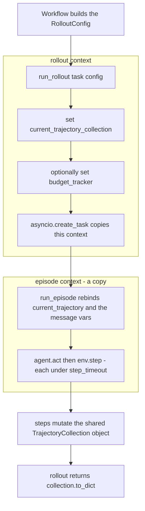

# Custom rollout

The rollout function is the one piece of a plugin that every part of Platoon calls. Training
workflows call it, the inference benchmark harness calls it, and subprocess workers import it by
name. It receives a `Task` and a `RolloutConfig`, constructs an LLM client, an environment and an
agent, runs exactly one episode, and hands back a serialized trajectory tree. This page is the
how-to: the contract, the anatomy of a real rollout section by section, the recursive variant, and
the wiring.

## The contract

The protocol is deliberately tiny — the trainers never inspect anything beyond callability.

```python title="platoon/train/components.py"
@runtime_checkable
class RolloutFn(Protocol):
    """Run one rollout for a task and rollout config."""

    def __call__(self, task: Task, config: Any) -> Any: ...
```

In practice every caller in the repository invokes it the same way, with **exactly two positional
arguments**, and awaits the result:

| Caller | Call site |
|---|---|
| AReaL workflow | `await asyncio.create_task(self.rollout_fn(task, config.rollout_config))` |
| Tinker workflow | `await asyncio.create_task(self.rollout_fn(task, rollout_config))` |
| Inference workflow | `await asyncio.create_task(self.rollout_fn(task, rollout_config))` |
| Subprocess workers | `asyncio.run(rollout_fn(task, config))` |

Three consequences follow directly from that table.

**Your function must be `async`.** Every caller awaits the returned object.

**Extra parameters must have defaults.** Nothing ever passes a third argument. A rollout like
`run_synth_depth_aware_rollout(task, config, per_agent_max_steps=25, max_depth=6)`
(<span class="pl-src">plugins/textcraft/platoon/textcraft/synth_rollout.py</span>) is legal, but
those two values sit at their defaults in every production run. To vary them, read them out of
`config.extra`, or register a second module-level function that calls the first.

**It must return a `dict` shaped like `TrajectoryCollection.to_dict()`** during training and
benchmarking. The signature plugins actually write is

```python
async def run_rollout(task: Task, config: RolloutConfig) -> dict | TrajectoryCollection: ...
```

and the `TrajectoryCollection` branch exists only for interactive use, because all three harnesses
force `return_dict = True` before calling you:

```python title="platoon/train/areal/workflows/group_rollout_workflow.py"
self.config = deepcopy(config)
self.config.rollout_config.return_dict = True
self.config.rollout_config.train = True
```

The Tinker workflow does the same in `_get_rollout_config`; the inference workflow sets
`return_dict = True` and `train = False`. Downstream code then reads
`trajectory_data.get("trajectories")` directly, so returning the live object during training raises
inside the workflow and the rollout is dropped from its group.

!!! warning "Exceptions are swallowed per rollout, not per run"
    Both training workflows wrap the call in `try/except Exception` and log with
    `logger.exception`. A rollout that raises does not stop training — it produces one `None`
    result, which becomes a missing group member. If reward looks like it collapsed to zero, check
    the trainer log for `Error in AReaL workflow for task ...` or
    `Error in tinker workflow for task ...` before you suspect the loss function.

## What the harness fills in, and what you must honor

The `RolloutConfig` you receive is not the one from the YAML file. Each harness deep-copies it and
overwrites the fields it owns.

| Field | AReaL training | Tinker training | Inference |
|---|---|---|---|
| `model_name` | prefixed with `openai/` if missing | from `model_info.model_name` | verbatim from YAML |
| `model_endpoint` | the worker-local proxy URL | `model_info.base_url` | verbatim from YAML |
| `model_api_key` | a per-rollout proxy session key | `model_info.api_key` | verbatim from YAML |
| `output_dir` | `<output_dir>/<output_subdir>/<engine version>` | `<log_path>/rollouts/<scope>/<version>` | `<out>/rollouts/<task>/rollout_<i>` |
| `return_dict` | forced `True` | forced `True` | forced `True` |
| `train` | forced `True` | forced `True` | forced `False` |
| `max_steps` | copied onto `task.max_steps` before the call | same | same |

Everything else reaches you exactly as written in the config. Here is the full dataclass and what a
rollout is expected to do with each field.

```python title="platoon/config_defs.py"
@dataclass
class RolloutConfig:
    model_name: str | None = None
    model_endpoint: str | None = None
    model_api_key: str | None = None
    train: bool = False
    max_steps: int | None = None
    output_dir: str = "rollout_results"
    verbose: bool = True
    timeout: int | None = None  # Trajectory timeout (entire rollout)
    step_timeout: int = 300  # Per-step timeout (agent.act + env.step)
    return_dict: bool = False
    propagate_root_success: bool | None = None
    propogate_root_success: bool | None = None
    skip_subagent_reward_computation: bool = False
    inference_params: InferenceParams = field(default_factory=InferenceParams)
    extra: dict[str, Any] = field(default_factory=dict)
```

| Key | Type | Default | What your rollout does with it |
|---|---|---|---|
| `model_name` | `str \| None` | `None` | Pass to the LLM client as `model=` |
| `model_endpoint` | `str \| None` | `None` | Pass as `base_url=` |
| `model_api_key` | `str \| None` | `None` | Pass as `api_key=` |
| `train` | `bool` | `False` | Set by every harness; **no shipped rollout reads it**. Available if you want train/eval-specific behavior |
| `max_steps` | `int \| None` | `None` | Already applied to `task.max_steps` by the caller; re-apply only if you also run standalone |
| `output_dir` | `str` | `"rollout_results"` | Root for the event sink and any per-rollout scratch directories |
| `verbose` | `bool` | `True` | Gate your own logging on it |
| `timeout` | `int \| None` | `None` | Whole-rollout deadline you enforce with `asyncio.wait_for` |
| `step_timeout` | `int` | `300` | Per-step deadline you pass as `run_episode(..., timeout=...)` |
| `return_dict` | `bool` | `False` | `True` → return `collection.to_dict()`, else the live collection |
| `propagate_root_success` | `bool \| None` | resolves to `False` | Recursive rollouts call `propagate_root_success(result)` when set |
| `propogate_root_success` | `bool \| None` | `None` | Deprecated misspelling; `__post_init__` raises if it conflicts with the canonical key |
| `skip_subagent_reward_computation` | `bool` | `False` | Forward into recursive environment constructors |
| `inference_params` | `InferenceParams` | `temperature=1.0`, `top_p=1.0`, `max_completion_tokens=512` | Pass straight to the agent |
| `extra` | `dict[str, Any]` | `{}` | Free-form escape hatch for plugin-specific config |

Nothing enforces any of this. A rollout that ignores `timeout` never times out; a rollout that
ignores `verbose` always logs. The fields are a convention that the rest of the toolchain — configs,
trainers, benchmark harness — assumes you follow.

## Anatomy of a rollout

`plugins/number-search/platoon/number_search/rollout.py` is the whole file, and it is the shape
every other plugin follows.

```python title="plugins/number-search/platoon/number_search/rollout.py"
async def run_rollout(task: Task, config: RolloutConfig) -> dict | TrajectoryCollection:
    agent = env = None
    try:
        llm_client = LiteLLMClient(
            model=config.model_name,
            base_url=config.model_endpoint,
            api_key=config.model_api_key,
        )
        env = NumberSearchEnv(task)
        agent = NumberSearchAgent(
            llm_client=llm_client,
            include_reasoning=False,
            inference_params=config.inference_params,
        )
        traj_collection = TrajectoryCollection()
        current_trajectory_collection.set(traj_collection)

        events_path = os.path.join(config.output_dir, "events", f"events_{task.id}_{traj_collection.id}.jsonl")

        traj_collection.register_event_handlers(
            JsonlFileSink(events_path, collection_id=traj_collection.id, process_id=os.getpid())
        )

        if config.verbose:
            logger.info(f"Process {os.getpid()}: Starting rollout for task {task.id}")

        rollout_task = asyncio.create_task(run_episode(agent, env))

        try:
            _ = await asyncio.wait_for(rollout_task, timeout=config.timeout)
        except asyncio.TimeoutError:
            if config.verbose:
                logger.error(f"Process {os.getpid()}: Rollout timed out for task {task.id}")
            rollout_task.cancel()
            with suppress(asyncio.CancelledError):
                await rollout_task
            raise

        if config.return_dict:
            return current_trajectory_collection.get().to_dict()
        else:
            return current_trajectory_collection.get()

    except Exception as e:
        if config.verbose:
            print(f"Error running rollout for task {task.id}: {e}")
        raise
    finally:
        if agent is not None:
            await agent.close()
        if env is not None:
            await env.close()
```

### The LLM client

Two clients ship with Platoon and plugins pick one. `LiteLLMClient(model, base_url, api_key)`
routes through litellm and tolerates a `None` key. `LLMClient(api_key, model, base_url,
default_extra_body)` uses the OpenAI SDK, falls back to `OPENAI_API_KEY` and `OPENAI_BASE_URL`, and
**raises at construction** when neither the argument nor the environment variable is set. TextCraft
uses `LLMClient` because it also needs
`default_extra_body={"chat_template_kwargs": {"enable_thinking": False}}` to suppress Qwen3
thinking mode; number-search, AppWorld and the TextCraft-Synth rollouts use `LiteLLMClient`.

The client is owned by the agent, not by the rollout: `CodeActAgent.close()` is exactly
`await self.llm_client.aclose()`. Build one client per rollout and hand it to the agent.

### The environment and the agent

Both take the task plus config-derived parameters and nothing else. `inference_params` goes to the
agent — it becomes `temperature`, `top_p` and `max_completion_tokens` on every chat completion.
Environments that need their own deadline get `config.step_timeout` threaded in: AppWorld builds
`AppWorldEnv(task, timeout_seconds=config.step_timeout)`, and OpenReward passes
`timeout=config.step_timeout` to the OpenHands `LLM`.

### The trajectory collection and the contextvar

This is the load-bearing part. `TrajectoryCollection` is the object the whole trajectory tree is
recorded into, and `current_trajectory_collection` is how everything else finds it: `CodeActEnv.reset`
calls `set_trajectory_task` on it, `CodeActEnv.step` appends steps to it, and `StepBudgetTracker`
reads it to decide when the episode halts. Create it and `set()` it **before** the episode starts,
or `run_episode` lazily creates one of its own and you never see the result.

### The event sink

```python
events_path = os.path.join(config.output_dir, "events", f"events_{task.id}_{traj_collection.id}.jsonl")
traj_collection.register_event_handlers(
    JsonlFileSink(events_path, collection_id=traj_collection.id, process_id=os.getpid())
)
```

Almost every plugin uses this exact convention:
`{output_dir}/events/events_{task.id}_{collection.id}.jsonl`. Two deviate — codegrep drops the
collection id, and openreward slugs the task id first, because its ids can be base64url payloads.
Because `output_dir` is rewritten by
the harness, the files land inside the run's own directory — `<log_path>/rollouts/train/<version>/events/`
for Tinker, `<output_dir>/train_rollout/<engine version>/events/` for AReaL, and the per-rollout
artifact directory for the inference harness. Keeping the convention is what makes
`python -m platoon.visualization.cli tail --rdir <run dir>` work against your plugin with no extra
wiring; see [the visualization tutorial](../tutorials/visualization.md).

`JsonlFileSink` creates parent directories and deletes any pre-existing file at that path.
`register_event_handlers` raises `ValueError` if the handler does not satisfy the
`TrajectoryEventHandler` protocol, and the collection wraps every handler callback in a
`try/except`, so a broken sink degrades the event stream but never breaks a rollout.

!!! warning "Task ids containing `/` silently nest the event file"
    The task id is interpolated straight into the filename. An id like `swe/astropy-1234` produces
    `events/events_swe/astropy-1234_<uuid>.jsonl` — that is, a subdirectory. OpenReward avoids this
    with a `_slug()` helper that replaces every character outside `[A-Za-z0-9._-]` with `-`. Do the
    same if your ids are not already filename-safe.

### `asyncio.create_task` and why it is not optional

```python title="platoon/episode/loop.py"
# NOTE: Call using asyncio.create_task() to make sure edits to contextvars do not leak to parent context
async def run_episode(agent: Agent, env: Env, verbose: bool = False, timeout: int | None = 300) -> Trajectory
```

`asyncio.create_task` copies the current context into the task, and rebindings made inside the task
do not propagate back out. `run_episode` rebinds `current_trajectory`, `current_agent`,
`current_env`, `finish_message`, `error_message` and `episode_step_timeout`. Awaiting it directly
would leave all of those bound in your rollout's context after the episode ends — most damagingly
`current_trajectory`, because `set_context_vars` reads it as the *parent* when creating a
trajectory, so a second episode started from that context would be recorded as a child of the first
one instead of as a root.

The mirror image of the rule is the ordering: anything the episode must *see* has to be set before
`create_task`, because only the state at that instant is copied in. That is why the collection —
and, in recursive rollouts, the budget tracker — is installed first.



The collection survives the context boundary because it is the *same object*, mutated in place.
Only the contextvar bindings are isolated.

### Reading the result back

```python
if config.return_dict:
    return current_trajectory_collection.get().to_dict()
else:
    return current_trajectory_collection.get()
```

Reading the collection back out of the contextvar instead of using the local `traj_collection`
variable is house style; here the two are the same object. `to_dict()` produces
`{"id": <uuid>, "trajectories": {<traj_id>: {...}}}` with insertion order preserved — the inference
harness identifies the root as the *first* entry, so do not reorder it.

## Timeouts and cancellation

There are two deadlines, and they are not interchangeable.

`run_episode(agent, env, timeout=config.step_timeout)` sets the **per-step** deadline: the loop
wraps `agent.act(obs)` and `env.step(action)` in `asyncio.wait_for(..., timeout=timeout)`
individually. On expiry `run_episode` catches the `TimeoutError` itself, stamps
`traj.misc["trajectory_timed_out"] = True`, writes a detailed `error_message`, finalizes the
trajectory and returns normally. The rollout is scored as a failure, not as an error.

The outer `asyncio.wait_for(rollout_task, timeout=config.timeout)` is the **whole-trajectory**
deadline. It cancels the episode; `run_episode` records `traj.misc["trajectory_cancelled"] = True`
and then deliberately re-raises the `CancelledError` after finalizing, so the partial tree has
already reached the event sink by the time the exception reaches you.

!!! warning "number-search omits `step_timeout`"
    `plugins/number-search/platoon/number_search/rollout.py` calls
    `asyncio.create_task(run_episode(agent, env))` with no `timeout` argument, so it silently uses
    the `run_episode` default of 300 seconds no matter what the config says. Every other plugin
    passes `timeout=config.step_timeout`. Copy the other plugins, not this line.

Cancellation handling comes in two forms in the tree, and the difference matters for backends whose
client calls are not cancellable:

```python title="plugins/textcraft/platoon/textcraft/synth_rollout.py"
except asyncio.TimeoutError:
    if config.verbose:
        logger.error(f"Process {os.getpid()}: Rollout timed out for task {task.id}")
    rollout_task.cancel()
    # Don't wait indefinitely - tinker's sample_async may not be cancellable
    try:
        await asyncio.wait_for(rollout_task, timeout=5.0)
    except (asyncio.TimeoutError, asyncio.CancelledError):
        logger.warning(
            f"Process {os.getpid()}: Task cancellation did not complete in 5s for {task.id}, abandoning"
        )
    raise
```

number-search uses the simpler `with suppress(asyncio.CancelledError): await rollout_task`, which
waits indefinitely for cleanup. Prefer the bounded form. OpenReward goes further and does not
re-raise at all unless `propagate_root_success` is set: `asyncio.wait_for` has already cancelled and
finalized the episode, so the collection is a coherent partial result whose completed
sub-trajectories remain usable, and it returns that rather than discarding the whole group member.

Above your two deadlines sit two you do not control. With `use_subprocesses` enabled, the parent
waits `(timeout or 900) + 180` seconds — plus a 30-second grace on the AReaL path — and the child
arms a `SIGALRM` that `SIGKILL`s its entire process group on the same schedule. A `config.timeout`
of `None` therefore does not mean "no limit" under subprocess isolation; it means 900 seconds.

## Cleanup

`run_episode` closes both resources itself, in its own `finally`, each wrapped in a 10-second
`asyncio.wait_for`:

```python title="platoon/episode/loop.py"
finally:
    await _close_episode_resource(agent, "agent")
    await _close_episode_resource(env, "environment")
```

The `finally` block in the rollout is therefore a *second* close. It exists to cover the window
before `create_task` — a failure while building the client, the environment or the agent — which
means your `close()` must be **idempotent**. `CodeActEnv.close()` is (it rebuilds `_state` and
closes the executor), and so is `CodeActAgent.close()` for both shipped clients.

AppWorld makes the intent explicit instead of relying on idempotence, and this is the pattern to
copy for environments with expensive or non-reentrant teardown:

```python title="plugins/appworld/platoon/appworld/rollout.py"
        rollout_task = asyncio.create_task(run_episode(agent, env, timeout=config.step_timeout))
        episode_started = True
        ...
    finally:
        # run_episode() owns agent/env shutdown once started.
        # We only clean up here if startup failed before run_episode was launched.
        if not episode_started:
            if agent is not None:
                await agent.close()
            if env is not None:
                await env.close()
```

Note the `agent = env = None` initialization at the top of every rollout. Without it, a failure
inside the LLM client constructor makes the `finally` block raise `NameError` and mask the real
error.

## A recursive variant

A recursive rollout differs from a linear one in four places: it builds an environment whose action
space includes `launch_subagent`, it installs a budget tracker, it forwards
`skip_subagent_reward_computation`, and it may rewrite rewards across the tree afterwards.

The budget tracker is the interesting decision. Set nothing and `set_context_vars` installs a
`StepBudgetTracker`, under which a child's steps are charged against the parent's remaining budget —
delegation costs the caller. `DepthAwareStepBudgetTracker(max_depth=N)` instead gives every
trajectory its own `task.max_steps` and caps only the depth of the tree. Because the tracker is a
contextvar, it must be set before `create_task`:

```python title="plugins/textcraft/platoon/textcraft/synth_rollout.py"
        # Override the task's max_steps so the root agent also uses per_agent_max_steps
        task.max_steps = per_agent_max_steps

        env = create_synth_depth_aware_env(
            task,
            subagent_max_steps=per_agent_max_steps,
            skip_subagent_reward_computation=config.skip_subagent_reward_computation,
        )
        agent = TextCraftDepthAwareAgent(
            llm_client=llm_client,
            inference_params=config.inference_params,
        )

        traj_collection = TrajectoryCollection()
        current_trajectory_collection.set(traj_collection)

        # Install the depth-aware budget tracker BEFORE run_episode so it
        # is picked up instead of the default StepBudgetTracker.
        budget_tracker.set(DepthAwareStepBudgetTracker(max_depth=max_depth))
```

!!! warning "A depth-aware rollout overrides the config's `max_steps`"
    The workflow copies `rollout_config.max_steps` onto `task.max_steps` before calling you, and
    `run_synth_depth_aware_rollout` immediately overwrites it with `per_agent_max_steps`
    (default `25`). `textcraft_synth_depth_aware_tinker.yaml` sets `rollout_config.max_steps: 200`
    and the root agent still gets 25 steps. That is intentional — under a depth-aware tracker
    `max_steps` is a *per-agent* budget, not a tree-wide one — but it does mean the number in the
    YAML does not describe the run.

OpenReward shows the conditional form, plus one refinement worth stealing: it keeps the contextvar
tokens and resets them in `finally`, so the rollout leaves the caller's context exactly as it found
it even though it also sets a contextvar for sub-agent reward judging.

```python title="plugins/openreward/platoon/openreward/rollout.py"
    tokens = [current_trajectory_collection.set(traj_collection)]
    if openreward_config.enable_recursive_subagents:
        tokens.append(budget_tracker.set(DepthAwareStepBudgetTracker(max_depth=openreward_config.subagent_max_depth)))
```

After the episode, a recursive rollout may rewrite the tree before returning.
`propagate_root_success` overwrites every sub-trajectory's reward with the root's success, which
turns delegation into a pure credit-assignment shortcut. OpenReward refuses to combine it with
per-child delegation rewards and raises `ValueError` when both are on. Both TextCraft recursive
rollouts apply it only when `config.propagate_root_success` is set:

```python
        result: dict | TrajectoryCollection
        if config.return_dict:
            result = current_trajectory_collection.get().to_dict()
        else:
            result = current_trajectory_collection.get()
        if config.propagate_root_success:
            result = propagate_root_success(result)
        return result
```

For what `launch_subagent` does with these settings, see
[the fork and sub-agent model](../architecture/subagents.md) and
[recursive agents](../tutorials/recursive-agents.md).

## Passing plugin config through `extra`

`RolloutConfig` has no room for plugin-specific settings and the trainers will not add any. The
supported route is `extra`: your train script copies its own config block in, and your rollout reads
it back out. OpenReward is the reference implementation.

```python title="plugins/openreward/platoon/openreward/train_scripts/areal/train_areal.py"
def _attach_openreward_config(config: OpenRewardArealTrainerConfig) -> None:
    rollout_extra = dict(config.workflow_config.rollout_config.extra or {})
    rollout_extra["openreward"] = asdict(config.openreward)
    config.workflow_config.rollout_config.extra = rollout_extra
```

```python title="plugins/openreward/platoon/openreward/rollout.py"
def _openreward_config(config: RolloutConfig) -> OpenRewardConfig:
    extra = config.extra or {}
    return OpenRewardConfig.from_mapping(extra.get("openreward"))
```

Store only plain data in `extra` — under `use_subprocesses` the whole config crosses a process
boundary as `asdict(rollout_config)` and is rebuilt with `RolloutConfig(**config_dict)`.

!!! note "Two different `environments` keys"
    OpenReward's own config block contains a nested `environments:` list whose entries carry
    `label`, `env_name`, `session_url` and `sampling_weight`. That is an environment *mixture*, read
    by the plugin out of `extra`. It is unrelated to the top-level `environments:` list of
    `EnvironmentConfig` in the next section, which is registry wiring for the shared trainers.

## Registering and wiring it

There are two ways to get your rollout in front of a trainer, and both are in use today.

=== "AReaL"

    Most plugins still ship a train script that imports the function directly and hands it to the
    workflow constructor:

    ```python
    from platoon.number_search.rollout import run_rollout
    from platoon.number_search.tasks import get_task, get_task_ids

    workflow = GroupRolloutWorkflow(
        run_rollout, get_task, config.workflow_config,
        trainer.proxy_base_url, trainer.proxy_admin_api_key, output_subdir="train_rollout",
    )
    ```

    ```bash
    uv run python3 platoon/number_search/train.py \
      --config platoon/number_search/nv_number_search_cispo_areal.yaml
    ```

    AReaL configs are loaded with `areal.api.cli_args.load_expr_config`, so overrides are bare
    `key=value` pairs with **no** leading dashes:

    ```bash
    uv run python3 platoon/number_search/train.py \
      --config platoon/number_search/nv_number_search_cispo_areal.yaml \
      workflow_config.rollout_config.timeout=1200 \
      workflow_config.rollout_config.max_steps=20
    ```

    The shared entrypoint `python -m platoon.train.areal.train` resolves everything from the
    config's `environments:` block instead. No AReaL config in the repository fills that block in
    yet, so using it today means adding one to your own config.

=== "Tinker"

    The registry route is wired end to end on this backend. Register the function once:

    ```python title="plugins/textcraft/platoon/textcraft/registry.py"
    register_rollout("textcraft/synth/linear", run_synth_rollout)
    register_rollout("textcraft/synth/recursive", run_synth_recursive_rollout)
    register_rollout("textcraft/synth/depth_aware", run_synth_depth_aware_rollout)
    ```

    then name it in the config's top-level `environments:` list:

    ```yaml title="plugins/textcraft/platoon/textcraft/configs/tinker/textcraft_synth_depth_aware_tinker.yaml"
    environments:
      - package: platoon.textcraft.registry
        trainer_config: textcraft/synth/tinker
        dataset_loader: textcraft/synth
        eval_dataset_loader: textcraft/synth
        task_loader: textcraft/synth
        rollout: textcraft/synth/depth_aware
        reward_processor: textcraft/synth/delegation_capped
        workflow: group_rollout
    ```

    ```bash
    uv run python -m platoon.train.tinker.train \
      --config platoon/textcraft/configs/tinker/textcraft_synth_depth_aware_tinker.yaml
    ```

    Tinker and inference configs are loaded with `platoon.utils.config.load_config`, so overrides
    are `--dotted.key value`:

    ```bash
    uv run python -m platoon.train.tinker.train \
      --config platoon/textcraft/configs/tinker/textcraft_synth_depth_aware_tinker.yaml \
      --train.workflow_config.rollout_config.timeout 1200
    ```

Four details about the registry route are worth knowing before you use it.

**`package:` is imported purely for its registration side effects.** The alternative is
`discover_entry_points: true`, which loads every module advertised under the `platoon.plugins`
entry-point group — TextCraft is the only plugin that declares one.

**Registration is optional.** `resolve` treats any spec that is not a registered name as a dotted
import path, so `rollout: platoon.coin_flip.rollout.run_rollout` works with no registry module at
all.

**`eval_rollout` is separate.** Leave it unset and evaluation reuses `rollout`; set it to run a
different function at eval time — for example a linear rollout, to measure what delegation is
buying you.

**`AutoRollout` raises when `rollout` is unset**, with `Config must set environments[0].rollout`.

For the registry mechanics in full, see [the registry](../architecture/registry.md); for the config
structure, see the [configuration reference](../reference/configuration.md).

## Your rollout must be importable at module level

This is the constraint that catches people, and on the AReaL path it is not optional.

`PlatoonArealRLTrainer.train()` calls `normalize_remote_workflow` on whatever workflow you hand it.
`GroupRolloutWorkflow` implements `to_remote_workflow`, which serializes itself into a class plus a
kwargs dict in which `rollout_fn` and `get_task_fn` have been replaced by **import path strings**, so
a remote rollout worker can rebuild the workflow. If either path cannot be derived, it fails loudly:

```python title="platoon/train/areal/workflows/group_rollout_workflow.py"
if kwargs["rollout_fn"] is None or kwargs["get_task_fn"] is None:
    raise ValueError("GroupRolloutWorkflow requires importable rollout_fn/get_task_fn")
```

`callable_import_path` derives the path from `fn.__module__` and `fn.__name__`, with one rescue: a
function defined in a script run as `__main__` is matched against `sys.path` to recover a
package-qualified module name. What it cannot rescue:

- a `lambda` — rejected by name
- a `functools.partial` — no `__name__` at all
- a closure or nested function — `__module__.__name__` would not import back to the same object
- a function defined in a notebook or REPL

The requirement reappears in the subprocess paths, which ship `rollout_fn.__module__` and
`rollout_fn.__name__` across the process boundary and re-import them with
`importlib.import_module` plus `getattr`. The registry applies its own version of the same rule:
`infer_import_path` returns `None` for any callable whose `__qualname__` contains `<locals>` or
whose module is `__main__`.

So: **define your rollout as a plain `async def` at the top level of a module inside your plugin
package.** If you need a variant, define a second top-level function that calls the first with
different arguments — which is exactly what the three TextCraft-Synth rollouts do.

## Checklist

Before wiring a new rollout into training:

- [ ] `async def run_rollout(task: Task, config: RolloutConfig) -> dict | TrajectoryCollection`, at
      module level.
- [ ] `agent = env = None` before the `try`, and both closed in `finally` (or an `episode_started`
      guard).
- [ ] `TrajectoryCollection()` created and `current_trajectory_collection.set(...)` called before
      the episode starts.
- [ ] `JsonlFileSink` registered at `{output_dir}/events/events_{task.id}_{collection.id}.jsonl`,
      with a filename-safe task id.
- [ ] Budget tracker installed before `create_task`, if you are not using the default.
- [ ] `run_episode` wrapped in `asyncio.create_task`, with `timeout=config.step_timeout`.
- [ ] Outer `asyncio.wait_for(..., timeout=config.timeout)` with bounded cancellation cleanup.
- [ ] Returns `to_dict()` when `config.return_dict` is set.

The cheapest way to exercise all of that is the inference harness: it drives the same
`(task, RolloutConfig)` callable against any OpenAI-compatible endpoint with no trainer, no
tokenizer and no weight sync. Run a handful of tasks through
[the inference tutorial](../tutorials/inference.md) before starting a training job.

## See also

- [Custom environment](environment.md) and [custom agent](agent.md) — the two objects your rollout
  constructs
- [Custom rewards](rewards.md) — the reward processor that consumes the tree you return
- [Custom workflow](workflow.md) — what happens to the returned dict next
- [Group rollout workflow](../walkthroughs/group-rollout-workflow.md) — the caller, in detail
- [The fork and sub-agent model](../architecture/subagents.md) — budget trackers and delegation
- [The registry](../architecture/registry.md) — names, import paths and entry points
- [Plugin anatomy](../walkthroughs/plugin-anatomy.md) — where `rollout.py` sits in a plugin
