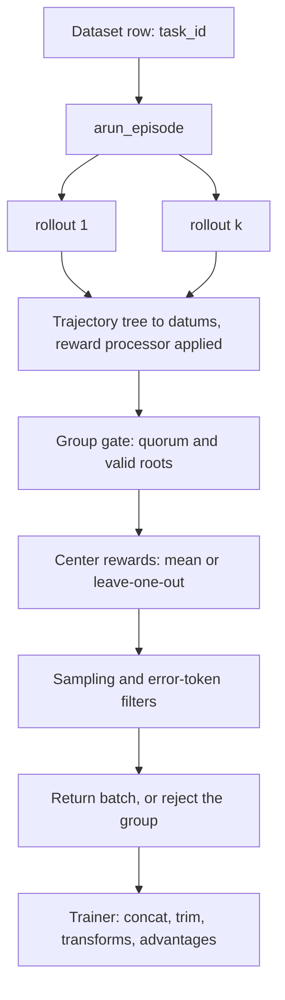

# Custom workflow

The workflow is the seam between "run a rollout" and "here is a training batch". It decides how many
rollouts a task gets, how their trajectories become token-level datums, how rewards are centered
within the group, and whether the group is worth training on at all. This page covers what the
default `GroupRolloutWorkflow` already does, how to select or extend it on each backend, and why
subclassing one method is almost always the right amount of change.

!!! warning "This is the least-exercised extension point in Platoon"

    Nothing in the repository registers a workflow. `register_workflow` is defined at
    <span class="pl-src">platoon/registry.py</span> and called nowhere, so the `workflow`
    registry is empty, and no test covers a non-default class. The `AutoWorkflow` resolution path
    reads correctly and the constructor contracts are stable, but you would be its first user. Read
    [custom batch transforms](batch-transform.md) and [custom rewards](rewards.md) first: between
    them they cover most of what people initially reach for a workflow to do.

## What the workflow owns

One `arun_episode` call handles one dataset row — one *task* — end to end. On both backends that
means:

| Responsibility | Where it lands |
| --- | --- |
| Fan out `group_size` rollouts for the task | `asyncio.gather`, or a spawn `ProcessPoolExecutor` on AReaL |
| Own each rollout's model session | `ArealProxySession` (AReaL) / `TinkerLLMProxySession` (Tinker) |
| Build the per-rollout `RolloutConfig` | endpoint, API key, output dir, `train=True`, `return_dict=True` |
| Straggler and timeout policy | tail-grace clock, process-pool reaping (AReaL only) |
| Convert trajectory trees to datums | `get_train_data_for_trajectory_collection` |
| Apply the reward processor per trajectory | threaded into the converter |
| Reject the group when it is unusable | too few members, no valid root reward, zero variance |
| Center rewards within the group | group mean, or leave-one-out |
| Subagent datum sampling and error-token filtering | after centering, before returning |
| Emit rollout telemetry | reward stats, `*_at_k_*`, workload sidecars |

Everything *cross-task* belongs to the trainer, not the workflow. The trainer concatenates accepted
groups, trims to a DP-divisible batch, runs batch transforms, applies the zero-advantage filter, and
computes advantages. That ordering is deliberate — a transform that normalizes by depth frequency
has to see the batch that actually trains, which the workflow cannot know.



### Try the config knobs first

Most changes people want are already parameters on `workflow_config`. Before writing a class, check
whether one of these covers it. On both backends: `group_size`, `leave_one_out_baseline`,
`subagent_datum_keep_probability`, `filter_zero_advantage_datums`, `depth_level_weighting`.
<span class="pl-tag pl-tag--areal">AReaL</span> only: `min_successful_group_size`,
`straggler_timeout_seconds` / `straggler_quorum`, `use_subprocesses`,
`filter_zero_variance_groups`, `depth_level_discount_gamma`, `token_efficiency_reward`. The Tinker
loader drops unknown keys in silence, so an AReaL-only key copied into a Tinker YAML does nothing
and says nothing. The full set with defaults is in the
[configuration reference](../reference/configuration.md).

Two of these are easy to misjudge. `min_successful_group_size` (default `1`) is checked twice — once
against the number of members that returned any data, and again against the number of members whose
*root* trajectory completed — so a group can pass the first gate and still be rejected by the second.
And `straggler_quorum` defaults to `group_size - 1`, meaning the tail clock starts only when a single
member is left; it also requires `straggler_timeout_seconds`, and both only apply when
`use_subprocesses` is on, because the timeout is enforced by reaping the group's process pool.

### What only a workflow can see

The argument for writing one comes down to information that exists nowhere else. Inside
`arun_episode` you have the per-member results *before* they are concatenated, plus two group-level
keys the trainer strips on its way to the optimizer batch:

- `task_reward` — one entry per group member, the root trajectory's reward before centering.
- `task_reward_valid` — one bool per member, false when that member's root was interrupted.

By the time a batch transform runs, groups from many tasks have been concatenated, trimmed to a
DP-divisible size, and those keys are gone. So anything *group-relative* — a different baseline,
scaling by within-group reward spread, a quorum policy, an adaptive group size — has to live in the
workflow. Anything that is a function of the final training batch belongs in a
[batch transform](batch-transform.md), which is a far smaller and better-tested surface.

## The two base classes

The backends do not share a workflow. They differ in base class, constructor, entry-method signature
and return type. Nothing in Platoon reconciles them, so a workflow class works with exactly one
backend.

=== "AReaL"

    `GroupRolloutWorkflow` subclasses AReaL's abstract `RolloutWorkflow` and Platoon's
    `RemoteWorkflowSerializable` protocol.

    ```python title="platoon/train/areal/workflows/group_rollout_workflow.py"
    class GroupRolloutWorkflow(RolloutWorkflow, RemoteWorkflowSerializable):
        """Workflow that preserves Platoon's recursive group-rollout processing."""

        def __init__(
            self,
            rollout_fn: Callable[[Task, dict], dict] | str,
            get_task_fn: Callable[[str], Task] | str,
            config: WorkflowConfig | dict[str, Any],
            proxy_base_url: str | None,
            proxy_admin_api_key: str,
            output_subdir: str = "rollout",
            filter_errors: bool = False,
            reward_processor: Callable[[dict], tuple[float, dict]] | str = lambda traj: (traj["reward"], {}),
            merge_prefixes: bool = True,
        ):
    ```

    Entry point: `async def arun_episode(self, engine: InferenceEngine, data: dict) -> dict | None`
    (<span class="pl-src">platoon/train/areal/workflows/group_rollout_workflow.py</span>).
    Returning `None` rejects the task group. The returned dict is a padded tensor batch whose
    per-datum keys include `input_ids`, `attention_mask`, `loss_mask`, `logprobs`, `versions`,
    `rewards` and `token_rewards`, plus the workflow-level stat keys the trainer strips before
    training.

    `rollout_fn`, `get_task_fn` and `reward_processor` each accept a dotted import-path string as
    well as a callable, and `config` accepts a plain dict as well as a `WorkflowConfig` — that is how
    workers rebuild the workflow (see [remote reconstruction](#remote-reconstruction-areal-only)).

=== "Tinker"

    `GroupRolloutWorkflow` is a plain class. It satisfies a `Protocol` structurally — there is no
    base class to inherit from if you write one from scratch.

    ```python title="platoon/train/tinker/workflows/base.py"
    class RolloutWorkflow(Protocol):
        """Protocol for rollout workflows used in tinker RL training.

        Implementations should receive model_info and other dependencies via constructor.
        """

        async def arun_episode(self, data: dict) -> list[tinker.Datum] | None: ...
    ```

    ```python title="platoon/train/tinker/workflows/group_rollout_workflow.py"
    def __init__(
        self,
        rollout_fn: Callable[[Task, RolloutConfig], dict],
        get_task_fn: Callable[[str], Task],
        config: WorkflowConfig,
        model_info: ModelInfo,
        log_path: str | None = None,
        stats_scope: str = "train",
        filter_errors: bool = False,
        reward_processor: Callable[[dict], tuple[float, dict]] = lambda traj: (traj["reward"], {}),
    ):
    ```

    Entry point: `async def arun_episode(self, data: dict) -> list[tinker.Datum]`
    (<span class="pl-src">platoon/train/tinker/workflows/group_rollout_workflow.py</span>).
    There is no `engine` argument — the model is reached through `model_info`. Rejecting a task means
    returning an empty list; the trainer's consumer loop also tolerates `None`, which is what it
    substitutes when a workflow raises.

    The default returns `_TaskRolloutOutput`, a `list[tinker.Datum]` subclass carrying a `workload`
    attribute. The trainer reads that attribute defensively
    (<span class="pl-src">platoon/train/tinker/rl.py</span>), so returning a plain list is legal
    and only disables the exact `workload/training_batch/total_non_submitted_datums` metric.

The differences that bite:

| | <span class="pl-tag pl-tag--areal">AReaL</span> | <span class="pl-tag pl-tag--tinker">Tinker</span> |
| --- | --- | --- |
| Base | `areal.api.RolloutWorkflow` (ABC) | `Protocol`, structural only |
| Constructed with | first five arguments **positional** | everything **by keyword** |
| Backend-specific ctor args | `proxy_base_url`, `proxy_admin_api_key`, `output_subdir`, `merge_prefixes` | `model_info`, `log_path`, `stats_scope` |
| Entry method | `arun_episode(engine, data)` | `arun_episode(data)` |
| Returns | padded tensor `dict`, or `None` | `list[tinker.Datum]` |
| Runs in | a separate rollout worker process | the trainer process |
| Must be remotely reconstructible | yes | no |

The positional-versus-keyword split matters more than it looks. On AReaL your `__init__` must accept
`rollout_fn, get_task_fn, config, proxy_base_url, proxy_admin_api_key` positionally, in that order;
a keyword-only redefinition raises `TypeError` at construction. On Tinker every argument arrives by
keyword, so parameter order is free but the *names* are fixed.

!!! note "One class serves both splits"

    `AutoWorkflow` resolves a single class and both entrypoints instantiate it twice — once for
    training, once for evaluation — with different config and kwargs. There is no separate
    `eval_workflow` selector. If the eval behavior must differ, branch on a constructor argument you
    set only in `eval_workflow_kwargs`, or on AReaL on `output_subdir` / on Tinker on `stats_scope`.

## Selecting your class from config

`AutoWorkflow` resolves `environments[0].workflow`. The whole mechanism is four lines:

```python title="platoon/train/auto.py"
@classmethod
def from_config(cls, config: Any, default: type) -> type:
    environment = AutoEnvironment.from_config(config)
    if environment.workflow == "group_rollout":
        return default
    return resolve_component("workflow", environment.workflow)
```

`"group_rollout"` — the default value of the field — is a **sentinel, not a registry name**. It
returns the `default` the entrypoint passed in, which is the backend-appropriate
`GroupRolloutWorkflow`. That is how one config value means "whichever default matches the backend I
am running", something a single registry name could not express.

Any other value goes through `resolve_component`, which checks the `workflow` registry and falls
through to `import_from_string` for anything unregistered. Since the registry is empty today, an
unregistered dotted path is the shortest route:

```yaml
environments:
  - package: platoon.mytask.registry
    dataset_loader: mytask/default
    task_loader: mytask/default
    rollout: mytask/default
    workflow: platoon.mytask.workflow.TokenBudgetGroupRolloutWorkflow
```

Registering with `@register_workflow("mytask/token_budget_group")` buys a short stable name and a
listing in the "Unknown workflow" error message; it is not required. See
[the registry architecture page](../architecture/registry.md) for how resolution works, and
[packaging a plugin](packaging.md) for where the registration module lives.

### `workflow_kwargs` and `eval_workflow_kwargs`

Both entrypoints copy the dict, pop the keys they set themselves, and splat the rest into your
constructor. An unrecognized key becomes a `TypeError` from your `__init__`.

| Backend | Popped key | Train default | Eval default |
| --- | --- | --- | --- |
| AReaL | `output_subdir` | `"train_rollout"` | `"eval_rollout"` |
| AReaL | `filter_errors` | `True` | `False` |
| Tinker | `stats_scope` | `"train"` | `"eval"` |
| Tinker | `filter_errors` | `True` | `False` |

```python title="platoon/train/areal/train.py"
workflow_kwargs = dict(environment.workflow_kwargs)
workflow = workflow_cls(
    rollout_fn,
    get_task_fn,
    config.workflow_config,
    trainer.proxy_base_url,
    trainer.proxy_admin_api_key,
    output_subdir=workflow_kwargs.pop("output_subdir", "train_rollout"),
    filter_errors=workflow_kwargs.pop("filter_errors", True),
    reward_processor=reward_processor,
    **workflow_kwargs,
)
```

```python title="platoon/train/tinker/train.py"
workflow_kwargs = dict(environment.workflow_kwargs)
train_workflow = workflow_cls(
    rollout_fn=rollout_fn,
    get_task_fn=get_task_fn,
    config=config.train.workflow_config,
    model_info=trainer.model_info,
    log_path=trainer.run_log_path,
    stats_scope=workflow_kwargs.pop("stats_scope", "train"),
    filter_errors=workflow_kwargs.pop("filter_errors", True),
    reward_processor=reward_processor,
    **workflow_kwargs,
)
```

The two dicts are independent. Anything you set in `workflow_kwargs` does **not** carry over to
`eval_workflow_kwargs`; the eval workflow falls back to your constructor defaults. Set both when a
parameter should apply to both splits.

On AReaL the eval workflow also gets a deep copy of `workflow_config` with `group_size = 1`,
`subagent_datum_keep_probability = 1.0` and `filter_zero_advantage_datums = False` forced
(<span class="pl-src">platoon/train/areal/train.py</span>), and its proxy URL comes from
`trainer.eval_proxy_base_url or trainer.proxy_base_url`. Tinker instead reads a separate
`eval.workflow_config` block whose defaults already encode the same intent.

!!! warning "`workflow_config.filter_errors` in YAML does nothing"

    Both backends define `filter_errors` on `WorkflowConfig`, and neither workflow reads it — the
    effective value is the *constructor* argument, which the shared entrypoints supply from
    `workflow_kwargs.pop("filter_errors", ...)`. To control error filtering from YAML under the
    registry entrypoints, write `workflow_kwargs: {filter_errors: false}`; editing
    `workflow_config.filter_errors` is silently inert. OpenReward's two train scripts forward the
    config field explicitly — `filter_errors=config.workflow_config.filter_errors` in
    <span class="pl-src">plugins/openreward/platoon/openreward/train_scripts/areal/train_areal.py</span>
    and `config.train.workflow_config.filter_errors` in
    <span class="pl-src">plugins/openreward/platoon/openreward/train_scripts/tinker/train_tinker.py</span>
    — which is a property of those scripts, not of the field.

## Remote reconstruction (AReaL only)

An AReaL workflow does not run in the trainer process. `PlatoonArealRLTrainer.train` passes it
through `normalize_remote_workflow` before the first rollout:

```python title="platoon/train/areal/workflow_serialization.py"
def normalize_remote_workflow(
    workflow: WorkflowLike | None,
    workflow_kwargs: dict[str, Any] | None,
) -> tuple[WorkflowLike | None, dict[str, Any] | None]:
    """Convert opt-in workflow instances into a remotely reconstructible form."""

    if isinstance(workflow, RemoteWorkflowSerializable):
        remote_workflow, remote_kwargs = workflow.to_remote_workflow()
        ...
```

`GroupRolloutWorkflow.to_remote_workflow` returns `(self.__class__, self.to_workflow_kwargs())`, and
`to_workflow_kwargs` reduces the instance to data a worker can rebuild from: `asdict(self.config)`
plus dotted import paths for `rollout_fn`, `get_task_fn` and `reward_processor`, recovered by
`callable_import_path`. AReaL's rollout controller then reduces the class itself to the string
`f"{workflow.__module__}.{workflow.__name__}"`, ships that string and the kwargs to a worker, and the
worker imports it and calls `workflow_cls(**workflow_kwargs)`. Two consequences:

- **Your class must be importable in the worker process** under its real module path. It travels by
  name, not by value: a class defined inside a function, a test fixture, or a notebook cell will not
  survive the trip.
- **`rollout_fn` and `get_task_fn` must be module-level functions.** A lambda or a local closure has
  no import path, and `to_workflow_kwargs` raises
  `ValueError("GroupRolloutWorkflow requires importable rollout_fn/get_task_fn")`. Functions defined
  in a `__main__` train script are handled: `callable_import_path` walks `sys.path` to recover a
  package-qualified path from `__file__`, preferring `platoon.*` candidates.

A `reward_processor` with no import path — the `AutoRewardProcessor` fallback lambda, for instance —
is omitted from the kwargs entirely, so the worker falls back to the identical class default.

`proxy_base_url` is deliberately serialized as `None`. Each worker binds its own proxy endpoint by
calling `set_proxy_base_url` just before execution, through a Platoon patch on AReaL's
`RemoteInfEngine._resolve_workflow` (<span class="pl-src">platoon/train/areal/patches.py</span>).
If you override `set_proxy_base_url`, keep the assignment.

!!! danger "Extra constructor arguments are dropped on workers unless you extend `to_workflow_kwargs`"

    `to_remote_workflow` sends your subclass, but `to_workflow_kwargs` only knows the base class's
    parameters. An extra argument with a default therefore silently reverts to that default on every
    rollout worker while looking correct in the trainer process — the worst possible failure mode,
    because nothing errors. Override `to_workflow_kwargs` and add your keys. A subclass with **no**
    extra constructor arguments needs no override.

Tinker has none of this. Its workflow object is used directly by in-process worker tasks, so
closures, lambdas and locally defined classes all work.

## Worked example: reject a task group that blows the token budget

A single pathological task — a deep recursive tree, a runaway tool loop — can contribute more tokens
to a step than every other task combined, and DP trimming will then throw away useful datums from
well-behaved tasks. Rejecting such a group at the workflow boundary is cheap, and it is not something
a batch transform can do: by then the offending group is already interleaved with everyone else's.

This overrides exactly one method, calls `super()` for all the real work, and adds one constructor
argument.

=== "AReaL"

    ```python title="plugins/mytask/platoon/mytask/workflow.py"
    """A group workflow that drops task groups over a token budget."""

    from typing import Any

    from areal.api import InferenceEngine
    from areal.infra import workflow_context
    from areal.utils import stats_tracker

    from platoon.registry import register_workflow
    from platoon.train.areal.workflows import GroupRolloutWorkflow


    @register_workflow("mytask/token_budget_group")
    class TokenBudgetGroupRolloutWorkflow(GroupRolloutWorkflow):
        """Reject a task group whose datums would dominate the trainer batch."""

        def __init__(self, *args: Any, max_group_tokens: int = 200_000, **kwargs: Any):
            super().__init__(*args, **kwargs)
            if max_group_tokens <= 0:
                raise ValueError("max_group_tokens must be positive")
            self.max_group_tokens = int(max_group_tokens)

        async def arun_episode(self, engine: InferenceEngine, data: dict) -> dict | None:
            train_data = await super().arun_episode(engine, data)
            if train_data is None:
                return None

            group_tokens = int(train_data["attention_mask"].sum().item())
            tracker = stats_tracker.get(workflow_context.stat_scope())
            tracker.scalar(group_tokens=float(group_tokens))
            if group_tokens > self.max_group_tokens:
                tracker.scalar(group_token_budget_rejected=1.0)
                return None
            return train_data

        def to_workflow_kwargs(self) -> dict[str, Any]:
            kwargs = super().to_workflow_kwargs()
            kwargs["max_group_tokens"] = self.max_group_tokens
            return kwargs
    ```

    `*args` keeps the entrypoint's positional call working unchanged, and `max_group_tokens` is
    keyword-only, so it can only arrive through `workflow_kwargs`. The `to_workflow_kwargs` override
    is what makes the budget survive to the rollout workers.

=== "Tinker"

    ```python title="plugins/mytask/platoon/mytask/workflow.py"
    """A group workflow that drops task groups over a token budget."""

    from typing import Any

    import tinker

    from platoon.registry import register_workflow
    from platoon.train.tinker.workflows import GroupRolloutWorkflow


    @register_workflow("mytask/token_budget_group")
    class TokenBudgetGroupRolloutWorkflow(GroupRolloutWorkflow):
        """Reject a task group whose datums would dominate the trainer batch."""

        def __init__(self, *args: Any, max_group_tokens: int = 200_000, **kwargs: Any):
            super().__init__(*args, **kwargs)
            if max_group_tokens <= 0:
                raise ValueError("max_group_tokens must be positive")
            self.max_group_tokens = int(max_group_tokens)

        async def arun_episode(self, data: dict) -> list[tinker.Datum]:
            datums = await super().arun_episode(data)
            group_tokens = sum(
                int(datum.loss_fn_inputs["mask"].to_torch().numel()) for datum in datums
            )
            self.tracker.scalar(group_tokens=float(group_tokens))
            if group_tokens > self.max_group_tokens:
                self.tracker.scalar(group_token_budget_rejected=1.0)
                return []
            return datums
    ```

    No `to_workflow_kwargs` is needed — the Tinker workflow is never serialized. `self.tracker` is
    set by the base constructor from `stats_scope`. Returning a bare `[]` discards the
    `_TaskRolloutOutput` workload sidechannel for that task, which costs one trainer metric; the
    group's reward and rollout stats were already recorded by `super()`.

Wiring, on either backend:

```yaml
environments:
  - package: platoon.mytask.workflow
    dataset_loader: mytask/default
    task_loader: mytask/default
    rollout: mytask/default
    reward_processor: mytask/success
    workflow: mytask/token_budget_group
    workflow_kwargs:
      max_group_tokens: 200000
    eval_workflow_kwargs:
      max_group_tokens: 400000
```

`package` must name the module whose body runs the decorator, not just the plugin root — a registry
entry only exists once its module has been imported.

Two honest caveats about this example. First, on AReaL, rejecting after `super()` returns means the
group's workload sidecar is discarded along with the batch, so `workload/batch/*` under-reports the
generation work you actually paid for. Second, rejection consumes a dataset row: if a large fraction
of tasks exceed the budget you are also silently curriculum-filtering. Watch
`group_token_budget_rejected` against `group_size_requested` before trusting the run.

## Hooks worth knowing

Only `arun_episode` and, on AReaL, the three serialization methods are public API. The rest are
private by name and may change; overriding them is reasonable in a plugin you control, but pin your
Platoon version if you do.

=== "AReaL"

    | Method | What it controls |
    | --- | --- |
    | `arun_episode(engine, data)` | The whole group: fan-out, gating, centering, filters |
    | `to_workflow_kwargs()` | What workers rebuild the instance from |
    | `to_remote_workflow()` | The `(class, kwargs)` pair; rarely needs overriding |
    | `set_proxy_base_url(url)` | Worker-local proxy binding; keep the assignment |
    | `_arun_episode_single(engine, data, rollout_number)` | One group member, including its proxy session |
    | `_build_rollout_config(engine, session)` | The `RolloutConfig` a member's rollout function sees |
    | `_process_trajectory_result(traj, session, task_id, n)` | Trajectory tree to datums, per member |
    | `_record_stats(train_data)` | Group-level telemetry |

=== "Tinker"

    | Method | What it controls |
    | --- | --- |
    | `arun_episode(data)` | The whole group |
    | `arun_episode_single(data, rollout_number)` | One group member; public, unlike AReaL's |
    | `_get_rollout_config()` | The `RolloutConfig` each member's rollout function sees |
    | `_make_task_output(datums, ...)` | The workload sidechannel attached to the result |

!!! warning "`arun_episode` runs concurrently for many tasks"

    Several tasks are in flight at once — AReaL's controller dispatches a batch of rows, and Tinker
    runs `train.num_concurrent_rollout_workflow_workers` loops against **one shared workflow
    object**. Mutating `self.config` inside `arun_episode` (to vary `group_size` per task, say) races
    across tasks on Tinker, and is version-dependent on AReaL, where the worker may or may not build
    a fresh instance per submission. Derive a local value and pass it down, or override the
    per-member method, rather than writing to `self`.

!!! note "Tinker staleness needs `checkpoint_version`"

    When `train.max_staleness` is set, the trainer reads
    `rollout[0].loss_fn_inputs["checkpoint_version"]` to decide whether a result is too old
    (<span class="pl-src">platoon/train/tinker/rl.py</span>). A workflow that builds datums
    without that key is assumed current and will never be dropped as stale.

## Using a custom workflow without the registry

Most plugins still run their own train script rather than the shared entrypoint. There the workflow
is an object you construct, and `environments`, `AutoWorkflow` and `workflow_kwargs` play no part:

```python
with PlatoonArealRLTrainer(
    config=config,
    train_dataset=train_dataset,
    val_dataset=val_dataset,
) as trainer:
    workflow = TokenBudgetGroupRolloutWorkflow(
        run_rollout,
        get_task,
        config.workflow_config,
        trainer.proxy_base_url,
        trainer.proxy_admin_api_key,
        output_subdir="train_rollout",
        filter_errors=True,
        reward_processor=reward_processor,
        max_group_tokens=200_000,
    )
    trainer.train(workflow=workflow, eval_workflow=eval_workflow)
```

`trainer.train` also takes `workflow_kwargs` and `eval_workflow_kwargs`. These are **not** the config
keys of the same name: they are merged *over* whatever `to_remote_workflow()` produced, so they
override the serialized kwargs used on workers rather than feeding your constructor in the trainer
process. Prefer constructor arguments; reach for `train(workflow_kwargs=...)` only when you
deliberately want the worker-side instance to differ. See
[the training run walkthrough](../walkthroughs/training-run.md) for the full script shape.

## Testing one

A workflow needs a trainer, a proxy and an inference engine to run for real, which makes end-to-end
tests expensive. Platoon's own tests bypass construction entirely: they import the workflow module
with stubbed `areal` modules, build the object with
`GroupRolloutWorkflow.__new__(GroupRolloutWorkflow)`, attach a `types.SimpleNamespace` config
carrying only the fields the path reads, replace `_arun_episode_single` with a coroutine returning
canned dicts, and stub `_record_stats` to a no-op. See
<span class="pl-src">tests/test_areal_registry_and_workflow.py</span> for the pattern. It is
blunt, but it exercises the exact arithmetic — centering, masks, rejection — that a workflow change
is most likely to break, and it runs in milliseconds.

## See also

- [Group rollout workflow walkthrough](../walkthroughs/group-rollout-workflow.md) — a line-by-line
  read of the default implementation.
- [Custom batch transform](batch-transform.md) — the right seam for anything cross-task.
- [Custom rewards](rewards.md) — reward processors run *inside* the workflow, and are usually the
  cheaper change.
- [Custom rollout](rollout.md) — the function the workflow calls `group_size` times per task.
- [Registry architecture](../architecture/registry.md) — how `workflow:` is resolved.
- [AReaL backend](../architecture/areal.md) and [Tinker backend](../architecture/tinker.md) — what
  each trainer does with what you return.
