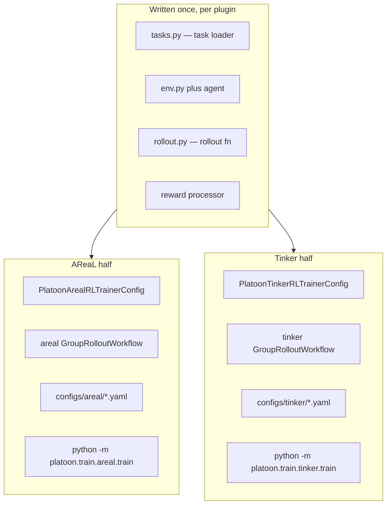

# Choosing a backend

Platoon trains through one of two backends: **AReaL**, which runs on GPUs you control, and
**Tinker**, a hosted training service. This page is the decision — what each one can do, what it
costs you, and exactly which files change if you pick wrong and have to switch.

The short answer to the switching question: **your task code does not change; your training
configuration is rewritten from scratch.** The rest of this page is the detail behind that
sentence.

## What is shared and what is not

Both backends consume the same four things from a plugin: a task loader, a rollout function, an
environment/agent stack, and a reward processor. Neither backend knows anything about your domain.
Everything downstream of "the rollout returned a trajectory tree" is backend-specific.

The cleanest evidence is a plugin that ships both. `deepdive` has two train scripts whose only
real difference is the trainer half:

```python title="plugins/deepdive/platoon/deepdive/train_scripts/areal/train_areal.py"
from platoon.deepdive.rollout import run_recursive_rollout, run_rollout
from platoon.deepdive.tasks import get_task, get_task_ids
from platoon.train.areal import PlatoonArealRLTrainer
from platoon.train.areal.workflows import GroupRolloutWorkflow
```

```python title="plugins/deepdive/platoon/deepdive/train_scripts/tinker/train_tinker.py"
from platoon.deepdive.rollout import run_recursive_rollout, run_rollout
from platoon.deepdive.tasks import get_task, get_task_ids
from platoon.train.tinker.config_defs import PlatoonTinkerRLTrainerConfig
from platoon.train.tinker.rl import PlatoonTinkerRLTrainer
from platoon.train.tinker.workflows import GroupRolloutWorkflow
```

The first two imports are byte-identical, and so are the two scripts' `reward_processor` and
`_select_task_ids` functions. `plugins/textcraft` shows the same split, and its
<span class="pl-src">plugins/textcraft/platoon/textcraft/registry.py</span> registers one set of
components that both backends resolve.



| Piece | Shared | Notes |
| --- | --- | --- |
| Task loader, environment, agent, prompt builders | Yes | Neither trainer imports them directly |
| Rollout function | Yes | Both call `rollout_fn(task, RolloutConfig)` and force `train=True`, `return_dict=True` |
| Reward processor | Yes | `(traj) -> (float, dict[str, float])` on both |
| `RolloutConfig` | Yes | One dataclass, <span class="pl-src">platoon/config_defs.py</span> |
| Sub-agent datum sampling, workload accounting, error filtering | Yes | `platoon/utils/subagent_sampling.py`, `platoon/utils/rollout_workload.py` |
| The `environments:` registry block | Yes | Same `EnvironmentConfig` dataclass, `platoon/train/components.py` |
| Trainer class and root config class | No | `PlatoonArealRLTrainer` vs `PlatoonTinkerRLTrainer` |
| `GroupRolloutWorkflow` | No | Different constructors, different return types |
| The YAML file | No | Disjoint key sets, disjoint loaders |
| Entrypoint / train script | No | Synchronous `with` vs `async with` |
| Trajectory → training data | No | `areal_data_processing.py` (padded tensor dicts) vs `tinker_data_processing.py` (`tinker.Datum`) |

## Comparison

| | AReaL | Tinker |
| --- | --- | --- |
| **Where compute runs** | Your GPUs. SGLang inference engines and FSDP/Megatron train engines live in scheduler-launched worker processes; the trainer process itself owns no GPU. | A hosted service. Platoon runs one `asyncio` client process; sampling, forward/backward and the optimizer step are all remote. |
| **Model access path** | The agent calls LiteLLM with `openai/<actor.path>` against AReaL's OpenAI proxy, which fronts SGLang. Per-rollout session keys; the workflow overwrites `model_endpoint` with the worker-local proxy URL (<span class="pl-src">platoon/train/areal/workflows/group_rollout_workflow.py</span>). | The agent calls LiteLLM with `platoon-tinker/<hf id>`. `register_tinker_llm` installs an in-process LiteLLM `CustomLLM` that renders the prompt with the tinker-cookbook renderer and calls `sampling_client.sample_async` (<span class="pl-src">platoon/train/tinker/proxy.py</span>). |
| **Parallelism** | `actor.backend` and `rollout.backend` are AReaL allocation strings. Train backends `fsdp` and `megatron`, inference backend `sglang`. Dimensions are `d` data, `p` pipeline, `t` tensor, `c` context, `e` expert — e.g. `fsdp:d4p1t1`, `sglang:d12p1t8`, `megatron:(attn:d10p2t4c2\|ffn:d10p2t1e8)`. Platoon dispatches on the `fsdp`/`megatron` prefix in `_create_train_engine` (<span class="pl-src">platoon/train/areal/rl.py</span>). | None exposed. The service decides. The only sizing knobs are `train.batch_size`, `train.num_minibatches` and `train.num_microbatches`. |
| **LoRA** | Optional. Full-parameter is the default; set `actor.use_lora: true` plus `peft_type`, `lora_rank`, `lora_alpha` and `target_modules` (see the 32-node all-layer LoRA config under `plugins/openreward/platoon/openreward/configs/areal/`). | Mandatory. A fresh run always calls `create_lora_training_client_async(model_name, rank=lora_rank)` (<span class="pl-src">platoon/train/tinker/rl.py</span>). `train.lora_rank` defaults to `32`, and every shipped config uses `32`. |
| **Losses** | Local and pluggable. `grpo`, `ppo` and `cispo` ship in `platoon/train/areal/loss_functions.py`; add your own with `@register_loss_fn`. Selected by `loss_fn_config.loss_fn` plus `loss_fn_kwargs`. | Server-side. `train.loss_fn` and `train.loss_fn_config` are forwarded verbatim to `forward_backward_async` (<span class="pl-src">platoon/train/tinker/rl.py</span>); Platoon never sees the loss. Every shipped config uses `cispo` with `clip_low_threshold: 0.0`, `clip_high_threshold: 5.0`. |
| **Checkpointing** | AReaL's `saver:` (weights) and `recover:` (`mode: auto`, `freq_epochs` / `freq_steps` / `freq_secs`) write under `cluster.fileroot`, which must be visible on every node. | `tinker://` state and sampler paths recorded as JSON lines in `<log_path>/<experiment_name>/<trial_name>/checkpoints.jsonl`; cadence from `checkpoint.strategy` and `checkpoint.every`. |
| **Recovery** | Resume from the recovery checkpoint. `StepDeadlineGuard` can drain at a step boundary before an allocation expires and write a JSON marker for the launcher (`PLATOON_TRAINING_DEADLINE_EPOCH`, `PLATOON_TRAINING_DRAIN_FILE`). | A watchdog thread calls `os._exit` on a hang (`watchdog.timeout_seconds`, default `600`). `python -m platoon.train.tinker.restart_wrapper` restarts on that exit code and the trainer resumes from the last checkpoint, W&B run id included. |
| **Multi-node** | Yes. `cluster.n_nodes` and `cluster.n_gpus_per_node`; `scheduler.type: slurm_prealloc` selects `PreallocatedSlurmScheduler`, which launches AReaL worker roles as `srun` steps inside an allocation you already hold. Shipped configs reach 32 nodes × 8 GPUs. | Not applicable — one client process. |
| **Config loader** | `areal.api.cli_args.load_expr_config` (Hydra + OmegaConf). `defaults:` composition and `${...}` interpolation work, and unknown keys are a hard error. | `platoon.utils.config.load_config` — `yaml.safe_load` plus a hand-rolled dataclass hydrator. No composition, no interpolation, and **unknown keys are silently dropped**. |
| **CLI overrides** | `key=value`, no leading dashes: `trial_name=debug-run train_dataset.batch_size=16` | `--dotted.key value` or `--dotted.key=value`: `--train.batch_size 64` |
| **Recursive / sub-agent training** | Yes | Yes |
| **Sub-agent datum sampling** | Yes — the shared `DeterministicSubagentDatumSampler` | Yes — the same sampler |
| **Depth-level weighting** | Yes, trainer-side over the full retained batch | Yes, per microbatch |
| **Evaluation** | Through AReaL's evaluator: `evaluator.freq_epochs` / `freq_steps` / `freq_secs`. When all three are null *and* `evaluator.eval_before_train` is falsy, `_evaluation_enabled` returns `False` and Platoon does not even build the eval rollout controller (<span class="pl-src">platoon/train/areal/rl.py</span>). Roughly half the shipped AReaL configs leave them null. | Built in: an `eval:` block with its own `strategy`, `every`, worker count and `workflow_config`. |
| **Cost model** | You pay for GPUs and hold them for the whole run. Production recipes are four-hour allocations that resubmit successors. | You pay the service for what you use; no local GPU. This repository contains no pricing information for either. |
| **What you need first** | Linux x86_64, NVIDIA GPUs (every shipped AReaL config sets `n_gpus_per_node: 8`; there is no single-GPU config in the repo), a filesystem shared across nodes for `cluster.fileroot`, and `uv sync --extra areal`. Megatron additionally needs Transformer Engine, installed by hand. | A Tinker service credential and `uv sync --extra tinker`. No GPU, no shared filesystem. |

!!! warning "One virtual environment, one backend"

    `tinker` and `areal` are declared a uv `conflicts` group in
    <span class="pl-src">pyproject.toml</span>, and every plugin repeats the declaration. The
    two extras resolve different `torch` builds from different indexes, so they cannot coexist in
    one environment. Switching backends means a fresh `uv sync --extra <backend>`. Plugins are
    standalone uv projects with their own `.venv`, so the choice is made once per plugin
    directory.

!!! warning "The Tinker override parser turns `1` into `True`"

    `_parse_value` (<span class="pl-src">platoon/utils/config.py</span>) checks booleans
    before integers, so `--train.batch_size 1` sets the field to `True` and `--train.num_epochs 0`
    sets it to `False`. There is no way to pass the integers 1 or 0 as a CLI override on the
    Tinker path — put those values in the YAML instead. The AReaL/Hydra path is unaffected.

## Pick AReaL if…

- You need **full-parameter training**, or LoRA on a model the hosted service does not offer.
- The model is **MoE and you want router replay (R3)** — replaying the rollout's expert routes
  during the training forward pass. It is Megatron plus SGLang only, gated by
  `actor.enable_router_replay`.
- Your rollouts need **process isolation**. `workflow_config.use_subprocesses` runs each group
  member in its own spawned process, with straggler reaping (`straggler_timeout_seconds`,
  `straggler_quorum`, `subprocess_shutdown_grace_seconds`) and a group quorum
  (`min_successful_group_size`). Heavyweight environments — AppWorld, OpenHands, Toolathlon —
  depend on this.
- You want to **write your own loss function**. See [Custom loss functions](../customization/loss.md).
- You want **token-efficiency reward shaping**, **zero-variance group rejection**, or reward
  **discounting by `gamma^depth`**.
- You are running **multi-node on Slurm**, or long jobs that must drain cleanly at a walltime
  boundary and resubmit a successor.
- You are training on very long contexts and need **context parallelism** (the `c` dimension in
  the allocation string).

## Pick Tinker if…

- You have **no cluster access**, or do not want to wait for one.
- You are **iterating on the environment, the agent, or the reward** rather than on the optimizer.
  A single client process is far easier to read, run under a debugger, and restart.
- **LoRA is enough** for the experiment you are running.
- You want **evaluation wired in by default** — a separate `eval:` block with its own cadence and
  concurrency, instead of AReaL's evaluator plumbing.
- You want **cheap crash recovery**: the watchdog plus `restart_wrapper` turn a hung service call
  into an automatic resume from the last checkpoint.

## Features that exist on only one backend

Every item in this table is AReaL-only.

| Feature | Config key | Why it is AReaL-only |
| --- | --- | --- |
| Custom loss functions | `loss_fn_config.loss_fn` plus `@register_loss_fn` | The loss runs where the gradient is computed; on Tinker that is inside the service. |
| Router replay (R3) for MoE | `actor.enable_router_replay` | Needs Megatron-Core internals and SGLang route capture. |
| Subprocess-isolated rollouts, straggler reaping, group quorum | `workflow_config.use_subprocesses`, `straggler_*`, `min_successful_group_size` | Not implemented in the Tinker workflow. |
| Token-efficiency reward penalty | `workflow_config.token_efficiency_reward.*` | Not present on the Tinker `WorkflowConfig`. |
| Zero-variance group rejection | `workflow_config.filter_zero_variance_groups` | Same. |
| Depth discounting | `workflow_config.depth_level_discount_gamma` | Same. Tinker has `depth_level_weighting` but not the gamma variant. |
| Full-parameter training; FSDP / Megatron / context parallelism | `actor.backend` | The Tinker path always creates a LoRA training client. |
| Multi-node and preallocated-Slurm scheduling | `cluster.n_nodes`, `scheduler.type: slurm_prealloc` | There is no distributed layer on the Tinker side. |
| Staged environment admission (OpenReward curriculum) | `openreward.environments[].sampling_start_step` | Explicitly rejected by `plugins/openreward/platoon/openreward/tinker_config.py`. |

The exclusivity is not one-sided, but the Tinker-only pieces are fewer and mostly operational
rather than algorithmic:

| Feature | Config key | AReaL counterpart |
| --- | --- | --- |
| Automatic restart and resume after a hang | `watchdog.*` plus `python -m platoon.train.tinker.restart_wrapper` | AReaL's stall watchdog only logs and dumps thread stacks; nothing restarts the process for you. |
| Platoon-side staleness drop | `train.max_staleness`, counter `stale_rollouts` | Staleness on AReaL is upstream's `rollout.max_head_offpolicyness`, enforced by AReaL rather than by Platoon. |
| A first-class evaluation block with its own cadence, concurrency and workflow config | `eval.strategy`, `eval.every`, `eval.workflow_config` | AReaL uses upstream's `evaluator.freq_*` and a deep copy of `workflow_config`. |

Both backends refuse more than one `environments:` entry with `NotImplementedError: Multiple
environments are not yet supported; provide exactly one entry`.

## Moving a plugin from one backend to the other

Take `deepdive`, which ships both. Here is everything that changes.

### 1. The environment

```bash
cd plugins/deepdive
uv sync --extra tinker      # replaces: uv sync --extra areal
```

Tinker needs no local GPU, but this sync still needs Linux. `plugins/deepdive` is one of three
plugin locks that reach `torch 2.11.0+cu129` — a Linux-only wheel — whatever extra you pick, so on
macOS it errors before installing anything. See [installation](installation.md).

### 2. The trainer half of the train script

If the plugin drives the registry entrypoints there is no script — skip to step 3. Otherwise four
things change shape, and none of them touch your task.

=== "AReaL"

    ```python title="plugins/deepdive/platoon/deepdive/train_scripts/areal/train_areal.py"
    config, _ = load_expr_config(args, DeepDiveArealTrainerConfig)

    with PlatoonArealRLTrainer(
        config=config,
        train_dataset=train_dataset,
        val_dataset=val_dataset,
    ) as trainer:
        workflow = GroupRolloutWorkflow(
            rollout_fn,
            get_task,
            config.workflow_config,
            trainer.proxy_base_url,
            trainer.proxy_admin_api_key,
            output_subdir="train_rollout",
            filter_errors=True,
            reward_processor=reward_processor,
        )
        ...
        trainer.train(
            workflow=workflow,
            eval_workflow=eval_workflow,
        )
    ```

=== "Tinker"

    ```python title="plugins/deepdive/platoon/deepdive/train_scripts/tinker/train_tinker.py"
    config, _ = load_config(
        args=args,
        config_class=DeepDiveTinkerTrainerConfig,
        default_config_path=str(default_config),
    )

    trainer = PlatoonTinkerRLTrainer(
        config=config,
        train_dataset=train_dataset,
        eval_dataset=eval_dataset,
    )

    async with trainer:
        train_workflow = GroupRolloutWorkflow(
            rollout_fn=rollout_fn,
            get_task_fn=get_task,
            config=config.train.workflow_config,
            model_info=trainer.model_info,
            log_path=trainer.run_log_path,
            stats_scope="train",
            filter_errors=True,
            reward_processor=reward_processor,
        )
        ...
        await trainer.train(
            train_workflow=train_workflow,
            eval_workflow=eval_workflow,
        )
    ```

- **Loader.** `load_expr_config(args, ConfigClass)` becomes `load_config(args=...,
  config_class=..., default_config_path=...)`.
- **Argument name.** `val_dataset=` becomes `eval_dataset=`.
- **Context manager.** A synchronous `with` becomes `async with`, and `trainer.train(...)` becomes
  `await trainer.train(...)` inside `asyncio.run`.
- **Workflow constructor.** `(proxy_base_url, proxy_admin_api_key, output_subdir=...)` becomes
  `(model_info=..., log_path=..., stats_scope=...)`. `rollout_fn`, `get_task_fn`, `filter_errors`
  and `reward_processor` are identical on both.

The plugin's config subclass exists on both sides holding the same fields:
`DeepDiveArealTrainerConfig` in
<span class="pl-src">plugins/deepdive/platoon/deepdive/areal_config.py</span> extends
`PlatoonArealRLTrainerConfig`, while `DeepDiveTinkerTrainerConfig` is declared inline in the Tinker
script and extends `PlatoonTinkerRLTrainerConfig`. Both add `recursive`, `train_split`,
`eval_split`, `train_num_tasks`, `eval_num_tasks` and `seed`.

!!! note "A subclassed config forces you off the registry entrypoint"

    `platoon/train/tinker/train.py` hard-codes `config_class=PlatoonTinkerRLTrainerConfig`, and
    `platoon/train/areal/train.py` hard-codes `PlatoonArealRLTrainerConfig`. Neither reads
    `environments[0].trainer_config`. A plugin that needs extra top-level config keys must keep
    its own train script on both backends.

### 3. The config file

This is the real work: the two YAMLs share no structure. Compare
<span class="pl-src">plugins/deepdive/platoon/deepdive/configs/areal/deepdive_areal.yaml</span>
with
<span class="pl-src">plugins/deepdive/platoon/deepdive/configs/tinker/deepdive_tinker.yaml</span>.

| Concept | AReaL key | Tinker key |
| --- | --- | --- |
| Model | `actor.path: Qwen/Qwen3-4B-Instruct-2507` | `train.model_name: Qwen/Qwen3-4B-Instruct-2507` |
| Prompt formatting | Implicit — SGLang's chat template, plus `rollout.agent.tool_call_parser` | `train.renderer_name: qwen3_instruct` (plus `train.renderer_kwargs`) |
| Tokenizer | `tokenizer_path: ${actor.path}` | none — derived from `train.model_name` |
| Tasks per step | `train_dataset.batch_size: 16` | `train.batch_size: 16` |
| Rollouts per task | `workflow_config.group_size: 8` | `train.workflow_config.group_size: 4` |
| Optimizer steps per batch | `actor.ppo_n_minibatches: 1` | `train.num_minibatches: 1` |
| Gradient accumulation | `actor.mb_spec.max_tokens_per_mb: 40000` (token-budgeted) | `train.num_microbatches: 1` (count-based) |
| Learning rate | `actor.optimizer.lr: 3e-6` | `train.optimizer.learning_rate: 3e-5` |
| Gradient clipping | `actor.optimizer.gradient_clipping: 1.0` | `train.optimizer.grad_clip_norm: 1e12` (a huge value logs `grad_norm` without really clipping) |
| Loss | `loss_fn_config.loss_fn` plus `loss_fn_kwargs` | `train.loss_fn` plus `train.loss_fn_config` |
| Staleness | `rollout.max_head_offpolicyness: 3` | `train.max_staleness: 3` |
| Rollout concurrency | `rollout.max_concurrent_rollouts: 8` | `train.num_concurrent_rollout_workflow_workers: 8` |
| Run length | `total_train_epochs: 10` | `train.num_epochs: 10` and `train.max_training_steps: 100` (the smaller wins) |
| Per-rollout agent settings | `workflow_config.rollout_config` | `train.workflow_config.rollout_config` — **the same `RolloutConfig` dataclass** |
| Evaluation | `evaluator.freq_steps` plus `valid_dataset` | `eval.strategy` / `eval.every` / `eval.workflow_config` |
| Checkpoints | `saver.*` and `recover.*` under `cluster.fileroot` | `checkpoint.strategy` / `checkpoint.every` under `log_path` |
| Run naming | `experiment_name`, `trial_name` at top level | `stats.experiment_name`, `stats.trial_name` |
| W&B | `stats_logger.wandb.*` | `stats.wandb.*` |
| Hardware and engines | `cluster.*`, `actor.backend`, `rollout.backend`, `sglang.*`, `scheduler.*`, the whole `ref:` block | *nothing — delete all of it* |
| LoRA | `actor.use_lora` plus `lora_rank` / `lora_alpha` / `target_modules` | `train.lora_rank` (always on) |
| Plugin-specific keys | `recursive`, `train_split`, … at top level | identical, also at top level |

`workflow_config.rollout_config` is the one block that survives a migration intact, because both
backends read `platoon.config_defs.RolloutConfig`. Drop `model_name`, `model_endpoint`,
`model_api_key`, `train` and `return_dict` on the way across — both workflows overwrite all five.

Also expect to retune. The two shipped `deepdive` configs are not the same experiment: the AReaL
one uses `group_size: 8` and `lr: 3e-6` on full-parameter FSDP, the Tinker one `group_size: 4` and
`learning_rate: 3e-5` on a rank-32 adapter. A learning rate that works for full-parameter training
is usually an order of magnitude too small for LoRA.

### 4. The command

=== "AReaL"

    ```bash
    cd plugins/deepdive
    uv run python platoon/deepdive/train_scripts/areal/train_areal.py \
      --config platoon/deepdive/configs/areal/deepdive_areal.yaml \
      trial_name=debug-run \
      train_dataset.batch_size=8
    ```

=== "Tinker"

    ```bash
    cd plugins/deepdive
    uv run python -m platoon.deepdive.train_scripts.tinker.train_tinker \
      --config platoon/deepdive/configs/tinker/deepdive_tinker.yaml \
      --train.batch_size 8
    ```

Override syntax is the easiest thing to get wrong: Hydra `key=value` on AReaL, argparse
`--dotted.key value` on Tinker. Getting it backwards on AReaL raises a Hydra error; getting it
backwards on Tinker silently ignores the argument.

### If the plugin is registered

`textcraft` registers its components once for both backends, so migrating is a config swap with no
Python at all. This block is valid, unchanged, in both an AReaL YAML and a Tinker YAML:

```yaml title="plugins/textcraft/platoon/textcraft/configs/tinker/textcraft_synth_depth_aware_tinker.yaml"
environments:
  - package: platoon.textcraft.registry
    dataset_loader: textcraft/synth
    eval_dataset_loader: textcraft/synth
    task_loader: textcraft/synth
    rollout: textcraft/synth/depth_aware
    reward_processor: textcraft/synth/delegation_capped
    workflow: group_rollout
```

The shared entrypoints consume it:

```bash
uv run python -m platoon.train.areal.train  --config <areal-config.yaml>
uv run python -m platoon.train.tinker.train --config <tinker-config.yaml>
```

!!! note "The registry path is new and not yet the norm"

    Today exactly one committed YAML in the repository carries an `environments:` block
    (`plugins/textcraft/platoon/textcraft/configs/tinker/textcraft_synth_depth_aware_tinker.yaml`),
    and its sibling train script builds the components by hand, so even that block is inert on
    that path. Every other plugin still runs its own `train_*.py`. Both routes are supported:
    write new plugins against the registry, and expect to read a per-plugin script when you open
    an existing one. See [The component registry](../architecture/registry.md).

## Can you keep both?

Yes, at the plugin level. Keep `configs/areal/` and `configs/tinker/` side by side, with two thin
train scripts or one registry module and two YAMLs. That is the layout in every dual-backend plugin
except `number-search` and `codegrep`, which are older and keep their YAMLs and both train scripts
flat at the package root. What you cannot do is install both extras into one virtual environment.

A common working pattern: develop the environment and the reward against a hosted endpoint with no
trainer at all ([Evaluate a model endpoint](../tutorials/inference.md)), promote to Tinker for the
first real RL signal, then port to AReaL when you need full-parameter training or scale.

## See also

- [Installation](installation.md) — the extras, the conflict rule, and the Transformer Engine story
- [The AReaL backend](../architecture/areal.md) — the trainer loop, the patches, and the scheduler
- [The Tinker backend](../architecture/tinker.md) — the proxy, the async pipeline, and the watchdog
- [Configuration reference](../reference/configuration.md) — every key on both trees
- [How configuration is loaded](../architecture/config.md) — the two loaders in detail
- [Parallelism recipes](../recipes/parallelism.md) — reading and writing AReaL allocation strings
- [Multi-node training](../tutorials/multi-node.md) — preallocated Slurm end to end
- [Custom loss functions](../customization/loss.md) — the AReaL-only extension point
