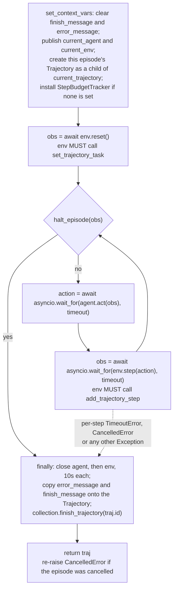
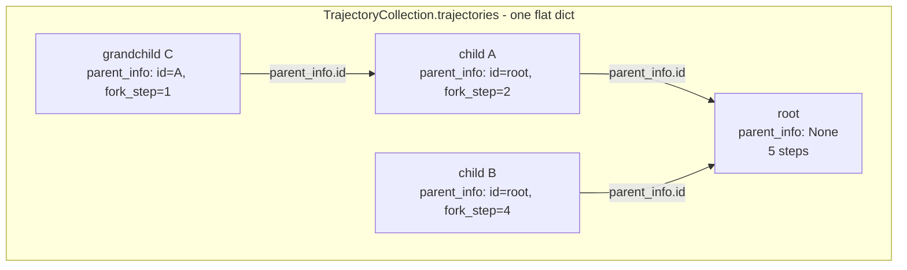

# Core concepts

Platoon has a small vocabulary that almost every other page on this site assumes. Each section below
gives the definition, the real signature from the source tree, and when you will touch it.

The core is deliberately tiny. An **environment** produces observations and consumes actions, an
**agent** turns an observation into an action, and `run_episode` is a five-line loop that alternates
the two. Everything else — who the current agent is, which trajectory is being recorded into, how
much step budget is left — lives in **context variables** rather than in function arguments. That
one decision is what makes recursive agents cheap, and it is the concept most likely to surprise
you.

## Task and SubTask

A `Task` is the unit of work handed to one episode. `misc` is free-form and carries whatever the
environment needs to construct itself.

```python title="platoon/envs/base.py"
@dataclass
class Task:
    goal: str | None = None
    id: str | None = None
    max_steps: int | None = None
    misc: dict[str, Any] = field(default_factory=dict)
    fork_strategy: Literal["task", "subtask"] = "subtask"
```

`max_steps` is load-bearing: the default budget tracker reads `traj.task.max_steps`, and `None`
means an infinite budget.

`Task.__str__` is what the model actually reads:

```python title="platoon/envs/base.py"
    def __str__(self) -> str:
        if self.max_steps:
            return f"Your Goal: {self.goal}\nBudget: You have a total budget of {self.max_steps} steps to complete this task."
        else:
            return f"Your Goal: {self.goal}"
```

### Forking a task

`Task.fork(goal, max_steps=None, task_misc=None)` derives a child task when an agent delegates. It
branches on `fork_strategy`:

| `fork_strategy` | Returns | Ancestry |
| --- | --- | --- |
| `"subtask"` (default) | `SubTask` with `parent_tasks=[self]` | Full parent chain rendered into the child's prompt |
| `"task"` | plain `Task`, fresh uuid `id`, same `fork_strategy` | None — the child sees only its own goal |

Both branches mint a fresh `id`, and both default `task_misc` to the **parent's** `misc` object when
the caller passes `None` — the child and parent then share one dict unless the environment copies
it.

`SubTask` adds one field and overrides `__str__`:

```python title="platoon/envs/base.py"
@dataclass
class SubTask(Task):
    parent_tasks: list[Task] = field(default_factory=list)

    def __str__(self) -> str:
        task_str = super().__str__()
        # Parent Tasks
        parent_tasks_str = (
            "For additional context, here are the parent tasks in the stack so far (most recent first):\n"
        )
        depth = len(self.parent_tasks)
        if depth > 0:
            # Add parent goals in reverse order (most recent first)
            for i, parent_task in enumerate(reversed(self.parent_tasks)):
                level = depth - i
                parent_tasks_str += f"Level {level}: {parent_task.goal}\n\n"
            parent_tasks_str = parent_tasks_str.rstrip()
        else:
            parent_tasks_str += "No parent tasks. This is the root task."

        return f"{task_str}\n\n{parent_tasks_str}"
```

So a depth-2 subtask renders as:

```text
Your Goal: <child goal>
Budget: You have a total budget of 15 steps to complete this task.

For additional context, here are the parent tasks in the stack so far (most recent first):
Level 2: <immediate parent goal>

Level 1: <root goal>
```

That block is injected into the first user turn, so `fork_strategy` is a *prompt* decision, not just
bookkeeping. Choose `"task"` when the subgoal is self-contained and the ancestry would be noise —
TextCraft sets `task.fork_strategy = "task"` in its environment constructor, as does Oolong. Keep
the default `"subtask"` when the child needs to know why it was asked.

!!! warning "`SubTask.fork` ignores `fork_strategy`"
    `SubTask.fork` always returns another `SubTask` and appends itself to the chain
    (`parent_tasks=self.parent_tasks + [self]`). Once a task becomes a `SubTask`, the whole subtree
    below it is `SubTask`s, and setting `fork_strategy="task"` on it has no effect. Set the strategy
    on the root task.

**When you touch it:** writing a task loader, writing an environment constructor that reads
`task.misc`, or deciding what a delegated child should see.

## Observation and Action

```python title="platoon/envs/base.py"
@dataclass
class Observation:
    task: Task | None = None
    finished: bool = False
    reward: float = 0.0
    misc: dict = field(default_factory=dict)


Action: TypeAlias = Any
ResetAction: Action = "RESET"
```

`Observation` is a base class you subclass. `CodeActObservation` adds `action_space: str` and
`history: list[CodeActStep]`; the OpenHands plugin defines its own.

`Action` is a `TypeAlias` for `Any`, deliberately: an action is whatever the agent and the
environment in a given pair agree on, and Platoon never inspects it. `run_episode` passes the object
returned by `agent.act` straight to `env.step`. Nothing to register and no schema to satisfy when
you invent an action type; no type checking at that seam either. `CodeActAction` is a dataclass with
`action`, `parsed_code`, `parsed_thought` and `misc`; `OpenHandsAction` wraps a list of SDK events.
Because `Action` is `Any`, `@dataclass class CodeActAction(Action)` is a dataclass subclassing `Any`
— legal, and it inherits nothing.

`ResetAction` is defined but referenced nowhere else in the repository. Treat it as vestigial.

**When you touch it:** defining the contract between a custom agent and a custom environment.

## Env and ForkableEnv

Five members, no base class, no registration decorator. Duck typing plus `@runtime_checkable` is the
whole contract.

```python title="platoon/envs/base.py"
@runtime_checkable
class Env(Protocol):
    async def reset(self) -> Observation: ...

    async def step(self, action: Action) -> Observation: ...

    async def close(self) -> None: ...

    async def observe(self) -> Observation: ...

    @property
    def task(self) -> Task: ...


@runtime_checkable
class ForkableEnv(Env, Protocol):
    async def fork(self, task: Task) -> ForkableEnv:
        """Return an independently closeable child environment.

        Implementations that allocate resources before returning must clean up
        partial allocations if the fork raises, including on cancellation.
        """
```

Two invariants the loop does not enforce but depends on:

1. **`reset()` must register the task on the current trajectory**, with
   `collection.set_trajectory_task(current_trajectory.get().id, task)`. The budget tracker reads
   `traj.task.max_steps`; if the task is never set, `halt_episode` raises an `AttributeError`.
2. **`step()` must append its own step**, with `collection.add_trajectory_step(traj.id, step)`.
   `run_episode` records nothing itself, and budget accounting is `len(traj.steps)`, so an
   environment that forgets this runs until the outer rollout timeout fires.

`observe()` is never called by `run_episode`. It exists so a fork can snapshot parent state
(`CodeActEnv.fork` passes `parent_state=await self.observe()`) and so external tooling can inspect
the environment. `close()` runs from the loop's `finally` under a 10-second timeout, so it must
tolerate being called during cancellation.

`ForkableEnv` adds `fork(task)`, which is what makes an environment usable with subagents. Its
docstring's cleanup requirement is binding: the subagent launcher only closes handles that a `fork`
successfully returned.

**When you touch it:** every new environment. See
[custom environment](../customization/environment.md).

## Agent and ForkableAgent

```python title="platoon/agents/base.py"
@runtime_checkable
class Agent(Protocol):
    async def act(self, obs: Observation) -> Action: ...

    async def reset(self) -> None: ...

    async def close(self) -> None: ...


@runtime_checkable
class ForkableAgent(Agent, Protocol):
    async def fork(self, task: Task) -> ForkableAgent:
        """Return an independently closeable child agent. ..."""
```

!!! warning "`Agent.reset()` is never called by `run_episode`"
    The loop calls `env.reset()`, `agent.act`, `env.step`, `agent.close` and `env.close` — never
    `agent.reset`. It is part of the protocol and implementations define it (`CodeActAgent.reset` is
    a no-op), but do not put per-episode initialization there and expect the loop to run it.

The reference agent is `CodeActAgent`, which asks a model for
`<thought>...</thought><python>...</python>` and returns a `CodeActAction`. A real non-CodeAct agent
is `OpenHandsAgent`, whose entire `fork` is `deepcopy(self)`.

**When you touch it:** custom prompting or a non-CodeAct action space. See
[custom agent](../customization/agent.md).

## The episode loop

`run_episode` is the whole of Platoon's control flow.

```python title="platoon/episode/loop.py"
# NOTE: Call using asyncio.create_task() to make sure edits to contextvars do not leak to parent context
async def run_episode(agent: Agent, env: Env, verbose: bool = False, timeout: int | None = 300) -> Trajectory:
```

The body, stripped of error handling, is five lines:

```python title="platoon/episode/loop.py"
obs = await env.reset()
while not halt_episode(obs):
    action = await asyncio.wait_for(agent.act(obs), timeout=timeout)
    obs = await asyncio.wait_for(env.step(action), timeout=timeout)
    step_count += 1
```



### The three termination conditions

```python title="platoon/episode/loop.py"
def halt_episode(obs: Observation) -> bool:
    exhausted_budget = budget_tracker.get().remaining_budget() <= 0
    if exhausted_budget:
        error_message.set("WARNING: Exhausted budget when running episode. Halting episode; task may be incomplete.")
    if finish_message.get(None) is not None:
        obs.finished = True
    return obs.finished or exhausted_budget
```

1. **The environment says so** — `obs.finished` is `True`.
2. **Something called `finish()`** — `finish_message` is set, which forces `obs.finished = True`
   even if the environment did not notice.
3. **The budget is gone** — `remaining_budget() <= 0`, which also stamps the `WARNING: Exhausted
   budget` string into `error_message`.

Three further exits leave the loop through exceptions rather than through `halt_episode`: the
per-step `asyncio.TimeoutError` (marks `trajectory_timed_out` in `traj.misc`), an outer
`CancelledError` (marks `trajectory_cancelled`, and is **re-raised after cleanup** so an outer
`wait_for` actually sees it), and any other exception. All three record a detailed `error_message`
and still finalize the trajectory, so a partial trajectory always reaches the event sinks.

### The per-step timeout

`timeout` (default `300` seconds) bounds `agent.act` and `env.step` **individually**, not the whole
episode. The whole-rollout deadline is a separate `asyncio.wait_for` in the rollout function, driven
by `RolloutConfig.timeout`. Most plugins pass `run_episode(agent, env, timeout=config.step_timeout)`;
number-search and codegrep call `run_episode(agent, env)` and therefore run at the 300-second
default regardless of what the config says.

### Why `asyncio.create_task`

The `NOTE` in the signature is not decoration. `run_episode` writes to context variables —
`current_trajectory`, `current_agent`, `current_env`, `finish_message`, `error_message`. A coroutine
awaited directly shares its caller's context, so those writes leak upward and a nested episode
clobbers its parent's `current_trajectory`. `asyncio.create_task` copies the context, so a child's
writes stay in the child. That is how `launch_subagent` runs a nested episode with no explicit save
and restore, and why every plugin rollout starts the root episode the same way:

```python title="plugins/number-search/platoon/number_search/rollout.py"
rollout_task = asyncio.create_task(run_episode(agent, env))
```

## Context variables

The most surprising design decision in the codebase, and the one worth understanding first.

```python title="platoon/episode/context.py"
current_agent: ContextVar["Agent"] = ContextVar("current_agent")
current_env: ContextVar["Env"] = ContextVar("current_env")
current_trajectory: ContextVar["Trajectory"] = ContextVar("current_trajectory")
current_trajectory_collection: ContextVar["TrajectoryCollection"] = ContextVar("current_trajectory_collection")
error_message: ContextVar[str | None] = ContextVar("error_message", default=None)
budget_tracker: ContextVar["BudgetTracker"] = ContextVar("budget_tracker")
finish_message: ContextVar[str | None] = ContextVar("finish_message", default=None)
episode_step_timeout: ContextVar[int] = ContextVar("episode_step_timeout", default=300)
subagent_reward_judge_config: ContextVar[object | None] = ContextVar(
    "subagent_reward_judge_config",
    default=None,
)
```

That is the complete list: nine variables, one 22-line module.

### Why not pass the state around

The alternative would be threading an episode-state object through `Env.step`, the environment's
tools, and whatever those tools call. That fails for the case Platoon exists to support: **the code
that needs the state is written by the model at runtime.** In a CodeAct
environment the agent emits a Python cell that executes in an embedded IPython shell. For that cell
to end the episode, or to delegate, the functions it calls need access to episode state — and there
is no call site you control at which you could have passed it.

Context variables solve this because a `ContextVar.set()` performed inside
`shell.run_cell_async(...)` *is* visible to the caller afterwards, a property pinned by
`tests/test_context_var_in_ipshell.py`. So this works, with nothing plumbed:

```python title="platoon/agents/actions/common.py"
def finish(message: str = "") -> str:
    """End the agent trajectory and provide a message to the user.
    ...
    """
    finish_message.set(message)
    return message
```

The model writes `finish("42")`; the contextvar is set from inside the shell; `CodeActEnv.step` sees
it on the way out and marks the observation finished; `halt_episode` stops the loop.

Run the other way, the same mechanism gives isolation: a `set()` inside an
`asyncio.create_task(...)` is *not* visible to the spawner — which is why a subagent calling
`finish()` cannot terminate its parent.

### What that implies for your code

- **Anything you call from inside an environment step can reach episode state.** Your environment's
  Python tools can read `current_trajectory`, set `finish_message`, or `await launch_subagent(...)`
  without receiving a single argument.
- **Recording is your responsibility; addressing is not.** An environment's `step` calls
  `current_trajectory_collection.get().add_trajectory_step(current_trajectory.get().id, step)` — it
  never has to be told which trajectory it is in.
- **Install policy before the episode, not during it.** `set_context_vars` installs a default only
  when a variable is unset, so a rollout that wants a different budget policy sets it first:

    ```python
    budget_tracker.set(DepthAwareStepBudgetTracker(max_depth=6))
    rollout_task = asyncio.create_task(run_episode(agent, env, timeout=config.step_timeout))
    ```

- **Never `await` a nested `run_episode` directly.** Use `asyncio.create_task`, or the child's
  context writes land in yours.
- **Do not set `error_message` for warnings.** `CodeActEnv.step` treats a set `error_message`
  exactly like a set `finish_message` and ends the episode.

## Trajectory, TrajectoryStep, TrajectoryCollection and ParentInfo

A rollout does not produce one trajectory. It produces a **tree** of them, held in one flat
collection.

```python title="platoon/episode/trajectory.py"
@dataclass
class TrajectoryStep:
    misc: dict[str, Any] = field(default_factory=dict)


@dataclass
class ParentInfo:
    id: str
    fork_step: int


@dataclass
class Trajectory:
    id: str
    task: Task | None = None
    parent_info: ParentInfo | None = None
    steps: list[TrajectoryStep] = field(default_factory=list)
    reward: float = 0.0
    finish_message: str | None = None
    error_message: str | None = None
    misc: dict[str, Any] = field(default_factory=dict)
```

`TrajectoryStep` carries only `misc`; everything else comes from subclasses. `CodeActStep` adds
`code`, `thought`, `output`, `error` and `reward`.

```python title="platoon/episode/trajectory.py"
@dataclass
class TrajectoryCollection:
    id: str = field(default_factory=lambda: str(uuid.uuid4()))
    trajectories: dict[str, Trajectory] = field(default_factory=dict)
    event_handlers: list[TrajectoryEventHandler] = field(default_factory=list)
```

The tree exists only as back-pointers: each non-root trajectory's `parent_info` names its parent's
id and the parent's step index at the moment of the fork.



The edge is created in exactly one place. `set_context_vars` passes the *pre-existing*
`current_trajectory` as the parent, and `create_trajectory` turns it into a `ParentInfo`:

```python title="platoon/episode/trajectory.py"
    def create_trajectory(self, parent_traj: Trajectory | None = None) -> Trajectory:
        parent_info = (
            ParentInfo(
                id=parent_traj.id,
                fork_step=len(parent_traj.steps),
            )
            if parent_traj is not None
            else None
        )
```

A nested `run_episode` therefore becomes a child of whatever trajectory was current when it started;
no delegation code builds the tree.

`TrajectoryCollection` also fires four events — `on_trajectory_created`, `on_trajectory_task_set`,
`on_trajectory_step_added`, `on_trajectory_finished` — to every registered
`TrajectoryEventHandler`. Handler exceptions are caught, so a broken sink never breaks a rollout.
That is how the JSONL event stream behind the
[visualization tools](../tutorials/visualization.md) is produced.

`to_dict()` is the single hand-off artifact to reward processing and to both training backends:

```python title="platoon/episode/trajectory.py"
        return {
            "id": self.id,
            "trajectories": {traj_id: _to_jsonable(traj) for traj_id, traj in self.trajectories.items()},
        }
```

It walks dataclass fields by hand instead of calling `dataclasses.asdict()`, because steps can embed
live SDK objects (an OpenHands event holding a `threading.Lock`) that cannot be deep-copied.

!!! note "There is no root flag"
    Downstream code identifies the root as the *first* trajectory in the mapping
    (`next(iter(trajectories))`) and computes depth by walking `parent_info` links. Insertion order
    is the root marker.

**When you touch it:** writing a reward processor, an event sink, or anything that reads a rollout's
output. See [trajectory to batch](../walkthroughs/trajectory-to-batch.md).

## StepBudgetTracker

Budget is a pluggable policy behind a protocol, installed as a context variable.

```python title="platoon/episode/trajectory.py"
@runtime_checkable
class BudgetTracker(Protocol):
    def reserve_budget(
        self,
        requested_budget: float,
        raise_on_failure: bool = False,
        *,
        child_depth_scope: SubagentDepthScope = "policy",
    ) -> bool: ...

    def release_budget(self, amount_to_release: float) -> None: ...

    def remaining_budget(self) -> float:
        return self.remaining_budget_for(current_trajectory.get().id)

    def remaining_budget_for(self, trajectory_id: str) -> float: ...

    def used_budget(self) -> float:
        return self.used_budget_for(current_trajectory.get().id)

    def used_budget_for(self, trajectory_id: str) -> float: ...
```

`StepBudgetTracker` is the default, installed by `set_context_vars` when nothing else is. Its
semantics are **one shared budget for the whole subtree**:

- allocated budget for a trajectory is `traj.task.max_steps`, or infinity when it is `None`;
- used budget is that trajectory's own steps **plus every descendant's steps**;
- `remaining = allocated - used(recursive) - reserved`.

So a root with `max_steps=9` caps its entire delegation tree at nine steps. Before an agent may
delegate, `launch_subagent` calls `reserve_budget(max_steps + 1, raise_on_failure=True)`. The
`+1` is deliberate, and the failure guidance says why:

```python title="platoon/episode/trajectory.py"
                    guidance=(
                        "Note: launch_subagent will automatically reserve max_steps + 1 steps "
                        "since you will need one or more steps to process the result of the "
                        "subagent and complete the task. "
                        "You could try requesting a smaller budget or perform the task yourself."
                    ),
```

A refused reservation is returned to the model as a plain string rather than raised — the agent
reads "Not enough budget to launch subagent..." in its cell output and can adapt.

`DepthAwareStepBudgetTracker` is the alternative. Each trajectory gets its own independent
`max_steps`, `release_budget` is a no-op, and `reserve_budget` ignores the requested amount and
checks only the tree **depth** against `max_depth` (the root is depth 0). Pick it when you want
subagents that do not eat their parent's steps. See [recursive agents](../recipes/recursive.md).

**When you touch it:** choosing a delegation budget policy in a rollout function.

## The rollout function

A rollout is the smallest unit the training loop schedules: one task in, one trajectory tree out.
The contract is two positional arguments.

```python title="platoon/train/components.py"
@runtime_checkable
class RolloutFn(Protocol):
    """Run one rollout for a task and rollout config."""

    def __call__(self, task: Task, config: Any) -> Any: ...
```

In practice the second argument is a `RolloutConfig` — model endpoint and key, `max_steps`,
`timeout`, `step_timeout`, `output_dir`, `inference_params`, and the recursion flags — and the
workflow awaits it as `await asyncio.create_task(self.rollout_fn(task, config.rollout_config))`.

The canonical shape, copied and abridged:

```python title="plugins/number-search/platoon/number_search/rollout.py"
async def run_rollout(task: Task, config: RolloutConfig) -> dict | TrajectoryCollection:
    ...
        env = NumberSearchEnv(task)
        agent = NumberSearchAgent(
            llm_client=llm_client,
            include_reasoning=False,
            inference_params=config.inference_params,
        )
        traj_collection = TrajectoryCollection()
        current_trajectory_collection.set(traj_collection)

        events_path = os.path.join(config.output_dir, "events", f"events_{task.id}_{traj_collection.id}.jsonl")

        traj_collection.register_event_handlers(
            JsonlFileSink(events_path, collection_id=traj_collection.id, process_id=os.getpid())
        )
        ...
        rollout_task = asyncio.create_task(run_episode(agent, env))
        ...
        if config.return_dict:
            return current_trajectory_collection.get().to_dict()
        else:
            return current_trajectory_collection.get()
```

The elided lines hold the whole-rollout deadline,
`await asyncio.wait_for(rollout_task, timeout=config.timeout)`; a rollout that wants a non-default
budget policy also calls `budget_tracker.set(...)` before creating the task. Both training workflows
force `return_dict=True` and `train=True` on the config they hand you, so the dict branch is the one
that runs during training.

**When you touch it:** every new environment needs one. See
[custom rollout](../customization/rollout.md).

## Workflow, group and group_size

A **workflow** is the backend-side object that turns one dataset row into training data. The default
for both backends is `GroupRolloutWorkflow`, whose docstring states the job:

```python title="platoon/train/tinker/workflows/group_rollout_workflow.py"
class GroupRolloutWorkflow:
    """Workflow that runs multiple rollouts per task and computes group-centered advantages.

    1. Runs `group_size` rollouts for each task in parallel
    2. Collects training data from each rollout
    3. Computes group-centered advantages (reward - mean_reward)
    4. Returns training data in tinker.Datum format
    """
```

A **group** is `group_size` independent rollouts of the *same task*, gathered concurrently:

```python title="platoon/train/areal/workflows/group_rollout_workflow.py"
            raw_processed_results = await asyncio.gather(
                *[self._arun_episode_single(engine, data, i) for i in range(self.config.group_size)]
            )
```

The group exists for one reason: **a within-task baseline**. Rather than learning a value function,
the workflow subtracts the group's mean root reward — or, with `leave_one_out_baseline: true`, each
member's leave-one-out mean — from every datum's reward. That is the GRPO-style control variate.

- The baseline is computed from **root rewards only**, but subtracted from *every* datum in the
  tree. That is how a subagent's tokens inherit credit from the root outcome.
- Groups that cannot support a baseline are rejected. On the AReaL path a group with fewer than
  `min_successful_group_size` usable members is dropped, and a group whose retained rewards have no
  variance is dropped when `filter_zero_variance_groups` is set (default `True`). Both keys are
  AReaL-only; the Tinker `WorkflowConfig` does not define them.

Defaults differ by backend: `group_size` is `1` in the AReaL `WorkflowConfig` and `8` in the Tinker
one. A group of size 1 gives a baseline equal to the member's own reward, which centers every
advantage to zero — set it above 1 for any real training run.

**When you touch it:** tuning `workflow_config` in a training YAML. See
[training run](../walkthroughs/training-run.md) and
[group rollout workflow](../walkthroughs/group-rollout-workflow.md).

## The registry and the `environments` block

The registry is a process-local name-to-object map, about 170 lines with no framework machinery.
`get_registry(kind)` lazily creates one `Registry` per kind, and six decorators wrap it:
`register_dataset_loader`, `register_task_loader`, `register_rollout`, `register_reward_processor`,
`register_workflow` and `register_trainer_config`. A seventh kind, `"loss"`, is built directly on
`get_registry("loss")` by the AReaL loss-functions module.

Resolution is deliberately forgiving:

```python title="platoon/registry.py"
    def resolve(self, spec: str | T) -> T:
        """Resolve a registry name, import path, or already-materialized value."""

        if isinstance(spec, str):
            if spec in self._items:
                return self.get(spec)
            return import_from_string(spec)
        return spec
```

A spec that is not a registered name is treated as a dotted import path, so you can extend Platoon
**without registering anything**: `rollout: my_pkg.rollout.run_rollout` in a config is imported as
written.

The public wiring surface is the top-level `environments:` list, one `EnvironmentConfig` per entry.
Both trainer configs default to a single empty entry and raise `NotImplementedError` for more than
one:

```yaml title="plugins/textcraft/platoon/textcraft/configs/tinker/textcraft_synth_depth_aware_tinker.yaml"
environments:
  - package: platoon.textcraft.registry
    trainer_config: textcraft/synth/tinker
    dataset_loader: textcraft/synth
    eval_dataset_loader: textcraft/synth
    task_loader: textcraft/synth
    rollout: textcraft/synth/depth_aware
    reward_processor: textcraft/synth/delegation_capped
    workflow: group_rollout
    dataset_kwargs:
      difficulties: ["medium"]
```

`package` is imported purely for its registration side effects: the module body runs its
`@register_*` decorators. `workflow: group_rollout` is a sentinel string, not a registry entry — it
selects the backend's own default workflow class. With that block in place, a new environment is a
YAML file for the shared entrypoints `python -m platoon.train.areal.train` and
`python -m platoon.train.tinker.train` rather than a new training script.

!!! warning "This branch is mid-migration"
    The registry and the `Auto*` factory layer are new. Today `plugins/textcraft` is the only plugin
    that registers components, and the config above is the only live YAML that uses `environments:`.
    Every other plugin still ships its own `train_*.py` script. Treat the registry as the forward
    path, and expect to read a per-plugin script for anything else.

!!! danger "Two different `environments:` keys"
    The top-level `environments:` described here is registry wiring. Some openreward configs have a
    *nested*, plugin-local `environments:` under their own config section, with fields like `label`,
    `env_name` and `sampling_weight` — that is an environment-mixture list and is unrelated. Check
    the indentation before you read one as the other.

**When you touch it:** packaging your plugin so a trainer can find it. See
[the registry](../architecture/registry.md) and [packaging](../customization/packaging.md).

## Glossary

| Term | What it is | Where it lives |
| --- | --- | --- |
| `Task` | Goal, id, `max_steps`, `misc`, `fork_strategy` | <span class="pl-src">platoon/envs/base.py</span> |
| `SubTask` | `Task` plus `parent_tasks`; renders ancestry into the prompt | <span class="pl-src">platoon/envs/base.py</span> |
| `Observation` | `task`, `finished`, `reward`, `misc`; subclassed per environment | <span class="pl-src">platoon/envs/base.py</span> |
| `Action` | `TypeAlias` for `Any` — whatever the agent/env pair agrees on | <span class="pl-src">platoon/envs/base.py</span> |
| `Env` / `ForkableEnv` | `reset`, `step`, `close`, `observe`, `task`, plus `fork` | <span class="pl-src">platoon/envs/base.py</span> |
| `Agent` / `ForkableAgent` | `act`, `reset`, `close`, plus `fork` | <span class="pl-src">platoon/agents/base.py</span> |
| `run_episode` | The agent/env loop; per-step `timeout`, default 300s | <span class="pl-src">platoon/episode/loop.py</span> |
| `halt_episode` | The three termination conditions | <span class="pl-src">platoon/episode/loop.py</span> |
| `set_context_vars` | Publishes context vars and creates the episode's trajectory | <span class="pl-src">platoon/episode/loop.py</span> |
| Context variables | `current_agent`, `current_env`, `current_trajectory`, `current_trajectory_collection`, `budget_tracker`, `finish_message`, `error_message`, `episode_step_timeout`, `subagent_reward_judge_config` | <span class="pl-src">platoon/episode/context.py</span> |
| `finish(message)` | Ends the episode by setting `finish_message` | <span class="pl-src">platoon/agents/actions/common.py</span> |
| `launch_subagent` | Forks agent and env, runs a nested episode, returns a string | <span class="pl-src">platoon/agents/actions/subagent.py</span> |
| `TrajectoryStep` | Base step, only `misc`; `CodeActStep` adds code/thought/output/error/reward | <span class="pl-src">platoon/episode/trajectory.py</span> |
| `ParentInfo` | Parent trajectory `id` plus the `fork_step` index | <span class="pl-src">platoon/episode/trajectory.py</span> |
| `Trajectory` | One episode's record: task, steps, reward, messages, misc | <span class="pl-src">platoon/episode/trajectory.py</span> |
| `TrajectoryCollection` | Flat `dict[id, Trajectory]`, event handlers, `to_dict()` | <span class="pl-src">platoon/episode/trajectory.py</span> |
| `TrajectoryEventHandler` | The four `on_trajectory_*` sink callbacks | <span class="pl-src">platoon/episode/trajectory.py</span> |
| `BudgetTracker` | Protocol: `reserve_budget`, `release_budget`, `remaining_budget` | <span class="pl-src">platoon/episode/trajectory.py</span> |
| `StepBudgetTracker` | Default; one shared budget across the whole subtree | <span class="pl-src">platoon/episode/trajectory.py</span> |
| `DepthAwareStepBudgetTracker` | Per-trajectory budgets, capped tree depth | <span class="pl-src">platoon/episode/trajectory.py</span> |
| `RolloutConfig` | The second argument to every rollout function | <span class="pl-src">platoon/config_defs.py</span> |
| `RolloutFn` | `(task, config)` to a trajectory tree | <span class="pl-src">platoon/train/components.py</span> |
| `EnvironmentConfig` | One entry of the top-level `environments:` list | <span class="pl-src">platoon/train/components.py</span> |
| `GroupRolloutWorkflow` | Runs `group_size` rollouts per task, centers advantages | <span class="pl-src">platoon/train/tinker/workflows/group_rollout_workflow.py</span> |
| `Registry` | Name-to-object map with a dotted-import fallback | <span class="pl-src">platoon/registry.py</span> |

## Next

- [Backends](backends.md) — what AReaL and Tinker each expect from these pieces.
- [Your first task](first-task.md) — put the vocabulary to work.
- [Agents and environments](../architecture/agents-envs.md) — the protocols in depth.
- [Subagents](../architecture/subagents.md) — the delegation lifecycle end to end.
- [Configuration reference](../reference/configuration.md) — every key, with defaults.
