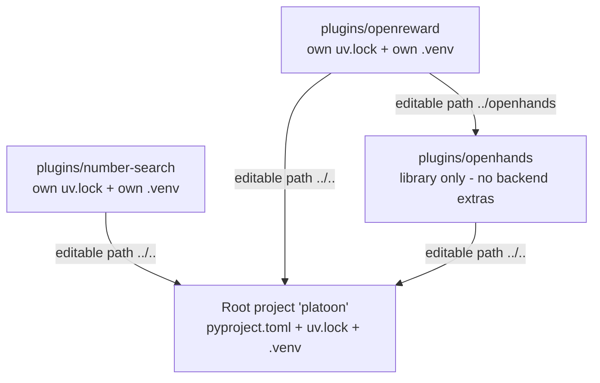

# Installation

Platoon is not a single installable package. It is a repository of `uv` projects: one root project
that holds the framework, and one independent project per plugin under `plugins/`. This page covers
the full install — prerequisites, the two mutually exclusive training backends, the per-plugin venv
model, credentials, the Megatron / Transformer Engine detour, and how to check that what you
installed actually works.

If you only want to get something running, [Quickstart](quickstart.md) is shorter. Come back here
when an install fails or when you need the Megatron backend.

## Prerequisites

| | Requirement | Why |
| --- | --- | --- |
| **Python** | 3.12.x, exactly | Every project declares `requires-python = "~=3.12.0"`, and the lockfiles are resolved for `requires-python = "==3.12.*"` |
| **Package manager** | [`uv`](https://docs.astral.sh/uv/) | The `areal` extra resolves from a git revision, which pip cannot install from `pyproject.toml`. The extras, conflict rules and `override-dependencies` are all `[tool.uv]` keys that pip ignores |
| **OS for AReaL training** | Linux x86_64 with NVIDIA GPUs | The CUDA pins in the overrides — `nvidia-cudnn-cu12`, `megatron-core`, `flash-attn` — all carry the marker `sys_platform == 'linux' and platform_machine == 'x86_64'` |
| **OS for everything else** | Linux; macOS only for some plugins | Several plugin lockfiles pin `torch 2.11.0+cu129`, which ships Linux wheels only — see the note below |
| **GPUs for Tinker** | None | Tinker is a remote training service |

!!! warning "Several plugin lockfiles do not resolve on macOS"

    Even with no backend extra, `uv sync` inside `plugins/textcraft`, `plugins/deepdive` or
    `plugins/email-search` fails on macOS:

    ```
    error: Distribution `torch==2.11.0+cu129` can't be installed because it doesn't have a
    source distribution or wheel for the current platform
    ```

    Those locks pin a CUDA build of torch that publishes `manylinux` wheels only, and the pin
    reaches them transitively even though the inference path imports neither torch nor a backend.
    `uv sync --extra tinker` fails the same way in those three directories, so the GPU-free backend
    is not a way around it. `plugins/oolong` and `plugins/number-search` do resolve on macOS, with
    or without `--extra tinker`, and every plugin resolves on Linux.

    This is a lockfile artifact rather than a real requirement of those plugins. If you work on a
    Mac, either use one of the two plugins that resolve, or run in a Linux container.

There is no `.python-version` file in the repository. `uv python install 3.12` (what CI does) or any
3.12 interpreter on `PATH` is enough.

!!! note "You do not need a GPU to develop"

    Environments, agents, rollout functions, reward processors and the visualization tooling all
    run against an OpenAI-compatible endpoint. Write and debug your task that way first; see
    [Evaluate a model endpoint](../tutorials/inference.md).

## Install the framework

From the repository root:

```bash
uv sync
```

That gives you the core dependencies from `[project.dependencies]` — `ai-rubric`, `datasets`,
`fastapi[standard]`, `ipython`, `litellm`, `pandas`, `pyarrow`, `rich`, `textual`, `notebook`,
`tenacity`, `tensordict`, `wandb` — plus the `dev` dependency group (`mypy`, `pre-commit`,
`pytest`, `pytest-asyncio`, `ruff`). CI spells the group out as `uv sync --dev`.

Note what is *not* there: no torch, no AReaL, no Tinker. That is deliberate. CI installs no backend
extra at all and still runs the whole test suite, so anything imported by `tests/` must import
without a training backend present.

## Choose exactly one training backend

The framework ships two backends as optional extras, and you install one of them:

=== "AReaL"

    ```bash
    uv sync --extra areal
    ```

    Pulls `areal[cuda]` from a pinned git revision plus classic FlashAttention-2 on Linux x86_64:

    ```toml title="pyproject.toml"
    areal = [
        "areal[cuda]",
        # AReaL HEAD dropped its classic flash-attn (FA2) dependency in favour of
        # flash-attn-4 (used by sglang for inference). transformers' default
        # attn_implementation='flash_attention_2' for the FSDP training path still needs
        # classic FA2, so re-declare it here. It coexists with flash-attn-4 (FA4 only
        # owns flash_attn/cute/*; FA2 owns flash_attn/__init__.py + the FA2 kernels) and
        # is built from sdist via tool.uv.no-build-isolation-package below.
        "flash-attn==2.8.3; sys_platform == 'linux' and platform_machine == 'x86_64'",
    ]
    ```

    AReaL itself is pinned by commit, not by version:

    ```toml title="pyproject.toml"
    [tool.uv.sources]
    areal = { git = "https://github.com/inclusionAI/AReaL.git", rev = "d99124ec15102ca2fcd4960cc8beaef3950c2672" }
    ```

    On Linux x86_64 this resolves `torch 2.9.1+cu129` from
    `https://download.pytorch.org/whl/cu129`. FlashAttention-2 is built from an sdist against the
    venv's torch, which is why `flash-attn` appears in `no-build-isolation-package`. Expect the
    first sync to take a while.

=== "Tinker"

    ```bash
    uv sync --extra tinker
    ```

    ```toml title="pyproject.toml"
    tinker = [
        "tinker==0.16.1",
        "tinker-cookbook @ git+https://github.com/thinking-machines-lab/tinker-cookbook.git@0be951bd38eb83c4363c1d11caddf4388bf05262",
    ]
    ```

    No local GPU is involved: training runs on the Tinker service and your process only builds
    batches and submits them. `tinker-cookbook` does pull torch (`2.11.0+cu129` on Linux,
    `2.10.0` elsewhere) for tokenizer and data utilities.

Which one to pick is a real decision with consequences beyond installation —
[Choosing a backend](backends.md) covers it.

### Why the two are mutually exclusive

The root project declares them a `uv` conflict group:

```toml title="pyproject.toml"
[tool.uv]
# tinker and areal backends are mutually exclusive
conflicts = [
    [
        { extra = "tinker" },
        { extra = "areal" },
    ],
]
```

This is not a policy choice about "one backend at a time". It is a statement of fact about the
dependency graphs. The pinned AReaL revision resolves `torch 2.9.1+cu129`; `tinker-cookbook`
resolves `torch 2.11.0+cu129` on Linux. One environment cannot hold two versions of torch, and the
same collision repeats further down the stack, between SGLang's exact pins and what litellm and the
cookbook want.

Without the `conflicts` declaration, `uv lock` would have to find a single resolution satisfying
both extras simultaneously — which does not exist — and would fail outright. With it, uv forks the
resolution on the extras and records both branches in one `uv.lock`. You can see the fork in the
lockfile's `resolution-markers`, which are written in terms of `extra == 'extra-7-platoon-areal'`
and `extra == 'extra-7-platoon-tinker'`.

The practical consequence: `uv sync --extra areal --extra tinker` is rejected, and switching
backends means re-syncing, not adding.

!!! warning "`pip install -e '.[areal]'` does not work"

    `pyproject.toml` says so directly: *"areal backend requires uv for installation (not available
    on PyPI)"*. The git source pin lives under `[tool.uv.sources]`, which pip does not read, and
    the fourteen `override-dependencies` that make the stack co-resolvable are also uv-only.
    `uv pip install -e ".[areal]"` works because it is still uv.

## Install a plugin

Every plugin is its own uv project with its own lockfile and its own virtual environment. You
install one by changing into it:

```bash
cd plugins/number-search
uv sync --extra areal        # or: uv sync --extra tinker
```

That creates `plugins/number-search/.venv`, and every command for that plugin is run from that
directory with `uv run`.

### Why per-plugin projects rather than a workspace

There is no `[tool.uv.workspace]` anywhere in the repository. Each plugin depends on the framework
through an editable path source:

```toml title="plugins/number-search/pyproject.toml"
[tool.uv.sources]
platoon = { path = "../..", editable = true }
```



Two things follow, and both are the point of the design.

**Plugins with incompatible dependency stacks stay out of each other's way.** `appworld` forces
`numpy<2.3` because numba needs it. `openreward` and `codegrep` force `rich==14.3.1` because
OpenHands' browser tooling needs rich 14 while AReaL's litellm pin wants rich below 14. `openreward`
additionally replaces the whole OpenHands SDK stack with a fork pinned by commit. None of these can
coexist in a single resolution, and none of them has to.

**The `platoon` package is a namespace that merges across projects.** The entire mechanism is three
lines:

```python title="platoon/__init__.py"
from pkgutil import extend_path

__path__ = extend_path(__path__, __name__)
```

`extend_path` rescans `sys.path` for every directory named `platoon` and appends it to the package's
`__path__`. Because the plugin venv contains both the plugin's own `plugins/<name>/platoon/` tree and
the root's `platoon/` tree, `import platoon.number_search` and `import platoon.train.areal` both
resolve inside the same interpreter even though they live in different projects on disk. A plugin's
`platoon/` directory therefore must not have an `__init__.py`, and the importable module name uses
underscores (`platoon.number_search`) where the directory uses hyphens (`plugins/number-search`).

### What each plugin adds

| Plugin | Backend extras | Notable extra dependencies |
| --- | --- | --- |
| `number-search` | `tinker`, `areal` | none — the minimal case |
| `textcraft` | `tinker`, `areal` | its `areal` extra also pins five `nvidia-*-cu12` runtime wheels; the only plugin declaring a `platoon.plugins` entry point |
| `appworld` | `tinker`, `areal` | `appworld` from a pinned git rev with `lfs = true`; override `numpy<2.3` |
| `oolong` | `tinker`, `areal` | `datasets>=2.0.0` |
| `deepdive` | `tinker`, `areal` | `datasets>=2.0.0`, `tavily-python>=0.7.23` |
| `email-search` | `tinker`, `areal` | `datasets>=2.0.0`, `tqdm>=4.67.0` |
| `codegrep` | `tinker`, `areal` | `platoon-openhands` via `../openhands`; override `rich==14.3.1` |
| `openreward` | `tinker`, `areal` | `openreward>=0.1.43`, `mcp>=1.0.0`, `platoon-openhands`; the OpenHands SDK forced to the `ApGa/openhands-agent-sdk` fork at `1.29.0`; `[tool.uv] environments` narrows the lock to darwin/arm64 and linux/x86_64 |
| `openhands` | **none** | A library wrapper around the OpenHands SDK, consumed by `codegrep` and `openreward` |

!!! warning "`plugins/openhands` has no backend extras"

    `uv sync --extra areal` inside `plugins/openhands` fails — that project declares no
    `[project.optional-dependencies]` and no `conflicts` block. It is a dependency of other
    plugins, not something you train from. It also carries a stray `no-build-isolation-package`
    key directly under `[project]`, which is not a valid PEP 621 field; the effective copy is the
    one under `[tool.uv]`.

### Every project re-declares the same overrides

Open any plugin's `pyproject.toml` and you will find the same fourteen-entry
`override-dependencies` block copied from the root, with this comment:

```toml title="plugins/oolong/pyproject.toml"
override-dependencies = [
    # Mirror AReaL HEAD's own override-dependencies; uv only honours overrides from the
    # root project, so each lockable project must re-declare them. Plain pins (fastapi,
    # datasets, wandb, ...) live in platoon's [project.dependencies] and arrive transitively.
```

uv only applies `override-dependencies` declared by the *root of the current resolution*. When you
run `uv sync` inside `plugins/oolong`, that plugin is the root and the framework's overrides are
invisible. Duplication is the only way to keep each lock resolvable. If you add a plugin, copy the
block verbatim — see [Packaging a plugin](../customization/packaging.md).

What the overrides do, in brief:

| Override | Reason |
| --- | --- |
| `openai>=2.8.0`, `soundfile>=0.12.1,<0.13.0` | litellm's proxy extra versus SGLang 0.5.10.post1's exact pins |
| `torchao==0.15.0` | SGLang pins `0.9.0`; AReaL needs `>=0.15.0` for archon fp8 |
| `transformers>=5.0.0,<=5.3.0` | Force AReaL's supported range over SGLang's requirement |
| `networkx==3.3.0` | AReaL pins 3.3, `ai-rubric` wants `>=3.5.0`; AReaL wins |
| `megatron-core==0.17.0`, `hydra-core==1.4.0.dev1`, `timm==1.0.16` | megatron-bridge needs 0.17.0; the other two are fallout of that pin |
| `nvidia-cudnn-cu12==9.16.0.29` | Matched to the cu129 torch build |
| `transformer-engine`, `nv-grouped-gemm`, `mamba-ssm`, `causal-conv1d`, `nvidia-resiliency-ext`, each with `; sys_platform == 'never'` | Excluded from resolution entirely; see below |

## Credentials and environment variables

Platoon reads relatively few environment variables itself. The list below is only what is actually
referenced in the source. The Slurm launchers under `slurm-scripts/` read many more; those belong to
[Running at scale](../recipes/scale.md).

### Both backends

| Variable | Read at | Behavior |
| --- | --- | --- |
| `WANDB_API_KEY`, `WANDB_BASE_URL` | <span class="pl-src">platoon/utils/stats_logger.py</span> | Platoon *sets* these from `stats_logger.wandb.api_key` / `.base_url` when the config provides them. Otherwise `wandb` reads them from your environment as usual. |
| `OPENAI_API_KEY`, `OPENAI_BASE_URL` | <span class="pl-src">platoon/utils/llm_client.py</span> | Required by `LLMClient` when not passed explicitly — missing either raises `ValueError`. Used by inference workflows and LLM-judge / rubric paths. |
| `PLATOON_AREAL_ADMIN_API_KEY` | <span class="pl-src">platoon/train/areal/rl.py</span> | Pins the AReaL inference-proxy admin key. Unset, each run generates `platoon-<32 hex>`. |

`HF_TOKEN` is not read by any Platoon code; `huggingface_hub` consumes it directly when a model or
dataset is gated. The same is true of `LITELLM_API_KEY` and `LITELLM_BASE_URL`, which litellm and
`ai-rubric` read on their own. `plugins/openreward/README.md` lists all of these as values you must
supply in the submission environment, because the tracked launchers never embed them.

### Tinker

Nothing in this repository names a Tinker credential variable. `tinker.ServiceClient()` is
constructed with no key at <span class="pl-src">platoon/train/tinker/proxy.py</span>, and with
only `base_url=self.config.tinker_base_url` at
<span class="pl-src">platoon/train/tinker/rl.py</span>, so the Tinker SDK reads its own
credentials from the environment. The root README says only that Tinker "may require service
credentials in your environment". Check the Tinker SDK's own documentation for the exact variable
name; the Platoon-side knob is the config key `tinker_base_url`.

### Per-plugin

| Variable | Plugin | Default | Purpose |
| --- | --- | --- | --- |
| `TAVILY_API_KEY` | `deepdive` | none | Read at *import time* — `AsyncTavilyClient(api_key=os.getenv("TAVILY_API_KEY"))` at <span class="pl-src">plugins/deepdive/platoon/deepdive/search_tools.py</span> |
| `PLATOON_TAVILY_RATE_LIMIT_ENABLED` | `deepdive` | off | Set to `1` to enable client-side rate limiting |
| `PLATOON_TAVILY_MAX_REQUESTS_PER_MINUTE` | `deepdive` | `200` | Only consulted when rate limiting is enabled |
| `PLATOON_TAVILY_MAX_CONCURRENCY` | `deepdive` | `1000` | Same |
| `APPWORLD_ROOT` | `appworld` | none | Data root; use the same value for `appworld install`, training and inference |
| `PLATOON_EMAIL_SEARCH_DB_PATH` | `email-search` | package-local path | Location of the generated Enron SQLite database |
| `OPENREWARD_SESSION_URL` | `openreward` | `http://localhost:8080` | Default env-server URL |
| `OPENREWARD_API_URL` | `openreward` | falls back to `session_url` | Env-server API base |
| `OPENREWARD_API_KEY` | `openreward` | `local` | Env-server key |
| `OPENREWARD_SESSION_URLS` | `openreward` | none | Comma-separated legacy pool for single-environment sharding |
| `OPENREWARD_SESSION_URLS_<LABEL>` | `openreward` | none | Per-environment pool. `LABEL` is the environment's label upper-cased with non-alphanumeric characters replaced by `_` |
| `OPENREWARD_MCP_TIMEOUT` | `openreward` | `120` seconds | MCP tool-listing timeout; too short for cold container imports |

Two plugins need a data step after `uv sync`, both documented in their own READMEs: `appworld`
(`uv run appworld install` then `uv run appworld download data`, with `APPWORLD_ROOT` exported) and
`email-search` (`uv run python -m platoon.email_search.data.local_email_db --overwrite`).

!!! danger "Never commit credentials"

    `tests/test_toolathlon_server_supervisor.py` asserts that the tracked Slurm launchers contain no
    literal `WANDB_API_KEY`, `OPENAI_API_KEY`, `LITELLM_API_KEY` or `HF_TOKEN` values. Supply them
    from the submitting environment instead.

## Megatron and Transformer Engine

**If you are using the FSDP actor backend or any inference workflow, skip this section.** Both work
immediately after `uv sync --extra areal`. Only the Megatron actor backend needs what follows.

Transformer Engine is deliberately kept out of the resolution graph:

```toml title="pyproject.toml"
# NOTE on transformer-engine: the Megatron backend genuinely needs Transformer
# Engine at runtime (megatron.bridge unconditionally imports it), but TE's torch
# bindings (transformer-engine-torch) are sdist-only and DON'T build on the
# compute nodes here (no CUDA toolkit / ninja -> "crt/host_defines.h not found").
# Forcing TE into the resolution graph therefore breaks `uv sync` for *every*
# backend, including FSDP. So we keep it excluded and provide TE via the
# container / base image for Megatron runs. FSDP runs don't need TE at all:
# Platoon's Megatron actor import is lazy (see platoon/train/areal/actor.py).
"transformer-engine; sys_platform == 'never'",
```

The exclusion mechanism is worth understanding, because it appears four more times in the same list.
An entry in `override-dependencies` replaces *every* requirement on that package anywhere in the
graph. `transformer-engine; sys_platform == 'never'` rewrites all of them to carry an environment
marker that is false on every platform, so the resolver drops the package instead of trying to build
it. The same trick excludes `nv-grouped-gemm`, `mamba-ssm`, `causal-conv1d` and
`nvidia-resiliency-ext` — CUDA-only megatron-bridge dependencies with no usable wheels.

The Python side is arranged so the exclusion does not break the FSDP path. Importing
`platoon.train.areal` never touches Megatron:

```python title="platoon/train/areal/__init__.py"
def __getattr__(name: str):
    # Lazily expose the Megatron actor so importing the AReaL backend does not
    # pull in Megatron / Transformer Engine for FSDP-only runs. ``MegatronPPOActor``
    # transitively triggers an unconditional ``import transformer_engine``.
    if name == "PlatoonMegatronPPOActor":
        from platoon.train.areal.actor import PlatoonMegatronPPOActor

        return PlatoonMegatronPPOActor
    raise AttributeError(f"module {__name__!r} has no attribute {name!r}")
```

### Installing Transformer Engine

Run this inside the plugin venv you will train from, on a machine with a real CUDA toolkit — inside
the training container, or after `module load cuda`. Compiling `transformer-engine-torch` needs
`nvcc`; once built, the resulting wheel is reusable on bare nodes without a toolkit.

```bash
# Build deps + a real CUDA toolkit must be available (container / module load cuda).
uv pip install ninja
# --no-config bypasses the `sys_platform == 'never'` override; --no-build-isolation
# builds against the venv's torch instead of pulling a mismatched one.
CUDA_HOME=/usr/local/cuda uv pip install --no-config --no-build-isolation \
  "transformer-engine[pytorch]==2.12.0"
# The empty `transformer-engine` meta is dropped by the override, so install it
# explicitly or TE's PyPI sanity check fails ("Could not find transformer-engine"):
uv pip install --no-config "transformer-engine==2.12.0"
```

Both flags matter. `--no-config` makes uv ignore the project's `pyproject.toml`, which is the only
way past the `sys_platform == 'never'` override — without it the requirement resolves to nothing.
`--no-build-isolation` makes the build see the venv's already-installed torch rather than
downloading a fresh, mismatched one into an isolated build environment.

Verify with:

```bash
uv run python -c "import transformer_engine.pytorch"
```

Then select the backend per run with `actor.backend: megatron` in the config.

### APEX

Megatron's `ColumnParallelLinear` defaults to `gradient_accumulation_fusion=True`, which requires
APEX's `fused_weight_gradient_mlp_cuda` kernel — AReaL disables that fusion only for LoRA. Like TE,
APEX is in no lockfile and must be source-built with `--cpp_ext --cuda_ext` where `nvcc` exists. The
production Slurm path auto-detects both by grepping the config for a `backend:` line starting with
`megatron` and setting `OPENREWARD_BUILD_TE` / `OPENREWARD_BUILD_APEX` accordingly, at
<span class="pl-src">slurm-scripts/openreward-toolathlon-prealloc-base.sh</span>.

!!! warning "The TE and APEX build helpers are not in the repository"

    `slurm-scripts/prepare_openreward_env.sh` invokes `slurm-scripts/install_te.sh` and
    `slurm-scripts/install_apex.sh`, and hashes both into its environment cache key, but neither
    file is tracked in git — `slurm-scripts/` is gitignored with individual files force-added, and
    these two were never added. A fresh clone cannot build a cached Megatron environment through
    that path without recreating them. The manual commands above are the documented fallback.

## Verify your install

From the repository root, after `uv sync`:

```bash
# The framework imports and the namespace package resolves.
uv run python -c "import platoon; print(platoon.__path__)"

# The full test suite. This is exactly what CI runs, with no backend extra installed.
uv run pytest tests/ -v

# The trajectory visualization CLI (subcommands: tail, replay, show-dump, ...).
uv run python -m platoon.visualization.cli --help
```

Then check the backend:

=== "AReaL"

    ```bash
    # Correct torch build and a visible GPU.
    uv run python -c "import torch; print(torch.__version__, torch.cuda.is_available())"

    # AReaL itself, plus Platoon's patched AReaL backend. This import applies all of
    # Platoon's AReaL patches and must NOT require Transformer Engine.
    uv run python -c "import areal; import platoon.train.areal; print('areal backend ok')"

    # Classic FlashAttention-2, built from sdist during the sync.
    uv run python -c "import flash_attn; print('flash-attn ok')"
    ```

    On Linux x86_64 the torch line should print `2.9.1+cu129`. Anything else means the resolution
    did not take the `areal` fork — check that you passed `--extra areal` and that you are in the
    venv you think you are.

=== "Tinker"

    ```bash
    uv run python -c "import tinker; print('tinker ok')"
    uv run python -c "import platoon.train.tinker; print('tinker backend ok')"
    ```

And inside a plugin, after `uv sync --extra <backend>` there:

```bash
cd plugins/number-search
uv run python -c "import platoon.number_search.env, platoon.train.areal; print('plugin ok')"
```

If that last import fails on `platoon.number_search` but succeeds on `platoon`, the namespace merge
is broken — usually because the plugin was not installed editably, or because a stray
`plugins/<name>/platoon/__init__.py` is shadowing the merge.

## Troubleshooting

**`uv sync` fails with a Python version error.** Every project pins `~=3.12.0` and the locks are
resolved for `==3.12.*`. Both 3.11 and 3.13 are rejected. `uv python install 3.12` fixes it.

**`uv sync --extra areal --extra tinker` is rejected.** That is the `conflicts` declaration working
as intended. Pick one; re-sync to switch.

**`pip install -e ".[areal]"` cannot find `areal`.** AReaL is not on PyPI. It comes from a
`[tool.uv.sources]` git pin that pip does not read. Use `uv sync --extra areal`, or
`uv pip install -e ".[areal]"` if you want the pip-style interface.

**`uv sync --extra areal` inside `plugins/openhands` fails with an unknown extra.** That project
declares no backend extras. Install `codegrep` or `openreward` instead, which pull it in through
`platoon-openhands = { path = "../openhands", editable = true }`.

**`crt/host_defines.h: No such file or directory` while building Transformer Engine.** There is no
CUDA toolkit on the machine. `transformer-engine-torch` is sdist-only and needs `nvcc`. Build inside
the training container or after `module load cuda`. This exact failure is why TE is excluded from
the lock in the first place.

**`Could not find transformer-engine` from TE's own sanity check.** The empty `transformer-engine`
metapackage was dropped by the `sys_platform == 'never'` override. Install it explicitly with
`uv pip install --no-config "transformer-engine==2.12.0"` after the `[pytorch]` install.

**A Megatron run fails on `import transformer_engine`.** Nothing is wrong with your `uv sync` — TE
is never installed by it. Follow the TE section above. An *FSDP* run failing this way instead means
something imported `PlatoonMegatronPPOActor` eagerly, defeating the lazy `__getattr__`.

**A resolution that used to work now conflicts.** Check whether you added a dependency whose pins
collide with something already in `override-dependencies`. That list is the repository's record of
every collision found so far; a new one usually belongs there, and then in every plugin's copy of the
block.

**A plugin resolves differently from the root, or not at all, on your platform.**
`plugins/openreward` restricts `[tool.uv] environments` to `darwin`/`arm64` and `linux`/`x86_64`.
Other platforms are not in its lock.

**Imports resolve to the wrong copy of `platoon`.** With one venv per plugin plus an editable root,
an active `VIRTUAL_ENV` or `UV_PROJECT_ENVIRONMENT` inherited from a different project will silently
win. The production launchers unset both before running anything; do the same if you shell-hop
between plugin directories.

More failure modes, including runtime ones, are in
[Troubleshooting](../reference/troubleshooting.md).

## Next

- [Quickstart](quickstart.md) — run `number-search` end to end.
- [Choosing a backend](backends.md) — AReaL versus Tinker, and what changes if you switch.
- [Core concepts](concepts.md) — what `Task`, `Env`, `Agent` and the rollout loop actually are.
- [Packaging a plugin](../customization/packaging.md) — the `pyproject.toml` a new plugin needs.
- [Running at scale](../recipes/scale.md) — multi-node AReaL, immutable environments, Slurm.
- [Contributing](../contributing.md) — dev setup, tests, lint, and building these docs locally.
