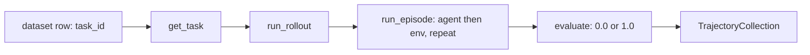

# Quickstart

This page gets you from a fresh checkout to a rollout you can read, using `number-search` — the
smallest environment in the repository. Path A needs no GPU and only an OpenAI-compatible endpoint.
Path B is the real 8-GPU AReaL training run from the repository README, with the handful of config
keys you must change before it will start.

If you have not installed anything yet, do that first: [installation](installation.md).

## What number-search is

`number-search` is a one-action environment. A task carries a bracketing range and a hidden target,
the only task-specific action is `guess(number: int)`, and the reward is binary. The environment is
a `CodeActEnv`, so the agent writes Python inside `<python>` tags; the shared `finish` action from
<span class="pl-src">platoon/agents/actions/common.py</span> is installed alongside `guess`.

```python title="plugins/number-search/platoon/number_search/env.py"
def guess_factory(target: int):
    def guess(number: int) -> str:
        if number == target:
            finish_message.set(f"You guessed the number {target} correctly!")
        elif number < target:
            return "Too low, try again."
        else:
            return "Too high, try again."

    return guess
```

`NumberSearchEnv.evaluate` returns `1.0` only when the episode is finished *and* the
`finish_message` context variable contains the substring `"correctly"`. Everything else scores
`0.0`. A correct `guess` is the only thing that writes that exact sentence, but `finish(message)`
writes `finish_message` verbatim too, so an agent that calls `finish("I guessed it correctly")`
scores `1.0` without ever guessing. That is a real reward hack in a reward function this small, and
a useful thing to see once before you write your own.

Two datasets ship next to the code and need no generation step:
`number_search_train.jsonl` (50 000 tasks) and `number_search_val.jsonl` (1 000 tasks). A row looks
like this:

```json
{"goal": "Guess the correct number between 6 and 988.", "id": "number_search.train.0", "max_steps": 1, "misc": {"low": 6, "high": 988, "target": 228}}
```

!!! warning "Every shipped task has `max_steps: 1`"
    All 51 000 rows in the two jsonl files carry `max_steps: 1`, so a task used verbatim gives the
    agent exactly one guess and the "too low / too high" feedback is unreachable. The training
    configs raise it: both group rollout workflows overwrite `task.max_steps` with
    `rollout_config.max_steps` (`10` in every shipped number-search config) before calling the
    rollout function — see
    <span class="pl-src">platoon/train/areal/workflows/group_rollout_workflow.py</span>
    and
    <span class="pl-src">platoon/train/tinker/workflows/group_rollout_workflow.py</span>.
    A plain script that calls `run_rollout` directly does **not** do this. Set `task.max_steps`
    yourself.

That combination is what makes it a good smoke test. The whole plugin is six modules and under 500
lines (`agent`, `env`, `rollout`, `tasks`, `train`, `train_tinker`), with no external services
beyond the model endpoint, no credentials and no dataset to download. A successful run means the
agent, environment, episode loop, trajectory sinks and — in Path B — the whole trainer are wired
up. Nothing here is memorizable: the target is redrawn per task, so the only transferable skill is
using the "too low / too high" feedback.



The same `run_rollout` / `get_task` pair drives both paths below and both training backends. That
split is the core idea — see [core concepts](concepts.md).

## Path A: no GPU

Everything here runs against an OpenAI-compatible endpoint (vLLM, SGLang, a LiteLLM proxy, a hosted
API). No training backend extra is needed: nothing on the rollout or inference path imports torch,
`areal` or `tinker`.

```bash
cd plugins/number-search
uv sync          # core Platoon + the plugin, no backend extra
```

If you want a local server, this is the SGLang invocation recorded as a comment next to
`model_endpoint` in
<span class="pl-src">plugins/oolong/platoon/oolong/configs/inference/oolong_inference.yaml</span>,
the one place in the repository that writes it down:

```bash
uv run --extra areal -m sglang.launch_server \
  --model-path Qwen/Qwen3-4B-Instruct-2507 --dp 8 --context-length 70000
# serves http://127.0.0.1:30000/v1
```

That one does need GPUs (`--dp 8` asks for eight). Any other OpenAI-compatible base URL works just
as well.

### One rollout, directly

!!! info "number-search ships no inference script"
    `plugins/number-search` has no `inference_scripts/` directory and no `configs/inference/` —
    only `appworld`, `deepdive`, `email-search`, `oolong`, `openreward` and `textcraft` do — so
    there is no `--config` benchmark harness for it. The script below is not in the repository; it
    is the smallest possible caller of the same `run_rollout` the trainers use. It was written
    against the real signatures — `RolloutConfig`, `InferenceParams`, `run_rollout`, `get_task`,
    `TrajectoryCollection.to_dict` — but not executed against a live endpoint, so treat it as a
    starting point rather than a tested recipe.

```python title="run_one_number_search_rollout.py (new file, place it in plugins/number-search/)"
import asyncio
import json

from platoon.config_defs import InferenceParams, RolloutConfig
from platoon.number_search.rollout import run_rollout
from platoon.number_search.tasks import get_task


async def main() -> None:
    task = get_task("number_search.val.0")
    # Shipped tasks carry max_steps=1. The trainers raise this from
    # workflow_config.rollout_config.max_steps; a plain script must do it itself.
    task.max_steps = 10

    config = RolloutConfig(
        # number-search uses LiteLLMClient, which routes on the model prefix:
        # "openai/" means "OpenAI-compatible endpoint".
        model_name="openai/Qwen/Qwen3-4B-Instruct-2507",
        model_endpoint="http://127.0.0.1:30000/v1",
        # LiteLLMClient does not validate this. With an "openai/" model it is
        # forwarded as an Authorization header, which a local server started
        # without --api-key ignores. A hosted endpoint needs your real key.
        model_api_key="EMPTY",
        output_dir="./number_search_smoke",
        return_dict=True,
        timeout=300,
        inference_params=InferenceParams(temperature=1.0, max_completion_tokens=512),
    )

    collection = await run_rollout(task, config)
    root = next(iter(collection["trajectories"].values()))
    print(
        json.dumps(
            {
                "goal": task.goal,
                "target": task.misc["target"],
                "reward": root["reward"],
                "num_steps": len(root["steps"]),
                "finish_message": root["finish_message"],
            },
            indent=2,
        )
    )


if __name__ == "__main__":
    asyncio.run(main())
```

```bash
cd plugins/number-search
uv run python run_one_number_search_rollout.py
```

You get a JSON blob whose `reward` is `0.0` or `1.0`, and a trajectory event log at
`./number_search_smoke/events/events_number_search.val.0_<collection-uuid>.jsonl`. Parent
directories are created for you. Replay that file with the visualization CLI:

```bash
uv run -m platoon.visualization.cli replay --dir ./number_search_smoke/events --delay 0.25
```

See [trajectory visualization](../tutorials/visualization.md) for the rest of that tool.

### A full benchmark run

For the real inference harness — K rollouts per task, bounded concurrency, resume, an aggregate
report — you have to switch plugins, because number-search has no inference script. Use
**`textcraft`**: of the six plugins that do have one, it is the only one that needs nothing beyond
a model endpoint — its tasks and recipes are checked in as jsonl files next to the code.
(`appworld` reads `os.environ["APPWORLD_ROOT"]`, `deepdive` builds a Tavily client from
`TAVILY_API_KEY` at import time, `email-search` opens a local SQLite file named by
`PLATOON_EMAIL_SEARCH_DB_PATH`, `oolong` pulls its datasets through `datasets.load_dataset`, and
`openreward` talks to an environment server at a `session_url`.)

```bash
cd plugins/textcraft
uv sync
uv run python -m platoon.textcraft.inference_scripts.run_inference \
  --config platoon/textcraft/configs/inference/textcraft_inference.yaml \
  --inference.model_endpoint http://127.0.0.1:30000/v1 \
  --inference.model_api_key EMPTY \
  --inference.output_dir ./inference_results/smoke \
  --num_tasks 5
```

!!! warning "That `uv sync` fails on macOS"
    `plugins/textcraft` is one of three plugin locks that pin `torch 2.11.0+cu129`, a Linux-only
    wheel, even with no backend extra. The sync errors before anything is installed. `number-search`
    (used above) and `oolong` resolve on a Mac; everything resolves on Linux. See
    [installation](installation.md).

`textcraft_inference.yaml` sets `use_recursive_agent: true`, so this runs the recursive agent, which
can spawn subagents; five tasks at `max_steps: 50` is not a trivial amount of generation. Pass
`--use_recursive_agent false` for the flat agent.

!!! warning "Two traps in this script"
    Its module docstring says `python -m platoon.textcraft.run_inference`; the real module path is
    `platoon.textcraft.inference_scripts.run_inference`.

    Its `default_config` is computed as `Path(__file__).parent / "configs" / "inference" / ...`,
    but the script lives in `inference_scripts/` while the configs live one level up, so the
    default resolves to a path that does not exist and `load_config` raises `FileNotFoundError`.
    **Always pass `--config` explicitly.** (`run_synth_inference.py` uses `.parent.parent` and is
    unaffected.)

!!! warning "TextCraft uses `LLMClient`, which hard-requires a key and a base URL"
    `textcraft_inference.yaml` ships `model_endpoint: null` and `model_api_key: null`, and both are
    handed straight to `LLMClient`. It falls back to `OPENAI_BASE_URL` and `OPENAI_API_KEY` and
    raises `"LLM API key is required..."` if neither is set — which is why the command above
    overrides `--inference.model_api_key` as well as the endpoint. A local server that was started
    without `--api-key` ignores the value. Exporting the two environment variables instead works
    equally well.

Results land under `inference.output_dir`. The `workflow.rollout_config.output_dir` in the YAML is
dead: the runner overwrites it with the per-rollout directory before every rollout, so event logs
always land beside the rollout they belong to.

```text
inference_results/smoke/
├── rollouts/<safe_task_id>/rollout_0/
│   ├── trajectory_collection.json
│   ├── metadata.json
│   └── events/events_<task-id>_<collection-uuid>.jsonl
└── reports/
    ├── task_results.jsonl
    └── final_report.json
```

The script prints `final_report.json`'s `summary` block, which carries `success_rate`,
`success_at_k`, `reward_mean` and friends. `stage: rollouts` collects only; `stage: report`
re-derives every statistic from disk without touching the endpoint. The
[inference and evaluation tutorial](../tutorials/inference.md) covers the whole surface.

## Path B: train number-search

This is the run from the repository README. Pick a backend.

=== "AReaL"

    `nv_number_search_cispo_areal.yaml` splits one node between a 4-GPU SGLang rollout engine
    (`rollout.backend: sglang:d4p1t1`) and a 4-GPU FSDP actor (`actor.backend: fsdp:d4p1t1`), with
    `cluster.n_nodes: 1` and `cluster.n_gpus_per_node: 8`.

    !!! warning "There is no single-GPU AReaL config in this repository"
        Every AReaL config under `plugins/` assumes 8-GPU nodes: 45 files set
        `cluster.n_gpus_per_node: 8` literally, and the one that does not inherits it through a
        Hydra `defaults:` list. If you do not have an 8-GPU node, use the Tinker tab or stay on
        Path A. Shrinking the backend topology strings is possible but is not something the
        repository ships or tests.

    ```bash
    cd plugins/number-search
    uv sync --extra areal
    ```

    Change these keys before the first run. They are all absolute paths from the author's cluster
    or account-specific names.

    | Key | Shipped value | What you need |
    |---|---|---|
    | `cluster.fileroot` | `/lustre/fsw/portfolios/nvr/projects/nvr_lacr_llm/users/apurvag/experiments/areal/experiments` | A directory writable from every node. AReaL's own default is `/tmp/areal/`. |
    | `cluster.name_resolve.nfs_record_root` | `.../experiments/areal/experiments/name_resolve` | A directory visible to every node; this is the file-based service-discovery store. |
    | `workflow_config.rollout_config.output_dir` | `.../number-search-nv-cispo-trial6` | Where per-rollout trajectory events are written. |
    | `actor.path` | `Qwen/Qwen3-4B-Instruct-2507` | Keep it if the nodes can reach Hugging Face; otherwise a local snapshot. `tokenizer_path` and `sglang.model_path` follow it via `${actor.path}`. |
    | `stats_logger.wandb.project` | `number-search-platoon` | Your W&B project, or disable W&B entirely (below). |
    | `trial_name` | `nv-cispo-trial6` | A fresh name per run. Logs, checkpoints and the W&B run id are all keyed on it. |

    `cluster.fileroot` is the one that matters most: `rollout`, `saver`, `recover`, `evaluator` and
    `stats_logger` all inherit it through `${cluster.fileroot}`, so setting it once redirects
    everything AReaL writes.

    !!! warning "W&B fails the run late, not early"
        `stats_logger.wandb.mode` is `online` in the shipped config, and AReaL calls
        `wandb.login()` during trainer construction — after costly worker startup has already
        begun. The repository's own Slurm launcher disables W&B when no key is present for exactly
        this reason; see the comment at
        <span class="pl-src">slurm-scripts/openreward-toolathlon-prealloc-base.sh</span>.
        For a first run, pass `stats_logger.wandb.mode=disabled`.

    !!! warning "The shipped config saves no model and runs no evaluation"
        In `nv_number_search_cispo_areal.yaml`, `saver` and `evaluator` both have `freq_epochs`,
        `freq_steps` and `freq_secs` set to `null`, so no Hugging Face checkpoint is ever written
        and validation never runs. Only `recover` is active, at `freq_secs: 3600` — enough to
        resume a crashed run, but it is not a model you can load elsewhere. The config is shaped
        for a throughput experiment, not for producing an artifact.

        If you want a model out of your first run, set a save frequency and an eval frequency:

        ```bash
        saver.freq_steps=50 evaluator.freq_steps=50
        ```

    ```bash
    uv run python3 platoon/number_search/train.py \
      --config platoon/number_search/nv_number_search_cispo_areal.yaml \
      cluster.fileroot=/scratch/$USER/areal \
      cluster.name_resolve.nfs_record_root=/scratch/$USER/areal/name_resolve \
      workflow_config.rollout_config.output_dir=/scratch/$USER/areal/rollouts/number-search \
      stats_logger.wandb.mode=disabled \
      trial_name=smoke-1
    ```

    Note the invocation: the script is run **by path**, not with `-m`. `train.py` builds the two
    HuggingFace datasets from task ids only (`Dataset.from_list([{"task_id": x} for x in ...])`,
    1 000 train / 100 val), constructs `PlatoonArealRLTrainer`, and hands `run_rollout` and
    `get_task` to two `GroupRolloutWorkflow` instances — a training one and an eval one whose
    `group_size` is forced to `1`. The whole file is 54 lines. It is the shortest complete example
    of the training entrypoint contract, and worth reading before you write your own.

    !!! note "This plugin does not use the registry yet"
        `nv_number_search_cispo_areal.yaml` sets no top-level `environments:` — the list of
        `EnvironmentConfig` that names a plugin's dataset loader, task loader, rollout and reward
        processor. It therefore falls back to a single empty `EnvironmentConfig`, and the shared
        entrypoint `python -m platoon.train.areal.train`, which resolves components through
        `platoon.train.auto`, has nothing to resolve. `textcraft` is the only plugin that declares
        a `platoon.plugins` entry point today. Do not confuse that top-level key with the nested
        `openreward.environments:` list in some openreward configs (`label`, `env_name`,
        `session_url`, `sampling_weight`) — that one is an environment-mixture config and is
        unrelated. See [the registry](../architecture/registry.md).

=== "Tinker"

    Tinker needs **no local GPUs** — training runs on a remote service — but it does need an
    account. Platoon constructs the client as `tinker.ServiceClient(base_url=tinker_base_url)`
    (<span class="pl-src">platoon/train/tinker/rl.py</span>) and passes no credential, so
    authentication is whatever the `tinker` SDK reads from your environment; this repository never
    names that variable, so follow Tinker's own documentation. If you have neither GPUs nor a
    Tinker account, stop at Path A.

    ```bash
    cd plugins/number-search
    uv sync --extra tinker
    ```

    `number_search_tinker.yaml` already uses relative paths (`log_path: ./logs`), so far less needs
    changing:

    | Key | Shipped value | What you need |
    |---|---|---|
    | `train.model_name` | `nvidia/NVIDIA-Nemotron-3-Nano-30B-A3B-BF16` | A model your Tinker account can train. |
    | `train.renderer_name` | `nemotron3_disable_thinking` | Must match the model family. |
    | `stats.trial_name` | `grpo-trial3` | A fresh name per run; `log_path/experiment_name/trial_name` is the run directory. |
    | `stats.wandb.project` | `number-search-platoon-tinker` | Your project, or set `stats.wandb.mode` to `disabled`. |
    | `tinker_base_url` | `null` | Only if you need a non-default service URL. |

    ```bash
    uv run python -m platoon.number_search.train_tinker \
      --config platoon/number_search/number_search_tinker.yaml \
      --stats.trial_name smoke-1 \
      --stats.wandb.mode disabled
    ```

    This entrypoint is run with `-m`, and its overrides use `--dotted.key value` — a different
    syntax from the AReaL tab. See [CLI overrides](#cli-overrides) below.

    Rollout event logs are redirected: the Tinker workflow overwrites `rollout_config.output_dir`
    with `{log_path}/{experiment_name}/{trial_name}/rollouts/{scope}`, so the `./rollout_results`
    and `./eval_results` values in the YAML never take effect.

Both backends are compared in [training backends](backends.md).

## What to expect

**On the console.** AReaL brings up its workers first — the SGLang rollout engine, the FSDP actor
and the reference model colocated with it, one worker per `rollout:`, `actor:` and `ref:` block in
the config. Budget minutes rather than seconds: the shipped `rollout.setup_timeout` is `900`.
`load_expr_config` writes the fully resolved config to `config.yaml` under the stats-logger log
directory on rank 0 before training starts, so read that file if an override did not land. Tinker
has no local workers to start, and its entrypoint puts the `platoon` logger at DEBUG while
everything else stays at WARNING
(<span class="pl-src">plugins/number-search/platoon/number_search/train_tinker.py</span>).

**Where files land.** AReaL builds its own log and checkpoint paths; that layout lives in the
`areal` package, not in this repository, so the first two rows below are AReaL's convention with
`<user>` being the OS user running the trainer. The rollout-event rows are built by Platoon and are
verified against this tree.

| What | Path |
|---|---|
| Logs and the resolved `config.yaml` | `{cluster.fileroot}/logs/<user>/{experiment_name}/{trial_name}/` |
| Checkpoints | `{cluster.fileroot}/checkpoints/<user>/{experiment_name}/{trial_name}/` |
| Training rollout events | `{workflow_config.rollout_config.output_dir}/train_rollout/{engine_version}/events/` |
| Eval rollout events | `{workflow_config.rollout_config.output_dir}/eval_rollout/{engine_version}/events/` |

The `train_rollout` / `eval_rollout` suffixes come from the `output_subdir` argument in `train.py`;
the numeric engine-version directory is appended by the workflow so that rollouts generated after a
weight update do not overwrite earlier ones.

!!! warning "`output_dir` does not follow `trial_name`"
    `cluster.fileroot` is interpolated everywhere, but
    `workflow_config.rollout_config.output_dir` is a literal absolute path in the shipped configs
    and contains the old trial name (`number-search-nv-cispo-trial6`). Overriding `trial_name`
    alone leaves new rollouts writing into the previous run's directory. Override both.

**W&B metrics to watch.** Both backends have a `GroupRolloutWorkflow` and both record the first
four names below. The last two rows are recorded only by the AReaL workflow; the Tinker workflow
does not emit them.

| Metric | Backend | Why you care |
|---|---|---|
| `task_reward` | Both | The root trajectory's reward for one rollout — `0.0` or `1.0` on number-search. Its mean over a batch is the success rate, and it is the whole signal. |
| `task_reward_at_k_mean` / `_max` / `_min` | Both | Aggregated across a task's `group_size` rollouts. `_max` rising while `_mean` is flat means the policy can solve the task but is not yet reliable. |
| `num_steps` | Both | A correct guess ends the episode, so with `max_steps: 10` this should trend *down* as the agent learns to use the feedback. That is what the incentive structure implies; the repository ships no reference curve to compare against. |
| `num_output_tokens`, `avg_output_tokens_per_step` | Both | Runaway generation is the usual cause of a stalled run. |
| `group_size_effective`, `group_size_rejected` | AReaL | How many of the requested `group_size: 8` rollouts survived. Persistent rejection means rollouts are erroring, not merely scoring zero. |
| `zero_variance_reward_group` | AReaL | Groups in which every member got the same reward. These carry no advantage signal; a high count early is expected, a high count late is not. |

If a run produces no `task_reward` at all, the failure is upstream of training — read the rollout
event logs before touching hyperparameters, and see
[troubleshooting](../reference/troubleshooting.md).

## CLI overrides

The two config loaders take **different** override syntaxes. Getting this backwards is the most
common first-run mistake.

=== "AReaL"

    `areal.api.cli_args.load_expr_config` parses `--config <path>` with argparse and hands
    everything else to Hydra/OmegaConf. Overrides are bare `key=value` pairs — **no leading
    dashes**, no spaces around `=`.

    ```bash
    uv run python3 platoon/number_search/train.py \
      --config platoon/number_search/nv_number_search_cispo_areal.yaml \
      total_train_epochs=1 \
      workflow_config.group_size=4 \
      train_dataset.batch_size=16
    ```

    Because `${...}` interpolation is resolved after the override merge, changing `trial_name=...`
    propagates to `rollout.trial_name`, `actor.trial_name`, `saver.trial_name` and the rest for
    free. `--config` is required on this path: `parse_cli_args` has no default for it, unlike the
    Tinker and inference loader, which falls back to a path baked into the script.

=== "Tinker"

    `platoon.utils.config.load_config` is plain argparse. Overrides are `--dotted.key value` or
    `--dotted.key=value` — **with** leading dashes. The same loader backs every plugin's inference
    script, which is why Path A used `--inference.model_endpoint`.

    ```bash
    uv run python -m platoon.number_search.train_tinker \
      --config platoon/number_search/number_search_tinker.yaml \
      --train.batch_size 16 \
      --train.workflow_config.group_size 4
    ```

    There is no interpolation on this path: a value written once in the YAML is not shared with any
    other key.

    !!! warning "`0` and `1` become booleans on this loader"
        `_parse_value` in <span class="pl-src">platoon/utils/config.py</span> checks for
        `true/yes/1` and `false/no/0` *before* it tries `int`, so `--train.batch_size 1` sets the
        field to `True`, not `1`. Any other integer parses normally. Use a value of at least `2`,
        or edit the YAML, when you want a literal one.

The key-by-key breakdown lives in the
[configuration reference](../reference/configuration.md), and the entrypoints are catalogued in the
[CLI reference](../reference/cli.md).

## What just happened

You ran one agent episode, or a few thousand of them. In either case the shape was the same:

1. A **task id** was turned into a `Task` by the plugin's `get_task`.
2. The plugin's **`run_rollout`** built an LLM client from a `RolloutConfig`, constructed
   `NumberSearchEnv` and `NumberSearchAgent`, installed a fresh `TrajectoryCollection` in a context
   variable, and attached a `JsonlFileSink` to it.
3. **`run_episode`** alternated `agent.act(obs)` and `env.step(action)` until the step budget ran
   out or `finish_message` was set.
4. **`CodeActEnv.step`** called the environment's **`evaluate()`** after every action, stored the
   result on the step, and `Trajectory.add_step` accumulated it onto the trajectory's reward.
5. In Path B, a `GroupRolloutWorkflow` collected `group_size` such trajectories per task, centered
   their rewards into advantages against a group mean or leave-one-out baseline, and handed token
   batches to the trainer.

Steps 1-4 are identical for inference and for training; only step 5 differs. That separation is
what lets you validate a new environment against any endpoint before you ever allocate a GPU.

## Next

- [Core concepts](concepts.md) — tasks, agents, environments, trajectories, workflows.
- [Training backends](backends.md) — AReaL versus Tinker, and how to choose.
- [Your first task](first-task.md) — change number-search's reward and watch it move.
- [Anatomy of a training run](../walkthroughs/training-run.md) — the same AReaL run, line by line.
- [The group rollout workflow](../walkthroughs/group-rollout-workflow.md) — what step 5 above
  actually does.
- [Inference and evaluation](../tutorials/inference.md) — the benchmark harness in full.
