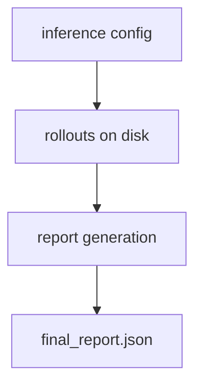

# Evaluate a model

Point Platoon at any OpenAI-compatible endpoint and get a benchmark number back. No trainer, no
weight sync, no tokenization: the framework runs a task plugin's agent K times per task, scores each
attempt, and writes a report.

This is the cheapest way to sanity-check a plugin, and the only path here that needs no GPU on your
machine. The rollout function it drives is the same one the training backends drive, so a plugin
that benchmarks cleanly is ready to train.

Evaluation runs in two stages, and the second never touches the network:



## What you need

- Platoon installed — see [installation](../get-started/installation.md).
- An OpenAI-compatible endpoint: a hosted API, a proxy, or your own vLLM or SGLang server.
- A key for it. A keyless local server accepts any non-empty string.

## 1. Pick a plugin

Most task plugins ship an inference script and a config under `configs/inference/`. TextCraft is the
easiest starting point: its tasks ship as JSONL beside the package, so there is nothing to download
and no third-party key. See the [plugin catalog](../plugins/catalog.md) for the others.

```bash
cd plugins/textcraft
uv sync
```

No backend extra is needed — the evaluation path imports neither `areal` nor `tinker`.

## 2. Point it at an endpoint

Three keys decide where requests go.

=== "Hosted API"

    ```yaml
    inference:
      model_name: Qwen/Qwen3-4B-Instruct-2507
      model_endpoint: https://your-provider.example/v1
      model_api_key: null       # read from OPENAI_API_KEY
    ```

    Plugins that build a LiteLLM client want a litellm model id instead, where the prefix selects
    the provider: `openai/<served-model-name>` for a plain OpenAI-compatible server, or
    `litellm_proxy/<upstream-model>` behind a proxy. `model_name` is passed through untouched.

=== "Local SGLang"

    Serve the model, then hand the config its `/v1` URL:

    ```bash
    uv run --extra areal python -m sglang.launch_server \
      --model-path Qwen/Qwen3-4B-Instruct-2507 --dp 8 --context-length 70000
    # serves http://127.0.0.1:30000/v1
    ```

    `--dp 8` asks for eight GPUs; scale it to what you have.

    ```yaml
    inference:
      model_name: Qwen/Qwen3-4B-Instruct-2507
      model_endpoint: http://127.0.0.1:30000/v1
      model_api_key: null
    ```

=== "Local vLLM"

    Identical wiring — an OpenAI-compatible server is an OpenAI-compatible server. Start vLLM the way
    you normally do and give the config its URL:

    ```yaml
    inference:
      model_name: Qwen/Qwen3-4B-Instruct-2507
      model_endpoint: http://127.0.0.1:8000/v1
      model_api_key: null
    ```

Leaving `model_api_key` and `model_endpoint` as `null` falls back to the environment, which keeps
your key out of a version-controlled config:

```bash
export OPENAI_API_KEY=sk-...
export OPENAI_BASE_URL=http://127.0.0.1:30000/v1
```

Values set in the YAML take precedence and skip the fallback.

## 3. The keys worth touching

| Key | Default | What it does |
| --- | --- | --- |
| `inference.model_name` | required | Model id, in whatever form the client expects |
| `inference.model_endpoint` | `null` | Base URL |
| `inference.model_api_key` | `null` | Falls back to `OPENAI_API_KEY` |
| `inference.output_dir` | `inference_results` | Root of `rollouts/` and `reports/` |
| `inference.resume` | `true` | Skip rollouts that already exist on disk |
| `inference.workflow.num_rollouts_per_task` | `1` | The K in success@k |
| `inference.workflow.num_concurrent_workers` | `32` | Rollouts in flight at once |
| `num_tasks` | plugin-defined | How many tasks to run |

`num_tasks` sits beside `inference:`, not inside it, along with the plugin's own keys —
`dataset_split`, `task_id`, `stage`, `seed`. Everything else is in the
[configuration reference](../reference/configuration.md).

!!! tip "Rate limits"

    Requests are not retried, so a single 429 fails that rollout. Against a rate-limited hosted API,
    lower `num_concurrent_workers`.

## 4. Run it

```bash
cd plugins/textcraft
uv run python -m platoon.textcraft.inference_scripts.run_inference \
  --config platoon/textcraft/configs/inference/textcraft_inference.yaml \
  --num_tasks 5
```

Start with five tasks, so the first mistake surfaces in a minute rather than an hour. Overrides use
`--dotted.key value`:

```bash
uv run python -m platoon.textcraft.inference_scripts.run_inference \
  --config platoon/textcraft/configs/inference/textcraft_inference.yaml \
  --inference.model_endpoint http://127.0.0.1:30000/v1 \
  --inference.output_dir ./inference_results/qwen3-4b \
  --inference.workflow.num_rollouts_per_task 4 \
  --num_tasks 20
```

!!! note "Dashes matter here"

    Inference and Tinker configs take `--dotted.key value`. AReaL training configs take bare
    `key=value`. See the [CLI reference](../reference/cli.md).

## 5. Read the output

```text
inference_results/qwen3-4b/
├── rollouts/
│   └── textcraft.val.7/
│       ├── rollout_0/
│       │   ├── trajectory_collection.json
│       │   ├── metadata.json
│       │   └── events/
│       └── rollout_1/
└── reports/
    ├── task_results.jsonl
    └── final_report.json
```

The script prints the summary it also writes to `final_report.json`:

```json
{
  "total_tasks": 20,
  "total_rollouts": 80,
  "valid_rollouts": 78,
  "successful_rollouts": 39,
  "errored_rollouts": 2,
  "success_rate": 0.5,
  "success_at_k": 0.75,
  "reward_mean": 0.5,
  "elapsed_seconds": 1284.6
}
```

Two headline numbers, answering different questions:

- **`success_rate`** is averaged over rollouts — how often a single attempt works.
- **`success_at_k`** is averaged over tasks, taking the best of each task's K rollouts — what
  fraction of tasks the model solves at least once.

A *failed* rollout ran fine and scored unsuccessful; an *errored* rollout threw, and is excluded from
every statistic. `reports/task_results.jsonl` has one line per task carrying each rollout's reward,
step counts and delegation depth — stream it with `jq` rather than loading the larger report:

```bash
jq .summary inference_results/qwen3-4b/reports/final_report.json
```

## Rerun without redoing the work

The two stages split at `stage:`. Collect once, score as often as you like:

```bash
# collect only — resumable, safe to interrupt
... run_inference --config <config> --stage rollouts

# rebuild the report from disk; no endpoint involved
... run_inference --config <config> --stage report
```

Because the report is a function of the directory, give each experiment its own `output_dir` — a
fresh run pointed at an old directory folds those rollouts into its numbers. To compare two models,
run twice into separate directories, changing only `inference.model_name` and holding `num_tasks`,
`dataset_split` and `seed` fixed.

## Next

- [Inspect rollouts](inspect-rollouts.md) — replay the event files this run wrote.
- [Multi-agent workflows](multi-agent.md) — what the delegation counts in the report mean.
- [Configuration reference](../reference/configuration.md) — every key, not just these.
