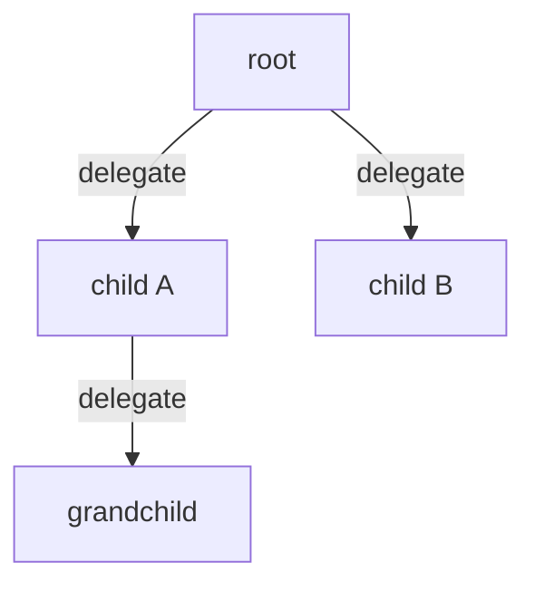

# Multi-agent workflows

Platoon trains systems of agents, not single agents. From inside an ordinary environment step, an
agent can hand a sub-task to another agent; the child runs a full episode of its own, and the whole
tree is trained together.

Recursion — delegating to more instances of the same agent — is the simplest shape and the one this
page uses as its worked example. It is not the only one. A planner that hands implementation to a
coding agent, or a solver that calls a specialist retrieval agent, uses exactly the same mechanism:
the child is whatever `fork` returns, so it can be a different harness with a different tool set.

## What changes when an agent can delegate

A rollout stops being one `Trajectory` and becomes a `TrajectoryCollection` — a flat dict of
trajectories plus a parent edge on each child, recording who delegated and at which step.



Four things have to be true before a single-agent task can delegate.

1. The environment implements `ForkableEnv` and the agent implements `ForkableAgent`.
2. Some action in the action space calls `launch_subagent`, and the action-space description tells
   the model that it exists.
3. A budget tracker admits the delegation.
4. The child's work reaches a reward — its own environment score, or the root's, propagated.

Nothing else changes. The child runs the same `run_episode` as the root; nesting happens because
`run_episode` reads the current trajectory from a context variable and parents itself to it. See
[execution](../architecture/execution.md) for that loop.

## 1. Make the environment forkable

The contract is one method on each side:

```python title="platoon/envs/base.py"
@runtime_checkable
class ForkableEnv(Env, Protocol):
    async def fork(self, task: Task) -> ForkableEnv:
        """Return an independently closeable child environment.

        Implementations that allocate resources before returning must clean up
        partial allocations if the fork raises, including on cancellation.
        """
```

Three obligations follow.

**The child is independently closeable.** The child's episode closes both forks when it ends. Do not
hand it a resource whose `close()` tears down the parent's.

**A failed fork leaks nothing.** If you allocate before returning and then raise, release what you
allocated. The launcher cleans up a fork it received; it cannot clean up inside yours.

**The child gets a reward target.** This is the one people miss. The child's `Task` carries the goal
string the parent wrote and little else, so if your `evaluate()` reads structured fields out of
`task.misc`, `fork` has to reconstruct them. TextCraft parses target items back out of the goal:

```python title="plugins/textcraft/platoon/textcraft/env.py"
async def fork(self, task: Task) -> "TextCraftRecursiveEnv":
    targets = self._parse_craft_targets_from_goal(task.goal)
    if targets:
        task.misc = task.misc.copy() if task.misc else {}
        task.misc.update({
            "target_items": targets,
            "initial_inventory": self._code_executor.inventory,
        })
    return TextCraftRecursiveEnv(task=task, ..., _share_inventory=True)
```

Decide explicitly what the child shares. TextCraft shares one inventory dict by reference, so a
child's crafting is immediately visible to the parent — a real division of labor. OpenReward shares
the live session but narrows the child's tool schema so it cannot submit the root task. A copied
world the child cannot leak into is equally valid and makes parallel siblings safe.

!!! tip "CodeAct environments get `fork` almost for free"
    `CodeActEnv.fork` forks the executor and rebuilds the env, as long as your executor implements
    `ForkableCodeExecutor`. `CodeActAgent.fork` already exists, so the agent side needs no work.

`Task.fork_strategy` decides what the child's prompt shows. The default, `"subtask"`, renders the
whole ancestor goal stack into the child's prompt; `"task"` gives a flat goal with no lineage.
Ancestry helps when a child's goal is only interpretable in context and costs tokens when it is not.
TextCraft sets `task.fork_strategy = "task"` in its environment constructor.

## 2. Expose the delegation call

The raw action is a plain async function:

```python title="platoon/agents/actions/subagent.py"
async def launch_subagent(goal: str, max_steps: int = 15, task_misc: dict | None = None, verbose: bool = True) -> Any:
```

Do not hand that to the model directly. Wrap it so the goal is domain-shaped and the arguments are
things your environment can evaluate:

```python title="plugins/textcraft/platoon/textcraft/env.py"
async def launch_subagent(self, targets: Dict[str, int], num_steps: int, context: str = "") -> str:
    target_str = ", ".join([f"{count}x {item}" for item, count in targets.items()])
    goal = f"Craft the following items: {target_str}"
    if context:
        goal += f"\n\nContext provided from parent agent: {context}"
    return await _launch_subagent(goal=goal, max_steps=num_steps)
```

The bound method goes into the executor's actions tuple alongside `finish` and the rest.

**Injecting it is not enough — describe it.** TextCraft's linear variant keeps `launch_subagent`
out of the description by passing `include_subagent=False` to `describe_action_space`, and the model
never calls it; the recursive variant flips that flag. If your agent never delegates, look here
first.

### What the agent sees

`launch_subagent` always returns a string, and never raises into the agent's code:

| Return | When |
| --- | --- |
| the child's `finish` message | the child finished |
| `"Subagent did not finish before its step budget was exhausted."` | the child ran out of steps |
| `"Subagent failed before finishing."` | any other child failure |
| a refusal message plus guidance | the budget or depth check declined |

A refusal is not an exception. The check runs before anything is allocated, and the model reads
something actionable and keeps going. The error strings are deliberately sanitized — the parent never
sees a traceback or the child's budget accounting. If your parent logic needs to branch on the
outcome, put your own sentinel in the child's finish message rather than matching this prose.

!!! warning "A missing `await` is rejected before execution"
    CodeAct runs an AST pass over generated code and rejects `launch_subagent(...)` without `await`.
    `asyncio.gather(launch_subagent(...), launch_subagent(...))` is explicitly allowed — that is how
    parallel siblings are expressed.

## 3. Choose a budget model

This is the design decision with the largest effect on behavior. Two trackers ship, both in
<span class="pl-src">platoon/episode/trajectory.py</span>.

| | `StepBudgetTracker` | `DepthAwareStepBudgetTracker` |
| --- | --- | --- |
| Budget scope | whole subtree shares the root's `max_steps` | each trajectory has its own `max_steps` |
| Steps counted | own plus every descendant's | own only |
| Admission check | must fit `max_steps + 1` in what remains | depth against `max_depth` |
| Installed | by default | explicitly, before `run_episode` |

**Shared subtree budget** prices delegation. Every step a child spends is a step the root cannot,
so the model has to estimate subtask difficulty and can starve itself by over-delegating. The
reservation is `max_steps + 1` — the extra step is for reading the result, and the refusal guidance
tells the model exactly that. Use it when the task has a natural step ceiling and you want the policy
to learn *when* delegating pays. One number bounds the whole rollout.

**Independent budgets with a depth cap** discard the requested amount and check only whether
`current_depth + 1` exceeds `max_depth`. Delegation costs the parent nothing in steps, so expect a
lot more of it; the structural cap is doing all the work. Use it when a subtree's work is genuinely
additional and you want to bound the *shape* of the tree rather than its total cost. The cost moves
from steps to wall clock, because `await launch_subagent(...)` does not return until the child
episode finishes — which is why recursive configs carry very large `step_timeout` values.

Install a tracker by setting the context variable before `run_episode`:

```python title="plugins/textcraft/platoon/textcraft/synth_rollout.py"
budget_tracker.set(DepthAwareStepBudgetTracker(max_depth=max_depth))
```

Leave it unset and a plain `StepBudgetTracker` is installed for you. `max_depth` defaults to `None`,
which means unbounded nesting — with independent budgets and a no-op release, nothing else bounds the
tree, so set it. The recursive OpenReward configs all use a depth cap of 2.

## 4. Run one rollout and read the tree

The inference runner needs no trainer, so this part runs anywhere against any OpenAI-compatible
endpoint. From `plugins/textcraft`:

```bash
uv run python platoon/textcraft/inference_scripts/run_synth_inference.py \
  --config platoon/textcraft/configs/inference/textcraft_synth_inference.yaml \
  --inference.model_name openai/Qwen/Qwen3-4B-Instruct-2507 \
  --inference.model_endpoint http://127.0.0.1:30000/v1 \
  --inference.output_dir ./recursive_demo \
  --inference.workflow.rollout_config.output_dir ./recursive_demo/rollouts \
  --use_recursive_agent true \
  --task_id textcraft_synth.val.0
```

`use_recursive_agent: true` selects the depth-aware rollout. Every rollout writes JSONL trajectory
events; open them in the TUI:

```bash
uv run python -m platoon.visualization.cli tail --rdir ./recursive_demo/rollouts
```

The tree pane nests each child under its parent. Read three things before you train:

- **Did the root delegate, and how deep?** A root labelled `subtree:solver=1` never delegated.
- **Did children finish, or exhaust their budgets?** A tree full of step-budget messages means the
  per-agent budget is too small for the subtasks the model is picking.
- **Do children have their own reward?** A child with a `finish` message and `reward:0.000` is the
  classic "the child claimed success and the environment disagreed" case.

More on the TUI in [inspect rollouts](inspect-rollouts.md).

## 5. Train on the tree

Both backends accept the same trajectory collection. The registry-driven Tinker config runs on the
shared entrypoint:

```bash
uv run python -m platoon.train.tinker.train \
  --config plugins/textcraft/platoon/textcraft/configs/tinker/textcraft_synth_depth_aware_tinker.yaml
```

Its `environments:` block names the rollout by its registered name, so switching budget models is a
one-line change:

```yaml title="plugins/textcraft/platoon/textcraft/configs/tinker/textcraft_synth_depth_aware_tinker.yaml"
environments:
  - package: platoon.textcraft.registry
    dataset_loader: textcraft/synth
    task_loader: textcraft/synth
    rollout: textcraft/synth/depth_aware
    reward_processor: textcraft/synth/delegation_capped
    workflow: group_rollout
```

By default every trajectory in the tree becomes training data at equal weight, which is rarely what
you want: one root and twelve children means the children dominate the batch. Four settings change
that.

| Key | Default | What it does |
| --- | --- | --- |
| `workflow_config.rollout_config.propagate_root_success` | `false` | Overwrite every trajectory's reward with the root's outcome. |
| `workflow_config.depth_level_weighting` | `false` | Reweight rewards by inverse per-depth trajectory frequency. |
| `workflow_config.depth_level_discount_gamma` <span class="pl-tag pl-tag--areal">AReaL</span> | `null` | Reweight by `gamma^depth` instead. Alternative, not an addition. |
| `workflow_config.subagent_datum_keep_probability` | `1.0` | Bernoulli retention per non-root datum. Roots are always kept. |

**Root propagation** is the bluntest credit assignment and the cleanest place to start: every datum
lands on the same scale as the group baseline, which is built from root rewards. Turn it on when
children have no meaningful independent score. Turn it off when they do, because it overwrites what
the environment computed.

**Depth weighting** stops a crowded level from dominating the update. Turn it on when the tree is
wide and the branching factor varies between rollouts; every TextCraft depth-aware config does.

**Datum sampling** is a throughput knob, not a learning-signal knob. Reach for it when deep trees
blow up your batch — `0.25` is a common value. Group centering and statistics run on the complete
tree and the mask is intersected afterwards, so sampling never perturbs the baseline.

Full types, defaults and validation are in the [configuration reference](../reference/configuration.md).
The `environments:` block above is registry wiring, not OpenReward's nested task-mixture list of the
same name — see [components](../architecture/components.md).

## Failure modes

**The agent delegates everything.** The root becomes a one-line router: it forwards the task
verbatim and returns the child's answer. With root propagation on this is *optimal* — the root gets
the child's success for free — so nothing in the reward discourages it. Turn off propagation and let
each trajectory carry its own score, keep any delegation bonus at zero, or add a behavior judge,
which OpenReward uses to fail exactly this pattern. Symptom: root trajectories with one step and one
child.

**The agent never delegates.** Three causes, one symptom. Is `launch_subagent` in the action-space
*description*, not just the namespace? Under the shared tracker, can a root with a small `max_steps`
even afford `max_steps + 1` for a child? Is `max_depth` low enough to block depth 1? The refusal text
in the parent's trajectory tells you which one you have.

**Children whose work never reaches the reward.** A full, healthy-looking tree and a flat reward
curve. Either `fork` did not reconstruct the child's reward target, or root propagation overwrote the
child's real score, or `skip_subagent_reward_computation` is on and children return 0 without being
evaluated. Compare children's `reward/success` against the root's.

## Next

- [Execution model](../architecture/execution.md) — the episode loop, context variables and the
  fork lifecycle these build on.
- [Inspect rollouts](inspect-rollouts.md) — reading a trajectory tree in the TUI.
- [OpenReward](../plugins/openreward.md) — verifier-judged children, delegation bonuses and
  behavior gating, as a worked plugin.
- [Scale up](scale.md) — delegating rollouts are long, and this is where timeouts start to matter.
