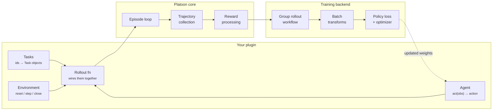

<div class="pl-hero" markdown>

{ .pl-hero__logo .pl-only-light }
{ .pl-hero__logo .pl-only-dark }

# Build and train systems of agents

<p class="pl-hero__tagline">A reinforcement-learning framework for agents that call other agents.</p>

<p class="pl-hero__sub">
Platoon gives you an agent/environment core, two training backends, and a component registry that
turns a YAML file into a running RL job. Agents that fork sub-tasks, delegate to child agents, and
get credit for it are the case it is built around, not an add-on.
</p>

<div class="pl-hero__actions" markdown>
[Get started](get-started/index.md){ .md-button .md-button--primary }
[Quickstart](get-started/quickstart.md){ .md-button }
[Code walkthroughs](walkthroughs/index.md){ .md-button }
</div>

</div>

## Why Platoon

<div class="pl-cards" markdown>

<div class="pl-card" markdown>
<span class="pl-card__kicker">Systems, not single agents</span>
### Recursive by design
An agent can fork its environment, hand a sub-task to a child agent, and train on the whole tree.
Sub-trajectories, step budgets, and reward propagation are part of the core — not something you
bolt on.

[The fork and sub-agent model &rarr;](architecture/subagents.md)
</div>

<div class="pl-card" markdown>
<span class="pl-card__kicker">Two backends, one plugin</span>
### AReaL or Tinker
Write your task once. Train it on your own GPUs through [AReaL](architecture/areal.md) (FSDP or
Megatron, SGLang rollouts, single node to 32+ nodes) or through the managed
[Tinker](architecture/tinker.md) service. The environment, agent, and rollout code are identical.

[Choosing a backend &rarr;](get-started/backends.md)
</div>

<div class="pl-card" markdown>
<span class="pl-card__kicker">Config over code</span>
### A registry, not a fork
Register your dataset loader, task loader, rollout, and reward processor by name. Then point a
config at them and run the shared entrypoint — no trainer script to copy, no framework to fork.

[Registry and Auto factories &rarr;](architecture/registry.md)
</div>

<div class="pl-card" markdown>
<span class="pl-card__kicker">See what happened</span>
### Rollouts you can read
Every episode emits a structured event log. A terminal UI replays trajectories step by step,
diffs two runs against each other, and clusters failures — so a reward that looks wrong can be
traced to the turn that caused it.

[Inspect rollouts &rarr;](tutorials/visualization.md)
</div>

<div class="pl-card" markdown>
<span class="pl-card__kicker">Small core</span>
### An episode loop you can hold in your head
`reset`, then `act` / `step` until finished. Environments and agents are Protocols, not base
classes. If you can write two `async` methods, you can write a Platoon environment.

[Core concepts &rarr;](get-started/concepts.md)
</div>

<div class="pl-card" markdown>
<span class="pl-card__kicker">Tasks in the box</span>
### Real tasks, already wired
Crafting, long-context aggregation, code localization, email search, AppWorld API tasks, SWE
benchmarks — each a plugin you can run today, or copy as the template for your own.

[Plugin catalog &rarr;](reference/plugins.md)
</div>

<div class="pl-card" markdown>
<span class="pl-card__kicker">Bring your own stack</span>
### OpenHands and OpenReward
Train the OpenHands software-engineering agent, on hosted SWE and tool-use task suites, with
judge-based rewards and curricula. The two integrations behind the project's largest runs.

[Integrations &rarr;](integrations/index.md)
</div>

</div>

## The shape of a Platoon project

Platoon separates *what your task is* from *how it is trained*. You write the left column; the
framework owns the right.



## In practice

=== "1. Write the task"

    An environment is two `async` methods and a reward. This is the complete `number-search`
    environment — a number-guessing task used as the framework's smoke test.

    ```python title="platoon/number_search/env.py"
    from platoon.agents.actions.common import finish
    from platoon.envs.base import Task
    from platoon.envs.codeact import CodeActEnv, IPythonCodeExecutor
    from platoon.episode.context import finish_message


    def guess_factory(target: int):
        def guess(number: int) -> str:
            if number == target:
                finish_message.set(f"You guessed the number {target} correctly!")
            elif number < target:
                return "Too low, try again."
            else:
                return "Too high, try again."

        return guess


    class NumberSearchEnv(CodeActEnv):
        def __init__(self, task: Task):
            super().__init__(
                task,
                IPythonCodeExecutor(task, actions=(finish, guess_factory(task.misc["target"]))),
            )

        async def evaluate(self) -> tuple[float, dict]:
            if self._state.finished:
                message = finish_message.get(None)
                if message is not None and "correctly" in message:
                    return 1.0, {}
            return 0.0, {}
    ```

=== "2. Register the components"

    Registration is what lets a config name your code. Each decorator adds one entry to a typed
    registry that the shared trainer resolves at startup.

    ```python title="platoon/textcraft/registry.py"
    from platoon.registry import (
        register_dataset_loader,
        register_reward_processor,
        register_rollout,
        register_task_loader,
    )


    @register_task_loader("textcraft/synth")
    def load_synth_task(task_id: str):
        return get_synth_task(task_id)


    @register_dataset_loader("textcraft/synth")
    def load_synth_dataset(config, split: str, difficulties=None, limit=None):
        task_ids = _get_filtered_synth_task_ids(split, difficulties=difficulties)
        return task_ids[:limit] if limit is not None else task_ids


    register_rollout("textcraft/synth/recursive", run_synth_recursive_rollout)
    ```

=== "3. Point a config at them"

    The `environments` block is the seam between your plugin and the trainer. Every field is a
    registry name (or a dotted import path, if you would rather skip registration).

    ```yaml title="configs/areal/my_task.yaml"
    environments:
      - package: platoon.textcraft.registry
        dataset_loader: textcraft/synth
        task_loader: textcraft/synth
        rollout: textcraft/synth/recursive
        reward_processor: textcraft/synth/delegation_capped
        workflow: group_rollout
        dataset_kwargs:
          difficulties: ["medium"]
    ```

=== "4. Train it"

    No trainer script of your own. The shared entrypoint reads the config, resolves your
    components, and starts the run.

    ```bash
    uv run python -m platoon.train.areal.train --config configs/areal/my_task.yaml
    ```

    Anything in the config can be overridden from the command line:

    ```bash
    uv run python -m platoon.train.areal.train --config configs/areal/my_task.yaml \
      trial_name=debug-run \
      train_dataset.batch_size=16 \
      workflow_config.group_size=4
    ```

## Where to go next

<div class="pl-cards pl-cards--tight" markdown>

<div class="pl-card" markdown>
### [Get started](get-started/index.md)
Install Platoon, run your first RL job, and learn the concepts everything else is built from.
</div>

<div class="pl-card" markdown>
### [Tutorials](tutorials/index.md)
Guided, end-to-end paths: train on TextCraft, evaluate an endpoint, build a task from nothing.
</div>

<div class="pl-card" markdown>
### [Code walkthroughs](walkthroughs/index.md)
Line-by-line traces through the real source — a training run, a rollout workflow, a sub-agent call.
</div>

<div class="pl-card" markdown>
### [Customization](customization/index.md)
One page per extension point, each with a working example and the config wiring it needs.
</div>

<div class="pl-card" markdown>
### [Recipes](recipes/index.md)
The options that matter: RL algorithms, recursive systems, reward design, curricula, parallelism.
</div>

<div class="pl-card" markdown>
### [Integrations](integrations/index.md)
OpenHands and OpenReward: what they add, what they need, and how to run them.
</div>

<div class="pl-card" markdown>
### [Architecture](architecture/index.md)
Why the framework is shaped this way: the registry, the episode core, both backends, the data
pipeline.
</div>

<div class="pl-card" markdown>
### [Reference](reference/index.md)
The full configuration surface, component contracts, CLI, schemas, and troubleshooting.
</div>

</div>
