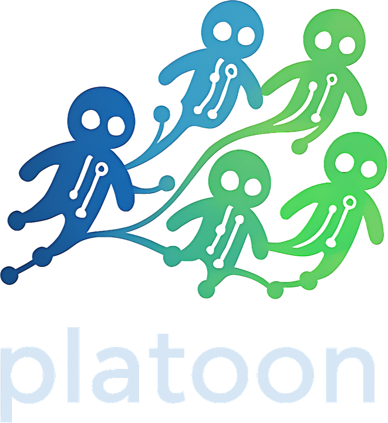
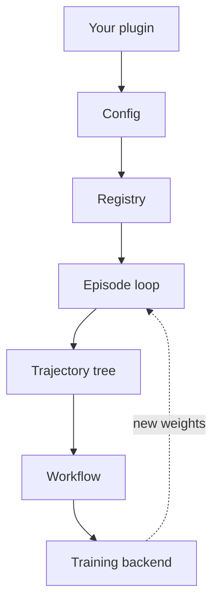

<div class="pl-hero" markdown>

{ .pl-hero__logo .pl-only-light }
{ .pl-hero__logo .pl-only-dark }

# Reinforcement learning for multi-agent workflows

<p class="pl-hero__sub">
Write an environment, an agent and a rollout function. Let agents delegate work to other agents.
Train the whole workflow — parents and children together — from one YAML file.
</p>

<div class="pl-hero__actions" markdown>
[Get started](get-started/index.md){ .md-button .md-button--primary }
[Quickstart](get-started/quickstart.md){ .md-button }
[Architecture](architecture/index.md){ .md-button }
</div>

</div>

## Why Platoon

<div class="pl-cards" markdown>

<div class="pl-card" markdown>
<span class="pl-card__kicker">The headline capability</span>
### Multi-agent workflows
An agent can hand a sub-task to another agent and use the result — recursion, an agent delegating
to copies of itself, is one case of that. Every branch of the tree is trained, not just the root.

[Build a multi-agent workflow &rarr;](guides/multi-agent.md)
</div>

<div class="pl-card" markdown>
<span class="pl-card__kicker">Two paths, one plugin</span>
### AReaL or any Tinker-compatible backend
Train on your own GPUs with AReaL, or against a service that implements the Tinker API — Platoon
targets the API, not one vendor. Your environment, agent and rollout code is the same either way.

[Backends &rarr;](architecture/backends.md)
</div>

<div class="pl-card" markdown>
<span class="pl-card__kicker">Config over code</span>
### A registry, not a fork
Register your dataset loader, rollout and reward processor under names; a config block picks them
and a shared entrypoint runs them. No trainer script to copy, no framework to fork.

[Components and the registry &rarr;](architecture/components.md)
</div>

<div class="pl-card" markdown>
<span class="pl-card__kicker">Your repo, not ours</span>
### Plugins live anywhere
A plugin is an ordinary Python package. Keep your research in your own repository, advertise it
with an entry point, and Platoon finds it — no fork. Task plugins carry a task and its rollout;
capability plugins add framework functionality such as an agent harness.

[Write your first plugin &rarr;](guides/first-plugin.md)
</div>

<div class="pl-card" markdown>
<span class="pl-card__kicker">Composition, not vendoring</span>
### Services you plug in
Platoon composes things you run rather than things it owns: training engines behind the Tinker API,
task environments behind OpenReward's environment server, OpenAI-compatible inference endpoints.

[Plugins and integrations &rarr;](plugins/index.md)
</div>

<div class="pl-card" markdown>
<span class="pl-card__kicker">See what happened</span>
### Rollouts you can read
Every episode emits a structured event log, and a terminal UI replays a trajectory step by step or
diffs two runs — so a reward that looks wrong leads back to the turn that caused it.

[Inspect rollouts &rarr;](guides/inspect-rollouts.md)
</div>

</div>

## How the pieces fit



## In practice

=== "1. Write the task"

    An environment is a class with an action space and a reward. This is all of `number-search`'s.

    ```python title="plugins/number-search/platoon/number_search/env.py"
    class NumberSearchEnv(CodeActEnv):
        def __init__(self, task: Task):
            super().__init__(
                task,
                IPythonCodeExecutor(task, actions=(finish, guess_factory(task.misc["target"]))),
            )

        async def evaluate(self) -> tuple[float, dict]:
            if self._state.finished:
                message = finish_message.get(None)
                if message is not None and "correctly" in message:
                    return 1.0, {}
            return 0.0, {}
    ```

=== "2. Register it"

    Each decorator adds one entry to a typed registry that the shared trainer resolves at startup.

    ```python title="plugins/textcraft/platoon/textcraft/registry.py"
    from platoon.registry import register_rollout, register_task_loader

    @register_task_loader("textcraft/synth")
    def load_synth_task(task_id: str):
        return get_synth_task(task_id)

    register_rollout("textcraft/synth/recursive", run_synth_recursive_rollout)
    ```

=== "3. Point a config at it"

    The `environments` block is the seam: each field is a registry name or a dotted import path.

    ```yaml title="my_task.yaml"
    environments:
      - package: platoon.textcraft.registry
        dataset_loader: textcraft/synth
        task_loader: textcraft/synth
        rollout: textcraft/synth/recursive
        reward_processor: textcraft/synth/delegation_capped
        workflow: group_rollout
    ```

=== "4. Train it"

    One entrypoint per backend, no script of your own.

    ```bash
    uv run python -m platoon.train.areal.train --config my_task.yaml trial_name=debug-run
    ```

    Swap in `platoon.train.tinker.train` for the Tinker path; the two backends take different
    override syntax. See the [CLI reference](reference/cli.md).

## Where to go next

<div class="pl-cards pl-cards--tight" markdown>

<div class="pl-card" markdown>
### [Get started](get-started/index.md)
Install Platoon, run a job end to end, and learn the handful of concepts everything is built from.
</div>

<div class="pl-card" markdown>
### [Guides](guides/index.md)
Task-shaped paths: a first plugin, multi-agent workflows, evaluation, inspection, scaling up.
</div>

<div class="pl-card" markdown>
### [Architecture](architecture/index.md)
Components, the execution path from rollout to gradient step, and how the two backends differ.
</div>

<div class="pl-card" markdown>
### [Plugins](plugins/index.md)
What ships in the box, plus the OpenHands agent harness and the OpenReward environment integration.
</div>

<div class="pl-card" markdown>
### [Reference](reference/index.md)
Configuration surface, CLI, and answers to the questions that come up most.
</div>

<div class="pl-card" markdown>
### [Contributing](contributing.md)
How to develop against the repo. Upstreaming your plugin is welcome, never required.
</div>

</div>
