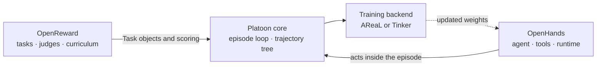

# Integrations

Most Platoon plugins define a task and let Platoon's own CodeAct agent solve it. Two plugins do
something bigger: they bring an entire external agent stack or task ecosystem under Platoon's
training loop. They are the largest, most capable, and least self-explanatory parts of the
repository, so they get their own pages.

Bring your own agent
### [OpenHands](openhands.md)
Train the OpenHands software-engineering agent with Platoon. Platoon supplies the environment,
episode loop, and RL machinery; OpenHands supplies the agent, its tools, and its runtime — including
delegation, so an OpenHands agent can spawn OpenHands sub-agents. It ships as a library rather than
a runnable plugin: other plugins, chiefly OpenReward, supply the tasks it attempts.

Bring your own tasks and rewards
### [OpenReward](openreward.md)
Train against hosted task environments — SWE-style repositories and tool-use suites — with an
outcome verifier, an LLM behavior judge, curricula, and weighted mixtures over several task sources
at once. This is the plugin the repository's largest production runs are built on.

## How they relate

The two are usually run together: OpenReward provides the tasks and the reward signal, OpenHands
provides the agent that attempts them. The `slurm-scripts/` directory at the repository root is
almost entirely combinations of the two.

## Before you start

Both plugins need infrastructure that the smaller plugins do not: running services, container
images, and in OpenReward's case a session endpoint per task environment. If you are still learning
Platoon, start with [number-search or TextCraft](../reference/plugins.md) — the concepts transfer,
and you will not spend the first day on setup.
