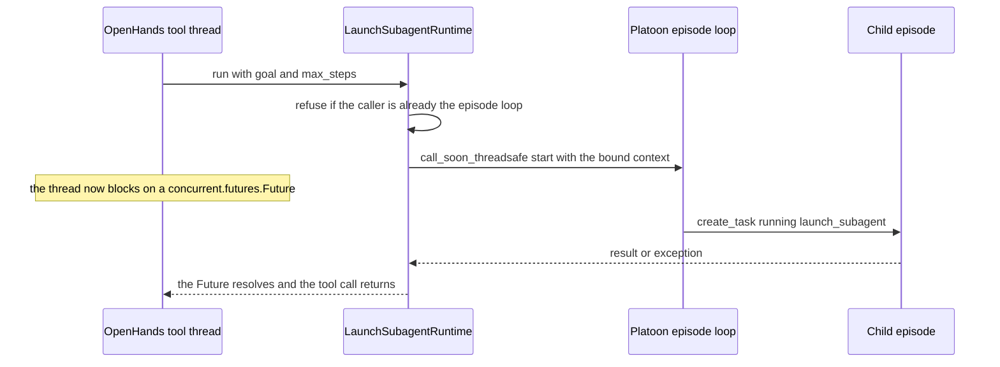

# OpenHands

Most Platoon plugins train Platoon's own CodeAct agent. This one trains a different agent entirely:
the OpenHands software-engineering agent, with its own tool set, prompts, condenser, and runtime.
Platoon supplies the RL machinery around it; OpenHands supplies the agent inside it.

The plugin at <span class="pl-src">plugins/openhands/</span> ships no dataset, no config, and no
training script. It is a library that other plugins build on — today [OpenReward](openreward.md)
and CodeGrep.

## The division of labor

| OpenHands supplies | Platoon supplies |
| --- | --- |
| The agent: system prompt, tool schemas, tool executors, LLM client | The task, the reward, and the episode that scores it |
| The `Conversation` object and its event log | The trajectory tree that event log is projected onto |
| Context condensation | A condenser subclass that keeps reasoning out of retained context |
| Workspace and runtime for tool execution | Budget accounting, delegation, and training-data conversion |

Two of Platoon's four Protocols are implemented against the SDK: `OpenHandsEnv` in
<span class="pl-src">plugins/openhands/platoon/openhands/env.py</span> and `OpenHandsAgent` in
<span class="pl-src">plugins/openhands/platoon/openhands/agent.py</span>. Nothing else about the
core changes — the same five-line episode loop runs, the same `TrajectoryCollection` comes out, the
same AReaL and Tinker converters read it. See
[agents, environments, episodes](../architecture/agents-envs.md) for the contracts.

## The agent does not call the model

This is the part that surprises people. `OpenHandsAgent.act` never talks to an LLM. OpenHands owns
its own model loop; the Platoon agent only reads what that loop already produced.

```python title="plugins/openhands/platoon/openhands/agent.py"
async def act(self, obs: OpenHandsObservation) -> OpenHandsAction:
    step_actions = get_actions_for_last_obs(obs, require_same_llm_call_id=True)
    while not step_actions and not is_finished(obs):
        await asyncio.sleep(0.2)
        step_actions = get_actions_for_last_obs(obs, require_same_llm_call_id=True)

    action = OpenHandsAction(action_events=step_actions)

    if step_actions:
        action.misc["completion_id"] = step_actions[-1].llm_response_id
```

`OpenHandsEnv.reset` builds a `Conversation`, sends the task goal as the first user message, and
starts `conversation.arun()` as an asyncio task on the episode loop. From then on the episode loop
is a *consumer* of that conversation's event stream: `act` polls for the next batch of actions,
`step` polls for the observations that answer them. Both advance a cursor stored on the observation
— `last_step_action_id` and `last_step_observation_id` in
<span class="pl-src">plugins/openhands/platoon/openhands/types.py</span>.

The `completion_id` line is the load-bearing one. A trajectory step is trainable only if
`step.misc["action_misc"]["completion_id"]` names a completion the inference proxy cached; both
backends resolve it through `completion_id_for_step` in
<span class="pl-src">platoon/utils/trajectory_error_filtering.py</span>. Everything else on the step
is diagnostics.

### Turning an event log into steps

<span class="pl-src">platoon/utils/openhands_utils.py</span> does the projection, and it is fussier
than it looks:

- **One model response is one step.** Actions are grouped by `llm_response_id`, so a parallel tool
  call emitting four `ActionEvent`s becomes one step with four actions and four observations — not
  four steps.
- **A step is not ready until every action in the batch has a result.** `get_obs_for_last_action`
  returns nothing while any action is unanswered, except for self-observing ones: a `finish` call,
  an agent message, or a terminal conversation.
- **Only LLM-visible events count.** Remote conversations append internal bookkeeping after the
  last real event. `_last_llm_convertible_event` skips it, so state-sync traffic cannot move the
  cursor or make `is_finished` fire early.
- **Unrelated LLM-visible events are still kept.** OpenReward can inject a user correction when the
  agent returns plain text instead of calling `finish`; that message is appended to the step's
  observations rather than dropped.

The episode ends when `is_finished` sees both a terminal conversation status and a caught-up
cursor. A `STUCK` status additionally sets `error_message` to `"Agent got stuck"`.

### The environment wraps the runtime, not the task

`OpenHandsEnv.evaluate` returns `0.0, {}`. The base class scores nothing — it exists to run the
conversation and record it. A concrete plugin subclasses it and overrides `evaluate`:

```python title="plugins/codegrep/platoon/codegrep/env.py"
class CodeGreEnv(OpenHandsEnv):
    async def evaluate(self) -> tuple[float, dict]:
        if is_finished(await self.observe()):
            finish_message = get_agent_final_response(self._conversation.state.events)
            print(f"Finish message: {finish_message}")
            reward, predicted_files, true_files = reward_function(finish_message, self.task.misc)
            return reward, {"predicted_files": predicted_files, "true_files": true_files}
        return 0.0, {}
```

`workspace` is whatever the SDK accepts — a local directory or a `BaseWorkspace`. CodeGrep clones a
repository and hands over the path. OpenReward hands over a scratch directory and keeps the real
task environment in a separate container reached over MCP, so there the workspace is mostly a place
for the agent's own files. `persistence_dir` and `conversation_id` control where the SDK writes
conversation state; `max_iteration_per_run` comes from `task.max_steps`, falling back to 500.

## The two-runtime bridge

OpenHands invokes tool executors synchronously, off the episode loop. `launch_subagent` is an
asyncio coroutine that must run *on* the episode loop, inside the episode's contextvar context —
`current_trajectory`, `current_env`, `budget_tracker` all live there. Bridging those two is what
`LaunchSubagentRuntime` in
<span class="pl-src">plugins/openhands/platoon/openhands/recursive.py</span> exists for.



`OpenHandsEnv._prepare_agent_for_conversation` binds a fresh runtime on every `reset` with
`runtime.bind(asyncio.get_running_loop(), copy_context())`, then installs the tool through
`with_launch_subagent_tool`. Fresh, not inherited: a launcher is tied to one episode's loop and
context, so reusing a parent's would run the child inside the wrong trajectory — concretely, a
synthetic reward verifier would fork its helper off the solver's trajectory instead of its own.

`run()` refuses to block when the calling thread *is* the episode loop, so that mistake deadlocks
loudly rather than mysteriously. Everything else is a bounded wait: `close()` cancels both the
asyncio tasks and the thread-facing futures, and still unblocks every waiter when the loop is
already gone; `aclose(timeout=10.0)` awaits children with a ceiling, because a third-party SDK
coroutine can swallow `CancelledError`.

!!! warning "If a rollout hangs, start here"
    A synchronous OpenHands tool thread parked on a `Future` is invisible to asyncio task
    introspection — nothing shows as pending. The failure modes the code defends against are real:
    an unbounded `conversation.close()`, a child that ignores cancellation, a loop that closes
    between the `is_closed()` check and `call_soon_threadsafe`. The backstops, outermost first, are
    the rollout subprocess's process-tree deadline, `rollout_config.timeout` for the whole
    trajectory, `rollout_config.step_timeout` for one `act` plus `step`, and the ten-second bounds
    inside `close()` and `aclose()`. A hang that outlives all of those points at a tool executor
    blocked on something the runtime does not own.

## Delegation

Set `enable_recursive_subagents` and the OpenHands agent gets a `launch_subagent` tool alongside its
own. A call forks the agent and the environment, runs a full child episode, and returns the child's
finish message as the tool observation. The tree semantics — budget reservation, depth scoping,
reward propagation — are identical for every Platoon agent and are documented on
[the fork and sub-agent model](../architecture/subagents.md).

Three things are specific to OpenHands.

**The model cannot choose the child's budget.** `LaunchSubagentAction` has exactly one field,
`goal`. The step budget comes from `subagent_default_max_steps`, defaulting to
`DEFAULT_SUBAGENT_MAX_STEPS` (50).

**Forking strips the launcher.** `copy_agent_config_for_fork` rebuilds the agent from its model
fields but removes the `launch_subagent` tool, because that tool carries a runtime id bound to the
parent's loop; the child installs its own during `reset`. `OpenHandsEnv.fork` also mints a new
`conversation_id` whenever a `persistence_dir` is set, so children do not overwrite each other's
persisted state. A child whose task is a `SubTask` additionally gets the `finish` tool and a
shared-workspace prompt suffix warning it that siblings may be editing the same files concurrently.

**Teardown order is deliberate.** `OpenHandsEnv.close` interrupts the root conversation and cancels
its asyncio task *before* closing the launcher runtime. Reverse that and the root can read a
cancelled child as an ordinary tool error and begin another model step in the middle of teardown.
Only afterward does it call the SDK's `conversation.close()` — on a daemon thread polled for at
most ten seconds, not through `asyncio.to_thread`, because `asyncio.run` waits for every
default-executor worker at shutdown and one stuck `close()` there would defeat the rollout
deadline.

## Context condensation

Long software-engineering episodes overflow the context window. OpenHands' answer is a condenser:
older events are dropped and replaced by a model-written state summary. Platoon subclasses it as
`SafeLLMSummarizingCondenser` in
<span class="pl-src">plugins/openhands/platoon/openhands/condenser.py</span> for one reason —
**a condensation is a sampled completion from the policy you are training**, and handling it
carelessly corrupts both the agent's context and the training batch.

What the subclass changes:

- **Events are rendered without reasoning.** The stock condenser calls `str(event)`, which for an
  `ActionEvent` includes `thought` — and on the local Qwen path `thought` holds a raw reasoning
  span. `render_event_for_condensation` substitutes tool name, action summary, and arguments.
- **The prompt is fitted before it is sent.** A binary search over one uniform per-event character
  limit finds the largest prompt fitting `max_tokens`, counted with the agent's own tokenizer. If
  even one character per event does not fit, the impossible request is skipped outright.
- **The response is validated, not trusted.** `validate_condensation_summary` in
  <span class="pl-src">plugins/openhands/platoon/openhands/condensation_safety.py</span> rejects
  reasoning tags, deliberation leads, reasoning sections, oversized summaries, and anything missing
  the required `USER_CONTEXT` / `COMPLETED` / `PENDING` sections. Only the public suffix after a
  final `</think>` is even considered.
- **Failure degrades instead of aborting.** `hard_context_reset` retries with progressively smaller
  events, then falls back to a deterministic summary built from JSON-escaped public event excerpts.
  A failed reset must not kill an otherwise valid rollout.

### What it means for training data

Every safe, model-generated condensation becomes an extra synthetic trajectory step, tagged
`misc["synthetic_step_type"] = "openhands_condensation"` and carrying the real `completion_id`. That
step trains the sampled completion — reasoning tokens included — while only the sanitized summary
re-enters the agent's context. Deterministic fallbacks get a synthetic response id prefixed
`platoon-nontrainable-condensation-`, which `_condensation_completion_id` filters out, so text that
was never sampled from the policy can never be looked up in the interaction cache and turned into a
policy gradient.

`_add_trainable_condensation_steps` re-validates independently of the condenser: a `Condensation`
event whose summary fails `is_safe_condensation_summary`, however it got there, produces no
trainable step. That boundary is what
<span class="pl-src">tests/test_openhands_condensation_training.py</span> pins. The risk it guards
against is specific and unpleasant — a summary carrying a chain-of-thought poisons every subsequent
step of that trajectory *and* teaches the model that reasoning belongs in summaries.

Condensation reasoning is kept for display only. `take_condensation_reasoning` moves it onto
`step.misc["condensation_reasoning"]`, where the TUI renders it in its own panel; it is never
converted back into an OpenHands message.

## Setup

Three things beyond a normal Platoon install.

**The OpenHands SDK.** Not the PyPI release — the plugin targets ApGa's fork, which
<span class="pl-src">plugins/openreward/pyproject.toml</span> pins by git rev for `openhands-sdk`,
`openhands-tools`, `openhands-workspace`, and `openhands-agent-server`. That fork is where
programmatic tool calling and declared-resource concurrency come from.

!!! warning "Only OpenReward's lock pins the fork"
    `plugins/openhands/pyproject.toml` declares no `[tool.uv.sources]` entry for the SDK, so its own
    lock resolves `openhands-sdk` from PyPI — and `plugins/codegrep` does the same, at an older
    version still. Both depend on `platoon-openhands` as a path dependency, but neither redeclares
    the git sources, and uv only honors sources from the root of the resolution. Sync
    `plugins/openreward` if you want the fork the plugin code targets; copy its four
    `[tool.uv.sources.openhands-*]` blocks into any new plugin that needs it.

**A training backend.** `platoon-openhands` depends on plain `platoon`, with no `areal` or `tinker`
extra. The backend comes from the consuming plugin's extra.

**A task source.** OpenHands is an agent, not a benchmark. For OpenReward that means a running
environment server:

```bash
docker run --rm \
  -e OPENREWARD_PORT=8080 \
  -p 8080:8080 \
  ghcr.io/apga/openreward-toolathlon-gym:latest
```

## Running it

=== "AReaL"

    ```bash
    cd plugins/openreward
    uv sync --extra areal
    uv run python -m platoon.openreward.train_scripts.areal.train_areal \
      --config platoon/openreward/configs/areal/toolathlon_openhands_areal.yaml \
      openreward.session_url=http://localhost:8080
    ```

    Overrides after `--config` are bare `key=value` with no leading dashes: the AReaL path loads
    configs through OmegaConf.

=== "Tinker"

    ```bash
    cd plugins/openreward
    uv sync --extra tinker
    uv run python -m platoon.openreward.train_scripts.tinker.train_tinker \
      --config platoon/openreward/configs/tinker/toolathlon_openhands_tinker.yaml \
      --openreward.session_url=http://localhost:8080
    ```

    Overrides here are `--dotted.key value` — a different loader with a different syntax. Getting
    these two backwards is the most common config mistake in this repository.

The knobs that shape the OpenHands agent live under the config's `openreward:` section, in
`OpenRewardConfig`
(<span class="pl-src">plugins/openreward/platoon/openreward/config_defs.py</span>):

| Key | Type | Default | What it does |
| --- | --- | --- | --- |
| `enable_programmatic_tool_calling` | bool | `false` | Adds the SDK's PTC tool, letting the agent orchestrate tools from Python |
| `programmatic_tool_calling_mode` | str | `orchestration_only` | `orchestration_only` forbids PTC's Python from touching the task environment directly; `unrestricted` allows it |
| `enable_task_tracker` | bool | `false` | Adds a plan tool. Implied by recursive subagents |
| `enable_recursive_subagents` | bool | `false` | Adds `launch_subagent` and the per-episode runtime |
| `subagent_default_max_steps` | int | `50` | The child budget the model cannot override |
| `subagent_environment_access` | str | `shared` | `shared` or `read_only`; narrows child tool schemas |
| `openhands_system_prompt_suffix` | str \| None | `null` | Appended to the agent's system message |
| `condenser_disable_thinking` | bool | `false` | Turns off reasoning for condensation completions |
| `condenser_max_completion_tokens` | int | `26214` | Reasoning plus public summary, one shared budget |

To watch a run, the TUI has a dedicated renderer for OpenHands steps — tool calls, observation
errors, condensation summaries, and condensation reasoning each get their own panel:

```bash
uv run python -m platoon.visualization.cli tail --rdir <output_dir> --mode openhands
```

CodeGrep is the smaller example if you want to *read* a complete OpenHands plugin end to end.
<span class="pl-src">plugins/codegrep/platoon/codegrep/rollout.py</span> builds the SDK agent with
`get_default_agent`, wraps it in `CodeGreEnv`, and calls `run_episode` directly. Read it as
structure rather than as a working recipe: its lock resolves an old PyPI `openhands-sdk` instead of
the fork, and its reward path has a live `KeyError` — see
[the plugin catalog](../reference/plugins.md).

```bash
cd plugins/codegrep
uv sync --extra areal
uv run python3 platoon/codegrep/train.py --config platoon/codegrep/codegrep_areal.yaml
```

## What to watch out for

!!! warning "`environments:` means two different things"
    OpenReward's configs have an `environments:` list *nested under* `openreward:`. Those entries
    are `OpenRewardEnvironmentConfig` — `label`, `env_name`, `session_url`, `sampling_weight`,
    `sampling_start_step` — and they describe a weighted mixture over task servers.

    The **top-level** `environments:` is unrelated: a list of `EnvironmentConfig`
    (<span class="pl-src">platoon/train/components.py</span>) with `package`, `dataset_loader`,
    `task_loader`, `rollout`, `reward_processor`, `workflow`, which wires registry components into a
    training run. Same key name, different nesting level, no relationship. See the
    [registry](../architecture/registry.md).

**Nothing here is registry-wired.** The OpenHands plugin registers no components. Runs go through
the consuming plugin's own `train_*.py` script, as above.

**The root agent may have no `finish` tool.** OpenReward constructs its agent with
`include_default_tools=[]` and ends the episode from an environment callback when the task server
reports completion. Sub-agents get `finish` added back by `with_finish_tool`, because a child has to
return a message to its parent. If you are writing a new OpenHands plugin, decide which termination
path you want before wondering why the agent never stops.

**Condensation quality is a training-data variable, not only a context-management one.** A rollout
that condenses ten times contributes ten summary completions to the batch. If your validator is
rejecting most responses, you are training on fewer steps than you think, and the agent is resuming
from deterministic fallbacks that say little beyond "reinspect the environment".

**Version drift between the SDK fork and the plugin is a live risk.** The plugin hedges against SDK
changes with `getattr` fallbacks — `_conversation_execution_status` tries `agent_status`,
`execution_status`, and `agent_state` in turn — which is a fair signal about how stable that surface
has been. Pin the rev; do not float it.

## See also

- [OpenReward](openreward.md) — the tasks and rewards these agents are usually trained against
- [The fork and sub-agent model](../architecture/subagents.md) — what a delegation call does
- [Agents, environments, episodes](../architecture/agents-envs.md) — the Protocols implemented here
- [Trajectory to batch](../walkthroughs/trajectory-to-batch.md) — where `completion_id` is consumed
- [Visualization](../tutorials/visualization.md) — the TUI's OpenHands mode
