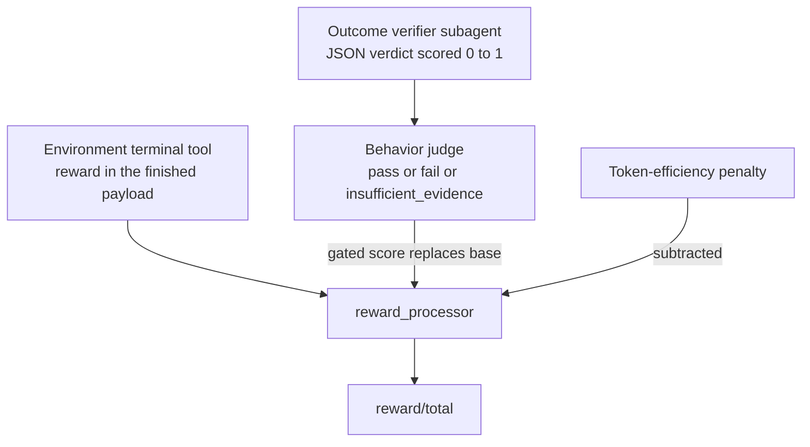

# OpenReward

OpenReward is a family of hosted task environments — Toolathlon, TMax, SWE-ReBench — that serve tasks
and grade them over an HTTP session endpoint. The `platoon-openreward` plugin turns them into Platoon
tasks, wires their tools into an OpenHands agent, and adds the reward, mixture, and curriculum
machinery on top. It is the plugin the repository's largest runs are built on: every 32-node recipe
in `slurm-scripts/` is an OpenReward run.

This page is long because the plugin is. The first three sections tell you whether you can run it at
all; the rest is reference.

## What it gives you

A hand-written plugin gives you a `Task`, an `Env`, and a `reward_processor`. You write the task
catalog, you write the grader, and you keep both correct as the task set grows. OpenReward moves all
three outside your code.

| | Hand-written plugin | OpenReward |
|---|---|---|
| Task catalog | you enumerate it | the environment server serves it; `train_task_limit` / `task_indices` slice it |
| Task prompt | you write it | `get_task` returns the prompt plus a completion contract |
| Grading | your `evaluate()` | the environment's own terminal tool returns a numeric reward |
| Tools | you define them | the environment advertises them; an MCP bridge re-exports them to OpenHands |
| Multiple task sources | one plugin per source | one `environments:` mixture with weights and staging |
| Reward beyond task success | you build it | outcome verifier, behavior gate, token-efficiency penalty |

The mechanism is a per-rollout **MCP bridge subprocess**
(<span class="pl-src">plugins/openreward/platoon/openreward/mcp_bridge.py</span>) that owns exactly
one OpenReward session and republishes the environment's tools as MCP tools. `OpenRewardOpenHandsEnv`
in <span class="pl-src">plugins/openreward/platoon/openreward/env.py</span> calls `get_task` itself
during reset and uses the returned prompt as the agent's first goal, so the root agent does not burn
a model step bootstrapping. When the environment's terminal tool (`claim_done`, or an
environment-specific `submit_answer`) returns a payload with `finished: true`, a callback stops the
conversation and `evaluate()` reads `reward` out of that payload.

!!! note "OpenReward does not use the registry"
    Most plugins on this branch are migrating to the
    [component registry](../architecture/registry.md). OpenReward is not: it registers no
    components and declares no `platoon.plugins` entry point. It ships its own
    `train_scripts/areal/train_areal.py`, `train_scripts/tinker/train_tinker.py` and
    `inference_scripts/run_inference.py`, and those are the supported entry points. No OpenReward
    config contains top-level `EnvironmentConfig` wiring.

## The task suites, and what they cost to run

| Suite | `env_name` | Runs as | Hard requirement |
|---|---|---|---|
| Toolathlon | `toolathlongym` | container image, one server per node | PostgreSQL-backed gym image; the launcher budgets 32 CPUs and 128 GB per server |
| TMax | `tmax/TMax-15K-Harbor` | host-native Python service | pinned `external/tmax` checkout; host Enroot |
| SWE-ReBench | `nebius/SWE-rebench-V2` | host-native Python service | pinned checkout, host Enroot with usable whiteout capabilities, a pre-built task index |

**Toolathlon** is the cheapest to try. One container, one port:

```bash
docker run --rm -e OPENREWARD_PORT=8080 -p 8080:8080 \
  ghcr.io/apga/openreward-toolathlon-gym:latest
```

At cluster scale it is a different animal. The image starts PostgreSQL and then the env server, and
the env server rebuilds a per-session MCP sub-server venv on every `/create`, so it needs real CPU,
real memory, and a large writable scratch path (the launcher redirects `UV_CACHE_DIR` and `TMPDIR`
onto host disk for exactly this reason). The production launcher runs one server per allocation node
and shards rollouts across them by hashing the rollout's output directory — `_select_session_url` in
<span class="pl-src">plugins/openreward/platoon/openreward/rollout.py</span>. Each rollout is one
session, so it stays pinned to one node's server, and in-container nginx keeps worker affinity from
there.

**SWE-ReBench** is the highest bar. It cannot run inside a nested user namespace: it creates writable
Enroot task containers itself, which needs the host `enroot-aufs2ovlfs` helper with working
`CAP_SYS_ADMIN` and `CAP_MKNOD`. It is pinned to one exact commit, and it expects a verified task
index at `.cache/swe-rebench-v2-filtered-verified/task_index.json`, built by
`slurm-scripts/openreward-swe-rebench-preflight.sh` — whose full execution scan covers 6,272 images
and is itself a long-running CPU job.

Credentials are never embedded in the scripts. Export what you need in the submission environment:
`WANDB_API_KEY`, `OPENAI_API_KEY`, `LITELLM_API_KEY`, `HF_TOKEN`, `OPENAI_BASE_URL`,
`LITELLM_BASE_URL`. The `openreward.api_key` field is the *environment server's* key and is `local`
in every checked-in config.

!!! warning "Can you actually run this?"
    Toolathlon on one node: yes, if you can run the container. The full mixture: only on a cluster
    with Slurm, Enroot's `+caps` package, and an allocation model that lets non-GPU service steps
    overlap GPU steps. Everything in `slurm-scripts/` assumes AReaL's `slurm_prealloc` scheduler.

## The environment mixture

!!! danger "Two different `environments:` keys"
    The **top-level** `environments:` in a Platoon config is a list of `EnvironmentConfig` — registry
    wiring that names a `dataset_loader`, a `rollout`, a `reward_processor`. That one is described on
    [Registry and Auto factories](../architecture/registry.md).

    The key on this page is **`openreward.environments`**: a plugin-local list of
    `OpenRewardEnvironmentConfig` nested under the plugin's own config section. It describes *task
    sources* — which server, which split, how often to sample — and has nothing to do with component
    wiring. If your `environments:` sits at column zero, it is the other one.

```yaml title="plugins/openreward/platoon/openreward/configs/areal/toolathlon_swe_openhands_areal_prealloc_16node-cp-ptc-task-tracker-full-r3-fp32-lm-head-ta20-curriculum.yaml"
openreward:
  balance_accepted_batches: false

  environments:
    - label: toolathlon
      env_name: toolathlongym
      split: train
      eval_split: train
      session_url: http://localhost:8082
      session_urls_env_var: OPENREWARD_SESSION_URLS_TOOLATHLON
      api_key: local
      train_task_limit: null
      eval_task_limit: null
      max_tool_calls: 0
      sampling_weight: 1.0
      sampling_start_step: 0

    - label: swe_rebench
      env_name: nebius/SWE-rebench-V2
      split: train
      eval_split: train
      session_url: http://localhost:8084
      session_urls_env_var: OPENREWARD_SESSION_URLS_SWE_REBENCH
      api_key: local
      train_task_limit: null
      eval_task_limit: null
      max_tool_calls: 0
      sampling_weight: 1.0
      sampling_start_step: 20
```

From `OpenRewardEnvironmentConfig` in
<span class="pl-src">plugins/openreward/platoon/openreward/config_defs.py</span>:

| Key | Type | Default | What it does |
|---|---|---|---|
| `label` | str \| None | `None` | Identity of this source in metrics, task records, and session routing. Falls back to `env_name`; must be unique across the list. |
| `env_name` | str | `toolathlongym` | The environment name the server exposes. |
| `session_url` | str | `$OPENREWARD_SESSION_URL` or `http://localhost:8080` | Single backend, used when no pool is configured. |
| `session_urls` | list \| None | `None` | Static pool; rollouts hash onto one entry. |
| `session_urls_env_var` | str \| None | derived | Env var holding a comma-separated pool. Defaults to `OPENREWARD_SESSION_URLS_<LABEL>`, label upper-cased with non-alphanumerics replaced by `_`. |
| `train_task_limit` | int \| None | `None` | Take the first N training tasks. Positive integer when set. |
| `eval_task_limit` | int \| None | `50` | Same for eval. Set `null` to keep the whole catalog. |
| `task_indices` / `task_names` | list \| None | `None` | Pick exact tasks. Configure one or the other, never both. |
| `sampling_weight` | float | `1.0` | Relative share of submitted task slots. Finite and positive. |
| `sampling_start_step` | int | `0` | Withhold this source until the logical model step reaches this value. |
| `subagent_environment_access` | str \| None | `None` | Per-source override of the rollout-wide `shared` / `read_only` child policy. |

`session_urls_env_var` is what makes multi-environment Slurm runs safe: each source gets its own pool
variable, so a TMax server is never handed a Toolathlon session. Mixed configs deliberately ignore the
legacy process-global `OPENREWARD_SESSION_URLS`.

### Weight and start step together are the curriculum

`sampling_weight` sets the steady-state ratio. `BalancedEnvironmentSampler` in
<span class="pl-src">plugins/openreward/platoon/openreward/mixture.py</span> builds a weighted fair
queue with rotating tie-breaks, so three equal-weight sources at batch size eight give 3/3/2, then
3/2/3, then 2/3/3 — the remainder slot moves instead of always landing on the first label.

`sampling_start_step` decides *when a source turns on at all*. `EnvironmentSamplingStartGate` drops
inputs for a label until AReaL's durable logical model version reaches its start step. That version
also advances when an update is skipped, and it is restored from recovery checkpoints, so the
curriculum resumes at the right stage after a restart. The config above means: steps 0-19 are
Toolathlon only; from step 20 the stream is Toolathlon and SWE-ReBench 1:1.

Staged admission is AReaL-only, and four validations reject a bad staging config before the run
starts — one source must begin at step 0, strict batch balance must be off, the dataloader must be
single-controller, and Tinker refuses any nonzero start step. [Curriculum and task
mixtures](../recipes/curriculum.md) lists them with the reasoning behind each.

Watch `openreward/curriculum/<label>/active` and `openreward/curriculum/<label>/skipped_inputs` to
confirm the stage actually flipped.

### Balanced accepted batches

Separate from the curriculum, `balance_accepted_batches` (default `true`) decides whether the
*accepted* optimizer batch is balanced or only the *submitted* stream is.

| Setting | Behavior | Cost |
|---|---|---|
| `true` | `StrictEnvironmentBatchCoordinator` admits exactly the weighted quota for the step, drains the round, retries only short labels | incompatible with AReaL `dynamic_bs`; no multi-step prefetch |
| `false` | native completion-order batching; `AcceptedEnvironmentBatchObserver` only reports the drift | a fast environment can crowd out a slow one within a step |

With strict balance, repeated failures stop after `accepted_batch_max_replacement_rounds` (default
`8`) with a quota diagnostic rather than silently changing the mix. The quota counts task *groups*,
not datums or tokens — recursive trees and filtering still produce different per-environment token
totals.

## Rewards

Four things can contribute to the number a trajectory trains on. Only the first always exists.



### The base reward

`OpenRewardOpenHandsEnv.evaluate` returns the environment's own `reward` from the finished payload.
If that payload's `metadata.invalid` is `true`, the reward is forced to zero and the trajectory is
marked invalid so downstream filtering can drop it rather than train on a broken episode.

### The outcome verifier

Set `openreward.enable_subagent_reward_judging: true` and every finished subagent gets a verifier
agent launched against the *same live environment*. The verifier is told not to trust the child's
summary, and must return this schema through its `finish` tool:

```json
{
  "status": "one of: verified, partial, failed, insufficient_evidence",
  "score": 0.0,
  "summary": "short verdict",
  "passed_claims": ["claim that was verified"],
  "failed_claims": ["claim that failed verification"],
  "evidence": ["tool-backed evidence you inspected"]
}
```

Normalization in <span class="pl-src">platoon/agents/actions/subagent.py</span> is strict. The score
must be in `[0, 1]` *and* consistent with the status: `verified` above zero, `partial` strictly
between, `failed` and `insufficient_evidence` exactly zero. An inconsistent pair scores zero and is
marked not training-eligible. A well-formed `failed` is a legitimate trainable zero; a malformed
verdict is suppressed instead of teaching noise. Verifier trajectories carry
`misc.exclude_from_training: true` — they are scaffolding, not policy data.

`subagent_reward_judge_max_steps` (default `20`) bounds the verifier. Verifiers get *shared*
environment access even under a `read_only` child policy, because a generic read-only allowlist
cannot verify Toolathlon (every catalog call routes through `call_tool`) or SWE-ReBench (running tests
needs `bash`). Shared access still strips `claim_done` and `submit_answer`, so a verifier cannot
submit the root task.

### The behavior judge

The verifier answers "is the result right". The behavior judge answers "did *this* trajectory earn
it". Enable with `enable_subagent_behavior_judging: true`, which requires
`enable_subagent_reward_judging: true`.

It is not a separate reward model. `OpenRewardBehaviorJudge` in
<span class="pl-src">plugins/openreward/platoon/openreward/behavior_judge.py</span> takes a shallow
copy of the exact policy LLM being trained — same endpoint, model, tokenizer, sampling path — and
changes only the usage id, output budget, and timeout. Its one-shot completion is sampled with
`store=false` so AReaL does not export the auxiliary call as policy data.

The response must be exactly one bare JSON object with exactly these five keys:

```json
{"status":"pass|fail|insufficient_evidence","passed":true|false|null,
 "reason":"concise rationale","violations":["short labels"],"evidence":["specific references"]}
```

`parse_behavior_judgment` rejects everything else: extra or missing keys, a status that disagrees
with `passed`, a `pass` carrying violations, a `fail` carrying none, a decisive verdict citing no
evidence.

What it looks for is credit for a real, task-relevant contribution — doing the work, or delegating
coherent subproblems and then checking and integrating the evidence. It must fail an agent that
launched one child for the entire task and forwarded its answer, that claims shared-state work it
cannot show it authored, or that loops on identical failing calls without adapting. Delegation by
itself is never a violation, and a few transient errors that get diagnosed and corrected are not
either.

Its input is bounded and deliberately assembled: a deterministic whole-trajectory
action/error/delegation ledger, aggregate statistics, compact descendant lineage, the latest safe
condensation marked as untrusted state, then detailed public events after that boundary. Hidden
reasoning, condenser reasoning, and raw descendant histories are excluded.

**How a verdict becomes a reward.** The gate is binary and multiplicative:

```
score = outcome_score * (1.0 if behavior_status == "pass" else 0.0)
```

| Outcome verdict | Behavior verdict | Effective score | Trainable |
|---|---|---|---|
| eligible, above zero | `pass` | outcome score preserved | yes |
| eligible, above zero | `fail` | 0 | yes — useful negative supervision |
| eligible, above zero | timeout, malformed, or `insufficient_evidence` | 0 | no |
| eligible, zero | not run | 0 | yes |
| ineligible | not run | 0 | no |

The judge runs only after a positive, eligible outcome verdict. That ordering is deliberate: for a
zero outcome the judge cannot change the score and would only add latency and API load. A judge that
cannot produce a valid verdict fails closed *and* marks the child ineligible, so an uncertain zero is
never taught as a real zero.

Both components stay separately inspectable in `misc.subagent_outcome_judgment` and
`misc.subagent_behavior_judgment`; `misc.subagent_reward_judgment` holds the effective gated verdict.

### The reward processor

`reward_processor` in <span class="pl-src">plugins/openreward/platoon/openreward/rewards.py</span>
assembles the final number:

```python title="plugins/openreward/platoon/openreward/rewards.py"
base_reward = judgment_score if judgment_score is not None else openreward_score
...
pre_efficiency_reward = base_reward + delegation_bonus
efficiency_metrics = trajectory_token_efficiency_metrics(traj)
efficiency_penalty = efficiency_metrics.get(TOKEN_EFFICIENCY_PENALTY_REWARD_KEY, 0.0)
reward = pre_efficiency_reward - efficiency_penalty
```

A judged subtrajectory uses its gated judgment score as the base; everything else uses the raw
environment reward. Keys it emits:

| Key | Meaning |
|---|---|
| `reward/total` | the trained value |
| `reward/total_before_efficiency` | base plus delegation bonus |
| `reward/success` | base reward, before delegation and efficiency |
| `reward/openreward` | the raw environment reward, always present |
| `reward/openreward_env/<label>` | environment reward tagged by mixture label |
| `reward/subagent_judgment` | gated judgment score, when judged |
| `reward/subagent_outcome_judgment`, `reward/subagent_behavior_gate` | the two components |
| `reward/subagent_launched`, `reward/subagent_succeeded`, `reward/delegation_bonus` | delegation accounting; semantic zeros when nothing delegated |
| `reward/efficiency_penalty` | the subtracted token cost |

To change any of this, see [custom rewards](../customization/rewards.md). The judge machinery itself
is documented on [sub-agents](../architecture/subagents.md).

## Operational guards

These runs are four-hour allocations on 16 to 32 nodes. Every guard below exists because something
went wrong at that scale and burned one.

| Guard | Protects against | Where |
|---|---|---|
| Rollout timeout and root step cap | one hung session holding an entire optimizer step | `run_rollout` in <span class="pl-src">plugins/openreward/platoon/openreward/rollout.py</span> |
| Task-catalog hardening | materializing a billion-task catalog in order to take two tasks | `get_task_ids` in <span class="pl-src">plugins/openreward/platoon/openreward/tasks.py</span> |
| SWE-ReBench runtime guard | an unvalidated fork, or a node whose Enroot silently cannot write | `plugins/openreward/swe-rebench-runtime-guard.sh` |
| Toolathlon server supervisor | one crashed worker killing every session on the node | `plugins/openreward/scripts/openreward-toolathlon-resilient-entrypoint.sh` |
| Preallocation dependency detection | building Transformer Engine and Apex for a run that never uses Megatron, or skipping them for one that does | `slurm-scripts/openreward-toolathlon-prealloc-base.sh` |
| GPU keepalive | idle reclamation during multi-minute environment startup | `slurm-scripts/gpu_keepalive.py` |

**Rollout timeouts.** `rollout_config.timeout` bounds the whole rollout, `step_timeout` bounds one
step. When the rollout timeout fires the collection still comes back, tagged
`misc.rollout_timed_out: True`, and only the *active* trajectory is marked cancelled — children that
already finished keep their results instead of being discarded. `rollout_config.max_steps` caps the
root without touching the recursive child budget, and it is applied to a copy so a reusable task
record is not mutated.

**Task hardening.** `train_task_limit` and `eval_task_limit` must be positive integers; an explicit
zero raises instead of quietly meaning "unlimited". With a limit set, the loader uses the indexed
`num_tasks`/`get_task` API rather than `list_tasks`, so a catalog of 10^12 tasks is never
materialized. When a legacy server has no indexed API and enumeration also fails, the error reports
both failures rather than only the last one.

**The SWE-ReBench runtime guard** does two independent checks. Source integrity first: the validated
commit lives in `plugins/openreward/swe-rebench-source-revision.txt` as data, not as an inherited
environment default, so an old Slurm continuation cannot silently select a different checkout. The
checkout must sit at exactly that commit with a clean worktree, and one known-unsafe revision is
denied by name. Then a *behavioral* Enroot probe: file capabilities on `enroot-aufs2ovlfs` are
diagnostic only, so the guard actually exercises opaque and ordinary whiteouts in the same temporary
filesystem imports will use. A site that provides those privileges another way still passes; a node
where the capabilities were dropped fails before any GPU is claimed.

**The Toolathlon server supervisor** solves a specific cascade. Toolathlon's nginx front end hashes
each session to a stable internal Uvicorn port, so a worker crash must not renumber ports. The
supervisor restarts only the exited worker, at its original port, with bounded exponential backoff;
other workers and their live sessions stay up. An nginx exit or an exhausted restart budget stays
fatal on purpose, so the launcher's health monitor restarts the allocation instead of serving a
degraded node. Tune with `OPENREWARD_WORKER_RESTART_MAX_ATTEMPTS` (default 5),
`OPENREWARD_WORKER_RESTART_RESET_SECS` (300),
`OPENREWARD_WORKER_RESTART_BACKOFF_INITIAL_SECS` (1), and
`OPENREWARD_WORKER_RESTART_BACKOFF_MAX_SECS` (30).

**Preallocation dependency detection** greps the config for a Megatron actor backend and sets
`OPENREWARD_BUILD_TE` / `OPENREWARD_BUILD_APEX` accordingly, handling quoted, single-quoted, and bare
backend strings alike. An explicitly exported value always wins, and an SGLang-only config builds
neither. The all-layer LoRA launcher forces both on, because its topology needs them regardless of
what the grep would conclude.

## The recipe matrix

Each of these is one ablation over the same recursive base. All are AReaL.

| Recipe | Turned on by | Launcher in `slurm-scripts/` |
|---|---|---|
| Behavior-gated continuation | `openreward.enable_subagent_behavior_judging: true` | `openreward-toolathlon-prealloc-32node-ptc-recursive-bs8-behavior-gated.sh` |
| Radix cache | `sglang.disable_radix_cache: false` | `openreward-toolathlon-prealloc-32node-ptc-recursive-bs8-behavior-gated-radix.sh` |
| LoRA, all layers | `actor.use_lora: true` plus `target_modules` | `openreward-toolathlon-prealloc-32node-ptc-recursive-bs8-behavior-gated-lora-all-layers-r32.sh` |
| Root reward propagation | `workflow_config.rollout_config.propagate_root_success: true` | `openreward-toolathlon-prealloc-32node-ptc-recursive-bs8-rootprop.sh` |
| Token-efficiency penalty | `workflow_config.token_efficiency_reward.enabled: true` | `openreward-multienv-prealloc-32node-ptc-recursive-bs8-efficiency.sh` |
| Toolathlon → SWE curriculum | `sampling_start_step: 20` on the second source | `openreward-toolathlon-swe-prealloc-16node-ptc-task-tracker-ta20-curriculum.sh` |

**Behavior-gated continuation.** Keeps the environment outcome verifier and multiplies its positive
score by a one-shot behavioral audit from the same policy checkpoint. To isolate the gate, the config
also disables token-efficiency shaping and root propagation, so the gated verifier score is the
child's complete reward. It runs with `subagent_max_depth: 2`, `subagent_default_max_steps: 100`, and
`subagent_datum_keep_probability: 0.25`.

**Radix cache.** AReaL disables SGLang's radix cache for training by default. This ablation changes
only `sglang.disable_radix_cache` and holds every other behavior-gated setting fixed, including the
static memory fraction. It exists to measure prefix reuse against the non-radix control — not as a
recommended default.

**LoRA all-layers.** Rank 32 across every linear path in all forty language blocks: attention
projections, GDN in/out, routed and shared MoE projections, and the routing gates. Norms, embeddings,
and the lm-head are not LoRA targets. SGLang serves ordinary merged full weights (`rollout.use_lora:
false`, `megatron.merge_lora_for_update_weights: true`), so no runtime LoRA support is needed and the
proven kernels stay in play. This is the one recipe whose launcher forces the Transformer Engine and
Apex builds.

**Root reward propagation.** With `propagate_root_success: true`, every solver trajectory in the tree
trains on the completed root outcome, which makes the verifier tree unnecessary — the config turns
`enable_subagent_reward_judging` off and sets the delegation coefficient to zero. It is the direct
alternative to per-child judging: much cheaper, no auxiliary agents, but no per-child credit
assignment either.

**Token-efficiency penalty.** Charges each policy agent for the deployable tokens its own subtree
spent:

```
effective = output_tokens + 0.01 * logical_input_tokens
penalty   = min(0.20, 0.05 * log2(1 + effective / 20_000))
```

Those constants are `output_token_weight`, `input_token_weight`, `max_penalty`, `coefficient`, and
`reference_tokens` on `TokenEfficiencyRewardConfig` in
<span class="pl-src">platoon/train/areal/config_defs.py</span>. Input tokens are discounted heavily
because exported AReaL prompts resend the full logical context even when the inference server reuses
a cached prefix. Synthetic reward-verifier agents and their whole branches are excluded from
attribution: they do not exist at inference time, so charging for them would shape the wrong
behavior. `attribution` accepts only `policy_subtree`.

## Running it

Start an environment server, then point a config at it.

=== "AReaL"

    AReaL loads config through OmegaConf. Overrides are bare `key=value` with **no leading dashes**.

    ```bash
    cd plugins/openreward
    uv sync --extra areal
    uv run python -m platoon.openreward.train_scripts.areal.train_areal \
      --config platoon/openreward/configs/areal/toolathlon_openhands_areal.yaml \
      openreward.session_url=http://localhost:8080
    ```

=== "Tinker"

    Tinker loads config through argparse. Overrides are `--dotted.key value`.

    ```bash
    cd plugins/openreward
    uv sync --extra tinker
    uv run python -m platoon.openreward.train_scripts.tinker.train_tinker \
      --config platoon/openreward/configs/tinker/toolathlon_openhands_tinker.yaml \
      --openreward.session_url=http://localhost:8080
    ```

Inference uses the same argparse syntax as Tinker:

```bash
uv run python -m platoon.openreward.inference_scripts.run_inference \
  --config platoon/openreward/configs/inference/toolathlon_openhands_inference.yaml \
  --openreward.session_url=http://localhost:8080
```

On Slurm, submit a launcher. Each has a default config and takes an override path as `$1`:

```bash
# 16-node Toolathlon + TMax + SWE-ReBench, non-recursive default
sbatch slurm-scripts/openreward-multienv-prealloc.sh

# same wrapper, bounded recursive variant
sbatch slurm-scripts/openreward-multienv-prealloc.sh \
  plugins/openreward/platoon/openreward/configs/areal/toolathlon_tmax_swe_openhands_areal_prealloc_16node-cp-ptc-recursive-r3-fp32-lm-head.yaml
```

### What to change first

1. **`trial_name`.** AReaL recovery is keyed on it. Reusing a name from another recipe will recover
   *that* recipe's optimizer and rollout state into your run. Every ablation config in the repository
   carries a comment saying exactly this.
2. **`cluster.fileroot` and `cluster.name_resolve.nfs_record_root`.** They point at one specific
   Lustre path. Nothing works until they point at yours.
3. **`actor.path` and `stats_logger.wandb.project`.** Keep `actor.backend` and `actor.path` literal in
   the leaf config — the launcher inspects the YAML text before Hydra composition, so an
   interpolation there breaks dependency detection and tokenizer resolution.
4. **`session_url`, or the per-label pool variables.** Locally, `openreward.session_url`. On a
   cluster, the launcher exports `OPENREWARD_SESSION_URLS_<LABEL>`.
5. **`train_dataset.batch_size` and `workflow_config.group_size`.** The mixed sampler raises if the
   selected task set is smaller than one global batch.

Configs compose through Hydra `defaults:`, so a new ablation is usually a ten-line leaf on top of an
existing base rather than a full copy.

!!! tip "Start smaller than you think"
    `toolathlon_openhands_areal.yaml` is single-node FSDP with Qwen3-4B. Get one rollout to produce a
    nonzero `reward/openreward` there before you request 32 nodes.

## See also

- [OpenHands](openhands.md) — the agent that runs inside these environments
- [Sub-agents](../architecture/subagents.md) — the trajectory tree, the judges, and what trains
- [Recursive rollouts](../recipes/recursive.md) — recursion as a recipe rather than an integration
- [Custom rewards](../customization/rewards.md) — replacing or extending `reward_processor`
- [Scaling](../recipes/scale.md) and [Multi-node](../tutorials/multi-node.md) — the cluster side
