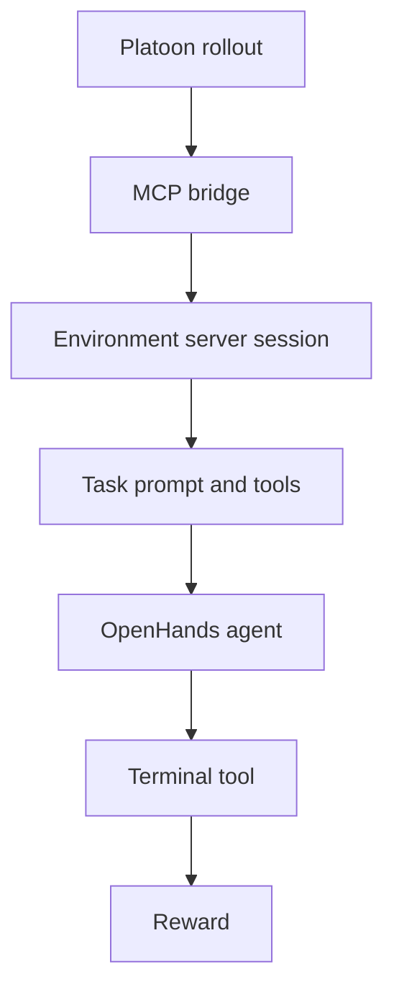

# OpenReward

**Environments as a service.** OpenReward tasks live behind an environment server. Platoon opens a
session against that server over HTTP, and the server hands back the task prompt, the tools the task
needs, and — when the agent submits — the reward. Nothing about the task runs inside the trainer, so
the environment fleet is deployed, sized and restarted independently of the training job.

`platoon-openreward` is a [capability plugin](index.md): it adds an integration with an external
environment service rather than a single task. On top of the session protocol it provides a
task-mixture config, staged introduction of task sources, and judge-based rewards.

## How a rollout talks to the environment



Each rollout gets its own bridge subprocess
(<span class="pl-src">plugins/openreward/platoon/openreward/mcp_bridge.py</span>) that owns exactly
one session and republishes the environment's tools as MCP tools, so the
[OpenHands](openhands.md) agent sees them like any other toolset. `OpenRewardOpenHandsEnv` in
<span class="pl-src">plugins/openreward/platoon/openreward/env.py</span> calls `get_task` during
reset and uses the returned prompt as the agent's first goal. When the environment's terminal tool
(`claim_done`, or an environment-specific `submit_answer`) reports the episode finished, the
conversation stops and `evaluate()` reads `reward` out of that payload.

Because a session is pinned to one server, a rollout stays on one backend for its whole life. Point
several rollouts at a pool of servers and each one hashes onto a member — the mechanism behind
multi-node runs, covered in [Scaling](../guides/scale.md).

## Task suites

| Suite | `env_name` | Runs as |
|---|---|---|
| Toolathlon | `toolathlongym` | container image, one server per node |
| TMax | `tmax/TMax-15K-Harbor` | host-native Python service |
| SWE-ReBench | `nebius/SWE-rebench-V2` | host-native Python service |

Toolathlon is the one to start with: a single image, a single port.

```bash
docker run --rm -e OPENREWARD_PORT=8080 -p 8080:8080 \
  ghcr.io/apga/openreward-toolathlon-gym:latest
```

It starts PostgreSQL and then the env server, and it builds a per-session sub-server on every
`/create`, so give it real CPU, real memory and a large writable scratch path. TMax and SWE-ReBench
run as host services from their own checkouts, and SWE-ReBench additionally creates writable Enroot
containers per task, which needs host privileges a nested user namespace cannot provide.

The `openreward.api_key` field is the *environment server's* key, not a model provider's; it is
`local` for a locally run server. Model and logging credentials (`OPENAI_API_KEY`, `WANDB_API_KEY`
and friends) come from the environment as usual — nothing is embedded in the configs.

## Task mixtures and curricula

A run can draw from several task sources at once. Each source gets a `label`, a server, and a
sampling weight; `sampling_start_step` withholds a source until training reaches a given step. Weight
plus start step is how a curriculum is expressed.

!!! warning "This is not the registry `environments:` list"
    `openreward.environments` is a **plugin-local** list of `OpenRewardEnvironmentConfig`, nested
    under the plugin's own config section. It describes task *sources*. The top-level
    `environments:` at column zero is a list of `EnvironmentConfig` and wires up components — see
    [Components](../architecture/components.md). If your `environments:` sits at column zero, it is
    the other one.

```yaml title="plugins/openreward/platoon/openreward/configs/areal/toolathlon_swe_openhands_areal_prealloc_16node-cp-ptc-task-tracker-full-r3-fp32-lm-head-ta20-curriculum.yaml"
openreward:
  balance_accepted_batches: false

  environments:
    - label: toolathlon
      env_name: toolathlongym
      split: train
      session_url: http://localhost:8082
      session_urls_env_var: OPENREWARD_SESSION_URLS_TOOLATHLON
      sampling_weight: 1.0
      sampling_start_step: 0

    - label: swe_rebench
      env_name: nebius/SWE-rebench-V2
      split: train
      session_url: http://localhost:8084
      session_urls_env_var: OPENREWARD_SESSION_URLS_SWE_REBENCH
      sampling_weight: 1.0
      sampling_start_step: 20
```

Steps 0-19 are Toolathlon only. From step 20 the stream is Toolathlon and SWE-ReBench 1:1.

The fields that matter, from `OpenRewardEnvironmentConfig` in
<span class="pl-src">plugins/openreward/platoon/openreward/config_defs.py</span>:

| Key | Default | What it does |
|---|---|---|
| `label` | `env_name` | Identity of this source in metrics and session routing. Unique across the list. |
| `env_name` | `toolathlongym` | The environment the server exposes. |
| `session_url` | `http://localhost:8080` | Single backend, used when no pool is configured. |
| `session_urls` | `None` | Static pool; rollouts hash onto one entry. |
| `session_urls_env_var` | `OPENREWARD_SESSION_URLS_<LABEL>` | Env var holding a comma-separated pool. |
| `train_task_limit` | `None` | Take the first N training tasks. `eval_task_limit` is the eval twin, default `50`. |
| `task_indices` / `task_names` | `None` | Pick exact tasks. Set one or the other. |
| `sampling_weight` | `1.0` | Relative share of submitted task slots. |
| `sampling_start_step` | `0` | Withhold this source until the model step reaches this value. |

Give every source its own `session_urls_env_var`. That is what keeps a multi-source run honest: a
TMax server is never handed a Toolathlon session.

### Weighted sampling

`BalancedEnvironmentSampler` in
<span class="pl-src">plugins/openreward/platoon/openreward/mixture.py</span> deals slots out as a
weighted fair queue with rotating tie-breaks, so three equal-weight sources at batch size eight give
3/3/2, then 3/2/3, then 2/3/3 — the leftover slot moves instead of always landing on the first label.

Weights govern the *submitted* stream. `balance_accepted_batches` (default `true`) decides whether
the *accepted* optimizer batch is balanced too: strict balance admits exactly the weighted quota each
step, at the cost of ruling out multi-step prefetch and AReaL's `dynamic_bs`.

### Staged introduction

`sampling_start_step` decides when a source turns on at all. The gate reads AReaL's durable logical
model version, which also advances when an update is skipped and is restored from recovery
checkpoints, so a restart resumes at the right stage.

Three things to know before you stage a source:

- Staging is <span class="pl-tag pl-tag--areal">AReaL</span> only, and needs the single-controller
  dataloader.
- At least one source must start at step 0, and staging requires `balance_accepted_batches: false`.
- The stage boundary is a function of the step, so start a fresh `trial_name` — resuming a trial
  already past the start step skips the warmup entirely.

Watch `openreward/curriculum/<label>/active` and `openreward/curriculum/<label>/skipped_inputs` to
confirm the stage flipped. Expect the first mixed step to be lopsided: warmup rollouts are still in
flight when the gate opens.

!!! tip "A curriculum is not free"
    A staged mixture buys you a second task service to keep alive and a transition you can only see
    in telemetry. Reach for one when you can name the failure it fixes — usually zero signal on the
    hard set, or a cost asymmetry that makes early steps cheaper somewhere else.

## Rewards

The base reward is the environment's own number from the finished payload. Two optional judges can
refine it for delegated sub-agents, and a token-efficiency penalty can be subtracted.

**Outcome verifier.** With `enable_subagent_reward_judging: true`, every finished sub-agent gets a
verifier agent launched against the *same live environment*. The verifier is told not to trust the
child's summary; it inspects the environment itself and returns a status plus a score in `[0, 1]`.
Status and score must agree — `verified` above zero, `partial` strictly between, `failed` exactly
zero — and an inconsistent verdict scores zero and is marked not training-eligible. Verifier
trajectories never train.

**Behavior judge.** The verifier answers "is the result right". The behavior judge answers "did this
trajectory earn it". `enable_subagent_behavior_judging: true` (which requires the verifier) runs a
one-shot audit using the exact policy model being trained — same endpoint, tokenizer and sampling
path — over a bounded ledger of the trajectory's actions, errors and delegations. It looks for a
real, task-relevant contribution: doing the work, or delegating coherent subproblems and then
checking and integrating the evidence. Delegation by itself is never a violation.

The gate is binary and multiplicative:

```
score = outcome_score * (1.0 if behavior_status == "pass" else 0.0)
```

A `fail` is a trainable zero — useful negative supervision. A judge that cannot produce a valid
verdict fails closed and marks the child ineligible, so an uncertain zero is never taught as a real
one. The judge runs only after a positive outcome verdict, since it cannot change a zero.

**Assembling the number.** `reward_processor` in
<span class="pl-src">plugins/openreward/platoon/openreward/rewards.py</span> takes the gated
judgment score as the base when a sub-trajectory was judged and the raw environment reward
otherwise, adds any delegation bonus, and subtracts the token-efficiency penalty. Useful keys:

| Key | Meaning |
|---|---|
| `reward/total` | the trained value |
| `reward/openreward` | the raw environment reward, always present |
| `reward/openreward_env/<label>` | environment reward tagged by mixture label |
| `reward/subagent_judgment` | the gated judgment score, when judged |
| `reward/efficiency_penalty` | the subtracted token cost |

[Multi-agent workflows](../guides/multi-agent.md) covers the trajectory tree these judges score.

## Running it

Start an environment server, then point a config at it.

=== "AReaL"

    Overrides are bare `key=value`, no leading dashes.

    ```bash
    cd plugins/openreward
    uv sync --extra areal
    uv run python -m platoon.openreward.train_scripts.areal.train_areal \
      --config platoon/openreward/configs/areal/toolathlon_openhands_areal.yaml \
      openreward.session_url=http://localhost:8080
    ```

=== "Tinker"

    Overrides are `--dotted.key value`.

    ```bash
    cd plugins/openreward
    uv sync --extra tinker
    uv run python -m platoon.openreward.train_scripts.tinker.train_tinker \
      --config platoon/openreward/configs/tinker/toolathlon_openhands_tinker.yaml \
      --openreward.session_url http://localhost:8080
    ```

Inference uses the same argparse syntax as Tinker:

```bash
uv run python -m platoon.openreward.inference_scripts.run_inference \
  --config platoon/openreward/configs/inference/toolathlon_openhands_inference.yaml \
  --openreward.session_url http://localhost:8080
```

Configs compose through Hydra `defaults:`, so a new variant is usually a short leaf on top of an
existing base. In a fresh config, change `trial_name` first — AReaL recovery is keyed on it — then
the cluster paths, the model path, and the session URLs.

!!! tip "Start smaller than you think"
    `toolathlon_openhands_areal.yaml` is single-node with a small model. Get one rollout to produce a
    nonzero `reward/openreward` there before you ask for a cluster.

## See also

- [OpenHands](openhands.md) — the agent harness that runs inside these environments
- [Multi-agent workflows](../guides/multi-agent.md) — delegation, sub-agent trees, and what trains
- [Scaling](../guides/scale.md) — server pools and long-running allocations
- [Configuration](../reference/configuration.md) — every key with its default
