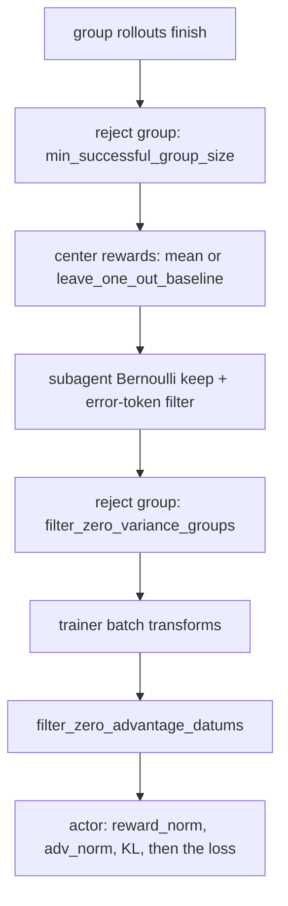

# RL algorithms

Platoon ships three policy-optimization objectives for the AReaL backend and, on Tinker, forwards
whatever loss name you write straight to the service. Picking between them matters less than most
people expect. The group and
advantage settings around the loss — how many rollouts share a baseline, which groups get thrown
away, whether KL and normalization are on — move results far more, and they are where the shipped
configs disagree with each other.

This page is about choosing. For how a loss is bound, what it receives, and how to add your own, see
[custom loss function](../customization/loss.md); for every key and its default, see the
[configuration reference](../reference/configuration.md).

## The three registered losses

`register_loss_fn` in <span class="pl-src">platoon/train/areal/loss_functions.py</span> puts three
names in the registry. That is the whole menu unless you register your own.

| `loss_fn` | What it is | Reach for it when |
|---|---|---|
| `grpo` | Thin wrapper over `areal.trainer.ppo.actor.grpo_loss_fn` | You want the standard clipped objective and all of AReaL's `actor.*` machinery |
| `ppo` | The same wrapper, second name | Never for a behavioral reason — it is an alias |
| `cispo` | Platoon's own implementation | Long agentic rollouts where clipping would silently drop most of your tokens |

### `grpo` and `ppo` are the same function

Both registered wrappers call `upstream_grpo_loss_fn` and add nothing. Choosing `ppo` over `grpo`
changes the string in your logs and nothing else. Everything that makes the upstream objective
behave differently — `eps_clip`, `eps_clip_higher`, `c_clip`, dual clipping, decoupled loss, M2PO
masking, SAPO — is configured under `actor.*` and reaches the loss through the common kwargs the
actor assembles in `_make_loss_fn`, not through `loss_fn_kwargs`.

Take `grpo` when you want the well-trodden path: it is what you get with no `loss_fn_config` block
at all, and it is the objective every AReaL knob was designed against. Its cost on agentic workloads
is the usual one. A token whose ratio has drifted outside the clip band contributes zero gradient.
On a 40k-token trajectory collected several policy versions ago, that can be a large fraction of the
batch.

### `cispo`

CISPO clips the importance ratio and then uses the clipped value as a **detached coefficient**, so
the gradient path is only `log π_θ`:

```
L = -detach(clip(ρ, low, high)) · A · log π_θ        ρ = exp(logprobs - old_logprobs)
```

Nothing is ever zeroed by clipping. A drifted token still trains, with a bounded weight. That is the
whole trade: you keep signal on every action token at the price of a biased gradient — the
coefficient no longer participates in differentiation, so this is not the PPO surrogate with a
tighter bound, it is a reweighted REINFORCE. In exchange it is markedly less sensitive to staleness,
which is why the long-context agentic configs in this repository all select it.

Registered defaults are `clip_low_threshold: 0.0` and `clip_high_threshold: 5.0` — an upper bound
only, since a ratio is never negative. Every committed config that selects CISPO restates both
values rather than inheriting them:

```yaml title="plugins/textcraft/platoon/textcraft/configs/areal/nv_textcraft_synth_ctx40000_depth_aware_medium_areal.yaml"
loss_fn_config:
  loss_fn: cispo
  loss_fn_kwargs:
    clip_low_threshold: 0.0
    clip_high_threshold: 5.0
```

A high threshold of 5.0 is loose. If your `clipped_tokens` rate stays near zero, the clip is doing
nothing and you are running plain reweighted REINFORCE; tighten it before concluding CISPO is
unstable. No committed config has tuned away from 5.0, so treat any other value as your own
experiment.

### Token or sequence importance sampling

`cispo` reads `importance_sampling_level` from the actor config, not from `loss_fn_kwargs`, because
the actor supplies it as a common kwarg.

- `token` (the default) uses a per-token ratio.
- `sequence` is the **GSPO** variant: the ratio becomes the per-sequence geometric mean of the token
  ratios, broadcast back over the sequence, and the advantage is replaced by the sequence mean.

```yaml
actor:
  importance_sampling_level: sequence
```

Sequence level collapses within-sequence ratio variance into one number, which is the point when
individual token ratios are noisy but the sequence as a whole is on-policy. It also means one
extreme token can no longer be clipped on its own — the whole sequence is weighted together.

!!! warning "Untested in this tree"
    No committed config sets `importance_sampling_level`, so the GSPO path in
    `_compute_sequence_level_ratio_and_advantages` has no training run behind it here. It is
    implemented for both the packed 1D layout (which needs `cu_seqlens`) and the padded 2D layout,
    but nobody has trained a model with it in this repository. Treat it as an experiment, not a
    recommendation.

### What the shipped configs actually run

| Loss | Configs |
|---|---|
| `cispo` | Every AReaL config under `plugins/appworld`, `plugins/deepdive`, `plugins/email-search`, `plugins/oolong`, `plugins/openreward` and `plugins/textcraft`, plus the `nv_number_search_cispo_*` pair; every Tinker config |
| `grpo` (by omission) | <span class="pl-src">plugins/codegrep/platoon/codegrep/codegrep_areal.yaml</span>, <span class="pl-src">plugins/number-search/platoon/number_search/number_search_areal.yaml</span>, <span class="pl-src">plugins/number-search/platoon/number_search/nv_number_search_areal.yaml</span> |
| `ppo` | None |

The three `grpo` configs get it by leaving `loss_fn_config` out entirely. The codegrep one is
labelled `experiment_name: codegrep-reinforce-plus-plus` and pairs the default loss with batch-level
reward and advantage normalization instead of a within-task group — a genuinely different algorithm,
not an oversight.

## The settings that shape learning more than the loss

Advantage shaping happens in a fixed order, and the order is what decides which knob interacts with
which:



Everything through the zero-variance check runs inside `arun_episode` in
<span class="pl-src">platoon/train/areal/workflows/group_rollout_workflow.py</span>; the rest runs in
`_postprocess_rollout_batch` in <span class="pl-src">platoon/train/areal/rl.py</span>. The
[group rollout walkthrough](../walkthroughs/group-rollout-workflow.md) covers the mechanism.

### `group_size` — the setting to get right first

`workflow_config.group_size` is the number of rollouts of one task that share a baseline. Both
built-in objectives are critic-free: the advantage is the task reward minus the mean over the group.
With `group_size: 1` there is nothing to subtract and every advantage is zero — the run trains on
nothing unless you also turn on batch-level normalization, which is exactly what codegrep does.

The AReaL default is `1` and the Tinker default is `8`. That asymmetry catches people. If you write
an AReaL config from scratch and forget `group_size`, you get a silent no-op run.

Real values in this tree are 8 in most configs and 4 in a handful — on AReaL,
`toolathlon_openhands_areal.yaml` and its 2-node prealloc variant; on Tinker, the DeepDive,
email-search and Toolathlon runs. Trajectories requested per optimizer step is
`train_dataset.batch_size × group_size` — the bs8 openreward config spells this out in a comment as
"eight task groups x eight completions = 64 requested rollout trajectories per optimizer update".

Cost is linear. Doubling `group_size` doubles rollout wall time per step for a variance reduction
that goes as `1/√k`. Below about 4 the baseline is too noisy to be worth the centering; above 8 you
are usually better off spending the rollouts on more distinct tasks.

### `leave_one_out_baseline`

Default `False`, which centers each member on the group mean. With it on, member *i* is centered on
the mean of the other members, `(total - r_i) / (n - 1)`. That removes the correlation between a
member's own reward and its baseline, at the cost of a slightly noisier baseline per member.

Turn it on for `group_size` around 8. It is set in 24 committed configs across both backends — the
recursive AppWorld runs, the depth-aware TextCraft runs, every TextCraft Tinker config. Better bias
for a small variance cost, and it is free — no extra rollouts.

```yaml title="plugins/textcraft/platoon/textcraft/configs/areal/nv_textcraft_synth_ctx40000_depth_aware_medium_areal.yaml"
workflow_config:
  group_size: 8
  leave_one_out_baseline: True
```

The AReaL implementation also handles partially-valid groups: only completed roots contribute to the
baseline, and a lone valid member falls back to subtracting its own reward.

### `min_successful_group_size` and `filter_zero_variance_groups` <span class="pl-tag pl-tag--areal">AReaL</span>

These two decide which groups get discarded before they can dilute a step. Neither exists on the
Tinker `WorkflowConfig`.

`min_successful_group_size` (default `1`, must be in `[1, group_size]`) rejects a group twice — once
if too few members returned data, again if too few of the returned members have a *completed* root
reward. Raise it when a partial group would produce a baseline you would not trust. Two openreward
configs set `4` against `group_size: 8`, with the comment "Reject groups with fewer than four usable
members rather than constructing a degenerate baseline."

The cost is throughput: a rejected group contributes nothing to the step, and on flaky long-horizon
environments a high threshold discards real work. Pair it with `straggler_timeout_seconds` and
`straggler_quorum` rather than raising it alone — see [scaling](scale.md).

`filter_zero_variance_groups` (default `True`) drops a group whose retained rewards are all
identical. On a binary reward that is every all-fail and every all-succeed group, which is most of
them early in training. Keeping them costs compute for exactly zero gradient, so the default is
right for most runs.

Turn it off when a group with identical *root* rewards can still carry signal — recursive runs where
subagent datums differ, or any objective with a non-policy-gradient term. The prealloc openreward
configs set `filter_zero_variance_groups: false`.

### `filter_zero_advantage_datums` — read the warning

Default `True`. After centering and masking, datums whose centered scalar reward is exactly zero are
dropped from the forward/backward, keeping only the padding DP divisibility needs, and the retained
rewards are rescaled by the loss-token ratio so the policy-gradient denominator is unchanged. It is a
pure throughput win — when zero scalar reward really does imply zero gradient.

It often does not. `_zero_reward_filter_incompatibilities` in
<span class="pl-src">platoon/train/areal/rl.py</span> enumerates the cases, and the trainer emits a
`RuntimeWarning` at construction listing the ones it detected: nonzero `actor.kl_ctl`, nonzero
`actor.reward_bias`, active `actor.reward_norm` or `actor.adv_norm`, `overlong_reward_penalty`, a
critic or teacher objective, a Qwen3.5/3.6 MoE model under megatron-bridge (its router auxiliary
loss is independent of the policy advantage), or any custom batch transform.

```yaml title="plugins/openreward/platoon/openreward/configs/areal/toolathlon_openhands_areal_prealloc_32node-cp-ptc-recursive-judged-r3-fp32-lm-head-bs8.yaml"
workflow_config:
  # Qwen3.6-A3B's Megatron-Bridge provider enables global MoE router auxiliary
  # loss (coefficient 1e-3). A zero policy advantage therefore still has a
  # legitimate router gradient, so dropping that datum would change the total
  # objective. Keep the compute-only fast path off for this model.
  filter_zero_advantage_datums: false
```

!!! warning "One shipped config trips its own check"
    <span class="pl-src">plugins/codegrep/platoon/codegrep/codegrep_areal.yaml</span> sets
    `reward_norm.mean_level: batch` and `adv_norm.mean_level: batch` while leaving
    `filter_zero_advantage_datums` at its default `True`. That combination is on the incompatibility
    list, and the run prints the `RuntimeWarning`. If you copy that file as a starting point, set
    `workflow_config.filter_zero_advantage_datums: false`.

### KL control

`actor.kl_ctl` penalizes divergence from the reference policy. Every committed AReaL config resolves
to `kl_ctl: 0.0` — directly in the 45 files that spell it out, and through the Hydra `defaults` chain
in the rest. AReaL's own `PPOActorConfig` default is nonzero, so the zero is a deliberate, uniform
choice across this repository rather than an inherited one.

Leave it at zero. On agentic tasks the reference model is not a target you want to stay near, and a
nonzero value also disqualifies the zero-advantage fast path above. If you do turn it on, set
`filter_zero_advantage_datums: false` in the same edit and pick `kl_estimator` (`k1` everywhere here)
deliberately.

### Reward and advantage normalization

`actor.reward_norm` and `actor.adv_norm` are `NormConfig` blocks with `mean_level` and `std_level`.
Every committed config sets both levels to `null` except codegrep, which uses `batch` for
`reward_norm.mean_level`, `adv_norm.mean_level` and `adv_norm.std_level`.

The reason nearly everything sets `null`: a within-task group baseline is already a mean
subtraction. Stacking batch-level centering on top of group centering mixes signal across unrelated
tasks and undoes the property that makes group-relative methods work. Normalization is the
alternative to `group_size > 1`, not a companion to it.

Reach for batch normalization only when you are deliberately running the codegrep shape — one
rollout per task, baseline from the batch. Then set `group_size: 1`, both norm blocks to `batch`, and
disable the zero-advantage filter.

!!! warning "Writing the block turns it on"
    The field default for `reward_norm` and `adv_norm` is `None`, but `NormConfig`'s own field
    defaults are not. Writing an empty or partial block can enable normalization you did not ask
    for. Set the levels explicitly to `null` — which is exactly what the shipped configs do.

### Clipping bounds

`eps_clip: 0.2` with `eps_clip_higher: 0.26` is the near-universal pairing here. The two
number-search `grpo` configs use `0.20` / `0.25`, and codegrep sets `eps_clip: 0.25` with no upper
override, so it clips symmetrically. The asymmetry elsewhere is the clip-higher trick: give positive
advantages more room to move than negative ones, so low-probability good tokens are not held back.
Both keys reach the upstream objective through common kwargs and apply to `grpo`/`ppo`; `cispo` uses
its own `clip_low_threshold` / `clip_high_threshold` instead and ignores them.

### Entropy controls: not wired up here

Five AReaL configs carry a commented-out `aent` block under `actor` with `entropy_coeff`,
`adaptive_coeff`, `coeff_lr` and similar fields. It is commented out in every one of them, and no
Platoon code reads it.

Platoon's own `cispo` calls `entropy.detach()` immediately and uses entropy only for logging, so
selecting CISPO gives you no entropy bonus at all. If you need entropy regularization, check whether
the pinned AReaL revision exposes an entropy coefficient on `PPOActorConfig` before uncommenting
anything, and expect to add the term yourself in a [custom loss](../customization/loss.md) otherwise.

## On the Tinker backend

Tinker has no local loss code. `train.loss_fn` and `train.loss_fn_config` are forwarded verbatim to
`forward_backward_async`, and the objective runs on Tinker's servers — so the names are Tinker's,
not Platoon's registry, and `@register_loss_fn` does nothing for this backend.

```yaml title="plugins/textcraft/platoon/textcraft/configs/tinker/textcraft_synth_recursive_tinker.yaml"
train:
  loss_fn: cispo
  loss_fn_config:
    clip_low_threshold: 0.0
    clip_high_threshold: 5.0
  workflow_config:
    group_size: 8
    leave_one_out_baseline: true
```

`cispo` is the `TrainConfig` default here, along with the same `{0.0, 5.0}` thresholds. Platoon
computes clip-fraction metrics (`optim/clip_frac_low`, `optim/clip_frac_high`,
`optim/clip_frac_total`) only when `loss_fn` is `cispo` or `ppo`; any other name still trains but
loses those charts. The group knobs Tinker supports are `group_size`, `leave_one_out_baseline`,
`depth_level_weighting`, the subagent sampling pair, `filter_errors` and
`filter_zero_advantage_datums` — there is no `min_successful_group_size`,
`filter_zero_variance_groups` or straggler control on this path. See
[the Tinker backend](../architecture/tinker.md).

## Start here

For a new AReaL agentic run:

```yaml
workflow_config:
  group_size: 8
  leave_one_out_baseline: True
  min_successful_group_size: 1
  filter_zero_variance_groups: true

loss_fn_config:
  loss_fn: cispo
  loss_fn_kwargs:
    clip_low_threshold: 0.0
    clip_high_threshold: 5.0

actor:
  eps_clip: 0.2
  eps_clip_higher: 0.26
  kl_ctl: 0.0
  reward_norm:
    mean_level: null
    std_level: null
  adv_norm:
    mean_level: null
    std_level: null
```

That is roughly where the majority of committed runs converge. Change one thing at a time from
there:

- Rollouts too slow to fill a step? Lower `group_size` to 4 before touching the loss.
- Groups routinely returning three or four usable members? Raise `min_successful_group_size` and add
  straggler control, rather than accepting degenerate baselines.
- Recursive run where subagent datums carry signal the root reward does not? Set
  `filter_zero_variance_groups: false`.
- MoE model, a critic, a teacher, or a custom batch transform? Set
  `filter_zero_advantage_datums: false`.
- Want the standard clipped objective for comparison? Delete the whole `loss_fn_config` block; the
  default is `grpo`.

Override any of it on the command line without editing the file. The AReaL entrypoint uses OmegaConf
syntax — bare `key=value`, no leading dashes:

```bash
python -m platoon.train.areal.train --config my_config.yaml \
  loss_fn_config.loss_fn=grpo workflow_config.group_size=4
```

The Tinker entrypoint uses argparse syntax with `--dotted.key`:

```bash
python -m platoon.train.tinker.train --config my_config.yaml \
  --train.loss_fn cispo --train.workflow_config.group_size 4
```

## See also

- [Custom loss function](../customization/loss.md) — the registry, the signature, and adding your own
- [Group rollout workflow](../walkthroughs/group-rollout-workflow.md) — where centering and group
  rejection actually happen
- [Recursive agent systems](recursive.md) — `depth_level_weighting`, `depth_level_discount_gamma` and
  subagent datum sampling
- [Reward design](rewards.md) — what goes into the scalar these objectives center
- [Configuration reference](../reference/configuration.md) — every key with its default
