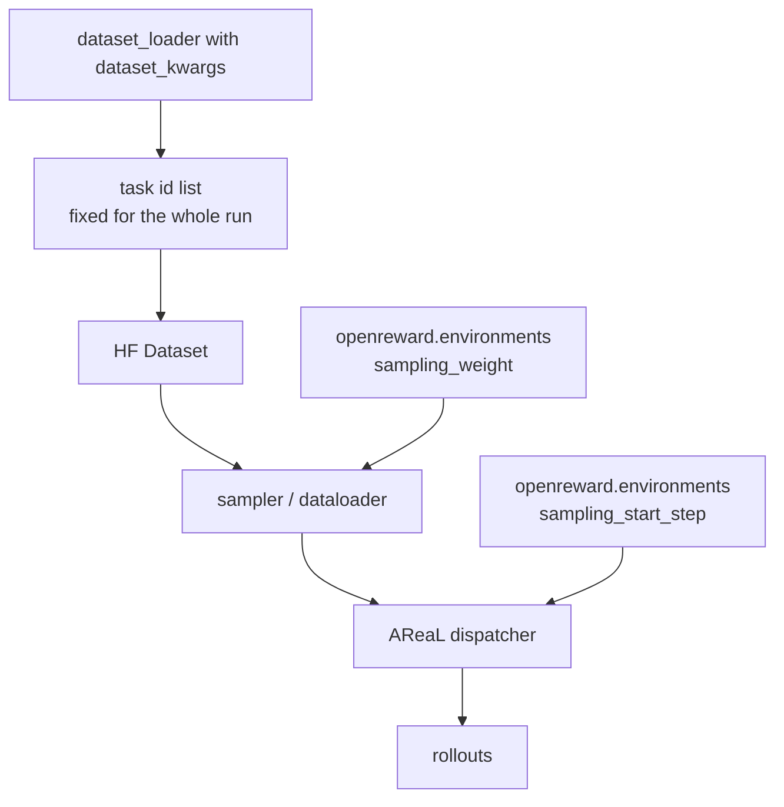

# Curriculum and task mixtures

Two independent mechanisms control what the model sees. One picks the task set once, before training
starts, and never changes it. The other blends several task sources during a run and can turn a
source on partway through. They live in different config blocks, they are owned by different code,
and confusing them is the most common mistake on this page.

| | Difficulty and subset selection | Environment mixture |
|---|---|---|
| Config | `dataset_kwargs` on the top-level `environments:` list | `openreward.environments` (plugin-local) |
| Granularity | which task ids exist at all | relative sampling share, plus a start step |
| When it changes | never — the dataset is built once at startup | `sampling_start_step` flips a source on mid-run |
| Available to | any plugin with a registered dataset loader | the OpenReward plugin only |
| Backends | <span class="pl-tag pl-tag--both">Both</span> | weights: both. Staging: <span class="pl-tag pl-tag--areal">AReaL</span> only |



## Picking the task set: `dataset_kwargs`

The dataset loader is a plain function, and whatever you put in `dataset_kwargs` is splatted into it.
Any selection your loader can express — a difficulty tier, a domain, a task-length cap, a cap on
count — becomes a config knob for free. The [custom dataset](../customization/dataset.md) page owns
the loader contract; this section is about what to select.

TextCraft-Synth is the worked example. Its generator tags every task with a difficulty derived from
the crafting depth of the target item, `DIFFICULTY_CONFIG` in
<span class="pl-src">plugins/textcraft/platoon/textcraft/synth_tasks.py</span>:

| Difficulty | Crafting depth | Train tasks | Val tasks |
|---|---|---|---|
| `easy` | 2-3 | 588 | 147 |
| `medium` | 4-6 | 852 | 213 |
| `hard` | 7-9 | 544 | 136 |
| `extreme` | 10-12 | 538 | 136 |

`load_synth_dataset` in <span class="pl-src">plugins/textcraft/platoon/textcraft/registry.py</span>
takes `difficulties`, `limit`, `num_samples_train` and `num_samples_val`, so a config selects a tier
like this:

```yaml title="plugins/textcraft/platoon/textcraft/configs/tinker/textcraft_synth_depth_aware_tinker.yaml"
environments:
  - package: platoon.textcraft.registry
    trainer_config: textcraft/synth/tinker
    dataset_loader: textcraft/synth
    eval_dataset_loader: textcraft/synth
    task_loader: textcraft/synth
    rollout: textcraft/synth/depth_aware
    reward_processor: textcraft/synth/delegation_capped
    workflow: group_rollout
    dataset_kwargs:
      difficulties: ["medium"]
      num_samples_train: 2522
      num_samples_val: 632
    eval_dataset_kwargs:
      difficulties: null
      limit: 100
      num_samples_train: 2522
      num_samples_val: 632
```

Read the two blocks together: **train on one tier, evaluate on all of them.** Every committed
TextCraft config does this — `train_difficulties: ["medium"]` or `["hard"]`, `eval_difficulties:
null` — across the whole AReaL matrix in
<span class="pl-src">plugins/textcraft/platoon/textcraft/configs/areal/</span>. Nothing trains on
`easy` or `extreme`. That is the recommendation the repository encodes: pick the narrowest tier where
the model is neither at zero nor saturated, and keep eval wide so you can see transfer instead of
only in-distribution progress.

**When to reach for it.** Your tasks carry a difficulty or category label and you want to train on a
slice. You want a small, deterministic subset to debug the pipeline before spending a node-hour. Your
eval must cover ground your training set deliberately excludes.

**When not to.** This is a one-shot selection with no schedule attached. If you want the tier to
change during the run, `dataset_kwargs` cannot do it — `AutoDataset.from_config` builds both datasets
in <span class="pl-src">platoon/train/areal/train.py</span> before the trainer is constructed.

**What it costs.** A filter on a per-task property has to load every task to read it.
`get_synth_task_ids_by_difficulty` calls `get_synth_task` for all 2 522 train ids. Fine for a jsonl
file, bad for a catalog you must download first — precompute the filter into your ids instead.

!!! warning "Two ways to spell difficulty in TextCraft, and only one works per entrypoint"
    The plugin's own `train_areal_synth.py` reads the **top-level** `train_difficulties` /
    `eval_difficulties` keys from `TextCraftSynthArealTrainerConfig`
    (<span class="pl-src">plugins/textcraft/platoon/textcraft/areal_config.py</span>). The shared
    entrypoint `python -m platoon.train.areal.train` hard-codes `PlatoonArealRLTrainerConfig` and
    never sees those keys — it reads `dataset_kwargs.difficulties` instead. A config written for one
    entrypoint trains on everything under the other. Worse, `train_tinker_synth.py` assigns
    `train_difficulties = ["medium"]` in the script body with the config-driven line commented out;
    on that path the YAML is ignored entirely.

    `eval_dataset_kwargs` also does **not** inherit from `dataset_kwargs` — it defaults to `{}` and is
    used as-is. Repeat every kwarg both splits need. See
    [custom dataset](../customization/dataset.md).

### Narrowing an OpenReward catalog

OpenReward has no difficulty label. Its subset knobs, per environment, are `train_task_limit`,
`eval_task_limit`, `task_indices` and `task_names`.

`train_task_limit` takes the **first N** tasks, not a random sample — `_indexed_task_ids` in
<span class="pl-src">plugins/openreward/platoon/openreward/tasks.py</span> builds `range(stop)`
precisely so it does not have to materialize millions of indices. That makes it a smoke-test knob,
not a curriculum: the three-environment config
`toolathlon_tmax_swe_openhands_areal_prealloc_16node-cp-r3-fp32-lm-head.yaml` sets
`train_task_limit: 16` per source for exactly that reason, and the two staged-curriculum configs set
it back to `null`. If you want a representative subset, use `task_indices` with indices you chose
yourself. `0` is a validation error, not "unlimited"; use `null`.

## Mixing several task sources

!!! danger "This is not the top-level `environments:` list"
    `openreward.environments` is a **plugin-local** list of `OpenRewardEnvironmentConfig`, nested
    under the plugin's own config section. It names task sources: which server, which split, how
    often to sample. The top-level `environments:` at column zero is a list of `EnvironmentConfig`
    and wires up components — see [Registry and Auto factories](../architecture/registry.md). The two
    have nothing to do with each other.

Give each source a `label` and a `sampling_weight`. Weights are relative shares of submitted task
slots, dealt out as a weighted fair queue that rotates the leftover slot instead of always giving it
to the same label. [OpenReward](../integrations/openreward.md) has the per-key reference for these
fields and the sampler's exact behavior.

```yaml title="plugins/openreward/platoon/openreward/configs/areal/toolathlon_tmax_swe_openhands_areal_prealloc_16node-cp-r3-fp32-lm-head.yaml"
openreward:
  balance_accepted_batches: false
  accepted_batch_max_replacement_rounds: 8
  environments:
    - label: toolathlon
      env_name: toolathlongym
      session_url: http://localhost:8082
      session_urls_env_var: OPENREWARD_SESSION_URLS_TOOLATHLON
      sampling_weight: 1.0

    - label: tmax
      env_name: tmax/TMax-15K-Harbor
      session_url: http://localhost:8083
      session_urls_env_var: OPENREWARD_SESSION_URLS_TMAX
      sampling_weight: 1.0

    - label: swe_rebench
      env_name: nebius/SWE-rebench-V2
      session_url: http://localhost:8084
      session_urls_env_var: OPENREWARD_SESSION_URLS_SWE_REBENCH
      sampling_weight: 1.0
```

**When to reach for it.** You have more than one OpenReward task source and want a single run over
all of them — typically because the skills transfer and you would rather not train two models.

**What it costs.** Every source needs its own server pool, its own port, and its own
`session_urls_env_var`; a three-environment run is three services to keep alive, and SWE-ReBench in
particular carries a pinned-commit guard and an Enroot capability probe. The mixture is one more
thing that can be the reason a run stalls. Budget the operational work, not just the config lines.
[Long-running and preallocated jobs](scale.md) covers the launcher side.

Weights govern the *submitted* stream. Whether the *accepted* optimizer batch is also balanced is a
separate decision, `balance_accepted_batches`, described on
[OpenReward](../integrations/openreward.md). It defaults to `true`, and strict balance is
incompatible with AReaL `dynamic_bs` and with any staged source.

Tinker gets weighted mixtures too — its train script pre-materializes a balanced record order with
`materialize_balanced_record_order` and marks it must-not-shuffle. It does not get staging.

## Staging a source in partway: `sampling_start_step`

`sampling_start_step` withholds a source until AReaL's durable logical model version reaches that
value. This is the only mechanism in the repository that changes the task distribution *during* a
run, and two committed configs use it, both staging SWE-ReBench in at step 20 behind a Toolathlon
warmup.

```yaml title="plugins/openreward/platoon/openreward/configs/areal/toolathlon_swe_openhands_areal_prealloc_16node-cp-ptc-task-tracker-full-r3-fp32-lm-head-ta20-curriculum.yaml"
openreward:
  balance_accepted_batches: false

  environments:
    - label: toolathlon
      env_name: toolathlongym
      split: train
      eval_split: train
      session_url: http://localhost:8082
      session_urls_env_var: OPENREWARD_SESSION_URLS_TOOLATHLON
      train_task_limit: null
      eval_task_limit: null
      sampling_weight: 1.0
      sampling_start_step: 0

    - label: swe_rebench
      env_name: nebius/SWE-rebench-V2
      split: train
      eval_split: train
      session_url: http://localhost:8084
      session_urls_env_var: OPENREWARD_SESSION_URLS_SWE_REBENCH
      train_task_limit: null
      eval_task_limit: null
      sampling_weight: 1.0
      sampling_start_step: 20
```

Steps 0-19 submit Toolathlon only. From step 20 the stream is 1:1. `EnvironmentSamplingStartGate`
does this by wrapping the dispatcher's input generator, so the clock is the rollout controller's
version rather than a dataloader cursor: it advances even when an update is skipped, and it is
restored from recovery checkpoints. A restart resumes at the right stage.

Its companions are the 32-node recursive variant (`…-bs8-efficiency-ta20-curriculum.yaml`) and two
Slurm launchers,
<span class="pl-src">slurm-scripts/openreward-toolathlon-swe-prealloc-16node-ptc-task-tracker-ta20-curriculum.sh</span>
and
<span class="pl-src">slurm-scripts/openreward-toolathlon-swe-prealloc-32node-ptc-recursive-ta20-curriculum.sh</span>,
which both set `OPENREWARD_ENABLE_TMAX=0` — the staged runs deliberately drop the third environment
rather than stage three. <span class="pl-src">tests/test_openreward_curriculum.py</span> pins the
composed result of both configs.

Four rules will stop you before the run starts:

- At least one environment must have `sampling_start_step: 0`, or step 0 has no work.
- Any `sampling_start_step > 0` requires `balance_accepted_batches: false`. Strict balance demands an
  exact per-step quota from every label, which a not-yet-admitted label cannot supply.
- Staging requires the single-controller dataloader. `_create_dataloader` in
  <span class="pl-src">plugins/openreward/platoon/openreward/areal_trainer.py</span> raises when
  `world_size != 1`.
- Tinker rejects it outright. `OpenRewardTinkerTrainerConfig.__post_init__` raises on any nonzero
  start step.

!!! warning "Resuming a trial past its start step skips the warmup"
    The stage boundary is a function of the logical step, not of anything stored per-config. Reuse the
    optimizer state of a run already at step 40 and the Toolathlon-only phase never happens. Both
    curriculum configs open with a fresh `trial_name` and a comment saying exactly that. Start a new
    trial lineage when you introduce a stage.

Watch `openreward/curriculum/<label>/active`, `…/admitted_inputs` and `…/skipped_inputs` to confirm
the flip happened. You will need them: both staged configs set `valid_dataset: null` and
`evaluator.eval_before_train: false`, so there is no in-run eval curve to read the transition off.

Expect the first mixed step to be lopsided. Warmup rollouts are still in flight when the gate opens,
and completion-order batching means the accepted mix converges to the configured ratio over several
steps rather than switching cleanly.

## What this repository does not give you

There is no adaptive curriculum. Nothing schedules tasks from measured model performance:

- The gate compares one integer to another. It reads the step, never a reward, a success rate, or a
  loss.
- `sampling_weight` is static. `BalancedEnvironmentSampler` builds its whole slot schedule in
  `__init__`; no code path re-weights mid-run.
- The dataset is built once, before the trainer exists. A loader cannot be re-run at step 50 with
  different `dataset_kwargs`.
- Nothing estimates per-task difficulty from rollout outcomes, and no code path feeds
  `reward/success` back into selection.

If you need adaptive pacing, the honest options are to script it outside the trainer — run stage one,
stop, start a fresh trial from the checkpoint with a different config — or to write your own
dispatcher wrapper. `EnvironmentSamplingStartGate` is a readable template for the second: it takes
over `dispatcher.active_submit_and_wait`, filters the input generator, and installs itself back onto
the dispatcher. A performance-driven gate would swap its step comparison for a statistic it maintains
from accepted results, the way `AcceptedEnvironmentBatchObserver` already tracks accepted batch
composition.

Both routes are **untested guidance** — no config, script or test in this repository does either.
Treat them as directions, not recipes.

## Is a curriculum worth it?

Usually not. A staged mixture costs you a second task server, a config constraint that rules out
strict batch balance, an AReaL-only run, and a stage transition you can only see in telemetry. Reach
for one when you can name the specific failure it fixes.

The cases that justify it:

- **Zero signal on the hard set.** If every rollout on your target tasks scores zero, group-relative
  advantages are zero too and you are burning GPU hours to learn nothing. Warm up somewhere the model
  sometimes succeeds. Both committed staged configs are this case: Toolathlon first, SWE-ReBench once
  basic tool use works.
- **Format and protocol before substance.** The first thing a model must learn is to call the
  terminal tool rather than reply in prose. Any cheap environment teaches that; teach it on the cheap
  one.
- **Cost asymmetry.** SWE-ReBench rollouts are far more expensive than Toolathlon rollouts. Spending
  the early, high-variance steps on the cheap source is a throughput argument, not a pedagogy one,
  and it is often the stronger one.

The cases that do not:

- **Chasing a smooth reward curve.** A difficulty tier the model already solves most of the time
  contributes little advantage signal and a lot of wall-clock.
- **Hedging because you are unsure which tier to train on.** Run one eval pass over all tiers first.
  That answer costs an hour, and the tier where success is neither 0 nor 1 is your answer.

Do the cheap thing first: pick one tier with `dataset_kwargs`, keep eval wide, and add a staged
mixture only when the metrics say the single-tier run is stuck.

## See also

- [OpenReward](../integrations/openreward.md) — how the mixture, the gate and the accepted-batch
  balance work, plus the per-key reference for `openreward.environments`.
- [Custom dataset](../customization/dataset.md) — writing the loader that `dataset_kwargs` feeds.
- [TextCraft tutorial](../tutorials/textcraft.md) — the synth generator and its difficulty tiers.
- [Reward design](rewards.md) — the other half of "what is the model learning from".
- [Long-running and preallocated jobs](scale.md) — keeping a multi-source allocation alive.
- [Configuration reference](../reference/configuration.md) — every key with its default.
