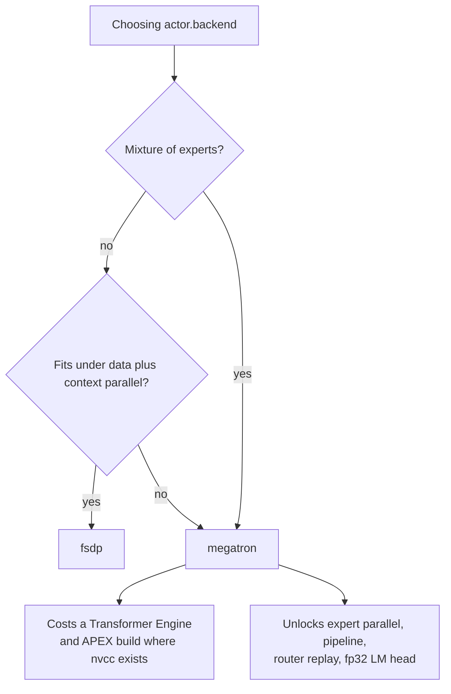

# LoRA, FSDP and Megatron

Every AReaL run makes two placement decisions — `actor.backend` for training and `rollout.backend`
for inference — and then a handful of memory decisions on top. This page is about picking them. The
grammar of the strings lives on the [AReaL internals page](../architecture/areal.md); every key with
its default lives in the [configuration reference](../reference/configuration.md).

The Tinker backend has none of this. It trains a LoRA adapter on a hosted model and exposes no
placement or memory knobs at all — `train.lora_rank` is the only capacity decision left to you, and
batch shape is set by `train.batch_size`, `train.num_minibatches` and `train.num_microbatches`. If
you are on Tinker, read the [LoRA](#lora) section and skip the rest.

## The two backend strings

Both are required and neither has a default; `PlatoonArealRLTrainerConfig.__post_init__` in
<span class="pl-src">platoon/train/areal/config_defs.py</span> raises if either is empty.
`ref.backend` falls back to `actor.backend` when you supply a `ref:` block without one.

Platoon itself only reads the prefix before the first colon. `_create_train_engine` in
<span class="pl-src">platoon/train/areal/rl.py</span> dispatches `fsdp` to `PlatoonPPOActor` and
`megatron` to `PlatoonMegatronPPOActor`, and the router-replay validation does
`self.actor.backend.split(":", 1)[0]`. Everything after the colon is parsed by upstream AReaL's
allocation grammar, which is **not vendored in this repository** — `areal` is a git pin in
`pyproject.toml`. When a spec you expect to work is rejected, the error comes from AReaL, not from
Platoon, and the grammar in your resolved environment is the authority.

Two shapes appear in committed configs:

```yaml
rollout:
  backend: sglang:d4p1t1     # 4 independent replicas, 1 GPU each
actor:
  backend: fsdp:d4p1t1c1     # 4-way data parallel
```

```yaml
rollout:
  backend: sglang:d12p1t8
actor:
  backend: "megatron:(attn:d10p2t4c2|ffn:d10p2t1e8)"
```

The parenthesized form gives attention blocks and FFN blocks separate topologies, which is what
makes MoE expert parallelism usable. The letters are the `d`/`t`/`p`/`c`/`e` dimensions the
[architecture page](../architecture/areal.md) documents.

Do not guess the arithmetic for a new model. The comment above the actor block in the 8-node
OpenReward config records the constraints that produced its numbers:

```yaml title="plugins/openreward/platoon/openreward/configs/areal/toolathlon_openhands_areal_prealloc_8node.yaml"
actor:
  # Parallelism constraints for Qwen3.5-35B-A3B (qwen3_5_moe) on Megatron:
  #   * CP>1 unsupported for this VLM/MoE model -> c1.
  #   * TP <= num_query_groups (GQA KV groups = 2) -> TP capped at t2.
  # The disaggregated attn|ffn groups must have matching per-pipeline-stage device
  # counts (attn DP*TP*CP == ffn DP*TP*EP) and shared DP/PP.
  backend: megatron:(attn:d1p20t2c1|ffn:d1p20t1e2)
```

Those are per-model facts you have to establish for your own checkpoint. (The worked arithmetic at
the end of that same comment describes an earlier topology and no longer matches the committed
string. Trust the constraints, not the numbers.)

!!! warning "Quote the hybrid form in YAML, and know that a grep reads it"
    `megatron:(attn:...|ffn:...)` is a bare scalar containing parentheses and a pipe, and committed
    configs are inconsistent about quoting it. Separately,
    <span class="pl-src">slurm-scripts/openreward-toolathlon-prealloc-base.sh</span> decides whether
    to build Transformer Engine and APEX by grepping the config you pass for a `backend:` line
    beginning with an optional quote and then `megatron`. If your Megatron backend line arrives
    through a Hydra `defaults:` chain and never appears literally in that file, the detection misses
    and the environment builds without TE. Set `OPENREWARD_BUILD_TE=1` and `OPENREWARD_BUILD_APEX=1`
    explicitly in that case, as the all-layer LoRA wrapper does.

CLI overrides on the AReaL path are bare `key=value`, no leading dashes:

```bash
uv run python -m platoon.train.areal.train --config configs/areal/my_task.yaml \
  actor.backend=fsdp:d2p1t1 \
  rollout.backend=sglang:d2p1t1
```

## FSDP or Megatron



| | `fsdp` | `megatron` |
|---|---|---|
| Extra install | none beyond `uv sync --extra areal` | Transformer Engine 2.12.0 and APEX, source-built |
| Dimensions | `d`, `t`, `c` | `d`, `t`, `p`, `c`, `e`, plus the split `attn`/`ffn` form |
| Expert parallelism | no | yes |
| Router replay | rejected at config time | required backend |
| fp32 LM head | inert | implemented |
| Non-finite gradient guard | not installed | installed on the optimizer |
| Committed configs | every single-node plugin config but one, plus the 2-node smoke run | every 8-, 16- and 32-node OpenReward run |

**Start on FSDP.** It is this repository's default posture: every AReaL config outside OpenReward
uses it, on one or two nodes of eight GPUs, with a single exception noted below, and it needs
nothing that `uv sync --extra areal` does not already install.
<span class="pl-src">platoon/train/areal/__init__.py</span> and
<span class="pl-src">platoon/train/areal/actor.py</span> both hide the Megatron actor behind a
module-level `__getattr__` precisely so an FSDP-only environment never imports Transformer Engine.

**Move to Megatron when the model forces you** — an MoE checkpoint you want expert-parallel, or a
model too large for data-plus-context parallelism to hold. The committed evidence is unambiguous:
Qwen3-4B and Qwen3-14B run FSDP; Qwen3.5-35B-A3B and Qwen3.6-35B-A3B run Megatron with `e2` or `e8`
expert parallelism.

**What Megatron costs.** Transformer Engine's torch bindings are sdist-only and will not build
without a real CUDA toolkit, so they are deliberately excluded from the lock — forcing them into the
resolution graph breaks `uv sync` for *every* backend, FSDP included. APEX is a second source build:
Megatron's `ColumnParallelLinear` defaults to `gradient_accumulation_fusion=True`, which
hard-requires APEX's `fused_weight_gradient_mlp_cuda` kernel. Both must be compiled where `nvcc`
exists and then cached. The exact procedure, including why each `uv pip install` flag is there, is
on the [installation page](../get-started/installation.md). Do not improvise it.

**One Megatron config runs on a single node.**
<span class="pl-src">plugins/textcraft/platoon/textcraft/configs/areal/nv_textcraft_synth_ctx40000_linear_medium_areal_qwen3.5.yaml</span>
pairs `megatron:d4p1t1` with Qwen3-4B on 8 GPUs. That is the cheapest shape in the tree for proving
your TE and APEX build works before you ask a scheduler for sixteen nodes.

## LoRA

=== "Tinker"

    LoRA is the only training mode. `create_lora_training_client_async` is called with
    `rank=self.config.train.lora_rank` in <span class="pl-src">platoon/train/tinker/rl.py</span>
    whenever you are not resuming from a checkpoint. The default is 32 and every committed Tinker
    config uses 32.

    ```yaml
    train:
      model_name: nvidia/NVIDIA-Nemotron-3-Nano-30B-A3B-BF16
      lora_rank: 32
    ```

    Nothing else to decide. Tinker overrides use the dotted-argparse form: `--train.lora_rank 16`.

=== "AReaL"

    LoRA is off by default and is upstream AReaL configuration, not Platoon's: `actor.use_lora`,
    `actor.peft_type`, `actor.lora_rank`, `actor.lora_alpha`, `actor.target_modules`, and the
    matching `rollout.use_lora`. Platoon contributes no LoRA code of its own. Exactly one committed
    config turns it on, and it is a Megatron MoE run. Read the rest of this section before you copy
    it — the obvious configuration does not work.

!!! danger "Stock AReaL rejects Megatron + LoRA + SGLang"
    Upstream raises `Megatron actor with LoRA is not supported with SGLang rollout in RL trainer`
    and tells you to switch to a vLLM rollout, disable LoRA, or leave Megatron. No committed Platoon
    config uses vLLM.

    This repository works around it with a **patch applied into `site-packages`**, not a config key.
    <span class="pl-src">slurm-scripts/patches/areal-d991-megatron-merged-lora.patch</span>
    backports a `merge_lora_for_update_weights` option onto the pinned AReaL revision, and
    <span class="pl-src">slurm-scripts/patches/megatron-bridge-0.4.0-grouped-lora-merge.patch</span>
    adds the grouped-expert merge. Both are applied by
    <span class="pl-src">slurm-scripts/prepare_openreward_env.sh</span>, which first asserts the
    AReaL revision is `d99124e…` and megatron-bridge is exactly `0.4.0`, and dies otherwise. Build
    your environment any other way and `merge_lora_for_update_weights` does not exist.

Why the patch exists is the most useful thing to know, because it describes what the unpatched path
does. From `prepare_openreward_env.sh`:

> AReaL d991 has an experimental Megatron LoRA path, but it injects adapters after DDP (so DP
> replicas never reduce adapter gradients), disables distributed-optimizer recovery, and exposes
> adapters directly to the rollout runtime. This backport injects adapters before DDP and explicitly
> merges them into the ordinary full-model XCCL stream instead.

So with the patch: adapters train before DDP and their gradients reduce across DP replicas, and
SGLang keeps serving ordinary merged full weights on its proven kernels. Merged LoRA then checks the
whole combination at once, reporting every failure together as
`Invalid merged-full LoRA configuration: ...`. The user-facing requirements:

| Setting | Required value |
|---|---|
| `actor.use_lora` | `true` |
| `rollout.use_lora` | `false` |
| `actor.backend` | Megatron |
| `rollout.backend` | SGLang |
| `actor.weight_update_mode` | `xccl` |
| `actor.megatron.bridge_type` | `megatron-bridge` |
| `actor.megatron.use_bridge_for_update_weights` | `true` |
| `actor.megatron.ddp.use_distributed_optimizer` | `true` |

The one real config — all layers, rank 32, on Qwen3.6-35B-A3B:

```yaml title="plugins/openreward/platoon/openreward/configs/areal/toolathlon_openhands_areal_prealloc_32node-cp-ptc-recursive-behavior-gated-lora-all-layers-r32-bs8.yaml"
gconfig:
  lora_name: ta32-rec-bg-lora-all-layers-r32

rollout:
  backend: sglang:d12p1t8
  use_lora: false

actor:
  backend: "megatron:(attn:d10p2t4c2|ffn:d10p2t1e8)"
  path: apurvaga/Qwen3.6-35B-A3B-preserve-thinking
  use_lora: true
  peft_type: lora
  lora_rank: 32
  lora_alpha: 32
  target_modules:
    - language_model.decoder.layers.*.self_attention.linear_qkv
    - language_model.decoder.layers.*.self_attention.linear_proj
    - language_model.decoder.layers.*.self_attention.in_proj
    - language_model.decoder.layers.*.self_attention.out_proj
    - language_model.decoder.layers.*.mlp.experts.linear_fc1
    - language_model.decoder.layers.*.mlp.experts.linear_fc2
    - language_model.decoder.layers.*.mlp.shared_experts.linear_fc1
    - language_model.decoder.layers.*.mlp.shared_experts.linear_fc2
    - language_model.decoder.layers.*.mlp.router
  weight_update_mode: xccl
  megatron:
    bridge_type: megatron-bridge
    use_bridge_for_update_weights: true
    merge_lora_for_update_weights: true
    ddp:
      use_distributed_optimizer: true

ref:
  use_lora: false

sglang:
  enable_lora: false
```

Three things worth copying from it. The `target_modules` patterns are fully qualified so they select
the language model and exclude the vision tower and the disabled MTP head — a loose glob picks up
modules you did not intend, and norms, embeddings and the scalar shared-expert gate are not linear
LoRA targets anyway. `gconfig.lora_name` names the adapter lineage, and the launcher pairs it with a
fresh `trial_name` and `recover.freq_steps: 1`, because an automatic four-hour successor must
recover a checkpoint from *this* adapter lineage and not an earlier one. And LoRA does not save you
the Megatron build:
<span class="pl-src">slurm-scripts/openreward-toolathlon-prealloc-32node-ptc-recursive-bs8-behavior-gated-lora-all-layers-r32.sh</span>
sets `OPENREWARD_BUILD_TE=1` and `OPENREWARD_BUILD_APEX=1` explicitly, noting that all-layer LoRA
still imports Megatron Bridge's Transformer Engine bindings.

!!! note "How exercised is this?"
    One config, one launcher, a trial name ending `-v1-trial0`, and a patch that pins two exact
    upstream versions. `tests/test_openreward_prealloc_dependency_detection.py` covers the
    launcher's dependency flags; nothing in the test suite exercises the merge itself. Treat AReaL
    LoRA as a working but young path, not as a default.

## Router replay

Router replay — R3 in the code and in config names — makes the training forward pass reuse the exact
MoE expert assignments the inference server chose, instead of re-routing under drifted weights. The
[architecture page](../architecture/areal.md) explains the mechanism and the data path. This section
is about whether to switch it on.

**Reach for it** when you are training an MoE model on Megatron and you care that the policy
gradient is computed against the routing that actually produced the tokens. Seventeen committed
OpenReward configs carry `-r3` in the name, spanning the 16- and 32-node Toolathlon, TMax,
SWE-rebench and curriculum lineages, so at that scale it is the established configuration rather
than an experiment. The 16-node configs without it are the bases those derive from.

**Skip it** on a dense model, on FSDP, or when you need proximal log-probability recomputation.
Forward-only replay is not implemented and the config raises rather than quietly degrading.

`actor.enable_router_replay` is the single public gate; `workflow_config.enable_router_replay` is
derived from it and setting it in YAML is overwritten. Turning the gate on makes
`PlatoonPPOActorConfig.__post_init__` and `PlatoonArealRLTrainerConfig.__post_init__` demand all of
the following, each with its own `ValueError`, before a single worker is spawned:

| Precondition | Why |
|---|---|
| `actor.backend` prefix `megatron` | replay binds to Megatron-Core's `RouterReplay` |
| `rollout.backend` prefix `sglang` | routes arrive through the SGLang side channel |
| `rollout.return_routed_experts: true` | without it there are no routes to replay |
| `actor.megatron.enable_mtp: false` | rollout routes do not include MTP layers |
| `recompute_logprob` and `use_decoupled_loss` both off | `should_compute_prox_logp()` must be false |
| with `gradient_checkpointing`: `megatron.recompute_granularity: full` and `recompute_method: uniform` | replay actions are queued against the recompute pass |
| `router_replay_num_layers` a positive int | reshapes SGLang's flattened route tensor |
| `router_replay_topk` a positive int | same |
| `router_replay_num_experts` positive if set | bounds-checks expert ids |

Two further preconditions are checked later, at engine-configure time, because they depend on the
constructed transformer config: `moe_router_fusion` and sinkhorn load balancing both bypass
`RouterReplay` and raise `RouterReplayError`
(<span class="pl-src">platoon/train/areal/router_replay.py</span>). If your model provider turns
either on, R3 is not available to you.

No committed config sets `recompute_granularity` or `recompute_method` at all, even though every R3
config inherits `gradient_checkpointing: true`, so the installed AReaL defaults already satisfy that
check for these runs. If yours differ, set them explicitly.

A complete overlay on top of a working Megatron config:

```yaml title="plugins/openreward/platoon/openreward/configs/areal/toolathlon_openhands_areal_prealloc_16node-cp-r3-fp32-lm-head.yaml"
workflow_config:
  # Preserve Qwen3.6-A3B's default nonzero global MoE router auxiliary loss.
  # Exact-zero policy advantages are not zero-gradient for that objective.
  filter_zero_advantage_datums: false

rollout:
  return_routed_experts: true

actor:
  backend: megatron:(attn:d5p2t4c2|ffn:d5p2t1e8)
  path: Qwen/Qwen3.6-35B-A3B
  enable_router_replay: true
  router_replay_num_layers: 40
  router_replay_topk: 8
  router_replay_num_experts: 256
  megatron:
    # R3 has no rollout routes for MTP layers; keep the existing safety gate.
    enable_mtp: false
    enable_fp32_lm_head: true

ref:
  megatron:
    enable_fp32_lm_head: true
```

That `filter_zero_advantage_datums: false` is not incidental, and it is the one interaction the
config validation does *not* catch for you. The zero-advantage filter assumes a zero advantage means
a zero gradient; with a global MoE router auxiliary loss in play that assumption is false. Enable R3
on such a model and leave the filter at its default `true`, and you train a different objective than
you think.

**Costs.** `routed_experts` is an integer tensor of shape `[batch, sequence, layers, topk]` — at 40
layers and top-8 that is 320 ids per token, carried alongside every datum. The trainer detaches those
tensors before the reference, critic and teacher forward passes and reattaches them afterwards with
an order marker it verifies element-wise, so the peak is bounded, but the transport is real. The
feature is fail-closed everywhere else too: every real non-terminal token must carry a valid route
and every terminal or padding token must not, packed sequence lengths must divide by `2 * CP`, expert
ids are range-checked against `router_replay_num_experts` and must be unique within a token's top-k
row, and padded BSHD layout combined with context parallelism is rejected outright. You get an error,
never a wrong gradient — but budget time for meeting those errors the first time you enable it.

## FP32 LM head

`actor.megatron.enable_fp32_lm_head` casts the language-model head's logits to FP32 before any
log-probability or loss computation. AReaL declares the flag but does not apply it when models are
built through megatron-bridge, so Platoon implements it as forward hooks in
<span class="pl-src">platoon/train/areal/fp32_lm_head.py</span>, installed by
`PlatoonMegatronPPOActor.initialize`.

- **Megatron only.** The FSDP actor never calls the installer, so the key is inert on `fsdp`.
- **Not for critics.** `install_fp32_lm_head_output_hooks` returns immediately when `is_critic` is
  set; the Megatron value head already controls its own output dtype.
- **Set it on `ref` too.** Every committed config that enables it does, so the actor and the
  reference engine compute log-probabilities at the same precision.
- **Cost.** The projection still runs in the compute dtype; only its output is cast, and the cast is
  autograd-preserving. FP32 logits are twice the storage of BF16 logits and the cast briefly holds
  both. On a large vocabulary at long context that is not nothing.

Reach for it when long-context MoE training shows log-probability or loss instability. In this
repository it always travels with R3 — the `-r3-fp32-lm-head` naming is one lineage, not two
independent choices — so there is no committed evidence of it helping on its own.

## Gradient checkpointing and microbatch size

`actor.gradient_checkpointing` is the first memory lever and the least interesting decision. It
appears 45 times across committed AReaL configs and is `true` every time, under both the FSDP and
Megatron train backends, from Qwen3-4B on one node to Qwen3.6-35B-A3B on thirty-two. (There is no
Tinker equivalent — the service decides.) Recomputing activations costs an extra
forward pass; for agentic rollouts of tens of thousands of tokens per sequence that trade is not
close.

The lever you actually tune is `actor.mb_spec.max_tokens_per_mb`, which caps tokens per microbatch
inside the PPO update:

| Value | Where |
|---|---|
| `60000` | single-node 4B FSDP actors; the 2-node Qwen3-4B actor |
| `40000` | the single-node Megatron Qwen3-4B config; several textcraft actors |
| `32768` | every 8-, 16- and 32-node Qwen3.5/3.6-35B-A3B Megatron actor |
| `4000` | `ref` engines, which only run forward |

Every committed config keeps `ppo_n_minibatches: 1`, so the whole trainer batch is one optimizer step
and `max_tokens_per_mb` alone sets the peak. Lower it before you shrink the batch: a smaller batch
changes the algorithm, a smaller microbatch only changes throughput.

The Megatron path adds a guard the FSDP path does not have. `install_nonfinite_gradient_guard` in
<span class="pl-src">platoon/train/areal/numerical_stability.py</span> wraps the BF16 optimizer so a
step whose gradient norm is non-finite is skipped rather than applied — Megatron's default path
clips an infinite norm, reports `update_successful=True`, and lets Adam turn it into NaN. Skipped
steps surface as the `optimizer_minibatches_skipped` and `optimizer_partial_update` stats. This is a
real reason to prefer Megatron for long unattended runs on hardware where you have seen instability.

## Model scale to configuration

Grounded entirely in committed configs. These are shapes that have run, not hardware advice.

| Model | Nodes × GPUs | `rollout.backend` | `actor.backend` | Notes |
|---|---|---|---|---|
| Qwen3-4B dense | 1 × 8 | `sglang:d4p1t1` | `fsdp:d4p1t1c1` | the default single-node shape |
| Qwen3-4B dense | 1 × 8 | `sglang:d4p1t1` | `megatron:d4p1t1` | the only single-node Megatron config; use it to prove your TE build |
| Qwen3-14B dense | 1 × 8 | `sglang:d4p1t1` | `fsdp:d2p1t1c2` | 4 inference + 4 training, context parallel 2 |
| Qwen3-4B dense | 2 × 8 | `sglang:d8p1t1` | `fsdp:d4p1t1c2` | preallocated Slurm smoke run |
| Qwen3.5-35B-A3B MoE | 8 × 8 | `sglang:d3p1t8` | `megatron:(attn:d1p20t2c1\|ffn:d1p20t1e2)` | CP disallowed by the model, TP capped by GQA groups |
| Qwen3.6-35B-A3B MoE | 16 × 8 | `sglang:d6p1t8` | `megatron:(attn:d5p2t4c2\|ffn:d5p2t1e8)` | where the R3 + fp32-LM-head lineage starts |
| Qwen3.6-35B-A3B MoE | 32 × 8 | `sglang:d12p1t8` | `megatron:(attn:d10p2t4c2\|ffn:d10p2t1e8)` | production; also the all-layer LoRA config |

Rollout and actor allocations must together fill the allocation exactly — 48 + 80 = 128 GPUs on
16 nodes, 96 + 160 = 256 on 32. That arithmetic and the Slurm side of it are covered in
[Scale to multiple nodes](../tutorials/multi-node.md).

## See also

- [AReaL internals](../architecture/areal.md) — the allocation grammar and the R3 data path.
- [Installation](../get-started/installation.md) — the Transformer Engine and APEX procedure.
- [Configuration reference](../reference/configuration.md) — every key with its default.
- [Scale to multiple nodes](../tutorials/multi-node.md) — placing these backends on a real cluster.
- [Long-running and preallocated jobs](scale.md) — deadlines, recovery and stragglers.
- [Troubleshooting](../reference/troubleshooting.md) — the exact error strings these validations raise.
