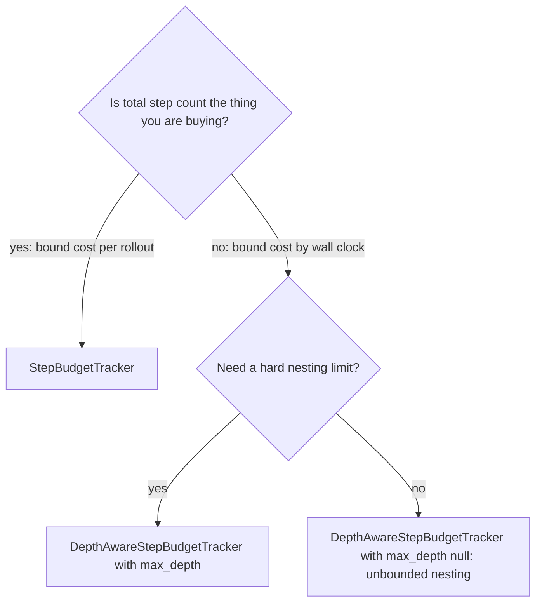

# Recursive agent systems

Delegation adds six or seven independent knobs, and most of them interact. This page is the
decision guide: for each option, what it buys, when to reach for it, what it costs, and the exact
config block. The mechanism lives in [the fork and sub-agent model](../architecture/subagents.md)
and [a sub-agent call](../walkthroughs/subagent-call.md); read those if you want to know *how* a
fork works. Read this if you want to know what to put in your YAML.

Everything here assumes your environment and agent already implement `fork`. Getting to that point
is [Train a system of agents](../tutorials/recursive-agents.md).

!!! info "Override syntax"
    Every AReaL example below is a bare `key=value` override — no leading dashes. Tinker and the
    inference runners use `--dotted.key value`. See the [CLI reference](../reference/cli.md).

## 1. Fork strategy: what the child is told about its parent

`Task.fork_strategy` decides what `task.fork()` produces, and therefore what the child's prompt
contains.

| Strategy | Child task type | Child prompt |
| --- | --- | --- |
| `"subtask"` (default) | `SubTask` carrying `parent_tasks` | Goal, budget, then the full ancestor goal stack, most recent first |
| `"task"` | a flat `Task` with a fresh uuid | Goal and budget only |

`SubTask.__str__` in <span class="pl-src">platoon/envs/base.py</span> renders the ancestor chain as
`Level N: <goal>` lines. That is genuinely useful when a child's goal is only interpretable in
context — "fix the failing test" means nothing without knowing which repo and which bug. When the
child's goal is self-contained it is dead weight, and at depth 3 it is a lot of dead weight
repeated in every child's every turn.

**Use `"subtask"`** when the parent's goal disambiguates the child's, when you want lineage visible
while debugging, or when your environment's "am I a sub-agent?" test is
`isinstance(task, SubTask)`. That last one matters: AppWorld's `skip_subagent_reward_computation`
check is exactly that, and switching to `"task"` silently breaks it.

**Use `"task"`** when child goals stand on their own and the ancestor stack is pure context cost.
TextCraft and Oolong both do this, and both do it the same way — by mutating the task in the
environment constructor:

```python title="plugins/textcraft/platoon/textcraft/env.py"
task.fork_strategy = "task"
```

There is no YAML key. This is a code-level decision made where you construct the environment, and
because `Task` is mutable, one line in `__init__` changes it for the whole tree. DeepDive has the
same line commented out, which is a fair summary of how settled the choice is.

!!! note "The strategy is inherited, but only downward through `Task`"
    `Task.fork` copies `fork_strategy` onto its children, so `"task"` propagates down the tree.
    `SubTask.fork` always returns another `SubTask` — once you are on the subtask path you stay on
    it, whatever the field says.

## 2. Budget model: shared subtree, or independent with a depth cap

The highest-leverage choice on the page, because it decides what "running out" means.



`StepBudgetTracker` is the default — if no rollout installs a tracker, `set_context_vars` in
<span class="pl-src">platoon/episode/loop.py</span> installs one. The whole subtree draws on the
root's `task.max_steps`, a parent must reserve `max_steps + 1` before it may delegate, and
`child_depth_scope` is ignored entirely, so **there is no depth cap under this tracker**.

`DepthAwareStepBudgetTracker` gives every trajectory its own budget from its own `task.max_steps`,
makes `release_budget` a no-op, ignores the requested amount at admission, and checks only depth.

### Which to pick

Pick **`StepBudgetTracker`** when delegation should be a real trade-off for the model: every step a
child takes is a step the parent cannot. That is the right shape when the task has a natural step
ceiling and you want the policy to learn *when* delegating pays. It also gives you one number to
reason about — total tree steps never exceed the root's `max_steps`.

TextCraft's `run_synth_recursive_rollout` installs nothing, so this is what the recursive TextCraft
configs run:

```yaml title="plugins/textcraft/platoon/textcraft/configs/areal/textcraft_synth_ctx40000_recursive_medium_areal.yaml"
recursive: true

workflow_config:
  rollout_config:
    max_steps: 200
  group_size: 8
```

200 steps for the entire tree, spent however the model chooses.

Pick **`DepthAwareStepBudgetTracker`** when a subtree's work is genuinely additional — a child
explores a branch the parent could not have explored anyway — and when you want to bound the
*shape* of the tree rather than its total cost. Every agent gets the same allowance, so a deep tree
does not starve. The price is that total cost is now bounded only by depth, branching factor and
your timeouts.

```yaml title="plugins/textcraft/platoon/textcraft/configs/areal/textcraft_synth_ctx40000_depth_aware_medium_areal.yaml"
depth_aware: true

workflow_config:
  rollout_config:
    max_steps: 25
    timeout: 7200
    step_timeout: 7200
    propagate_root_success: true
    skip_subagent_reward_computation: false
  group_size: 8
  leave_one_out_baseline: True
  depth_level_weighting: True
  depth_level_discount_gamma: null
```

`run_synth_depth_aware_rollout` overwrites `task.max_steps` with its own `per_agent_max_steps`
(default 25) and defaults `max_depth` to 6. Oolong's recursive rollout hardcodes
`DepthAwareStepBudgetTracker(max_depth=2)` with no config hook at all.

OpenReward exposes the choice through one switch: `enable_recursive_subagents: true` always
installs the depth-aware tracker, with `subagent_max_depth` as its cap.

```yaml title="plugins/openreward/platoon/openreward/configs/areal/toolathlon_openhands_areal_prealloc_16node-cp-ptc-recursive.yaml"
openreward:
  enable_programmatic_tool_calling: true
  programmatic_tool_calling_mode: orchestration_only
  enable_recursive_subagents: true
  subagent_default_max_steps: 50
  subagent_max_depth: 2
```

!!! warning "`subagent_max_depth: null` means unbounded nesting"
    The default is `None`, and `DepthAwareStepBudgetTracker` skips the depth check entirely when
    `max_depth is None`. With independent budgets and a no-op release, nothing else bounds the
    tree: a model that delegates at every level can burn an unbounded number of steps inside one
    parent step. Every checked-in recursive OpenReward config sets `subagent_max_depth: 2`. Copy
    that unless you have a reason not to.

### What each costs

Under the shared tracker, `used_budget_for` walks all descendants on every call and rescans the
collection to find children; the source flags this as inefficient. For a few dozen trajectories it
does not matter. For hundreds it will.

Under the depth-aware tracker the cost moves from steps to wall clock and tokens, and it moves
*into the parent's step*, because `await launch_subagent(...)` does not return until the child
episode finishes. That is why the recursive OpenReward configs carry timeouts that look absurd out
of context:

```yaml
workflow_config:
  rollout_config:
    timeout: 3600
    step_timeout: 2700
```

One parent step legitimately takes 45 minutes when it contains a 100-step child and a verifier.

## 3. Credit assignment: four shapes that actually ship

The OpenReward config tree contains four recursive ablations that differ almost entirely in how a
child's reward is produced. They are the best evidence in the repository for which combinations
work together.

| Shape | Child reward comes from | Cost | Use when |
| --- | --- | --- | --- |
| Root propagation | the root's outcome, copied everywhere | free | children have no meaningful independent score |
| Verifier + delegation bonus | a synthetic verifier's verdict, plus a bonus per successful child | one extra sub-agent per child | children do separable work you can audit |
| Verifier + behavior gate | the verdict, zeroed unless a process judge passes it | verifier plus one LLM call per positive child | the model is gaming delegation |
| Verifier + token-efficiency penalty | the verdict, minus a bounded subtree token cost | verifier plus bookkeeping | delegation is correct but wasteful |

### Root propagation

```yaml title="plugins/openreward/platoon/openreward/configs/areal/toolathlon_openhands_areal_prealloc_32node-cp-ptc-recursive-rootprop-r3-fp32-lm-head-bs8.yaml"
openreward:
  subagent_environment_access: shared
  subagent_default_max_steps: 100
  subagent_max_depth: 2
  enable_subagent_reward_judging: false
  subagent_delegation_reward_coefficient: 0.0

workflow_config:
  subagent_datum_keep_probability: 0.25
  rollout_config:
    max_steps: 200
    propagate_root_success: true
  token_efficiency_reward:
    enabled: false
```

The cheapest option and the only one with no extra inference. Every trajectory gets the root's
`reward/success`, which puts every datum on the same scale as the group baseline — and the baseline
is built from root rewards only, so any other scheme introduces a mismatch you have to think about.

It costs you two things. Children get no independent signal, so a child that did nothing useful in
a successful rollout is rewarded exactly like the one that did the work. That is precisely the
reward structure that produces a root which forwards the whole task and returns the answer. And it
*overwrites* whatever the environment computed, destroying per-child telemetry.

Two hard constraints, both enforced in OpenReward's rollout. It is mutually exclusive with the
delegation bonus — the rollout raises `ValueError` rather than combining them. And a rollout
timeout is re-raised instead of returning a partial tree, because broadcasting a partial root
reward would corrupt every trajectory in it.

Pair it with `skip_subagent_reward_computation: true` when your environment's evaluator is
expensive; the child's score is about to be overwritten anyway. Be aware that "is this a sub-agent
task?" is a per-plugin heuristic and the id-substring versions are brittle.

### Verifier plus delegation bonus

```yaml title="plugins/openreward/platoon/openreward/configs/areal/toolathlon_openhands_areal_prealloc_16node-cp-ptc-recursive-judged-r3-fp32-lm-head.yaml"
openreward:
  enable_subagent_reward_judging: true
  subagent_reward_judge_max_steps: 50
  subagent_delegation_reward_coefficient: 0.4

workflow_config:
  rollout_config:
    propagate_root_success: false
    timeout: 5400
    step_timeout: 2700
```

`subagent_delegation_reward_coefficient` (default `0.0`, must be non-negative) gives every
trajectory `coefficient * (successful direct children / launched direct children)`. Verifier
branches are excluded from both counts, and each child contributes its score *before* its own
bonus, so bonuses do not compound up the tree.

This is a delegation *incentive*. Turn it on when the problem is that the model refuses to
delegate. Turn it off once delegation is established — the root-propagation, behavior-gated and
efficiency ablations all pin it to `0.0` — because it pays for launching successful children rather
than for the parent's own work, and a router that forwards everything to one reliable child
collects it in full.

TextCraft's registered `textcraft/synth/delegation_capped` reward processor implements the same
idea with a hardcoded cap that is currently `0.0`, so delegation earns nothing there today.

### When a verifier earns its cost

`enable_subagent_reward_judging` means every completed child is followed by *another* sub-agent
whose job is to check what the child claims it did, forked from the **parent's** environment
(the child's is already closed by then). You are paying:

- one extra episode of up to `subagent_reward_judge_max_steps` per non-verifier child, in-line
  inside the parent's step;
- the tokens for that episode — verifier trajectories are marked `exclude_from_training`, so they
  never reach the optimizer, but they are still on your inference bill;
- a much larger `step_timeout`.

It earns that when children do work whose success is *checkable but not automatically scored*:
"refactor this module", "find the config that causes the failure". A verifier that can re-run the
child's inspection tools turns an unscorable child into a real training target, and a `failed`
verdict with score 0 is a legitimate trainable negative rather than missing data.

It does not earn that when your environment already scores children accurately — use the env score
— or when root propagation is on, which overwrites the verdict anyway. That is why every judged
config sets `propagate_root_success: false`.

Two structural limits to know before you budget for it. Verifiers are never themselves verified, so
the recursion terminates. And under the depth-aware tracker the verifier tree is capped at a
verifier root plus one helper level; a helper that tries to delegate is refused with
`reason="verifier_depth"`.

### The behavior gate

```yaml title="plugins/openreward/platoon/openreward/configs/areal/toolathlon_openhands_areal_prealloc_32node-cp-ptc-recursive-behavior-gated-r3-fp32-lm-head-bs8.yaml"
openreward:
  subagent_environment_access: shared
  subagent_default_max_steps: 100
  subagent_max_depth: 2
  enable_subagent_reward_judging: true
  subagent_reward_judge_max_steps: 100
  enable_subagent_behavior_judging: true
  subagent_behavior_judge_max_prompt_tokens: 24576
  subagent_behavior_judge_max_output_tokens: 4096
  subagent_behavior_judge_timeout_seconds: 300.0
  subagent_delegation_reward_coefficient: 0.0

workflow_config:
  subagent_datum_keep_probability: 0.25
  rollout_config:
    max_steps: 200
    propagate_root_success: false
  token_efficiency_reward:
    enabled: false
```

The behavior judge is a one-shot LLM call that asks whether the trajectory actually contributed,
and multiplies the outcome score by 1 or 0. It exists to kill one pathology: a trajectory that
forwards the whole task to a child and takes credit for the answer. The judge prompt fails exactly
that, along with claiming shared-state work without evidence of authorship, and separately fails
prolonged loops of identical calls and fabricated claims about results.

The cost is smaller than it looks. It requires `enable_subagent_reward_judging: true` —
`__post_init__` raises otherwise — and it is skipped entirely when the outcome verdict is
ineligible or already scores 0, so it costs one call per *positively judged* child, not per child.
`_build_behavior_judge` in <span class="pl-src">plugins/openreward/platoon/openreward/rollout.py</span>
uses a shallow copy of the rollout policy itself, sharing tokenizer and transport, differing only in
`usage_id` and request limits. No separate judge model or credential is needed, and the config says
so explicitly.

Reach for it when your delegation metrics look healthy but the trajectories read as routing. Leave
it off while you are still trying to get the model to delegate at all — a gate that zeroes positive
rewards is not what a reluctant delegator needs.

### Token-efficiency penalty

```yaml title="plugins/openreward/platoon/openreward/configs/areal/toolathlon_openhands_areal_prealloc_32node-cp-ptc-recursive-judged-r3-fp32-lm-head-bs8-efficiency.yaml"
workflow_config:
  group_size: 8
  token_efficiency_reward:
    enabled: true
    coefficient: 0.05
    reference_tokens: 20000
    max_penalty: 0.20
    input_token_weight: 0.01
    output_token_weight: 1.0
    attribution: policy_subtree
```

`penalty = min(max_penalty, coefficient * log2(1 + effective / reference_tokens))`, where
`effective` weights output tokens at `output_token_weight` and input tokens at
`input_token_weight`. The low input weight is deliberate: exported AReaL prompts resend the full
logical context even when the inference server reuses a cached prefix.

Each policy trajectory pays for its own unique model requests **and** every non-verifier
descendant, so a parent that spawns three chatty children pays for all of them. Verifier branches
are excluded entirely, because they do not exist at inference time. `attribution` accepts only
`"policy_subtree"`.

The defaults are a nudge, not a wall: at 20k effective tokens the penalty is 0.05, and it saturates
at 0.20 however far you overrun. That is the right magnitude against a 0–1 success reward — big
enough to break ties between a lean solution and a wasteful one, too small to make refusing the
task attractive.

Use it when the model delegates *correctly* but expensively: wide fan-out, redundant children,
children re-reading context the parent already had. Do not use it as the primary brake on runaway
delegation. A penalty bounded at 0.2 loses to a 1.0 success reward every time; depth caps and the
behavior gate are the real brakes.

!!! warning "The penalty only lands if your reward processor subtracts it"
    `annotate_policy_subtree_token_efficiency` writes metadata into each trajectory's `misc`. Only
    OpenReward's `reward_processor` in
    <span class="pl-src">plugins/openreward/platoon/openreward/rewards.py</span> reads it back, via
    `trajectory_token_efficiency_metrics`, and subtracts it. Enable `token_efficiency_reward` with
    a reward processor that only sums `reward/*` step keys — TextCraft's
    `textcraft/synth/delegation_capped`, for instance — and you get metrics and no penalty. There
    is also no Tinker equivalent: `TokenEfficiencyRewardConfig` exists only on the AReaL
    `WorkflowConfig`.

### Restricting what children can do

`subagent_environment_access` is an environment lever rather than a reward one. `"shared"` (the
default) gives children the parent's live tools minus the terminal ones, `claim_done` and
`submit_answer`. `"read_only"` narrows them to an allowlist —
`get_task`, `get_status`, `get_tool_details`, `view` — and appends a goal suffix telling the child
to return evidence and patch text instead of editing.

Structurally this is the strongest available answer to "the root delegates everything", because a
read-only child *cannot* finish the task and the parent has to. Treat it as untested guidance,
though: every checked-in config sets `shared`, and the read-only path has no worked example in the
repository.

## 4. How much of the tree reaches the optimizer

A root with a dozen descendants produces a batch that is mostly descendants. Two independent knobs
change that, and they answer different questions.

### `subagent_datum_keep_probability`

```yaml
workflow_config:
  subagent_datum_keep_probability: 0.25
  subagent_datum_sampling_seed: ${seed}
```

Every non-root datum gets its own SHA-256 Bernoulli draw; root datums are always retained. This is
a **throughput** control, not a learning-signal control. It thins the batch without touching
rewards, baselines or metrics, because group centering and `_record_stats` run on the complete tree
and the mask is intersected only afterwards.

Use it when deep trees are blowing up your batch size or your update time. `0.25` is what the BS8
OpenReward configs run. `1.0` (the default) skips constructing the sampler at all and reproduces
the pre-sampling batch exactly.

Costs: fewer gradients from descendants, more variance, and an individual child can contribute zero
datums to an update. That is deliberate — there is no per-trajectory minimum. Policy-ineligible
trajectories skip the sampler rather than consuming a draw, so turning judging on and off does not
perturb which sibling datums are retained.

The seed must be a real `int`; a bool raises. Tying it to the run seed with `${seed}` works because
the AReaL loader resolves OmegaConf interpolation, and gives you different retention per trial with
identical retention across a restart. The shared AReaL entrypoint forces
`subagent_datum_keep_probability = 1.0` for evaluation, so eval always sees the whole tree.

### `depth_level_weighting` versus `depth_level_discount_gamma`

Alternatives, not a pair. `DepthLevelWeightingTransform` checks `depth_level_discount_gamma` first;
when it is non-null the inverse-frequency branch never runs. Either one being set is what causes
the transform to be installed at all.

**`depth_level_weighting: true`** divides each datum's reward by the number of retained
trajectories at its depth, then renormalizes so the batch's total weight is preserved. It is a
*fairness* knob: it stops a level that happens to be crowded from dominating the update. Turn it on
when the tree is wide and the branching factor varies between rollouts. The 16-node OpenReward
recursive config and every TextCraft depth-aware config do.

```yaml title="plugins/openreward/platoon/openreward/configs/areal/toolathlon_openhands_areal_prealloc_16node-cp-ptc-recursive.yaml"
workflow_config:
  depth_level_weighting: true
  depth_level_discount_gamma: null
  leave_one_out_baseline: true
```

**`depth_level_discount_gamma: <float>`** multiplies each reward by `gamma^depth`, again
renormalized to preserve the batch mean. It is a *preference* knob: it says a grandchild's tokens
should count for less than the root's. Reach for it when you care mainly about root behavior and
treat descendants as auxiliary data. Negative values raise, as does a batch whose total weight
comes out zero.

AppWorld carries the only side-by-side comparison of the two, over otherwise-similar configs:
`appworld_ctx40000_4b-recursive-extended.yaml` uses inverse-frequency weighting,
`appworld_ctx40000_4b-recursive.yaml` uses `depth_level_discount_gamma: 0.5` with weighting off,
and `appworld_ctx40000_4b-recursive-no-weighting.yaml` uses neither. Every TextCraft and OpenReward
config leaves gamma `null`.

Neither fixes credit assignment. If children have the wrong rewards, depth weighting will
faithfully reweight the wrong rewards.

!!! note "Tinker has fewer of these"
    The Tinker `WorkflowConfig` carries `depth_level_weighting`,
    `subagent_datum_keep_probability` and `subagent_datum_sampling_seed`, but no
    `depth_level_discount_gamma` and no `token_efficiency_reward`.

## 5. Diagnosing delegation pathologies

Recursive runs fail in ways a reward curve cannot distinguish. These are the views that separate
them. Reward-metric names come from your reward processor; `root_*` copies of the root's components
are attached automatically alongside `task_reward`.

| Symptom | Where to look | What it means |
| --- | --- | --- |
| Delegates nothing | `root_reward/subagent_launched` is 0, `workload/rollout/total_trajectories` is 1 | The tool is not in the action-space description, or every reservation is refused |
| Delegates everything | `root_reward/subagent_launched` is small and constant while root trajectories are one or two steps | The root is a router, and the reward is paying for it |
| Budget exhaustion | `"WARNING: Exhausted budget when running episode."` on the trajectory; the parent sees only the sanitized `"Subagent did not finish before its step budget was exhausted."` | Under the shared tracker, the parent spent its steps before delegating |
| Depth refusals | Refusal text naming the maximum allowed depth in the parent's tool output | `subagent_max_depth` is binding — intended, unless it binds at depth 1 |
| Children never reach the batch | `subagent_sampling/depth_N/eligible_datums` against `retained_datums`; `workload/rollout/total_sampling_dropped_datums` | Sampling is dropping them |
| Children excluded rather than sampled out | `workload/rollout/total_policy_excluded_datums` | Judging marked them `exclude_from_policy_training`, or the trajectory was interrupted |
| Healthy tree, flat reward | children's `reward/success` against `root_reward/success` | Root propagation, `skip_subagent_reward_computation`, or a `fork` that did not reconstruct the child's reward target |

Three of these deserve expanding.

**Delegates nothing** has three causes that produce an identical metric. Under `StepBudgetTracker`,
a root with a small `max_steps` cannot afford `max_steps + 1` for any child — that `+ 1` exists
because the parent needs at least one step to process the result, and the refusal guidance says so.
Under `DepthAwareStepBudgetTracker`, `max_depth: 1` blocks everything below the root's direct
children. And in OpenHands the model cannot request a budget at all: `LaunchSubagentAction` has one
field, `goal`, and the budget comes from `subagent_default_max_steps`. The refusal string in the
parent's trajectory tells you which one you have; the budget refusal and the depth refusal carry
different guidance text.

**Delegates everything** is not a bug in the delegation machinery. It is the reward telling the
truth. With `propagate_root_success: true`, a root that forwards the task and returns the child's
answer receives the child's success for free, so routing is optimal. The levers, in increasing
order of cost: set the delegation coefficient to `0.0` so launching earns nothing by itself; turn
off root propagation and let each trajectory carry its own score; turn on the behavior gate, which
was built for this exact failure.

**The datum funnel** is recorded per rollout as `workload/rollout/total_postmerge_datums` →
`total_policy_eligible_datums` → `total_post_sampling_datums`, with task-level totals under
`workload/task/`. Reading the three together tells you immediately whether the batch shrank because
of exclusion (eligible drops) or sampling (post-sampling drops) — the difference between a judging
misconfiguration and a throughput setting doing its job.

For reading one tree rather than aggregates, the event log each rollout writes is what
[trajectory visualization](../tutorials/visualization.md) consumes.

## Worked configurations in the repository

| Config | What it demonstrates |
| --- | --- |
| `textcraft_synth_ctx40000_recursive_medium_areal.yaml` | Shared subtree budget, 200 steps for the whole tree |
| `textcraft_synth_ctx40000_depth_aware_medium_areal.yaml` | Per-agent budgets, depth weighting, root propagation |
| `toolathlon_openhands_areal_prealloc_16node-cp-ptc-recursive.yaml` | Depth cap 2, depth weighting, leave-one-out, root propagation |
| `...-recursive-rootprop-r3-fp32-lm-head-bs8.yaml` | Root propagation with sampling at 0.25 |
| `...-recursive-judged-r3-fp32-lm-head.yaml` | Verifier plus a 0.4 delegation bonus |
| `...-recursive-behavior-gated-r3-fp32-lm-head-bs8.yaml` | Verifier plus behavior gate |
| `...-recursive-judged-r3-fp32-lm-head-bs8-efficiency.yaml` | Verifier plus token-efficiency penalty |
| `appworld_ctx40000_4b-recursive.yaml` and its `-extended` / `-no-weighting` siblings | Gamma discount, inverse-frequency weighting, and neither |

TextCraft configs live under `plugins/textcraft/platoon/textcraft/configs/areal/`, AppWorld's under
`plugins/appworld/platoon/appworld/configs/areal/`, OpenReward's under
`plugins/openreward/platoon/openreward/configs/areal/`. The root-propagation and behavior-gated
configs each have a matching launcher under `slurm-scripts/`
(`openreward-toolathlon-prealloc-32node-ptc-recursive-bs8-rootprop.sh` and
`...-bs8-behavior-gated.sh`), and the multi-environment efficiency launcher is
`openreward-multienv-prealloc-32node-ptc-recursive-bs8-efficiency.sh`. Those launchers show the
override form in practice — `openreward.subagent_delegation_reward_coefficient=0.0` is appended as
a bare `key=value` argument to `python -m <train module> --config <yaml>`.

TextCraft is also the one plugin whose recursive rollouts are registered, so you can select the
budget model from a top-level `environments:` entry instead of a script flag:

```yaml
environments:
  - package: platoon.textcraft.registry
    dataset_loader: textcraft/synth
    task_loader: textcraft/synth
    rollout: textcraft/synth/depth_aware
    reward_processor: textcraft/synth/delegation_capped
    workflow: group_rollout
```

That `environments:` list is registry wiring, a list of `EnvironmentConfig`. It is unrelated to the
nested, plugin-local `environments:` mixture list inside OpenReward's own config section, which
selects task servers.

## See also

- [The fork and sub-agent model](../architecture/subagents.md) — how forking, budgets, judging and
  the tree-to-batch conversion work.
- [A sub-agent call](../walkthroughs/subagent-call.md) — one `launch_subagent` call, line by line.
- [Train a system of agents](../tutorials/recursive-agents.md) — making an environment forkable and
  running your first recursive rollout.
- [Configuration reference](../reference/configuration.md) — every key above with its type, default
  and validation.
- [Reward design](rewards.md) and [RL algorithms](algorithms.md) — the non-recursive halves of the
  same decisions.
- [Long-running and preallocated jobs](scale.md) — timeouts, stragglers and recovery, which
  recursive runs stress harder than anything else.
