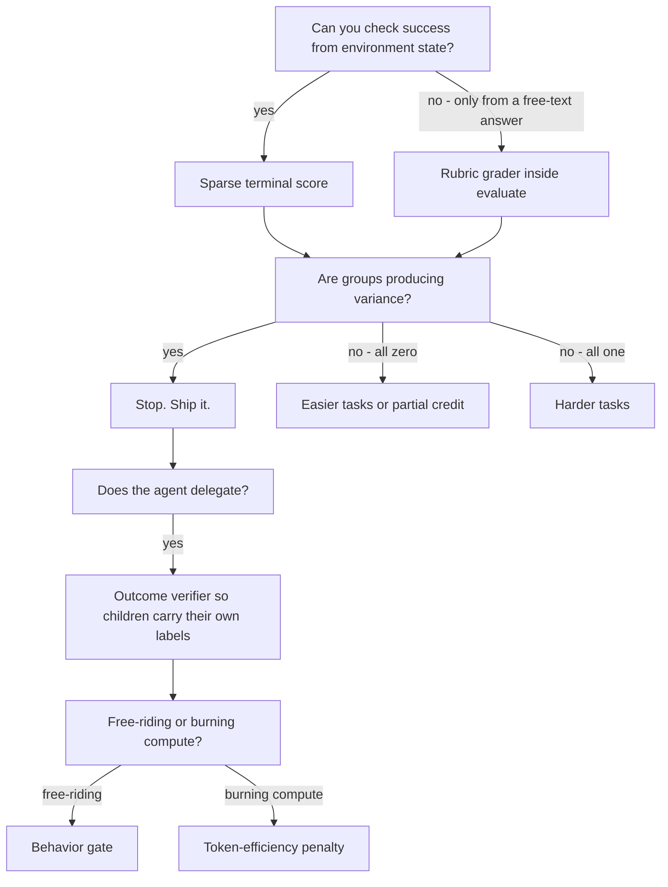

# Reward design

Platoon gives you six places to put a reward signal and about a dozen knobs that reshape it before
it reaches the optimizer. This page is about picking. It assumes you already know *how* each layer
is wired — [custom rewards](../customization/rewards.md) owns that — and answers the question that
comes next: which signal should you actually train on, and what does each choice cost.

The short version: start with a sparse terminal score computed from environment state, keep it in
`[0, 1]`, and add nothing until a metric tells you the sparse signal has stopped producing gradient.

## The menu

| Option | What it scores | Reach for it when | Main cost |
| --- | --- | --- | --- |
| Sparse terminal success | Did the task get done, checked at episode end | Always, first | Groups collapse to zero variance on hard tasks |
| Partial credit | A graded distance to the goal | The answer is a set, a list, or a structured artifact | Rewards hedging unless the metric punishes it |
| Shaped intermediate reward | Progress toward the goal, mid-episode | Rarely, and only with a bounded, non-repeatable term | Per-step rewards are **summed**; longer episodes score higher for free |
| Plugin rubric grader | The final answer, judged by an LLM inside `evaluate()` | Free-form answers with a ground truth to compare against | An LLM call on the terminal step, plus judge variance |
| Sub-agent outcome verifier | A delegated subtask, judged by a forked agent that inspects the environment | Delegated work that has no programmatic grader | Runs inside the parent's step; multiplies wall-clock |
| Behavior gate | Whether *this* trajectory earned credit for the process | Recursive runs where children can free-ride on siblings | One more policy-LLM call per positively scored child |
| Token-efficiency penalty | Deployable tokens spent by an agent and its policy subtree | Recursive runs that delegate everything to burn compute | Bounded shaping that competes with the task reward |



## Start sparse

Every environment in the repository scores at episode end and nowhere else. TextCraft, Oolong,
DeepDive, email-search, codegrep and number-search all open `evaluate()` with a check on
`self._state.finished` (or OpenHands' `is_finished`) and return `0.0, {}` otherwise. That is not
laziness. `evaluate()` is called from inside `step`, on **every** step, so an ungated grader pays its
cost `n` times per episode — and for the rubric-based plugins, that cost is an LLM call.

The second reason is arithmetic. `CodeActEnv.step` does `self._state.reward += step.reward` and, on
the terminal step, sets `traj.reward` to that running total
(<span class="pl-src">platoon/envs/codeact/env.py</span>). A per-step reward is a **sum over steps**,
not an average. Emit `0.05` per step for "made progress" and you have handed the model a reward for
taking more steps, which it will take.

Sparse buys you one thing above all: the reward is a function of state you control, not of text the
agent writes. That is the whole ballgame — see [reward hacking](#reward-hacking) below.

### What sparse costs, and how to see it

A binary reward on a task the model solves 0% or 100% of the time gives a within-group baseline
identical to every member's reward, which centers every advantage to exactly zero. The AReaL workflow
detects this and logs `zero_variance_reward_group`; by default it then throws the group away
(`filter_zero_variance_groups`, default `true`, in
<span class="pl-src">platoon/train/areal/workflows/group_rollout_workflow.py</span>).

If that counter climbs, your first moves are task difficulty and group size, not reward shaping. See
[curriculum and task mixtures](curriculum.md). Shaping is the last resort, because every term you add
is a new surface to hack.

## Partial credit

Partial credit is the cheapest way to buy group variance without adding a hackable channel, provided
the graded quantity is a structured artifact rather than prose.

codegrep is the only shipped example. The agent returns a file list inside a delimiter; the env parses
it and scores F1 against ground truth:

```python title="plugins/codegrep/platoon/codegrep/env.py"
def f1_reward_function(predicted_files, true_files):
    pred, true = set(predicted_files), set(true_files)
    tp = len(pred & true)
    precision = tp / len(pred) if pred else 0.0
    recall = tp / len(true) if true else 0.0
    if not pred and not true:
        return 1.0
    return 0.0 if precision + recall == 0 else 2 * precision * recall / (precision + recall)
```

The F1 choice is load-bearing. A pure recall reward would be maximized by listing every file in the
repository; the precision term prices that. Whenever you grade a *set* the agent proposes, ask what
the degenerate maximal answer looks like and make sure the metric punishes it.

The sub-agent outcome verifier supports partial credit too, through its `partial` status. The
normalizer enforces the pairing: `verified` requires `score > 0`, `partial` requires
`0 < score < 1`, and `failed` or `insufficient_evidence` require exactly `0`. An inconsistent verdict
is zeroed and marked untrainable (`_normalize_judgment` in
<span class="pl-src">platoon/agents/actions/subagent.py</span>). Graded verifier scores come for free;
if you want strictly binary child labels, treat anything below 1.0 as failure in your reward
processor.

## Shaping, and when it is worth the risk

Two places accept a shaped term without fighting the per-step summation:

1. A `reward/*` key written into `reward_misc`, summed once by a reward processor.
2. The reward processor itself, which sees the whole trajectory and the whole tree.

TextCraft ships the canonical shape and then disables it:

```python title="plugins/textcraft/platoon/textcraft/registry.py"
_TEXTCRAFT_SYNTH_DELEGATION_REWARD_CAP = 0.0
...
    success_reward = rewards_dict.get("reward/success", 0.0)
    score = success_reward
    launched = rewards_dict.get("reward/subagent_launched", 0.0)
    if launched > 0:
        subagent_success_rate = rewards_dict.get("reward/subagent_succeeded", 0.0) / launched
        score += _TEXTCRAFT_SYNTH_DELEGATION_REWARD_CAP * subagent_success_rate
```

The cap multiplies a *rate*, not a count, so launching more children cannot raise the term. That is
the property you want from any shaping term: bounded, and not repeatable by doing more of the thing.

OpenReward's equivalent is `openreward.subagent_delegation_reward_coefficient`, default `0.0`, which
adds `coefficient * (successful direct children / launched direct children)`. Only one checked-in
config sets it non-zero — `0.4`, in
`toolathlon_openhands_areal_prealloc_16node-cp-ptc-recursive-judged-r3-fp32-lm-head.yaml` — and every
later ablation pins it back to `0.0` with a comment saying the ablation is meant to be independent of
it. Treat the delegation bonus as an experiment, not a default.

!!! warning "Delegation bonus and root propagation are mutually exclusive"
    `propagate_root_success` overwrites every trajectory's reward with the root's, which erases both
    the verifier's judgment and the delegation accounting. OpenReward's rollout raises rather than
    silently combining them
    (<span class="pl-src">plugins/openreward/platoon/openreward/rollout.py</span>). Pick one
    credit-assignment story per run. See [recursive agent systems](recursive.md).

So, in order of what to try:

- **Nothing.** Fix task difficulty first.
- **A rate-shaped delegation bonus**, if and only if you have evidence the model refuses to delegate
  at all, and you have already disabled root propagation.

Anything denser than that is untested territory in this repository.

## LLM judges

Three different things get called "the judge" here. They score different objects, and you can run all
three at once.

| | Judges | Where it runs | Config |
| --- | --- | --- | --- |
| Rubric grader | A free-text final answer — root or delegated, depending on the plugin | Inside the plugin's `evaluate()` | Plugin-local |
| Outcome verifier | One completed sub-agent trajectory | Inside `launch_subagent`, before it returns | `openreward.enable_subagent_reward_judging` |
| Behavior gate | The *process* of one sub-agent trajectory | After the verifier, only on positive scores | `openreward.enable_subagent_behavior_judging` |

### Rubric graders

Oolong, DeepDive and email-search each build a system prompt, hand it the goal plus a rendered action
history plus the final message, and parse a `{"reason": ..., "success": true|false}` object. Reach for
this when the answer is free-form text and you have a ground truth or rubric to compare against.

Check which task the grader is actually scoring before you copy one. Only email-search runs an LLM
on the root answer as a matter of course: DeepDive's root answers go to an
answer-versus-`ground_truth` judge while its checklist grader is reserved for delegated goals, and
Oolong's root answers never touch an LLM at all — they go to the benchmark's own scorers, ported
verbatim into `eval_helpers.py`, and the LLM grader runs only on sub-agent goals. The per-plugin
split is tabulated on [custom rewards](../customization/rewards.md).

Two things the shipped code does that you should copy. First, check deterministically before paying
for the model. email-search short-circuits on an exact normalized match and only calls the LLM when
that fails:

```python title="plugins/email-search/platoon/email_search/env.py"
        normalized_truth = " ".join(str(self._task.misc["ground_truth"]).lower().split())
        normalized_answer = " ".join(answer.lower().split())
        if normalized_truth == normalized_answer:
            return 1.0, "Exact normalized match."
```

Second, budget for iterating on the prompt. Oolong's sub-agent grader spends most of its system
prompt closing hacks it has already seen — it refuses to mark success when the agent answered by
regex or substring matching over the context instead of reading it. The judge prompt *is* part of
the reward function.

The cost: one extra completion per graded episode, a failure mode where a parse error silently becomes
`0.0`, and judge variance that shows up as noise in `task_reward` you cannot attribute to the policy.
If your rubric grader is non-deterministic, two identical trajectories can land on opposite sides of
the group baseline.

### The outcome verifier pattern

This is the option most worth understanding, because it is not a prompt — it is a whole sub-agent.
When a child finishes, `launch_subagent` forks the **parent's** agent and environment again, hands the
fork a verifier goal, and runs a complete nested episode. The verifier's instructions are fixed in
`_format_verifier_goal` (<span class="pl-src">platoon/agents/actions/subagent.py</span>) and the
operative line is:

> "Do not trust the child agent's summary. Use available tools to inspect the environment, files, and
> other externally visible state before giving a verdict."

That is the point. A delegated subtask usually has no programmatic grader, and the only thing the
parent receives is the child's own finish message — the least trustworthy signal in the system. The
verifier converts "the child says it did it" into "an agent with tool access went and looked."

**Reach for it when** you enable recursion on an environment where only the root task has a grader,
and you want children to carry their own labels instead of inheriting the root's.

**Do not reach for it when** you already have a real per-subtask grader, or when you can accept root
propagation. Root propagation is far cheaper — it stamps the root's outcome onto every descendant and
costs nothing extra at rollout time. The shipped `rootprop` ablation exists precisely as that control.

```yaml title="plugins/openreward/.../configs/areal/toolathlon_openhands_areal_prealloc_32node-cp-ptc-recursive-judged-r3-fp32-lm-head-bs8.yaml"
openreward:
  enable_recursive_subagents: true
  subagent_environment_access: shared
  subagent_default_max_steps: 100
  subagent_max_depth: 2
  enable_subagent_reward_judging: true
  subagent_reward_judge_max_steps: 100
workflow_config:
  rollout_config:
    propagate_root_success: false
    step_timeout: 2700
```

What it costs, concretely:

- **Wall clock, inside the parent's step.** `launch_subagent` does not return until the child episode
  *and* its verifier have finished. That is why the recursive configs set `step_timeout` to 2700
  seconds and the rollout `timeout` to 3600.
- **Tokens with no gradient.** Verifier trajectories are marked `exclude_from_training` and dropped
  from the batch. They are also excluded from the token-efficiency penalty on purpose, because they
  are absent at inference — you pay for them in the training run only.
- **A fail-closed floor.** Before the verifier runs, a `pending` judgment sets the child's reward to
  `0.0` and marks it policy-excluded. If the rollout is cancelled mid-verification, the child cannot
  look like a valid positive target. A verifier that never calls `finish` yields an untrainable child
  even if its text happens to parse as valid JSON.
- **Your env's `fork` has to cooperate.** The verifier inspects the environment through the fork it is
  given, so a fork that hands it nothing returns `insufficient_evidence` forever. OpenReward forces
  verifier forks to `shared` access even when ordinary children are `read_only`.

### The behavior gate

The gate answers a deliberately narrower question than the verifier: not "is the result correct" but
"did *this* trajectory deserve credit for how it worked." It multiplies —
`final_score = outcome_score * gate`, where the gate is `1.0` on `pass` and `0.0` on `fail`. It only
runs when the outcome verdict is training-eligible and scores above zero, so it costs nothing on
failures.

What it actually scores, from
<span class="pl-src">plugins/openreward/platoon/openreward/behavior_judge.py</span>:

> "Launching another agent for the entire task and merely forwarding its answer, claiming shared-state
> work without evidence of authorship, or receiving credit only because another branch happened to
> solve the task must FAIL."

That is the free-riding problem in a recursive tree. With a shared workspace, the environment may
contain a correct result that a *sibling* produced; an outcome verifier that inspects state alone will
happily credit every trajectory that can see it. The gate separates "the work got done" from "this
agent did the work."

It also fails materially wasteful process — identical-call loops, repeated self-induced errors without
adaptation, fabricated claims about actions. It explicitly does not fail a small number of transient
errors the agent diagnoses and corrects, and does not penalize delegation for existing.

```yaml title="plugins/openreward/.../configs/areal/toolathlon_openhands_areal_prealloc_32node-cp-ptc-recursive-behavior-gated-r3-fp32-lm-head-bs8.yaml"
openreward:
  enable_subagent_reward_judging: true
  subagent_reward_judge_max_steps: 100
  enable_subagent_behavior_judging: true
  subagent_behavior_judge_max_prompt_tokens: 24576
  subagent_behavior_judge_max_output_tokens: 4096
  subagent_behavior_judge_timeout_seconds: 300.0
```

`enable_subagent_behavior_judging` requires `enable_subagent_reward_judging`; the config raises
otherwise.

Cost and variance, plainly:

- The judge is a **shallow copy of the policy LLM being trained**, sharing endpoint, model and
  tokenizer, with only judge-specific usage, budget and timeout fields changed. The config comment
  says this is deliberate: it avoids a separate reward model that can drift. It also means there is no
  independent opinion — a policy that learns to produce convincing-looking ledgers is judging itself.
- One completion of up to 4096 output tokens (reasoning plus the JSON verdict) on a prompt
  water-filled to fit 24576, per positively scored child. The whole retry sequence is bounded by
  `subagent_behavior_judge_timeout_seconds`, because OpenHands backoff can otherwise turn a nominal
  five-minute limit into a much longer rollout stall.
- The verdict schema is strict: `pass`/`fail`/`insufficient_evidence` must pair exactly with `passed`
  being `true`/`false`/`null`, and a non-empty `reason` is mandatory. Anything else becomes
  `behavior_judge_invalid`, score `0.0`, and **not** training-eligible. A clean `fail` is different —
  it scores `0.0` and stays trainable, because it is legitimate negative supervision.
- The gate can only multiply down, so enabling it can only reduce mean child reward. Compare
  `reward/subagent_outcome_judgment` against `reward/subagent_judgment` to see how much it removes. If
  it rejects most positives, suspect your delegation prompt before you suspect the judge.

## Penalties

### Token efficiency

The one penalty wired end to end. It prices the deployable inference compute an agent and its policy
subtree consume:

```
effective = output_token_weight * output_tokens + input_token_weight * input_tokens
penalty   = min(max_penalty, coefficient * log2(1 + effective / reference_tokens))
```

Defaults, from `TokenEfficiencyRewardConfig` in
<span class="pl-src">platoon/train/areal/config_defs.py</span>: `enabled=false`, `coefficient=0.05`,
`reference_tokens=20000.0`, `max_penalty=0.20`, `input_token_weight=0.01`, `output_token_weight=1.0`,
`attribution="policy_subtree"` (the only accepted value).

The asymmetric token weights are not arbitrary. The source comment explains that exported AReaL
prompts resend the full logical context even when the inference server reuses a cached prefix, so
input tokens are discounted by two orders of magnitude rather than counted at face value.

What it protects against: in a recursive run, delegation is nearly free to the parent. The parent
spends one tool call and receives a finished answer, so nothing in a plain success reward stops it from
launching subtrees until the budget runs out. Charging each parent for its whole non-verifier subtree
puts a price on the *decision to delegate*. The parent/child overlap is deliberate — "a child owns its
local behavior, while each parent owns the decision to launch that subtree"
(<span class="pl-src">platoon/utils/token_efficiency.py</span>).

Scale check before enabling: `max_penalty` is `0.20` against a base reward in `[0, 1]`, and it is
subtracted *after* the delegation bonus. At the defaults, a subtree burning 20k effective tokens loses
`0.05`; the cap binds only far above that. The penalty is meant to break ties between equally
successful trajectories, not to outweigh success.

```yaml title="plugins/openreward/.../configs/areal/toolathlon_openhands_areal_prealloc_32node-cp-ptc-recursive-judged-r3-fp32-lm-head-bs8-efficiency.yaml"
workflow_config:
  token_efficiency_reward:
    enabled: true
    coefficient: 0.05
    reference_tokens: 20000
    max_penalty: 0.20
    input_token_weight: 0.01
    output_token_weight: 1.0
    attribution: policy_subtree
```

`slurm-scripts/openreward-multienv-prealloc-32node-ptc-recursive-bs8-efficiency.sh` launches the
multi-environment version of the same ablation.

!!! warning "Enabling the config key is only half of it"
    The workflow annotates every trajectory with the penalty metadata, but **only a reward processor
    that subtracts it changes the reward**. OpenReward's does —
    `reward = base_reward + delegation_bonus - efficiency_penalty`
    (<span class="pl-src">plugins/openreward/platoon/openreward/rewards.py</span>). TextCraft's does
    not. Turn the key on with a processor that ignores `reward/efficiency_penalty` and you get metrics
    and no shaping, silently.

### Error-token suppression instead of an error penalty

Before you write a scalar penalty for malformed tool calls, look at `filter_errors`. Rather than
subtracting from the reward, it masks erroneous action tokens *only when their group-centered reward is
positive*, so a datum keeps its clean actions and its negative-signal actions and loses only the
positively reinforced mistake (`_filter_positive_centered_error_tokens` in
<span class="pl-src">platoon/train/areal/workflows/group_rollout_workflow.py</span>). It reports
`error_filter/detected_action_tokens`, `error_filter/suppressed_positive_action_tokens`,
`error_filter/retained_nonpositive_action_tokens` and `error_filter/emptied_datums`.

For this purpose it is strictly better than a reward penalty: it does not perturb the group baseline
and it does not need a coefficient.

!!! warning "`workflow_config.filter_errors` is not read by the shared entrypoints"
    `python -m platoon.train.areal.train` and its Tinker twin take the flag from
    `environments[].workflow_kwargs.filter_errors`, defaulting to `true` for training and `false` for
    evaluation. The `workflow_config.filter_errors` field exists and is honored by OpenReward's own
    `train_areal.py`, but setting it in YAML on the registry path does nothing. Set `workflow_kwargs`
    instead.

### Available but unexercised

AReaL's actor exposes `overlong_reward_penalty` (with `overlong_tokens` and `overlong_penalty_factor`)
and `mask_no_eos_with_zero`. Both default to `false` and **no config in this repository sets either**.
They may be the right tool for a length problem; treat them as untested here, and note that
`overlong_reward_penalty` is on the list of features that require
`workflow_config.filter_zero_advantage_datums: false`.

## Normalization and scale

The thing to internalize: **the workflow always centers within the group, and the shipped configs do
nothing else.** Before the actor sees anything, `GroupRolloutWorkflow` subtracts either the group mean
or a leave-one-out baseline from every datum's reward, computed over `task_reward` — root rewards only.
There is no division by a standard deviation anywhere on that path.

Every checked-in AReaL config except codegrep's then disables actor-side normalization outright:

```yaml
actor:
  reward_scaling: 1.0
  reward_bias: 0.0
  reward_norm:
    mean_level: null
    std_level: null
  adv_norm:
    mean_level: null
    std_level: null
```

codegrep is the lone exception, with `reward_norm.mean_level: batch` and `adv_norm` at
`mean_level: batch, std_level: batch` — plausible for a reward that is a continuous F1 rather than a
binary flag.

Four consequences for reward design:

**Reward scale is gradient scale.** With no std normalization, doubling your reward range doubles every
advantage. Keep the total in `[0, 1]` and size auxiliary terms as fractions of it — which is exactly
what `max_penalty: 0.20` and a delegation coefficient of `0.4` are doing.

**Turning on `adv_norm` means centering twice.** The group baseline has already been subtracted. A
batch-level mean on top is usually harmless; a batch-level std changes the effective learning rate per
batch. `NormConfig` also supports `mean_level: group` / `std_level: group` with an explicit
`group_size`, but nothing in the repo runs that, so verify it on a small run before trusting it.

**Leave-one-out versus mean.** `workflow_config.leave_one_out_baseline` (default `false`) removes each
member's own contribution from its baseline. It removes self-bias; it also makes the baseline noisier
at small `group_size`. Both recursive TextCraft and the recursive OpenReward configs set it `true` at
`group_size: 8`.

**Judged children are centered against a root baseline.** The baseline comes from `task_reward` — root
rewards only — and is subtracted from *every* datum, including sub-agent datums whose rewards came from
a verifier. If verifier scores sit systematically above or below root scores, that gap is a constant
bias on every child's advantage. Watch `reward/subagent_judgment` against `task_reward` and expect them
to live in the same range.

Depth weighting (`depth_level_weighting`, `depth_level_discount_gamma`) is not reward normalization — it
is a trainer-side multiplicative transform applied after rewards are final. It belongs to
[recursive agent systems](recursive.md) and [batch transforms](../customization/batch-transform.md).

## Reward hacking

The single rule: **grade environment state, never text the agent wrote**, unless the text is a
structured claim you then check.

This repository ships a live example of breaking that rule. `number-search` gives the agent two
actions, `finish` and `guess`. The `guess` tool signals a correct answer by writing into the
`finish_message` contextvar:

```python title="plugins/number-search/platoon/number_search/env.py"
def guess_factory(target: int):
    def guess(number: int) -> str:
        if number == target:
            finish_message.set(f"You guessed the number {target} correctly!")
        elif number < target:
            return "Too low, try again."
        else:
            return "Too high, try again."
```

and `evaluate` substring-matches that same variable:

```python title="plugins/number-search/platoon/number_search/env.py"
    async def evaluate(self) -> tuple[float, dict]:
        score, reward_misc = 0.0, {}
        if self._state.finished:
            message = finish_message.get(None)
            if message is not None and "correctly" in message:
                return 1.0, {}
```

But the generic `finish` action writes to *the same contextvar*:

```python title="platoon/agents/actions/common.py"
def finish(message: str = "") -> str:
    ...
    finish_message.set(message)
    return message
```

So `finish("I solved it correctly")` scores `1.0` without a single guess. Both actions are in the
executor's action tuple, `CodeActEnv.step` marks the episode finished as soon as `finish_message` is
set, and the generated tasks carry `max_steps=1` — one action is all it takes. The system prompt only
teaches `guess`, so nothing advertises the shortcut, but a prompt that hides a scoring bug has not
fixed it, and RL is good at finding actions the prompt never mentioned. The stakes are low in a
smoke-test environment, which is exactly what makes it a good specimen: the two writers sit three
lines apart in one small file, and it still shipped.

The general shape is a **channel confusion** — a trusted signal and an untrusted one share a slot, and
the grader reads the slot without knowing who wrote it. All of these have the same structure:

- Grading `finish_message` on keywords, as above.
- Grading a scratch file the agent can also write.
- Grading a self-reported status field.
- Grading shared workspace state that a *sibling* produced. This is the free-riding case the behavior
  gate exists for, and it is the one that only appears once you turn on recursion.

The countermeasures already in the repository, in increasing cost:

| Countermeasure | Example |
| --- | --- |
| Grade state, not narration | TextCraft compares crafted counts against the initial inventory, so pre-existing items earn nothing |
| Parse a structured claim, then verify it | codegrep parses a delimited file list and scores F1 |
| Deterministic check first, LLM only as fallback | email-search's exact normalized match |
| Tell the judge the known hacks | Oolong's grader refuses regex and substring answers |
| Send an agent to look | The outcome verifier: "Do not trust the child agent's summary" |
| Judge authorship, not just outcome | The behavior gate |

A cheap audit for any reward: take a finished run, sort trajectories by reward, and open the
highest-scoring shortest ones in the TUI. A reward of `1.000` on a two-step trajectory is either a
genuinely easy task or a hack, and it takes about thirty seconds to tell which.

## Telling whether a reward is working

### Metrics to watch

| Metric | Where it comes from | What it tells you |
| --- | --- | --- |
| `task_reward` | Root reward, per group member | The actual learning signal. Everything else is diagnosis |
| `task_reward_at_k_max` / `_min` | Per group, over `group_size` members | The spread the baseline sees. Max equal to min means the group had no gradient |
| `zero_variance_reward_group` <span class="pl-tag pl-tag--areal">AReaL</span> | Logged when every retained reward is identical | The single most useful reward-health counter |
| `group_completed_root_quorum_rejected` <span class="pl-tag pl-tag--areal">AReaL</span> | `min_successful_group_size` not met | Groups dying to infrastructure, not to the reward |
| `root_<component>` | Every key in the root's reward dict | Which component moved |
| `reward/subagent_judgment` | Verifier score after the gate | Whether children are getting labels at all |
| `reward/subagent_outcome_judgment`, `reward/subagent_behavior_gate` | Recorded only when a behavior gate ran | How much the gate is removing |
| `reward/efficiency_penalty` <span class="pl-tag pl-tag--areal">AReaL</span> | Token-efficiency attribution | Whether the penalty binds or is noise |
| `error_filter/suppressed_positive_action_tokens` | Deferred error filtering | How much positively reinforced error you are masking |

!!! note "You get no reward breakdown without a reward processor"
    The default processor is `lambda traj: (traj["reward"], {})` — the scalar and an empty metrics
    dict. Only `reward/`-prefixed keys are collected from steps and forwarded to the tracker, so a
    `reward_misc` entry named `ever_found_right_email` (as email-search writes) never reaches W&B.
    Prefix anything you want plotted, and register a processor that forwards it. OpenReward's
    `reward_processor` copies every `reward/`-prefixed key from every step.

How to read the pair that matters: `task_reward` flat while `task_reward_at_k_max` sits well above
`task_reward_at_k_min` means the reward is fine and the policy is not learning. Max equal to min across
most groups means the reward produces no gradient, and no amount of optimizer tuning will help.

### Tracing one suspicious reward

Every rollout writes a JSONL event log. On the AReaL path it lands under
`{rollout_config.output_dir}/train_rollout/{version}/events/events_<task>_<collection>.jsonl`. Open it
in the trajectory TUI:

```bash
# Follow a live run
uv run -m platoon.visualization.cli tail --rdir /path/to/run/train_rollout

# Replay a finished log with no autoplay
uv run -m platoon.visualization.cli replay --dir /path/to/events --delay 0

# Or view a serialized TrajectoryCollection directly
uv run -m platoon.visualization.cli show-dump /path/to/trajectory_collection.json
```

The trace, in order:

1. **Read the tree labels.** Each trajectory node ends in `reward:1.000`, colored red at or below zero,
   green at or above one, yellow in between — and only once the trajectory has finished. A green node
   with a suspiciously small `subtree:solver=N` count is your first suspect. Synthetic verifiers render
   dimmed and hang under the trajectory they judge rather than under the launching parent, so you can
   see at a glance which children were verified.
2. **Search for the component.** `ctrl+f` matches case-insensitively against both node labels and the
   serialized node payload, so searching `efficiency_penalty` or `subagent_reward_judgment` jumps
   straight to the trajectories carrying that key. Results are grouped by node type with matched/total
   counts. (A node whose label *and* data both match is listed twice, so counts can exceed the number
   of distinct nodes.)
3. **Open the step that produced it.** Click a step node to load the details pane. `reward_misc`
   renders as one panel per key, so the exact component values for that step sit next to the action and
   observation that produced them.
4. **Read the action, not the summary.** For an OpenHands step the pane pairs each action with its
   matching observations by `tool_call_id`. This is where "did the agent actually do the work" gets
   settled — the same question the behavior judge answers, with you as the judge.

For a whole run rather than one trajectory, `analyze-errors` clusters failures across an event
directory and `compute_metrics` prints accuracy over a directory of dumps using a strict
`reward == 1.0` success test. Both are covered in
[the visualization tutorial](../tutorials/visualization.md).

## See also

- [Custom rewards](../customization/rewards.md) — the six entry points, the `reward_processor`
  contract, and how a judge is wired in.
- [Recursive agent systems](recursive.md) — depth, budgets, root propagation, and how much of a child's
  trajectory reaches the optimizer.
- [RL algorithms](algorithms.md) — the loss and advantage knobs downstream of everything here.
- [Curriculum and task mixtures](curriculum.md) — the first thing to try when groups have no variance.
- [Trajectory to batch](../walkthroughs/trajectory-to-batch.md) — what happens to a reward between the
  rollout and the actor.
- [OpenReward integration](../integrations/openreward.md) — where the judging and efficiency keys live.
- [Configuration reference](../reference/configuration.md) — every key named on this page, with its
  default.
