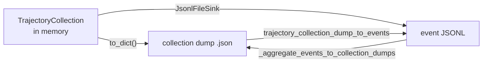

# Event and trajectory schema

Every rollout Platoon runs leaves files behind: a stream of JSONL events while it runs, and — when
the caller asks for it — a serialized snapshot of the whole trajectory tree. This page is the
on-disk contract for those files, for when you want to read them with your own code instead of
through the [visualization TUI](../tutorials/visualization.md).

## The artifacts

| File | Written by | Format |
|---|---|---|
| `events/events_*.jsonl` | `JsonlFileSink` in <span class="pl-src">platoon/visualization/event_sinks.py</span> | one event record per line |
| `trajectory_collection.json` | `InferenceBenchmarkRunner._write_rollout_artifacts` | one `TrajectoryCollection.to_dict()` object |
| `metadata.json` | same | per-rollout status object |
| `reports/task_results.jsonl` | `InferenceBenchmarkRunner.generate_report` | one task summary per line |
| `reports/final_report.json` | same | aggregate report |
| `bridge/bridge_events.jsonl` | `OpenRewardMCPBridge._record` in <span class="pl-src">plugins/openreward/platoon/openreward/mcp_bridge.py</span> | MCP-level event log, *not* trajectory events |
| `bridge/bridge_state.json` | same | live one-object snapshot, rewritten on every event |

Two data models cover almost all of it. A **collection dump** is a tree snapshot:
`{"id": ..., "trajectories": {...}}`. An **event record** is one line describing one mutation of
that tree. They convert into each other, lossily in one direction:



The event log is the richer of the two: it has wall-clock timestamps, a producing PID, and the
cumulative reward as of each step. The dump has only the final state. Going dump to events
manufactures synthetic timestamps; going events to dump throws the timestamps away.

## Collection dump

`TrajectoryCollection.to_dict` in <span class="pl-src">platoon/episode/trajectory.py</span> emits
exactly two keys:

```json
{"id": "<collection uuid>", "trajectories": {"<traj uuid>": {"...": "..."}}}
```

**Insertion order is load-bearing.** Every consumer in the tree — `is_success_for_collection`,
`_get_root_trajectory`, `get_first_traj_and_task_id` — takes `next(iter(trajectories.values()))` as
the root. Do not re-sort the mapping if you round-trip a dump through anything that does not
preserve key order.

`event_handlers` is deliberately dropped: sinks hold open file handles and queues.

### Trajectory

Fields of the `Trajectory` dataclass, in serialization order:

| Field | Type | What it holds |
|---|---|---|
| `id` | str | uuid4, assigned by `TrajectoryCollection.create_trajectory` |
| `task` | object \| null | serialized `Task`, or `null` until `set_trajectory_task` runs |
| `parent_info` | object \| null | `{"id": <parent traj id>, "fork_step": <int>}`; `null` for the root |
| `steps` | list | environment-specific step objects, see below |
| `reward` | float | running sum of step rewards, maintained by `add_step` |
| `finish_message` | str \| null | terminal message from the agent |
| `error_message` | str \| null | terminal error |
| `misc` | dict | free-form; the subagent machinery writes several keys here |

`parent_info.fork_step` is `len(parent.steps)` at the moment the child was created — the index the
child's first step *would* have had in the parent.

`reward` is a sum, not the last step's reward. A trajectory whose steps score `0, 0, 1` ends with
`reward = 1.0`; one that scores `0.5, 0.5` also ends at `1.0`. That matters, because
`is_success_for_collection` in <span class="pl-src">platoon/analysis/compute_metrics.py</span>
tests `== 1.0` exactly — on the trajectory reward first, and the last step's reward second.

Keys the subagent layer writes into `Trajectory.misc`, defined as module constants in
<span class="pl-src">platoon/agents/actions/subagent.py</span>:

| Key | Meaning |
|---|---|
| `subagent_reward_verifier_task` | `true` on a synthetic reward-verifier trajectory |
| `subagent_reward_verifies_trajectory_id` | id of the trajectory this verifier judged |
| `subagent_reward_judgment` | the judge's structured verdict |
| `subagent_outcome_judgment` / `subagent_behavior_judgment` | the two halves of that verdict |
| `exclude_from_training` | drop this trajectory from the batch entirely |
| `exclude_from_policy_training` | keep it, but do not train the policy on it |

The two `exclude_*` flags are what the [batch transform](../customization/batch-transform.md)
reads. See [subagents](../architecture/subagents.md) for who sets them and why.

### Task

`Task` in <span class="pl-src">platoon/envs/base.py</span> serializes as
`{"goal", "id", "max_steps", "misc", "fork_strategy"}`. `fork_strategy` is `"task"` or
`"subtask"`, default `"subtask"`.

A `SubTask` — produced by `Task.fork` under the default strategy, which is what `launch_subagent`
uses — carries one extra key, `parent_tasks`: the ancestor chain, oldest first, each entry itself a
serialized task. So a task object with a `parent_tasks` key is a delegated subtask; one without is
a root task.

### Steps

`TrajectoryStep` is bare: `{"misc": {}}`. Environments subclass it, and the extra fields are
appended after `misc` in serialization order.

| Step class | File | Extra fields |
|---|---|---|
| `CodeActStep` | <span class="pl-src">platoon/envs/codeact/types.py</span> | `code`, `thought`, `output`, `error`, `reward` |
| `OpenHandsTrajectoryStep` | <span class="pl-src">plugins/openhands/platoon/openhands/types.py</span> | `action_events`, `observation_events`, `reward` |

`step.misc.reward_misc` is the conventional home for reward components, keyed `reward/<name>`.
`reward/success` is the one both the default inference success function and the subagent reward
propagation in <span class="pl-src">platoon/utils/subagent_rewards.py</span> look for. OpenHands
steps additionally get `misc.action_misc`, and synthetic condensation steps get
`misc.synthetic_step_type` set to `"openhands_condensation"` plus, when available,
`misc.condensation_reasoning`.

### Why not `dataclasses.asdict`

`_to_jsonable` in <span class="pl-src">platoon/episode/trajectory.py</span> walks dataclass fields
by hand rather than calling `dataclasses.asdict`, and the comment in the source says why: `asdict`
deep-copies every leaf, and trajectory steps embed live SDK objects — OpenHands events holding a
`threading.Lock` or an `asyncio.Future` — that cannot be copied or pickled. The hand-rolled walk
recurses into dataclasses but hands everything else to `model_dump(mode="json")` or `str()`, so
`copy.deepcopy` is never on the path.

The consequence for you as a reader: **anything that is not JSON-native, a dataclass, or a pydantic
model becomes a string.** A `Path`, an enum, a datetime, a live SDK handle — all arrive as whatever
`str()` produced, with no type tag to recover them from.

There are two near-identical copies of `_to_jsonable`, one in
<span class="pl-src">platoon/episode/trajectory.py</span> for `to_dict` and one in
<span class="pl-src">platoon/visualization/event_sinks.py</span> for the sinks. The sink copy checks
for a pydantic `BaseModel` before checking for a dataclass; the other duck-types `model_dump`. For
every type in the tree today they agree.

!!! warning "Non-finite floats produce invalid JSON"
    Both writers call `json.dumps` with defaults, so a `nan` or `inf` reward is written literally as
    `NaN` / `Infinity`. Python's `json.loads` accepts that. `jq` parses it and silently substitutes
    `null` — so a NaN reward becomes a zero-ish `null` in a jq pipeline with no error anywhere.

### Example

Real output, from running `JsonlFileSink` and `to_dict` over a two-step CodeAct trajectory. A
production dump differs only in size.

```json title="trajectory_collection.json (formatted here; the runner writes it compact)"
{
  "id": "1f0c2c3f-1c3e-4e0a-9d1a-0b1a2c3d4e5f",
  "trajectories": {
    "adaa0adf-ee4b-4756-aca9-a27a98e66fca": {
      "id": "adaa0adf-ee4b-4756-aca9-a27a98e66fca",
      "task": {
        "goal": "Craft a stone pickaxe.",
        "id": "textcraft-train-17",
        "max_steps": 20,
        "misc": {},
        "fork_strategy": "subtask"
      },
      "parent_info": null,
      "steps": [
        {"misc": {}, "code": "print(inventory())", "thought": "I need cobblestone first.",
         "output": "{}", "error": null, "reward": 0.0},
        {"misc": {"reward_misc": {"reward/success": 1.0}}, "code": "craft('stone pickaxe')",
         "thought": null, "output": "crafted", "error": null, "reward": 1.0}
      ],
      "reward": 1.0,
      "finish_message": "Task complete.",
      "error_message": null,
      "misc": {}
    }
  }
}
```

## Rollout event JSONL

`JsonlFileSink` implements the four `TrajectoryEventHandler` callbacks and appends one JSON object
per line. It **deletes an existing file** at construction, so a file is never a mix of two runs.

Three envelope fields are added on top of whatever the callback produced:

| Field | Type | Notes |
|---|---|---|
| `collection_id` | str | present only if the sink was constructed with one; every shipped plugin passes it |
| `process_id` | str \| int | same; plugins pass `os.getpid()` |
| `ts` | float | `time.time()` at write, added with `setdefault` |

`ts` is the only ordering signal, and it is per-process wall clock. Rollouts running in different
processes write to different files, so within one file the order is the append order; across files
you are trusting clocks.

### Record types

**`trajectory_created`** — the whole `Trajectory` as it exists at creation, under a `trajectory`
key. `task` is always `null` here and `steps` always empty; the useful field is `parent_info`.

**`trajectory_task_set`** — `trajectory_id` plus the serialized `task`. Emitted whenever
`set_trajectory_task` runs, which for some environments is more than once per trajectory.

**`trajectory_step_added`** — `trajectory_id`, a zero-based `step_index` (computed as
`len(trajectory.steps) - 1`), the serialized `step`, and three snapshot fields read off the
trajectory *after* the step landed: `reward` (cumulative), `finish_message`, `error_message`.

**`trajectory_finished`** — `trajectory_id`, final `reward`, `finish_message`, `error_message`, and
`misc`. This is the only record that carries `Trajectory.misc`, which is where the subagent flags
live. It is emitted from the episode loop's `finally` block and from the subagent action for child
trajectories, so it appears even when the trajectory crashed.

Real output, one file, five lines. Ids are elided and records are wrapped to fit; the sink writes
one line per record.

```json title="events/events_textcraft-train-17_1f0c2c3f-....jsonl"
{"type": "trajectory_created", "trajectory": {"id": "adaa0adf-...", "task": null,
 "parent_info": null, "steps": [], "reward": 0.0, "finish_message": null,
 "error_message": null, "misc": {}},
 "collection_id": "1f0c2c3f-...", "process_id": 10658, "ts": 1788453422.202915}
{"type": "trajectory_task_set", "trajectory_id": "adaa0adf-...",
 "task": {"goal": "Craft a stone pickaxe.", "id": "textcraft-train-17", "max_steps": 20,
          "misc": {}, "fork_strategy": "subtask"},
 "collection_id": "1f0c2c3f-...", "process_id": 10658, "ts": 1788453422.203121}
{"type": "trajectory_step_added", "trajectory_id": "adaa0adf-...", "step_index": 0,
 "step": {"misc": {}, "code": "print(inventory())", "thought": "I need cobblestone first.",
          "output": "{}", "error": null, "reward": 0.0},
 "reward": 0.0, "finish_message": null, "error_message": null,
 "collection_id": "1f0c2c3f-...", "process_id": 10658, "ts": 1788453422.205178}
{"type": "trajectory_step_added", "trajectory_id": "adaa0adf-...", "step_index": 1,
 "step": {"misc": {"reward_misc": {"reward/success": 1.0}}, "code": "craft('stone pickaxe')",
          "thought": null, "output": "crafted", "error": null, "reward": 1.0},
 "reward": 1.0, "finish_message": null, "error_message": null,
 "collection_id": "1f0c2c3f-...", "process_id": 10658, "ts": 1788453422.207227}
{"type": "trajectory_finished", "trajectory_id": "adaa0adf-...", "reward": 1.0,
 "finish_message": "Task complete.", "error_message": null, "misc": {},
 "collection_id": "1f0c2c3f-...", "process_id": 10658, "ts": 1788453422.209343}
```

A forked child adds one more shape. This is the `trajectory_created` record for a subagent
trajectory, also real output:

```json
{"type": "trajectory_created",
 "trajectory": {"id": "0ff80d72-...", "task": null,
                "parent_info": {"id": "f2028ccc-...", "fork_step": 1},
                "steps": [], "reward": 0.0, "finish_message": null,
                "error_message": null, "misc": {}},
 "collection_id": "cid", "process_id": 1234, "ts": 1788453440.25987}
```

Its task arrives on a later line, with the `parent_tasks` chain attached:

```json
{"type": "trajectory_task_set", "trajectory_id": "0ff80d72-...",
 "task": {"goal": "Gather 3 cobblestone.", "id": "36f15fb9-...", "max_steps": 6,
          "misc": {}, "fork_strategy": "subtask",
          "parent_tasks": [{"goal": "Craft a stone pickaxe.", "id": "textcraft-train-17",
                            "max_steps": 20, "misc": {}, "fork_strategy": "subtask"}]},
 "collection_id": "cid", "process_id": 1234, "ts": 1788453440.264072}
```

### Where the files land

The rollout function builds the path from `RolloutConfig.output_dir`, which defaults to
`"rollout_results"` in <span class="pl-src">platoon/config_defs.py</span>. The near-universal shape
is

```
{rollout_config.output_dir}/events/events_{task.id}_{collection.id}.jsonl
```

used by textcraft, appworld, deepdive, oolong, email-search and number-search. Two plugins differ:
codegrep omits the collection id (`events_{task.id}.jsonl`), and openreward runs the task id
through its `_slug` helper first, which replaces every character outside `[A-Za-z0-9._-]` with `-`.
That matters because openreward task ids can be base64url payloads.

`output_dir` itself is rewritten by whatever drives the rollout:

=== "AReaL"

    `_build_rollout_config` in
    <span class="pl-src">platoon/train/areal/workflows/group_rollout_workflow.py</span> appends the
    workflow's `output_subdir` (default `"rollout"`) and then `str(engine.get_version())`:

    ```
    {rollout_config.output_dir}/rollout/{weight version}/events/events_*.jsonl
    ```

=== "Tinker"

    `_get_rollout_config` in
    <span class="pl-src">platoon/train/tinker/workflows/group_rollout_workflow.py</span> replaces
    it with `{log_path}/rollouts/{stats_scope}` when the trainer passes a log path, then appends
    the checkpoint version per rollout. `stats_scope` is `"train"` or `"eval"`, and the trainer's
    `run_log_path` is `{log_path}/{stats.experiment_name}/{stats.trial_name}`:

    ```
    {log_path}/{experiment}/{trial}/rollouts/train/{ckpt version}/events/events_*.jsonl
    ```

For inference benchmarking, the workflow overwrites `rollout_config.output_dir` with the per-rollout
directory, so events land under `rollouts/<task>/rollout_<i>/events/`. Whatever you set for
`rollout_config.output_dir` in an inference YAML is dead config — see
[the inference tutorial](../tutorials/inference.md).

## Inference output directory

`InferenceBenchmarkRunner` in <span class="pl-src">platoon/inference/runner.py</span> derives
everything from `inference.output_dir`:

```
<output_dir>/
├── rollouts/
│   └── <safe_task_id>/              # non-[A-Za-z0-9._-] replaced with _
│       └── rollout_<i>/
│           ├── trajectory_collection.json
│           ├── metadata.json
│           └── events/
│               └── events_*.jsonl
└── reports/
    ├── task_results.jsonl
    └── final_report.json
```

`metadata.json` is the resume marker: `generate_report` globs `rollouts/**/metadata.json`, and
`_arun_single_rollout` skips work when one already exists. Its fields are `task_id`,
`rollout_index`, `source_path`, `wall_time_seconds`, `error`, `created_at` (UTC ISO 8601) and
`status` — which is the literal `"completed"`, the only value anything writes.

### `final_report.json`

Reconstructed from `_build_report`. The field names and nesting are exact; the numbers are made up.
`B` marks a "stat bundle" — `{"count", "mean", "min", "max"}` from `_stat_bundle`, all zeros when
the input list is empty. Bundles are elided as `{}` below where the shape repeats.

```json
{
  "created_at": "2026-09-03T18:20:44.117030+00:00",
  "summary": {
    "total_tasks": 50, "total_rollouts": 400, "valid_rollouts": 396,
    "successful_rollouts": 171, "failed_rollouts": 225, "errored_rollouts": 4,
    "success_rate": 0.4318, "success_at_k": 0.72,
    "reward_mean": 0.44, "reward_max": 1.0, "reward_min": 0.0,
    "reward_at_k_mean": 0.44, "reward_at_k_max": 0.78, "reward_at_k_min": 0.11,
    "elapsed_seconds": 3241.9
  },
  "stats": {
    "num_steps_total": {"overall": {"count": 396, "mean": 24.1, "min": 2, "max": 60},
                        "success": {}, "failure": {}},
    "num_steps_root": {}, "num_steps_subtrajectories": {}, "rollout_wall_time_seconds": {}
  },
  "reward_components": {
    "reward/success": {"overall": {}, "success": {}, "failure": {},
                       "at_k_mean": {}, "at_k_max": {}, "at_k_min": {}}
  },
  "subtrajectory_stats_by_depth": {
    "overall": {"1": {"total_subtrajectories": 812, "total_steps": 4103,
                      "avg_subtrajectories_per_rollout": 2.05,
                      "avg_steps_per_rollout": 10.36,
                      "avg_steps_per_subtrajectory": 5.05}},
    "success": {}, "failure": {}
  },
  "workflow_specific_metrics": {},
  "workflow_config": {},
  "model": {"model_name": "openai/Qwen/Qwen3-4B-Instruct-2507",
            "model_endpoint": "http://127.0.0.1:30000/v1"},
  "tasks": []
}
```

Three things in `summary` the names get wrong:

- `success_rate` averages over **rollouts** (`successful / valid`). `success_at_k` averages over
  **tasks**, each contributing `max(success)` across its K rollouts.
- `reward_at_k_max` is the mean over tasks of each task's max reward. It is not a global maximum;
  `reward_max` is.
- `failed_rollouts` means *ran cleanly and scored unsuccessful*. Rollouts that raised are
  `errored_rollouts`, and those are excluded from every `stats`, `reward_components` and depth
  aggregation.

### `task_results.jsonl`

One line per task; the same objects as `report["tasks"]`.

```json
{"task_id": "...", "success_at_k": 1.0, "num_rollouts": 8, "num_valid_rollouts": 7,
 "num_failed_rollouts": 1, "num_successful_rollouts": 3, "success_rate_within_task": 0.4286,
 "reward_at_k_mean": 0.4, "reward_at_k_max": 1.0, "reward_at_k_min": 0.0,
 "rollouts": ["asdict(InferenceRolloutRecord), one per rollout"]}
```

Note the collision: `num_failed_rollouts` here means *errored* (`num_rollouts - num_valid_rollouts`),
the opposite of `failed_rollouts` in the summary.

Each entry in `rollouts` is `asdict` of `InferenceRolloutRecord` from
<span class="pl-src">platoon/inference/workflow.py</span>, whose `trajectory_collection` field
holds a **full collection dump**. Both report files therefore embed every trajectory tree in the
run, and get large fast. Stream `task_results.jsonl` line by line rather than loading
`final_report.json`, which contains the same trees plus everything else.

## OpenReward bridge events

A different log, in a different format, from a different producer: the MCP bridge that fronts an
OpenReward session. It records tool traffic, not trajectory structure. Paths, built in
<span class="pl-src">plugins/openreward/platoon/openreward/rollout.py</span>:

```
{rollout_config.output_dir}/openreward/{slug(task_id)}/{rollout_id}/bridge/bridge_events.jsonl
{rollout_config.output_dir}/openreward/{slug(task_id)}/{rollout_id}/bridge/bridge_state.json
```

with sibling `openhands/` (conversation persistence) and `workspace/` directories under the same
rollout directory.

Records are `{"type": ..., "time": ..., **payload}`. The timestamp key is **`time`**, not `ts`, and
there is no `collection_id` — the TUI synthesizes one when it ingests these. The types and their
payloads:

| `type` | Payload fields |
|---|---|
| `session_started` | `env`, `split`, `task_index`, `task_name`, `tool_names`, `session_url` |
| `task_requested` | `prompt_chars`, `tool_count` |
| `tool_call` | `turn`, `call_id`, `tool_name`, `arguments` |
| `tool_result` | `turn`, `call_id`, `tool_name`, `result` |
| `max_tool_calls_exceeded` | `max_tool_calls`, `tool_name` |
| `session_closing` | `finished`, `last_reward` |

`call_id` is `f"call_{turn:04d}_{slug(tool_name)}"`, so a call and its result join on it.

`bridge_state.json` is rewritten on every recorded event with
`{"env", "split", "task_index", "task_name", "turn", "finished", "last_reward", "updated_at"}`.
Useful for polling a running rollout; useless as history.

Reconstructed record, exact field names:

```json
{"type": "tool_call", "time": 1788453422.9, "turn": 3, "call_id": "call_0003_emails.send_email",
 "tool_name": "emails.send_email", "arguments": {"to": "a@example.com", "subject": "hi"}}
```

## Analysis caches

The `analyze-compare` and `analyze-errors` subcommands persist LLM output so you do not pay twice.
The default root is `${XDG_CACHE_HOME:-~/.cache}/AgentEcho/`, overridable with `--analysis-cache`.

| Path | Contents |
|---|---|
| `AgentEcho/analyze_compare/<sha256>.json` | `{"analysis": str, "ts": float}` for one A/B pair |
| `AgentEcho/analyze_compare/clusters.json` | `{"clusters": {label: [task_id, ...]}, "ts": float}` |
| `AgentEcho/analyze_errors/<uuid5>.json` | `{"analysis": str, "ts": float}` for one error issue |
| `AgentEcho/compare_details.md` | fallback when `c` (copy details) cannot reach a clipboard |

The compare key is a sha256 over task id, winner, and each side's success / step count / source
path. The error key is a uuid5 over task id, collection id, trajectory id and source path — it
deliberately omits the issue title and step refs so re-running with different extraction settings
still hits the cache. An older key that included them is read as a fallback.

There is also a `MarkdownFileSink` in
<span class="pl-src">platoon/visualization/event_sinks.py</span> that writes a human-readable log.
Nothing in the repository registers it; it is there if you want it.

## Reading these files

For anything trajectory-shaped, use the loader the analysis tools use. `iter_collection_dumps`
takes a mix of `.json` dumps, `.jsonl` dumps and event JSONL, sniffs each file, and yields
`(source_path, dump)` — event files are aggregated back into dumps on the way through.

```python
from pathlib import Path

from platoon.analysis.compare import iter_collection_dumps
from platoon.analysis.compute_metrics import is_success_for_collection, num_steps_for_collection

paths = sorted(Path("runs/exp1/rollouts").rglob("*.jsonl"))
for source_path, dump in iter_collection_dumps(paths):
    root = next(iter(dump["trajectories"].values()))
    success, reward_used = is_success_for_collection(dump)
    print(
        root["task"]["id"],
        "success" if success else "failure",
        f"reward={root['reward']}",
        f"steps={num_steps_for_collection(dump)}",
        f"trajectories={len(dump['trajectories'])}",
        source_path,
    )
```

`num_steps_for_collection` counts steps across *all* trajectories, subagents included. For the root
alone, use `len(root["steps"])`.

When you need the timeline rather than the final state — per-step timing, interleaving between
parent and child, reward as it accrued — read the event JSONL directly. Stdlib is enough:

```python
import json
from collections import defaultdict
from pathlib import Path

steps_by_traj = defaultdict(list)
finished = {}

for line in Path("runs/exp1/rollouts/events/events_task-17_abc.jsonl").read_text().splitlines():
    if not line.strip():
        continue
    try:
        rec = json.loads(line)
    except json.JSONDecodeError:
        continue  # a run killed mid-write leaves a truncated final line
    if rec["type"] == "trajectory_step_added":
        steps_by_traj[rec["trajectory_id"]].append((rec["ts"], rec["step_index"], rec["reward"]))
    elif rec["type"] == "trajectory_finished":
        finished[rec["trajectory_id"]] = rec

for traj_id, steps in steps_by_traj.items():
    wall = steps[-1][0] - steps[0][0]
    misc = finished.get(traj_id, {}).get("misc", {})
    kind = "verifier" if misc.get("subagent_reward_verifier_task") else "solver"
    print(f"{traj_id[:8]} {kind:8} steps={len(steps)} {wall:6.1f}s reward={steps[-1][2]}")
```

Skipping malformed lines is not defensive padding — every reader in the codebase does it, because a
killed run really does leave a half-written last line.

To go the other way and feed a dump into the TUI, `write_events_from_dump_to_jsonl(dump, path)` in
<span class="pl-src">platoon/visualization/event_sinks.py</span> materializes a dump as event
records with synthetic monotonic timestamps. `python -m platoon.visualization.cli show-dump` does
exactly this into a temp file before replaying it.

!!! note "One defensive shape you can ignore"
    The TUI's `_as_dict_list` accepts `action_events` either as a list or wrapped as
    `{"action_events": [...]}`. No shipped producer writes the wrapped form — `OpenHandsEnv.step`
    assigns a flat list — so your own reader can assume a list.

## See also

- [Trajectory to batch](../walkthroughs/trajectory-to-batch.md) — how these structures become
  training tensors.
- [Visualization](../tutorials/visualization.md) — the TUI and the analysis subcommands that read
  these files.
- [Inference benchmarking](../tutorials/inference.md) — producing the report files above.
- [Configuration reference](configuration.md) — `RolloutConfig` and the keys that decide where
  output goes.
