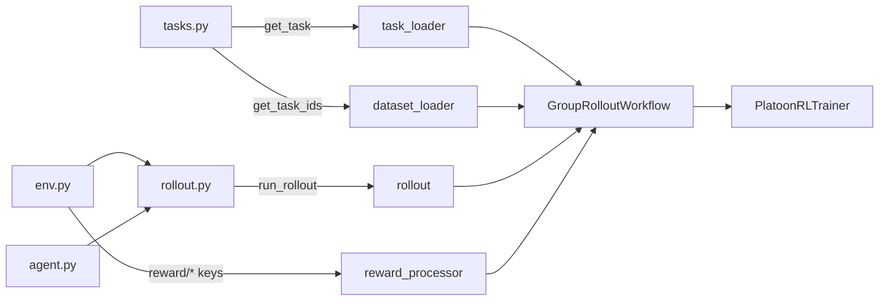

# Build a task from scratch

By the end of this page you will have a Platoon plugin of your own: installed, importable,
registered, runnable against a real model, and wired to a training config. Nine stages, each one
ending in a command that tells you whether the stage worked.

This is the long version. For the same journey in five minutes and half the code, read
[your first custom task](../get-started/first-task.md) instead — it builds a one-shot
word-unscrambling task and skips the reasoning. The task here is deliberately bigger: multi-step
episodes, hidden information the agent must query, an irreversible resource it can waste, and a
reward with partial credit. A trivial example cannot teach any of those.

## The task you are going to build

**Market run.** The agent has a shopping order and a fixed number of credits. Prices are *not*
listed in the goal — they are resampled for every task, so the agent has to call `check_price`
before it commits. Purchases are final and there is no way to earn more credits, so a wasted buy
can make the order unfinishable. The episode ends when the agent calls `finish`, or when its step
budget runs out.

The reward is the fraction of the ordered units actually acquired, plus a bonus for completing the
whole order. A policy that buys three of four units scores 0.75 on coverage and nothing on the
bonus. That gradient is the point: with a binary reward, most early rollouts are zero and the model
learns nothing.

| Property | Why it is in this tutorial |
| --- | --- |
| Prices resampled per task | Forces a real query step; the model cannot memorize the answer |
| Credits are spendable and final | Creates a failure mode that is the agent's own fault |
| Partial credit | Gives signal to a policy that is half right |
| Explicit `finish` | Separates "done" from "out of budget" in the reward |

TextCraft-Synth uses the same trick with meaningless item names to force environment queries — see
[train on TextCraft](textcraft.md).

## Before you start

You need [Platoon installed](../get-started/installation.md) and Python 3.12 exactly. You should
know what a task, environment, agent and rollout are — [core concepts](../get-started/concepts.md)
covers that in about ten minutes.

Only the last stage needs hardware:

| Stages | What they need |
| --- | --- |
| 1-5, 7-8 | A laptop. No GPU, no API key, no network beyond `uv sync` |
| 6 | Any OpenAI-compatible endpoint — a hosted API key, or a local vLLM/SGLang server |
| 9 | A Tinker account, **or** a Linux GPU node for AReaL |

If you have neither, stop at stage 8. Stage 6 is a genuine finish line: a real model playing your
task, a reward you can read, and an event log you can replay. Everything after it is the same
plugin under a trainer.

## The whole plugin, up front

```text
plugins/market-run/
├── pyproject.toml
├── check_env.py                     # scratch script, stage 3
├── check_prompt.py                  # scratch script, stage 4
├── smoke_test.py                    # scratch script, stage 6
└── platoon/                         # NO __init__.py in this directory
    └── market_run/
        ├── __init__.py              # empty
        ├── tasks.py                 # generator + get_task + a `python -m` CLI
        ├── env.py                   # actions, state, termination, evaluate()
        ├── agent.py                 # system prompt
        ├── rollout.py               # async run_rollout(task, config)
        ├── registry.py              # names the trainers resolve
        ├── market_run_tinker.yaml
        ├── market_run_train.jsonl   # written by stage 2
        └── market_run_val.jsonl     # written by stage 2
```

Three different names for one thing, and they are not interchangeable: the directory is
`plugins/market-run` (hyphens fine), the importable module is `platoon.market_run` (underscores
only), and the distribution is `platoon-market-run`.

Nothing in core Platoon knows your task exists; it asks for five callables, and four of your files
produce them.



---

## Stage 1 — Scaffold and install

Create the directories. The one that matters is `plugins/market-run/platoon/`.

```bash
mkdir -p plugins/market-run/platoon/market_run
cd plugins/market-run
touch platoon/market_run/__init__.py
```

!!! warning "Do not create `plugins/market-run/platoon/__init__.py`"
    Core Platoon turns `platoon` into a namespace package with three lines
    (<span class="pl-src">platoon/\_\_init\_\_.py</span>):

    ```python
    from pkgutil import extend_path

    __path__ = extend_path(__path__, __name__)
    ```

    `extend_path` rescans `sys.path` for every directory named `platoon` and merges them into one
    package. That is what lets `platoon.market_run` and `platoon.episode` resolve even though they
    live in different repositories on disk. An `__init__.py` in your `platoon/` directory shadows
    that mechanism and the import breaks. No plugin in the repository has one.

For the distribution metadata, copy `plugins/number-search/pyproject.toml` and change the name and
description. The trimmed version below shows what is load-bearing.

```toml title="plugins/market-run/pyproject.toml"
[project]
name = "platoon-market-run"
version = "0.1.0"
description = "Platoon plugin for the market-run task."
requires-python = "~=3.12.0"
dependencies = ["platoon >= 0.1.0"]

[project.optional-dependencies]
tinker = ["platoon[tinker]"]
areal = ["platoon[areal]"]

[tool.uv]
conflicts = [[{ extra = "tinker" }, { extra = "areal" }]]
override-dependencies = [ ... ]   # copy verbatim from plugins/number-search/pyproject.toml
no-build-isolation-package = ["flash-attn", "causal-conv1d", "mamba-ssm"]

[tool.uv.sources]
platoon = { path = "../..", editable = true }

[build-system]
requires = ["hatchling"]
build-backend = "hatchling.build"

[tool.hatch.build.targets.wheel]
packages = ["platoon"]
```

The `override-dependencies` list is the one thing you cannot summarize away: `uv` only honors
overrides declared by the *root* of a resolution, and every plugin is its own root. Copy all
twenty-odd lines. `tinker` and `areal` are declared as conflicting extras, so a checkout is
installed against one backend or the other, never both. Pick one now:

```bash
uv sync --extra tinker      # or: uv sync --extra areal, on a Linux GPU box
```

**Proof it worked.** The `__path__` list should contain two directories — core Platoon and yours:

```bash
uv run python -c "import platoon, platoon.market_run; print(platoon.__path__)"
```

If that raises `ModuleNotFoundError`, jump to [when something breaks](#when-something-breaks); it
is almost always the `__init__.py` above.

---

## Stage 2 — Tasks, ids and splits

The trainer needs exactly one function from you: `(task_id: str) -> Task`
(`TaskLoader` in <span class="pl-src">platoon/train/components.py</span>). `Task` is a plain
dataclass with `goal`, `id`, `max_steps`, `misc` and `fork_strategy`
(<span class="pl-src">platoon/envs/base.py</span>). Everything task-specific goes in `misc`, which
your environment reads.

Real plugins generate a dataset offline and ship it as JSONL next to the code. Do the same: the
splits become reproducible and you can read the data.

```python title="plugins/market-run/platoon/market_run/tasks.py"
import argparse
import hashlib
import json
import pathlib
import random
from dataclasses import asdict
from typing import Literal

from platoon.envs.base import Task

ITEMS = ["flour", "sugar", "butter", "yeast", "cocoa", "vanilla", "walnuts", "raisins"]
MAX_STEPS = 12


def sample_task(rng: random.Random) -> tuple[str, dict]:
    prices = {item: rng.randint(2, 9) for item in ITEMS}
    required = {item: rng.randint(1, 2) for item in rng.sample(ITEMS, rng.randint(3, 4))}
    budget = sum(prices[item] * n for item, n in required.items()) + rng.randint(1, 4)
    order = ", ".join(f"{n}x {item}" for item, n in sorted(required.items()))
    goal = (
        f"Buy {order} at the market without spending more than {budget} credits. "
        "Prices are not listed and change from day to day, so check before you buy."
    )
    return goal, {"required": required, "prices": prices, "budget": budget}
```

The budget leaves one to four credits of slack, so a single unnecessary purchase is often fatal —
the failure mode the reward is going to measure.

Assigning a sample to train or validation by **hashing its content** — rather than by shuffling —
makes the split deterministic across processes and guarantees no task appears in both.
`number-search` does the same with its `(low, target, high)` triplet
(<span class="pl-src">plugins/number-search/platoon/number_search/tasks.py</span>).

```python title="plugins/market-run/platoon/market_run/tasks.py (continued)"
def create_market_run_datasets(
    seed: int = 42, num_samples: int = 2000, eval_size: int = 200
) -> tuple[list[Task], list[Task]]:
    rng = random.Random(seed)
    p_val = eval_size / max(1, num_samples + eval_size)
    train_data: list[Task] = []
    val_data: list[Task] = []
    seen: set[str] = set()

    while len(train_data) < num_samples or len(val_data) < eval_size:
        goal, misc = sample_task(rng)
        signature = json.dumps(misc, sort_keys=True)
        if signature in seen:
            continue
        seen.add(signature)
        digest = int(hashlib.sha256(f"{seed}:{signature}".encode()).hexdigest()[:8], 16)
        if (digest / 0xFFFFFFFF) < p_val:
            split, bucket, limit = "val", val_data, eval_size
        else:
            split, bucket, limit = "train", train_data, num_samples
        if len(bucket) < limit:
            bucket.append(
                Task(
                    goal=goal,
                    id=f"market_run.{split}.{len(bucket)}",
                    max_steps=MAX_STEPS,
                    misc=misc,
                )
            )

    return train_data, val_data
```

The loader half is mechanical, and is the house style in every plugin: ids are formatted, files
read once into a module global, parsed `Task`s memoized.

```python title="plugins/market-run/platoon/market_run/tasks.py (continued)"
DATA: dict[str, list[str]] = {}
TASKS: dict[str, Task] = {}


def get_task_ids(
    split: Literal["train", "val"], num_samples_train: int = 2000, num_samples_val: int = 200
) -> list[str]:
    if split == "train":
        return [f"market_run.train.{i}" for i in range(num_samples_train)]
    if split == "val":
        return [f"market_run.val.{i}" for i in range(num_samples_val)]
    raise ValueError(f"Invalid split: {split}")


def get_task(task_id: str) -> Task:
    if task_id in TASKS:
        return TASKS[task_id]
    _, split, index = task_id.split(".")
    if split not in DATA:
        path = pathlib.Path(__file__).parent / f"market_run_{split}.jsonl"
        DATA[split] = path.read_text().splitlines()
    TASKS[task_id] = Task.from_dict(json.loads(DATA[split][int(index)]))
    return TASKS[task_id]


if __name__ == "__main__":
    parser = argparse.ArgumentParser()
    parser.add_argument("--num_samples", type=int, default=2000)
    parser.add_argument("--eval_size", type=int, default=200)
    args = parser.parse_args()

    train_data, val_data = create_market_run_datasets(
        num_samples=args.num_samples, eval_size=args.eval_size
    )
    parent = pathlib.Path(__file__).parent
    for split, tasks in (("train", train_data), ("val", val_data)):
        with open(parent / f"market_run_{split}.jsonl", "w") as f:
            for task in tasks:
                json.dump(asdict(task), f)
                f.write("\n")
        print(f"Wrote {len(tasks)} {split} tasks")
```

`python -m platoon.market_run.tasks` works because the subdirectories inside your module are
PEP 420 namespace portions — no `__init__.py` is needed anywhere below `market_run/`.

**Proof it worked.** Generate the data, then read one task back through the loader:

```bash
uv run python -m platoon.market_run.tasks --num_samples 2000 --eval_size 200
uv run python -c "
from platoon.market_run.tasks import get_task
task = get_task('market_run.val.0')
print(task.goal)
print(task.misc['required'], task.misc['budget'])
"
```

You should see a goal sentence, a required-items dict, and a budget. A missing file gives
`FileNotFoundError`; an id past the end of the split gives `IndexError`.

!!! warning "The workflow overwrites `max_steps` on the task you return"
    Both backends stamp `rollout_config.max_steps` onto `task.max_steps` before every rollout
    (<span class="pl-src">platoon/train/areal/workflows/group_rollout_workflow.py</span>,
    <span class="pl-src">platoon/train/tinker/workflows/group_rollout_workflow.py</span>), and
    `TASKS` hands back the same object every time, so the mutation sticks for the life of the
    process. Treat the `max_steps` in your JSONL as a default the config wins over, and never cache
    anything the environment mutates during an episode.

---

## Stage 3 — The environment

An environment is anything satisfying the `Env` protocol — `reset`, `step`, `close`, `observe` and
a `task` property (<span class="pl-src">platoon/envs/base.py</span>). For a task the model solves
by writing Python you do not implement that yourself: you subclass `CodeActEnv`, hand it a code
executor whose action space is a tuple of plain Python callables, and override `evaluate()`.

Actions and mutable state both belong on the executor, because that is what gets forked when
subagents enter the picture.

```python title="plugins/market-run/platoon/market_run/env.py"
from platoon.agents.actions.common import finish
from platoon.envs.base import Task
from platoon.envs.codeact import CodeActEnv, IPythonCodeExecutor


class MarketExecutor(IPythonCodeExecutor):
    def __init__(self, task: Task):
        self.prices: dict[str, int] = task.misc["prices"]
        self.required: dict[str, int] = task.misc["required"]
        self.credits: int = task.misc["budget"]
        self.cart: dict[str, int] = {}
        super().__init__(task, actions=(finish, self.check_price, self.buy, self.view_cart))

    def check_price(self, item: str) -> str:
        """Look up the unit price of one item."""
        if item not in self.prices:
            return f"The market does not stock {item!r}."
        return f"{item} costs {self.prices[item]} credits each."

    def buy(self, item: str, quantity: int = 1) -> str:
        """Buy units of an item. Purchases are final."""
        if item not in self.prices:
            return f"The market does not stock {item!r}."
        if quantity < 1:
            return "Quantity must be at least 1."
        cost = self.prices[item] * quantity
        if cost > self.credits:
            return f"{quantity}x {item} costs {cost} credits and you have {self.credits}."
        self.credits -= cost
        self.cart[item] = self.cart.get(item, 0) + quantity
        return f"Bought {quantity}x {item} for {cost} credits. {self.credits} credits left."

    def view_cart(self) -> str:
        """Show what you have bought and how many credits remain."""
        return f"Cart: {self.cart}. Credits left: {self.credits}."
```

Bound methods work as actions because the executor injects each callable into the IPython namespace
under its own `__name__` (<span class="pl-src">platoon/envs/codeact/env.py</span>), and bound
methods have one. Nothing outside these four functions can reach `self.prices`, so model-authored
code cannot read the answer out of the shell.

`IPythonCodeExecutor.describe_action_space()` returns the empty string. If you skip the override,
the model is never told your actions exist:

```python title="plugins/market-run/platoon/market_run/env.py (continued)"
    async def describe_action_space(self) -> str:
        return """Available actions (python functions):

1. def check_price(item: str) -> str
   Look up the unit price of one item. Prices differ from task to task.
   - Example: print(check_price("flour"))

2. def buy(item: str, quantity: int = 1) -> str
   Buy units of an item. Refused if you cannot afford them. Purchases are final.
   - Example: print(buy("flour", 2))

3. def view_cart() -> str
   Show what you have bought and how many credits remain.

4. def finish(message: str) -> str
   End the episode once the order is complete.
   - Example: finish("order complete")

Only captured stdout comes back to you, so wrap calls in print().
"""
```

Now the environment itself, and the reward.

```python title="plugins/market-run/platoon/market_run/env.py (continued)"
class MarketRunEnv(CodeActEnv):
    def __init__(self, task: Task):
        super().__init__(task, MarketExecutor(task))
        self._credited = 0.0

    def _coverage(self) -> float:
        executor: MarketExecutor = self._code_executor
        bought = sum(min(executor.cart.get(item, 0), n) for item, n in executor.required.items())
        return bought / sum(executor.required.values())

    async def evaluate(self) -> tuple[float, dict]:
        coverage = self._coverage()
        gained = coverage - self._credited
        self._credited = coverage
        reward_misc = {"reward/coverage": gained}
        if self._state.finished:
            reward_misc["reward/success"] = 1.0 if coverage >= 1.0 else 0.0
        return gained, reward_misc
```

Four things in there are the ones people get wrong.

**`evaluate()` runs on every step, not only the last.** `CodeActEnv.step` calls it after every
executed cell and adds the float to the step and to the trajectory
(<span class="pl-src">platoon/envs/codeact/env.py</span>). So the value you return must be an
*increment*, not a running total. This environment credits `coverage - self._credited` rather than
`coverage`; the cart only ever grows, so the increments are non-negative and sum to the final
coverage exactly.

**Partial credit survives a truncated episode.** Because the reward is banked step by step, an
agent that buys three of four units and then runs out of budget still ends with `reward = 0.75`. If
you compute the whole reward on the final step only — the way a binary task usually does — you
throw that away, because a budget-exhausted episode never reaches a step with `finished` set.

**`reward/` is the aggregation convention.** Nothing enforces it, but every reward processor in the
repository sums exactly the keys starting with `reward/` across steps
(<span class="pl-src">plugins/textcraft/platoon/textcraft/registry.py</span>). `reward/coverage` is
a delta so summing is correct; `reward/success` is emitted at most once, on the step that finishes
the episode, so summing is correct for it too.

**Termination is a contextvar, not a return value.** The built-in `finish` action sets
`finish_message`, `CodeActEnv.step` sees it and marks the state finished, and the episode loop
halts (<span class="pl-src">platoon/episode/loop.py</span>). An action can set it directly to end
the episode early — `number-search` stops the moment the guess is right. This environment
deliberately does not, because "I am done" is a decision worth training.

There is no `fork` here, so `launch_subagent` is unavailable. Adding it means making the executor
forkable; see [recursive agents](recursive-agents.md).

**Proof it worked.** Drive the environment with scripted actions and no model at all. The two
contextvars are what `CodeActEnv.reset` reads; outside a rollout you set them yourself.

```python title="plugins/market-run/check_env.py"
import asyncio

from platoon.envs.codeact import CodeActAction
from platoon.episode.context import current_trajectory, current_trajectory_collection
from platoon.episode.trajectory import TrajectoryCollection
from platoon.market_run.env import MarketRunEnv
from platoon.market_run.tasks import get_task


async def main() -> None:
    task = get_task("market_run.val.0")
    collection = TrajectoryCollection()
    current_trajectory_collection.set(collection)
    current_trajectory.set(collection.create_trajectory())

    env = MarketRunEnv(task)
    await env.reset()
    item, quantity = next(iter(task.misc["required"].items()))
    for code in [
        f"print(check_price({item!r}))",
        f"print(buy({item!r}, {quantity}))",
        "print(view_cart())",
        "finish('stopping early')",
    ]:
        obs = await env.step(CodeActAction(parsed_code=code))
        step = obs.history[-1]
        result = (step.output or step.error or "").strip()
        print(f"{code}\n  -> {result}  [reward {step.reward:.3f}]")
    await env.close()


asyncio.run(main())
```

```bash
uv run python check_env.py
```

You should see the price, a successful purchase, the cart, and a non-zero reward on the step that
bought something — followed by `0.000` on the steps that did not. If every reward is zero, your
`evaluate` is not seeing the cart. If the rewards keep climbing after the last purchase, you
returned a total instead of a delta.

---

## Stage 4 — The agent

For a CodeAct task the agent is usually only a prompt. Subclass `CodeActPromptBuilder`, then
subclass `CodeActAgent` to install your builder by default.

Replacing the system prompt outright means your string has to carry the `<thought>`/`<python>`
formatting rules itself, because that is what the parser looks for. Extending the built-in template
through its `env_specific_system_context` slot
(<span class="pl-src">platoon/agents/codeact/prompts/system.jinja</span>) is the better default: the
format instructions stay correct and your strategy notes ride along.

```python title="plugins/market-run/platoon/market_run/agent.py"
from platoon.agents.codeact import CodeActAgent, CodeActPromptBuilder, PromptMode
from platoon.envs.codeact import CodeActObservation

ENV_CONTEXT = """
You are shopping at a market where prices are resampled for every order, so a price you remember
from a previous order is worthless — call check_price before you spend anything. Credits cannot be
earned back and purchases cannot be returned, so buying an item that is not on the order can make
the order impossible to complete. Call finish once you have everything.
"""


class MarketRunPromptBuilder(CodeActPromptBuilder):
    def build_system_prompt(self, obs: CodeActObservation, **context) -> str:
        context.setdefault("env_specific_system_context", ENV_CONTEXT)
        return super().build_system_prompt(obs, **context)


class MarketRunAgent(CodeActAgent):
    def __init__(
        self,
        prompt_mode: PromptMode = "sequence_extension",
        include_reasoning: bool = True,
        **kwargs,
    ):
        if "prompt_builder" not in kwargs:
            kwargs["prompt_builder"] = MarketRunPromptBuilder(
                prompt_mode=prompt_mode,
                include_reasoning=include_reasoning,
            )
        super().__init__(prompt_mode=prompt_mode, include_reasoning=include_reasoning, **kwargs)
```

That `__init__` shape — build the builder unless one was passed, then forward the same two flags to
`super()` — is what every plugin in the repository does. Keep it, because the flags have to reach
both objects: the builder uses `include_reasoning` to decide whether to ask for `<thought>` blocks,
and the agent uses it to decide whether to parse them.

Note what is *not* in the prompt: the action list. That comes from your executor's
`describe_action_space()` and is rendered into the first user turn by
<span class="pl-src">platoon/agents/codeact/prompts/user-initial.jinja</span>, together with the
goal string and the step budget. The division is worth keeping — the executor owns what the actions
are, the prompt builder owns how to behave.

**Proof it worked.** Print the exact messages the model will receive:

```python title="plugins/market-run/check_prompt.py"
import asyncio

from platoon.episode.context import current_trajectory, current_trajectory_collection
from platoon.episode.trajectory import TrajectoryCollection
from platoon.market_run.agent import MarketRunPromptBuilder
from platoon.market_run.env import MarketRunEnv
from platoon.market_run.tasks import get_task


async def main() -> None:
    collection = TrajectoryCollection()
    current_trajectory_collection.set(collection)
    current_trajectory.set(collection.create_trajectory())

    env = MarketRunEnv(get_task("market_run.val.0"))
    obs = await env.reset()
    for message in MarketRunPromptBuilder().build_messages(obs):
        print("=" * 20, message["role"])
        print(message["content"])
    await env.close()


asyncio.run(main())
```

```bash
uv run python check_prompt.py
```

Read the output properly; this is the cheapest bug-finding you will do all day. The system message
should carry your strategy paragraph *and* the `<python>` formatting rules; the user message the
goal, the step-budget line, and all four actions. A missing action list means you forgot
`describe_action_space`.

---

## Stage 5 — The rollout function

This is the function both trainers call. It gets exactly two positional arguments, a `Task` and a
`RolloutConfig` (<span class="pl-src">platoon/config_defs.py</span>), and returns the serialized
trajectory collection. Copy the structure below closely; every line is doing something.

```python title="plugins/market-run/platoon/market_run/rollout.py"
import asyncio
import os
from contextlib import suppress

from platoon.config_defs import RolloutConfig
from platoon.envs.base import Task
from platoon.episode.context import current_trajectory_collection
from platoon.episode.loop import run_episode
from platoon.episode.trajectory import TrajectoryCollection
from platoon.utils.llm_client import LiteLLMClient
from platoon.visualization.event_sinks import JsonlFileSink

from .agent import MarketRunAgent
from .env import MarketRunEnv


async def run_rollout(task: Task, config: RolloutConfig) -> dict | TrajectoryCollection:
    agent = env = None
    try:
        llm_client = LiteLLMClient(
            model=config.model_name,
            base_url=config.model_endpoint,
            api_key=config.model_api_key,
        )
        env = MarketRunEnv(task)
        agent = MarketRunAgent(llm_client=llm_client, inference_params=config.inference_params)

        traj_collection = TrajectoryCollection()
        current_trajectory_collection.set(traj_collection)
        events_path = os.path.join(
            config.output_dir, "events", f"events_{task.id}_{traj_collection.id}.jsonl"
        )
        traj_collection.register_event_handlers(
            JsonlFileSink(events_path, collection_id=traj_collection.id, process_id=os.getpid())
        )

        rollout_task = asyncio.create_task(run_episode(agent, env, timeout=config.step_timeout))
        try:
            _ = await asyncio.wait_for(rollout_task, timeout=config.timeout)
        except asyncio.TimeoutError:
            rollout_task.cancel()
            with suppress(asyncio.CancelledError):
                await rollout_task
            raise

        if config.return_dict:
            return current_trajectory_collection.get().to_dict()
        return current_trajectory_collection.get()
    finally:
        if agent is not None:
            await agent.close()
        if env is not None:
            await env.close()
```

Three of those lines are not optional, and all three are in every plugin's rollout:

- **A fresh `TrajectoryCollection`, set on the contextvar before `run_episode`.** `CodeActEnv.reset`
  reads that contextvar to register the task on the trajectory
  (<span class="pl-src">platoon/envs/codeact/env.py</span>).
- **`run_episode` inside `asyncio.create_task`.** The comment above `run_episode` in
  <span class="pl-src">platoon/episode/loop.py</span> says why: it stops the episode's contextvar
  writes from leaking back into the caller, which is what keeps concurrent rollouts and nested
  subagents from stepping on each other.
- **`close()` on both handles in `finally`**, including on cancellation.

The two timeouts do different jobs: `run_episode(..., timeout=...)` bounds each `agent.act` and
each `env.step`, while the outer `asyncio.wait_for` bounds the whole trajectory.
[Custom rollouts](../customization/rollout.md) covers the variations — subprocess isolation,
custom budget trackers, extra event sinks.

!!! warning "It must be an importable, module-level `async` function"
    Both workflows hand the result to `asyncio.create_task`, so a synchronous function raises a
    `TypeError` at rollout time. On the AReaL path the workflow is shipped to worker processes as a
    dotted *import path* rather than a pickle, and raises
    `ValueError("GroupRolloutWorkflow requires importable rollout_fn/get_task_fn")` when the
    callable does not have one
    (<span class="pl-src">platoon/train/areal/workflows/group_rollout_workflow.py</span>). Never
    register a lambda, a closure, or a `functools.partial`. The task loader has the same
    restriction and the opposite async rule: it is called synchronously, so it must **not** be
    `async`.

**Proof it worked.** Check the two properties the trainers care about, without running anything:

```bash
uv run python -c "
import inspect
from platoon.market_run.rollout import run_rollout
print('async:', inspect.iscoroutinefunction(run_rollout))
print('signature:', inspect.signature(run_rollout))
print('module:', run_rollout.__module__)
"
```

You want `async: True`, two parameters, and a real module name — not `__main__`.

---

## Stage 6 — Run one rollout against a real model

This is the stage that finds every remaining bug, and it costs one API call per step. Do it before
you spend a GPU-hour.

```python title="plugins/market-run/smoke_test.py"
import asyncio
import os

from platoon.config_defs import InferenceParams, RolloutConfig
from platoon.market_run.rollout import run_rollout
from platoon.market_run.tasks import get_task


async def main() -> None:
    config = RolloutConfig(
        model_name=os.environ["MARKET_RUN_MODEL"],
        model_endpoint=os.environ.get("MARKET_RUN_ENDPOINT"),
        model_api_key=os.environ.get("MARKET_RUN_API_KEY"),
        max_steps=12,
        output_dir="./smoke_results",
        return_dict=True,
        inference_params=InferenceParams(temperature=0.7, max_completion_tokens=512),
    )
    task = get_task("market_run.val.0")
    task.max_steps = config.max_steps

    collection = await run_rollout(task, config)
    root = next(iter(collection["trajectories"].values()))
    print("steps: ", len(root["steps"]))
    print("reward:", root["reward"])
    print("finish:", root["finish_message"])
    print("error: ", root["error_message"])


asyncio.run(main())
```

```bash
export MARKET_RUN_MODEL="openai/Qwen/Qwen3-4B-Instruct-2507"
export MARKET_RUN_ENDPOINT="http://127.0.0.1:30000/v1"
export MARKET_RUN_API_KEY="dummy"
uv run python smoke_test.py
```

The `openai/` prefix is LiteLLM's provider selector for any OpenAI-compatible server; the AReaL
workflow adds exactly that prefix itself before calling you. Against a hosted API, drop
`MARKET_RUN_ENDPOINT` and set a real key.

The two lines that copy `max_steps` onto the task are the same two the workflows run for you during
training. Outside a workflow nothing does it, and a task with `max_steps=None` gets an *infinite*
step budget — the default tracker computes its allocation as `traj.task.max_steps or float("inf")`
(<span class="pl-src">platoon/episode/trajectory.py</span>).

**Proof it worked.** Read the four printed fields, in this order:

| Field | What it tells you |
| --- | --- |
| `steps` | More than one means the model is actually using the environment |
| `reward` | Between 0 and 1; `1.0` means the whole order was bought |
| `finish` | `None` means the agent never called `finish` — it hit the budget instead |
| `error` | `WARNING: Exhausted budget...` confirms the budget cap fired |

Then look at what the agent actually did. The rollout wrote one JSONL record per trajectory event
under `./smoke_results/events/`, and the terminal UI replays it turn by turn:

```bash
uv run python -m platoon.visualization.cli tail --rdir ./smoke_results
uv run python -m platoon.visualization.cli replay --dir ./smoke_results/events --delay 0.2
```

[Inspect rollouts in the TUI](visualization.md) covers what to look for. The most useful thing at
this stage is reading the model's first three cells: if it bought before it checked a price, the
prompt is not doing its job, and training will not fix a prompt that never mentions the constraint.

---

## Stage 7 — Register the components

You now have a working plugin that nothing can select from a config. The registry is a small,
process-local name-to-object map with one decorator per component kind
(<span class="pl-src">platoon/registry.py</span>). Importing this module is what populates it.

```python title="plugins/market-run/platoon/market_run/registry.py"
"""Registered market-run components for the shared Platoon trainers."""

from __future__ import annotations

from typing import Any

from platoon.registry import (
    register_dataset_loader,
    register_reward_processor,
    register_rollout,
    register_task_loader,
)

from platoon.market_run.rollout import run_rollout
from platoon.market_run.tasks import get_task, get_task_ids


@register_task_loader("market_run/default")
def load_market_run_task(task_id: str):
    return get_task(task_id)


@register_dataset_loader("market_run/default")
def load_market_run_dataset(
    config: Any,
    split: str,
    limit: int | None = None,
    num_samples_train: int = 2000,
    num_samples_val: int = 200,
):
    split_name = "val" if split == "eval" else split
    task_ids = get_task_ids(split_name, num_samples_train, num_samples_val)
    return task_ids[:limit] if limit is not None else task_ids


register_rollout("market_run/default", run_rollout)


@register_reward_processor("market_run/coverage")
def market_run_reward_processor(traj: dict[str, Any]) -> tuple[float, dict[str, float]]:
    rewards: dict[str, float] = {}
    for step in traj["steps"]:
        for key, value in step.get("misc", {}).get("reward_misc", {}).items():
            if key.startswith("reward/"):
                rewards[key] = rewards.get(key, 0.0) + float(value)
    if not rewards:
        return float(traj.get("reward", 0.0)), rewards
    score = 0.5 * rewards.get("reward/coverage", 0.0) + 0.5 * rewards.get("reward/success", 0.0)
    rewards["reward/score"] = score
    return score, rewards
```

The reward processor is where partial credit becomes a training signal. Half the score is dense
coverage, half is the completion bonus, so finishing the order beats getting most of the way, which
beats getting nowhere. Without a processor the default is `lambda traj: (traj["reward"], {})`
(<span class="pl-src">platoon/train/auto.py</span>), which would give you coverage alone. See
[custom rewards](../customization/rewards.md) for shaping beyond this.

Two details that cause real confusion. First, `split` is the literal string `"train"` or `"eval"`,
never `"val"` — translate it yourself, as the loader's first line does. Second, duplicate names are
a hard error, so namespace yours the way `market_run/default` does; two installed plugins both
registering `"default"` crash the run at import time. [The registry](../architecture/registry.md)
has the rest, including why you can skip this file entirely and put
`rollout: platoon.market_run.rollout.run_rollout` straight in the config.

**Proof it worked.** Import the module and ask each registry what it holds:

```bash
uv run python -c "
import platoon.market_run.registry
from platoon.registry import get_registry
for kind in ['task_loader', 'dataset_loader', 'rollout', 'reward_processor']:
    print(kind, get_registry(kind).names())
"
```

Each line should list your one name. An empty list means the decorators never ran.

---

## Stage 8 — The training config

The top-level `environments:` key is a list of exactly one `EnvironmentConfig`
(<span class="pl-src">platoon/train/components.py</span>); more than one entry raises
`NotImplementedError`. It is what makes the shared trainers task-agnostic — a new task is a YAML
block, not a new training script.

!!! warning "Two unrelated keys are named `environments`"
    This is the *top-level* `environments:`, a list of `EnvironmentConfig` used for registry
    wiring. The `openreward` plugin has its own, entirely separate `environments:` list nested
    under its `openreward:` section, describing a mixture of task sources with sampling weights and
    fields like `label` and `session_url`. They share nothing but the name — see
    [OpenReward](../integrations/openreward.md).

```yaml title="plugins/market-run/platoon/market_run/market_run_tinker.yaml"
environments:
  - package: platoon.market_run.registry
    dataset_loader: market_run/default
    eval_dataset_loader: market_run/default
    task_loader: market_run/default
    rollout: market_run/default
    reward_processor: market_run/coverage
    workflow: group_rollout
    dataset_kwargs:
      num_samples_train: 2000
    eval_dataset_kwargs:
      num_samples_val: 200
      limit: 100

train:
  model_name: Qwen/Qwen3-4B-Instruct-2507
  renderer_name: qwen3_instruct
  batch_size: 16
  num_epochs: 5
  lora_rank: 32
  loss_fn: cispo
  loss_fn_config:
    clip_low_threshold: 0.0
    clip_high_threshold: 5.0
  workflow_config:
    group_size: 8
    rollout_config:
      max_steps: 12
      output_dir: ./rollout_results
      verbose: true
      timeout: 600
      inference_params:
        temperature: 1.0
        max_completion_tokens: 512

eval:
  strategy: step
  every: 10
  workflow_config:
    group_size: 1
    rollout_config:
      max_steps: 12
      output_dir: ./eval_results
      verbose: false
      timeout: 600

log_path: ./logs
```

`train`, `eval` and `log_path` have no defaults on `PlatoonTinkerRLTrainerConfig`, and `model_name`
and `renderer_name` have none on `TrainConfig`
(<span class="pl-src">platoon/train/tinker/config_defs.py</span>), so those five keys are
mandatory. `group_size: 8` is the number of rollouts per task that form one advantage group — with
a dense partial-credit reward you can go lower than a binary task needs, but eight is a safe start.
Everything else in the block is a default restated for legibility. The full key list is in the
[configuration reference](../reference/configuration.md).

!!! warning "`eval_dataset_kwargs` does not inherit from `dataset_kwargs`"
    The train/eval *loader* falls back when unset, but the kwargs do not: `eval_dataset_kwargs`
    defaults to `{}` and is used as-is (<span class="pl-src">platoon/train/auto.py</span>).
    Anything the eval split needs has to be repeated in its own block.

**Proof it worked.** Resolve the whole config without starting a trainer:

```bash
uv run python -c "
from platoon.train.auto import AutoDataset, AutoEnvironment, AutoRollout, AutoTaskLoader
from platoon.train.tinker.config_defs import PlatoonTinkerRLTrainerConfig
from platoon.utils.config import load_config

config, _ = load_config(
    ['--config', 'platoon/market_run/market_run_tinker.yaml'], PlatoonTinkerRLTrainerConfig
)
AutoEnvironment.load(config)
print('rollout: ', AutoRollout.from_config(config, 'train'))
print('tasks:   ', AutoTaskLoader.from_config(config))
print('train ds:', AutoDataset.from_config(config, 'train'))
print('eval ds: ', AutoDataset.from_config(config, 'eval'))
"
```

Two resolved callables and two datasets whose rows are `{"task_id": ...}`. This is the same
resolution the trainer performs, so if it passes here, config wiring is not what breaks your run.

---

## Stage 9 — Train

=== "Tinker"

    ```bash
    uv run python -m platoon.train.tinker.train \
      --config platoon/market_run/market_run_tinker.yaml
    ```

    Overrides on this path go through `platoon.utils.config.load_config`, which is argparse-based
    and **requires the leading dashes**:

    ```bash
    uv run python -m platoon.train.tinker.train \
      --config platoon/market_run/market_run_tinker.yaml \
      --train.batch_size 8 --stats.trial_name debug-run
    ```

=== "AReaL"

    An AReaL config is a much larger document — `rollout.backend` and `actor.backend` both raise
    when unset, and the cluster, scheduler and SGLang blocks all need values that match your
    hardware. Start from
    `plugins/number-search/platoon/number_search/nv_number_search_cispo_areal.yaml`, fix
    `experiment_name`, `trial_name` and `cluster.fileroot`, and paste the same `environments:`
    block from stage 8 at the top. AReaL configs also support `${...}` interpolation, which the
    Tinker loader does not.

    ```bash
    uv run python -m platoon.train.areal.train \
      --config platoon/market_run/market_run_areal.yaml
    ```

    Overrides here go through `areal.api.cli_args.load_expr_config`, which is OmegaConf and takes
    bare `key=value` with **no leading dashes**:

    ```bash
    uv run python -m platoon.train.areal.train \
      --config platoon/market_run/market_run_areal.yaml \
      trial_name=debug-run train_dataset.batch_size=16
    ```

    !!! warning "The registry path is exercised end to end only on Tinker today"
        Every AReaL config in the repository still runs through a per-plugin `train_*.py` script,
        and the one AReaL `environments:` block that exists is commented out.
        `python -m platoon.train.areal.train` is real code that reads the block, but you would be
        an early adopter of it.

    The well-trodden AReaL route is a training script of your own —
    `plugins/number-search/platoon/number_search/train.py` with the names changed. It ignores
    `environments:` entirely; every component is wired in Python, including the reward processor,
    which the registry route would have resolved for you.

    ```python title="plugins/market-run/platoon/market_run/train.py"
    import sys
    from copy import deepcopy

    from areal.api.cli_args import load_expr_config
    from datasets import Dataset

    from platoon.market_run.registry import market_run_reward_processor
    from platoon.market_run.rollout import run_rollout
    from platoon.market_run.tasks import get_task, get_task_ids
    from platoon.train.areal import PlatoonArealRLTrainer, PlatoonArealRLTrainerConfig
    from platoon.train.areal.workflows import GroupRolloutWorkflow


    def main(args):
        config, _ = load_expr_config(args, PlatoonArealRLTrainerConfig)
        train_dataset = Dataset.from_list([{"task_id": x} for x in get_task_ids("train", 2000)])
        val_dataset = Dataset.from_list([{"task_id": x} for x in get_task_ids("val", 200)])

        with PlatoonArealRLTrainer(
            config=config, train_dataset=train_dataset, val_dataset=val_dataset
        ) as trainer:
            workflow = GroupRolloutWorkflow(
                run_rollout,
                get_task,
                config.workflow_config,
                trainer.proxy_base_url,
                trainer.proxy_admin_api_key,
                output_subdir="train_rollout",
                reward_processor=market_run_reward_processor,
            )
            eval_workflow_config = deepcopy(config.workflow_config)
            eval_workflow_config.group_size = 1
            eval_workflow = GroupRolloutWorkflow(
                run_rollout,
                get_task,
                eval_workflow_config,
                trainer.eval_proxy_base_url or trainer.proxy_base_url,
                trainer.proxy_admin_api_key,
                output_subdir="eval_rollout",
                reward_processor=market_run_reward_processor,
            )
            trainer.train(workflow=workflow, eval_workflow=eval_workflow)


    if __name__ == "__main__":
        main(sys.argv[1:])
    ```

    ```bash
    uv run python3 platoon/market_run/train.py \
      --config platoon/market_run/market_run_areal.yaml
    ```

!!! danger "The two override syntaxes are not interchangeable"
    Tinker's parser only looks at tokens starting with `--`
    (<span class="pl-src">platoon/utils/config.py</span>), so `train.batch_size=8` without dashes
    is silently dropped and the run quietly uses the YAML value. AReaL's OmegaConf path wants
    exactly the opposite.

**Proof it worked.** The first eval is the number that matters. `reward/coverage` should be well
above zero from step one — a model that buys anything at all scores something — and
`reward/success` should start near zero and climb. If coverage moves and success does not, the
model is learning to shop but not to stop; if neither moves after a few hundred steps, take one
failing rollout from `./rollout_results/events/` into the TUI and read it before touching a
hyperparameter. [Anatomy of a training run](../walkthroughs/training-run.md) explains the rest of
the logged metrics.

---

## When something breaks

The four failures every first-time plugin author hits, in the order they hit them.

### `ModuleNotFoundError: No module named 'platoon.market_run'`

Check for `plugins/market-run/platoon/__init__.py` and delete it if it exists — it shadows the
`extend_path` shim from stage 1. If there is no such file, you are probably in the wrong
virtualenv: each plugin is a standalone `uv` project with its own `.venv`, so `uv run` from
`plugins/market-run` and `uv run` from the repository root are different environments. Confirm
with:

```bash
uv run python -c "import platoon; print(platoon.__path__)"
```

Two entries means the merge worked. One means only core Platoon is installed.

### `ValueError: Unknown rollout: 'market_run/default'. Available: [...]`

The registry name did not resolve, and the error lists everything that *is* registered for that
kind. Almost always your registry module was never imported: `environments[0].package` is missing,
misspelled, or points at the plugin package rather than at the registry module inside it.
Registries are process-local and populated purely by import side effects, so anything that skips
the import — a name typo, a decorator sitting below an early `return`, a `try/except` that
swallowed an `ImportError` — produces this.

A related one: `ValueError: Config must set environments[0].task_loader`. That key has no fallback,
unlike `eval_rollout` and `eval_dataset_loader`, which fall back to their train counterparts.

To check a name without starting a trainer, run the stage 7 proof command.

### The rollout returns the wrong shape

| Symptom | Cause |
| --- | --- |
| `TypeError` from `asyncio.create_task` | `run_rollout` is not `async` |
| `KeyError: 'trajectories'` | You returned something other than `collection.to_dict()` |
| `KeyError: 'steps'` in the reward processor | You returned a single trajectory instead of the collection |
| `LookupError` on `current_trajectory_collection` | You never set the contextvar before `run_episode` |

That last one is subtle. `run_episode` lazily creates a `TrajectoryCollection` when none is set,
but it does so inside its own task context, so the write never reaches your function — and your
`current_trajectory_collection.get()` afterwards raises. Set it yourself, before the
`asyncio.create_task`, exactly as stage 5 does.

The stage 5 proof command catches the async and importability problems in one line. For everything
else the stage 6 smoke test reproduces fastest: the trainer's code path with none of the trainer.

### The episode never terminates

Every rollout runs to the wall clock and every trajectory ends with
`error_message = "WARNING: Exhausted budget when running episode. Halting episode; task may be incomplete."`
— or, worse, nothing terminates at all.

The episode loop halts on exactly two conditions: `finish_message` is set, or the budget tracker
reports no remaining budget (<span class="pl-src">platoon/episode/loop.py</span>). So:

- **Nothing sets `finish_message`.** Your action space must include `finish`, or an action of your
  own must set the contextvar. Injecting a function into the shell is not enough — the model has to
  be *told* it exists, which is `describe_action_space` plus the prompt.
- **`task.max_steps` is `None`.** The default tracker allocates
  `traj.task.max_steps or float("inf")`
  (<span class="pl-src">platoon/episode/trajectory.py</span>), so a task with neither `max_steps`
  nor `rollout_config.max_steps` gets an unbounded budget, and only the whole-trajectory `timeout`
  ever stops it.
- **Your `step` does not record a step.** Budget accounting is `len(trajectory.steps)`.
  `CodeActEnv` appends for you; a hand-written `Env` must call `add_trajectory_step` itself or the
  counter never moves. See [custom environment](../customization/environment.md).

Which of the two paths ended the episode is also a reward question, which is why this task emits
`reward/success` only when `finished` is set: a truncated episode keeps the coverage it earned but
gets no completion bonus.

---

## You are done when

- [ ] `import platoon.market_run` resolves and `platoon.__path__` has two entries
- [ ] `market_run_train.jsonl` and `market_run_val.jsonl` exist and `get_task` reads from both
- [ ] `check_env.py` shows a non-zero reward on the step that buys something
- [ ] `check_prompt.py` shows your strategy text and all four actions
- [ ] `smoke_test.py` returns a reward between 0 and 1 against a real model
- [ ] All four registries list your names
- [ ] The stage 8 command resolves rollout, task loader and both datasets
- [ ] A training run logs a `reward/coverage` above zero on its first eval

## Next

- [Train a system of agents](recursive-agents.md) — make the executor forkable and give the agent a
  `launch_subagent` action.
- [Inspect rollouts in the TUI](visualization.md) — the tool you will reach for every time a reward
  looks wrong.
- [Anatomy of a training run](../walkthroughs/training-run.md) — what happens between your rollout
  and a gradient step.
- [Custom rewards](../customization/rewards.md) and
  [custom environment](../customization/environment.md) — the two extension points this tutorial
  touched most lightly.
- [Packaging a plugin](../customization/packaging.md) — entry points, extras, and shipping your
  plugin somewhere other than this repository.
- [Troubleshooting](../reference/troubleshooting.md) — for failures this page did not predict.
