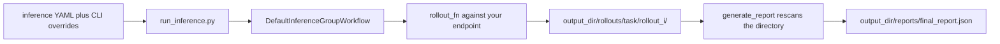

# Evaluate a model endpoint

Point Platoon at any OpenAI-compatible model and get a benchmark number back. No trainer, no weight
sync, no tokenization: run the agent K times per task, then score it. You finish with a
`final_report.json` containing success@k for a model you did not train.

This is the cheapest way to sanity-check a plugin, and the only tutorial here that needs no GPU.

## Before you start

| You need | Why |
| --- | --- |
| The repository and `uv` | See [installation](../get-started/installation.md) |
| An OpenAI-compatible endpoint | A hosted API, a LiteLLM proxy, or your own vLLM / SGLang server |
| A key for that endpoint | Or a dummy value for a keyless local server — [step 2](#step-2-settle-the-api-key) |

No GPU is required *on your machine*. If you host the model yourself that server needs the GPUs; if
you use a hosted endpoint, nothing local does.

The whole path is two decoupled stages, and the second never touches the network:



`rollout_fn`, `get_task_fn` and `reward_processor` are the same callables the AReaL and Tinker
trainers drive. That is the point: if a plugin benchmarks cleanly here, its rollout triple works,
and you did not burn a training run to find out.

## Step 1: pick a plugin that ships an inference config

Six plugins have an `inference_scripts/run_inference.py` and a `configs/inference/` directory.
`codegrep`, `number-search` and `openhands` do not.

| Plugin | Setup beyond `uv sync` |
| --- | --- |
| `textcraft` | **None.** Tasks ship as JSONL next to the package |
| `oolong` | Hugging Face datasets `oolongbench/oolong-synth` and `oolong-real` |
| `deepdive` | `TAVILY_API_KEY` for live web search |
| `email-search` | Build the local SQLite mailbox first |
| `appworld` | `appworld install`, a data download, and `APPWORLD_ROOT` |
| `openreward` | A running OpenReward gym server |

Use TextCraft. Nothing to download, nothing to launch, no third-party key.

```bash
cd plugins/textcraft
uv sync          # no backend extra: the inference path imports neither torch, areal nor tinker
```

!!! warning "Some plugin locks do not resolve on macOS"

    `uv sync` inside `plugins/textcraft`, `plugins/deepdive` or `plugins/email-search` fails today
    on macOS: their lockfiles pin `torch 2.11.0+cu129`, which publishes Linux wheels only, and
    `--extra tinker` does not route around it. `plugins/oolong` and `plugins/number-search` resolve
    fine there, and every plugin resolves on Linux. It is a lockfile artifact, not a requirement of
    the inference path.

## Step 2: settle the API key

Do this before the first run rather than after it fails. What you need depends on the client the
plugin's rollout function builds.

| Plugin | Client | Missing key behavior |
| --- | --- | --- |
| `textcraft` | `LLMClient` (OpenAI SDK) | Raises at construction, before any request |
| every other plugin | `LiteLLMClient` | No validation; the request itself fails |

`LLMClient.__init__` in <span class="pl-src">platoon/utils/llm_client.py</span> falls back to the
environment, and raises when that is empty too:

```python title="platoon/utils/llm_client.py"
self.api_key = api_key or os.getenv("OPENAI_API_KEY")
if not self.api_key:
    raise ValueError(
        "LLM API key is required. Set OPENAI_API_KEY environment variable or pass api_key parameter."
    )

self.base_url = base_url or os.getenv("OPENAI_BASE_URL")
if not self.base_url:
    raise ValueError(
        "LLM base URL is required. Set OPENAI_BASE_URL environment variable or pass base_url parameter."
    )
```

Both TextCraft configs leave `model_api_key: null`, and `textcraft_inference.yaml` also leaves
`model_endpoint: null`. Out of the box TextCraft therefore needs **both** variables:

```bash
export OPENAI_API_KEY=sk-...              # a keyless local server accepts any non-empty string
export OPENAI_BASE_URL=http://127.0.0.1:30000/v1
```

Values in the YAML take precedence and skip the fallback entirely. Prefer the environment variable
anyway — the YAML is committed, your key is not.

!!! warning "No retries, anywhere on this path"

    Neither client retries. `LiteLLMClient` sets `num_retries=0` on purpose, so a stuck request
    cannot hold a rollout slot; `LLMClient` carries a standing `# TODO: Add retry logic` instead.
    One 429 fails that rollout for good. Against a rate-limited hosted API, lower
    `num_concurrent_workers`, or set `PLATOON_LITELLM_MAX_INFLIGHT` to cap in-flight litellm calls
    process-wide.

## Step 3: point the config at your endpoint

Three keys decide where requests go. `model_name` is passed through untouched, so its form follows
the client from step 2: `LLMClient` wants the endpoint's own model id, `LiteLLMClient` wants a
litellm model id whose prefix selects the provider.

=== "Hosted API"

    ```yaml
    inference:
      model_name: Qwen/Qwen3-4B-Instruct-2507   # LLMClient: no provider prefix
      model_endpoint: https://your-provider.example/v1
      model_api_key: null                       # read from OPENAI_API_KEY
    ```

    A `LiteLLMClient` plugin writes the same endpoint as `openai/<served-model-name>`, and a LiteLLM
    proxy as `litellm_proxy/<upstream-model>`. Both shapes ship in the repository:
    <span class="pl-src">plugins/deepdive/platoon/deepdive/configs/inference/deepdive_inference.yaml</span>
    uses the first, and
    <span class="pl-src">plugins/appworld/platoon/appworld/configs/inference/appworld_inference.yaml</span>
    the second, with `model_endpoint: https://cmu.litellm.ai`.

=== "Local SGLang"

    This is the launch command recorded as a comment beside `model_endpoint` in
    <span class="pl-src">plugins/oolong/platoon/oolong/configs/inference/oolong_inference.yaml</span>
    — the one place in the repository that writes it down:

    ```bash
    uv run --extra areal -m sglang.launch_server \
      --model-path Qwen/Qwen3-4B-Instruct-2507 --dp 8 --context-length 70000
    # serves http://127.0.0.1:30000/v1
    ```

    `--dp 8` asks for eight GPUs; scale it to what you have.

    ```yaml
    inference:
      model_name: Qwen/Qwen3-4B-Instruct-2507
      model_endpoint: http://127.0.0.1:30000/v1
      model_api_key: null                       # any non-empty OPENAI_API_KEY will do
    ```

=== "Local vLLM"

    Identical wiring — an OpenAI-compatible server is an OpenAI-compatible server. Start vLLM
    however you normally do and hand the config its `/v1` URL:

    ```yaml
    inference:
      model_name: Qwen/Qwen3-4B-Instruct-2507
      model_endpoint: http://127.0.0.1:8000/v1
      model_api_key: null
    ```

    No vLLM launch command exists anywhere in this repository, so take that one from vLLM's docs.

!!! warning "TextCraft always sends `chat_template_kwargs`"

    `run_rollout` in <span class="pl-src">plugins/textcraft/platoon/textcraft/rollout.py</span>
    builds its client with
    `default_extra_body={"chat_template_kwargs": {"enable_thinking": False}}` to suppress Qwen3
    thinking mode, and the async path merges that into every request body. vLLM and SGLang accept
    it. A hosted API that rejects unknown body fields will fail every call — if yours does,
    benchmark a `LiteLLMClient` plugin instead, since none of them set an extra body.

### The keys worth touching

| Key | Type | Default | What it does |
| --- | --- | --- | --- |
| `inference.model_name` | `str` | **required** | Omitting it is a bare `TypeError`, not a friendly message |
| `inference.model_endpoint` | `str \| None` | `None` | Base URL; `None` defers to the client |
| `inference.model_api_key` | `str \| None` | `None` | `None` defers to `OPENAI_API_KEY` |
| `inference.output_dir` | `str` | `inference_results` | Root of `rollouts/` and `reports/` |
| `inference.resume` | `bool` | `true` | Skip any rollout that already has a `metadata.json` |
| `inference.workflow.num_rollouts_per_task` | `int` | `1` | The K in success@k |
| `inference.workflow.num_concurrent_workers` | `int` | `32` | One semaphore across every task-rollout pair |
| `inference.workflow.rollout_config.max_steps` | `int \| None` | `None` | Overrides `task.max_steps` |
| `inference.workflow.rollout_config.timeout` | `int \| None` | `None` | Whole-rollout deadline, seconds |
| `inference.workflow.rollout_config.step_timeout` | `int` | `300` | Deadline per `agent.act` and per `env.step` |
| `inference.workflow.rollout_config.inference_params.max_completion_tokens` | `int` | `512` | Raise it for agents that write code |

Plugin-level keys sit beside `inference:`, not inside it: `num_tasks`, `dataset_split`, `task_id`,
`stage`, `shuffle_tasks`, `seed`, `use_recursive_agent`. The rest of the surface is in the
[configuration reference](../reference/configuration.md).

!!! note "`rollout_config.output_dir` in the YAML is dead config"

    Every shipped config sets it, and `_get_rollout_config` in
    <span class="pl-src">platoon/inference/workflow.py</span> overwrites it with the per-rollout
    directory. Event JSONL lands under `<output_dir>/rollouts/<task>/rollout_<i>/events/` no matter
    what the YAML says.

## Step 4: run it

```bash
cd plugins/textcraft
uv run python -m platoon.textcraft.inference_scripts.run_inference \
  --config platoon/textcraft/configs/inference/textcraft_inference.yaml \
  --num_tasks 5
```

Start with five tasks. The shipped config asks for 100, and you want the first failure to arrive in
a minute rather than an hour.

!!! danger "`--config` is not optional for TextCraft"

    The TextCraft script derives its default config path from `Path(__file__).parent`, but it lives
    in `inference_scripts/` while the configs live one level up in `configs/inference/`. Run it bare
    and you get `FileNotFoundError`. DeepDive, Email-search, Oolong and the TextCraft synth script
    use `.parent.parent` and work without the flag.

Overrides go through `load_config` in <span class="pl-src">platoon/utils/config.py</span>:
`--dotted.key value` or `--dotted.key=value`, dashes included.

```bash
uv run python -m platoon.textcraft.inference_scripts.run_inference \
  --config platoon/textcraft/configs/inference/textcraft_inference.yaml \
  --inference.model_endpoint http://127.0.0.1:30000/v1 \
  --inference.output_dir ./inference_results/qwen3-4b \
  --inference.workflow.num_rollouts_per_task 4 \
  --num_tasks 20
```

!!! warning "Bare `key=value` belongs to the other loader"

    AReaL training configs go through OmegaConf and take `key=value` with no dashes. Inference and
    Tinker take `--dotted.key value`. Mixing them fails quietly: an argument without `--` is
    skipped, and an unknown dotted key is dropped by `_dataclass_from_dict` without complaint. When
    an override seems to have been ignored, that is usually why.

    Two parsing quirks to know: `_parse_value` checks boolean words before integers, so `1` and `0`
    arrive as `true` and `false`; and any value containing a comma is split into a list.

## Step 5: read what it wrote

The script prints `result["summary"]` and leaves this behind:

```text
inference_results/qwen3-4b/
├── rollouts/
│   └── textcraft.val.7/
│       ├── rollout_0/
│       │   ├── trajectory_collection.json
│       │   ├── metadata.json
│       │   └── events/
│       │       └── events_<task.id>_<collection-uuid>.jsonl
│       └── rollout_1/
└── reports/
    ├── task_results.jsonl
    └── final_report.json
```

Task ids become directory names with every character that is not alphanumeric, `-`, `_` or `.`
replaced by `_`. `metadata.json` is the resume marker, and stays deliberately tiny:

```json title="rollouts/textcraft.val.7/rollout_0/metadata.json"
{
  "task_id": "textcraft.val.7",
  "rollout_index": 0,
  "source_path": "./inference_results/qwen3-4b/rollouts/textcraft.val.7/rollout_0/trajectory_collection.json",
  "wall_time_seconds": 41.7,
  "error": null,
  "created_at": "2026-09-03T18:22:04.913551+00:00",
  "status": "completed"
}
```

The printed summary is the finish line:

```json
{
  "total_tasks": 20,
  "total_rollouts": 80,
  "valid_rollouts": 78,
  "successful_rollouts": 39,
  "failed_rollouts": 39,
  "errored_rollouts": 2,
  "success_rate": 0.5,
  "success_at_k": 0.75,
  "reward_mean": 0.5,
  "reward_max": 1.0,
  "reward_min": 0.0,
  "reward_at_k_mean": 0.5,
  "reward_at_k_max": 0.75,
  "reward_at_k_min": 0.25,
  "elapsed_seconds": 1284.6031
}
```

The two headline numbers answer different questions:

- **`success_rate`** is averaged over *rollouts* — successful over valid. How often one attempt
  works.
- **`success_at_k`** is averaged over *tasks*, taking the max across each task's K rollouts. What
  fraction of tasks the model solves at least once in K tries.

`failed_rollouts` means *ran fine, scored unsuccessful*; `errored_rollouts` means *threw*. Errored
rollouts are excluded from every statistic and reward aggregation. Watch the naming collision in the
per-task objects: their `num_failed_rollouts` counts *errored* rollouts, the opposite sense of the
summary's `failed_rollouts`.

`reward_at_k_max` is the mean over tasks of each task's max, not a global maximum. The global
extremes are `reward_max` and `reward_min`.

### One result record

`reports/task_results.jsonl` has one line per task, and each line carries every rollout record for
that task. Here is a single record with the embedded trajectory tree elided:

```json
{
  "task_id": "textcraft.val.7",
  "rollout_index": 2,
  "success": true,
  "reward": 1.0,
  "reward_components": {
    "reward/success": 1.0,
    "reward/subagent_launched": 2.0,
    "reward/subagent_succeeded": 2.0
  },
  "num_steps_total": 34,
  "num_steps_root": 12,
  "num_steps_subtrajectories": 22,
  "num_subtrajectories": 2,
  "subtrajectory_depth_counts": {"1": 2},
  "subtrajectory_depth_steps": {"1": 22},
  "wall_time_seconds": 41.7,
  "workflow_metrics": {},
  "source_path": "./inference_results/qwen3-4b/rollouts/textcraft.val.7/rollout_2/trajectory_collection.json",
  "error": null,
  "trajectory_collection": {"id": "...", "trajectories": {"...": "..."}}
}
```

The depth maps are where delegation shows up: this rollout launched two subagents at depth 1, and
they took 22 of the 34 steps. `reward_components` comes from the plugin's `reward_processor` —
TextCraft sums every `reward/*` key on the root trajectory's steps, then scores on `reward/success`
alone, because its delegation bonus cap is `0.0`.

Quick answers come from `jq`, not from reloading the report:

```bash
jq .summary inference_results/qwen3-4b/reports/final_report.json
jq -c '{task_id, success_at_k, reward_at_k_mean}' \
  inference_results/qwen3-4b/reports/task_results.jsonl
```

!!! warning "`final_report.json` embeds every trajectory tree — twice"

    Both report files serialize the full `trajectory_collection` of every rollout, and
    `final_report.json` also contains everything in `task_results.jsonl`. For long agentic runs the
    report is bigger than the rollout corpus it summarizes. Stream `task_results.jsonl` instead of
    loading `final_report.json` out of habit.

## Rerunning without redoing the work

The stages split at `stage:`. Collect once, score as often as you like:

```bash
# collect only — resumable, safe to interrupt
uv run python -m platoon.textcraft.inference_scripts.run_inference \
  --config platoon/textcraft/configs/inference/textcraft_inference.yaml --stage rollouts

# rebuild the report from disk; no endpoint involved
uv run python -m platoon.textcraft.inference_scripts.run_inference \
  --config platoon/textcraft/configs/inference/textcraft_inference.yaml --stage report
```

`stage: report` passes an empty dataset, so nothing is dispatched. This is the one part of the
tutorial you can run with no endpoint and no credentials at all, and it is worth running once to see
that the report is purely a function of the directory.

Three consequences of that design, in roughly the order they bite:

1. **Errored rollouts are sticky.** `metadata.json` is written with `"status": "completed"` even
   when the record carries an error, and resume only checks that the file exists. To retry one
   failure, delete its `rollout_<i>/` directory.
2. **The report scans the directory, not the dataset.** Rollouts left from an earlier run with a
   different task list, a different K or a different model are folded straight into the new report.
   Use a fresh `output_dir` per experiment; every shipped config does.
3. **A step timeout is a failure, not an error.** `run_episode` catches it, tags the trajectory and
   returns normally, so the rollout counts as valid and unsuccessful. Only the trajectory-level
   `rollout_config.timeout` surfaces as `error`. When a success rate looks plausible but low, grep
   the trajectories for `trajectory_timed_out` before blaming the model.

## Compare two models

There is no built-in A/B command. Run twice into separate directories, changing only the model:

```bash
uv run python -m platoon.textcraft.inference_scripts.run_inference \
  --config platoon/textcraft/configs/inference/textcraft_inference.yaml \
  --inference.model_name Qwen/Qwen3-4B-Instruct-2507 \
  --inference.output_dir ./inference_results/qwen3-4b --num_tasks 20

uv run python -m platoon.textcraft.inference_scripts.run_inference \
  --config platoon/textcraft/configs/inference/textcraft_inference.yaml \
  --inference.model_name OpenPipe/Qwen3-14B-Instruct \
  --inference.output_dir ./inference_results/qwen3-14b --num_tasks 20

for run in qwen3-4b qwen3-14b; do
  echo "$run $(jq -c '.summary | {success_rate, success_at_k, reward_mean}' \
    "inference_results/$run/reports/final_report.json")"
done
```

Hold `num_tasks`, `dataset_split`, `seed` and `shuffle_tasks` identical across the two runs, or you
are comparing task sets rather than models. Both model ids above are ones the repository's own
configs name; substitute whatever your endpoint actually serves.

TextCraft-Synth ships a real multi-run comparison tool. It reads several run directories at once and
prints tables stratified by task difficulty, with step counts, wall time and token usage:

```bash
uv run python -m platoon.textcraft.inference_scripts.analyze_synth_results_by_difficulty \
  ./inference_results/qwen3-4b ./inference_results/qwen3-14b --json-out /tmp/cmp.json
```

It expects synth runs — the ones produced by `run_synth_inference.py` with
`textcraft_synth_inference.yaml`.

## Next

- [Inspect rollouts in the TUI](visualization.md) — replay the `events/*.jsonl` files this run wrote
  and find the step where a reward went wrong.
- [Train on TextCraft](textcraft.md) — the same rollout function, now with a trainer behind it.
- [Custom rollout functions](../customization/rollout.md) — what a plugin must supply to be
  benchmarkable at all.
- [Configuration reference](../reference/configuration.md) — every key, not only the ones you had to
  touch.
- [Troubleshooting](../reference/troubleshooting.md) — for when the first run does not come back.
