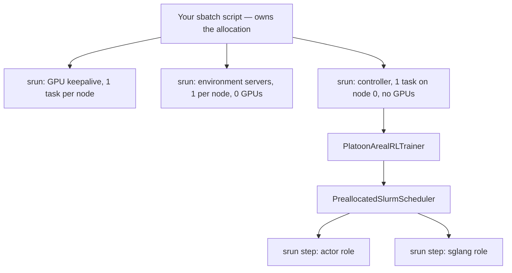

# Scale to multiple nodes

You have an AReaL config that trains on one node. This tutorial takes it to a Slurm allocation of
many nodes without you having to discover the failure modes one four-hour job at a time.

By the end you will know exactly which config keys change, how to write an sbatch script that
launches the trainer and its workers correctly, and what keeps a run alive across a wall-time limit
that is shorter than the run.

## Before you start

<span class="pl-tag pl-tag--areal">AReaL</span> Multi-node is an AReaL-only path. Tinker trains on
a remote service and has no notion of your cluster; see
[choosing a backend](../get-started/backends.md).

You need:

- A Slurm cluster where you can hold an allocation of whole nodes with GPUs.
- A filesystem visible on every node, writable by you, for checkpoints and worker discovery.
- A Platoon environment reachable from every node — a venv on that shared filesystem, or a
  container image plus Pyxis/Enroot.
- A working single-node run. Debug your task, reward and rollout on one node first. A multi-node
  job is a bad place to discover that your environment server drops sessions.

**No cluster?** Steps 1 through 3 are config work you can do and validate locally — the config
loader will reject an inconsistent parallelism spec on your laptop just as happily as on a login
node. Step 4 onward needs Slurm. Where a step cannot be run without one, it says so.

!!! warning "This is expensive to get wrong"
    A 16-node job is 128 GPUs. A config error that surfaces after 20 minutes of worker startup has
    already burned 40 GPU-hours. The [pre-flight checklist](#pre-flight-checklist) at the end of
    this page exists because every item on it has cost someone a job.

## What you are building



One sbatch job. Inside it, several overlapping `srun` steps that you start, plus the actor and
inference worker steps that the trainer starts for you.

## Step 1: change the config

Here is the entire meaningful difference between the committed single-node OpenReward config and
its two-node sibling, both under
<span class="pl-src">plugins/openreward/platoon/openreward/configs/areal/</span>:

```yaml title="toolathlon_openhands_areal_prealloc_2node.yaml"
# Run AReaL workers as srun steps inside this (preallocated) sbatch allocation.
scheduler:
  type: slurm_prealloc

cluster:
  n_nodes: 2
  n_gpus_per_node: 8
  fileroot: /lustre/.../experiments/areal/experiments
  name_resolve:
    type: nfs
    nfs_record_root: /lustre/.../experiments/areal/name_resolve

rollout:
  # 16 GPUs total, split 50/50: 8 GPUs of sglang inference (1 node).
  backend: sglang:d8p1t1

actor:
  # 8 GPUs of training (1 node): DP4 x context-parallel 2.
  backend: fsdp:d4p1t1c2
```

The single-node file has no `scheduler:` block at all, `n_nodes: 1`, paths under `/mnt/efs/tmp`,
`sglang:d4p1t1` and `fsdp:d4p1t1c1`. That is the whole change. Four things move:

| What | Why it changes |
|---|---|
| `scheduler.type: slurm_prealloc` | Selects `PreallocatedSlurmScheduler` instead of AReaL's local scheduler. |
| `cluster.n_nodes` | Must match the allocation. The launcher overrides it on the CLI anyway. |
| `cluster.fileroot`, `cluster.name_resolve.nfs_record_root` | Must be on a filesystem every node can see. |
| `rollout.backend`, `actor.backend` | The parallelism has to add up to the GPUs you allocated. |

Everything else — the loss, the workflow, the dataset, the reward — is unchanged. Scaling out is
not a rewrite.

!!! note "Two different `environments:` keys"
    If your plugin config has a nested `environments:` list under its own section with `label`,
    `env_name`, `session_url` and `sampling_weight` fields, that is OpenReward's environment
    *mixture*, not the top-level registry `environments:` list of `EnvironmentConfig`. Neither one
    has anything to do with node count. See [OpenReward](../integrations/openreward.md).

## Step 2: make the GPU arithmetic work

Both backend strings declare a placement, and the two placements must fit the allocation with
nothing left stranded. An allocation's world size is `d * t * p * c`. The
[backend string grammar](../architecture/areal.md) is documented in full on the AReaL internals
page; what matters here is the accounting.

Real configs, all with `n_gpus_per_node: 8`:

| Nodes | GPUs | `rollout.backend` | `actor.backend` | Split |
|---|---|---|---|---|
| 2 | 16 | `sglang:d8p1t1` | `fsdp:d4p1t1c2` | 8 + 8 |
| 8 | 64 | `sglang:d3p1t8` | `megatron:(attn:d1p20t2c1\|ffn:d1p20t1e2)` | 24 + 40 |
| 16 | 128 | `sglang:d6p1t8` | `megatron:(attn:d5p2t4c2\|ffn:d5p2t1e8)` | 48 + 80 |
| 32 | 256 | `sglang:d12p1t8` | `megatron:(attn:d10p2t4c2\|ffn:d10p2t1e8)` | 96 + 160 |

Two constraints the scheduler enforces that the single-node path does not:

- **Whole nodes only.** `_build_role_srun_command` in
  <span class="pl-src">platoon/train/areal/preallocated_slurm.py</span> raises when a role's total
  GPU count is not a multiple of `n_gpus_per_node`. A role that wants 12 GPUs on 8-GPU nodes is a
  hard error, not a warning.
- **Quote the hybrid Megatron form in YAML.** `megatron:(attn:...|ffn:...)` is a bare scalar with
  parentheses and a pipe in it.

Switching from `fsdp` to `megatron` is not just a string change: the Megatron backend needs
Transformer Engine and APEX, which are not in the lock file and must be source-built. See
[installation](../get-started/installation.md).

## Step 3: shared filesystem and name resolution

This is where multi-node runs hang instead of failing.

`cluster.name_resolve` is how workers find each other. With `type: nfs`, every worker writes its
address under `nfs_record_root` and reads its peers' addresses from the same place. Point that at a
node-local path and each node builds a private, consistent-looking view of a cluster with one
member. Nothing errors. Startup just never completes.

The same applies to `cluster.fileroot` (checkpoints, logs, recovery state) and to the Python
environment itself. One cheap check, run from two different allocated nodes:

```bash
touch /shared/path/probe.$(hostname) && ls /shared/path/probe.*
```

If node B cannot see node A's file, you do not have a shared filesystem for this purpose.

Two more things that bite specifically at scale:

- **Hugging Face metadata storms.** When every SGLang rank starts at once and each resolves a model
  ID against the Hub, the cluster gets rate-limited. The production launcher exports
  `HF_HUB_OFFLINE=1` and `TRANSFORMERS_OFFLINE=1` into every worker and resolves the model to a
  local snapshot directory first.
- **Hostname reachability.** Environment servers run host-networked, so the controller reaches them
  as `http://<node>:<port>`. Node names must resolve from inside whatever containers you use.

## Step 4: read a real launcher

<span class="pl-src">slurm-scripts/openreward-toolathlon-prealloc-base.sh</span> is the production
launcher: 16 nodes by default, and roughly 1,250 lines. Do not copy it wholesale. Read it as a list
of problems that multi-node runs have, and decide which ones you also have.

### The SBATCH header

```bash
#SBATCH --job-name=openreward-toolathlon-prealloc
#SBATCH --account=nvr_lacr_llm
#SBATCH --partition=batch
#SBATCH --nodes=16
#SBATCH --gpus-per-node=8
#SBATCH --exclusive
#SBATCH --time=4:00:00
#SBATCH --signal=B:USR1@300
```

`--account` and `--partition` are this cluster's; yours differ. `--exclusive` matters — the
overlapping steps in this design assume nothing else is on the node. `--signal=B:USR1@300` is the
load-bearing one: it delivers `SIGUSR1` to the *batch shell* 300 seconds before the time limit,
which is what triggers submission of a successor job.

### Locating the checkout

Slurm executes a **copy** of your script from its spool directory, so `BASH_SOURCE` is not inside
your checkout. The script prefers `PLATOON_REPO_ROOT`, then `SLURM_SUBMIT_DIR`, then a
script-relative fallback, and validates the candidate before using it. Any launcher that resubmits
itself needs this, because a continuation must submit the tracked script from the checkout and not
the spool copy.

### Slurm CLI bootstrap

`bootstrap_slurm_cli` probes for a directory containing all three of `srun`, `scontrol` and
`sbatch`, exports it into `PATH`, and sets `SLURM_EXPORT_ENV=ALL`. This exists because
`sbatch --export=NONE` gives the batch shell a minimal environment, and on BCM clusters the Slurm
binaries are not on the default `PATH`. Cluster-specific; `PLATOON_SLURM_BIN_DIR` overrides the
probe.

### Deadline resolution

```bash
resolve_slurm_deadline_epoch() {
  local job_record end_time
  [[ -n "${SLURM_JOB_ID:-}" ]] || return 1
  job_record=$(scontrol show job "${SLURM_JOB_ID}" -o 2>/dev/null) || return 1
  ...
  date --date="${end_time}" +%s
}
```

The script asks Slurm when this allocation ends and exports that as
`PLATOON_TRAINING_DEADLINE_EPOCH`, alongside `PLATOON_TRAINING_DRAIN_FILE` and the four tuning
variables. A continuation explicitly unsets its predecessor's deadline first — inheriting a stale
absolute epoch through `--export=ALL` would make the successor drain immediately.

### The immutable environment

Before any worker command is built, the script calls
<span class="pl-src">slurm-scripts/prepare_openreward_env.sh</span> in `resolve` mode. That tars the
local package sources with normalized metadata, hashes them into a cache key, and prints
`ENV_KEY SOURCE_SHA SOURCE_ARCHIVE FINAL_ENV`. On a cache miss, one `build` step runs inside the
CUDA container under `flock` and atomically publishes a relocatable venv; on a hit, the whole
container step is skipped.

The reasoning is worth borrowing even if the implementation is not. Dirty working-tree edits change
the key, so two jobs never silently share an environment built from different code. After
publication the venv's `bin/` and `site-packages` are made read-only and a `pip` shim on `PATH`
refuses installs, so a rollout cannot mutate the runtime out from under 128 workers mid-run.

!!! warning "This part does not run on a fresh clone"
    `resolve` tars a fixed list of inputs that includes `slurm-scripts/install_te.sh` and
    `slurm-scripts/install_apex.sh`. Neither file is tracked in git, so `tar` fails before the
    cache key is computed. The whole `slurm-scripts/` tree is force-tracked out of a gitignore and
    written for one cluster; treat it as a reference implementation, not a supported entrypoint.

### GPU keepalive

One overlapping `srun` task per node runs
<span class="pl-src">slurm-scripts/gpu_keepalive.py</span> with every GPU visible. It allocates two
bf16 matrices per device and runs a burst of matmuls on a timer.

The point is not the arithmetic; it is being visible to a utilization sampler. Clusters reclaim
allocations whose GPUs look idle, and these jobs spend their first stretch building environments and
starting agent containers with the GPUs untouched.

Two details make it a safety device rather than a decoration. The first burst must succeed or the
task exits nonzero, so the launcher never proceeds believing protection is active when it is not.
And each task publishes `<SLURM_PROCID>.ready` into `KEEPALIVE_READY_DIR` by atomic rename;
`wait_for_gpu_keepalive` blocks until every node's marker exists, then a monitor kills the launcher
if the keepalive step later dies.

| Variable | Default | What it does |
|---|---|---|
| `KEEPALIVE_TICK_SEC` | `5` | Seconds between bursts. |
| `KEEPALIVE_MATMUL_DIM` | `4096` | Square matrix dimension. |
| `KEEPALIVE_MATMUL_REPS` | `2000` | Matmuls per burst per device. |
| `KEEPALIVE_MAX_SEC` | `16200` | Total runtime before a clean exit. |
| `KEEPALIVE_START_DELAY_SEC` | `300` | Delay before importing torch. The launcher sets `0`. |
| `KEEPALIVE_EXPECTED_GPUS` | `0` — no check | Exit if the visible device count differs. |
| `KEEPALIVE_MAX_CONSECUTIVE_ERRORS` | `3` | Consecutive burst failures before giving up. |
| `KEEPALIVE_READY_DIR` | unset | Where to publish readiness markers. |

Tune it down if your cluster does not reclaim idle GPUs. Do not skip the readiness handshake if you
keep it at all.

### Environment servers and health monitors

The environment servers are a plugin concern, but the *shape* generalizes. One overlapping `srun`
step per node, `--gpus-per-node=0`, host-networked, and the controller reaches each as
`http://<node>:<port>`. Because a rollout is one session pinned to one server, sharding by hostname
needs no load balancer.

Two monitors then run for the life of the job:

- **Endpoint health.** Every 20 seconds, probe each node. Three consecutive failures kill the
  trainer. A dead server used to leave the trainer alive indefinitely, rejecting zero-data rollouts
  while every GPU stayed allocated. The probe deliberately accepts any 1xx–4xx status as healthy —
  the service has no root route, so a proxied 404 means alive, while 502/503/504 means the upstream
  workers are gone. A raw TCP connect cannot tell those apart.
- **Runtime health.** A small `python -I` probe asserts that `areal`, `megatron`, `openhands`,
  `platoon`, `ray`, `sglang`, `torch` and `transformers` all import from inside the published venv,
  and that `pip` is absent. Two consecutive failures kill the trainer.

Both write a marker file, so the exit-status handling below can tell an infrastructure failure from
a training failure.

### Wiring the scheduler

```bash
export PLATOON_AREAL_PREALLOC_CONTAINER_IMAGE="${CONTAINER_IMAGE}"
export PLATOON_AREAL_PREALLOC_CONTAINER_MOUNTS=/lustre:/lustre,/tmp:/tmp
export PLATOON_AREAL_PREALLOC_CONTAINER_WORKDIR="${OPENREWARD_JOB_STATE_DIR}"
export PLATOON_AREAL_PREALLOC_SRUN_BIN=${PLATOON_AREAL_PREALLOC_SRUN_BIN:-$(command -v srun || echo srun)}
export PLATOON_AREAL_PREALLOC_SRUN_ARGS=${PLATOON_AREAL_PREALLOC_SRUN_ARGS:-"--unbuffered --mpi=pmi2 -K --overlap"}
export PLATOON_AREAL_PREALLOC_GPU_FLAG=${PLATOON_AREAL_PREALLOC_GPU_FLAG:-"--gpus-per-node={gpus}"}
export PLATOON_AREAL_PREALLOC_CONFIGURE_CONCURRENCY=${PLATOON_AREAL_PREALLOC_CONFIGURE_CONCURRENCY:-16}
export PLATOON_AREAL_PREALLOC_WORKER_PREAMBLE="..."
```

This is the portable part. `PreallocatedSlurmScheduler` reads these from the environment — there is
no config schema for them. `PLATOON_AREAL_PREALLOC_USE_PYXIS=0` drops every container argument for a
bare-metal cluster. The worker preamble is bash prepended to every worker command: it is where you
put `PATH`, offline flags, `LD_LIBRARY_PATH`, and anything else each rank needs before the RPC
server starts.

Because the base srun args contain `--overlap`, `--exclusive` is dropped from worker steps
automatically. `PLATOON_AREAL_PREALLOC_WORKER_EXCLUSIVE` forces it either way.

### The controller step

```bash
srun \
  --overlap \
  --unbuffered \
  --nodes=1 \
  --ntasks=1 \
  --nodelist="${CONTROLLER_NODE}" \
  --cpus-per-task=${OPENREWARD_CONTROLLER_CPUS:-8} \
  --mem=${OPENREWARD_CONTROLLER_MEM:-64G} \
  /bin/bash -c "
    ...
    export CUDA_VISIBLE_DEVICES=
    ...
    ${OPENREWARD_JOB_PYTHON} -m ${TRAIN_MODULE} --config ${CONFIG} \
      cluster.n_nodes=${NNODES} \
      openreward.session_url=http://localhost:${OPENREWARD_PORT}${TRAIN_OVERRIDE_CMD}
  " &
```

Three things here are not optional.

**The controller step has no container arguments.** It spawns nested `srun` steps, and it cannot do
that from inside a Pyxis container. Everything else in this job is containerized; this one step is
not.

**`CUDA_VISIBLE_DEVICES` is empty.** The controller does no GPU work, and hiding devices skips
optional GPU probing at import. Worker steps get their own visibility from the scheduler.

**Overrides are bare `key=value`.** The AReaL path loads through `load_expr_config`, so it is
`cluster.n_nodes=16`, never `--cluster.n_nodes 16`. The dashed form belongs to the Tinker and
inference loaders. `--config` itself is the one flag that does take a dash.

Note that `cluster.n_nodes` is overridden from the allocation at launch, so the value in the YAML is
a default the allocation is allowed to contradict.

### Exit status and successors

```bash
restart_reason=
successor_infrastructure_restart=1
if [[ -f "${PLATOON_TRAINING_DRAIN_FILE}" && "${status}" -eq 0 ]]; then
  restart_reason="step-boundary deadline drain"
  successor_infrastructure_restart=0
  ...
elif [[ -f "${SERVER_HEALTH_FAILURE_FILE}" || -f "${ENVIRONMENT_HEALTH_FAILURE_FILE}" ]]; then
  status=1
  restart_reason="environment service/runtime health failure"
elif [[ "${status}" -eq 1 ]]; then
  restart_reason="trainer/controller runtime failure (exit 1)"
fi
```

A clean drain is a *planned* continuation and does not consume the restart budget. A health failure
or an exit-1 trainer failure is an *unplanned* one and does. Any other nonzero status is terminal —
if your code raised, the chain stops rather than replaying the failure across allocations.

## Step 5: a minimal launcher of your own

The production script solves problems you may not have. Here is a much smaller one that uses only
verified interfaces. **It is not in the repository** — adapt the paths.

```bash
#!/bin/bash
#SBATCH --job-name=platoon-textcraft-2node
#SBATCH --nodes=2
#SBATCH --gpus-per-node=8
#SBATCH --exclusive
#SBATCH --time=4:00:00
#SBATCH --signal=B:USR1@300

set -euo pipefail

REPO_ROOT=${PLATOON_REPO_ROOT:-${SLURM_SUBMIT_DIR}}
VENV=${REPO_ROOT}/plugins/textcraft/.venv
TRAIN=${REPO_ROOT}/plugins/textcraft/platoon/textcraft/train_scripts/areal/train_areal_synth.py
CONFIG=${REPO_ROOT}/plugins/textcraft/platoon/textcraft/configs/areal/nv_textcraft_synth_ctx40000_linear_medium_areal_prealloc_2node.yaml

# How PreallocatedSlurmScheduler spawns each AReaL worker role.
export PLATOON_AREAL_PREALLOC_SRUN_BIN=$(command -v srun)
export PLATOON_AREAL_PREALLOC_SRUN_ARGS="--unbuffered --mpi=pmi2 -K --overlap"
export PLATOON_AREAL_PREALLOC_GPU_FLAG="--gpus-per-node={gpus}"
export PLATOON_AREAL_PREALLOC_USE_PYXIS=0
export PLATOON_AREAL_PREALLOC_WORKER_PREAMBLE="
  set -euo pipefail
  export PATH=${VENV}/bin:\${PATH}
  export HF_HUB_OFFLINE=1
  export TRANSFORMERS_OFFLINE=1
  unset VIRTUAL_ENV UV_PROJECT_ENVIRONMENT
  hash -r
"

# Stop at a step boundary instead of being killed mid-update.
PLATOON_TRAINING_DEADLINE_EPOCH=$(
  date --date="$(scontrol show job "${SLURM_JOB_ID}" -o | sed 's/.*EndTime=//; s/ .*//')" +%s
)
export PLATOON_TRAINING_DEADLINE_EPOCH
export PLATOON_TRAINING_DRAIN_FILE=/shared/platoon/jobs/${SLURM_JOB_ID}/drain.json
mkdir -p "$(dirname "${PLATOON_TRAINING_DRAIN_FILE}")"

CONTROLLER=$(scontrol show hostnames "${SLURM_JOB_NODELIST}" | head -n1)
srun --overlap --unbuffered --nodes=1 --ntasks=1 --nodelist="${CONTROLLER}" \
  --cpus-per-task=8 --mem=64G \
  /bin/bash -c "
    export PATH=${VENV}/bin:\${PATH}
    export CUDA_VISIBLE_DEVICES=
    ${VENV}/bin/python ${TRAIN} --config ${CONFIG} \
      cluster.n_nodes=${SLURM_NNODES} \
      cluster.fileroot=/shared/platoon/experiments \
      cluster.name_resolve.nfs_record_root=/shared/platoon/name_resolve \
      stats_logger.wandb.mode=disabled
  "
```

Submit it from the checkout so `SLURM_SUBMIT_DIR` resolves:

```bash
sbatch slurm-scripts/my-textcraft-2node.sh
```

Start at two nodes. Confirm the worker steps land on different hosts — `squeue -s -j <jobid>` lists
the steps — confirm a checkpoint appears under `cluster.fileroot`, and only then scale.

## Why preallocated, and not plain sbatch

AReaL's upstream `SlurmScheduler` writes a child sbatch script for each worker role and submits it.
Each role becomes an independent job in the queue.

That is the wrong shape for agentic RL. The trainer, the inference engines and the environment
servers all have to be alive at once, and a partially scheduled set of jobs is useless — you either
hold everything or you are burning queue priority holding nothing. It also puts account, partition
and time limit inside a scheduler you do not own, and it makes "start a successor before this
allocation dies" impossible to express.

`PreallocatedSlurmScheduler` inverts it. You `sbatch` one allocation. The scheduler keeps AReaL's
RPC and name-resolve worker model unchanged but launches each role with `srun` directly, as a step
inside the allocation you already hold. You keep the job; AReaL keeps the worker topology.

Three behaviors of that scheduler will save you debugging time later, all covered in detail in
[AReaL backend internals](../architecture/areal.md):

- **Node spreading.** AReaL leaves `nodelist` unset, so every single-node `--overlap` step lands on
  the first node — actor and SGLang stacked on the same eight GPUs while 15 nodes idle. The
  scheduler round-robins separated roles across allocation nodes instead.
  `PLATOON_AREAL_PREALLOC_SPREAD_NODES=0` turns it off.
- **Concurrent worker configuration.** Each Megatron `/configure` does full model setup. Serially,
  that is tens of minutes on a large job. Different hosts are configured concurrently, one stream
  per host, capped by `PLATOON_AREAL_PREALLOC_CONFIGURE_CONCURRENCY` (default 16).
- **At-most-once collective RPCs.** A retried broadcast can enqueue a second invocation while peers
  are still inside the first collective, deadlocking the process group permanently. Collective calls
  get exactly one attempt and a 7200-second timeout, and a failure fails the trainer so the launcher
  can recover from a checkpoint.

## Keeping a long run alive

Your run is longer than your time limit. Four mechanisms cooperate.

### Drain at a step boundary

`StepDeadlineGuard` (<span class="pl-src">platoon/train/areal/deadline.py</span>) is constructed
from the environment at the top of `train()` and is `None` unless `PLATOON_TRAINING_DEADLINE_EPOCH`
is set. Before each step it compares the time remaining against
`max(initial_step_seconds, max(recent_durations) * multiplier) + safety_seconds`. If a full step
does not fit, it pauses rollout, forces a recovery checkpoint for the last *completed* step, writes
a JSON drain marker, and exits cleanly.

Set two variables and you have it:

```bash
export PLATOON_TRAINING_DEADLINE_EPOCH=<unix epoch of allocation end>
export PLATOON_TRAINING_DRAIN_FILE=<path on the shared filesystem>
```

Tuning, if the defaults do not fit your step time: `PLATOON_DEADLINE_INITIAL_STEP_SECONDS` (1800) is
a permanent *floor*, not a starting guess; `PLATOON_DEADLINE_SAFETY_SECONDS` (300) is shutdown
headroom; `PLATOON_DEADLINE_HISTORY_SIZE` (8) and `PLATOON_DEADLINE_HISTORY_MULTIPLIER` (1.15)
control the recent-duration window. The 32-node wrappers raise safety to 600.

If your steps are long and variable, raise the floor rather than trusting history. The estimate uses
the window *maximum* rather than a mean for exactly this reason, but underestimating still costs a
whole unusable step.

### Do not let one straggler hold the group

Agentic rollouts have heavy tails. One group member stuck in a container pull holds all of its peers
until the absolute rollout timeout. Four `workflow_config` keys, from the committed 32-node config:

```yaml title="workflow_config (32-node recursive run)"
  straggler_timeout_seconds: 900
  straggler_quorum: 6
  subprocess_shutdown_grace_seconds: 10
  min_successful_group_size: 4
```

Once `straggler_quorum` members have *settled* — completed, interrupted, or failed closed, because
each is a settled peer — the remainder get `straggler_timeout_seconds` more, then the group's
process pool is reaped. Acceptance is separate: `min_successful_group_size` decides whether what
came back is enough for a meaningful within-task baseline, and a group below it is rejected and
replenished.

!!! warning "Straggler cutoff needs `use_subprocesses: true`"
    `straggler_timeout_seconds` is read only on the subprocess rollout path. The asyncio path is a
    plain gather with no tail cutoff. Also: `straggler_quorum` without `straggler_timeout_seconds`
    is a config error, and both the quorum and `min_successful_group_size` must be in
    `[1, group_size]`.

The subprocess worker itself
(<span class="pl-src">platoon/train/areal/subprocess_worker.py</span>) puts each rollout in its own
process group and arms a `SIGALRM` hard timeout at `(rollout timeout or 900) + 120 + 60` seconds,
then `killpg`s the group. That is what stops an orphaned environment process from holding a port and
hanging every subsequent rollout on that node.

### Recover from a checkpoint

```yaml
recover:
  mode: auto
  freq_epochs: 1
  freq_steps: 5
  freq_secs: 3600
```

`mode: auto` is what makes a restarted trainer resume at the right step instead of starting over.
`freq_steps` is a trade: cheaper checkpoints mean less lost work per crash, and more time spent not
training. Five is the committed value for a run whose steps take tens of minutes.

### Chain allocations automatically

`--signal=B:USR1@300` delivers `SIGUSR1` to the batch shell five minutes before the limit. The
handler submits a successor:

```bash
sbatch --parsable \
  --dependency="afterany:${SLURM_JOB_ID}" \
  --export=ALL,OPENREWARD_RUN_ID="${RUN_ID}",OPENREWARD_STOP_FILE="${STOP_FILE}",OPENREWARD_INFRA_RESTART_COUNT="${next_infra_restart_count}" \
  "${JOB_SCRIPT}" "${CONFIG}"
```

Four paths can request one — the wall-time signal, `SIGTERM`, a health monitor, or a clean drain —
and they race. `submit_successor` claims the right to submit with an atomic `mkdir`, so exactly one
wins and the rest become no-ops.

Two guards keep the chain from becoming a loop:

- **Restart budget.** `OPENREWARD_MAX_INFRA_RESTARTS` (default 3) caps *unplanned* restarts. Clean
  drains do not count against it, so a healthy run chains indefinitely while a broken one gives up
  after three.
- **Stop file.** `touch` the run's stop file and the next successor submission declines; the current
  job finishes normally. To stop immediately, touch it and then `scancel`. The launcher prints both
  commands at startup — read them out of your job log rather than reconstructing the path.

## Pre-flight checklist

Before you submit something that will hold many GPUs for hours:

- [ ] The run works end to end on one node, with the same task and reward code.
- [ ] `rollout.backend` and `actor.backend` world sizes sum to `n_nodes * n_gpus_per_node`, and
      every role's GPU count is a multiple of `n_gpus_per_node`.
- [ ] `cluster.fileroot` and `cluster.name_resolve.nfs_record_root` are on a filesystem you have
      verified is shared, by writing from one allocated node and reading from another.
- [ ] The Python environment resolves identically on every node.
- [ ] `trial_name` is new, or you intend to recover the existing trial's state. Reusing a trial name
      after changing loss scaling silently recovers an incompatible optimizer.
- [ ] `stats_logger.wandb.mode` matches reality. AReaL calls `wandb.login()` during trainer
      construction — *after* worker startup. A missing key fails the job late and expensively; set
      `disabled` if you have no key.
- [ ] Model weights are in a local cache directory, not a Hub ID that every rank resolves at once.
- [ ] `recover.mode: auto` is set, with a `freq_steps` you can afford to lose.
- [ ] `PLATOON_TRAINING_DEADLINE_EPOCH` and `PLATOON_TRAINING_DRAIN_FILE` are exported if the run is
      longer than the time limit.
- [ ] You know the stop-file path for the run.
- [ ] Smoke-tested at 2 nodes with a short `--time` and `total_train_steps` set low.

## What is cluster-specific

Be honest with yourself about which half of the base launcher you are reading.

**Portable — reuse these directly:**

| | |
|---|---|
| `scheduler.type: slurm_prealloc` and the `cluster:` block | Config schema. |
| `PLATOON_AREAL_PREALLOC_*` | The scheduler's entire interface. |
| `PLATOON_TRAINING_DEADLINE_EPOCH` / `PLATOON_TRAINING_DRAIN_FILE` and the four tuning variables | The drain contract. |
| `workflow_config` straggler and acceptance keys | Config schema. |
| `--signal=B:USR1@300` plus an `sbatch --dependency=afterany` successor | Plain Slurm. |
| The keepalive script and its readiness handshake | Plain Slurm plus torch. |

**Cluster-specific — read for the idea, rewrite the code:**

| | |
|---|---|
| `--account=nvr_lacr_llm`, `--partition=batch`, all `/lustre/fsw/portfolios/...` paths | Site values. |
| `bootstrap_slurm_cli`'s probe list, including `/cm/shared/apps/slurm/current/bin` | BCM layout. |
| Pyxis/Enroot: `--container-image`, `--container-mounts=/lustre:/lustre,/tmp:/tmp`, the nested user namespace that lets PostgreSQL run non-root | Assumes this container runtime and a single-UID Enroot setup. |
| The content-addressed venv builder | Assumes Lustre, `uv`, hardlink-capable caches, and two untracked build scripts. |
| Everything named `OPENREWARD_*` | OpenReward plugin wiring, not framework config. |
| The `USER_ROOT` layout of `<user-root>/source/platoon` | Override with `PLATOON_USER_ROOT`. |

If you are on a different cluster, the honest starting point is
[Step 5](#step-5-a-minimal-launcher-of-your-own) plus whichever pieces of Step 4 solve a problem you
actually have.

## Next

- [AReaL backend internals](../architecture/areal.md) — the scheduler, deadline guard and straggler
  machinery in full.
- [Parallelism recipes](../recipes/parallelism.md) — choosing the split between inference and
  training GPUs.
- [Scaling recipes](../recipes/scale.md) — batch size, group size and concurrency at scale.
- [A training run, end to end](../walkthroughs/training-run.md) — what one global step actually
  does.
- [Troubleshooting](../reference/troubleshooting.md) — when the job hangs instead of failing.
