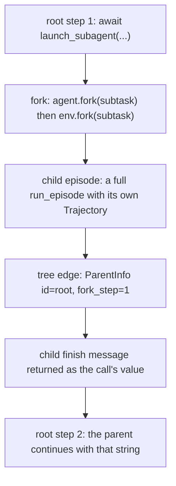

# Train a system of agents

You have a task where one agent runs out of context or out of steps before it finishes. This
tutorial turns it into a delegating one: the agent gains an action that spawns a child agent, the
rollout becomes a tree of trajectories instead of a single one, and training consumes the whole
tree. You will make an environment forkable, expose delegation to the model, pick a budget policy,
run one rollout, read the tree, and then set the settings that decide what the tree contributes to
gradients.

TextCraft-Synth is the worked reference throughout. Its recursive and depth-aware rollouts are
real, checked-in, working code, and its procedural recipe world reaches crafting depth 12 — deep
enough that a single agent genuinely cannot finish the hard tasks.

## Before you start

| You need | For which steps |
| --- | --- |
| Platoon plus the `textcraft` plugin installed | all |
| An OpenAI-compatible inference endpoint | steps 5 and 6 |
| 8 GPUs on one node, or Tinker access | step 7 only |

Steps 1 through 6 run on a laptop against any hosted or local endpoint. Step 7 is a real training
run and needs the hardware. If you do not have it, read steps 7 and 8 anyway — the config keys are
the point, and you can set every one of them without launching.

Install per [installation](../get-started/installation.md). This page assumes you have already run
a single-agent rollout end to end; if not, do [Train on TextCraft](textcraft.md) first.

For the mechanism behind all of this — the fork lifecycle, ownership handoff, the synthetic reward
verifier — see [fork and sub-agent model](../architecture/subagents.md) and the line-by-line
[sub-agent call walkthrough](../walkthroughs/subagent-call.md). This page is about doing it.

## 1. What changes structurally

A rollout stops being one `Trajectory` and becomes a `TrajectoryCollection` holding a tree. One
parent step contains an entire child episode:



Four things have to be true before a single-agent task can delegate:

1. The environment implements `ForkableEnv` and the agent implements `ForkableAgent`.
2. Some action in the action space calls `launch_subagent`, and the action-space description tells
   the model it exists.
3. A `BudgetTracker` decides whether a delegation is admitted at all.
4. The child's work reaches a reward — either its own env score, or the root's, propagated.

The tree edge is created in exactly one place: `set_context_vars` in
<span class="pl-src">platoon/episode/loop.py</span> calls
`TrajectoryCollection.create_trajectory(parent_traj=...)`, which stamps
`ParentInfo(id=parent.id, fork_step=len(parent.steps))`. Nothing else parents a trajectory.

## 2. Make the environment forkable

The contract, verbatim:

```python title="platoon/envs/base.py"
@runtime_checkable
class ForkableEnv(Env, Protocol):
    async def fork(self, task: Task) -> ForkableEnv:
        """Return an independently closeable child environment.

        Implementations that allocate resources before returning must clean up
        partial allocations if the fork raises, including on cancellation.
        """
```

`fork` must guarantee three things.

**The child is independently closeable.** The child's `run_episode` closes both forks in its
`finally` block. Your parent must still work afterwards, so do not hand the child a resource whose
`close()` tears down the parent's.

**A failed fork leaks nothing.** If you allocate before returning and then raise — including on
cancellation — release what you allocated. `launch_subagent` closes an already-returned forked
agent when the env fork fails, but it cannot clean up inside your `fork`.

**The child gets a reward target.** This is the one people miss. The child's `Task` carries only the
goal string the parent wrote. If your `evaluate()` reads structured fields out of `task.misc`, the
fork has to reconstruct them. TextCraft parses the goal back into target items:

```python title="plugins/textcraft/platoon/textcraft/env.py"
async def fork(self, task: Task) -> "TextCraftRecursiveEnv":
    """Fork the environment for a subagent."""
    # Parse the goal string to extract targets if it's a crafting task
    targets = self._parse_craft_targets_from_goal(task.goal)

    if targets:
        # Update task.misc with TextCraft-specific data
        task.misc = task.misc.copy() if task.misc else {}
        task.misc.update(
            {
                "target_items": targets,
                "initial_inventory": self._code_executor.inventory,
            }
        )

    # Create forked environment sharing the same inventory reference
    forked_env = TextCraftRecursiveEnv(
        task=task,
        recipes_dir=self._recipes_dir,
        recipe_db=self._recipe_db,
        initial_inventory=self._code_executor.inventory,
        _share_inventory=True,
        use_synth=self._use_synth,
        skip_subagent_reward_computation=self._skip_subagent_reward_computation,
    )

    return forked_env
```

Note `_share_inventory=True`: parent and child hold the *same* inventory dict, so a child's crafting
is immediately visible to the parent. That is a deliberate decision about what the child shares. A
copied world the child cannot leak into is equally valid and makes parallel siblings safe. Decide
it explicitly rather than inheriting it.

If your environment is a `CodeActEnv` you get `fork` for free, as long as your executor implements
`ForkableCodeExecutor`: `CodeActEnv.fork` in <span class="pl-src">platoon/envs/codeact/env.py</span>
forks the executor and rebuilds the env, and raises a clear error when the executor is not forkable.
`CodeActAgent.fork` in <span class="pl-src">platoon/agents/codeact/agent.py</span> already exists —
it rebuilds the agent around a forked LLM client — so for a CodeAct plugin the agent side needs no
work at all.

!!! warning "`fork_strategy` silently changes the child's prompt"
    `Task.fork_strategy` defaults to `"subtask"`, which produces a `SubTask` whose `__str__` renders
    the whole ancestor goal stack into the child's prompt ("Level 2: …", "Level 1: …"). TextCraft
    sets `task.fork_strategy = "task"` in `TextCraftEnv.__init__`, so its children get flat `Task`s
    with no lineage at all. Neither is wrong, but the child sees a very different prompt.

## 3. Expose delegation to the agent

The raw action lives in <span class="pl-src">platoon/agents/actions/subagent.py</span>:

```python title="platoon/agents/actions/subagent.py"
async def launch_subagent(goal: str, max_steps: int = 15, task_misc: dict | None = None, verbose: bool = True) -> Any:
```

Do not hand that to the model directly. Wrap it so the goal string is domain-shaped and the
arguments are things your environment can evaluate. TextCraft's wrapper builds the goal from a dict
of items:

```python title="plugins/textcraft/platoon/textcraft/env.py"
async def launch_subagent(self, targets: Dict[str, int], num_steps: int, context: str = "") -> str:
    # Convert targets dict to a goal string
    target_str = ", ".join([f"{count}x {item}" for item, count in targets.items()])
    goal = f"Craft the following items: {target_str}"

    if context:
        goal += f"\n\nContext provided from parent agent: {context}"

    # Use the general launch_subagent function
    # Inventory is shared by reference, so changes propagate automatically
    result = await _launch_subagent(goal=goal, max_steps=num_steps)

    return result
```

The bound method then goes into the executor's actions tuple alongside `finish`, `craft` and the
rest, so it lands in the IPython namespace under its own `__name__`.

**Injecting it is not enough — describe it.** `TextCraftCodeExecutor` already has
`self.launch_subagent` in its actions tuple, but the linear variant's `describe_action_space` passes
`include_subagent=False` and never mentions it, so the model never calls it. The recursive variant
flips that flag. The depth-aware variant goes further and drops `num_steps` from both the signature
and the description, because with per-agent budgets there is nothing for the model to choose.

### What the agent sees

`launch_subagent` **always returns a string**, and there are four kinds:

| Return | When |
| --- | --- |
| the child's `finish` message | the child called `finish` |
| `"Subagent did not finish before its step budget was exhausted."` | the child ran out of steps |
| `"Subagent failed before finishing."` | any other child failure |
| `"Not enough budget to launch subagent for goal …"` plus guidance | the reservation was refused |

The last one matters: a refusal is not an exception. The budget check runs *before* any resource is
allocated, and on `BudgetExceededError` the function returns the message plus the error's `guidance`
text, so the model reads something actionable and keeps going. Nothing forks.

The error strings are deliberately sanitized in `_subagent_error_message` — the parent never sees a
traceback or the child's budget accounting. If your parent logic needs to branch on the outcome, put
your own sentinel in the child's finish message; do not pattern-match this prose.

!!! warning "A missing `await` is a hard error before execution"
    `UnawaitedAsyncCallDetector` in <span class="pl-src">platoon/envs/codeact/env.py</span> runs an
    AST pass over generated code and rejects `launch_subagent(...)` without `await`. Its allow-list
    is a hard-coded set of function names, so a new async action of your own has to be added there
    or it will not be checked. `asyncio.gather(launch_subagent(...), launch_subagent(...))` is
    explicitly permitted — that is how parallel children are expressed, and `asyncio` inside CodeAct
    is a restricted `SafeAsyncio` shim, not the real module.

## 4. Choose a budget model

This is the design decision with the largest effect on behavior. Two trackers ship, both in
<span class="pl-src">platoon/episode/trajectory.py</span>.

| | `StepBudgetTracker` | `DepthAwareStepBudgetTracker` |
| --- | --- | --- |
| Budget scope | whole subtree shares the root's `task.max_steps` | each trajectory has its own `task.max_steps` |
| `used_budget_for` | own steps **plus every descendant's** | own steps only |
| `reserve_budget` | must fit `max_steps + 1` in what remains | ignores the amount; checks depth |
| `release_budget` | returns the reservation | no-op |
| Refusal reason | `"step_budget"` | `"depth"` |
| Depth cap | none | `max_depth`, root is depth 0 |
| Installed | by default, when nothing else is set | explicitly, before `run_episode` |

**Shared subtree budget.** A parent must reserve before it delegates, and the reservation is
`max_steps + 1`, not `max_steps` — the extra step is for reading the result. The guidance the model
gets on refusal says exactly that:

```python title="platoon/episode/trajectory.py"
guidance=(
    "Note: launch_subagent will automatically reserve max_steps + 1 steps "
    "since you will need one or more steps to process the result of the "
    "subagent and complete the task. "
    "You could try requesting a smaller budget or perform the task yourself."
),
```

Behaviorally, this *prices* delegation. Every step a child spends is a step the root cannot spend,
so the model has to estimate subtask difficulty, and it can starve itself by over-delegating.
TextCraft's recursive rollout uses this tracker and lets the model pick each child's `num_steps`;
the ctx8192 recursive config gives the entire tree 200 steps.

**Independent budgets plus a depth cap.** `DepthAwareStepBudgetTracker.reserve_budget` discards
`requested_budget` entirely and only asks whether `current_depth + 1 > max_depth`. Delegation costs
the parent nothing in steps, so expect much more of it — the structural cap is doing all the work,
and each agent is bounded only by its own `task.max_steps` through `halt_episode`. Refusals read
"The maximum depth for hierarchical delegation has been reached. You should perform the task
yourself instead of delegating."

Install a tracker by setting the contextvar before `run_episode`, exactly as the TextCraft
depth-aware rollout does:

```python title="plugins/textcraft/platoon/textcraft/synth_rollout.py"
# Install the depth-aware budget tracker BEFORE run_episode so it
# is picked up instead of the default StepBudgetTracker.
budget_tracker.set(DepthAwareStepBudgetTracker(max_depth=max_depth))
```

Set nothing and `set_context_vars` installs a plain `StepBudgetTracker`. A custom tracker only has
to satisfy the `BudgetTracker` protocol — and must accept the keyword-only `child_depth_scope`
argument on `reserve_budget`, even if, like `StepBudgetTracker`, it ignores it.

!!! note "TextCraft's `max_depth` is a function default, not a config key"
    `run_synth_depth_aware_rollout` takes `per_agent_max_steps: int = 25` and `max_depth` defaulting
    to `_TEXTCRAFT_SYNTH_MAX_DEPTH`, which is `6`. Neither is reachable from YAML, and the rollout
    overwrites `task.max_steps` with `per_agent_max_steps` *after* the workflow has already copied
    `rollout_config.max_steps` onto the task. So the `max_steps: 200` in
    `textcraft_synth_depth_aware_tinker.yaml` does not set the per-agent budget, and that file's
    header comment claiming a depth cap of 12 is stale. To change either, edit the call site.

## 5. Run one rollout and read the tree

The inference benchmark runner needs no trainer, so this is the part you can run anywhere. Point it
at any OpenAI-compatible endpoint and give it a single task id. From `plugins/textcraft`:

```bash
uv run python platoon/textcraft/inference_scripts/run_synth_inference.py \
  --config platoon/textcraft/configs/inference/textcraft_synth_inference.yaml \
  --inference.model_name openai/Qwen/Qwen3-4B-Instruct-2507 \
  --inference.model_endpoint http://127.0.0.1:30000/v1 \
  --inference.output_dir ./recursive_demo \
  --inference.workflow.rollout_config.output_dir ./recursive_demo/rollouts \
  --use_recursive_agent true \
  --task_id textcraft_synth.val.0
```

Overrides here are `--dotted.key value`, because the inference and Tinker entrypoints parse config
with Platoon's own `load_config`. AReaL uses the other convention — see step 7.

`use_recursive_agent: true` selects `run_synth_depth_aware_rollout`, not
`run_synth_recursive_rollout`; the flag name predates the split. To exercise the shared-budget
variant, call `run_synth_recursive_rollout` from your own script.

Every rollout writes JSONL trajectory events under `{rollout_config.output_dir}/events/`. Open them
in the TUI:

```bash
uv run python -m platoon.visualization.cli tail --rdir ./recursive_demo/rollouts
```

The tree pane nests each child under its parent. Four things to read:

- **Trajectory labels** look like `traj:<id> · subtree:solver=3,verifier=0 · reward:0.000`. The
  subtree counts tell you how big the delegation tree under that node got, split into policy
  ("solver") and synthetic verifier trajectories. Finished trajectories are colored by reward: red
  at 0, green at 1, yellow between.
- **The fork node**, `fork from <parent id> @ step <n>`, is the tree edge. `n` is the parent step
  index at which delegation happened, so you can jump straight to the step that launched this child.
- **Verifier trajectories** render dim, as `verifier:<id>`. They exist only if you enabled sub-agent
  reward judging; TextCraft does not.
- **Child rewards.** A child with a `finish` message and `reward:0.000` is the classic "the child
  claimed success and the environment disagreed" case. Most debugging goes here.

`replay --dir <events dir> --delay 0.2` steps through the same events in order, which is better when
you want to watch delegation happen rather than inspect the finished tree. More in
[Inspect rollouts in the TUI](visualization.md).

## 6. Check the rollout before you train

A delegating rollout that trains badly usually already looks wrong here. Three checks:

**Did the root delegate at all, and how deep?** If the root's label says `subtree:solver=1`,
delegation never happened. Go back to step 3 — most often the action-space description does not
mention `launch_subagent`.

**Did children finish, or exhaust their budgets?** A tree full of "Subagent did not finish before
its step budget was exhausted." means the per-agent budget is too small for the subtasks the model
is choosing, or — under the shared tracker — the root spent the tree's budget before it delegated.

**Do children have their own reward?** In TextCraft the child's env scores it independently, because
`fork` rebuilt `target_items` from the goal. If every child is exactly 0, either the fork dropped the
reward target or `skip_subagent_reward_computation` is on.

## 7. Train on the tree

=== "AReaL"

    TextCraft's AReaL path uses the per-plugin script, which picks the rollout from two top-level
    config keys added by `TextCraftSynthArealTrainerConfig`: `depth_aware: true` wins, then
    `recursive: true`, otherwise linear.

    ```bash
    uv run python3 platoon/textcraft/train_scripts/areal/train_areal_synth.py \
      --config platoon/textcraft/configs/areal/textcraft_synth_ctx8192_depth_aware_medium_areal.yaml
    ```

    AReaL overrides are bare `key=value` with **no leading dashes** — this entrypoint loads config
    through `areal.api.cli_args.load_expr_config`:

    ```bash
    uv run python3 platoon/textcraft/train_scripts/areal/train_areal_synth.py \
      --config platoon/textcraft/configs/areal/textcraft_synth_ctx8192_depth_aware_medium_areal.yaml \
      trial_name=depth-aware-debug \
      workflow_config.subagent_datum_keep_probability=0.25
    ```

    None of the checked-in TextCraft AReaL configs carry an `environments:` block, so the shared
    entrypoint `python -m platoon.train.areal.train` is not wired up for this plugin today.

=== "Tinker"

    The Tinker depth-aware config is the one registry-driven config in the repository, so it runs on
    the shared entrypoint:

    ```bash
    uv run python -m platoon.train.tinker.train \
      --config platoon/textcraft/configs/tinker/textcraft_synth_depth_aware_tinker.yaml \
      --train.workflow_config.group_size 4
    ```

    Its `environments:` block is a list of `EnvironmentConfig` — registry wiring that names each
    component by its registered name:

    ```yaml title="plugins/textcraft/platoon/textcraft/configs/tinker/textcraft_synth_depth_aware_tinker.yaml"
    environments:
      - package: platoon.textcraft.registry
        trainer_config: textcraft/synth/tinker
        dataset_loader: textcraft/synth
        eval_dataset_loader: textcraft/synth
        task_loader: textcraft/synth
        rollout: textcraft/synth/depth_aware
        reward_processor: textcraft/synth/delegation_capped
        workflow: group_rollout
    ```

    Swap `rollout:` to `textcraft/synth/recursive` for the shared-budget variant. A bespoke script,
    `platoon.textcraft.train_scripts.tinker.train_tinker_synth_depth_aware`, exists too if you
    prefer explicit wiring.

!!! warning "This is not openreward's `environments:`"
    The top-level `environments:` above is a list of `EnvironmentConfig` — which registered
    components the trainer should build. Some openreward configs carry a *nested*, plugin-local
    `environments:` under their own section, with fields like `label`, `env_name` and
    `sampling_weight`. That one is an environment-mixture list and has nothing to do with this.

## 8. Decide what the tree contributes to gradients

By default every non-excluded trajectory in the tree becomes training data at equal weight. That is
rarely what you want: one root and twelve children means the children dominate the batch. Four
settings change it.

```mermaid
flowchart LR
  A["trajectory tree"]
  B["drop exclude_from_training"]
  C["reward_processor per trajectory"]
  D["merge steps into datums"]
  E["policy-eligibility mask"]
  F["group centering over root rewards"]
  G["Bernoulli keep mask: depth 0 always kept"]
  H["trainable_datums"]
  I["depth weighting: inverse frequency or gamma^d"]
  A --> B --> C --> D --> E --> F --> G --> H --> I
```



Group centering and workflow statistics run on the *complete* tree; the masks are intersected only
afterwards, so sampling never perturbs the baseline.

| Key | Type | Default | What it does |
| --- | --- | --- | --- |
| `workflow_config.subagent_datum_keep_probability` | float | `1.0` | Bernoulli retention per non-root datum. `1.0` disables the sampler entirely. |
| `workflow_config.subagent_datum_sampling_seed` | int | `0` | Seed for the SHA-256 draws. Must be a real `int`, not a bool. |
| `workflow_config.depth_level_weighting` | bool | `false` | Reweight rewards by inverse per-depth trajectory frequency. |
| `workflow_config.depth_level_discount_gamma` <span class="pl-tag pl-tag--areal">AReaL</span> | float or null | `null` | Reweight rewards by `gamma^depth` instead. Not defined on the Tinker `WorkflowConfig`. |
| `workflow_config.rollout_config.propagate_root_success` | bool | `false` | Overwrite every trajectory's reward with the root's success. |

**`subagent_datum_keep_probability`** is a throughput knob, not a learning-signal knob. Reach for it
when deep trees blow up your batch. Root datums are always retained — the deterministic sampler
returns all-`True` at depth 0 — so lowering it only thins descendants, and an individual child can
end up contributing nothing. Set it once, keep the seed fixed, and watch the `subagent_sampling/*`
stats (`eligible_datums`, `retained_datums`, and the same pair per depth level) to see what you
actually kept. The shared entrypoints force it back to `1.0` for evaluation.

**`depth_level_weighting`** is what the TextCraft depth-aware configs turn on. It divides each
datum's reward by the number of retained trajectories at its depth, then renormalizes so the batch's
total weight is preserved. Use it when the tree is wide: without it one root competes with a dozen
leaves for the gradient. Both backends implement it in `DepthLevelWeightingTransform`, but at
different granularity: AReaL runs it trainer-side on the concatenated full batch, Tinker once per
microbatch.

**`depth_level_discount_gamma`** is the alternative, not an addition. When it is non-null the same
transform takes the `gamma^depth` branch and inverse-frequency weighting never runs. Use it when you
deliberately want deep work to count less — `gamma < 1` says a grandchild's tokens matter less than
the root's. Leave it `null` otherwise; every checked-in TextCraft config does.

**`propagate_root_success`** is the bluntest credit-assignment tool there is. It reads the root's
last-step `reward/success` and writes it onto every trajectory in the collection, rewriting
`reward/subagent_succeeded` along the way. Turn it on when children have no meaningful independent
reward and the only real signal is "did the whole thing work". Turn it off when they do, because it
destroys the per-child score the environment computed, and it is incompatible with delegation-bonus
schemes — openreward raises rather than combining the two. TextCraft's ctx40000 depth-aware configs
set it `true`; the ctx8192 ones leave it off and let each child's env score stand.

!!! note "Root is the first key in the dict"
    `propagate_root_success` and depth computation both take the root to be the first entry of the
    trajectory mapping, relying on Python dict insertion order. Any code that rebuilds a collection
    must preserve root-first ordering. A root is also exempt from the child-only
    `exclude_from_policy_training` marker — but an *interrupted* trajectory, root or not, is never
    policy-eligible.

Deeper treatment of the algorithmic choices is in [recursive recipes](../recipes/recursive.md) and
the [configuration reference](../reference/configuration.md).

## 9. Failure modes

**The agent delegates everything.** The root becomes a one-line router: it forwards the task
verbatim to a child and returns the child's answer. With `propagate_root_success` on, this is
*optimal* — the root receives the child's success for free — so nothing in the reward discourages
it. Fixes in increasing order of effort: turn off root propagation and let each trajectory carry its
own env score; keep any delegation bonus at zero (TextCraft's cap is `0.0` today, so delegating
earns nothing by itself); or add a behavior judge, which is what openreward uses to fail exactly
this pattern. Symptom: root trajectories with one step and one child.

**The agent never delegates.** Check in this order. Is `launch_subagent` in the action-space
*description*, not just the namespace? Is the budget refusing every reservation — under
`StepBudgetTracker` a root with a small `max_steps` cannot afford `max_steps + 1` for a child? Is
`max_depth` set low enough to block depth 1? `reward/subagent_launched` is zero in all three cases;
the refusal text in the trajectory tells you which one you have.

**Budget exhaustion.** Under the shared tracker the failure is silent and upstream: the parent
spends its steps exploring, then cannot reserve, and the tree collapses into a single agent that
runs out at the end. `halt_episode` sets `"WARNING: Exhausted budget when running episode. …"` on the
trajectory, and the parent sees only the sanitized "Subagent did not finish before its step budget
was exhausted." Remember the `+ 1`: a child asking for exactly the parent's remaining budget is
always refused. Under the depth-aware tracker this mostly disappears, because each agent has its own
budget and `release_budget` is a no-op — the cost moves from steps to wall-clock and tokens, which
is why recursive configs run with very large `step_timeout` values.

**Children whose work never reaches the reward.** Several independent causes produce identical
symptoms — a full, healthy-looking tree and a flat reward curve.

- `fork` did not reconstruct the child's reward target, so the child's `evaluate()` scores 0 no
  matter what it did.
- `skip_subagent_reward_computation` is on, which makes sub-agent tasks return 0 without running the
  evaluator. Each plugin detects "am I a sub-agent?" with its own heuristic — TextCraft checks
  whether `"textcraft"` is absent from `task.id`, which breaks the moment you change your task-id
  scheme.
- `propagate_root_success` overwrote the child's real score with the root's.
- `subagent_datum_keep_probability` is low enough that the children's datums are mostly discarded.
  `subagent_sampling/depth_N/retained_datums` will show it.

## Next

- [Fork and sub-agent model](../architecture/subagents.md) — lifecycle, ownership handoff, and the
  synthetic reward verifier.
- [Sub-agent call walkthrough](../walkthroughs/subagent-call.md) — one `launch_subagent` call read
  line by line.
- [Recursive recipes](../recipes/recursive.md) — budget, depth and credit-assignment patterns beyond
  the defaults.
- [Custom environment](../customization/environment.md) — the full `Env` surface, of which `fork` is
  one method.
- [Scale to multiple nodes](multi-node.md) — recursive rollouts are long, and this is where the
  timeouts and straggler settings start to matter.
