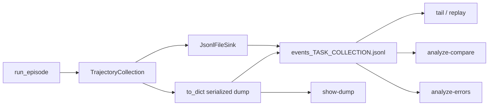

# Inspect rollouts in the TUI

A reward came out wrong and you want to know why. This tutorial takes you from a rollout's event log
to the exact step that produced the number, using the Textual viewer in
<span class="pl-src">platoon/visualization/</span>. You will open a finished run, walk a trajectory
turn by turn, read a recursive run's subagent tree, follow a live run, and finish with the two batch
tools — A/B comparison and failure clustering.

## Before you start

You need a rollout event log. Everything on this page reads JSONL files; none of it needs a GPU, a
cluster, or a training job. Only the *producing* step does.

| You have | What to do |
|---|---|
| A finished training run's output directory | Skip to [step 1](#step-1-open-the-log). |
| Nothing yet, and an OpenAI-compatible endpoint | Run the single-rollout script in [quickstart](../get-started/quickstart.md). It writes `./number_search_smoke/events/`. |
| Nothing yet, and no endpoint at all | You cannot generate a log. Read on anyway — the label formats and keybindings below are what you will see when you can. |

The LLM-backed parts of `analyze-compare` and `analyze-errors` also want `OPENAI_API_KEY` and
optionally `OPENAI_BASE_URL`, which `create_llm_client` in
<span class="pl-src">platoon/utils/llm_client.py</span> reads. Without them those commands still run:
they fall back to keyword heuristics and never hard-fail.

There is no console script. Always invoke the module:

```bash
uv run -m platoon.visualization.cli --help
```

## Where the event log comes from

Nothing writes trajectory events by default. Each plugin's `run_rollout` constructs a `JsonlFileSink`
and registers it on the collection. From
<span class="pl-src">plugins/textcraft/platoon/textcraft/rollout.py</span>:

```python
traj_collection = TrajectoryCollection()
current_trajectory_collection.set(traj_collection)

events_path = os.path.join(config.output_dir, "events", f"events_{task.id}_{traj_collection.id}.jsonl")

traj_collection.register_event_handlers(
    JsonlFileSink(events_path, collection_id=traj_collection.id, process_id=os.getpid())
)
```

`TrajectoryCollection` fans four lifecycle callbacks out to its registered handlers, so the sink
appends one JSON object per line while the episode runs: `trajectory_created`, `trajectory_task_set`,
one `trajectory_step_added` per step, and `trajectory_finished`. That file is the interchange format
— tail, replay, comparison and error analysis all read it.

The directory depends on who set `rollout_config.output_dir`:

| Producer | Where the file lands |
|---|---|
| A plain script | `{rollout_config.output_dir}/events/` — default `rollout_results` (`RolloutConfig` in <span class="pl-src">platoon/config_defs.py</span>) |
| Tinker training | `{log_path}/rollouts/{train or eval}/{checkpoint_version}/events/` |
| AReaL training | `{output_dir}/{output_subdir}/{engine version}/events/`. `output_subdir` is `train_rollout` or `eval_rollout` in practice — the entrypoint and every plugin script pass one of those, so the workflow's own `rollout` fallback is unreachable |
| Inference benchmark | `{inference.output_dir}/rollouts/{task_id}/rollout_{i}/`, as a `trajectory_collection.json` dump |

Both trainers append the model version to the path, so you get one directory per training step. The
rewrite happens in each backend's `GroupRolloutWorkflow`
(<span class="pl-src">platoon/train/areal/workflows/group_rollout_workflow.py</span> and
<span class="pl-src">platoon/train/tinker/workflows/group_rollout_workflow.py</span>); the inference
harness does its own in `InferenceBenchmarkRunner`
(<span class="pl-src">platoon/inference/runner.py</span>).

!!! warning "The sink truncates on construction"
    `JsonlFileSink.__init__` unlinks any existing file at that path before writing. Rerunning with
    the same task id *and* the same collection id clobbers the previous log. Collection ids are
    fresh UUIDs, so this normally only bites when you hand-pick a filename.



## Step 1: open the log

Point `replay` at the directory:

```bash
uv run -m platoon.visualization.cli replay --dir ./number_search_smoke/events --delay 0.25
```

Autoplay advances one event every `--delay` seconds. **Replay starts paused** — press ++space++ to
begin. Or skip the animation entirely and load the whole file at once:

```bash
uv run -m platoon.visualization.cli replay --dir ./number_search_smoke/events --delay 0
```

`--delay 0`, or any non-positive value, takes the instant path. That is what you want when you are
investigating rather than demoing.

Two things before you scale this up. `replay` accepts `--dir` but **not** `--rdir`, so it will not
walk a training run's per-version subdirectories; only `tail` recurses. And `--delay` belongs to
`replay` alone — `show-dump` is always instant.

## Step 2: read the tree

The left pane is a tree of collection, then trajectory, then task / fork / steps. A collection node
looks like this:

```
collection: textcraft · task:train#442 · trajs:solver=2,verifier=1 · id:068cf326
```

Environment, task descriptor, a disjoint count of solver and verifier trajectories, then the first
eight characters of the collection id. Task metadata is resolved by `_task_display_metadata` in
<span class="pl-src">platoon/visualization/tui.py</span>, and the *root* trajectory's task wins —
child and verifier task-set events only fill gaps.

A trajectory node:

```
traj:a1b2c3d4-… · subtree:solver=2,verifier=1 · reward:1.000
```

The reward shown is the trajectory's cumulative reward. `_format_traj_label` colors the label **only
after the trajectory has finished**: red at `reward <= 0`, green at `>= 1`, yellow in between. An
uncolored node that already shows a reward means the trajectory is still running, or its log was
truncated mid-episode. Check that first when a run "looks wrong" — a missing `trajectory_finished`
record and a genuine zero reward are very different bugs, and the color is what separates them.

Under each trajectory: an optional `fork from <parent_id> @ step <n>` node, a `task:` node with the
goal excerpt, and a `steps` container. Step labels are summaries, not payloads:

```
step 0: thought: bracket the range first; code: guess(50)
step 1: code: guess(75); output
step 2: tools: emails.send_email x3 -> Traceback: RuntimeError
```

Move to a node with the arrow keys, or click it, and the right pane renders the full payload. Generic
dicts get one panel per key, with `code`, `python`, `bash` and friends syntax-highlighted and nested
structures pretty-printed as JSON.

!!! warning "Plain strings render as Markdown"
    `DetailsPanel` renders string values as Markdown, so log output containing `#`, `*` or backticks
    is reformatted on screen. When you need the raw bytes, press ++d++ for details-only view and
    ++m++ to release mouse capture, then drag-select in your terminal. Launching with
    `--selectable-text` sets the mouse-capture state that way from the start.

### Keybindings

| Key | What it does |
|---|---|
| ++space++ | Play/pause replay. No-op outside replay mode. |
| ++right++ / ++n++ | Advance one event and pause autoplay. |
| ++r++ | Restart: reset the tree, re-render from record 0. |
| ++enter++ | Expand or collapse the focused node. |
| ++ctrl+f++ | Toggle the search panel. |
| ++f3++ / ++shift+f3++ | Next / previous search hit. |
| ++escape++ | Close search. |
| ++d++ | Details-only view — collapses the tree pane to zero width. |
| ++m++ | Toggle mouse capture so the terminal can drag-select. |
| ++q++ | Quit. |

The divider between the panes is draggable, clamped between 10% and 90%.

## Step 3: find the step that did it

Press ++ctrl+f++ and type. Search is a case-insensitive substring match over **both** the node label
and the node's serialized payload, so `Traceback`, a tool name, or a fragment of the model's thought
all work. Results are grouped into collection / trajectory / task / step / fork buckets with
`matched/total` denominators; click a result to focus that node.

!!! note "Result counts can exceed the number of nodes"
    `TrajectoryTree.search_nodes` appends a node once for a label match and again for a data match,
    with no dedup. A node whose label and payload both contain your query is counted twice.

Once you are on the suspect step, the details pane holds the answer. For OpenHands steps the panel
pairs each action with its matching observations — on `tool_call_id` first, falling back to
`observation.action_id == action.id` — and lists anything unpaired under `unmatched observations`.
Arguments named `code`, `python` or `script` render as Python with line numbers; `command` renders as
bash. The setup panel reports the system prompt's character count and advertised tool count rather
than dumping the prompt.

### Rendering modes

`--mode auto` is the default and is usually right. It renders CodeAct-style (`code` / `thought` /
`output` / `error`) unless the step payload contains `action_events` or `observation_events`, in
which case it switches to OpenHands rendering. `--mode openhands` applies the same predicate — it
will not force OpenHands rendering onto a CodeAct step. `--mode codeact` disables OpenHands rendering
outright, which is the escape hatch when the summarizer is hiding something you need to see.

The OpenHands summarizer collapses repeated tool calls within one model turn
(`tools: emails.send_email x3`), unwraps `call_tool` to the catalog name
(`excel.create_workbook`), surfaces observation errors into the tree label, and shows the final
`claim_done` payload from `misc.reward_misc["openreward/final_payload"]`. In an OpenReward run, that
last one is frequently the whole answer to "why is this reward zero".

## Step 4: navigate a recursive rollout's trajectory tree

This is the feature that pays for itself. A recursive run produces many trajectories per task, and
the tree is what makes them legible.

Two nesting rules, both in `_parent_node_for_trajectory`:

1. A trajectory whose `misc` carries `subagent_reward_verifies_trajectory_id` (or the legacy
   `platoon_subagent_verifies_trajectory_id`) is re-parented **under the trajectory it judges**, not
   under its structural parent, and drawn dim with a `verifier:` prefix.
2. Otherwise it hangs under `parent_info.id`, and a `fork from <parent> @ step <n>` child records
   where the parent stood when it delegated.

A judged subagent therefore reads like this:

```
collection: textcraft · task:train#442 · trajs:solver=2,verifier=1 · id:068cf326
└── traj:a1b2… · subtree:solver=2,verifier=1 · reward:0.000
    ├── task:442 · Craft a stone pickaxe from raw materials
    ├── steps
    │   ├── step 0: thought: delegate the wood subtask; code: subagent(...)
    │   └── step 1: code: craft("stone pickaxe"); error
    └── traj:c3d4… · subtree:solver=1,verifier=1 · reward:1.000
        ├── fork from a1b2… @ step 0
        ├── steps
        └── verifier:e5f6… · subtree:solver=0,verifier=1 · reward:1.000
```

Read it top down: the root scored `0.000`, the subagent it launched scored `1.000`, and a verifier
signed off on the subagent. The bug is in the root's step 1, after delegation returned — not in the
subagent. Without the tree you would be diffing two flat logs to work that out.

Events do not always arrive parent-first, especially with concurrent subagents. The tree repairs
itself: `_reparent_traj_node` moves a node once its real parent appears, and cycles are guarded.

!!! warning "`subtree:` counts a verifier's children as solvers"
    The TUI marks a trajectory as a verifier only if its *own* `misc` says so. Token-efficiency
    accounting in <span class="pl-src">platoon/utils/token_efficiency.py</span> uses the opposite
    rule: verifier status is inherited by the whole branch. A verifier's unmarked descendants are
    therefore counted as solvers in the `subtree:solver=…,verifier=…` label while being excluded
    from the token-efficiency penalty. Read the label as navigation, not as accounting.

For the machinery behind these trees see [subagents](../architecture/subagents.md) and
[recursive agents](recursive-agents.md).

## Step 5: follow a run that is still going

`tail` is the live variant. Unlike `replay` it takes `--rdir` and walks the tree recursively, which
is what you want against a training run writing a new subdirectory per model version:

```bash
uv run -m platoon.visualization.cli tail --rdir /path/to/run/rollouts
```

Multi-file tail spawns one poll loop per file. Each loop creates the parent directory if it is
missing and waits for the file to appear, so you can start tailing before the job starts writing. It
reopens on inode change when a file is replaced, and rewinds on truncation.

`tail` does **not** seek to the end first — the CLI never sets `start_at_end`, so you get all
existing content first, loaded in bulk mode without per-record refresh, before live records begin
arriving. On a large directory that first pass takes a moment.

Once live, each new step collapses everything except its own trajectory, scrolls the step into view,
and flashes it in reverse video for about half a second. Good for watching one rollout; unusable when
twenty worker processes are appending at once. Tail a single file when you actually want to follow
something:

```bash
uv run -m platoon.visualization.cli tail /path/to/run/rollouts/train/12/events/events_task-7_a1b2c3.jsonl
```

Malformed JSON lines are skipped silently, so a half-written line from a concurrent append will not
kill the viewer.

### Viewing a saved dump

Inference benchmarks, and any rollout run with `rollout_config.return_dict` true, produce a
serialized `TrajectoryCollection` rather than an event stream. `show-dump` converts it to events in a
temp file under `$TMPDIR` and opens the same viewer:

```bash
uv run -m platoon.visualization.cli show-dump /path/to/rollouts/task_x/rollout_0/trajectory_collection.json
uv run -m platoon.visualization.cli show-dump --dir /path/to/rollouts/task_x/rollout_0
```

`.json` is one dump; `.jsonl` is one dump per line. Any other extension is skipped without a message.

## Step 6: compare two runs

You now know why one rollout failed. The next question is usually whether a change helped across the
eval set. `analyze-compare` pairs collections by task id and buckets them:

```bash
uv run -m platoon.visualization.cli analyze-compare baseline recursive \
  --a-dir /runs/baseline/events \
  --b-dir /runs/recursive/events
```

`--a-dir` / `--b-dir` are non-recursive and pick up `.json` and `.jsonl`; `--a` / `--b` are repeatable
single-file flags. Inputs can be event logs or dumps in any mix — `iter_collection_dumps` sniffs each
file. The table has columns `Task | Winner | <a_label> | <b_label> | Cluster`, sectioned into
`A better`, `B better`, `Both succeeded (tie)`, `Both failed` and `Unmatched (only in A or B)`.

| Key | What it does |
|---|---|
| ++o++ | Open the selected pair in the replay viewer |
| ++g++ | Toggle grouping between winner sections and cluster labels |
| ++c++ | Copy the details markdown |
| ++shift+l++ | Re-cluster from cached analyses and switch to cluster grouping |
| ++q++ | Quit |

++o++ is the link back to step 2. It materializes both collections to temp event JSONLs, suspends the
table, and shells out to `replay --delay 0.0` with both files, so you get one tree holding A's and
B's attempt at the same task.

Add a model for LLM explanations in the right pane, cached on disk:

```bash
uv run -m platoon.visualization.cli analyze-compare baseline recursive \
  --a-dir /runs/baseline/events \
  --b-dir /runs/recursive/events \
  --analysis-model openai/gpt-4o-mini \
  --analyze-both-failed \
  --analysis-cache /runs/compare-cache
```

Only the winner buckets are explained by default; `--analyze-both-failed` adds the both-failed ties.
`--no-ui` prints `{"counts": {...}, "analyses": {...}}` to stdout instead of opening the table, which
is the CI-friendly form.

!!! warning "Comparison semantics that will surprise you"
    - **Success is `reward == 1.0` exactly** (`is_success_for_collection` in
      <span class="pl-src">platoon/analysis/compute_metrics.py</span>). A partial-credit environment
      reads as 100% failure.
    - Only the **first trajectory in insertion order** supplies the task id and the success verdict.
      For a recursive run that must be the root.
    - Collections whose first trajectory has no `task.id` are dropped silently.
    - `steps_total` sums steps across *all* trajectories, so a recursive method always looks more
      expensive than a flat one by construction.
    - `explain_compare_item` puts **both entire dumps** into one prompt with no truncation anywhere
      in the path. Long OpenHands trajectories will blow past the context window.
    - ++shift+l++ reads the *default* cache directory even when you passed `--analysis-cache`. The
      right-pane analysis honors the flag; the re-cluster action does not.

## Step 7: cluster the failures in one run

`analyze-errors` extracts issues from failing collections and groups them:

```bash
uv run -m platoon.visualization.cli analyze-errors candidate --dir /runs/candidate/events
```

Successful collections are skipped unless you pass `--include-successes`. With no `--model`,
extraction is a heuristic: title `failure` when the trajectory has a `finish_message` or
`error_message` and `behavior` otherwise, reason is that message truncated to 400 characters, and
`step_refs` is the last step index. Clustering then falls back to keyword buckets — `timeout`,
`assert`, `compile`, `invalid`, `exception`, `tool`, `plan`, `other`.

Table columns are `Task | Title | Steps | Cluster`. ++g++ swaps between grouping by task id and by
cluster label, ++shift+l++ re-clusters from cached analyses, ++q++ quits.

The full LLM pass:

```bash
uv run -m platoon.visualization.cli analyze-errors candidate \
  --dir /runs/candidate/events \
  --model openai/gpt-4o-mini \
  --llm-issues --precompute-analyses \
  --sample 50 --sample-seed 0 \
  --analysis-cache /runs/err-cache
```

`--llm-issues` is a **no-op without `--model`** — `analyze_errors` requires both. `--sample` filters
after extraction and before clustering, and its failure predicate accepts any issue with a non-empty
reason, `behavior`-titled ones included. `--passes` (default 2) sets hierarchical clustering rounds,
`--no-cluster` skips clustering, `--no-ui` prints issues and clusters as JSON.

!!! warning "++o++ in the error table does not work on event logs"
    `ErrorIssue` carries only metadata, so ++o++ shells out to `show-dump` on the whole source file.
    Against a `.jsonl` of *events* — the usual case when you passed `--dir .../events` — `show-dump`
    finds no `trajectories` key on any line and opens an empty viewer. Read the `Source:` path from
    the details pane and run `replay` on it in another terminal instead.

Heuristic extraction emits one issue per trajectory, not per collection, so a recursive run produces
many issues for a single task. Group by task with ++g++ before drawing conclusions from row counts.

## Where the analysis cache lives

Both analysis commands cache LLM output under `$XDG_CACHE_HOME` (default `~/.cache`), in a directory
named `AgentEcho` — a leftover from an earlier project name, not a typo:

```
$XDG_CACHE_HOME/AgentEcho/analyze_compare/<sha256>.json   per-pair analysis
$XDG_CACHE_HOME/AgentEcho/analyze_compare/clusters.json   cluster label -> task ids
$XDG_CACHE_HOME/AgentEcho/analyze_errors/<uuid5>.json     per-issue analysis
```

`--analysis-cache DIR` overrides the root. Cache keys deliberately exclude volatile fields so
analyses survive a rerun over the same inputs.

Both analysis subcommands wrap large sections in bare `except Exception: pass`, so a broken LLM
configuration degrades to heuristics without printing anything. If the right pane is empty when you
expected an analysis, check `OPENAI_API_KEY` and `OPENAI_BASE_URL` before looking anywhere else.

## Command summary

| Command | Reads | Notable flags |
|---|---|---|
| `tail` | event JSONL | `--dir`, `--rdir` (recursive), `--mode`, `--selectable-text` |
| `replay` | event JSONL | `--dir`, `--delay` (default `0.5`; `0` is instant), `--mode`, `--selectable-text` |
| `show-dump` | dump `.json` / `.jsonl` | `--dir`, `--mode`, `--selectable-text` |
| `analyze-compare A B` | either | `--a`, `--a-dir`, `--b`, `--b-dir`, `--analysis-model`, `--analyze-both-failed`, `--analysis-cache`, `--no-ui` |
| `analyze-errors LABEL` | either | `--paths`, `--dir`, `--model`, `--llm-issues`, `--precompute-analyses`, `--sample`, `--sample-seed`, `--passes`, `--no-cluster`, `--include-successes`, `--analysis-cache`, `--no-ui` |

`--mode` takes `auto`, `codeact` or `openhands` on all three viewer subcommands.

Headline accuracy numbers come from separate scripts, not the TUI:

```bash
uv run -m platoon.analysis.compute_metrics --dir /runs/candidate/dumps
uv run -m platoon.analysis.appworld_metrics --dir /runs/appworld/dumps --difficulties 1,2,3
```

Both print JSON and use the same strict `reward == 1.0` success test as `analyze-compare`.

## Next

- [Custom rewards](../customization/rewards.md) — for when the step you found is correct and the
  reward function is what is wrong.
- [Build a task from scratch](build-a-plugin.md) — the next tutorial in the sequence, and the first
  one where the events you just read are your own.
- [Recursive agents](recursive-agents.md) — the delegation machinery behind the trajectory tree.
- [Group rollout workflow](../walkthroughs/group-rollout-workflow.md) — how a training step turns
  these collections into a batch.
- [Troubleshooting](../reference/troubleshooting.md) — for when the log is missing rather than
  confusing.
