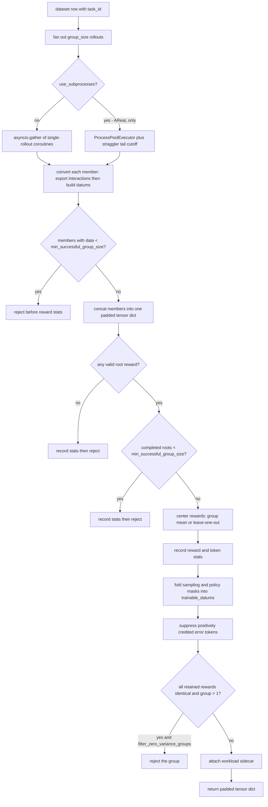

# The group rollout workflow

`GroupRolloutWorkflow` is the component that turns one dataset row into one training batch. It runs
`group_size` independent rollouts of the same task, centers their rewards against each other,
decides whether the resulting group is worth training on, and emits either a padded tensor dict
(AReaL) or a list of `tinker.Datum` (Tinker). Nearly every knob that silently changes how much data
reaches the optimizer lives here.

This page is a close reading of both implementations,
<span class="pl-src">platoon/train/areal/workflows/group_rollout_workflow.py</span> and
<span class="pl-src">platoon/train/tinker/workflows/group_rollout_workflow.py</span>. For the
upstream half — how a trajectory tree becomes datums in the first place — read
[trajectory to batch](trajectory-to-batch.md) alongside it.

## What a group is, and why grouping exists

A **group** is `group_size` independent rollouts of one task, launched from the same policy version.
Nothing differs except sampling noise: same `task_id`, same `get_task_fn`, same rollout config, same
model endpoint.

Platoon trains with no value network. A datum's advantage is its scalar reward minus a baseline, and
that baseline is estimated *within the task* from the group's sibling rollouts. That is the entire
reason grouping exists: an intrinsically easy task and an intrinsically hard one both produce
zero-mean advantages, so the gradient says "this rollout was better than my other attempts at this
task", not "this task pays well".

Two consequences show up as configuration:

- A group of one has no baseline: centering a singleton against itself yields no within-task signal.
  Hence `min_successful_group_size`, and hence the zero-variance check applying only when more than
  one member survived.
- A group whose members all scored identically produces zero advantage for every datum, so a forward
  and backward pass on it costs compute and moves nothing. `filter_zero_variance_groups` (AReaL) and
  `filter_zero_advantage_datums` (both) skip that work.

The group is also the unit of *rejection*. When the workflow decides a group is unusable it returns
`None` (AReaL) or an empty result (Tinker) for the whole task, never a partial group, because a
partially surviving group would have a biased baseline.

!!! info "Group size versus batch size"
    On the AReaL path the trainer submits `train_dataset.batch_size` task rows and passes
    `group_size=1` to AReaL's own controller dispatch — `_controller_dispatch_group_size` returns
    `1` with the comment "Platoon workflows already own rollout multiplicity internally". One
    optimizer step therefore sees `train_dataset.batch_size x workflow_config.group_size` rollout
    trajectories. On the Tinker path the trainer drives `train.batch_size` tasks with
    `train.workflow_config.group_size` rollouts each.

## Constructing the workflow

The two backends have deliberately different constructors: the AReaL workflow has to survive being
serialized to a remote rollout worker, and the Tinker workflow does not.

=== "AReaL"

    ```python title="platoon/train/areal/workflows/group_rollout_workflow.py"
    class GroupRolloutWorkflow(RolloutWorkflow, RemoteWorkflowSerializable):
        """Workflow that preserves Platoon's recursive group-rollout processing."""

        def __init__(
            self,
            rollout_fn: Callable[[Task, dict], dict] | str,
            get_task_fn: Callable[[str], Task] | str,
            config: WorkflowConfig | dict[str, Any],
            proxy_base_url: str | None,
            proxy_admin_api_key: str,
            output_subdir: str = "rollout",
            filter_errors: bool = False,
            reward_processor: Callable[[dict], tuple[float, dict]] | str = lambda traj: (traj["reward"], {}),
            merge_prefixes: bool = True,
        ):
    ```

    Every callable argument also accepts an import-path string, resolved through
    `import_from_string`. That is not a convenience: `to_workflow_kwargs` turns the live workflow
    back into import paths plus `asdict(self.config)` so AReaL can rebuild it inside a rollout
    worker process. It raises if `rollout_fn` or `get_task_fn` has no importable path, and it
    deliberately sends `proxy_base_url` as `None` so each worker binds its own through
    `set_proxy_base_url`.

    The constructor force-overrides two rollout-config fields:

    ```python title="platoon/train/areal/workflows/group_rollout_workflow.py"
    self.config = deepcopy(config)
    self.config.rollout_config.return_dict = True
    self.config.rollout_config.train = True
    ```

    Setting them in YAML has no effect; the workflow needs the dict-shaped trajectory collection
    and the training-mode rollout regardless.

=== "Tinker"

    ```python title="platoon/train/tinker/workflows/group_rollout_workflow.py"
    class GroupRolloutWorkflow:
        def __init__(
            self,
            rollout_fn: Callable[[Task, RolloutConfig], dict],
            get_task_fn: Callable[[str], Task],
            config: WorkflowConfig,
            model_info: ModelInfo,
            log_path: str | None = None,
            stats_scope: str = "train",
            filter_errors: bool = False,
            reward_processor: Callable[[dict], tuple[float, dict]] = lambda traj: (traj["reward"], {}),
        ):
    ```

    No import-path strings, no serialization mixin, no proxy URL: the Tinker trainer is a single
    process, so the workflow object is used directly. `model_info` carries `model_name`,
    `base_url`, `api_key` and the `llm` handle whose `.version` becomes the rollout output
    subdirectory. `stats_scope` (`"train"` or `"eval"`) selects the stats tracker once at
    construction time, whereas AReaL reads `workflow_context.stat_scope()` on every call.

    `_get_rollout_config` applies the same forced fields on every rollout:

    ```python title="platoon/train/tinker/workflows/group_rollout_workflow.py"
    config.return_dict = True
    config.train = True
    ```

Both shared entrypoints build a train workflow and an eval workflow from the same class, obtained
from `AutoWorkflow.from_config`: the literal `workflow: group_rollout` on an `environments:` entry
means "use the default class", anything else is resolved from the `workflow` registry
([the registry](../architecture/registry.md) owns that resolution). Most plugins still construct the
workflow directly in their own `train_*.py` script rather than going through the registry.

!!! warning "`filter_errors` is a constructor argument, not a config field"
    `WorkflowConfig` has a `filter_errors: bool = True` field on both backends, and neither
    workflow ever reads it. The value that takes effect is the constructor argument, and the shared
    entrypoints hardcode `True` for train and `False` for eval, overridable only through
    `environments[0].workflow_kwargs.filter_errors` and
    `environments[0].eval_workflow_kwargs.filter_errors`:

    ```python title="platoon/train/areal/train.py"
    filter_errors=workflow_kwargs.pop("filter_errors", True),
    ...
    filter_errors=eval_workflow_kwargs.pop("filter_errors", False),
    ```

    Among the per-plugin scripts only openreward wires the config field through explicitly
    (`filter_errors=config.workflow_config.filter_errors`). Setting `workflow_config.filter_errors`
    in YAML and expecting the shared entrypoint to honor it will not work.

The AReaL entrypoint also rewrites the eval workflow config after copying it, so three eval
settings cannot be configured at all:

```python title="platoon/train/areal/train.py"
eval_workflow_config = deepcopy(config.workflow_config)
eval_workflow_config.group_size = 1
# Datum sampling is a training-throughput policy.  Evaluation should
# always retain the complete trajectory tree.
eval_workflow_config.subagent_datum_keep_probability = 1.0
eval_workflow_config.filter_zero_advantage_datums = False
```

Tinker instead gives eval its own `eval.workflow_config`, whose dataclass default is
`WorkflowConfig(group_size=1, filter_errors=False, filter_zero_advantage_datums=False)` — the same
intent, but user-overridable.

## The lifecycle of one `arun_episode`

AReaL's signature is `arun_episode(self, engine, data)`; Tinker's is `arun_episode(self, data)`. In
both cases `data` is one dataset row and must contain `data["task_id"]`. Everything else in the row
is ignored by the workflow itself.



The Tinker path follows the same spine with two structural differences: it has no subprocess branch
and no `min_successful_group_size` gates, and its rejections return an empty `_TaskRolloutOutput`
rather than `None`.

### Step 1 — fan out

=== "AReaL"

    ```python title="platoon/train/areal/workflows/group_rollout_workflow.py"
    tracker.scalar(group_size_requested=float(self.config.group_size))
    if self.config.use_subprocesses:
        raw_processed_results = await self._arun_episode_with_subprocesses(engine, data)
    else:
        raw_processed_results = await asyncio.gather(
            *[self._arun_episode_single(engine, data, i) for i in range(self.config.group_size)]
        )
    ```

=== "Tinker"

    ```python title="platoon/train/tinker/workflows/group_rollout_workflow.py"
    raw_outcomes = await asyncio.gather(
        *[self.arun_episode_single(data, i) for i in range(self.config.group_size)]
    )
    ```

Both backends then normalize what came back. A subclass or test that overrode the single-rollout
method and returned the historical shape — `dict | None` for AReaL, `TrajectoryCollectionResult |
None` for Tinker — has it wrapped in the richer internal record with an empty `RolloutWorkload`.
AReaL records whether any member used the native side channel in `has_workload_sidechannel` and
skips workload telemetry entirely when none did, which keeps pre-telemetry subclasses working.

### Step 2 — one member

A single member does the same five things on both backends:

1. **Open a proxy session.** AReaL creates an `ArealProxySession` whose task id is
   `f"{task_id}-rollout-{rollout_number}-{uuid.uuid4().hex[:8]}"`; Tinker enters a
   `TinkerLLMProxySession` and copies `session.interactions` out before the context manager resets
   its ContextVar.
2. **Build a per-rollout `RolloutConfig`.** AReaL's `_build_rollout_config` appends `output_subdir`
   and `str(engine.get_version())` to `output_dir`, points `model_endpoint` at the worker-local
   proxy, prefixes `model_name` with `openai/` unless it already starts with it, and installs the
   session's API key. Tinker's `_get_rollout_config` fills in the `model_info` fields, sets
   `output_dir` to `{log_path}/rollouts/{stats_scope}` when `log_path` is given, and appends the
   checkpoint version.
3. **Load the task** with `get_task_fn(task_id)` and apply the `max_steps` override (below).
4. **Await `rollout_fn(task, rollout_config)`** — the plugin's own rollout, wrapped in
   `asyncio.create_task` on both backends.
5. **Convert the trajectory tree** to training data.

AReaL swallows every exception from steps 1-4, logs it, and always closes the session:

```python title="platoon/train/areal/workflows/group_rollout_workflow.py"
except Exception:
    logger.exception("Error in AReaL workflow for task %s rollout %s", task_id, rollout_number)
finally:
    await session.__aexit__(None, None, None)

return await self._process_trajectory_result(trajectory_data, session, task_id, rollout_number)
```

Note the ordering. `_process_trajectory_result` runs *after* the session is closed, and it calls
`session.export_interactions()` unconditionally, including for a rollout that returned `None`:

```python title="platoon/train/areal/workflows/group_rollout_workflow.py"
# Export every requested session, including a rollout whose raw result
# is None. The proxy can still contain completed model interactions
# from work performed before a timeout/cancellation.
completions = await session.export_interactions()
```

A rollout can burn substantial generation before timing out, and workload accounting must see that
work even when no training datum comes out of it. The subprocess path uses the same ordering.

### Step 3 — `max_steps` overwrites the task's own budget

Both backends take the same shortcut, and it surprises people:

=== "AReaL"

    ```python title="platoon/train/areal/workflows/group_rollout_workflow.py"
    task = self.get_task_fn(task_id)
    if config.rollout_config.max_steps is not None:
        task.max_steps = config.rollout_config.max_steps
    ```

=== "Tinker"

    ```python title="platoon/train/tinker/workflows/group_rollout_workflow.py"
    if rollout_config.max_steps is not None:
        task.max_steps = rollout_config.max_steps
    ```

`workflow_config.rollout_config.max_steps` (AReaL) and
`train.workflow_config.rollout_config.max_steps` (Tinker) are not a ceiling and not a fallback:
whenever they are not `None` they **overwrite** whatever `max_steps` the task loader set, for every
task in the run. A dataset with per-task step budgets loses them silently, and because `Task`
renders `max_steps` into the prompt, the agent is told the new budget too. Leave the key unset if
your task loader owns the budget.

The AReaL subprocess worker repeats the same override inside the child process
(<span class="pl-src">platoon/train/areal/subprocess_worker.py</span>), because the child rebuilds
the task from `task_id` rather than receiving the parent's `Task` object.

### Step 4 — trajectory tree to datums, and where `reward_processor` is applied

Both backends call `get_train_data_for_trajectory_collection`, and *that* is where the
`reward_processor` is applied. It is never called from `arun_episode`; by the time the group is
assembled, rewards are already scalars on tensors.

The processor (trajectory dict in, scalar reward plus a metrics dict out) is called once per
trajectory in the tree to produce that trajectory's per-datum `rewards`, and once more on the root
trajectory to produce `task_reward` and the `root_*` metric keys that the group baseline is computed
from. The default is `lambda traj: (traj["reward"], {})`. See
[custom reward processing](../customization/rewards.md).

AReaL's call also derives three include switches from the workflow config:

```python title="platoon/train/areal/workflows/group_rollout_workflow.py"
use_depth_weighting = self.config.depth_level_weighting
use_depth_discount = self.config.depth_level_discount_gamma is not None
use_subagent_sampling = self.subagent_datum_sampler is not None
train_data = get_train_data_for_trajectory_collection(
    trajectory_data,
    completions,
    task_id,
    self.filter_errors,
    self.reward_processor,
    self.merge_prefixes,
    concat_fn=concat_padded_tensors,
    include_traj_depth=use_depth_weighting or use_depth_discount or use_subagent_sampling,
    include_traj_start=use_depth_weighting or use_subagent_sampling,
    router_replay_config=self.router_replay_config,
    subagent_datum_sampler=self.subagent_datum_sampler,
)
```

The Tinker call is the same idea with `include_traj_depth` and `include_traj_start` both tied to
`depth_level_weighting`. Tinker has no `merge_prefixes`, no `depth_level_discount_gamma` and no
router replay.

When `token_efficiency_reward.enabled` is set (AReaL only),
`annotate_policy_subtree_token_efficiency` runs before conversion and attributes a token-cost
penalty to each policy subtree, using the exact per-completion token counts measured from the
exported interactions.

### Step 5 — the per-member datum funnel

Each member's result carries a `RolloutWorkload` with three datum counts whose ordering is enforced
by `RolloutWorkload.__post_init__`
(`post_sampling_datums <= policy_eligible_datums <= postmerge_datums`):

| Stage | Meaning |
| --- | --- |
| `postmerge_datums` | Datums produced after prefix merging, one row per trained sequence |
| `policy_eligible_datums` | Minus interrupted trajectories and policy-excluded verifier children |
| `post_sampling_datums` | Minus datums dropped by Bernoulli subagent sampling |

AReaL derives these from the masks on the tensor dict in `_rollout_datum_funnel`; Tinker derives
them from `TrajectoryCollectionResult` fields in `_add_datum_funnel`. The fourth and final number —
how many datums the workflow actually left trainable after group centering — is computed per
rollout at the end, in `_retained_datums_per_rollout` (AReaL) or as `len(datums)` (Tinker).

One member-level asymmetry matters when reading `observed_rollouts`: AReaL sets
`observed = trajectory_data is not None`, so a rollout that returned an empty trajectory dict still
counts as observed. Tinker reports `observed=False` for a collection with no trajectories.

## Launching and awaiting the group

### The asyncio path

With `use_subprocesses: false` (the default, and the only Tinker behavior) all `group_size` rollouts
run as coroutines in the workflow's own event loop and are awaited with a plain `asyncio.gather`.
There is no per-member timeout in the workflow: each rollout is bounded only by
`rollout_config.timeout` and `rollout_config.step_timeout`, enforced inside the rollout loop. The
straggler settings have no effect on this path.

### The subprocess path <span class="pl-tag pl-tag--areal">AReaL</span>

`_arun_episode_with_subprocesses` builds a `ProcessPoolExecutor` with `max_workers=group_size` and
a `spawn` context, dedicated to this one group. Every member gets a proxy session in the parent,
then one `run_rollout_subprocess` call in a child. The child re-imports `rollout_fn` and
`get_task_fn` by module and name, so both must be importable in the child's environment — the same
requirement `to_workflow_kwargs` enforces for remote workers.

Each child runs inside `isolated_rollout_python_environment()`, calls `os.setpgrp()` so it owns its
own process group, and arms a `SIGALRM` hard timeout. The parent computes the same deadline and
adds a grace window on top:

```python title="platoon/train/areal/workflows/group_rollout_workflow.py"
hard_timeout = (
    (self.config.rollout_config.timeout or 900)
    + _SUBPROCESS_INIT_BUDGET_SECONDS
    + _SUBPROCESS_CLEANUP_GRACE_SECONDS
)
```

`_SUBPROCESS_INIT_BUDGET_SECONDS` is 120 and `_SUBPROCESS_CLEANUP_GRACE_SECONDS` is 60; the
parent's `asyncio.wait_for` then waits `hard_timeout + _PARENT_FUTURE_GRACE_SECONDS` (30). The
child's SIGALRM owns the process-tree deadline; the parent's timeout exists only to notice a child
that failed to die. Either a parent timeout or a wrapper exception sets `force_pool_shutdown`,
which turns the group's cleanup into an explicit reap rather than a polite `shutdown(wait=True)`.

Use subprocesses when the rollout leaks state or spawns its own services. The production users are
appworld — which starts REST APIs and databases per rollout, and whose orphaned children would
otherwise hold ports for the next rollout — and openreward's OpenHands configs.

## The straggler policy

A group finishes when its slowest member finishes. With `group_size: 8` and a 60-minute rollout
timeout, one hung member costs an hour of idle GPU for the seven that already finished. The
straggler policy bounds that tail.

```python title="platoon/train/areal/workflows/group_rollout_workflow.py"
if (
    pending
    and tail_deadline is None
    and self.config.straggler_timeout_seconds is not None
    and settled_outcomes
    >= (
        self.config.straggler_quorum
        if self.config.straggler_quorum is not None
        else self.config.group_size - 1
    )
):
    tail_deadline = time.monotonic() + self.config.straggler_timeout_seconds
```

Once a quorum of **settled peers** is reached, the remaining members get
`straggler_timeout_seconds` and then the whole executor is reaped.

"Settled" deliberately means *terminal*, not *successful*: `settled_outcomes` counts every member
whose wrapper task completed, whatever it produced — a completed root, an interrupted partial, or a
failed-closed member that returned `None`. Tail grace is relative to terminal peers rather than to
usable training results because an interrupted or failed member has still stopped making progress,
and excluding it can leave the last live member waiting until its much longer absolute rollout
deadline. Training eligibility is a separate question, decided afterwards by
`min_successful_group_size`.

Three details matter in practice:

- The default quorum is `group_size - 1`, the classic single-straggler policy. Setting
  `straggler_quorum: 6` with `group_size: 8` starts the clock as soon as six members are terminal,
  accepting that two may be cut.
- `straggler_quorum` requires `straggler_timeout_seconds`. `WorkflowConfig.__post_init__` raises
  otherwise, and also requires the quorum to be in `[1, group_size]` and the timeout to be
  positive.
- **The straggler policy applies only to the subprocess path.** `straggler_timeout_seconds` is read
  exclusively inside `_arun_episode_with_subprocesses`. With `use_subprocesses: false` the settings
  are accepted, validated, and then ignored.

Cleanup handles the race between "the deadline expired" and "a member finished a millisecond later":
members whose task is already done have their result harvested rather than being counted as a
cancelled straggler, and only still-pending tasks are cancelled and counted in
`group_tail_cancelled`. The executor's worker processes are then sent `SIGTERM`, given
`subprocess_shutdown_grace_seconds` (default `5.0`) to exit, and `SIGKILL`ed.
Signals go to the process *group* only when `os.getpgid(pid) == pid` confirms the child actually
reached `setpgrp()`, so a startup race cannot signal the controller's own process group. Finally
every proxy session is closed with an individual 30-second timeout
(`_PROXY_SESSION_CLOSE_TIMEOUT_SECONDS`), and only then are the raw results converted.

A production example from
<span class="pl-src">plugins/openreward/platoon/openreward/configs/areal/toolathlon_openhands_areal_prealloc_32node-cp-ptc-recursive-judged-r3-fp32-lm-head-bs8.yaml</span>:

```yaml title="workflow_config (excerpt)"
workflow_config:
  group_size: 8
  subagent_datum_keep_probability: 0.25
  subagent_datum_sampling_seed: ${seed}
  filter_zero_advantage_datums: false
  straggler_timeout_seconds: 900
  straggler_quorum: 6
  subprocess_shutdown_grace_seconds: 10
  min_successful_group_size: 4
  rollout_config:
    timeout: 3600
    step_timeout: 2700
```

AReaL overrides are bare `key=value` with no leading dashes, so raising the quorum from the command
line is `workflow_config.straggler_quorum=7`, not `--workflow_config.straggler_quorum 7`.

## Group acceptance: four gates <span class="pl-tag pl-tag--areal">AReaL</span>

Once the members are back, AReaL applies four gates in order. The order matters, because two of
them run before reward telemetry is recorded and two after.

**Gate 1 — members that returned data.** `results` is the list of members with non-`None` training
data. If it is shorter than `min_successful_group_size` the group is rejected immediately:

```python title="platoon/train/areal/workflows/group_rollout_workflow.py"
results = [result.train_data for result in processed_results if result.train_data is not None]
tracker.scalar(group_size_effective=float(len(results)))
if len(results) < self.config.min_successful_group_size:
    logger.warning(
        "Rejecting task %s group with %s returned members; minimum is %s",
        data["task_id"],
        len(results),
        self.config.min_successful_group_size,
    )
    tracker.scalar(group_size_rejected=1.0)
    record_workload_stats(None)
    return None
```

This happens *before* `_record_stats`, so a group rejected here contributes no reward or token
metrics at all — only workload metrics, through `record_workload_stats(None)`.

**Gate 2 — at least one valid root.** `task_reward_valid` is a per-member boolean written by the
data-processing layer as `not trajectory_was_interrupted(root_trajectory)`. An interrupted root
carries a partial reward that is meaningful for reporting but must not enter the baseline. If no
member has a valid root the group is rejected — this time *after* `_record_stats`, with
`no_valid_root_reward_group=1.0`.

**Gate 3 — completed-root quorum.** `min_successful_group_size` is checked a second time, now
against the count of *valid* roots rather than the count of members that returned anything. A group
can pass gate 1 with eight partial members and still fail here. Rejection emits
`group_completed_root_quorum_rejected=1.0`, again after stats are recorded.

**Gate 4 — zero variance.** After centering, sampling masks and error filtering, the workflow looks
at the rewards of the datums still marked trainable:

```python title="platoon/train/areal/workflows/group_rollout_workflow.py"
final_rewards = train_data["rewards"].reshape(-1)[final_trainable.bool().reshape(-1)]
zero_signal = final_rewards.numel() == 0 or final_rewards.max() == final_rewards.min()
```

If `zero_signal` and more than one member survived, the workflow logs
`zero_variance_reward_group=1.0` and drops the group when `filter_zero_variance_groups` is true
(the default). With only one surviving member the check is skipped entirely, so a singleton group
is never rejected for zero variance.

Tinker has no `min_successful_group_size` and no quorum gate. It returns an empty result when no
member produced a usable `TrajectoryCollectionResult`, when no member had a valid root
(`valid_task_rewards` empty), when no datums were produced, or when no datum retains an action token
after error filtering. Its zero-advantage check drops nothing: it logs a debug line and defers the
decision to the trainer's post-transform filter, so zero-signal datums still participate in
depth-frequency normalization and in the original action-token denominator.

## Centering the group

All-valid groups take a path that is deliberately bit-for-bit identical to the implementation that
predates partial-root handling:

```python title="platoon/train/areal/workflows/group_rollout_workflow.py"
if self.config.leave_one_out_baseline and len(results) > 1:
    total_reward = task_rewards.sum()
    loo_baselines = (total_reward - task_rewards) / (len(task_rewards) - 1)
    datum_counts = torch.tensor([r["rewards"].shape[0] for r in results])
    per_datum_baselines = torch.repeat_interleave(loo_baselines, datum_counts)
    train_data["rewards"] = train_data["rewards"] - per_datum_baselines
else:
    train_data["rewards"] = train_data["rewards"] - torch.mean(task_rewards)
```

Two things to read carefully. First, the baseline is derived from `task_reward` — the **root**
trajectory's processed reward, one value per rollout — while the quantity being centered is
`rewards`, one value per datum, including subagent datums deep in the tree. `repeat_interleave`
broadcasts each member's single baseline across all of that member's datums. Second, the plain-mean
branch is the `else` of an `and`: with a single surviving member, `leave_one_out_baseline: true`
silently degrades to mean centering, which for a singleton means subtracting that member's root
reward from every one of its datums.

When some roots are invalid, only valid roots contribute to the baseline:

```python title="platoon/train/areal/workflows/group_rollout_workflow.py"
elif self.config.leave_one_out_baseline:
    valid_rewards = task_rewards[valid_roots]
    valid_total = valid_rewards.sum()
    valid_count = int(valid_rewards.numel())
    member_baselines = torch.ones_like(task_rewards) * valid_rewards.mean()
    if valid_count > 1:
        member_baselines[valid_roots] = (valid_total - task_rewards[valid_roots]) / (valid_count - 1)
    else:
        # The sole valid member cannot leave itself out; subtracting its
        # own valid reward is the only non-contaminating fallback.
        member_baselines[valid_roots] = task_rewards[valid_roots]
    ...
else:
    valid_mean = task_rewards[valid_roots].mean()
    train_data["rewards"] = train_data["rewards"] - valid_mean
```

Members with an invalid root keep their datums — a completed child of a partially interrupted parent
is still legitimate training data — but they are baselined against the valid members' mean rather
than a leave-one-out estimate that would contaminate them with their own partial reward.

Tinker computes the same two baselines from `valid_task_rewards` and applies them by rewriting each
datum's `advantages` tensor, masked to action tokens:

```python title="platoon/train/tinker/workflows/group_rollout_workflow.py"
for result, baseline in zip(valid_results, baselines):
    for datum in result.datums:
        old_advantages = datum.loss_fn_inputs["advantages"].to_torch()
        mask = datum.loss_fn_inputs["mask"].to_torch()
        new_advantages = torch.where(mask > 0, old_advantages - baseline, old_advantages)
        datum.loss_fn_inputs["advantages"] = TensorData.from_torch(new_advantages)
```

The pre-centering value of `advantages` is the trajectory reward, so this produces exactly
`reward - baseline` on every action token. Tinker's fallback for a member with an invalid root is
the mean of the valid rewards, matching AReaL; its singleton fallback is the member's own reward,
also matching.

## Deferred error-token suppression

`filter_errors` removes nothing during rollout conversion. When it is on, the conversion layer
writes a token-aligned side channel, `_platoon_error_action_mask` (`ERROR_ACTION_MASK_KEY`), marking
action tokens produced by a malformed or otherwise erroneous typed action. That mask travels with
the datum until *after* group centering and is consumed exactly once, before dispatch:

```python title="platoon/train/areal/workflows/group_rollout_workflow.py"
action_mask = loss_mask.bool()
error_actions = error_mask.bool() & action_mask
positive = centered_rewards > 0
positive_shape = (batch_size,) + (1,) * (loss_mask.ndim - 1)
suppressed = error_actions & positive.reshape(positive_shape).to(error_actions.device)
train_data["loss_mask"] = torch.where(suppressed, torch.zeros_like(loss_mask), loss_mask)
```

The deferral is the whole point. Whether an erroneous token should be suppressed depends on the sign
of its *centered* advantage, which does not exist until the group is assembled. An error token in a
rollout that scored below its siblings receives negative credit — the model is already being pushed
away from it, and masking it would discard that signal. Only positively reinforced errors are
zeroed. The mask is `pop`ped rather than passed downstream, so it never becomes model input.

Suppression can empty a datum. AReaL intersects `trainable_datums` with "still has trainable tokens"
and counts the casualties; Tinker drops the datum from `result.datums` outright when the filtered
mask has nothing left. Both emit the same four counters:
`error_filter/detected_action_tokens`, `error_filter/suppressed_positive_action_tokens`,
`error_filter/retained_nonpositive_action_tokens` and `error_filter/emptied_datums`.

## Subagent datum sampling

Recursive runs produce far more subagent datums than root datums. `subagent_datum_keep_probability`
thins them. The sampler is constructed only when the probability is below one, so `1.0` is a true
no-op rather than a sampler that always accepts:

```python title="platoon/train/areal/workflows/group_rollout_workflow.py"
self.subagent_datum_sampler = (
    DeterministicSubagentDatumSampler(
        keep_probability=self.config.subagent_datum_keep_probability,
        seed=self.config.subagent_datum_sampling_seed,
    )
    if self.config.subagent_datum_keep_probability < 1.0
    else None
)
```

`DeterministicSubagentDatumSampler` draws per datum from SHA-256 over
`(seed, task_id, trajectory_id, depth, datum_index)`, so the decision is independent of worker
scheduling, global RNG state and iteration order: the same run with the same seed keeps the same
datums. Root datums (`depth == 0`) are always kept. Policy-ineligible verifier children do not
consume a draw at all, so enabling sampling does not perturb their treatment.

The mask is attached, not applied, during conversion. `_activate_subagent_datum_sampling` turns it
into a trainability decision *after* centering and stats, so leave-one-out math and reward telemetry
always observe the complete group:

```python title="platoon/train/areal/workflows/group_rollout_workflow.py"
combined = policy_eligible.to(existing.device) & keep_mask.to(existing.device)
# Keep the historical p=1/no-policy-exclusion path structurally exact.
if existing_present or not bool(combined.all()):
    train_data["trainable_datums"] = existing & combined
```

The three metadata keys (`_platoon_policy_training_eligible`, `_platoon_subagent_datum_keep`,
`_platoon_subagent_datum_depth`) are popped here. `traj_depth` and `traj_start` are deliberately
kept: the trainer uses them for depth weighting and to repair exactly one start marker per surviving
trajectory segment.

Telemetry is emitted only when depth metadata is present — that is, only when sampling is active —
under `subagent_sampling/` and `subagent_sampling/depth_{d}/`, each with the six suffixes
`eligible_datums`, `retained_datums`, `eligible_attention_tokens`, `retained_attention_tokens`,
`eligible_loss_tokens` and `retained_loss_tokens`. Tinker produces identical metric names from
`SubagentDatumSamplingStats.to_metrics()`.

!!! warning "Sampling can empty a rollout, and that is allowed"
    A member may contribute zero datums after sampling and still count as a group member for
    baseline purposes. Tinker makes this explicit: a rollout with no datums left is retained as a
    valid result whenever the sampler is active or policy exclusion removed something, and is
    discarded as unusable only when neither is true.

## Output: what the workflow hands back

=== "AReaL"

    `arun_episode` returns a padded tensor dict produced by `concat_padded_tensors` over the
    members, or `None`. Beyond the per-datum training tensors it carries per-member metadata
    (`task_reward`, `task_reward_valid`, `num_steps`, `num_input_tokens`, `num_output_tokens`,
    `root_*`, `reward/*`) and, when the native path ran, a workload sidecar of int64 tensors under
    the `_platoon_workload_` prefix:

    | Sidecar key | Contents |
    | --- | --- |
    | `_platoon_workload_environment_steps` | Environment steps across the accepted group |
    | `_platoon_workload_model_calls` | Distinct exported model requests |
    | `_platoon_workload_input_tokens` | Logical prompt tokens |
    | `_platoon_workload_output_tokens` | Logical completion tokens |
    | `_platoon_workload_trajectories` | Trajectories in the raw trees |
    | `_platoon_workload_postmerge_datums` | Datums after prefix merging |
    | `_platoon_workload_policy_eligible_datums` | After policy exclusion |
    | `_platoon_workload_post_sampling_datums` | After Bernoulli sampling |
    | `_platoon_workload_requested_rollouts` | Always `group_size` |
    | `_platoon_workload_observed_rollouts` | Members that produced a trajectory tree |
    | `_platoon_workload_trainable_rollouts` | Members with at least one retained datum |
    | `_platoon_workload_task_retained_datums` | Final retained datums for the task |

    The trainer sums these across the accepted batch in `_extract_accepted_batch_workload` — with
    any exception logged and swallowed, so telemetry never kills a valid batch — and then strips
    every workflow stat key (`_is_workflow_stat_key`) before the batch reaches the actor, so none
    of them ever become model input.

=== "Tinker"

    `arun_episode` returns a `_TaskRolloutOutput`, a `list[tinker.Datum]` subclass carrying five
    extra attributes: `workload`, `requested_rollouts`, `observed_rollouts`, `trainable_rollouts`
    and `task_retained_datums`. Because it *is* a list, the trainer and any legacy consumer can
    treat it as one, and an empty instance still carries the generation work of a task that
    produced nothing trainable.

Both backends validate the funnel before returning and raise on an inconsistency rather than
emitting a quietly wrong number: `0 <= task_retained <= post_sampling <= policy_eligible <=
postmerge`.

## Metrics the workflow emits

| Metric | Backend | Meaning |
| --- | --- | --- |
| `group_size_requested` | AReaL | Always `group_size`, one sample per task |
| `group_size_effective` | AReaL | Members that returned training data |
| `group_size_completed_roots` | AReaL | Members with `task_reward_valid` |
| `group_size_rejected` | AReaL | Gate 1 rejection |
| `no_valid_root_reward_group` | AReaL | Gate 2 rejection |
| `group_completed_root_quorum_rejected` | AReaL | Gate 3 rejection |
| `zero_variance_reward_group` | AReaL | Gate 4 detection, logged even when not dropping |
| `group_tail_cancelled` | AReaL | Stragglers cancelled by the tail cutoff |
| `group_member_wall_time` | AReaL | Per-member seconds, subprocess path only |
| `workflow_zero_reward_candidate_*` | AReaL | Six counters, only when `filter_zero_advantage_datums` |
| `task_reward`, `task_reward_at_k_{mean,max,min}` | Both | Root reward per rollout and per task |
| `root_*`, `root_*_at_k_{mean,max,min}` | Both | Reward-processor components from the root |
| `reward/*` | Both | Per-trajectory reward-processor components |
| `num_steps`, `num_input_tokens`, `num_output_tokens` | Both | Per trajectory |
| `avg_input_tokens_per_step`, `avg_output_tokens_per_step` | Both | Per trajectory |
| `subagent_sampling/...` | Both | Only when sampling is active |
| `error_filter/...` | Both | Only when `filter_errors` produced a mask |
| `workload/rollout/*`, `workload/task/*` | Both | Distributions from `record_workload_distribution` |

Every `group_*` and `workflow_zero_reward_candidate_*` name is **AReaL-only**: Tinker has no
acceptance gates to report and no subprocess pool to time.

Two `workload/task/*` differences will not line up on a shared dashboard:

- AReaL emits `workload/task/trainable_rollouts`; Tinker emits
  `workload/task/workflow_trainable_rollouts`.
- Tinker additionally emits `workload/task/total_task_filter_dropped_datums`
  (`post_sampling - retained`); AReaL has no equivalent.

Shared names in that family are `workload/task/requested_rollouts`,
`workload/task/observed_rollouts`, `workload/task/total_task_retained_datums`,
`workload/task/total_task_workflow_trainable_datums` and
`workload/task/total_task_workflow_non_trainable_datums`. Both backends register the
`workload/task/count` denominator exactly once and then reuse it; registering it twice would
silently halve every distribution average.

The same split repeats one level up, in the `workload/batch/*` family the trainers emit for each
accepted outer batch: AReaL writes `workload/batch/total_trainable_rollouts` where Tinker writes
`workload/batch/total_workflow_trainable_rollouts`, and Tinker adds
`workload/batch/total_task_filter_dropped_datums` and
`workload/batch/total_tasks_with_workload_metadata`.

For the `root_*` and `reward/*` families AReaL respects a presence mask.
`harmonize_optional_reward_metrics` zero-fills optional reward keys so members with different tree
shapes can be concatenated (AReaL's concatenator rejects dicts with different key sets) and writes a
`_platoon_reward_metric_present/<key>` mask alongside; `_record_stats` reads that mask and skips the
synthetic zeros, so an optional judgment score is averaged only over trajectories that have one.
Tinker reaches the same result by collecting values only from the dicts that contain the key.

## Configuration reference

Keys are given relative to `workflow_config` on the AReaL path (top level of
`PlatoonArealRLTrainerConfig`) and `train.workflow_config` / `eval.workflow_config` on the Tinker
path.

| Key | Type | Default | What it does |
| --- | --- | --- | --- |
| `group_size` | `int` | `1` AReaL, `8` Tinker | Rollouts per task; the within-task baseline population. Must be positive. |
| `rollout_config` | `RolloutConfig` | see `platoon/config_defs.py` | Passed to `rollout_fn`. `return_dict` and `train` are force-set to `True`. |
| `rollout_config.max_steps` | `int \| None` | `None` | **Overwrites** `task.max_steps` for every task when not `None`. |
| `rollout_config.timeout` | `int \| None` | `None` | Absolute per-rollout deadline; also the base of the subprocess hard timeout, which falls back to 900 when unset. |
| `use_subprocesses` | `bool` | `False` | AReaL only. Run each member in a spawned child process with its own process group. |
| `straggler_timeout_seconds` | `float \| None` | `None` | AReaL, subprocess path only. Tail grace after quorum. Must be positive. |
| `straggler_quorum` | `int \| None` | `None` | Settled peers that start the tail clock. `None` means `group_size - 1`. Requires `straggler_timeout_seconds`; must be in `[1, group_size]`. |
| `subprocess_shutdown_grace_seconds` | `float` | `5.0` | AReaL only. SIGTERM-to-SIGKILL window when reaping the group's pool. |
| `min_successful_group_size` | `int` | `1` | AReaL only. Rejects the group if too few members returned data, **and** again if too few roots completed. Must be in `[1, group_size]`. |
| `leave_one_out_baseline` | `bool` | `False` | Leave-one-out baseline instead of the group mean. Degrades to mean centering when only one member survives. |
| `depth_level_weighting` | `bool` | `False` | Request `traj_depth` / `traj_start`; the weighting itself is a trainer-side transform. |
| `depth_level_discount_gamma` | `float \| None` | `None` | AReaL only. Request `traj_depth` for trainer-side `gamma^d` discounting. |
| `subagent_datum_keep_probability` | `float` | `1.0` | Bernoulli keep rate for non-root datums. Below `1.0` builds the sampler. Must be in `[0, 1]`. |
| `subagent_datum_sampling_seed` | `int` | `0` | Seed for the deterministic sampler. Must be a non-boolean int. |
| `filter_errors` | `bool` | `True` | **Not read by either workflow.** The effective value is the constructor argument. |
| `filter_zero_variance_groups` | `bool` | `True` | AReaL only. Drops groups whose retained rewards are all identical. |
| `filter_zero_advantage_datums` | `bool` | `True` | Trainer-side compute fast path. In the workflow it only gates telemetry (AReaL) or a debug log (Tinker). |
| `token_efficiency_reward` | `TokenEfficiencyRewardConfig` | `enabled: false` | AReaL only. Post-baseline token-cost penalty attributed to policy subtrees. |
| `enable_router_replay` | `bool` | `False` | AReaL only. **Do not set here.** `PlatoonArealRLTrainerConfig.__post_init__` overwrites it from `actor.enable_router_replay`, and the actor config is where the validation lives. |
| `router_replay_num_layers` | `int \| None` | `None` | AReaL only. Copied from the actor config by the trainer. |
| `router_replay_topk` | `int \| None` | `None` | AReaL only. Copied from the actor config by the trainer. |

Constructor arguments that are not config keys:

| Argument | Backend | Default | What it does |
| --- | --- | --- | --- |
| `proxy_base_url`, `proxy_admin_api_key` | AReaL | required | Proxy binding; `proxy_base_url` is re-bound per worker via `set_proxy_base_url`. |
| `output_subdir` | AReaL | `"rollout"` | Appended to `rollout_config.output_dir`; the entrypoint passes `train_rollout` / `eval_rollout`. |
| `merge_prefixes` | AReaL | `True` | Merge prefix-compatible consecutive completions into one sequence. |
| `model_info` | Tinker | required | Model name, base URL, API key and the versioned LLM handle. |
| `log_path` | Tinker | `None` | Rollout output goes to `{log_path}/rollouts/{stats_scope}`. |
| `stats_scope` | Tinker | `"train"` | Selects the stats tracker; the entrypoint passes `train` / `eval`. |
| `filter_errors` | Both | `False` | Deferred error-token suppression. Entrypoints pass `True` for train, `False` for eval. |
| `reward_processor` | Both | `lambda traj: (traj["reward"], {})` | Trajectory to `(reward, metrics)`. AReaL also accepts an import path. |

!!! danger "Keys that silently drop data"
    None of these raise, log at error level, or fail the run. They reduce the amount of data
    reaching the optimizer, and the only evidence is a metric.

    - `rollout_config.max_steps` — overwrites every task's own step budget.
    - `min_successful_group_size` — drops the **entire** group, twice over: once on returned
      members before any reward telemetry is recorded, once on completed roots. Watch
      `group_size_rejected` and `group_completed_root_quorum_rejected`.
    - `filter_zero_variance_groups` — drops the entire group. Watch `zero_variance_reward_group`.
    - `subagent_datum_keep_probability` — drops individual subagent datums and can empty a member
      entirely. Watch `subagent_sampling/retained_datums`.
    - `filter_errors` — zeroes action tokens and can empty a datum. Watch
      `error_filter/emptied_datums`.
    - `straggler_timeout_seconds` / `straggler_quorum` — cancels in-flight members. Watch
      `group_tail_cancelled`.
    - `filter_zero_advantage_datums` — no effect inside the workflow, but removes datums from the
      model pass in the trainer. Disable it whenever a zero scalar reward does not imply a zero
      objective: nonzero KL, reward bias, reward or advantage normalization, an overlong reward
      penalty, a critic or teacher/distillation objective, an independent MoE router auxiliary
      loss, or a custom transform that adds to rewards. The AReaL trainer emits a startup
      `RuntimeWarning` restating these constraints, because the remote workflow cannot check the
      actor configuration itself.

## Extending the workflow

Two mechanisms exist. Subclass `GroupRolloutWorkflow` and select it through the registry
(`environments[0].workflow: my_workflow`), or pass extra keyword arguments to the stock class
through `environments[0].workflow_kwargs` and `environments[0].eval_workflow_kwargs`. That is the
top-level `environments:` list of `EnvironmentConfig` — not the plugin-local `environments:` mixture
list some openreward configs use for `label` / `env_name` / `session_url`, which has nothing to do
with the workflow.

On the AReaL path a subclass must stay serializable: `to_workflow_kwargs` raises unless `rollout_fn`
and `get_task_fn` have importable paths, and any constructor argument the subclass adds must be
reproducible on a remote worker from that kwargs dict.

Overriding `_arun_episode_single` (AReaL) or `arun_episode_single` (Tinker) is explicitly supported,
including the legacy return shapes normalized in step 1 above. Such an override loses
workload telemetry for the whole task, because AReaL skips `workload/*` entirely unless at least one
member used the native side channel.

See [customizing the rollout](../customization/rollout.md) and
[customizing the workflow](../customization/workflow.md).

## See also

- [Trajectory to batch](trajectory-to-batch.md) — how one trajectory tree becomes datums
- [A training run end to end](training-run.md) — where `arun_episode` is called from
- [A subagent call](subagent-call.md) — where subagent datums and policy exclusion come from
- [AReaL backend](../architecture/areal.md) and [Tinker backend](../architecture/tinker.md)
- [Configuration reference](../reference/configuration.md)
