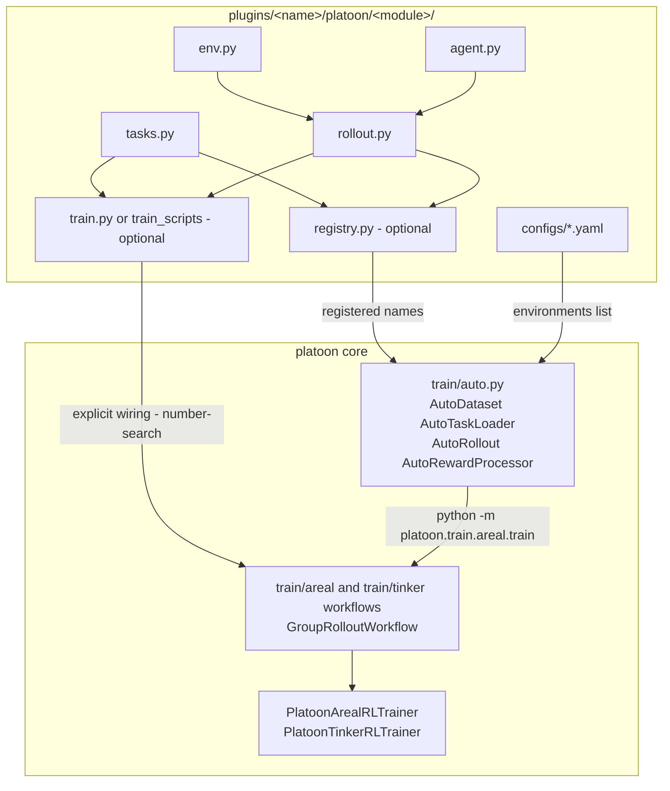

# Anatomy of a plugin

This page reads two real plugins file by file. `plugins/number-search` is the smallest complete
plugin in the repository — five modules, one action, a binary reward. `plugins/textcraft` is the
largest: a procedurally generated benchmark, three rollout variants, a component registry module,
and configs for both backends. Part one is the shape; part two is what the shape grows into.

A plugin is an ordinary Python distribution that ships one subpackage inside the `platoon`
namespace. It supplies the four things core Platoon cannot know — the tasks, the environment, the
agent's prompt, and the rollout function that wires them together — and inherits everything else
(the episode loop, the group-rollout workflow, advantage computation, batching, logging) from
`platoon.train.areal` and `platoon.train.tinker`. For the concepts behind those pieces see
[core concepts](../get-started/concepts.md); for the registry layer see
[the registry](../architecture/registry.md).

!!! info "Two shapes, one branch"
    This branch is mid-migration. The **registry shape** — register your components once, then
    drive the shared entrypoints `python -m platoon.train.areal.train` /
    `python -m platoon.train.tinker.train` entirely from YAML — is new. The **per-plugin script
    shape** — a bespoke `train.py` that imports your rollout function and builds the dataset
    inline — is what most plugins, including `number-search`, still use. `textcraft` is the only
    plugin in the tree with a registry module, and only one of its configs is wired for the shared
    entrypoint. Both paths work; this page shows both and says which is which.

---

## Part one: `number-search`, the minimal plugin

The task: a hidden integer sits inside an announced range, the agent calls `guess(n)`, and the
environment answers "Too low", "Too high", or ends the episode. It is a smoke test — the fastest
way to confirm that a trainer, a proxy endpoint, and a rollout worker all talk to each other.

### The file tree

```text title="plugins/number-search"
plugins/number-search/
├── pyproject.toml                                    #  73 lines
├── uv.lock                                           #  per-plugin lock file
├── README.md                                         #  44 lines
└── platoon/                                          #  NO __init__.py here
    └── number_search/
        ├── __init__.py                               #   0 lines (empty)
        ├── tasks.py                                  # 184 lines
        ├── env.py                                    #  31 lines
        ├── agent.py                                  #  57 lines
        ├── rollout.py                                #  71 lines
        ├── train.py                                  #  54 lines  (AReaL)
        ├── train_tinker.py                           #  81 lines  (Tinker)
        ├── number_search_train.jsonl                 # 50 000 tasks
        ├── number_search_val.jsonl                   #  1 000 tasks
        ├── number_search_tinker.yaml                 #  65 lines
        ├── number_search_areal.yaml                  # 165 lines
        ├── nv_number_search_areal.yaml               # 165 lines
        ├── nv_number_search_cispo_areal.yaml         # 170 lines
        └── nv_number_search_cispo_areal-1.yaml       # 170 lines
```

That is the entire plugin: 478 lines of Python, five YAML files, two JSONL datasets.

Two naming details bite newcomers. The directory under `plugins/` uses a hyphen
(`plugins/number-search`), the importable module an underscore (`platoon.number_search`), and the
distribution name is a third string (`platoon-number-search`, from
<span class="pl-src">plugins/number-search/pyproject.toml</span>). And the intermediate
`platoon/` directory must **not** contain an `__init__.py`. Core Platoon's own
`platoon/__init__.py` is three lines —

```python title="platoon/__init__.py"
from pkgutil import extend_path

__path__ = extend_path(__path__, __name__)
```

— which rescans `sys.path` for every directory named `platoon` and splices them into one package.
An `__init__.py` in the plugin's shim directory would shadow that and break the import.

### `tasks.py` — generate offline, look up by id at runtime

Two halves: the first generates the dataset, the second serves it.

Generation is `create_number_search_datasets(seed=42, num_samples=50000, eval_size=1000,
min_bound=0, max_bound=1024)`. It draws a target, then a bracketing window `(low, high)` with
`low < target < high`, dedupes on the `(low, target, high)` triplet, and assigns each triplet to
train or validation by hashing it:

```python title="plugins/number-search/platoon/number_search/tasks.py"
def is_val_triplet(low: int, target: int, high: int) -> bool:
    h = int(hashlib.sha256(f"{seed}:{low}:{target}:{high}".encode()).hexdigest()[:8], 16)
    return (h / 0xFFFFFFFF) < p_val
```

The split is therefore a deterministic function of the content, not of the sampling order: regrow
the dataset with a larger `num_samples` and the old validation triplets stay in validation. Each
row is one JSON-serialized `Task`:

```json
{"goal": "Guess the correct number between 6 and 988.", "id": "number_search.train.0", "max_steps": 1, "misc": {"low": 6, "high": 988, "target": 228}}
```

The serving half is three functions. `get_task_ids(split, num_samples_train=50000,
num_samples_val=1000)` only formats id strings — it never touches the file. `load_task_from_disk`
slurps the whole JSONL into a module global on first use and parses one line. `get_task(id)`
memoizes the parsed `Task` in a module-level `TASKS` dict.

That cache has a consequence. The workflow overwrites `task.max_steps` from
`rollout_config.max_steps` before each rollout
(<span class="pl-src">platoon/train/areal/workflows/group_rollout_workflow.py</span>,
<span class="pl-src">platoon/train/tinker/workflows/group_rollout_workflow.py</span>), and
because the `Task` object is cached, the mutation persists for the life of the process. The
`max_steps: 1` baked into the JSONL is not what runs; `workflow_config.rollout_config.max_steps`
(10, in every shipped config) is.

Regenerating the datasets is a module CLI:

```bash
# from plugins/number-search
uv run python -m platoon.number_search.tasks --num_samples 50000 --eval_size 1000
```

!!! warning "`get_task_ids` positional arguments"
    Both train scripts call `get_task_ids("val", 100)`
    (<span class="pl-src">plugins/number-search/platoon/number_search/train.py</span>,
    <span class="pl-src">plugins/number-search/platoon/number_search/train_tinker.py</span>).
    The second positional parameter is `num_samples_train`, not a generic count, so for the `"val"`
    split it is ignored and the function returns all 1 000 validation ids. Nothing crashes, but
    evaluation is ten times larger than the code reads. Pass `num_samples_val=100` if you want 100.

**If this were your task:** this is the file you rewrite most. Keep the two-function contract —
some way to enumerate ids, and `get_task(task_id) -> Task` — because that is all the trainer needs
(`TaskLoader.__call__(task_id: str) -> Task`, at
<span class="pl-src">platoon/train/components.py</span>). Everything else here (JSONL on
disk, hashed split, module-global cache) is convention you can replace with a Hugging Face load, a
parquet file, or a live API.

### `env.py` — the action space and the reward, in 31 lines

Quoted in full, because this is all a Platoon environment is:

```python title="plugins/number-search/platoon/number_search/env.py"
def guess_factory(target: int):
    def guess(number: int) -> str:
        if number == target:
            finish_message.set(f"You guessed the number {target} correctly!")
        elif number < target:
            return "Too low, try again."
        else:
            return "Too high, try again."

    return guess


class NumberSearchEnv(CodeActEnv):
    def __init__(self, task: Task):
        super().__init__(task, IPythonCodeExecutor(task, actions=(finish, guess_factory(task.misc["target"]))))

    async def evaluate(self) -> tuple[float, dict]:
        score, reward_misc = 0.0, {}
        if self._state.finished:
            message = finish_message.get(None)
            if message is not None and "correctly" in message:
                return 1.0, {}
            else:
                return 0.0, {}
        return score, reward_misc
```

Three mechanisms do all the work.

**Actions are plain callables.** `IPythonCodeExecutor` puts each one into the agent's Python
namespace under its own `__name__`
(<span class="pl-src">platoon/envs/codeact/env.py</span>). Because `guess_factory` returns
a closure named `guess`, the agent sees a function that already knows the answer — the target never
appears in the prompt. Closing over per-task state is the standard way to give an action private
context.

**`finish_message` is the termination channel.** It is a context variable. Setting it makes
`CodeActEnv.step` flip `self._state.finished`, and `halt_episode` stops the loop
(<span class="pl-src">platoon/episode/loop.py</span>). The imported `finish` action sets it
too, so the agent can always give up.

**`evaluate()` runs on every step**, not just the last. `CodeActEnv.step` calls it right after the
code executes:

```python title="platoon/envs/codeact/env.py"
step = await self._code_executor.run(action.parsed_code)

if finish_message.get(None) is not None or error_message.get(None) is not None:
    self._state.finished = True
    self._state.misc["finish_message"] = finish_message.get()

step.thought = action.parsed_thought
step.reward, reward_info = await self.evaluate()
step.misc["action_misc"] = action.misc
step.misc["reward_misc"] = reward_info
```

The second return value lands in `step.misc["reward_misc"]`, where reward processors look.
`number-search` returns an empty dict, so no per-key metrics reach the logs.

!!! warning "Do not copy the substring check"
    `"correctly" in message` is the actual success test, and it works only because `guess_factory`
    is the sole writer of that word. It is a smoke test's shortcut, not a pattern. Score against
    task state — `task.misc`, an oracle, an inventory diff — the way `textcraft` does below.

**If this were your task:** replace the actions tuple and the body of `evaluate()`. Emit keys
prefixed `reward/` in the second return value if you want them aggregated by the standard reward
processors. For sub-agents, also implement `async def fork(self, task) -> Env` and give the
executor its own `fork`.

### `agent.py` — usually only a system prompt

`NumberSearchPromptBuilder` overrides exactly one method, `build_system_prompt`, and branches on
whether `<thought>` blocks are wanted:

```python title="plugins/number-search/platoon/number_search/agent.py"
        else:
            return """Solve the problem step by step. Write your action in <python> </python> tags.
Your answer must call guess(number: int) with the guessed number as an integer.

Example:
<python>
guess(42)
</python>
"""
```

That `else` branch is the one that runs, because the rollout constructs the agent with
`include_reasoning=False`.

`NumberSearchAgent` is pure plumbing: if the caller did not pass a `prompt_builder`, build the
plugin's own and forward `prompt_mode` / `include_reasoning` to `CodeActAgent`. The base agent
supplies everything else — the chat call, `<thought>`/`<python>` parsing, and a loop detector that
injects `finish('Stuck in a loop, terminating early.')` when it sees a repeating action pattern
(<span class="pl-src">platoon/agents/codeact/agent.py</span>).

**If this were your task:** the system prompt is the minimum. `CodeActPromptBuilder` also exposes
`build_user_prompt`, `build_next_action_str` and `build_action_history_description`, and ships
Jinja templates under `platoon/agents/codeact/prompts/`. The action-space description does *not*
come from the prompt builder but from the executor's `describe_action_space()`, which is why
`textcraft` writes its action documentation inside `env.py`.

### `rollout.py` — the function every trainer calls

`async def run_rollout(task: Task, config: RolloutConfig) -> dict | TrajectoryCollection` is the
contract (`RolloutFn`, <span class="pl-src">platoon/train/components.py</span>). In order:

1. Build a `LiteLLMClient` from `config.model_name` / `model_endpoint` / `model_api_key`. The
   workflow fills those three in at call time, pointing at the trainer's own proxy — that is how
   sampling stays on-policy against the actor being trained.
2. Build the env, then the agent — `NumberSearchAgent(llm_client=..., include_reasoning=False,
   inference_params=config.inference_params)`.
3. Create a **fresh** `TrajectoryCollection` and set the `current_trajectory_collection` context
   variable *before* the episode starts. `CodeActEnv.reset` reads it, so a rollout that skips this
   fails.
4. Attach a `JsonlFileSink` at `{config.output_dir}/events/events_{task.id}_{collection.id}.jsonl`.
   That file is what the visualization TUI tails.
5. Run the episode inside `asyncio.create_task`, wrapped in `asyncio.wait_for`:

```python title="plugins/number-search/platoon/number_search/rollout.py"
        rollout_task = asyncio.create_task(run_episode(agent, env))

        try:
            _ = await asyncio.wait_for(rollout_task, timeout=config.timeout)
        except asyncio.TimeoutError:
            ...
            rollout_task.cancel()
            with suppress(asyncio.CancelledError):
                await rollout_task
            raise
```

6. Return `collection.to_dict()` when `config.return_dict` is set, otherwise the collection itself.
   Both training workflows force `return_dict = True`, so the dict branch is what runs during
   training.
7. `close()` the agent and the env in a `finally`.

The `create_task` wrapper is not decoration: the comment above `run_episode`
(<span class="pl-src">platoon/episode/loop.py</span>) says it exists so the episode's
context-variable edits do not leak into the caller's context.

Two timeouts are easy to confuse. `run_episode(agent, env, timeout=...)` is the **per-step**
deadline, applied separately to `agent.act` and `env.step`; the outer `wait_for` is the
**whole-trajectory** deadline. `number-search` calls `run_episode(agent, env)` with no timeout
argument, so it takes the default of 300 seconds per step and ignores `config.step_timeout`
entirely. `textcraft` passes `timeout=config.step_timeout`. If your steps are slow, pass it.

**If this were your task:** copy this file almost verbatim and change the two constructor lines,
preserving the fresh collection, the context variable set before `run_episode`, the `create_task`
wrapper, and the `finally` block.

### `train.py` — the AReaL entrypoint, and where the legacy shape shows

54 lines, run **by path**, not as a module:

```python title="plugins/number-search/platoon/number_search/train.py"
def main(args):
    config, _ = load_expr_config(args, PlatoonArealRLTrainerConfig)
    config: PlatoonArealRLTrainerConfig = config

    # TODO: Design a TaskLoader protocol and add configs + factory for this.
    train_dataset = Dataset.from_list([{"task_id": x} for x in get_task_ids("train", 1000)])
    val_dataset = Dataset.from_list([{"task_id": x} for x in get_task_ids("val", 100)])
```

That TODO is the opening admonition in miniature. The protocol it asks for now exists —
`TaskLoader` and `DatasetLoader` in
<span class="pl-src">platoon/train/components.py</span>, resolved by the `Auto*` factories in
<span class="pl-src">platoon/train/auto.py</span> — but `number-search` was never migrated onto it.
It builds the dataset inline, hard-codes the two dataset sizes in Python, imports its rollout
function by name, and registers nothing.

The HF dataset rows contain only `{"task_id": ...}`: the trainer never sees a task body, and the
workflow materializes it by calling your task loader.

The rest is the standard AReaL wiring: enter `PlatoonArealRLTrainer` as a context manager, build a
train `GroupRolloutWorkflow` pointed at `trainer.proxy_base_url`, `deepcopy` the workflow config
and force `group_size = 1` for evaluation, then call `trainer.train(...)`. Neither workflow passes
a `reward_processor`, so both use the default,
`lambda traj: (traj["reward"], {})`
(<span class="pl-src">platoon/train/areal/workflows/group_rollout_workflow.py</span>) — the
trajectory's own accumulated reward, with no extra metrics.

**If this were your task:** copy this file and change the three imports, or skip it and take the
registry route in part three.

### `train_tinker.py` — the same wiring, a different loader

Structurally identical, with four differences:

- It is run **as a module** (`python -m platoon.number_search.train_tinker`) and its `main` is a
  coroutine driven by `asyncio.run`.
- It loads config with `platoon.utils.config.load_config`, not AReaL's `load_expr_config` — the
  override-syntax fork, see the box below.
- It sets `default_config_path` to `number_search_tinker.yaml` next to the script, so `--config` is
  optional here.
- It builds two workflows from `config.train.workflow_config` and `config.eval.workflow_config`
  (the Tinker config nests them under `train:` and `eval:`), passing `model_info=trainer.model_info`
  and `log_path=trainer.run_log_path`, and sets `filter_errors=False` on both.

!!! danger "The two override syntaxes are not interchangeable"
    AReaL entrypoints use `areal.api.cli_args.load_expr_config`, which is OmegaConf: overrides are
    **bare `key=value`, no leading dashes**, and `${...}` interpolation works inside the YAML.
    Tinker and inference entrypoints use `platoon.utils.config.load_config`, which is
    argparse-like and **only parses tokens that start with `--`**
    (<span class="pl-src">platoon/utils/config.py</span>). A `key=value` token passed to a
    Tinker script is silently dropped — no error, no warning, your override just does not happen.

### Configs

`number_search_tinker.yaml` (65 lines) is the compact one:
`train.model_name: nvidia/NVIDIA-Nemotron-3-Nano-30B-A3B-BF16`,
`renderer_name: nemotron3_disable_thinking`, `batch_size: 32`, `lora_rank: 32`, `loss_fn: cispo`
with `clip_low_threshold: 0.0` / `clip_high_threshold: 5.0`, `workflow_config.group_size: 8`,
`rollout_config.max_steps: 10`, and `eval.strategy: step` with `eval.every: 10`.

The four AReaL configs are near-duplicates. `nv_number_search_cispo_areal.yaml` sets
`actor.path: Qwen/Qwen3-4B-Instruct-2507`, `rollout.backend: sglang:d4p1t1`,
`actor.backend: fsdp:d4p1t1`, `workflow_config.group_size: 8`,
`workflow_config.rollout_config.max_steps: 10`, `inference_params.max_completion_tokens: 512`, and
a `loss_fn_config` block selecting `cispo`. `number_search_areal.yaml` and
`nv_number_search_areal.yaml` are the GRPO variants, differing mainly in `cluster.fileroot`
(`/mnt/efs/...` versus an NVIDIA lustre path); `nv_number_search_cispo_areal-1.yaml` differs from
`nv_number_search_cispo_areal.yaml` only in `trial_name`, output paths, and learning rate.

The interpolation in these files — `tokenizer_path: ${actor.path}`,
`consumer_batch_size: ${train_dataset.batch_size}` — works because AReaL's loader is OmegaConf. It
does not work in the Tinker YAML.

### Running it

Install exactly one backend: the `tinker` and `areal` extras are declared mutually exclusive in the
plugin's `[tool.uv] conflicts`.

=== "AReaL"

    ```bash
    cd plugins/number-search
    uv sync --extra areal

    # train (script run by path)
    uv run python3 platoon/number_search/train.py \
      --config platoon/number_search/nv_number_search_cispo_areal.yaml

    # with overrides - OmegaConf style, NO leading dashes
    uv run python3 platoon/number_search/train.py \
      --config platoon/number_search/nv_number_search_cispo_areal.yaml \
      trial_name=debug-run train_dataset.batch_size=16
    ```

=== "Tinker"

    ```bash
    cd plugins/number-search
    uv sync --extra tinker

    # train (module)
    uv run python -m platoon.number_search.train_tinker \
      --config platoon/number_search/number_search_tinker.yaml

    # with overrides - load_config style, leading dashes REQUIRED
    uv run python -m platoon.number_search.train_tinker \
      --config platoon/number_search/number_search_tinker.yaml \
      --train.batch_size 64
    ```

Rollout events land under `{rollout_config.output_dir}/events/`. Tail or replay them with the
Textual TUI (see [visualization](../tutorials/visualization.md)):

```bash
uv run python -m platoon.visualization.cli tail --rdir ./rollout_results
```

### What `number-search` does not demonstrate

- **It does not register components.** No `registry.py`, no
  `[project.entry-points."platoon.plugins"]` in its `pyproject.toml`, and no `environments:` key in
  any of its configs, so the shared trainer entrypoints cannot drive it as shipped.
- **Its `train.py` builds datasets inline**, sizes hard-coded in Python — the legacy per-plugin
  script shape.
- **No sub-agents and no reward metrics.** `NumberSearchEnv` implements no `fork`, so nothing here
  exercises delegation, depth budgets or subagent reward attribution; `evaluate()` returns an empty
  misc dict, so there are no `reward/*` keys for a processor to aggregate.
- **A one-line reward oracle**, on a substring of `finish_message`, and no inference benchmark
  script — unlike `textcraft` and most other plugins.

---

## Part two: `textcraft`, the rich plugin

The task: craft target items from a starting inventory by combining ingredients according to
recipes, using `craft`, `get_info`, `view_inventory`, `finish` and — in the recursive variants —
`launch_subagent`. `textcraft` ships two worlds: the original Minecraft-recipe environment, and
**TextCraft-Synth**, a procedurally generated crafting world built for deep hierarchies.

### What it adds

```text title="plugins/textcraft/platoon/textcraft"
platoon/textcraft/
├── __init__.py                     #   59  re-export surface
├── README.md                       #   98
├── recipe_loader.py                #  297  parses the 860 Minecraft recipe JSONs
├── tasks.py                        #  707  original TextCraft: solver, dataset, CLI
├── synth_recipe_generator.py       #  503  procedural recipe world + CLI
├── synth_recipe_loader.py          #  122  adapts the synth DB to the RecipeDatabase interface
├── synth_tasks.py                  #  801  difficulty tiers, solver, dataset, CLI
├── env.py                          # 1073  3 executors + 3 envs + 3 synth factories
├── agent.py                        #  293  3 prompt builders + 3 agents
├── rollout.py                      #  144  run_rollout, run_recursive_rollout (Minecraft recipes)
├── synth_rollout.py                #  234  linear / depth-aware / recursive (synth)
├── registry.py                     #  112  the registry module
├── areal_config.py                 #   11  4 extra trainer-config fields
├── recipes/*.json                  #  860 files (upstream Minecraft data)
├── synth_recipes/*.json            #  383 files (inspection dump - see the warning below)
├── textcraft_train.jsonl / _val    # 1 000 / 100 rows
├── textcraft_synth_train.jsonl     # 2 522 rows
├── textcraft_synth_val.jsonl       #   632 rows
├── train_scripts/{areal,tinker}/   # 6 scripts, 83-166 lines each
├── inference_scripts/              # 3 scripts, incl. a 780-line difficulty analysis
└── configs/{areal,tinker,inference}/  # 20 + 4 + 2 YAML files
```

None of `train_scripts/`, `inference_scripts/` or `configs/` has an `__init__.py`; they work as
PEP 420 namespace portions, which is why
`python -m platoon.textcraft.train_scripts.tinker.train_tinker` imports.

### The registry module

`registry.py` is the file `number-search` does not have. It registers eight components under
namespaced names — a task loader, a dataset loader, three rollouts, a reward processor, and two
trainer configs:

```python title="plugins/textcraft/platoon/textcraft/registry.py"
@register_task_loader("textcraft/synth")
def load_synth_task(task_id: str):
    return get_synth_task(task_id)


@register_dataset_loader("textcraft/synth")
def load_synth_dataset(
    config: Any,
    split: str,
    difficulties: list[str] | None = None,
    limit: int | None = None,
    num_samples_train: int = 2522,
    num_samples_val: int = 632,
):
    ...


register_rollout("textcraft/synth/linear", run_synth_rollout)
register_rollout("textcraft/synth/recursive", run_synth_recursive_rollout)
register_rollout("textcraft/synth/depth_aware", run_synth_depth_aware_rollout)
```

plus `@register_reward_processor("textcraft/synth/delegation_capped")` and two
`register_trainer_config` calls wrapped in `try/except`.

Three details are load-bearing. The dataset loader's `split` argument is `"train"` or `"eval"` —
never `"val"` — because that is what `AutoDataset.from_config` passes, so the function translates
on its first line (`split_name = "val" if split == "eval" else split`). Its extra keyword arguments
come from the YAML's `dataset_kwargs` / `eval_dataset_kwargs`. And the three rollouts are three
separate names rather than one parameterized entry, because rollout functions receive exactly two
positional arguments — a registered rollout's extra parameters are reachable only through their
defaults.

The plugin also advertises the module through packaging metadata:

```toml title="plugins/textcraft/pyproject.toml"
[project.entry-points."platoon.plugins"]
textcraft = "platoon.textcraft.registry"
```

That group is loaded only when a config asks for it, by setting
`environments[0].discover_entry_points: true`. Naming the module directly with
`package: platoon.textcraft.registry` is more explicit, and it is what every shipped config does.



!!! warning "The top-level `environments:` is registry wiring, and nothing else"
    A top-level `environments:` key in a Platoon trainer config is a **list of
    `EnvironmentConfig`** (<span class="pl-src">platoon/train/components.py</span>) naming
    which registered components to use. Exactly one entry is allowed; more than one raises
    `NotImplementedError`. The `openreward` plugin has an unrelated, nested `environments:` list
    under its own config section, whose entries carry `label`, `env_name`, `session_url` and
    `sampling_weight` — that is a task-source mixture, not registry wiring. They share a name and
    nothing else.

### Three rollout variants, three delegation regimes

All three synth rollouts share `number-search`'s skeleton — LLM client, env, agent, fresh
collection, JSONL sink, `create_task` plus `wait_for` — and differ in which env/agent pair they
construct and how the step budget is accounted.

| Variant | Env factory | Agent | `launch_subagent` signature | Budget |
|---|---|---|---|---|
| Linear | `create_synth_env` | `TextCraftAgent` | not in the action space | default `StepBudgetTracker` |
| Recursive | `create_synth_recursive_env` | `TextCraftRecursiveAgent` | `(targets, num_steps, context="")` | one shared budget; child steps consume the parent's |
| Depth-aware | `create_synth_depth_aware_env` | `TextCraftDepthAwareAgent` | `(targets, context="")` | `DepthAwareStepBudgetTracker(max_depth=6)`; per-agent budget, only tree depth is capped |

The linear variant hides delegation by rendering the action space with `include_subagent=False`
(<span class="pl-src">plugins/textcraft/platoon/textcraft/env.py</span>) even though the executor
defines the method.

The depth-aware variant changes who decides the budget:

```python title="plugins/textcraft/platoon/textcraft/env.py"
class TextCraftDepthAwareCodeExecutor(TextCraftRecursiveCodeExecutor):
    """Code executor for depth-aware budget tracking.

    Subagent budget is fixed at construction time — the agent does not
    specify ``num_steps`` when calling ``launch_subagent``.
    """
```

Its rollout installs the matching tracker before the episode begins:

```python title="plugins/textcraft/platoon/textcraft/synth_rollout.py"
        # Override the task's max_steps so the root agent also uses per_agent_max_steps
        task.max_steps = per_agent_max_steps
        ...
        # Install the depth-aware budget tracker BEFORE run_episode so it
        # is picked up instead of the default StepBudgetTracker.
        budget_tracker.set(DepthAwareStepBudgetTracker(max_depth=max_depth))
```

`per_agent_max_steps=25` and `max_depth=6` are **function defaults, not config keys**. The YAML's
`rollout_config.max_steps: 25` matters only because the workflow copies it onto the task first —
and then the line above immediately overwrites it. To change the per-agent budget you edit the
default or register a new rollout name. See
[recursive agents](../tutorials/recursive-agents.md) for delegation in full.

Both recursive variants honor `config.propagate_root_success` and post-process the returned tree
with `propagate_root_success(result)`; the linear one does not.

### The reward, and the reward processor

`TextCraftEnv.evaluate` gives 1.0 only if the agent called `finish()` **and** every target item was
crafted — the count is a difference against the starting inventory, so a target you were handed for
free earns nothing:

```python title="plugins/textcraft/platoon/textcraft/env.py"
# Check if all target items were CRAFTED (difference from initial inventory)
# This prevents giving credit for items that were already in starting inventory
all_met = True
missing_items = {}
for item, required_count in target_items.items():
    current_count = inventory.get(item, 0)
    initial_count = self._initial_inventory.get(item, 0)
    crafted_count = current_count - initial_count
    if crafted_count < required_count:
        all_met = False
        missing_items[item] = required_count - crafted_count
```

It always emits `reward_misc["reward/success"]`. `TextCraftRecursiveEnv.evaluate` calls that, then
appends `reward/subagent_launched` and `reward/subagent_succeeded` from per-step bookkeeping the
recursive executor maintains.

The registered reward processor sums every `reward/`-prefixed key across all steps of a trajectory
and returns the success term plus a capped delegation bonus:

```python title="plugins/textcraft/platoon/textcraft/registry.py"
    success_reward = rewards_dict.get("reward/success", 0.0)
    score = success_reward
    launched = rewards_dict.get("reward/subagent_launched", 0.0)
    if launched > 0:
        subagent_success_rate = rewards_dict.get("reward/subagent_succeeded", 0.0) / launched
        score += _TEXTCRAFT_SYNTH_DELEGATION_REWARD_CAP * subagent_success_rate
```

`_TEXTCRAFT_SYNTH_DELEGATION_REWARD_CAP = 0.0` today, so the bonus is multiplied by zero:
delegation is rewarded only through whether it helps the root succeed. The two subagent counters
still reach the metrics dict and the logs. The same function is duplicated verbatim inside each
train script — one concrete argument for the registry route, one definition instead of five copies.

Two mechanisms make delegation useful here. Parent and forked child share the inventory dict **by
reference**, so a subagent's crafting is immediately visible to the parent. And
`TextCraftRecursiveEnv.fork` re-parses the child's goal string back into `target_items`, so the
subagent gets a real reward signal instead of inheriting the parent's goal.

### TextCraft-Synth: what it generates, and why it exists

The original TextCraft dataset is built by searching Minecraft recipes for items with crafting
depth 2 to 5 (`create_textcraft_datasets(..., min_depth=2, max_depth=5, ...)`). Two problems
follow. The trees are shallow, so a single agent's step budget is never the binding constraint —
there is nothing for delegation to solve. And the item names are `oak_planks` and `stick`: a
pretrained model already knows the recipes and can succeed without ever querying the environment,
which contaminates a benchmark meant to measure tool use. TextCraft-Synth fixes both by generating
a crafting world from scratch.

**Meaning-free names.** Items are named from generic domain prefixes and generic tier suffixes:

```python title="plugins/textcraft/platoon/textcraft/synth_recipe_generator.py"
# Generic prefixes: no semantic meaning, forces agent to use get_info()
DOMAIN_PREFIXES_GENERIC = {
    MaterialDomain.METAL: [f"m{i}" for i in range(10)],  # m0, m1, m2...
    MaterialDomain.CRYSTAL: [f"c{i}" for i in range(10)],  # c0, c1, c2...
    MaterialDomain.ORGANIC: [f"o{i}" for i in range(10)],  # o0, o1, o2...
    MaterialDomain.ARCANE: [f"a{i}" for i in range(10)],  # a0, a1, a2...
    MaterialDomain.TECH: [f"t{i}" for i in range(10)],  # t0, t1, t2...
}
```

Tier suffixes are `i0` through `i12`, so a real item name is `a1_i5` or `m0_i1`. A semantic naming
mode exists (`iron_refined`, via `--semantic-names`) and is documented as debug-only. The model
cannot guess a recipe and must call `get_info()`, which returns `can_craft`, `is_base`,
`in_inventory`, `crafting_depth` and the expanded recipes.

**Thirteen tiers, five domains.** `SynthRecipeDatabase.generate_all_recipes(seed,
items_per_domain_tier)` generates, per material domain, tier-0 base materials with no recipe
(`{prefix}_ore` for metal and crystal, `raw_{prefix}` otherwise), then tiers 1-12 of craftable
items. Item count per tier shrinks as `max(1, items_per_tier - tier // 3)`. Ingredients are drawn
from the same domain one or two tiers below, weighted toward nearby tiers, with a cross-tier
ingredient added from tier 4 up; a final pass creates cross-domain items that consume high-tier
items from several domains at once. Low tiers deliberately produce 2-4 items per craft so that base
material requirements do not explode combinatorially at depth 12. Recipes are emitted in Minecraft
`crafting_shapeless` format with items namespaced `synth:`.

**Difficulty comes from depth.** `synth_tasks.py` defines four bands over the target item's
crafting depth:

```python title="plugins/textcraft/platoon/textcraft/synth_tasks.py"
DIFFICULTY_CONFIG = {
    Difficulty.EASY: (2, 3, 1, 3),
    Difficulty.MEDIUM: (4, 6, 1, 3),
    Difficulty.HARD: (7, 9, 1, 2),
    Difficulty.EXTREME: (10, 12, 1, 2),
}
```

The tuple is `(min_depth, max_depth, max_targets, max_count_per_target)`. `max_targets` is 1
everywhere: the current dataset is single-target, sized to fit inside the step budget.

**Every task is verified solvable.** `create_synth_datasets` computes the base materials a target
needs, builds a starting inventory of exactly that plus a small random buffer plus one to three
distractor base items, then runs a two-phase planner: accumulate total requirements bottom-up, then
craft in increasing depth order while simulating the inventory. Tasks whose plan fails are
discarded. The successful plan is stored as `misc["gold_trajectory"]`, which makes post-hoc
difficulty analysis possible. Every task gets `max_steps = 75` — "Fixed budget for all tasks;
agents should batch actions."

**Train and validation are item-disjoint.** For every tier at or above 1, the item list is shuffled
with the seeded RNG and the last 20% (`val_item_fraction=0.2`) become validation-only targets. The
function asserts zero overlap before returning, so the model never sees a validation target item
during training.

The shipped dataset, measured from the committed files:

| File | Rows | easy | medium | hard | extreme | Depths |
|---|---:|---:|---:|---:|---:|---|
| `textcraft_synth_train.jsonl` | 2 522 | 588 | 852 | 544 | 538 | 2-12 |
| `textcraft_synth_val.jsonl` | 632 | 147 | 213 | 136 | 136 | 2-12 |

A representative row (abbreviated):

```json
{"goal": "Craft the following items: 3x a1_i5", "id": "textcraft_synth.train.0", "max_steps": 75,
 "misc": {"target_items": {"a1_i5": 3}, "initial_inventory": {"...": 1},
          "gold_trajectory": [{"action": "craft", "target": ["a9_i1", 4], "ingredients": {"raw_a1": 8}, "result_count": 12}],
          "difficulty": "medium", "max_depth": 5, "num_craft_steps": 22}}
```

!!! warning "2 522 and 632, not 10 000 and 1 000"
    The CLI defaults ask for 10 000 train and 1 000 validation tasks, but generation runs out of
    unique single-target combinations and only warns. `get_synth_task_ids` still defaults to
    `num_samples_train=10000` / `num_samples_val=1000`, which produces ids that raise `IndexError`
    on load. Every caller therefore passes the real sizes explicitly —
    `num_samples_train=2522, num_samples_val=632` in `registry.py` and in `train_areal_synth.py`.
    Do the same in anything you write against this dataset.

!!! warning "`synth_recipes/` is a dump, not the source of truth"
    Nothing loads `plugins/textcraft/platoon/textcraft/synth_recipes/`. `SynthRecipeLoader`
    regenerates the world in memory from `seed=42, items_per_domain_tier=25`, and
    `create_synth_datasets` regenerates it the same way — the env and the dataset agree because
    both re-derive it, not because they read a file. The committed directory was written by the
    CLI, whose `--items-per-tier` default is 8, so it describes a **smaller** world than the one
    that runs. The invariant, stated in the factory docstrings: if you regenerate the dataset with
    a different `items_per_domain_tier`, pass the same value to
    `create_synth_env*(items_per_domain_tier=...)`.

### Configs and commands

`textcraft` ships 20 AReaL configs, 4 Tinker configs and 2 inference configs. The AReaL family is a
matrix over context length, rollout style and difficulty, with `nv_` variants (NVIDIA lustre
`fileroot`) and `_prealloc_2node` variants (`scheduler.type: slurm_prealloc`, `cluster.n_nodes: 2`,
`sglang:d8p1t1`). Within a row the files differ by only a handful of lines: the `recursive:` /
`depth_aware:` flags, `train_difficulties`, `rollout_config.max_steps` (200 for linear and
recursive, 25 for depth-aware), and paths.

!!! note "The `ctxNNNN` in a filename is a label, not a guarantee"
    `textcraft_synth_ctx8192_linear_medium_areal.yaml` sets `sglang.context_length: 8193`, but
    `textcraft_synth_ctx8192_depth_aware_medium_areal.yaml` sets `40001` with
    `max_completion_tokens: 8192`. Read the actual `sglang.context_length` and
    `inference_params.max_completion_tokens` in whichever file you pick.

The four extra top-level keys those configs use come from an 11-line subclass:

```python title="plugins/textcraft/platoon/textcraft/areal_config.py"
@dataclass
class TextCraftSynthArealTrainerConfig(PlatoonArealRLTrainerConfig):
    train_difficulties: list[str] | None = None
    eval_difficulties: list[str] | None = None
    recursive: bool = False
    depth_aware: bool = False
```

`train_areal_synth.py` passes that subclass to `load_expr_config` and picks the rollout from the
flags, **depth-aware first**:

```python title="plugins/textcraft/platoon/textcraft/train_scripts/areal/train_areal_synth.py"
    if config.depth_aware:
        rollout_fn = run_synth_depth_aware_rollout
    elif config.recursive:
        rollout_fn = run_synth_recursive_rollout
    else:
        rollout_fn = run_synth_rollout
```

Commands:

=== "AReaL"

    ```bash
    cd plugins/textcraft
    uv sync --extra areal

    # TextCraft-Synth: one script, rollout selected by the config flags
    uv run python3 platoon/textcraft/train_scripts/areal/train_areal_synth.py \
      --config platoon/textcraft/configs/areal/textcraft_synth_ctx8192_linear_medium_areal.yaml

    uv run python3 platoon/textcraft/train_scripts/areal/train_areal_synth.py \
      --config platoon/textcraft/configs/areal/textcraft_synth_ctx8192_recursive_medium_areal.yaml

    uv run python3 platoon/textcraft/train_scripts/areal/train_areal_synth.py \
      --config platoon/textcraft/configs/areal/textcraft_synth_ctx8192_depth_aware_medium_areal.yaml

    # original TextCraft (Minecraft recipes, recursive rollout)
    uv run python3 platoon/textcraft/train_scripts/areal/train_areal.py \
      --config platoon/textcraft/configs/areal/textcraft_areal.yaml
    ```

=== "Tinker"

    ```bash
    cd plugins/textcraft
    uv sync --extra tinker

    # one script per rollout style
    uv run python -m platoon.textcraft.train_scripts.tinker.train_tinker_synth \
      --config platoon/textcraft/configs/tinker/textcraft_synth_tinker.yaml

    uv run python -m platoon.textcraft.train_scripts.tinker.train_tinker_synth_recursive \
      --config platoon/textcraft/configs/tinker/textcraft_synth_recursive_tinker.yaml

    uv run python -m platoon.textcraft.train_scripts.tinker.train_tinker_synth_depth_aware \
      --config platoon/textcraft/configs/tinker/textcraft_synth_depth_aware_tinker.yaml

    # original TextCraft
    uv run python -m platoon.textcraft.train_scripts.tinker.train_tinker \
      --config platoon/textcraft/configs/tinker/textcraft_tinker.yaml
    ```

The registry route replaces all four Tinker scripts with one entrypoint. Exactly one shipped config
is wired for it — `configs/tinker/textcraft_synth_depth_aware_tinker.yaml`, whose first 22 lines
are the entire wiring:

```yaml title="plugins/textcraft/platoon/textcraft/configs/tinker/textcraft_synth_depth_aware_tinker.yaml"
environments:
  - package: platoon.textcraft.registry
    trainer_config: textcraft/synth/tinker
    dataset_loader: textcraft/synth
    eval_dataset_loader: textcraft/synth
    task_loader: textcraft/synth
    rollout: textcraft/synth/depth_aware
    reward_processor: textcraft/synth/delegation_capped
    workflow: group_rollout
    dataset_kwargs:
      difficulties: ["medium"]
      num_samples_train: 2522
      num_samples_val: 632
    eval_dataset_kwargs:
      difficulties: null
      limit: 100
      num_samples_train: 2522
      num_samples_val: 632
```

```bash
# from plugins/textcraft
uv run python -m platoon.train.tinker.train \
  --config platoon/textcraft/configs/tinker/textcraft_synth_depth_aware_tinker.yaml
```

The same file is also a valid target for `train_tinker_synth_depth_aware.py`, which ignores the
`environments:` block entirely and hard-wires the same components in Python. That is the migration
in miniature: one config, two ways to run it.

The AReaL side is not there yet.
`configs/areal/textcraft_synth_ctx40000_depth_aware_medium_areal.yaml` carries a **commented-out**
`environments:` block, and no AReaL config in the tree has a live one, so
`python -m platoon.train.areal.train` has nothing to run against here without uncommenting and
adapting it. The checklist below says why that is not a trivial edit.

Regenerating the data (from `plugins/textcraft`; both datasets are committed, so this is optional):

```bash
uv run python -m platoon.textcraft.tasks --num_samples 10000 --eval_size 1000
uv run python -m platoon.textcraft.synth_recipe_generator \
  --output-dir platoon/textcraft/synth_recipes --seed 42
uv run python -m platoon.textcraft.synth_tasks --num_samples 10000 --eval_size 1000 --seed 42
```

Running the benchmark against any OpenAI-compatible endpoint (see
[inference](../tutorials/inference.md)):

```bash
uv run python platoon/textcraft/inference_scripts/run_inference.py \
  --config platoon/textcraft/configs/inference/textcraft_inference.yaml

uv run python platoon/textcraft/inference_scripts/run_synth_inference.py \
  --config platoon/textcraft/configs/inference/textcraft_synth_inference.yaml
```

!!! warning "Always pass `--config` explicitly"
    Several `textcraft` scripts compute a `default_config_path` that does not exist.
    `train_scripts/tinker/train_tinker.py`, `train_tinker_synth.py` and
    `train_tinker_synth_recursive.py` look for a YAML next to the script rather than in
    `configs/tinker/`, and `inference_scripts/run_inference.py` looks under
    `inference_scripts/configs/`. Only `train_tinker_synth_depth_aware.py` and
    `run_synth_inference.py` have correct relative paths. Passing `--config` sidesteps it.
    Those same scripts' docstrings also carry stale module paths, and
    `train_tinker_synth.py` shows an override example in the wrong syntax.

---

## Part three: the two side by side, and a checklist

### Comparison

| | `number-search` | `textcraft` |
|---|---|---|
| Purpose | smoke test for the training stack | recursive-agent research benchmark |
| Python LOC | 478 | ~4 350 in modules, ~1 900 more in scripts |
| Task source | one JSONL, hash-split | Minecraft recipes plus a generated world, item-disjoint split |
| Actions | `finish`, `guess` | `finish`, `craft`, `get_info`, `view_inventory`, `launch_subagent`, `safe_asyncio` |
| Reward | substring test on `finish_message` | crafted-count diff against the starting inventory |
| Reward metrics | none | `reward/success`, `reward/subagent_launched`, `reward/subagent_succeeded` |
| Reward processor | default (`traj["reward"]`) | registered `textcraft/synth/delegation_capped` |
| Sub-agents | no | yes: recursive and depth-aware variants |
| Rollout functions | 1 | 5 (2 original, 3 synth) |
| Prompt builders | 1 | 3 |
| `registry.py` | absent | present, 8 registrations |
| Entry point in `pyproject.toml` | absent | `[project.entry-points."platoon.plugins"]` |
| Custom trainer config | none | `TextCraftSynthArealTrainerConfig`, 4 extra keys |
| Train scripts | `train.py`, `train_tinker.py` | 6, under `train_scripts/{areal,tinker}/` |
| Inference scripts | none | 3, including a difficulty analysis |
| Configs | 4 AReaL, 1 Tinker | 20 AReaL, 4 Tinker, 2 inference |
| Runs on the shared entrypoints | no | Tinker only, via one config |

### A checklist for starting your own

1. **Scaffold the distribution.** `plugins/<my-task>/` with a `pyproject.toml`, and inside it a
   `platoon/` directory with **no `__init__.py`** holding `platoon/<my_task>/`. Copy
   `plugins/number-search/pyproject.toml` and change the name, description and author; keep the
   `[tool.uv] override-dependencies` block verbatim (uv only honors overrides declared by the root
   project, and each plugin is its own root), `[tool.uv.sources] platoon = { path = "../..",
   editable = true }` and `[tool.hatch.build.targets.wheel] packages = ["platoon"]`.
2. **Write `tasks.py`.** You need `get_task(task_id) -> Task` at minimum. Give ids a stable prefix
   you can recognize later; several environments discriminate root tasks from forked sub-agent
   tasks by a substring test on the id.
3. **Write `env.py`.** Subclass `CodeActEnv`, pass an `IPythonCodeExecutor` with your actions
   tuple, and implement `evaluate() -> tuple[float, dict]`. Emit `reward/`-prefixed keys in the
   dict if you want them aggregated. Remember `evaluate()` runs on every step.
4. **Write `agent.py`.** Subclass `CodeActPromptBuilder` and override `build_system_prompt`; wrap
   it in a `CodeActAgent` subclass that installs your builder by default.
5. **Write `rollout.py`.** Copy `number-search`'s `run_rollout` and change the env and agent lines.
   Preserve the fresh `TrajectoryCollection`, the context variable set before `run_episode`, the
   `asyncio.create_task` wrapper, and the `finally` that closes both objects. Pass
   `timeout=config.step_timeout` to `run_episode` unless you want the 300-second default.
6. **Pick a wiring route.**
    - *Registry (recommended).* Write a `registry.py` that registers your task loader, dataset
      loader and rollout under namespaced names — `"<plugin>/<variant>"`, because duplicate names
      across two installed plugins are a hard error at import time. Add an `environments:` block to
      your YAML with `package: platoon.<my_task>.registry` and run
      `python -m platoon.train.tinker.train --config ...`. Registration is optional even here: any
      spec the registry does not recognize is treated as a dotted import path, so
      `rollout: platoon.my_task.rollout.run_rollout` works with no registry module at all.
    - *Per-plugin script.* Copy `number-search`'s `train.py` and `train_tinker.py` and change the
      imports. This is what most of the tree does today.
7. **Write one config per backend.** Start from `number_search_tinker.yaml` (65 lines) or the
   nearest `textcraft` AReaL config. Remember the two override syntaxes.
8. **Verify the install.** `cd plugins/<my-task> && uv sync --extra tinker` (or `--extra areal` —
   they conflict, so pick one), then check that `uv run python -c "import platoon.<my_task>"`
   resolves. If it does not, look for a stray `__init__.py` in the shim directory.
9. **Smoke-test a single rollout before you train.** Run the inference path against a local
   endpoint and read the events JSONL. Debugging an environment inside a distributed trainer is far
   more expensive.

!!! warning "Two known gaps in the registry route"
    `environments[0].trainer_config` is registerable and settable, and `textcraft` sets it — but
    **no code reads it**. The shared entrypoints hard-code `PlatoonArealRLTrainerConfig`
    (<span class="pl-src">platoon/train/areal/train.py</span>) and
    `PlatoonTinkerRLTrainerConfig` (<span class="pl-src">platoon/train/tinker/train.py</span>).
    The practical consequence lands on AReaL: a config for `python -m platoon.train.areal.train`
    cannot use a plugin's custom trainer-config subclass, so a knob like `train_difficulties` has
    to be expressed through `dataset_kwargs` instead. Separately, `workflow: group_rollout` is a
    sentinel meaning "use the backend default", not a registry entry — nothing calls
    `register_workflow` anywhere, so any other value must be a dotted import path.

## See also

- [Build a plugin](../tutorials/build-a-plugin.md) — the same material as a guided tutorial.
- [The registry](../architecture/registry.md) — names, entry points and the `Auto` factories.
- [Group rollout workflow](group-rollout-workflow.md) — what happens to the dict your rollout returns.
- [Custom environment](../customization/environment.md) and [custom agent](../customization/agent.md).
- [Packaging](../customization/packaging.md) — distribution and namespace details in depth.
- [TextCraft tutorial](../tutorials/textcraft.md) — running the benchmark end to end.
- [Recursive agents](../tutorials/recursive-agents.md) — delegation, budgets and depth.
