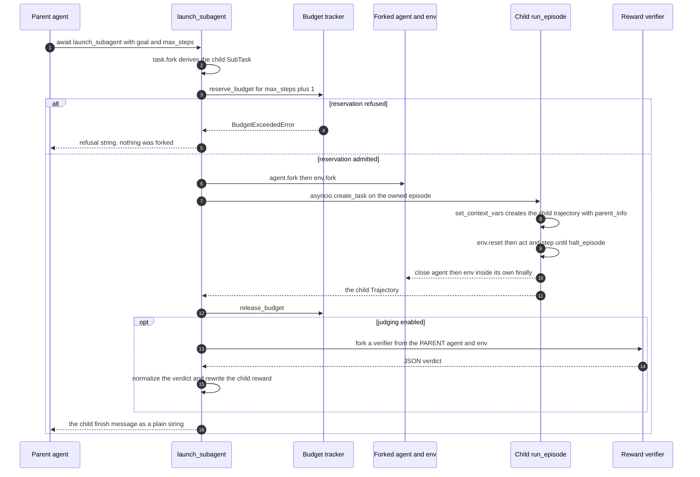

# A sub-agent call

This page follows one `launch_subagent` call end to end: budget admission, forking, a complete
nested episode, cleanup, the optional synthetic reward verifier, and the string that lands back in
the parent's observation. Every step is anchored to
<span class="pl-src">platoon/agents/actions/subagent.py</span> and the episode machinery it leans on.

Read this when you are adding delegation to a plugin, when a child trajectory is not showing up in
your training data, or when a delegation is silently returning nothing.

## The whole call in one picture



Two details in that diagram cause most of the confusion. On the success path the forks close
*before* the budget is released, because `run_episode` owns them by then. And the verifier forks
from the **parent's** agent and environment, not the child's — by the time judging starts, the
child's environment has already been closed.

## 1. The agent emits the call

`launch_subagent` is an ordinary coroutine, tied to no particular agent implementation: it reads the
current agent, environment, trajectory and budget tracker out of contextvars, so any code running
inside an episode can call it.

In a CodeAct environment the function is injected into the executor's action tuple, so the model
writes it as Python. TextCraft wraps it to give the goal a domain shape:

```python title="plugins/textcraft/platoon/textcraft/env.py"
    async def launch_subagent(self, targets: Dict[str, int], num_steps: int, context: str = "") -> str:
        ...
        target_str = ", ".join([f"{count}x {item}" for item, count in targets.items()])
        goal = f"Craft the following items: {target_str}"

        if context:
            goal += f"\n\nContext provided from parent agent: {context}"

        # Use the general launch_subagent function
        # Inventory is shared by reference, so changes propagate automatically
        result = await _launch_subagent(goal=goal, max_steps=num_steps)

        return result
```

Because the model authors the call site, the executor guards it with an AST pass.
`UnawaitedAsyncCallDetector` (<span class="pl-src">platoon/envs/codeact/env.py</span>) rejects a
cell that calls `launch_subagent` without `await`, and deliberately permits it inside
`gather` / `wait` / `wait_for` / `create_task` / `as_completed`:

```python title="platoon/envs/codeact/env.py"
            if func.attr in ("gather", "wait", "wait_for", "create_task", "as_completed"):
                is_gather_like = True
```

That exemption is how **parallel** delegation is expressed: `await asyncio.gather(launch_subagent(...),
launch_subagent(...))` runs several children concurrently into the same collection.

For an SDK-driven agent the call has to cross a thread boundary. OpenHands executes tools
synchronously on a worker thread, so `LaunchSubagentExecutor` hands the coroutine back to the
episode's event loop through a `LaunchSubagentRuntime` and blocks on a
`concurrent.futures.Future` (<span class="pl-src">plugins/openhands/platoon/openhands/recursive.py</span>).
Note what the action carries:

```python title="plugins/openhands/platoon/openhands/recursive.py"
class LaunchSubagentAction(Action):
    goal: str = Field(description="Task goal for the child agent.")
```

There is no `max_steps` field. In OpenHands the model chooses *what* to delegate, never *how big*
the child's budget is; the executor supplies `self._default_max_steps`, which the rollout sets from
`openreward.subagent_default_max_steps` (default `50`).

## 2. The signature, and what it actually promises

```python title="platoon/agents/actions/subagent.py"
async def launch_subagent(goal: str, max_steps: int = 15, task_misc: dict | None = None, verbose: bool = True) -> Any:
    """Launch a subagent to solve a task.

    Args:
        goal: The goal of the subagent.
        max_steps: The maximum number of steps the subagent can take.

    Returns:
        Returns the result of the subagent's execution.
    """
```

The annotation says `Any`, but every path that returns, returns a `str`. There are four shapes:

| Return value | Produced by | When |
| --- | --- | --- |
| the child's `finish_message` | `_subagent_return_message` | the child called `finish` |
| `"Subagent did not finish before its step budget was exhausted."` | `_subagent_error_message` | the child's error starts with `WARNING: Exhausted budget` |
| `"Subagent failed before finishing."` | `_subagent_error_message` | any other error inside the child episode |
| `"Not enough budget to launch subagent for goal ..."` | `_run_subagent_trajectory` | the reservation was refused |

A fifth case is easy to miss: if the child neither finished nor errored,
`_subagent_return_message` falls through to `traj.finish_message or ""` and the parent receives an
**empty string**. `tests/test_subagent_fork_lifecycle.py` asserts exactly that, for an
environment that reports `finished=True` on `reset`.

!!! warning "It does not swallow every exception"

    The common claim that `launch_subagent` "never raises into the caller" is two-thirds true.
    Errors *inside the child episode* are absorbed — `run_episode` catches `Exception`, records it
    as `traj.error_message`, and the caller sees one of the flattened strings above. But an
    exception raised by `agent.fork` or `env.fork` propagates, and so does
    `asyncio.CancelledError`: `run_episode` re-raises cancellation after finalizing the partial
    trajectory (<span class="pl-src">platoon/episode/loop.py</span>).
    `tests/test_subagent_fork_lifecycle.py` pins the fork case with
    `pytest.raises(RuntimeError, match="environment fork failed")`.

    If you wrap `launch_subagent` in your own tool, decide deliberately what a fork failure should
    look like to the model. OpenHands converts it into an error observation
    (<span class="pl-src">plugins/openhands/platoon/openhands/recursive.py</span>); a CodeAct
    cell surfaces it the way it surfaces any exception in model-authored Python.

`verbose` is accepted and then discarded — `_ = verbose` appears twice, and the nested `run_episode`
is called without it, so it takes its own default of `False`. Passing `verbose=True` does nothing
today.

## 3. Resolving the parent agent, env and task

`launch_subagent` opens a profiling span and delegates to `_run_subagent_trajectory`, whose first
four lines settle what is being forked from:

```python title="platoon/agents/actions/subagent.py"
    # Cast is safe here: launch_subagent only works in contexts with forkable agents/envs
    agent = cast(ForkableAgent, current_agent.get())
    env = cast(ForkableEnv, current_env.get())
    task = parent_traj.task if parent_traj is not None and parent_traj.task is not None else env.task
    task_misc = _propagate_verifier_task_misc(dict(task.misc), task_misc)
```

The `cast` is unchecked. If your agent or environment does not implement `fork`, you find out here,
with an `AttributeError` at fork time rather than an error at wiring time.

`parent_traj` is a keyword-only parameter that **`launch_subagent` never passes**; only the reward
verifier supplies it (step 11). For an ordinary delegation it is `None`, so the base task is
`env.task`, read through the `Env.task` property. The `parent_traj` local inside `launch_subagent`
is a different thing: it feeds the profiling span's `parent_trajectory_id` metadata and nothing else.

## 4. Deriving the child's task

```python title="platoon/agents/actions/subagent.py"
    subtask = task.fork(goal, max_steps, task_misc=task_misc)
```

That single line decides what the child's prompt looks like, and `Task.fork_strategy` picks between
two behaviors (<span class="pl-src">platoon/envs/base.py</span>):

```python title="platoon/envs/base.py"
    def fork(self, goal: str, max_steps: int | None = None, task_misc: dict | None = None) -> Task | SubTask:
        if task_misc is None:
            task_misc = self.misc

        if self.fork_strategy == "task":
            return Task(
                goal=goal,
                max_steps=max_steps,
                id=str(uuid.uuid4()),
                misc=task_misc,
                fork_strategy=self.fork_strategy,
            )
        else:
            return SubTask(
                goal=goal,
                max_steps=max_steps,
                id=str(uuid.uuid4()),
                parent_tasks=[self],
                misc=task_misc,
            )
```

With the default `fork_strategy="subtask"` the child gets a `SubTask` carrying the parent chain, and
`SubTask.__str__` renders that chain into the prompt
(<span class="pl-src">platoon/envs/base.py</span>):

```text
Your Goal: <child goal>
Budget: You have a total budget of <max_steps> steps to complete this task.

For additional context, here are the parent tasks in the stack so far (most recent first):
Level 1: <parent goal>
```

With `fork_strategy="task"` the child gets a bare `Task` — same goal and budget line, **no ancestor
stack**. TextCraft (<span class="pl-src">plugins/textcraft/platoon/textcraft/env.py</span>) and
Oolong (<span class="pl-src">plugins/oolong/platoon/oolong/env.py</span>) both set
`task.fork_strategy = "task"` in their env constructors. The reason is context economy: in a
crafting or long-context retrieval task the sub-goal is self-describing, and prepending the parent's
goal costs tokens and invites the child to re-plan the parent's job.

Three details that bite:

- `SubTask.fork` **overrides** `Task.fork` and always returns a `SubTask`, appending
  `parent_tasks=self.parent_tasks + [self]` (<span class="pl-src">platoon/envs/base.py</span>).
  `fork_strategy` is consulted only while the task is still a plain `Task`, so a grandchild inside a
  `"subtask"` tree can never switch back.
- The child's `max_steps` is exactly the `max_steps` argument. Nothing is inherited from the parent,
  and `None` means unbounded to both budget trackers (`traj.task.max_steps or float("inf")`).
- When `task_misc is None`, `Task.fork` assigns `self.misc` **by reference**. The child's
  `task.misc` is then literally the parent's dict, and an env fork that mutates it mutates the
  parent's task too. `TextCraftEnv.fork` copies defensively before writing:
  `task.misc = task.misc.copy() if task.misc else {}`
  (<span class="pl-src">plugins/textcraft/platoon/textcraft/env.py</span>).

`_propagate_verifier_task_misc` runs immediately before the fork, and is a pass-through for a
normal delegation. Inside a verifier subtree it forces
`subagent_reward_verifier_task: True` onto the child even when the caller supplied its own
`task_misc`, and deliberately drops `subagent_reward_verifies_trajectory_id` so a verifier's helper
cannot masquerade as the direct judge of the solver.

## 5. Classifying the depth scope

```python title="platoon/agents/actions/subagent.py"
    child_depth_scope = _subagent_depth_scope(
        parent_task_misc=dict(task.misc),
        child_task_misc=dict(subtask.misc),
        synthetic_verifier_parent=parent_traj,
    )
```

`_subagent_depth_scope` returns one of the four labels in `SubagentDepthScope`
(<span class="pl-src">platoon/episode/trajectory.py</span>):

| Scope | Meaning |
| --- | --- |
| `policy` | an ordinary delegation; the child is real policy data |
| `verifier_root` | the direct judge of the trajectory named in `subagent_reward_verifies_trajectory_id` |
| `verifier_helper` | a child launched by a `verifier_root` |
| `verifier_descendant` | anything deeper inside the verifier subtree |

The label lets the budget tracker treat synthetic verification differently from policy recursion. It
is passed as a keyword-only argument into `reserve_budget`, so any custom `BudgetTracker` must
accept `child_depth_scope`.

## 6. Reserving budget, before anything is allocated

```python title="platoon/agents/actions/subagent.py"
    tracker = budget_tracker.get()
    reserved_budget = max_steps + 1
    ...
    try:
        tracker.reserve_budget(
            reserved_budget,
            raise_on_failure=True,
            child_depth_scope=child_depth_scope,
        )
    except (BudgetExceededError, ValueError) as e:
        guidance = getattr(e, "guidance", "")
        msg = f"Not enough budget to launch subagent for goal {goal}. {e}"
        if guidance:
            msg += " " + guidance
        return msg
```

Admission comes first on purpose: a refused delegation must not have started a container, an LLM
client, or a sandbox. `tests/test_subagent_fork_lifecycle.py` pins this — after a denial the event
log is exactly `["budget.reserve"]`, no child agent or env was constructed, and the caller's
reservation is back to `0`.

The reservation is `max_steps + 1`, not `max_steps`. The extra step belongs to the parent: it needs
at least one more turn to read the child's answer and act on it.

A refusal is a **return, not a raise**. The model reads an actionable sentence in its next
observation and can shrink the request or do the work itself.

### The two trackers behave differently

`run_episode` installs a plain `StepBudgetTracker` when the contextvar is unset
(<span class="pl-src">platoon/episode/loop.py</span>), so that is the default. Recursive plugins
install the depth-aware tracker before the first episode:
`budget_tracker.set(DepthAwareStepBudgetTracker(max_depth=max_depth))`
(<span class="pl-src">plugins/textcraft/platoon/textcraft/synth_rollout.py</span>, and
<span class="pl-src">plugins/openreward/platoon/openreward/rollout.py</span>).

| | `StepBudgetTracker` | `DepthAwareStepBudgetTracker` |
| --- | --- | --- |
| `used_budget_for(tid)` | the trajectory's own steps **plus every descendant's** | only that trajectory's own steps |
| `remaining_budget_for(tid)` | `allocated - recursive used - reserved` | `allocated - own steps` |
| what `reserve_budget` checks | `remaining_budget() >= requested_budget` | depth only; `requested_budget` is ignored |
| `release_budget` | decrements the caller's reservation, floored at 0 | a no-op |
| refusal `reason` | `"step_budget"` | `"depth"` or `"verifier_depth"` |

`StepBudgetTracker` gives the **whole subtree one shared budget**, taken from the root task's
`max_steps`; every step a grandchild takes reduces what the root has left. That is why the parent
reserves up front: without a reservation, two concurrent `launch_subagent` calls could each fit
inside the remaining budget and jointly overrun it.

`DepthAwareStepBudgetTracker` gives **every trajectory its own independent budget** and bounds the
tree by depth instead. `reserve_budget` discards the requested amount entirely:

```python title="platoon/episode/trajectory.py"
        _ = requested_budget
        if child_depth_scope in {"verifier_root", "verifier_helper"}:
            return True
        if child_depth_scope == "verifier_descendant":
            if raise_on_failure:
                raise BudgetExceededError(
                    "Verifier helper agents may not launch further subagents.",
                    reason="verifier_depth",
                    guidance=(
                        "The synthetic verifier tree allows one helper level. "
                        "Inspect the evidence directly and return it to the verifier."
                    ),
                )
            return False
        if self.max_depth is not None:
            curr_traj_id = current_trajectory.get().id
            current_depth = self._trajectory_depth(curr_traj_id)
            if current_depth + 1 > self.max_depth:
```

Verifier roots and one helper level are exempt from `max_depth` because synthetic verification is
not part of the policy recursion tree. The exemption stops there, which keeps the verifier tree
finite.

### What the model actually reads

With `StepBudgetTracker`, a refused delegation renders roughly as:

```text
Not enough budget to launch subagent for goal <goal>. Requested step budget 16 exceeds remaining
budget 4. Note: launch_subagent will automatically reserve max_steps + 1 steps since you will need
one or more steps to process the result of the subagent and complete the task. You could try
requesting a smaller budget or perform the task yourself.
```

With `DepthAwareStepBudgetTracker` at the cap:

```text
Not enough budget to launch subagent for goal <goal>. Launching a subagent from depth 2 would
exceed the maximum allowed depth of 2. The maximum depth for hierarchical delegation has been
reached. You should perform the task yourself instead of delegating.
```

!!! note "The prefix overstates the case"

    Both messages start with "Not enough budget", because the prefix is formatted at the call site
    regardless of the exception's `reason`. A depth refusal is not a budget problem, and a model
    that reacts by asking for fewer steps gets refused again. If that misreading shows up in your
    rollouts, wrap `launch_subagent` in your plugin and rewrite the message when `reason ==
    "depth"`; `BudgetExceededError.reason` exists precisely so callers can tell the cases apart
    (<span class="pl-src">platoon/episode/trajectory.py</span>).

Both trackers charge the reservation and the release to the **calling** trajectory. The reservation
happens before any `current_trajectory` override, and the release happens after that override has
been reset, so the accounting stays symmetric even for verifier launches.

## 7. Forking the agent, then the environment

```python title="platoon/agents/actions/subagent.py"
    try:
        forked_agent = await agent.fork(subtask)
        forked_env = await env.fork(subtask)
```

Order matters, and so does the cleanup obligation it creates. Both protocols carry the same
docstring (<span class="pl-src">platoon/agents/base.py</span>,
<span class="pl-src">platoon/envs/base.py</span>):

> Return an independently closeable child agent. Implementations that allocate resources before
> returning must clean up partial allocations if the fork raises, including on cancellation.

That is a real contract, not boilerplate: `launch_subagent` can only close handles it was *given*.
If `env.fork` allocates a container and then raises before returning it, nothing upstream
knows the container exists — the launcher's `finally` sees `forked_env is None` and closes only the
agent. Leaks of this shape survive the whole training job.

The launcher's half of the deal:

```python title="platoon/agents/actions/subagent.py"
            # Once the child task starts, run_episode is the sole owner and
            # closes both resources. Before that handoff, close only handles
            # that were successfully returned by their fork methods.
            if not episode_ownership_started.is_set():
                if forked_agent is not None:
                    await _close_episode_resource(forked_agent, "forked agent")
                if forked_env is not None:
                    await _close_episode_resource(forked_env, "forked environment")
```

`_close_episode_resource` (<span class="pl-src">platoon/episode/loop.py</span>) caps each close
at `EPISODE_CLOSE_TIMEOUT_SECONDS = 10.0` and swallows every exception, so one broken `close` cannot
strand a rollout — but it also means close failures are invisible apart from a printed timeout line.

What forking *means* is up to the environment. Two shapes exist in the tree:

- **Shared world state.** `TextCraftEnv.fork` passes `_share_inventory=True` and hands the child the
  same inventory dict object, so items the child crafts appear in the parent's inventory with no
  merge step (<span class="pl-src">plugins/textcraft/platoon/textcraft/env.py</span>).
- **Shared live session, narrowed tools.** `OpenRewardOpenHandsEnv.fork` keeps the same OpenReward
  session but filters the child's tool schema
  (<span class="pl-src">plugins/openreward/platoon/openreward/env.py</span>). `shared` access
  still strips the environment-terminal tools `claim_done` and `submit_answer`, so a child cannot
  submit the root task; `read_only` reduces the child to the allowlist
  `{get_task, get_status, get_tool_details, view}`
  (<span class="pl-src">plugins/openreward/platoon/openreward/env.py</span>).

Agent forking is usually cheaper: `CodeActAgent.fork` rebuilds itself around a forked LLM client,
and `OpenHandsAgent` is stateless enough to `deepcopy`. The full contracts live in
[customizing an agent](../customization/agent.md) and
[customizing an environment](../customization/environment.md).

## 8. Handing ownership to `run_episode`

```python title="platoon/agents/actions/subagent.py"
        parent_token = current_trajectory.set(parent_traj) if parent_traj is not None else None
        try:
            return await asyncio.create_task(
                _run_owned_subagent_episode(
                    forked_agent,
                    forked_env,
                    timeout=episode_step_timeout.get(),
                    ownership_started=episode_ownership_started,
                )
            )
        finally:
            if parent_token is not None:
                current_trajectory.reset(parent_token)
```

`asyncio.create_task` is the load-bearing call. A task runs with a **copy** of the current context,
so every contextvar the child writes — `current_agent`, `current_env`, `current_trajectory`,
`finish_message`, `error_message` — is invisible to the parent. Without that copy, a child calling
`finish` would set the shared `finish_message` contextvar and `halt_episode` would end the
*parent's* episode on its next iteration
(<span class="pl-src">platoon/episode/loop.py</span>).

The child inherits the parent's per-step deadline through `episode_step_timeout.get()`, which the
rollout seeds from `RolloutConfig.step_timeout` (default `300` seconds). That timeout wraps
`agent.act` and `env.step` individually, not the episode as a whole.

The ownership handshake is a one-line wrapper:

```python title="platoon/agents/actions/subagent.py"
async def _run_owned_subagent_episode(
    agent: ForkableAgent,
    env: ForkableEnv,
    *,
    timeout: int,
    ownership_started: asyncio.Event,
) -> Trajectory:
    """Hand fork ownership to ``run_episode`` before its first suspension."""

    ownership_started.set()
    return await run_episode(agent, env, timeout=timeout)
```

Setting the event before the first `await` makes the handoff atomic. From that instant on,
`run_episode`'s `finally` closes both forks and the launcher must not.

## 9. The nested episode, and how the child becomes a child

Nothing in `run_episode` knows it is nested. The tree edge is created by one line in
`set_context_vars`:

```python title="platoon/episode/loop.py"
    parent_traj = current_trajectory.get(None)
    current_trajectory.set(current_trajectory_collection.get().create_trajectory(parent_traj=parent_traj))
```

The launcher's context — copied into the child's task — still holds the *parent's* trajectory in
`current_trajectory`, so `create_trajectory` records the edge
(<span class="pl-src">platoon/episode/trajectory.py</span>):

```python title="platoon/episode/trajectory.py"
        parent_info = (
            ParentInfo(
                id=parent_traj.id,
                fork_step=len(parent_traj.steps),
            )
            if parent_traj is not None
            else None
        )
```

`fork_step` is the parent's step count at fork time. This is the **only** place a `parent_info` link
is ever created. The collection stays a flat `dict[str, Trajectory]`; depth is derived by walking
`parent_info` wherever it is needed — in the budget tracker
(<span class="pl-src">platoon/episode/trajectory.py</span>) and in the data processors.

`set_context_vars` also resets `finish_message` and `error_message` to `None` and installs the
child's agent and env — all inside the copied context. The child episode then runs the ordinary
loop (<span class="pl-src">platoon/episode/loop.py</span>):

```python title="platoon/episode/loop.py"
            obs = await env.reset()
            while not halt_episode(obs):
                action = await asyncio.wait_for(agent.act(obs), timeout=timeout)
                obs = await asyncio.wait_for(env.step(action), timeout=timeout)
                step_count += 1
```

!!! warning "`env.reset()` must attach the task to the child trajectory"

    `create_trajectory` returns a `Trajectory` with `task=None`. Both budget trackers read
    `traj.task.max_steps` in `_allocated_budget`, so if your env's `reset` does not call
    `TrajectoryCollection.set_trajectory_task`, the very first `halt_episode` raises
    `AttributeError` on `None`. `CodeActEnv` does it at
    <span class="pl-src">platoon/envs/codeact/env.py</span>, `OpenHandsEnv` at
    <span class="pl-src">plugins/openhands/platoon/openhands/env.py</span>. Likewise `step` must
    append to the trajectory via `add_trajectory_step`: budget accounting is `len(traj.steps)`, so
    an env that never records steps never runs out of budget.

`halt_episode` stops the child when the observation says `finished`, when a `finish_message` has
been set, or when the tracker says the budget is gone — in which case it also writes the error
message that `_subagent_error_message` later recognizes:

```python title="platoon/episode/loop.py"
        error_message.set("WARNING: Exhausted budget when running episode. Halting episode; task may be incomplete.")
```

`run_episode`'s `finally` closes the agent and env, copies the two contextvars onto the trajectory,
and calls `finish_trajectory` so event sinks see a complete record. Cancellation is re-raised after
that finalization, and cancelled or timed-out trajectories are stamped with `trajectory_cancelled` /
`trajectory_timed_out` in `misc`
(<span class="pl-src">platoon/utils/trajectory_status.py</span>) — markers that later make their
policy tokens ineligible for training while leaving completed siblings usable.

## 10. Cleanup ordering, all three ways

The launcher's `finally` releases the budget synchronously before it considers closing anything:

```python title="platoon/agents/actions/subagent.py"
    finally:
        try:
            # Release synchronously, before cleanup awaits can be cancelled or
            # mutate the trajectory context used by StepBudgetTracker.
            tracker.release_budget(reserved_budget)
        finally:
```

The ordering is not cosmetic. `StepBudgetTracker.release_budget` reads `current_trajectory.get().id`;
if an `await` ran first and were cancelled, the release could be skipped and the parent would carry
a phantom reservation for the rest of its episode.

`tests/test_subagent_fork_lifecycle.py` records every event and pins the exact sequences:

| Outcome | Recorded events, in order |
| --- | --- |
| reservation refused | `budget.reserve` |
| `agent.fork` raises | `budget.reserve`, `agent.fork`, `budget.release` |
| `env.fork` raises | `budget.reserve`, `agent.fork`, `env.fork`, `budget.release`, `child_agent.close` |
| cancelled during `env.fork` | same as the row above |
| cancelled before the handoff | `budget.reserve`, `agent.fork`, `env.fork`, `budget.release`, `child_agent.close`, `child_env.close` |
| success | `budget.reserve`, `agent.fork`, `env.fork`, `child_agent.close`, `child_env.close`, `budget.release` |

The success row is the one that looks wrong at a glance: the closes come *before* the release
because `run_episode` closed both forks inside its own `finally` before returning the trajectory,
and the launcher's `finally` only runs after that. Each test also asserts `close_calls == 1` per
fork — no double close, in any branch.

## 11. The verdict path: the synthetic reward verifier

Back in `launch_subagent`, once a `Trajectory` (not a string) has come back:

```python title="platoon/agents/actions/subagent.py"
        if isinstance(result, str):
            return result
        traj = result
        await _maybe_judge_subagent(goal=goal, traj=traj)
        _ = verbose
        return _subagent_return_message(traj)
```

Judging never changes what the parent *reads*. It changes what the child is *worth*.

### When it runs

`_maybe_judge_subagent` returns immediately unless the `subagent_reward_judge_config` contextvar
holds a `SubagentRewardJudgeConfig` with `max_steps > 0`, and it refuses to judge a trajectory that
is itself a verifier — that second check is what prevents infinite regress. OpenReward sets the
contextvar once per rollout:

```python title="plugins/openreward/platoon/openreward/rollout.py"
    tokens.append(
        subagent_reward_judge_config.set(
            SubagentRewardJudgeConfig(
                max_steps=openreward_config.subagent_reward_judge_max_steps,
                behavior_judge=behavior_judge,
            )
            if openreward_config.enable_subagent_reward_judging
            else None
        )
    )
```

### It fails closed before it starts

Before launching anything, the child is marked pending, given reward `0.0`, and flagged
`exclude_from_policy_training`:

```python title="platoon/agents/actions/subagent.py"
    pending_judgment = {
        "status": "pending",
        "score": 0.0,
        "summary": "Subagent reward verification is still in progress.",
        SUBAGENT_REWARD_JUDGMENT_TRAINING_ELIGIBLE_KEY: False,
    }
    traj.misc[SUBAGENT_REWARD_JUDGMENT_MISC_KEY] = pending_judgment
    _record_judgment_reward(traj, pending_judgment)
    _emit_trajectory_finished_update(traj)
```

If the rollout is cancelled while the verifier is in flight, the completed child cannot be mistaken
for a verified success, and delegation accounting cannot read its stale unverified reward.

### The verifier is a sub-agent like any other

`_maybe_judge_subagent` calls straight back into `_run_subagent_trajectory`, this time with
`parent_traj=traj`. That is the only use of the parameter, and it has two effects: the base task
comes from the judged child rather than from `env.task`, and `current_trajectory.set(parent_traj)`
makes the verifier's `parent_info.id` point at the **judged child**, not at the original delegator
(`tests/test_subagent_judging.py`).

The agent and env being forked are still `current_agent` / `current_env` — the parent's. The child's
environment was closed by `run_episode` before judging began. That is why OpenReward forces the
whole verifier branch to `shared` access: a verifier has to reproduce the child's tool calls
against the live environment, and a generic read-only allowlist cannot express that for environments
where everything goes through `call_tool` or `bash`.

The verifier's prompt is fixed in `_format_verifier_goal`. It embeds the judged trajectory id, the
child's goal, its final message and its error message (each clipped to 6000 characters), tells the
verifier not to trust the child's summary, and demands:

```text
Return only a JSON object via `finish` with this schema:
{
  "status": "one of: verified, partial, failed, insufficient_evidence",
  "score": 0.0,
  "summary": "short verdict",
  "passed_claims": ["claim that was verified"],
  "failed_claims": ["claim that failed verification"],
  "evidence": ["tool-backed evidence you inspected"]
}
```

There is no configuration hook for this prompt; changing it means patching the function.

### Normalizing the verdict

`_normalize_judgment` turns the verifier's finish message into a `status` / `score` /
`training_eligible` triple. `_parse_json_object` strips a fenced block and, on failure, retries the
substring between the first `{` and the last `}`.

| Condition | `status` | `score` | `training_eligible` |
| --- | --- | --- | --- |
| no JSON object recoverable | `unparseable` | `0.0` | `False` |
| `score` missing | as reported | coerced from status: `verified`→1.0, `partial`→0.5, else 0.0 | depends on consistency |
| `score` non-finite, boolean, or outside `[0, 1]` | as reported | `0.0` | `False` |
| status and score inconsistent | as reported, plus `schema_error` | `0.0` | `False` |
| consistent, and the verifier called `finish` | as reported | as reported | `True` |

Consistency is defined narrowly: `verified` requires `score > 0`, `partial` requires
`0 < score < 1`, and `failed` / `insufficient_evidence` require `score == 0`. Anything else zeroes
the score and marks it untrainable.

Two consequences that people get wrong:

- A **valid `failed` verdict is training-eligible**. A verified zero is a legitimate negative target;
  only missing, malformed, or non-finished verdicts are suppressed.
- A perfectly parseable verdict from a verifier that never called `finish` is **not** eligible — the
  `verifier_traj.finish_message` term comes first in the conjunction that decides eligibility.

If the verifier launch was itself refused (a string came back instead of a trajectory), the outcome
becomes `status="judge_error"`, `score=0.0`, ineligible.

### The optional behavior gate

A `behavior_judge` is consulted only when the outcome verdict is eligible **and** its score is
greater than zero: the gate can only ever reduce a score, so running it on a zero costs latency and
API load for no effect. Otherwise a synthetic "not run" record is stored and the raw outcome verdict
stands.

`_normalize_behavior_judgment` is strict. The response must be a dict, must carry a non-empty string
`reason`, and must pair status and `passed` exactly: `pass`↔`True`, `fail`↔`False`,
`insufficient_evidence`↔`None`. `{"status": "pass", "passed": 1}` fails, because the check is
`passed is not expected_passed`. Anything the judge raises is caught and converted to
`status="judge_error", gate=0.0` — a judge cannot break a rollout.

`_combine_outcome_and_behavior_judgments` then computes `score = outcome_score * behavior_gate`:

| Behavior status | Combined `status` | Combined `score` | Training eligible |
| --- | --- | --- | --- |
| `pass` | unchanged, e.g. `verified` | `outcome_score` | yes |
| `fail` | `behavior_rejected` | `0.0` | yes — a trainable negative |
| anything else | `behavior_judge_invalid` | `0.0` | no |

A behavior rejection stays trainable on purpose: "produced the right artifact by cheating" is a
signal worth learning from, not noise worth dropping.

### What the verdict writes

```python title="platoon/agents/actions/subagent.py"
def _record_judgment_reward(traj: Trajectory, judgment: dict[str, Any]) -> None:
    score = _coerce_score(judgment.get("score"), status=str(judgment.get("status") or ""))
    traj.reward = score
    if bool(judgment.get(SUBAGENT_REWARD_JUDGMENT_TRAINING_ELIGIBLE_KEY)):
        traj.misc.pop(EXCLUDE_FROM_POLICY_TRAINING_MISC_KEY, None)
    else:
        traj.misc[EXCLUDE_FROM_POLICY_TRAINING_MISC_KEY] = True
```

It also writes into the last step's `misc["reward_misc"]`: `reward/success` and
`reward/subagent_judgment` always, `reward/subagent_outcome_judgment` when an outcome record exists,
and `reward/subagent_behavior_gate` when a gate exists. `traj.reward` is **overwritten** — the
environment's own score for the child is replaced by the verifier's.

The verifier trajectory itself is marked `exclude_from_training`. The two exclusion markers are not
the same thing:

| Marker | Set on | Effect downstream |
| --- | --- | --- |
| `exclude_from_training` | the verifier trajectory | dropped from training data entirely, before reward processing |
| `exclude_from_policy_training` | a judged child with an untrustworthy verdict | its policy datums are masked out, but rewards and rollout stats still see it |

The distinction is deliberate and documented at
<span class="pl-src">platoon/agents/actions/subagent.py</span>: if a failed verification silently
removed the trajectory, it would move group baselines and delegation accounting. And in
`get_train_data_for_trajectory_collection` the root is exempt — a root is always policy-eligible,
marker or not:

```python title="platoon/utils/areal_data_processing.py"
            policy_eligible = not trajectory_was_interrupted(trajectory) and (
                trajectory_id == root_trajectory_id or not _exclude_from_policy_training(trajectory)
            )
```

`_exclude_from_training` additionally checks `task.misc["subagent_reward_verifier_task"]`, which is
stamped *before* the verifier launches. A hard process kill between the fork and the
trajectory-level marker still leaves the verifier excluded.

[Trajectory to training batch](trajectory-to-batch.md) picks the story up from there.

## Debugging a delegation that misbehaves

Two instruments cover most cases. Span profiling is off unless you ask for it
(<span class="pl-src">platoon/utils/span_profile.py</span>):

```bash
PLATOON_PROFILE_SPANS=1 PLATOON_PROFILE_SPANS_PATH=/tmp/spans.jsonl <your rollout command>
```

That writes one JSONL record per span. `launch_subagent` spans carry `goal_len`, `max_steps`,
`parent_task_id` and `parent_trajectory_id`; `run_episode` spans carry `trajectory_id` and
`parent_trajectory_id`; `env_step` spans add `step_index`. The delegation tree and its wall-clock
cost reconstruct directly from that file.

The other is the events file. Rollouts register a `JsonlFileSink` on the collection, so every
trajectory creation, step and finish is appended to `events/events_<task>_<collection>.jsonl` under
the run's output directory. A judged child is finished at least three times — once by `run_episode`,
once for the pending record, once for the final verdict — which is how you watch its score change.
See [visualizing rollouts](../tutorials/visualization.md).

| Symptom | Most likely cause |
| --- | --- |
| the parent receives `""` | the child set neither a `finish_message` nor an error; usually the env returned `finished=True` from `reset`, or the agent stopped without calling `finish` |
| `"Subagent did not finish before its step budget was exhausted."` | `halt_episode` fired on `remaining_budget() <= 0`; the child's `max_steps` is too small, or a shared `StepBudgetTracker` subtree is already drained |
| `"Subagent failed before finishing."` | an exception inside the child episode. The flattened string is deliberately uninformative; the real traceback is that trajectory's `error_message` in the events file |
| `"Not enough budget to launch subagent ..."` | a refused reservation. Read past the prefix: `Requested step budget` means `StepBudgetTracker`, `would exceed the maximum allowed depth` means the depth cap |
| `ERROR: launch_subagent() requires 'await' to run.` | the CodeAct AST guard; the model wrote a bare call. Expected, and self-correcting |
| the child appears as a second root, with `parent_info` null | the delegation ran outside a `run_episode` context, or `current_trajectory` was unset when `launch_subagent` was called |
| `AttributeError: 'NoneType' object has no attribute 'max_steps'` | the forked env's `reset` did not call `set_trajectory_task` |
| the child never halts | the env's `step` is not calling `add_trajectory_step`, so `len(traj.steps)` never grows |
| leaked containers or sessions after a failed run | a `fork` that allocated a resource and then raised before returning it. The launcher can only close handles it received |
| a judged child stuck at `status: "pending"` with reward 0 | the rollout was cancelled or timed out while the verifier was in flight. Working as designed: it fails closed |
| judging never runs | `subagent_reward_judge_config` was not set, or `max_steps <= 0`. For OpenReward, `enable_subagent_reward_judging` is `false` by default |
| every verdict is `unparseable` | the verifier is not returning bare JSON through `finish`. Read the verifier trajectory's finish message in the events file |
| a verdict scores 0 and carries `schema_error` | the verifier emitted `verified` with `score: 0`, or `partial` with `score: 1`. The consistency rule zeroes both |
| an unexpected `verifier_depth` refusal | a verifier helper tried to delegate again; the synthetic tree allows exactly one helper level |
| children vanish from the training batch | `exclude_from_policy_training`, an interrupted trajectory, or `workflow_config.subagent_datum_keep_probability < 1.0` — see [trajectory to training batch](trajectory-to-batch.md) |

One structural check is worth running by hand whenever a tree looks wrong: load the collection's
`to_dict()` output and confirm that exactly one trajectory has a null `parent_info`, that every
other `parent_info.id` resolves inside the collection, and that each `fork_step` is at most the
parent's step count. Every downstream consumer derives depth by walking those links, and the AReaL
processor silently treats a dangling parent id as depth 0
(<span class="pl-src">platoon/utils/areal_data_processing.py</span>) — so a broken link quietly
turns a grandchild into a root for weighting and sampling purposes.

## See also

- [Sub-agents and recursion](../architecture/subagents.md) — the design, rather than the call path.
- [Agents and environments](../architecture/agents-envs.md) — the protocols `fork` extends.
- [Recursive agents tutorial](../tutorials/recursive-agents.md) — building one end to end.
- [Recursive recipes](../recipes/recursive.md) — depth caps, delegation bonuses, datum sampling.
- [Trajectory to training batch](trajectory-to-batch.md) — what happens to the tree afterwards.
- [The group rollout workflow](group-rollout-workflow.md) — where the collection is rewarded and centered.
- [Configuration reference](../reference/configuration.md) — every `subagent_*` key.
- Source: [`platoon/agents/actions/subagent.py`](https://github.com/ApGa/platoon/blob/main/platoon/agents/actions/subagent.py)
