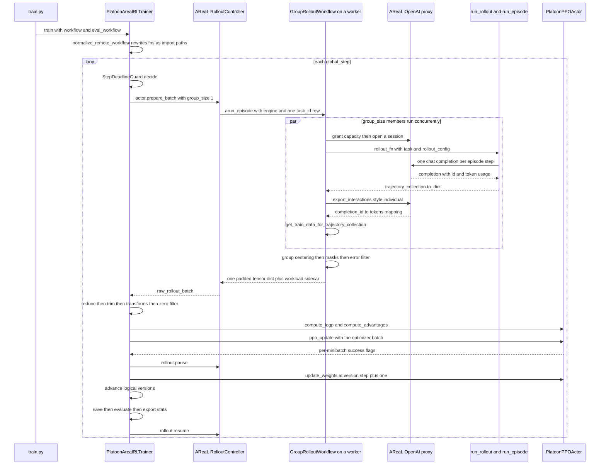

# A training run, end to end

This page traces one AReaL training run of the `number-search` plugin from the shell command to a
weight update, in execution order, naming the file each step happens in. Read it when you need to
know *where* something happens — which process, which object, which function — before you change
it.

`plugins/number-search` is the smallest complete AReaL example in the repository: a binary-search
task where a CodeAct agent calls `guess(n)` until it finds a hidden integer, trained with the CISPO
loss, an FSDP actor, an SGLang rollout engine and a group size of 8. The mechanics are the same for
every AReaL plugin; only the task, environment, agent and rollout function change.

!!! info "AReaL itself is not vendored in this tree"
    Platoon pins upstream AReaL as a git dependency
    (<span class="pl-src">pyproject.toml</span>, rev `d99124ec15102ca2fcd4960cc8beaef3950c2672`).
    Several steps below cross into `areal.*` code that lives outside this repository, and the table
    at the end of the page lists every one of them. Where that happens this page describes only what
    Platoon passes in and what it does with the result; it does not guess at upstream internals.

## The command

```bash
cd plugins/number-search
uv run python3 platoon/number_search/train.py \
  --config platoon/number_search/nv_number_search_cispo_areal.yaml
```

Overrides on this path are **bare `key=value`**, with no leading dashes, because the AReaL entrypoint
uses OmegaConf through `areal.api.cli_args.load_expr_config`:

```bash
uv run python3 platoon/number_search/train.py \
  --config platoon/number_search/nv_number_search_cispo_areal.yaml \
  trial_name=debug-run \
  train_dataset.batch_size=16
```

!!! warning "Two loaders, two override syntaxes"
    Only the AReaL path takes bare `key=value`. The Tinker and inference paths use Platoon's own
    loader (`platoon.utils.config.load_config`) and take `--dotted.key value` instead. The two are
    not interchangeable, and `${...}` interpolation exists only on the AReaL side. See
    [the config architecture page](../architecture/config.md).

## One global step at a glance



## Phase 1 — process start, patching, configuration

**Step 1. The import order is load-bearing.** The entrypoint is an ordinary script,
<span class="pl-src">plugins/number-search/platoon/number_search/train.py</span>. Among its imports
is `platoon.train.areal`, and that package's `__init__` runs the patcher *before* it imports
anything that depends on AReaL:

```python title="platoon/train/areal/__init__.py"
# Apply areal patches before importing areal-dependent modules
from platoon.train.areal.patches import apply_all_patches

apply_all_patches()

from platoon.train.areal.actor import (  # noqa: E402
    PlatoonPPOActor,
    create_actor,
)
```

The `# noqa: E402` on every subsequent import marks the ordering as deliberate. `apply_all_patches`
(<span class="pl-src">platoon/train/areal/patches.py</span>) applies 28 monkeypatches in a fixed
order — covering AReaL, Megatron-Core, megatron-bridge, SGLang and Hugging Face — then installs a
process stall watchdog. One of them, `_patch_remote_inf_engine_proxy_resolution`, is required for the
rollout to work at all in the default proxy mode — see step 13.

The Megatron actor is deliberately *not* imported here. `__init__.py` exposes
`PlatoonMegatronPPOActor` through a PEP 562 module `__getattr__` so an FSDP-only environment never
pulls in Transformer Engine:

```python title="platoon/train/areal/__init__.py"
def __getattr__(name: str):
    # Lazily expose the Megatron actor so importing the AReaL backend does not
    # pull in Megatron / Transformer Engine for FSDP-only runs. ``MegatronPPOActor``
    # transitively triggers an unconditional ``import transformer_engine``.
    if name == "PlatoonMegatronPPOActor":
        from platoon.train.areal.actor import PlatoonMegatronPPOActor

        return PlatoonMegatronPPOActor
```

!!! warning "Importing `platoon.train.areal` has global side effects"
    Any process that imports this package patches AReaL and starts a daemon thread. That is fine for
    a trainer, and wrong for a forked proxy worker, which is why Platoon ships a separate
    patches-only entrypoint at `platoon/areal_proxy_rollout.py` that loads `patches.py` by file path
    and calls `apply_proxy_patches()` instead.

**Step 2. Config load.** Two lines:

```python title="plugins/number-search/platoon/number_search/train.py"
def main(args):
    config, _ = load_expr_config(args, PlatoonArealRLTrainerConfig)
    config: PlatoonArealRLTrainerConfig = config
```

`load_expr_config` is upstream AReaL. From its observable contract it reads `--config <yaml>`, builds
an OmegaConf structured config from the dataclass, merges the YAML over it, applies bare `key=value`
overrides, resolves `${...}` interpolations and instantiates the dataclass tree. Interpolation
matters here; the shipped YAML leans on it — `tokenizer_path: ${actor.path}`,
`rollout.scheduling_spec: ${actor.scheduling_spec}`,
`rollout.consumer_batch_size: ${train_dataset.batch_size}`, and every `${cluster.fileroot}` under
`saver:` / `recover:` / `evaluator:` / `stats_logger:`.

**Step 3. `__post_init__` does real work.** Instantiating `PlatoonArealRLTrainerConfig` runs
<span class="pl-src">platoon/train/areal/config_defs.py</span>, where a surprising amount of the
run's behavior is decided. Loss selection is set in one public place and consumed from another:

```python title="platoon/train/areal/config_defs.py"
# Keep loss selection in one public config location (`loss_fn_config`)
# while attaching it to the actor object consumed by PlatoonActorImpl.
self.actor.loss_fn = self.loss_fn_config.loss_fn
merged_loss_fn_kwargs = dict(getattr(self.actor, "loss_fn_kwargs", {}))
merged_loss_fn_kwargs.update(self.loss_fn_config.loss_fn_kwargs)
self.actor.loss_fn_kwargs = merged_loss_fn_kwargs
```

You set `loss_fn_config.loss_fn`; `PlatoonActorImpl` reads `self.config.loss_fn` off the actor. The
copy is what connects them. Registered loss defaults are *not* merged here — that happens later, in
`build_loss_fn` (step 25).

Both backends must be declared explicitly; there is no default:

```python title="platoon/train/areal/config_defs.py"
if not self.rollout.backend:
    raise ValueError("rollout.backend must be set explicitly")
if not self.actor.backend:
    raise ValueError("actor.backend must be set explicitly")
if self.ref is not None and not self.ref.backend:
    self.ref.backend = self.actor.backend
```

And the rest, in the order `__post_init__` performs it: dict sub-configs are coerced to dataclasses;
`environments` is normalized and more than one entry raises `NotImplementedError`; `scheduler.type`
silently defaults to `"local"` when unset; `eval_gconfig` is cloned from `gconfig`;
`GRPOConfig.__post_init__` runs; router-replay dimensions are mirrored from the actor onto
`workflow_config` and the whole R3 feature matrix is validated; and finally
`PYTORCH_CUDA_ALLOC_CONF=expandable_segments:True` is injected into every worker `scheduling_spec`
by `_ensure_expandable_segments_env`, because in single-controller mode the trainer process is not
the process holding a GPU.

For this YAML the result is `actor.backend: fsdp:d4p1t1`, `rollout.backend: sglang:d4p1t1`,
`loss_fn_config.loss_fn: cispo` with `clip_low_threshold: 0.0` and `clip_high_threshold: 5.0`,
`workflow_config.group_size: 8`, `train_dataset.batch_size: 32`, `total_train_epochs: 10`.

!!! note "The `environments:` here is the registry list"
    `PlatoonArealRLTrainerConfig.environments` is a `list[EnvironmentConfig]` used by the `Auto`
    factories to resolve components by name. It is not the same key as the nested, plugin-local
    `environments:` mixture list some openreward configs define with `label` / `env_name` /
    `session_url` fields. The number-search YAML sets neither: `train.py` wires its components by
    direct Python import.

## Phase 2 — datasets

**Step 4. A dataset row is a task id and nothing else.**

```python title="plugins/number-search/platoon/number_search/train.py"
# TODO: Design a TaskLoader protocol and add configs + factory for this.
train_dataset = Dataset.from_list([{"task_id": x} for x in get_task_ids("train", 1000)])
val_dataset = Dataset.from_list([{"task_id": x} for x in get_task_ids("val", 100)])
```

`get_task_ids`
(<span class="pl-src">plugins/number-search/platoon/number_search/tasks.py</span>) only formats
strings such as `number_search.train.417`. The actual `Task` is materialized *inside the rollout
worker* by `get_task` in the same module, which memoizes into a module-global `TASKS` dict and reads
one JSON line out of `number_search_train.jsonl` (50 000 lines) via `load_task_from_disk`.

This is the framework-wide convention, and it is what makes remote AReaL workers and
`use_subprocesses: true` possible: a `Task` never crosses a process boundary, only its id does.

!!! warning "A positional-argument slip in this script"
    `get_task_ids` has the signature
    `get_task_ids(split, num_samples_train=50000, num_samples_val=1000)`. The call
    `get_task_ids("val", 100)` therefore sets `num_samples_train=100` and returns the default
    **1000** validation ids, not 100. It is harmless in this run because evaluation never fires
    (step 6), but copy the line into a plugin of your own and your validation set will be a
    different size than you asked for.

## Phase 3 — trainer construction

**Step 5. `PlatoonArealRLTrainer.__init__`.**

```python title="platoon/train/areal/rl.py"
_warn_for_zero_reward_filter_assumptions(
    config,
    custom_batch_transforms=batch_transforms,
)
_normalize_proxy_admin_api_key(config)
super().__init__(config=config, train_dataset=train_dataset, valid_dataset=val_dataset)
self.proxy_admin_api_key = self.config.rollout.admin_api_key
self.proxy_base_url: str | None = None
self.eval_proxy_base_url: str | None = None
self.batch_transforms = self._build_batch_transforms(batch_transforms)
self._start_platoon_proxies()
```

`_warn_for_zero_reward_filter_assumptions`
(<span class="pl-src">platoon/train/areal/rl.py</span>) emits a `RuntimeWarning` whenever
`workflow_config.filter_zero_advantage_datums` is on — and it defaults to `True`
(<span class="pl-src">platoon/train/areal/config_defs.py</span>). The warning lists every
incompatibility found by `_zero_reward_filter_incompatibilities`: nonzero `actor.kl_ctl`, nonzero
`actor.reward_bias`, an active `reward_norm` or `adv_norm`, `overlong_reward_penalty`, a critic, a
teacher, a Qwen3.5/3.6 MoE Megatron-Bridge model with an independent router auxiliary loss, or
**any** custom batch transform. This YAML sets `kl_ctl: 0.0`, `reward_bias: 0.0` and null
normalization levels, so the message ends with "Current actor settings satisfy the known reward-only
constraints." Read that sentence when a run starts; it is the cheapest sanity check available.

`_normalize_proxy_admin_api_key` resolves one shared, non-default admin secret and writes it to
**both** `rollout.admin_api_key` (Platoon's client side) and `rollout.agent.admin_api_key` (the
proxy server side). It prefers an already-set non-default value, then
`$PLATOON_AREAL_ADMIN_API_KEY`, then `f"platoon-{secrets.token_hex(16)}"`. It must run before
`super().__init__` builds the rollout controllers.

`_build_batch_transforms` calls `build_default_batch_transforms`
(<span class="pl-src">platoon/train/areal/batch_transforms.py</span>), which returns
`[DepthLevelWeightingTransform()]` only when `depth_level_weighting` or `depth_level_discount_gamma`
is set, then appends any transforms passed to the constructor. For number-search the list is
empty.

**Step 6. Engine placement.** `super().__init__` is upstream AReaL's `PPOTrainer.__init__`; it builds
the scheduler, allocations, engines, dataloaders and controllers. Platoon overrides three of the
hooks it calls. The one that decides which actor class you get:

```python title="platoon/train/areal/rl.py"
def _create_train_engine(self, actor_config, alloc):
    actor_cls: type[PlatoonPPOActor | PlatoonMegatronPPOActor] | None = None
    if isinstance(actor_config, PlatoonPPOActorConfig):
        if alloc.backend == "fsdp":
            actor_cls = PlatoonPPOActor
        elif alloc.backend == "megatron":
            # Deferred import: pulls in Megatron / Transformer Engine only
            # when the Megatron backend is actually selected.
            from platoon.train.areal.actor import PlatoonMegatronPPOActor

            actor_cls = PlatoonMegatronPPOActor
    if actor_cls is not None:
        if is_single_controller():
            actor = actor_cls.as_controller(actor_config, self.scheduler)
        else:
            actor = actor_cls(actor_config)
        actor.create_process_group(parallel_strategy=alloc.parallel)
        return actor
    return super()._create_train_engine(actor_config, alloc)
```

`actor.backend: fsdp:d4p1t1` selects `PlatoonPPOActor`
(<span class="pl-src">platoon/train/areal/actor.py</span>), wrapped in a `PlatoonPPOActorController`
by `as_controller`. AReaL parses the `d4p1t1` suffix into `alloc.backend` and `alloc.parallel`; that
parsing is upstream and this page makes no claim about what each letter maps to.

`_init_scheduler` swaps in `PreallocatedSlurmScheduler` when `scheduler.type == "slurm_prealloc"`;
this YAML leaves it unset, so `__post_init__` already made it `"local"`.

`_init_rollout` returns `None` for the evaluation controller when evaluation could never be
scheduled at all:

```python title="platoon/train/areal/rl.py"
def _evaluation_enabled(config: Any) -> bool:
    """Return whether AReaL can ever schedule evaluation for this run."""

    evaluator = getattr(config, "evaluator", None)
    if evaluator is None:
        # Preserve upstream behavior for custom/legacy configs whose evaluator
        # shape is unknown rather than silently suppressing evaluation.
        return True
    return bool(getattr(evaluator, "eval_before_train", False)) or any(
        getattr(evaluator, field, None) is not None
        for field in ("freq_epochs", "freq_steps", "freq_secs")
    )
```

!!! warning "This run never evaluates, and never writes an HF checkpoint"
    The shipped YAML sets `evaluator.freq_epochs`, `freq_steps` and `freq_secs` all to `null`, so
    `_evaluation_enabled` is false, the eval controller is never constructed, and every `_evaluate`
    call in the loop is a no-op. The `saver:` block is in the same state, so `_save_hf` never fires
    either. Only `recover.freq_secs: 3600` is set. This is the most common surprise with the example
    config: the run trains, but produces no exported model and no eval curve.

**Step 7. Proxies start.**

```python title="platoon/train/areal/rl.py"
def _start_platoon_proxies(self) -> None:
    if not is_single_controller():
        raise NotImplementedError("Platoon's updated AReaL integration requires single-controller mode")
    if not isinstance(self.rollout, RolloutController):
        raise TypeError("Expected rollout to be a RolloutController in single-controller mode")

    logger.info("Starting Platoon proxy workers for mode=%s", self._proxy_mode())
    self.rollout.start_proxy()
    self.proxy_base_url = self._resolve_proxy_base_url(self.rollout)
```

Single-controller mode is a hard requirement, not a preference. `_resolve_proxy_base_url` returns a
gateway address **only** when `rollout.agent.mode == "online"`; in the default `"inline"` mode it
returns `None`, and each rollout worker is handed its own local proxy address later (step 13). So
`trainer.proxy_base_url` being `None` at this point is normal, not a failure.

## Phase 4 — workflow construction

**Step 8. Two workflows, one of them a shrunken copy.**

```python title="plugins/number-search/platoon/number_search/train.py"
workflow = GroupRolloutWorkflow(
    run_rollout,
    get_task,
    config.workflow_config,
    trainer.proxy_base_url,
    trainer.proxy_admin_api_key,
    output_subdir="train_rollout",
)

eval_workflow_config = deepcopy(config.workflow_config)
eval_workflow_config.group_size = 1

eval_workflow = GroupRolloutWorkflow(
    run_rollout,
    get_task,
    eval_workflow_config,
    trainer.eval_proxy_base_url or trainer.proxy_base_url,
    trainer.proxy_admin_api_key,
    output_subdir="eval_rollout",
)
```

Forcing `group_size` to 1 on the eval copy is not cosmetic: group size is the only reason the
training workflow centers rewards at all, and centering a group of one would zero every reward.
Evaluation wants raw rewards, one rollout per validation row — and `_evaluate_fn` dispatches it with
`group_size=1` at the controller level too (<span class="pl-src">platoon/train/areal/rl.py</span>).

The constructor then deep-copies the config again and overrides two rollout-config fields
unconditionally:

```python title="platoon/train/areal/workflows/group_rollout_workflow.py"
self.config = deepcopy(config)
self.config.rollout_config.return_dict = True
self.config.rollout_config.train = True
```

`return_dict = True` forces the rollout function to return a plain dict rather than a live
`TrajectoryCollection`, so the result is safe to send across a process or RPC boundary. Whatever you
wrote for those two keys in YAML is discarded on any training path.

!!! note "Error filtering is off in this example"
    `filter_errors` is a constructor argument defaulting to `False`
    (<span class="pl-src">platoon/train/areal/workflows/group_rollout_workflow.py</span>), and
    the AReaL workflow reads only that argument, never the same-named `WorkflowConfig` field (which
    defaults to `True`). `train.py` does not pass it, so error-token filtering is disabled here. The
    registry-driven entrypoint does pass it — `filter_errors=True` for train and `False` for eval
    (<span class="pl-src">platoon/train/areal/train.py</span>).

**Step 9. `trainer.train(...)` first makes the workflow reconstructible somewhere else.**

```python title="platoon/train/areal/rl.py"
workflow, workflow_kwargs = normalize_remote_workflow(
    workflow,
    workflow_kwargs,
)
eval_workflow, eval_workflow_kwargs = normalize_remote_workflow(
    eval_workflow,
    eval_workflow_kwargs,
)
```

`normalize_remote_workflow`
(<span class="pl-src">platoon/train/areal/workflow_serialization.py</span>) checks for the
`RemoteWorkflowSerializable` protocol and calls `to_remote_workflow()`, which returns the workflow
*class* plus a kwargs dict in which every callable has been replaced by an import path string:

```python title="platoon/train/areal/workflows/group_rollout_workflow.py"
kwargs = {
    "rollout_fn": callable_import_path(self.rollout_fn),
    "get_task_fn": callable_import_path(self.get_task_fn),
    "config": asdict(self.config),
    "proxy_base_url": None,
    "proxy_admin_api_key": self.proxy_admin_api_key,
    "output_subdir": self.output_subdir,
    "filter_errors": self.filter_errors,
    "merge_prefixes": self.merge_prefixes,
}
reward_processor_path = callable_import_path(self.reward_processor)
if kwargs["rollout_fn"] is None or kwargs["get_task_fn"] is None:
    raise ValueError("GroupRolloutWorkflow requires importable rollout_fn/get_task_fn")
```

**Your rollout function and task loader must be importable by name from a worker process** — the
constraint most likely to bite you when you write a plugin. A lambda, a closure, or a function
defined inside `if __name__ == "__main__"` cannot be sent. `callable_import_path` makes exactly one
concession: because training scripts run as `__main__`, it walks `sys.path` and recovers a
package-qualified path from `fn.__globals__["__file__"]`, preferring candidates that start with
`platoon.`:

```python title="platoon/train/areal/workflow_serialization.py"
# Prefer package-qualified paths over script-directory aliases. Do not
# import candidates here: training modules can have expensive AReaL imports,
# and workers will validate the path when reconstructing the workflow.
candidates.sort(key=lambda candidate: (not candidate.startswith("platoon."), len(candidate)))
if candidates:
    return f"{candidates[0]}.{name}"
return None
```

`proxy_base_url` is sent as `None` deliberately; each worker binds its own.

## Phase 5 — the training loop

**Step 10. The step loop.**

```python title="platoon/train/areal/rl.py"
steps_per_epoch = len(self.train_dataloader)
max_steps = total_epochs * steps_per_epoch
```

With 1000 tasks, `train_dataset.batch_size: 32` and `drop_last=True`
(<span class="pl-src">platoon/train/areal/config_defs.py</span>), that is 31 steps per epoch and 310
steps over the configured 10 epochs. `start_step` comes from `self.recover_info`, which is populated
because the YAML sets `recover.mode: auto`.

A step can also be the last one. `StepDeadlineGuard.from_environment()` returns `None` unless
`PLATOON_TRAINING_DEADLINE_EPOCH` is set — the Slurm launch scripts export it. When armed, and when
the remaining wall clock is less than an estimated step plus safety margin, the trainer pauses
rollout, forces a recovery checkpoint for the *last completed* step through
`_ensure_recover_checkpoint_at`, writes a JSON drain marker for the launcher, and breaks out of the
loop.

**Step 11. Rollout submission.**

```python title="platoon/train/areal/rl.py"
raw_rollout_batch = self.actor.prepare_batch(
    self.train_dataloader,
    workflow=workflow,
    workflow_kwargs=workflow_kwargs,
    should_accept_fn=dynamic_filter_fn,
    group_size=self._controller_dispatch_group_size(),
    dynamic_bs=self.config.dynamic_bs,
)
```

`prepare_batch` is upstream AReaL. What Platoon controls is the group size it passes:

```python title="platoon/train/areal/rl.py"
@staticmethod
def _controller_dispatch_group_size() -> int:
    """Platoon workflows already own rollout multiplicity internally."""
    return 1
```

AReaL therefore submits exactly **one workflow invocation per dataset row**, and the workflow itself
fans out to `group_size: 8`. Getting this backwards would multiply the two. Asynchrony and staleness
remain AReaL's concern: this YAML sets `rollout.max_head_offpolicyness: 3`,
`rollout.consumer_batch_size: ${train_dataset.batch_size}` (32) and
`rollout.max_concurrent_rollouts: 64`.

`prepare_batch` returns a `list[dict]`, one dict per accepted task group, whose tensor values are
`RTensor` handles rather than local tensors in single-controller mode. That detail matters in
step 23.

## Phase 6 — inside one workflow invocation

**Step 12. Fan-out.** `arun_episode`
(<span class="pl-src">platoon/train/areal/workflows/group_rollout_workflow.py</span>) receives one
row — `data = {"task_id": "number_search.train.417"}` — and an engine handle:

```python title="platoon/train/areal/workflows/group_rollout_workflow.py"
async def arun_episode(self, engine: InferenceEngine, data: dict) -> dict | None:
    tracker = stats_tracker.get(workflow_context.stat_scope())
    tracker.scalar(group_size_requested=float(self.config.group_size))
    if self.config.use_subprocesses:
        raw_processed_results = await self._arun_episode_with_subprocesses(engine, data)
    else:
        raw_processed_results = await asyncio.gather(
            *[self._arun_episode_single(engine, data, i) for i in range(self.config.group_size)]
        )
```

`use_subprocesses` defaults to `False`
(<span class="pl-src">platoon/train/areal/config_defs.py</span>) and this YAML does not change it,
so all eight group members run as coroutines in one worker process. The subprocess path
(`_arun_episode_with_subprocesses`, `group_rollout_workflow.py`) exists for heavyweight
environments and is the only path with a straggler tail cutoff.

**Step 13. One group member.**

```python title="platoon/train/areal/workflows/group_rollout_workflow.py"
task_id = data["task_id"]
proxy_base_url = self._require_proxy_base_url()
session = ArealProxySession(
    session=await workflow_context.get_aiohttp_session(),
    base_url=proxy_base_url,
    task_id=self._session_task_id(task_id, rollout_number),
    admin_api_key=self.proxy_admin_api_key,
)
trajectory_data = None
try:
    await session.__aenter__()
    config = self._build_rollout_config(engine, session)
    task = self.get_task_fn(task_id)
    if config.rollout_config.max_steps is not None:
        task.max_steps = config.rollout_config.max_steps
    trajectory_data = await asyncio.create_task(self.rollout_fn(task, config.rollout_config))
except Exception:
    logger.exception("Error in AReaL workflow for task %s rollout %s", task_id, rollout_number)
finally:
    await session.__aexit__(None, None, None)
```

Four details deserve attention.

*The proxy URL was serialized as `None`, yet `_require_proxy_base_url()` succeeds.* That is patch
`_patch_remote_inf_engine_proxy_resolution`
(<span class="pl-src">platoon/train/areal/patches.py</span>), which wraps
`RemoteInfEngine._resolve_workflow` and calls `workflow.set_proxy_base_url(proxy_addr)` with the
worker-local address. Upstream injects `proxy_addr` only when it wraps agent-like workflows in
`OpenAIProxyWorkflow`, and Platoon's workflows are already `RolloutWorkflow` instances; without the
patch, inline mode raises the explicit error in `group_rollout_workflow.py`.

*`task.max_steps` is overwritten.* The number-search JSONL rows carry `"max_steps": 1`, but the YAML
sets `workflow_config.rollout_config.max_steps: 10`, so the agent actually gets 10 steps.
Dataset-authored budgets are advisory whenever `rollout_config.max_steps` is set.

*Model coordinates are rewritten for the proxy* by `_build_rollout_config`
(`group_rollout_workflow.py`):

```python title="platoon/train/areal/workflows/group_rollout_workflow.py"
config.rollout_config.model_endpoint = self._require_proxy_base_url()
model_name = config.rollout_config.model_name or ""
if not model_name.startswith("openai/"):
    config.rollout_config.model_name = f"openai/{model_name}"
config.rollout_config.model_api_key = session.session_api_key
config.rollout_config.output_dir = os.path.join(
    config.rollout_config.output_dir,
    str(engine.get_version()),
)
```

So `model_name` becomes `openai/Qwen/Qwen3-4B-Instruct-2507` — the `openai/` prefix is a LiteLLM
provider selector, not part of the model id — `model_api_key` becomes the per-rollout proxy session
key, and the output directory grows two components: `<output_dir>/train_rollout/<weights version>`.

*Exceptions are swallowed.* A rollout that raises leaves `trajectory_data = None` and the group
continues with fewer members. Whether that group still trains is decided later, by
`min_successful_group_size` (step 22).

The session itself is thin. `ArealProxySession.__aenter__`
(<span class="pl-src">platoon/train/areal/proxy.py</span>) POSTs to AReaL's
`GRANT_CAPACITY_PATHNAME` with the admin bearer token before entering the underlying
`OpenAIProxyClient`, and on exit it writes a placeholder reward:

```python title="platoon/train/areal/proxy.py"
async def _set_default_proxy_reward(self) -> None:
    """Use AReaL's public API to avoid missing-reward export warnings.

    Platoon computes rewards from completed trajectories after export, so
    the proxy-side reward value is only a placeholder.
    """
```

## Phase 7 — the episode

From here down, nothing knows which backend it is running under. This is the same code a standalone
inference run executes.

**Step 14. `run_rollout`.**

```python title="plugins/number-search/platoon/number_search/rollout.py"
env = NumberSearchEnv(task)
agent = NumberSearchAgent(
    llm_client=llm_client,
    include_reasoning=False,
    inference_params=config.inference_params,
)
traj_collection = TrajectoryCollection()
current_trajectory_collection.set(traj_collection)
...
rollout_task = asyncio.create_task(run_episode(agent, env))
```

The ordering is a contract: the `TrajectoryCollection` is created and bound to the `ContextVar`
*before* `run_episode`, so the JSONL event sink registered on the lines between observes the root
trajectory's creation. The `asyncio.create_task` wrapper is required by
<span class="pl-src">platoon/episode/loop.py</span>: "Call using asyncio.create_task() to make
sure edits to contextvars do not leak to parent context". `config.timeout` (600 s here) wraps the
awaited task; on timeout the task is cancelled and awaited before the error is re-raised, and the
`finally` block closes agent and env.

**Step 15. `run_episode`** is the whole framework in five lines:

```python title="platoon/episode/loop.py"
obs = await env.reset()
while not halt_episode(obs):
    action = await asyncio.wait_for(agent.act(obs), timeout=timeout)
    obs = await asyncio.wait_for(env.step(action), timeout=timeout)
    step_count += 1
```

`set_context_vars` is where the trajectory *tree* forms, implicitly:

```python title="platoon/episode/loop.py"
parent_traj = current_trajectory.get(None)
current_trajectory.set(current_trajectory_collection.get().create_trajectory(parent_traj=parent_traj))

if budget_tracker.get(None) is None:
    budget_tracker.set(StepBudgetTracker())
```

A sub-agent episode started from inside this one inherits the ContextVar and therefore nests under
its caller automatically — see [the subagent walkthrough](subagent-call.md). Number-search launches
no sub-agents, so its tree is a single root.

`halt_episode` stops on `obs.finished`, on a `finish_message` having been set, or on an exhausted
budget. Note that `run_rollout` calls `run_episode(agent, env)` with no `timeout` argument, so the
per-call timeout is the function's own default of 300 seconds, not `RolloutConfig.step_timeout`.

**Step 16. `env.reset()` and the reward surface.** `NumberSearchEnv` injects exactly two callables
into the IPython namespace, one of which closes over the hidden target:

```python title="plugins/number-search/platoon/number_search/env.py"
def guess_factory(target: int):
    def guess(number: int) -> str:
        if number == target:
            finish_message.set(f"You guessed the number {target} correctly!")
        elif number < target:
            return "Too low, try again."
        else:
            return "Too high, try again."

    return guess
```

Setting `finish_message` is how the environment halts the loop, and `evaluate` reads the same
message back to score the episode: 1.0 if it contains `"correctly"`, otherwise 0.0. Action surface
and reward function share one piece of state.

**Step 17. `agent.act(obs)`** builds the prompt, calls the proxy, and — critically for training —
records the completion id on the action:

```python title="platoon/agents/codeact/agent.py"
action.misc["usage"] = response.usage.to_dict()
action.misc["model"] = response.model
action.misc["completion_id"] = response.id
```

`completion_id` is the join key between the trajectory and the proxy's token export (step 20).
Without it, a step produces no training tokens.

The prompt format is the other decision that shapes training efficiency. `CodeActPromptBuilder` in
`sequence_extension` mode — the default, and what `NumberSearchAgent` uses — appends one
assistant/user turn per history step, so step *N+1*'s prompt is literally step *N*'s prompt plus two
turns. Exported token sequences are therefore prefixes of one another, which is what lets the data
processor merge a whole multi-step trajectory into one training sequence (step 21). The
`no_sequence_extension` mode rebuilds one large user message instead, and defeats the merge.

**Step 18. `env.step(action)`** runs the code, scores it, and publishes the step:

```python title="platoon/envs/codeact/env.py"
step = await self._code_executor.run(action.parsed_code)

if finish_message.get(None) is not None or error_message.get(None) is not None:
    self._state.finished = True
    self._state.misc["finish_message"] = finish_message.get()

step.thought = action.parsed_thought
step.reward, reward_info = await self.evaluate()
step.misc["action_misc"] = action.misc
step.misc["reward_misc"] = reward_info
self._state.reward += step.reward
self._state.history.append(step)

traj_collection = current_trajectory_collection.get()
traj_collection.add_trajectory_step(traj.id, self._state.history[-1])
```

`add_trajectory_step` fans the step out to every registered event handler — here the `JsonlFileSink`
that the [visualization tooling](../tutorials/visualization.md) later replays. Handler exceptions are
caught and printed, never propagated, so a broken sink cannot fail a rollout.

**Step 19. Return.** Because the workflow forced `return_dict = True`, `run_rollout` returns
`current_trajectory_collection.get().to_dict()`. `to_dict` walks dataclass fields manually rather
than using `dataclasses.asdict`, because trajectory steps can embed unpicklable SDK objects. The
result is a nested plain-Python dict: a collection id, and a `trajectories` mapping from trajectory
id to a record holding `task`, `parent_info`, `steps`, `reward`, `finish_message`, `error_message`
and `misc`. Every step's `misc["action_misc"]["completion_id"]` is the link back to the tokens.

## Phase 8 — trajectory tree to training tensors

**Step 20. Export the token-exact interactions.** `_process_trajectory_result`
(<span class="pl-src">platoon/train/areal/workflows/group_rollout_workflow.py</span>) starts with
an export that happens unconditionally:

```python title="platoon/train/areal/workflows/group_rollout_workflow.py"
# Export every requested session, including a rollout whose raw result
# is None. The proxy can still contain completed model interactions
# from work performed before a timeout/cancellation.
completions = await session.export_interactions()
completion_token_counts = _completion_token_counts(completions)
workload = _rollout_workload(trajectory_data, completions, completion_token_counts)
observed = trajectory_data is not None
```

`export_interactions` is one line in Platoon
(<span class="pl-src">platoon/train/areal/proxy.py</span>):
`self._client.export_interactions(discount=1.0, style="individual")`. The `"individual"` style is
what produces **one record per actual model request**, keyed by the same id the agent stored as
`completion_id`. Each record satisfies a two-line protocol:

```python title="platoon/utils/areal_data_processing.py"
class CompletionWithResponse(Protocol):
    """Protocol for exported AReaL completion records."""

    def to_tensor_dict(self) -> dict[str, torch.Tensor]: ...
```

and `_extract_completion_tokens` reads `input_ids`, `loss_mask`, `logprobs` and `versions` out of
it, splitting the sequence at the first set `loss_mask` entry into observation tokens and action
tokens.

This indirection is the structural heart of the design: **the agent never talks to the trainer.** It
speaks OpenAI over HTTP to a proxy, the proxy records exact tokens and logprobs, and the workflow
asks the proxy for them afterwards. That is what lets one unmodified `run_rollout` power AReaL
training, Tinker training and standalone inference.

**Step 21. Convert the tree.**

```python title="platoon/train/areal/workflows/group_rollout_workflow.py"
train_data = get_train_data_for_trajectory_collection(
    trajectory_data,
    completions,
    task_id,
    self.filter_errors,
    self.reward_processor,
    self.merge_prefixes,
    concat_fn=concat_padded_tensors,
    include_traj_depth=use_depth_weighting or use_depth_discount or use_subagent_sampling,
    include_traj_start=use_depth_weighting or use_subagent_sampling,
    router_replay_config=self.router_replay_config,
    subagent_datum_sampler=self.subagent_datum_sampler,
)
```

Inside `get_train_data_for_trajectory_collection`
(<span class="pl-src">platoon/utils/areal_data_processing.py</span>), every trajectory in the
tree is converted independently. Per trajectory, `get_train_data_for_trajectory` calls the reward
processor exactly once — `trajectory_reward, trajectory_rewards_dict = reward_processor(trajectory)`
— and then walks the steps, deduplicating repeated `completion_id`s and merging
prefix-compatible sequences:

```python title="platoon/utils/areal_data_processing.py"
if len(accumulator.full_sequence) == 0:
    # First step - start new accumulator
    delta_ob_tokens = ob_tokens
    prefix_len = 0
elif _is_prefix(accumulator.full_sequence, ob_tokens):
    # Observation extends the current sequence - we can merge!
    prefix_len = len(accumulator.full_sequence)
    delta_ob_tokens = ob_tokens[prefix_len:]
    num_merged += 1
```

Observation tokens are appended with `loss_mask=0`, `logprob=0.0`, `version=-1`; action tokens with
`loss_mask=1` and their real logprobs and versions. A merged datum emits one tensor dict:

```python title="platoon/utils/areal_data_processing.py"
result = dict(
    input_ids=torch.tensor(self.full_sequence).unsqueeze(0),
    loss_mask=torch.tensor(self.loss_mask).unsqueeze(0),
    logprobs=torch.tensor(self.logprobs).unsqueeze(0),
    versions=torch.tensor(self.versions).unsqueeze(0),
    attention_mask=torch.ones(seq_len, dtype=torch.bool).unsqueeze(0),
    num_input_tokens=torch.tensor(self.num_input_tokens, dtype=torch.float32).unsqueeze(0),
    num_output_tokens=torch.tensor(self.num_output_tokens, dtype=torch.float32).unsqueeze(0),
    rewards=torch.tensor([trajectory_reward]),
    token_rewards=torch.full((1, seq_len), float(trajectory_reward), dtype=torch.float32),
)
```

At this point `rewards` holds the trajectory's own reward, repeated once per datum — not yet
centered, and not yet an advantage.

Back at the collection level, each trajectory's datums are labelled with a policy-eligibility mask,
optionally a Bernoulli subagent keep mask and depth, and optionally `traj_depth` / `traj_start`.
Then the whole collection is concatenated and stamped with the **root's** reward:

```python title="platoon/utils/areal_data_processing.py"
train_data = harmonize_optional_reward_metrics(train_data)
root_trajectory = next(iter(trajectories.values()))
root_reward, root_rewards_dict = reward_processor(root_trajectory)

return concat_fn(train_data) | {
    "task_reward": torch.tensor(root_reward).unsqueeze(0),
    "task_reward_valid": torch.tensor(
        [not trajectory_was_interrupted(root_trajectory)],
        dtype=torch.bool,
    ),
    **{f"root_{key}": torch.tensor(value).unsqueeze(0) for key, value in root_rewards_dict.items()},
}
```

!!! warning "The root trajectory is identified by insertion order"
    `next(iter(trajectories.values()))` — there is no root flag. A rollout function that creates some
    other trajectory before the root will mislabel the entire tree. In practice this means: create
    the `TrajectoryCollection`, set the ContextVar, and call `run_episode` before anything else that
    could create a trajectory.

## Phase 9 — group reward centering

**Step 22.** Control returns to `arun_episode`, which now holds up to eight per-member tensor dicts.
Three rejection gates run first: fewer than `min_successful_group_size` members returned data, no
root reward is valid at all, or the count of completed roots is below the same quorum. Then the
centering:

```python title="platoon/train/areal/workflows/group_rollout_workflow.py"
if bool(valid_roots.all()):
    # Preserve the historical all-valid arithmetic bit-for-bit.
    if self.config.leave_one_out_baseline and len(results) > 1:
        total_reward = task_rewards.sum()
        loo_baselines = (total_reward - task_rewards) / (len(task_rewards) - 1)
        datum_counts = torch.tensor([r["rewards"].shape[0] for r in results])
        per_datum_baselines = torch.repeat_interleave(loo_baselines, datum_counts)
        train_data["rewards"] = train_data["rewards"] - per_datum_baselines
    else:
        train_data["rewards"] = train_data["rewards"] - torch.mean(task_rewards)
```

This is the GRPO-style control variate. The structural fact to carry away: **the baseline is built
from root rewards only, but is subtracted from every datum in the tree.** Number-search has only a
root; in a recursive plugin this is exactly how a sub-agent's tokens inherit credit from the root
outcome. `leave_one_out_baseline` defaults to `False`, so this run takes the `torch.mean` branch.
When only some roots are valid, only those contribute to the baseline.

After centering, in order: `_record_stats` emits `task_reward`, step counts, token counts and `at_k`
aggregates; `_activate_subagent_datum_sampling` folds policy eligibility and the Bernoulli keep mask
into a `trainable_datums` mask; and `_filter_positive_centered_error_tokens` runs. That last one is
subtle enough to quote:

```python title="platoon/train/areal/workflows/group_rollout_workflow.py"
def _filter_positive_centered_error_tokens(train_data: dict) -> dict[str, float]:
    """Mask erroneous action tokens only when their centered reward is positive.

    The token-aligned side channel is produced before group rewards exist.  It
    is always consumed here, before actor dispatch, and never becomes a model
    input.  A merged datum can therefore retain clean/negative-signal actions
    while suppressing only the positively reinforced erroneous completion.
    """
```

Error tokens are suppressed only when they would otherwise be *reinforced*; an erroneous action in a
failed rollout keeps its negative signal. (This is inert for number-search, where `filter_errors` is
off — see step 8.)

Finally, a group with no reward variance is dropped:

```python title="platoon/train/areal/workflows/group_rollout_workflow.py"
if zero_signal and len(results) > 1:
    stats_tracker.get(workflow_context.stat_scope()).scalar(zero_variance_reward_group=1.0)
    logger.info(
        "All retained rewards identical for task %s (unprocessed mean=%.2f)",
        data["task_id"],
        mean_unprocessed_reward.item(),
    )
    if self.config.filter_zero_variance_groups:
        record_workload_stats(None)
        return None
```

!!! warning "Zero-variance rejection defaults to on"
    `filter_zero_variance_groups` defaults to `True`
    (<span class="pl-src">platoon/train/areal/config_defs.py</span>). A task where all eight
    rollouts scored 0.0 — or all eight scored 1.0 — contributes nothing. On a task distribution that
    is uniformly too hard or too easy, this silently starves the batch, and the symptom is a training
    step with far fewer datums than you expected rather than an error. Watch
    `zero_variance_reward_group` in your run's stats.

## Phase 10 — trainer-side batch assembly

**Step 23.** `_postprocess_rollout_batch`
(<span class="pl-src">platoon/train/areal/rl.py</span>) is where the trainer takes over from the
workflows. Its ordering is deliberate, and is documented in `_build_batch_transforms`'s docstring:

1. `_reduce_rollout_batch` drops falsy items, **localizes RTensors** before concatenating, strips
   workflow-only stat keys, concatenates, stamps a per-trajectory segment id by cumsum over
   `traj_start`, and consumes `trainable_datums`. The localization is not optional:

    ```python title="platoon/train/areal/rl.py"
    # In single-controller mode prepare_batch returns remotized trajectories
    # whose values are RTensor handles, not torch.Tensors. AReaL's
    # concat_padded_tensors only concatenates tensor/list values and silently
    # keeps the *first* dict's value for anything else, which would drop every
    # rollout group but the first. Localize before concatenating.
    ```

2. `_maybe_shuffle_and_trim_batch` trims to a multiple of
   `lcm(rollout.ensure_batch_divisible_by, dp_size)`, always drawing a random subset and preferring
   to trim non-root datums, then repairs exactly one `traj_start` marker per surviving segment.

3. `run_batch_transforms(batch, self.batch_transforms, context)` runs your transforms. They see
   exactly the batch that will train — after trimming — so a normalizing transform normalizes only
   the datums that reach the actor.

4. `_filter_zero_centered_reward_batch` runs when `filter_zero_advantage_datums` is on. It drops
   exact-zero-reward datums, keeps the minimum needed for DP padding, and preserves the
   policy-gradient denominator by rescaling what remains:

    ```python title="platoon/train/areal/rl.py"
    denominator_tokens = retained_loss_tokens + filtered_zero_loss_tokens
    denominator_scale = (
        float(retained_loss_tokens) / float(denominator_tokens)
        if denominator_tokens > 0
        else 1.0
    )
    ```

5. The temporary metadata (`traj_depth`, `traj_start`, segment ids) is popped and
   `split_batch_to_trajectories(batch)` restores AReaL's canonical `list[dict]` so the controller can
   rebalance across DP groups.

**Step 24. Enrichment.** Back in `train`, the batch is optionally enriched with critic values,
`ref_logp`, `teacher_logp` and `prox_logp` before advantages are computed. This YAML defines a
`ref:` engine colocated with the actor, so reference logprobs *are* computed — but `kl_ctl: 0.0`
means they contribute nothing to the loss. It sets `recompute_logprob: false` and
`use_decoupled_loss: false`, so `prox_logp` is skipped. Then:

```python title="platoon/train/areal/rl.py"
adv_batch = self.actor.compute_advantages(advantage_input)
```

`compute_advantages` is upstream AReaL. It turns the per-datum scalar `rewards` into the per-token
`advantages` the loss consumes, applying `reward_scaling`, `reward_bias`, `kl_ctl`, `adv_norm` and
the rest of the actor config along the way.

## Phase 11 — the gradient step

**Step 25. The update.**

```python title="platoon/train/areal/rl.py"
actor_update_successful = self.actor.ppo_update(optimizer_batch)
if actor_update_successful:
    self.actor.step_lr_scheduler()
self.actor.get_device_stats().log("ppo update")
```

On the controller side, `PlatoonPPOActorController.ppo_update`
(<span class="pl-src">platoon/train/areal/actor.py</span>) broadcasts an RPC to every worker and
folds the per-worker results with `aggregate_optimizer_update_results`, which requires every rank to
report the identical per-minibatch success pattern. On a worker, `PlatoonActorImpl._ppo_update`
splits and runs:

```python title="platoon/train/areal/actor.py"
mb_inputs = split_padded_tensor_dict_into_mb_list(
    data,
    mb_spec=MicroBatchSpec(n_mbs=self.config.ppo_n_minibatches),
)
replay_batches = pop_and_split_actor_router_replay(replay_data, mb_inputs, self.config)

with stats_tracker.scope("update"):
    current_version = self.engine.get_version()
    loss_fn = self._make_loss_fn(current_version)
```

`_make_loss_fn` assembles `common_kwargs` from the actor config — `importance_sampling_level`,
`eps_clip`, `eps_clip_higher`, `c_clip`, `rejection_sampling`, `use_decoupled_loss` and more — and
calls `build_loss_fn`, which layers arguments in a fixed order and filters them by signature:

```python title="platoon/train/areal/loss_functions.py"
fn = get_loss_fn(name)
spec = _LOSS_FN_REGISTRY.get(name)
loss_specific_kwargs = {**spec.defaults, **(loss_fn_kwargs or {}), **kwargs}
signature_fn = spec.signature_fn or fn
filtered_common_kwargs = _filter_compatible_kwargs(signature_fn, common_kwargs or {})
filtered_kwargs = _filter_compatible_kwargs(signature_fn, {**loss_specific_kwargs, **filtered_common_kwargs})
return functools.partial(fn, **filtered_kwargs)
```

Registered defaults first, your `loss_fn_kwargs` over them, then whichever common kwargs the
function's signature actually accepts. A loss that does not declare `c_clip` never sees it. Declare
`**kwargs` in your own loss to receive everything.

This run selects `cispo` (<span class="pl-src">platoon/train/areal/loss_functions.py</span>),
whose registered defaults happen to match the YAML exactly:

```python title="platoon/train/areal/loss_functions.py"
ratio = torch.exp(log_ratio)
ratio = torch.where(loss_mask, ratio, 0.0)
...
clipped_ratio = torch.clamp(ratio, clip_low_threshold, clip_high_threshold)

# CISPO loss: -detach(clipped_ratio) * advantage * logprob
# The gradient only flows through logprobs (the log π_θ term)
cispo_coefficient = clipped_ratio.detach()
pg_loss = -cispo_coefficient * advantages * logprobs
```

That `detach` is the whole point of CISPO relative to PPO's clipped surrogate: the clipped importance
ratio becomes a weight, not a differentiated term, so tokens outside the clip range still receive
gradient instead of being zeroed out of the objective.

Each minibatch runs through
`engine.train_batch(mb, loss_fn=loss_fn, loss_weight_fn=lambda x: x["loss_mask"].count_nonzero())`
and its result is checked by `optimizer_update_succeeded`, which fails closed on
a non-finite gradient norm when gradient clipping is on — this YAML sets
`optimizer.gradient_clipping: 1.0`.

**Step 26. Weight sync.**

```python title="platoon/train/areal/rl.py"
if actor_update_successful:
    self.rollout.pause()
    ...
        new_version = global_step + 1
        versioned_meta = self.weight_update_meta.with_version(new_version)
        self.actor.update_weights(versioned_meta)
        self._advance_logical_versions(new_version)
```

Rollout is paused for the broadcast and resumed at the very end of the step. If the update did *not*
apply, the optimizer, LR scheduler and broadcast are all skipped and only
`_advance_logical_versions(global_step + 1)` runs. Its docstring says why:

```python title="platoon/train/areal/rl.py"
def _advance_logical_versions(self, new_version: int) -> None:
    """Keep engine/rollout versions aligned with the trainer's global step.

    This intentionally performs no optimizer, scheduler, or weight-broadcast
    operation. AReaL already uses this path for an empty rollout batch; an
    all-zero-advantage batch must follow the same invariant so checkpoints,
    staleness tracking, and the next rollout do not disagree about version.
    """
```

Every path out of a step — successful update, failed update, empty batch, batch entirely filtered —
advances the logical version.

## Phase 12 — save, evaluate, log

**Step 27.** The tail of each step, in order: `_save_hf`,
`_save_recover_checkpoint`, `_evaluate`, `clear_batches`, `_export_and_commit_stats`,
`self.rollout.resume()`, `_save_perf_tracer`, and `deadline_guard.record_completed_step(...)`.

The first three are upstream AReaL and frequency-gated by the `saver:`, `recover:` and `evaluator:`
blocks, so for this YAML only the hourly recovery checkpoint ever fires (step 6). When evaluation
*is* enabled, `_evaluate_fn` submits every validation row individually with `group_size=1` and then
blocks:

```python title="platoon/train/areal/rl.py"
self.eval_rollout.submit(
    item,
    eval_workflow,
    eval_workflow_kwargs,
    group_size=self._controller_dispatch_group_size(),
    is_eval=True,
)
cnt += 1
...
self.eval_rollout.wait(cnt, timeout=None)
```

`clear_batches` releases the RTensor-bearing containers held by the controller, and
`_export_and_commit_stats` flushes every scalar accumulated through `stats_tracker` to WandB using
the `stats_logger:` block — here `project: number-search-platoon`, `mode: online`.

## Where the trace leaves Platoon

Everything in this table is upstream AReaL: called by Platoon, defined outside this repository, and
not installed in the docs worktree. If behavior here surprises you, read the pinned AReaL revision,
not Platoon.

| Upstream call | Platoon caller | What Platoon relies on |
|---|---|---|
| `load_expr_config` | the plugin's `main` | YAML merge, bare `key=value` overrides, `${...}` interpolation |
| `PPOTrainer.__init__` | `PlatoonArealRLTrainer.__init__` | scheduler, allocations, engines, dataloaders, controllers |
| `RolloutController.start_proxy` | `_start_platoon_proxies` | proxy workers reachable from rollout workers |
| `prepare_batch` | the step loop in `train` | one `arun_episode` per row, staleness control, `list[dict]` return |
| `export_interactions` | `ArealProxySession.export_interactions` | one record per request under `style="individual"` |
| `concat_padded_tensors` | the workflow and `_reduce_rollout_batch` | padded concatenation of matching-key dicts |
| `compute_logp` / `compute_advantages` | the step loop in `train` | per-token `advantages` from per-datum `rewards` |
| `engine.train_batch` | `PlatoonActorImpl._ppo_update` | forward, backward, optimizer step, stats dict |
| `update_weights` | the step loop in `train` | broadcast of new weights to the inference engines |
| `_save_hf` / `_save_recover_checkpoint` / `_evaluate` | the step loop in `train` | frequency gating from `saver:` / `recover:` / `evaluator:` |
| `d4p1t1` suffix parsing | `_create_train_engine` | the split into `alloc.backend` and `alloc.parallel` |

## Where to cut in

Each stage of the trace has a customization page that owns it.

| Stage | Step | Extend it here |
|---|---|---|
| Task construction and dataset rows | 4 | [Custom dataset](../customization/dataset.md) |
| Environment actions and `evaluate` | 16, 18 | [Custom environment](../customization/environment.md) |
| Prompting, parsing, model calls | 17 | [Custom agent](../customization/agent.md) |
| The rollout function itself | 14 | [Custom rollout](../customization/rollout.md) |
| Reward processor and reward metrics | 21 | [Custom rewards](../customization/rewards.md) |
| Group execution, centering, filtering | 12, 22 | [Custom workflow](../customization/workflow.md) |
| Trainer-side full-batch edits | 23 | [Batch transforms](../customization/batch-transform.md) |
| The loss function | 25 | [Custom loss](../customization/loss.md) |
| Making all of it importable by workers | 9 | [Packaging a plugin](../customization/packaging.md) |

Two extension points sit outside the customization section. The `environments:` list plus the `Auto`
factories let you name components in YAML and run
`python -m platoon.train.areal.train --config my.yaml` with no plugin script at all; it is the
recommended route, but only the Tinker registry path is verified end to end in this repository — see
[the registry](../architecture/registry.md). And the budget policy is a ContextVar you can set before
`run_episode`, which starts to matter as soon as your agent launches sub-agents; see
[recursive agents](../recipes/recursive.md).

## See also

- [The group rollout workflow](group-rollout-workflow.md) — steps 12 through 22 in depth.
- [Trajectory to batch](trajectory-to-batch.md) — steps 20 and 21 in depth.
- [A subagent call](subagent-call.md) — what changes when the tree has more than one node.
- [The AReaL backend](../architecture/areal.md) — the layer map, the patches, and what upstream owns.
- [Configuration reference](../reference/configuration.md) — every key touched above, with defaults.
