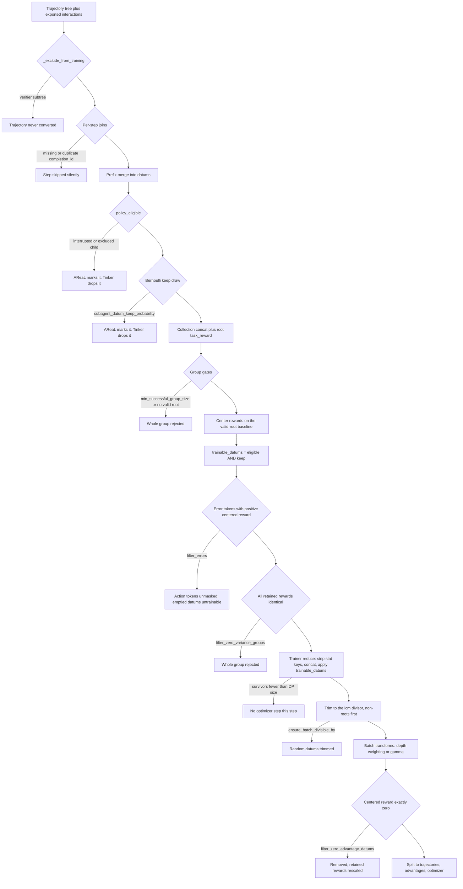

# Trajectory to training batch

This page follows one finished `TrajectoryCollection` through the two data converters to the
tensors the optimizer sees, in execution order, with the real excerpts.
[The data pipeline](../architecture/data-pipeline.md) explains *why* the stages are ordered this
way; this page shows what the code does at each one.

The two files are <span class="pl-src">platoon/utils/areal_data_processing.py</span> and
<span class="pl-src">platoon/utils/tinker_data_processing.py</span>. They share a shape and a
vocabulary but produce different objects, and the differences matter more than the similarities.

!!! note "What is verified here"
    Every excerpt below is copied from this branch. Upstream AReaL is pinned in
    <span class="pl-src">pyproject.toml</span> to rev `d99124ec…` and is **not installed in
    this worktree**, so where the trace crosses into `areal.*` — `concat_padded_tensors`,
    `compute_advantages`, `prepare_batch` — the page says only what Platoon passes in and
    expects back. Tinker's SDK types are likewise described only through Platoon's use of them.

## The two entry points

Both converters are called once per rollout, inside the rollout worker, by the workflow's
`_process_trajectory_result` / `arun_episode_single`.

=== "AReaL"

    ```python title="platoon/utils/areal_data_processing.py"
    def get_train_data_for_trajectory_collection(
        trajectory_collection: dict,
        completions: dict[str, CompletionWithResponse],
        task_id: str,
        filter_errors: bool = False,
        reward_processor: Callable[[dict], tuple[float, dict]] = lambda traj: (traj["reward"], {}),
        merge_prefixes: bool = True,
        concat_fn: Callable[[list[dict]], dict] | None = None,
        include_traj_depth: bool = False,
        include_traj_start: bool = False,
        router_replay_config: RouterReplayConfig | None = None,
        subagent_datum_sampler: SubagentDatumSampler | None = None,
    ) -> dict | None:
    ```

    Returns **one dict of padded tensors for the whole tree**, or `None`. `concat_fn` is
    mandatory and the workflow always passes AReaL's `concat_padded_tensors`
    (<span class="pl-src">platoon/train/areal/workflows/group_rollout_workflow.py</span>).

=== "Tinker"

    ```python title="platoon/utils/tinker_data_processing.py"
    def get_train_data_for_trajectory_collection(
        trajectory_collection: dict,
        interactions: dict[str, TinkerLLMInteraction],
        task_id: str,
        checkpoint_version: int,
        filter_errors: bool = False,
        reward_processor: Callable[[dict], tuple[float, dict]] = lambda traj: (traj["reward"], {}),
        include_traj_depth: bool = False,
        include_traj_start: bool = False,
        subagent_datum_sampler: SubagentDatumSampler | None = None,
    ) -> TrajectoryCollectionResult:
    ```

    Returns a **dataclass holding a `list[tinker.Datum]` plus statistics**, never `None`, and
    takes a `checkpoint_version` that gets stamped into every datum for staleness filtering.
    There is no `merge_prefixes` switch and no `concat_fn`: merging is unconditional and there is
    no padded batch to build.

Both take the same two inputs: the serialized trajectory tree
(`trajectory_collection["trajectories"]`, an ordered `dict` of trajectory-id → trajectory dict)
and a mapping of **completion id → exported interaction**. The join key is
`step["misc"]["action_misc"]["completion_id"]`, read by `completion_id_for_step`
(<span class="pl-src">platoon/utils/trajectory_error_filtering.py</span>). A step with no
completion id has no tokens and cannot be trained on.

## Step 1 — finding the root

Neither file walks parent links to identify the root:

```python title="platoon/utils/areal_data_processing.py"
trajectories = trajectory_collection["trajectories"]
root_trajectory_id = next(iter(trajectories), None)
```

Tinker does the identical thing in
<span class="pl-src">platoon/utils/tinker_data_processing.py</span>. The root is *the first key
of the dict*, which holds because `TrajectoryCollection` creates the root trajectory before any
sub-agent forks — but a hand-built or reordered collection will be centered against the wrong
reward.

## Step 2 — per-trajectory depth from parent links

Depth is computed only when something asks for it — depth weighting, depth discounting, or
sub-agent sampling:

```python title="platoon/utils/areal_data_processing.py"
depth_map = (
    _compute_trajectory_depths(trajectory_collection)
    if include_traj_depth or subagent_datum_sampler is not None
    else {}
)
```

`_compute_trajectory_depths` (<span class="pl-src">platoon/utils/areal_data_processing.py</span>)
memoizes a recursive walk up `parent_info`:

```python title="platoon/utils/areal_data_processing.py"
def _depth_for(traj_id: str) -> int:
    if traj_id in depth_cache:
        return depth_cache[traj_id]
    if traj_id == root_id or parents.get(traj_id) is None or parents[traj_id] not in parents:
        depth_cache[traj_id] = 0
        return 0
    d = _depth_for(parents[traj_id]) + 1
    depth_cache[traj_id] = d
    return d
```

`parent_info` is a `ParentInfo(id, fork_step)` written when a sub-agent episode starts under a
caller (<span class="pl-src">platoon/episode/trajectory.py</span>). Three conditions collapse a
trajectory to depth 0: it is the root; it has no `parent_info`; or its parent id is **not present
in this collection**. Remember that last clause — an orphaned sub-trajectory is treated as a root
for weighting purposes rather than raising. Tinker's copy in
<span class="pl-src">platoon/utils/tinker_data_processing.py</span> is the same function written
slightly differently.

## Step 3 — which trajectories are convertible at all

Before any tokens are read, verifier subtrees are dropped outright:

```python title="platoon/utils/areal_data_processing.py"
def _exclude_from_training(trajectory: dict) -> bool:
    misc = trajectory.get("misc", {})
    if isinstance(misc, dict) and bool(misc.get(EXCLUDE_FROM_TRAINING_MISC_KEY)):
        return True
    # A hard process kill can happen before the verifier's trajectory-level
    # exclusion marker is written. Its forked task is tagged before launch, so
    # this also makes partial/event-replayed verifier trajectories safe.
    task = trajectory.get("task")
    task_misc = task.get("misc", {}) if isinstance(task, dict) else {}
    return isinstance(task_misc, dict) and bool(task_misc.get(SUBAGENT_REWARD_VERIFIER_TASK_MISC_KEY))
```

The two marker strings are `"exclude_from_training"` and `"subagent_reward_verifier_task"`
(<span class="pl-src">platoon/agents/actions/subagent.py</span>). The task-level fallback is
the load-bearing half: the trajectory marker is written when a verifier finishes, but the task
marker is stamped before the verifier is ever launched, so a killed verifier still cannot leak
into training data. See [the sub-agent call walkthrough](subagent-call.md).

A *separate* marker, `"exclude_from_policy_training"`
(<span class="pl-src">platoon/agents/actions/subagent.py</span>), does **not** stop conversion.
Step 5 reads it, and it only suppresses policy tokens while keeping the trajectory's reward and
statistics.

## Step 4 — building one trajectory's datums

`get_train_data_for_trajectory` (<span class="pl-src">platoon/utils/areal_data_processing.py</span>)
calls the reward processor exactly once for the trajectory, then decides error marking:

```python title="platoon/utils/areal_data_processing.py"
trajectory_reward, trajectory_rewards_dict = reward_processor(trajectory)
deferred_error_completion_ids = (
    detected_error_completion_ids(trajectory.get("steps", ()))
    if filter_errors
    else set()
)
```

`detected_error_completion_ids`
(<span class="pl-src">platoon/utils/trajectory_error_filtering.py</span>) returns ids, not a
decision. Nothing is suppressed here — whether those tokens survive depends on a *group-centered*
reward that does not exist yet.

### The step loop and the four silent skips

Each step is skipped, with no config key involved, when any of these holds:

| Condition | Code | Effect |
|---|---|---|
| no `completion_id` | `completion_id_for_step(step) is None` | `continue`, no log |
| id already seen | `completion_id in seen_completion_ids` | counted as a duplicate, `continue` |
| id not exported | `completion_id not in completions` | `Completion ID ... not found` warning |
| no loss-masked token | `_extract_completion_tokens(...) is None` | `has no trainable tokens` warning |

The duplicate rule carries a comment worth reading:

```python title="platoon/utils/areal_data_processing.py"
# OpenHands may expose one parallel model response over multiple
# environment steps as individual tool observations arrive. Every such
# step carries the same completion ID, while the exported completion
# record contains the *entire* model response. Training each occurrence
# would therefore duplicate all loss-masked tokens from that response.
if completion_id in seen_completion_ids:
    count_duplicates += 1
    continue
```

One ordering subtlety: `seen_completion_ids.add(completion_id)` happens *after* the tokens are
successfully extracted, so a temporarily missing export does not permanently blacklist that
completion for later steps.

### Splitting one exported completion into observation and action

```python title="platoon/utils/areal_data_processing.py"
output_start = next((idx for idx, value in enumerate(loss_mask) if value), None)
if output_start is None:
    return None

ob_tokens = [int(token) for token in input_ids[:output_start]]
ac_tokens = [int(token) for token, mask in zip(input_ids, loss_mask, strict=True) if mask]
ac_logprobs = [float(logprob) for logprob, mask in zip(logprobs, loss_mask, strict=True) if mask]
ac_versions = [int(version) for version, mask in zip(versions, loss_mask, strict=True) if mask]
```

That is `_extract_completion_tokens`. The proxy's exported record already carries `input_ids`,
`loss_mask`, `logprobs` and `versions` via `to_tensor_dict()`; Platoon uses the proxy's own loss
mask to find where the prompt ends. The observation is the strict prefix before the first masked
token, and the action is *every* masked token — which is why a completion with no masked token at
all yields `None`.

### Prefix merging

```python title="platoon/utils/areal_data_processing.py"
if len(accumulator.full_sequence) == 0:
    # First step - start new accumulator
    delta_ob_tokens = ob_tokens
    prefix_len = 0
elif _is_prefix(accumulator.full_sequence, ob_tokens):
    # Observation extends the current sequence - we can merge!
    prefix_len = len(accumulator.full_sequence)
    delta_ob_tokens = ob_tokens[prefix_len:]
    num_merged += 1
else:
    # New sequence doesn't extend current - flush and start new
    train_data.append(accumulator.to_train_data(trajectory_reward))
    accumulator.clear()
    delta_ob_tokens = ob_tokens
    prefix_len = 0
```

Then the append, where the loss mask is actually written:

```python title="platoon/utils/areal_data_processing.py"
# Add observation tokens (with 0.0 logprobs and 0 loss_mask - don't train on prompts)
accumulator.full_sequence.extend(delta_ob_tokens)
accumulator.logprobs.extend([0.0] * len(delta_ob_tokens))
accumulator.loss_mask.extend([0] * len(delta_ob_tokens))
accumulator.versions.extend([-1] * len(delta_ob_tokens))
...
# Track FULL observation length for consistent metrics (not delta)
accumulator.num_input_tokens += len(ob_tokens)

# Add action tokens (with actual logprobs, loss_mask=1, and versions)
accumulator.full_sequence.extend(ac_tokens)
accumulator.logprobs.extend(ac_logprobs)
accumulator.loss_mask.extend([1] * len(ac_tokens))
accumulator.versions.extend(ac_versions)
```

The `num_input_tokens` comment is easy to misread: only the *delta* observation tokens enter the
training sequence, but the *full* observation length is added to the counter, so the number is the
same whether merging happened or not. It is a metric, not a sequence length.

`merge_prefixes=False` routes to `_get_train_data_for_trajectory_no_merge`
(<span class="pl-src">platoon/utils/areal_data_processing.py</span>), which emits one datum per
step through `get_train_data_for_step`. That fallback is the only path that still supports the
legacy immediate-drop error filter: when `deferred_error_completion_ids` is `None`, a step is
dropped outright if the trajectory has positive success credit and the step reports an error. The
workflow never passes `None`, so in training this branch is reachable only by a direct caller.

## What a datum is

The two backends genuinely diverge here. A datum is a *merged sequence*, not a step, on both —
but the object is different.

=== "AReaL"

    ```python title="platoon/utils/areal_data_processing.py"
    def to_train_data(self, trajectory_reward: float) -> dict:
        """Convert accumulated data to training format."""
        seq_len = len(self.full_sequence)
        result = dict(
            input_ids=torch.tensor(self.full_sequence).unsqueeze(0),
            loss_mask=torch.tensor(self.loss_mask).unsqueeze(0),
            logprobs=torch.tensor(self.logprobs).unsqueeze(0),
            versions=torch.tensor(self.versions).unsqueeze(0),
            attention_mask=torch.ones(seq_len, dtype=torch.bool).unsqueeze(0),
            num_input_tokens=torch.tensor(self.num_input_tokens, dtype=torch.float32).unsqueeze(0),
            num_output_tokens=torch.tensor(self.num_output_tokens, dtype=torch.float32).unsqueeze(0),
            rewards=torch.tensor([trajectory_reward]),
            token_rewards=torch.full((1, seq_len), float(trajectory_reward), dtype=torch.float32),
        )
    ```

    A datum is a dict of `[1, S]` tensors with a leading batch dimension of one, plus a scalar
    `rewards` of shape `[1]`. It carries the *raw, uncentered* trajectory reward. Everything
    downstream — group centering, depth weighting, the zero-advantage rescale — mutates `rewards`
    only.

    `token_rewards` is written once here from the same raw value and never updated again. Nothing
    in this repository reads it after construction, and it does not appear in the AReaL checkout
    available in this environment either — treat it as a raw-reward artifact, not a training
    signal.

    Under `filter_errors`, one more key rides along: `_platoon_error_action_mask`, a `[1, S]`
    bool aligned token-for-token with the sequence, `True` only on action tokens of erroneous
    completions. Under router replay, `routed_experts` `[1, S, L, K]` and `routed_experts_valid`
    `[1, S]` are added, with a validity contract asserted in `to_train_data`: every non-terminal
    position must have a route, and the terminal one must not.

=== "Tinker"

    ```python title="platoon/utils/tinker_data_processing.py"
    all_tokens_T = _flat_ob_to_model_input(accumulator.full_sequence)
    input_tokens_T, target_tokens_T = create_rightshifted_model_input_and_leftshifted_targets(list(all_tokens_T.chunks))
    sampled_logprobs_T = accumulator.sampled_logprobs[1:]
    advantages_T = accumulator.advantages[1:]
    mask_T = accumulator.mask[1:]
    ...
    loss_fn_inputs = {
        "target_tokens": TensorData.from_torch(torch.tensor(target_tokens_T)),
        "logprobs": TensorData.from_torch(torch.tensor(sampled_logprobs_T)),
        "advantages": TensorData.from_torch(torch.tensor(advantages_T)),
        "mask": TensorData.from_torch(torch.tensor(mask_T)),
        # Store checkpoint_version for staleness checking (will be stripped before forward_backward)
        "checkpoint_version": TensorData.from_torch(torch.tensor([checkpoint_version])),
    }
    ```

    A datum is a `tinker.Datum` whose `model_input` is the sequence with its **last token
    removed** and whose targets are the sequence with its **first token removed**. Every
    per-token vector is sliced `[1:]` to line up with that shift, and the `assert` immediately
    after checks all five lengths agree.

    There is no `rewards` field. `advantages` is pre-loaded with the trajectory's raw reward on
    action tokens and `0.0` on prompt tokens, and group centering later subtracts a baseline
    *in place*. Platoon writes per-token advantages directly on this backend; there is no
    downstream advantage estimator.

    The observation is a `FlatOb` — a list mixing plain ints with non-text `ModelInputChunk`
    objects (<span class="pl-src">platoon/utils/tinker_data_processing.py</span>) — so
    prefix comparison works for multimodal prompts, and
    `create_rightshifted_model_input_and_leftshifted_targets` rejects a sequence whose last chunk
    is not a text chunk.

Per trajectory, the AReaL path then concatenates its datums and stamps three trajectory-level
values on top:

```python title="platoon/utils/areal_data_processing.py"
return concat_result | {
    "num_steps": torch.tensor([float(len(trajectory["steps"]))]),
    "num_input_tokens": trajectory_num_input_tokens,
    "num_output_tokens": trajectory_num_output_tokens,
    **{key: torch.tensor(value).unsqueeze(0) for key, value in trajectory_rewards_dict.items()},
}
```

`num_input_tokens` and `num_output_tokens` are **overwritten** with a shape-`[1]` sum across
datums, so they no longer share the per-datum batch dimension — which is why the trainer strips
them in step 9. Tinker keeps the equivalent numbers out of band, in a `TrajectoryStats` record
(<span class="pl-src">platoon/utils/tinker_data_processing.py</span>).

## Step 5 — policy eligibility

Back in the collection loop, every converted trajectory gets a per-datum eligibility mask:

```python title="platoon/utils/areal_data_processing.py"
num_datums = trajectory_data["rewards"].shape[0]
depth = int(depth_map.get(trajectory_id, 0))
policy_eligible = not trajectory_was_interrupted(trajectory) and (
    trajectory_id == root_trajectory_id or not _exclude_from_policy_training(trajectory)
)
trajectory_data[POLICY_TRAINING_ELIGIBILITY_MASK_KEY] = torch.full(
    (num_datums,),
    policy_eligible,
    dtype=torch.bool,
)
```

Two independent reasons make a trajectory ineligible, and the root is exempt from only the second.

`trajectory_was_interrupted` (<span class="pl-src">platoon/utils/trajectory_status.py</span>)
is the disjunction of three predicates, each of which checks a `misc` marker first and falls back
to substring matching on `error_message` so that older serialized or event-replayed trajectories
stay safe:

| Predicate | `misc` key | `error_message` fallback |
|---|---|---|
| `trajectory_was_cancelled` | `trajectory_cancelled` | contains `CancelledError` or `Episode cancelled` |
| `trajectory_was_timed_out` | `trajectory_timed_out` | contains `Episode timed out` or a `TimeoutError:` line |
| `trajectory_was_invalid` | `trajectory_invalid` | none — marker only |

`_exclude_from_policy_training` is the verifier-judgment marker from step 3, and it is child-only:
a root carrying it is still eligible. Roots are mandatory policy data, and Tinker restates the
invariant with a comment:

```python title="platoon/utils/tinker_data_processing.py"
# Roots are mandatory policy data. The source marker is child-only,
# but keep that invariant explicit at the converter boundary.
policy_ineligible = trajectory_was_interrupted(trajectory) or (
    not is_root and _exclude_from_policy_training(trajectory)
)
```

**This is the single biggest structural difference between the backends: AReaL *marks*, Tinker
*drops*.**

## Step 6 — sub-agent datum sampling

The sampler is built by the workflow only when the keep probability is below one
(<span class="pl-src">platoon/train/areal/workflows/group_rollout_workflow.py</span> and
<span class="pl-src">platoon/train/tinker/workflows/group_rollout_workflow.py</span>), so
at the default `1.0` it is `None` and nothing about the historical path changes.

```python title="platoon/utils/subagent_sampling.py"
if depth == 0 or self.keep_probability >= 1.0:
    return [True] * num_datums
if self.keep_probability <= 0.0:
    return [False] * num_datums

# Comparing integer draws avoids platform-dependent float conversion at
# the selection boundary.  SHA-256 gives each datum a stable, independent
# 64-bit draw for practical purposes.
cutoff = int(self.keep_probability * (1 << 64))
prefix = f"{self.seed}\0{task_id}\0{trajectory_id}\0{depth}\0".encode()
retained: list[bool] = []
for datum_index in range(num_datums):
    digest = hashlib.sha256(prefix + str(datum_index).encode()).digest()
    draw = int.from_bytes(digest[:8], byteorder="big", signed=False)
    retained.append(draw < cutoff)
return retained
```

Depth 0 is always kept, every non-root datum gets its own independent draw, and a trajectory can
therefore contribute zero datums. The draw depends only on
`(seed, task_id, trajectory_id, depth, datum_index)`, so it is reproducible across workers,
restarts and process schedules.

=== "AReaL"

    The mask is attached, not applied:

    ```python title="platoon/utils/areal_data_processing.py"
    if policy_eligible:
        sampled = subagent_datum_sampler.sample_mask(...)
    else:
        # Policy-ineligible verifier children do not participate in
        # the Bernoulli population and must not consume a draw.
        sampled = [True] * num_datums
    sampling_mask = torch.tensor(sampled, dtype=torch.bool)
    ...
    trajectory_data[SUBAGENT_DATUM_KEEP_MASK_KEY] = sampling_mask
    trajectory_data[SUBAGENT_DATUM_DEPTH_KEY] = torch.full((num_datums,), depth, dtype=torch.long)
    ```

    An ineligible trajectory gets an all-`True` keep mask so that it does not consume a draw; it
    is excluded anyway when the two masks are intersected in step 8. Keeping every datum
    physically present lets the group's leave-one-out arithmetic and every reward metric see the
    complete rollout before anything is removed.

=== "Tinker"

    The mask is applied immediately, inside the converter:

    ```python title="platoon/utils/tinker_data_processing.py"
    if policy_ineligible:
        keep_mask = [False] * len(result.datums)
        num_policy_excluded_datums += len(result.datums)
    elif subagent_datum_sampler is None:
        keep_mask = [True] * len(result.datums)
    else:
        keep_mask = subagent_datum_sampler.sample_mask(...)
    ```

    Dropped datums never reach the group stage, but the reward and `TrajectoryStats` for that
    trajectory are still recorded: the reward-processor loop runs to completion *before* any
    sampling, because (per the source comment) recursive reward processors may depend on child
    outcomes attached to the complete tree, and metrics must not depend on which children survive
    a coin flip. Retention counters are accumulated per depth in `SubagentDatumSamplingStats`
    (<span class="pl-src">platoon/utils/tinker_data_processing.py</span>).

### `traj_start` marks the first *retained* datum

Depth weighting needs a count of trajectories, not datums, so exactly one datum per trajectory
carries a start marker — and it must be one that survives:

```python title="platoon/utils/areal_data_processing.py"
traj_start = torch.zeros(num_datums, dtype=torch.float32)
if sampling_mask is None:
    traj_start[0] = 1.0
else:
    retained = torch.nonzero(sampling_mask, as_tuple=False).reshape(-1)
    if retained.numel() > 0:
        traj_start[int(retained[0].item())] = 1.0
```

A trajectory sampled down to nothing gets no start marker at all. Tinker rewrites `traj_start` on
the retained list after sampling
(<span class="pl-src">platoon/utils/tinker_data_processing.py</span>) and pops the key entirely
when `include_traj_start` is off. On AReaL, `traj_start` is only produced inside the
`include_traj_depth` branch, so it never exists without depth.

## Step 7 — the collection result

=== "AReaL"

    ```python title="platoon/utils/areal_data_processing.py"
    train_data = harmonize_optional_reward_metrics(train_data)
    root_trajectory = next(iter(trajectories.values()))
    root_reward, root_rewards_dict = reward_processor(root_trajectory)

    return concat_fn(train_data) | {
        "task_reward": torch.tensor(root_reward).unsqueeze(0),
        "task_reward_valid": torch.tensor(
            [not trajectory_was_interrupted(root_trajectory)],
            dtype=torch.bool,
        ),
        **{f"root_{key}": torch.tensor(value).unsqueeze(0) for key, value in root_rewards_dict.items()},
    }
    ```

    The reward processor is called a **second time** for the root, so it must be pure.
    `task_reward` is the root's reward and the only reward that participates in the group
    baseline. `task_reward_valid` records whether the root finished, separately from its reward
    value — an interrupted root can still carry a useful partial number for metrics while being
    disqualified from the baseline.

    `harmonize_optional_reward_metrics`
    (<span class="pl-src">platoon/utils/areal_data_processing.py</span>) exists because
    `concat_padded_tensors` rejects dicts with different key sets. It zero-fills any missing
    `reward/` or `root_reward/` key and records `_platoon_reward_metric_present/<key>` as
    `False`, so a synthetic zero is distinguishable from a real score of zero. Every other key
    mismatch is deliberately left for the concatenator to reject.

=== "Tinker"

    ```python title="platoon/utils/tinker_data_processing.py"
    return TrajectoryCollectionResult(
        datums=train_data,
        task_reward=task_reward,
        trajectory_stats=trajectory_stats,
        root_rewards_dict=root_rewards_dict,
        subagent_sampling_stats=sampling_stats,
        num_policy_excluded_datums=num_policy_excluded_datums,
        task_reward_valid=task_reward_valid,
    )
    ```

    `task_reward` comes from the pre-computed root entry, which prefers the trajectory flagged
    `is_root` and falls back to the first processed trajectory. The reward processor is called
    once per trajectory and not a second time for the root. There is no harmonization step:
    reward components live in Python dicts on `TrajectoryStats`, not in a tensor batch, so a
    missing key is just a missing key.

## Step 8 — group centering and the marks

Centering happens in the workflow, once per task group, after all `group_size` members have been
converted. The AReaL version has four branches:

```python title="platoon/train/areal/workflows/group_rollout_workflow.py"
if bool(valid_roots.all()):
    # Preserve the historical all-valid arithmetic bit-for-bit.
    if self.config.leave_one_out_baseline and len(results) > 1:
        total_reward = task_rewards.sum()
        loo_baselines = (total_reward - task_rewards) / (len(task_rewards) - 1)
        datum_counts = torch.tensor([r["rewards"].shape[0] for r in results])
        per_datum_baselines = torch.repeat_interleave(loo_baselines, datum_counts)
        train_data["rewards"] = train_data["rewards"] - per_datum_baselines
    else:
        train_data["rewards"] = train_data["rewards"] - torch.mean(task_rewards)
elif self.config.leave_one_out_baseline:
    valid_rewards = task_rewards[valid_roots]
    ...
    if valid_count > 1:
        member_baselines[valid_roots] = (valid_total - task_rewards[valid_roots]) / (valid_count - 1)
    else:
        # The sole valid member cannot leave itself out; subtracting its
        # own valid reward is the only non-contaminating fallback.
        member_baselines[valid_roots] = task_rewards[valid_roots]
    ...
else:
    valid_mean = task_rewards[valid_roots].mean()
    train_data["rewards"] = train_data["rewards"] - valid_mean
```

`torch.repeat_interleave(loo_baselines, datum_counts)` carries a per-rollout baseline down to
per-datum granularity. Because the baseline is built from *root* rewards but subtracted from
*every* datum in the tree, a sub-agent's tokens inherit credit from the root outcome. That is the
whole credit-assignment story for recursive runs.

Tinker does the same arithmetic against a Python list and writes it into each datum's advantage
vector, touching only action positions:

```python title="platoon/train/tinker/workflows/group_rollout_workflow.py"
for result, baseline in zip(valid_results, baselines):
    for datum in result.datums:
        old_advantages = datum.loss_fn_inputs["advantages"].to_torch()
        mask = datum.loss_fn_inputs["mask"].to_torch()
        new_advantages = torch.where(mask > 0, old_advantages - baseline, old_advantages)
        datum.loss_fn_inputs["advantages"] = TensorData.from_torch(new_advantages)
```

### Turning marks into `trainable_datums` (AReaL only)

```python title="platoon/train/areal/workflows/group_rollout_workflow.py"
combined = policy_eligible.to(existing.device) & keep_mask.to(existing.device)
# Keep the historical p=1/no-policy-exclusion path structurally exact.
if existing_present or not bool(combined.all()):
    train_data["trainable_datums"] = existing & combined
```

The three private keys `_platoon_policy_training_eligible`, `_platoon_subagent_datum_keep` and
`_platoon_subagent_datum_depth` are popped here and never reach the trainer.
`trainable_datums` is only written when it would actually be restrictive, which keeps the default
path structurally identical to the pre-sampling behavior.

### Error-token suppression

Only now, with centered rewards available, is the error side channel consumed:

```python title="platoon/train/areal/workflows/group_rollout_workflow.py"
action_mask = loss_mask.bool()
error_actions = error_mask.bool() & action_mask
positive = centered_rewards > 0
positive_shape = (batch_size,) + (1,) * (loss_mask.ndim - 1)
suppressed = error_actions & positive.reshape(positive_shape).to(error_actions.device)
train_data["loss_mask"] = torch.where(suppressed, torch.zeros_like(loss_mask), loss_mask)

has_trainable_tokens = train_data["loss_mask"].bool().reshape(batch_size, -1).any(dim=1)
```

Erroneous actions with a **non-positive** centered reward are kept — they are useful negative
signal. Only positively-reinforced errors are unmasked. A merged datum can therefore lose some of
its action tokens and keep the rest; a datum that loses all of them is intersected out of
`trainable_datums`. `_platoon_error_action_mask` is popped by this function and is guaranteed
never to become a model input. Tinker's version
(<span class="pl-src">platoon/train/tinker/workflows/group_rollout_workflow.py</span>) does the
same test against `advantages > 0` and physically removes the emptied datum.

### The zero-variance gate

```python title="platoon/train/areal/workflows/group_rollout_workflow.py"
final_rewards = train_data["rewards"].reshape(-1)[final_trainable.bool().reshape(-1)]
zero_signal = final_rewards.numel() == 0 or final_rewards.max() == final_rewards.min()
...
if zero_signal and len(results) > 1:
    ...
    if self.config.filter_zero_variance_groups:
        record_workload_stats(None)
        return None
```

The comparison is over *retained* rewards only, and a group of one is exempt. Tinker has no
equivalent group-level gate; it checks whether any retained action advantage is nonzero and logs,
deferring the actual removal to the trainer
(<span class="pl-src">platoon/train/tinker/workflows/group_rollout_workflow.py</span>).

### The workload sidecar

The AReaL workflow's last act is stamping exact counters onto the returned dict as int64 tensors,
so the controller-side trainer can account for work it never saw:

```python title="platoon/train/areal/workflows/group_rollout_workflow.py"
workload = sum_rollout_workloads(result.workload for result in processed_results)
for field, key in _WORKLOAD_SIDECAR_FIELDS.items():
    train_data[key] = torch.tensor([getattr(workload, field)], dtype=torch.int64)
```

The keys are all prefixed `_platoon_workload_`:
`environment_steps`, `model_calls`, `input_tokens`, `output_tokens`, `trajectories`,
`postmerge_datums`, `policy_eligible_datums`, `post_sampling_datums`, plus
`requested_rollouts`, `observed_rollouts`, `trainable_rollouts` and `task_retained_datums`.
`RolloutWorkload.__post_init__` enforces the funnel ordering
`post_sampling_datums <= policy_eligible_datums <= postmerge_datums`
(<span class="pl-src">platoon/utils/rollout_workload.py</span>). Tinker carries the same
payload out of band on a `list` subclass, `_TaskRolloutOutput`
(<span class="pl-src">platoon/train/tinker/workflows/group_rollout_workflow.py</span>), so an
empty task result still reports the generation work it consumed.

## Step 9 — trainer-side reduction (AReaL)

`_postprocess_rollout_batch` (<span class="pl-src">platoon/train/areal/rl.py</span>) runs the
remaining stages in a fixed order, starting with `_reduce_rollout_batch`:

```python title="platoon/train/areal/rl.py"
# In single-controller mode prepare_batch returns remotized trajectories
# whose values are RTensor handles, not torch.Tensors. AReaL's
# concat_padded_tensors only concatenates tensor/list values and silently
# keeps the *first* dict's value for anything else, which would drop every
# rollout group but the first. Localize before concatenating.
rollout_batch = [
    {
        key: value
        for key, value in localize_rtensors(item).items()
        if not _is_workflow_stat_key(key)
    }
    for item in rollout_batch
]
batch = concat_padded_tensors(rollout_batch)
```

`_is_workflow_stat_key` removes `task_reward`, `task_reward_valid`, `num_steps`,
`num_input_tokens`, `num_output_tokens`, and any key beginning with `_platoon_workload_`, `root_`,
`reward/` or `_platoon_reward_metric_present/`. All of these are shape-`[1]` or per-trajectory
values that do not share the per-datum batch dimension, so they cannot survive filtering or
splitting.

`concat_padded_tensors` is AReaL's: it right-pads every non-batch dimension to the maximum across
dicts and concatenates along dim 0, zero-padding `attention_mask` regardless of the pad value.
This is the only padding step in the whole path — the converter emits ragged `[1, S]` datums and
never pads. (Behavior read from the AReaL checkout available in this environment, not from the
pinned revision.)

Then segment ids and the trainable mask:

```python title="platoon/train/areal/rl.py"
batch[_TRAJECTORY_SEGMENT_ID_FIELD] = torch.cumsum(
    normalized_start.to(dtype=torch.int64),
    dim=0,
)
...
if "trainable_datums" in batch:
    trainable_mask = batch.pop("trainable_datums").bool()
    global_trainable = int(trainable_mask.sum().item())
    min_per_step = self._actor_dispatch_dp_size()
    if global_trainable < min_per_step:
        return None
    if not bool(trainable_mask.all()):
        indices = torch.nonzero(trainable_mask, as_tuple=False).squeeze(-1)
        batch = index_batch(batch, indices)
```

`_platoon_trajectory_segment_id` is a cumulative sum over `traj_start`, giving every original
trajectory a globally unique id *before* filtering, so a start marker can be repaired afterwards
even if the datum that carried it was removed. Returning `None` here — fewer surviving datums than
the actor's DP size — skips the optimizer step entirely for that global step.

### Shuffle and trim

```python title="platoon/train/areal/rl.py"
ensure = math.lcm(
    max(int(self.config.rollout.ensure_batch_divisible_by), 1),
    dispatch_dp_size,
)
total = int(indices.numel())
if total < dispatch_dp_size:
    return None
remainder = total % ensure
trim_count = remainder if remainder != 0 and total >= ensure else 0
```

The single `lcm` trim is deliberate: sequential per-divisor trims could over-trim and break the
`ensure_batch_divisible_by` contract. When the batch is smaller than one full multiple, nothing is
trimmed. Trimming draws a random subset, and prefers non-roots:

```python title="platoon/train/areal/rl.py"
# Roots are mandatory sampling data.  Prefer trimming a random
# subset of non-root datums, falling back to roots only when
# there are not enough non-root candidates for divisibility.
nonroot = selection_order[flat_depth.index_select(0, selection_order) != 0]
root = selection_order[flat_depth.index_select(0, selection_order) == 0]
trim_order = torch.cat((nonroot, root))
```

That preference only exists when `traj_depth` is in the batch — that is, when depth weighting,
depth discounting or sub-agent sampling asked for it. Without depth metadata the trim is uniformly
random. `rollout.shuffle_cross_task` controls only the *order* of what is retained, not what is
trimmed. Afterwards exactly one `traj_start` is restored per surviving segment.

## Step 10 — depth weighting and gamma discounting

Both are batch transforms, installed automatically by `build_default_batch_transforms`
(<span class="pl-src">platoon/train/areal/batch_transforms.py</span>) when
`depth_level_weighting` or `depth_level_discount_gamma` is set. They run after trimming, so they
normalize over exactly the batch that will train.

```python title="platoon/train/areal/batch_transforms.py"
if depth_gamma is not None:
    if depth_gamma < 0:
        raise ValueError("workflow_config.depth_level_discount_gamma must be non-negative")
    gamma = torch.tensor(depth_gamma, device=traj_depth.device, dtype=rewards.dtype)
    raw_weights = torch.pow(gamma, depth_indices.to(rewards.dtype))
    raw_weight_sum = raw_weights.sum()
    ...
    normalization = (raw_weights.numel() / raw_weight_sum).to(raw_weights.dtype)
    per_datum_weights = raw_weights * normalization
```

The gamma branch weights each datum by `gamma ** traj_depth` and renormalizes so the **mean weight
is 1.0**, preserving total reward mass. The inverse-frequency branch instead counts, per depth
level, trajectories (from `traj_start`) and datums, weights each depth by `1 / trajectory_count`,
and renormalizes by `total_datums / unnorm_total`. Both then do
`batch["rewards"] = rewards * per_datum_weights` and delete `traj_depth` / `traj_start`.

Two divergences worth knowing:

- **`depth_level_discount_gamma` is AReaL-only.** Tinker's `WorkflowConfig`
  (<span class="pl-src">platoon/train/tinker/config_defs.py</span>) has
  `depth_level_weighting` and no gamma field.
- **Failure behavior differs.** The AReaL transform returns the batch unweighted when the
  unnormalized total is non-positive; the Tinker transform raises
  `depth_level_weighting produced zero total weight for this microbatch`
  (<span class="pl-src">platoon/train/tinker/batch_transforms.py</span>). Tinker also
  weights by action-token mass per depth and multiplies `advantages`, and it runs per microbatch,
  so its normalization scope is a fraction of a batch.

## Step 11 — the zero-advantage fast path

The highest-leverage and highest-risk knob in the pipeline, on by default on both backends. The
premise: a datum whose group-centered scalar reward is exactly zero contributes no policy
gradient, so the expensive forward/backward can be skipped. The danger is that "centered reward is
zero" is only a *proxy* for "final advantage is zero", and several features break the proxy.

```python title="platoon/train/areal/rl.py"
full_divisor = math.lcm(dispatch_dp_size, ensure_batch_divisible_by)
input_divisibility_fallback = int(
    batch_size < full_divisor or batch_size % full_divisor != 0
)
divisor = dispatch_dp_size if input_divisibility_fallback else full_divisor
padding_count = (-int(nonzero_indices.numel())) % divisor if nonzero_indices.numel() else 0
can_zero_pad = (
    nonzero_indices.numel() > 0
    and padding_count <= zero_indices.numel()
    and nonzero_indices.numel() + padding_count >= dispatch_dp_size
)
```

Every nonzero datum is preserved whenever a random subset of zero datums can supply the minimum
padding required for dispatch. Only when that is impossible does the filter trim nonzero datums
instead. Then the correction that makes the whole thing sound:

```python title="platoon/train/areal/rl.py"
denominator_tokens = retained_loss_tokens + filtered_zero_loss_tokens
denominator_scale = (
    float(retained_loss_tokens) / float(denominator_tokens)
    if denominator_tokens > 0
    else 1.0
)
...
retained = index_batch(batch, retained_indices)
if denominator_scale != 1.0:
    retained["rewards"] = localize_rtensors(retained["rewards"]) * denominator_scale
```

The loss divides by the retained action-token count, so removing zero-gradient tokens would
silently amplify every surviving gradient. Scaling the retained rewards by
`retained / (retained + filtered)` restores the original denominator. Tinker achieves the same
thing from the other side — it keeps the pre-filter token count and carries it on the first datum:

```python title="platoon/train/tinker/batch_transforms.py"
for datum_index, datum in enumerate(datums):
    normalization_tokens = float(datum.loss_fn_inputs["mask"].to_torch().sum().item())
    if datum_index == 0:
        normalization_tokens += filtered_loss_tokens
    datum.loss_fn_inputs[LOSS_NORMALIZATION_TOKENS_KEY] = TensorData.from_torch(
        torch.tensor([normalization_tokens], dtype=torch.float32)
    )
```

### When the proxy is unsafe

The full list is in `_zero_reward_filter_incompatibilities`
(<span class="pl-src">platoon/train/areal/rl.py</span>), which builds the reasons string for a
`RuntimeWarning` emitted at trainer construction:

```python title="platoon/train/areal/rl.py"
if float(getattr(actor, "kl_ctl", 0.0)) != 0.0:
    reasons.append("actor.kl_ctl != 0")
if float(getattr(actor, "reward_bias", 0.0)) != 0.0:
    reasons.append("actor.reward_bias != 0")
if _normalization_is_active(getattr(actor, "reward_norm", None)):
    reasons.append("actor.reward_norm is active")
if _normalization_is_active(getattr(actor, "adv_norm", None)):
    reasons.append("actor.adv_norm is active")
if bool(getattr(actor, "overlong_reward_penalty", False)):
    reasons.append("actor.overlong_reward_penalty is enabled")
if getattr(config, "critic", None) is not None:
    reasons.append("critic objective is present")
if getattr(config, "teacher", None) is not None:
    reasons.append("teacher/distillation objective is present")
...
if (
    bridge_type == "megatron-bridge"
    and ("qwen3.5" in model_path or "qwen3.6" in model_path)
    and ("a3b" in model_path or "moe" in model_path)
):
    reasons.append(
        "Qwen3.5/3.6 MoE Megatron-Bridge has an independent global router auxiliary loss"
    )
if custom_batch_transforms:
    reasons.append("custom batch transforms are present (additive transforms are incompatible)")
```

`_normalization_is_active` counts a norm config as active when either `mean_level` or `std_level`
is not `None` (<span class="pl-src">platoon/train/areal/rl.py</span>).

!!! warning "The warning fires either way"
    `_warn_for_zero_reward_filter_assumptions`
    (<span class="pl-src">platoon/train/areal/rl.py</span>) emits a `RuntimeWarning` whenever
    `filter_zero_advantage_datums` is on — including when nothing is wrong, in which case the
    suffix reads "Current actor settings satisfy the known reward-only constraints." Read the
    suffix, not the fact that a warning appeared.

    The detection is heuristic in one place: the MoE router check matches on lowercased
    substrings of `actor.path`, so a model whose checkpoint path does not contain `qwen3.5` or
    `qwen3.6` together with `a3b` or `moe` will not be flagged even if it has the same objective.

    A **custom batch transform** disables the safety argument entirely, because an additive
    transform can turn a zero centered reward into a nonzero advantage. Depth weighting and gamma
    discounting are multiplicative and therefore safe: zero stays zero.

The AReaL filter runs after batch transforms, so depth normalization has already seen the zero
datums — moving it earlier would change per-depth weights. The Tinker filter runs at the
microbatch boundary after transforms for the same stated reason
(<span class="pl-src">platoon/train/tinker/rl.py</span>). And on AReaL the workflow only
*measures* zero-reward candidates (`_measure_zero_centered_reward_candidates`,
<span class="pl-src">platoon/train/areal/workflows/group_rollout_workflow.py</span>); the
physical removal always happens in the trainer, after global DP selection.

## Step 12 — back to per-trajectory items

```python title="platoon/train/areal/rl.py"
batch.pop(_TRAJECTORY_SEGMENT_ID_FIELD, None)
batch.pop("traj_depth", None)
batch.pop("traj_start", None)
# Restore AReaL's canonical per-trajectory representation so downstream
# controller dispatch can rebalance work across DP groups.
return split_batch_to_trajectories(batch)
```

`split_batch_to_trajectories`
(<span class="pl-src">platoon/train/areal/batch_transforms.py</span>) undoes the padding it can:
it reads each item's true length from `attention_mask.sum(dim=-1)` and truncates trailing padding
per item, with a special case for the four-dimensional `routed_experts` `[B, S, L, K]` tensor,
which is sliced along dim 1 rather than the last dim. Values that do not carry the batch dimension
are deep-copied onto every item.

From here the batch leaves Platoon's converter code: AReaL computes `ref_logp`, optional critic
values and `prox_logp`, then `actor.compute_advantages(...)` turns the per-datum scalar `rewards`
into the per-token `advantages`, `tot_rewards` and `kl_rewards` the loss consumes
(<span class="pl-src">platoon/train/areal/rl.py</span>). See
[AReaL backend internals](../architecture/areal.md).

Tinker's final assembly is shorter, because advantages are already per token:

```python title="platoon/train/tinker/rl.py"
filtered_datums = [
    tinker.Datum(
        model_input=datum.model_input,
        loss_fn_inputs={
            k: v
            for k, v in datum.loss_fn_inputs.items()
            if k
            not in (
                "mask",
                "checkpoint_version",
                "traj_depth",
                "traj_start",
                LOSS_NORMALIZATION_TOKENS_KEY,
            )
        },
    )
    for datum in task_rollout_results
]

# Normalize by represented action-token mass so Tinker's
# sum-reduced objective behaves like a mean reduction and
# grad_norm is not sensitive to batch size.
normalization_token_count = get_loss_normalization_token_count(task_rollout_results)
scale_factor = 1.0 / (normalization_token_count + 1e-8)
```

`mask` is dropped because advantages are already zero at masked positions, and the original datums
are kept separately for metrics.

## Every drop point, in code order



On Tinker the chain is the same through error suppression, then diverges: there is no
`trainable_datums` mask (E and F drop physically), no zero-variance gate, no divisibility trim, an
extra staleness drop at the queue
(<span class="pl-src">platoon/train/tinker/rl.py</span>), and O through Q run per
microbatch rather than over one full batch.

## Knob, effect, risk

| Knob | Where it acts | Effect | What it can cost you |
|---|---|---|---|
| `merge_prefixes` (constructor, default `True`) | converter | one datum per prefix-compatible run of steps | `False` multiplies datum count and re-forwards every prompt; it is also the only path that still drops error steps eagerly |
| `filter_errors` (constructor arg) | converter marks, workflow applies | unmasks error actions with positive centered reward | a datum can be emptied and become untrainable; the workflows read the constructor argument, **not** `workflow_config.filter_errors`, so setting that YAML key alone does nothing |
| `min_successful_group_size` | workflow gates | rejects thin groups and groups short of completed roots | fewer accepted groups; with a slow environment it can starve a step |
| `leave_one_out_baseline` | workflow centering | per-member baseline instead of the group mean | with one valid root it degenerates to subtracting that member's own reward, giving it exactly zero signal |
| `subagent_datum_keep_probability` | converter | Bernoulli-drops non-root datums | a sub-agent trajectory can contribute nothing; never set below `1.0` for eval |
| `filter_zero_variance_groups` | workflow | rejects groups whose retained rewards are identical | those datums also leave batch-level normalization; a group of one is exempt |
| `filter_zero_advantage_datums` | trainer (AReaL) / microbatch (Tinker) | skips forward/backward for zero-reward datums | **unsound** with nonzero KL, reward bias, reward or advantage norm, an overlong penalty, a critic, a teacher, an independent MoE router loss, or any custom batch transform |
| `ensure_batch_divisible_by` | trainer | one `lcm` trim together with the DP size | raising it discards a larger random remainder every step, and can push a small batch below the DP-size floor |
| `shuffle_cross_task` | trainer | shuffles the retained order across task groups | order only — it never changes what is trimmed |
| `depth_level_weighting` | batch transform | equalizes contribution per trajectory and per depth | needs `traj_start`; AReaL no-ops on a degenerate batch, Tinker raises |
| `depth_level_discount_gamma` (AReaL only) | batch transform | multiplies rewards by `gamma ** depth`, mean-normalized | a gamma far from `1.0` can make deep datums numerically irrelevant while you still pay to forward them |
| `max_staleness` (Tinker only) | trainer queue | drops whole tasks sampled too many steps ago | wasted rollout work; the counter is `stale_rollouts` |

## Reading the result

If the token count you trained on does not match the tokens you generated, diff the counters in
funnel order:

1. `workload/*/total_postmerge_datums` — what conversion produced.
2. `workload/*/total_policy_eligible_datums` — minus interrupted and policy-excluded trajectories.
3. `workload/*/total_post_sampling_datums` — minus the Bernoulli draw.
4. `workload/task/total_task_retained_datums` — minus error-emptied datums and anything else the
   workflow marked untrainable.
5. `zero_advantage_filter/*` and `zero_advantage_filter/divisibility_trimmed_datums` — what the
   trainer removed after that.

`_extract_accepted_batch_workload` (<span class="pl-src">platoon/train/areal/rl.py</span>)
sums the sidecars for accepted groups and raises if `task_retained_datums` exceeds
`post_sampling_datums`, but the call site wraps it in a `try/except` that logs and continues —
telemetry never kills a valid batch. See
[the data pipeline](../architecture/data-pipeline.md) for how to interpret the gaps, and
[troubleshooting](../reference/troubleshooting.md) for the failure modes they point at.

## See also

- [Data pipeline](../architecture/data-pipeline.md) — the same path as design rather than code.
- [The group rollout workflow](group-rollout-workflow.md) — the class that calls both converters.
- [A sub-agent call](subagent-call.md) — where the exclusion markers and verifier tasks come from.
- [Custom rewards](../customization/rewards.md) — the reward processor contract, called once per
  trajectory and a second time for the root on AReaL.
- [Custom batch transforms](../customization/batch-transform.md) — the supported way to change
  rewards after centering, and why doing so removes the zero-advantage filter's safety argument.
- [Configuration reference](../reference/configuration.md) — every key named above, with types
  and defaults.
